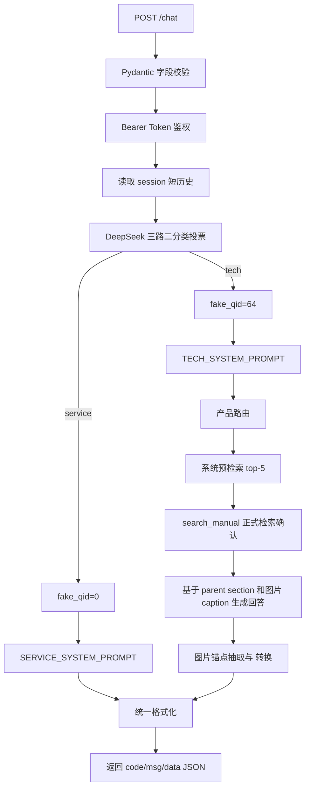

# 智能体 API 接口说明

## 1. 接口定位

本系统以 RESTful API 形式提供多模态客服智能体能力。初赛提交版对外提供 1 个核心对话端点：

```text
POST /chat
```

该端点用于接收用户问题、可选 Base64 图片、会话标识，并返回统一 JSON 格式的智能体回答。系统同时提供健康检查端点：

```text
GET /health
```

`/health` 只用于部署验证，不作为客服交互端点。

## 2. 服务地址

默认启动方式：

```bash
./run_api.sh
```

默认监听：

```text
http://0.0.0.0:8000
```

本机测试地址：

```text
http://127.0.0.1:8000
```

如需调整监听地址或端口：

```bash
HOST=127.0.0.1 PORT=8000 ./run_api.sh
```

## 3. 鉴权方式

`POST /chat` 使用 Bearer Token 鉴权。

默认提交版 token：

```text
replace-with-random-token
```

请求头：

```text
Authorization: Bearer <your-token>
Content-Type: application/json
```

如评审环境需要替换 token，可修改 `config_runtime.py` 中的 `KAFU_API_TOKEN`，或在启动前设置同名环境变量。

## 4. 核心端点：POST /chat

### 4.1 请求方法

```text
POST /chat
```

### 4.2 Content-Type

```text
application/json; charset=utf-8
```

### 4.3 请求体

```json
{
  "question": "椅子的扶手使用一段时间后为什么会松动？",
  "images": [],
  "session_id": "demo-session",
  "stream": false
}
```

### 4.4 请求字段

| 字段 | 类型 | 必选 | 约束 | 说明 |
| --- | --- | --- | --- | --- |
| `question` | string | 是 | 去除首尾空白后长度需大于 0 | 用户问题。可为客服咨询、产品安装、使用说明、故障排查、部件识别等 |
| `images` | array[string] | 否 | 默认最多 3 张；单张默认不超过 5MB | Base64 data URL 图片数组，支持 `png`、`jpg`、`jpeg`、`webp` |
| `session_id` | string | 否 | 建议传入稳定字符串 | 会话标识。用于日志关联和内存态短历史拼接；未传时服务端自动生成 |
| `stream` | boolean | 否 | 当前同步返回 | 协议兼容字段。初赛版不进行流式分片 |

### 4.5 Base64 图片格式

图片必须使用 data URL 格式：

```text
data:image/png;base64,iVBORw0KGgoAAAANSUhEUg...
```

支持 MIME：

```text
image/png
image/jpeg
image/jpg
image/webp
```

接口层会校验图片数量、data URL 格式和解码后大小。不合法时返回请求校验错误。图片可随本轮消息进入上游模型；本系统在初赛中的稳定多模态能力主要来自手册插图、图片 caption、图文锚点和 RAG 证据链。

## 5. 请求示例

### 5.1 文本问题

```bash
curl -sS -X POST http://127.0.0.1:8000/chat \
  -H "Authorization: Bearer $KAFU_API_TOKEN" \
  -H 'Content-Type: application/json' \
  -d '{
    "question": "椅子的扶手使用一段时间后为什么会松动？",
    "session_id": "demo"
  }'
```

### 5.2 带图片字段的问题

```bash
curl -sS -X POST http://127.0.0.1:8000/chat \
  -H "Authorization: Bearer $KAFU_API_TOKEN" \
  -H 'Content-Type: application/json' \
  -d '{
    "question": "请结合图片判断这个部件应该如何安装？",
    "images": [
      "data:image/png;base64,iVBORw0KGgoAAAANSUhEUg..."
    ],
    "session_id": "demo-image",
    "stream": false
  }'
```

### 5.3 客服类问题

```bash
curl -sS -X POST http://127.0.0.1:8000/chat \
  -H "Authorization: Bearer $KAFU_API_TOKEN" \
  -H 'Content-Type: application/json' \
  -d '{
    "question": "如果商品到货后有问题，应该如何申请售后？",
    "session_id": "service-demo"
  }'
```

## 6. 成功响应

### 6.1 响应结构

```json
{
  "code": 0,
  "msg": "success",
  "data": {
    "answer": "扶手使用一段时间后松动，通常是因为扶手和椅背的螺丝在使用过程中逐渐松动。\n\n重新拧紧相关螺丝即可解决。",
    "session_id": "demo",
    "timestamp": 1781320057
  }
}
```

### 6.2 响应字段

| 字段 | 类型 | 说明 |
| --- | --- | --- |
| `code` | integer | 业务状态码。`0` 表示成功 |
| `msg` | string | 状态描述。成功时为 `success` |
| `data.answer` | string | 智能体最终回答 |
| `data.session_id` | string | 本次响应对应的会话 ID |
| `data.timestamp` | integer | 服务端响应时间戳，Unix 秒级 |

## 7. answer 格式

`data.answer` 与离线提交的 `ret` 字段同源，由 `submission_utils.py` 统一格式化。

### 7.1 客服类回答

客服问题返回自然语言文本，不附加手册图片数组。

示例：

```text
您可以先确认商品问题类型，并保留订单信息、商品照片或问题描述，再按平台售后流程提交申请。具体可处理范围以订单页展示的售后入口为准。
```

### 7.2 产品技术类回答

产品技术问题基于手册证据生成。若需要引用手册插图，正文中使用 `<PIC>` 标记，末尾保留图片数组字符串。图片数组顺序与正文 `<PIC>` 出现顺序一致。

示意：

```text
请先确认固定孔位和安装方向，再按说明将支架与主体对齐。<PIC>

["Manual33_10.png"]
```

系统内部使用 `[[PIC:文件名]]` 作为证据锚点，最终转换为 `<PIC>` 与图片数组，减少图片错配、跨手册混图和模型编造图片名。

## 8. 错误响应

### 8.1 常见 HTTP 状态码

| HTTP 状态码 | 场景 | 说明 |
| ---: | --- | --- |
| 401 | 鉴权失败 | 缺少 `Authorization`、Bearer Token 格式错误或 token 不匹配 |
| 422 | 请求校验失败 | `question` 为空、字段类型错误、图片格式不合法、图片数量或大小超限 |
| 500 | 服务内部错误 | Agent、检索引擎或上游模型出现未预期异常 |
| 503 | 服务端 token 未配置 | `KAFU_API_TOKEN` 为空时拒绝 `/chat` 请求 |
| 504 | 执行超时 | 智能体链路超过文本或多模态请求超时时间 |

### 8.2 错误示例

```json
{
  "detail": "invalid bearer token"
}
```

字段校验错误使用 FastAPI/Pydantic 标准错误结构，便于定位请求格式问题。

## 9. 辅助端点：GET /health

### 9.1 请求

```bash
curl http://127.0.0.1:8000/health
```

### 9.2 响应示例

```json
{
  "status": "ok",
  "engine_ready": true,
  "timeout_s": 50.0,
  "multimodal_timeout_s": 60.0,
  "auth_configured": true,
  "classifier_provider": "deepseek_binary_vote",
  "classifier_configured": true,
  "classifier_model": "deepseek-v4-flash"
}
```

### 9.3 字段说明

| 字段 | 说明 |
| --- | --- |
| `status` | API 进程状态。`ok` 表示服务进程正常 |
| `engine_ready` | 检索引擎是否已初始化 |
| `timeout_s` | 文本请求超时时间 |
| `multimodal_timeout_s` | 携带图片请求的超时时间 |
| `auth_configured` | `/chat` 鉴权 token 是否已配置 |
| `classifier_provider` | service / tech 路由器类型 |
| `classifier_configured` | 分类器 endpoint 和 key 是否已配置 |
| `classifier_model` | 分类器模型名称 |

## 10. 在线处理流程



该 service / tech 入口分类器已在公开题集上做过 5 次全量重复测试，每次均为 400/400，准确率 100%。

## 11. 一键验证

提交包提供 smoke 脚本：

```bash
./smoke_test.sh
```

脚本会依次验证：

1. `GET /health` 是否返回 `status=ok`；
2. `POST /chat` 是否可完成鉴权、路由、检索、生成和统一 JSON 响应。

完整验证口径见 `04_验证报告.md`。
