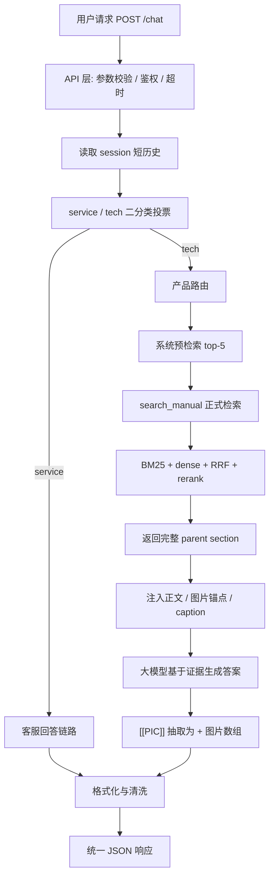
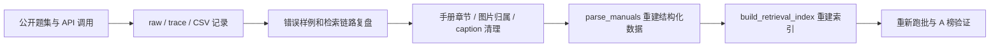

# 技术方案说明

## 1. 方案概述

KBrag V6 面向「具有多模态能力的客服智能体设计」赛题，目标是在统一 `/chat` 接口下处理两类问题：

1. 通用客服问题，如订单、售后、服务流程、购买咨询；
2. 产品技术问题，如安装、使用、维护、故障排查、部件识别、图文说明。

系统以产品手册文本、手册插图和图片 caption 为知识基础，通过客服/技术分轨、产品路由、混合检索、parent section 返回、图文锚点和格式化输出，形成可复核的多模态 RAG 客服智能体。

## 2. 总体架构



该架构将“输入处理、意图路由、产品定位、证据检索、图文绑定、答案生成、输出格式化”拆分为独立模块，便于验证、替换和问题定位。

## 3. 核心痛点与对应解决方案

| 赛题痛点 | 方案设计 |
| --- | --- |
| 客服问题和产品技术问题边界不同 | 在线 `/chat` 先做 service / tech 二分类，分别进入客服 prompt 或技术 RAG 链路 |
| 产品手册多、术语多、跨语言表达多 | 产品路由 + BM25 + dense + RRF + rerank 组合召回 |
| 手册答案常依赖图片、部件和步骤 | 手册解析阶段保留图片锚点，检索结果注入 `[[PIC:文件名]]` 和图片 caption |
| 小 chunk 容易漏上下文，大 section 又容易干扰 | chunk 作为召回单元，命中后返回完整 parent section |
| 大模型容易泛化补充或编造图片 | 技术 prompt 要求基于检索证据，formatter 只接受证据中的图片锚点 |
| 评审需要可部署、可验证 | 提供启动脚本、smoke 脚本、静态自检脚本、参考 CSV 和 Markdown 交付文档 |

## 4. 客服 / 技术分轨

在线 `/chat` 没有离线题号，因此路由判断在 `api_server.py` 中完成。系统先使用 DeepSeek V4 Flash 三路二分类投票判断问题来源，再把结果映射为 `fake_qid` 复用 `agent.py` 的离线硬路由逻辑：

```text
route=service → fake_qid=0  → SERVICE_SYSTEM_PROMPT
route=tech    → fake_qid=64 → TECH_SYSTEM_PROMPT + 产品路由 + 手册 RAG
```

三路 prompt 的代码名称为 `service_guard`、`tech_recall`、`answer_source`。三路并发调用后，系统只接受纯 `0/1` 输出：`0=service`，`1=tech`，再按投票结果决定路由。该入口分类器在公开题集上做过 5 次全量重复测试，每次均为 400/400，准确率 100%。

这种分轨的代码边界是：service 分支通过 `fake_qid=0` 选择 `SERVICE_SYSTEM_PROMPT`，并跳过产品路由和系统预检索；tech 分支通过 `fake_qid=64` 进入产品路由、预检索和 `search_manual`。当前 `run_agent()` 仍传入同一个 `TOOLS` 列表，service prompt 明确要求不要调用任何搜索或技能工具。

## 5. 产品路由

技术问题进入 RAG 前，需要判断涉及的产品或手册。系统采用两级路由：

1. 显式匹配：产品名、型号、别名、手册名；
2. 内容投票：问题未明确产品时，根据候选手册内容进行软匹配。

产品路由只用于缩小检索范围，不作为最终答案来源。对于模糊问题，系统保留候选空间，允许后续 `search_manual` 检索自纠。

## 6. 多模态 RAG 检索

### 6.1 检索链路

```text
query
  ↓
BM25 sparse retrieval
  +
dense vector retrieval
  ↓
RRF 融合
  ↓
rerank 精排
  ↓
chunk 命中
  ↓
完整 parent section 返回
```

### 6.2 BM25

BM25 负责精确术语召回，适合产品名、部件名、按钮名、错误码、型号、英文缩写和手册原文关键词。

### 6.3 Dense 向量检索

Dense 检索负责语义召回，适合用户口语化表达、同义说法和跨语言描述。

### 6.4 RRF 融合与 rerank

RRF 用于融合 BM25 与 dense 的候选排序，降低单一路径失效风险。rerank 对融合候选进行二次排序，使最终进入模型的证据更贴近用户问题。

### 6.5 Chunk 检索与 Parent Section 返回

系统使用 chunk 做召回和排序，但最终返回完整 parent section。原因是产品手册中的有效答案经常跨越步骤、注意事项、图片说明和例外条件。只返回小 chunk 容易漏关键上下文；直接返回过大章节又会引入干扰。parent section 是当前版本在精确性与完整性之间的折中。

## 7. 图文绑定与多模态信息解析

### 7.1 图片锚点

手册解析阶段将图片与章节文本绑定，在检索证据中保留：

```text
[[PIC:图片文件名]]
```

模型回答时只保留与问题直接相关的图片锚点。最终由 `submission_utils.py` 将内部锚点转换为平台格式：

```text
正文 <PIC>

["图片文件名.png"]
```

图片数组顺序严格按正文 `<PIC>` 出现顺序生成。

### 7.2 图片 caption

`data/image_captions_v4_final.json` 维护图片语义描述，用于说明图片中的：

- 部件；
- 按钮；
- 接口；
- 方向箭头；
- 状态灯；
- 安装位置；
- 表格或示意图含义。

caption 作为辅助证据进入检索和生成上下文，帮助模型判断图片是否与问题相关。caption 不替代手册正文，也不要求模型逐字照抄。

### 7.3 用户上传图片

`/chat` 支持 Base64 data URL 图片字段。接口层会完成格式、数量和大小校验，并可将图片作为本轮多模态消息传入模型。当前初赛版的稳定评分来源仍以“手册文本 + 手册插图 + caption + 图文锚点”的知识库多模态链路为主。

## 8. ReAct 工具流程

技术链路仅暴露一个主动检索工具：

```text
search_manual
```

工具说明写在：

```text
skills/search_manual.md
```

当前策略：

- 技术题正式回答前至少调用一次 `search_manual`；
- 系统预检索只作为首轮定位线索，不能替代正式工具检索；
- `search_manual` 最多允许两次，第二次仅用于证据明显错路由或完全不覆盖问题时的补救；
- 若第一次检索已命中最相关 parent section，应直接基于证据收束；
- 不重新启用旧版 `manual_reader/use_skill/list/read` 工具链，减少无效轮次和超时风险。

## 9. 幻觉抑制机制

| 风险 | 抑制方式 |
| --- | --- |
| 技术题凭常识回答 | 技术 prompt 要求基于手册证据；回答前必须 `search_manual` 显式确认 |
| 错产品或错章节 | 产品路由、预检索、正式检索和 rerank 多层校正 |
| 回答过度发散 | V6 prompt 收窄为同一最相关章节内的直接补充 |
| 编造图片名 | 只允许使用检索证据中的 `[[PIC:文件名]]`；formatter 统一抽取 |
| 图片无关或顺序错 | 图片随正文锚点排序，不用无关图片凑数 |
| 客服题混入技术格式 | service / tech 分轨，客服题走独立 prompt 和客服清洗 |
| 平台格式不兼容 | 最终输出由 `submission_utils.py` 统一处理 |

## 10. 对话记忆管理

接口支持 `session_id`。API 层为同一 `session_id` 保留内存态短历史，并在下一轮请求前拼接为上下文前缀，让系统能处理轻量连续追问。

当前边界：

- 历史只保存在当前进程内存中；
- 默认保留最近若干条消息；
- 服务重启后历史清空；
- 未接入 Redis、数据库或长期用户画像。

该设计满足初赛对多轮入口和连续追问的验证需要，同时避免复杂持久化状态影响评审部署。

## 11. 自主学习与迭代闭环

提交版不在评审请求过程中自动写回知识库，也不在线修改 prompt 或手册。这样做是为了避免未审核内容污染手册证据。

系统的“自主演进”体现在离线闭环：



这一路径可以持续提升系统质量，同时保持正式运行时知识库可控、可审计。

## 12. 可观测性

系统支持以下观测信息：

- API 请求 ID、session ID、耗时、图片数量；
- service / tech 分类结果和三路投票输出；
- 产品路由结果；
- 系统预检索命中；
- `search_manual` 工具调用；
- 检索命中的 parent section；
- 图片锚点和最终图片数组；
- 原始回答与格式化回答。

离线跑批可生成 `csv + raw.jsonl + trace.jsonl`，用于回看检索、生成和图片引用链路。提交包中不保留大量临时 trace，避免影响交付清洁度。

## 13. 技术亮点

1. **统一 API 下的双轨智能体**：一个 `/chat` 同时处理客服与产品技术问题，入口统一、内部路径分离。
2. **多阶段产品定位**：显式匹配和内容投票结合，降低相似产品误路由风险。
3. **Hybrid RAG 与 parent section 返回**：chunk 负责精确召回，parent section 保证回答上下文完整。
4. **图文锚点闭环**：图片从手册解析、检索证据、模型回答到最终 `<PIC>` 输出保持同一链路。
5. **Caption 辅助理解**：图片语义描述进入检索和证据判断，增强多模态问答稳定性。
6. **检索工具纪律**：保留 `search_manual` 一个主工具，明确何时检索、何时停止，降低超时和无效搜索。
7. **可部署交付包**：内置索引、手册、插图、默认配置、启动脚本和验证脚本，便于评审复现。

## 14. 初赛版本总结

KBrag V6 以手册证据驱动产品技术问答，以客服/技术分轨保证不同问题的回答边界，以图文锚点和 caption 解决多模态证据对齐问题。系统已封装为可启动、可调用、可验证的 RESTful API 服务，满足初赛对 API、源码、技术文档和验证报告的核心要求。
