# Air Fryer

# Important Safety Information

## Danger

### Core Prohibitions During Operation

Always put the ingredients to be fried in the basket, to prevent them from coming into contact with the heating elements. Do not cover the air inlet and the air outlet openings while the appliance is operating. Do not fill the pan with oil as this may cause a fire hazard. Never immerse the appliance in water or any other liquid, nor rinse it under the tap. Do not let any water or other liquid enter the appliance. Never put any amount of food that exceeds the maximum level indicated in the basket. Never touch the inside of the appliance while it is operating. Always make sure the heater is free and no food is stuck in heater.

## Warning

### Voltage, Plug and Cord Safety

Check if the voltage indicated on the appliance corresponds to the local mains voltage before you connect the appliance. Do not use the appliance if the plug, the mains cord or the appliance itself is damaged. If the mains cord is damaged, you must have it replaced by a service centre authorised by or similarly qualified persons in order to avoid a hazard.

### Children and Supervised Users

This appliance can be used by children aged from 8 years and above and persons with reduced physical, sensory or mental capabilities or lack of experience and knowledge if they have been given supervision or instruction concerning use of the appliance in a safe way and understand the hazards involved. Children shall not play with the appliance. Cleaning and user maintenance shall not be made by children unless they are older than 8 years and supervised. Keep the appliance and its cord out of reach of children less than 8 years.

### Cord Position, Socket and Appliance Clearance

Keep the mains cord away from hot surfaces. Only connect the appliance to an earthed wall socket. Always make sure that the plug is inserted into the wall socket properly. Do not place the appliance against a wall or against other appliances. Leave at least 10 cm free space on the back and sides and 10 cm free space above the appliance. Do not place anything on top of the appliance. Do not use the appliance for any other purpose than described in the user manual.

### Steam, Hot Surfaces and Fire Prevention

During hot air frying, hot steam is released through the air outlet openings. Keep your hands and face at a safe distance from the steam and from the air outlet openings. Also be careful of hot steam and air when you remove the pan from the appliance. The accessible surfaces may become hot during use. The pan, the basket and accessories inside the Airfryer become hot during use. Be careful when you handle them. Do not place the appliance on or near a hot gas stove or all kinds of electric stove and electric cooking plates, or in a heated oven. Never use light ingredients or baking paper in the appliance. Do not place the appliance on or near combustible materials such as a tablecloth or curtain. Do not let the appliance operate unattended.

### Smoke, Potato Storage and Operating Conditions

Immediately unplug the appliance if you see dark smoke coming out of the appliance. Wait for the smoke emission to stop before you pull the pan out of the appliance. Storage of potatoes: The temperature shall be appropriate to the potato variety stored and it shall be above 6°C to minimize the risk of acrylamide exposure in the prepared foodstuff. Do not plug in the appliance or operate the control panel with wet hands. This appliance is designed to be used at ambient temperatures between 5°C and 40°C.

## Caution

### Household Use Scope

This appliance is intended for normal household use only. It is not intended for use in environments such as staff kitchens of shops, offices, farms or other work environments. Nor is it intended to be used by clients in hotels, motels, bed and breakfasts and other residential environments.

### Service, Repair and Guarantee Conditions

Always return the appliance to a service centre authorised by for examination or repair. Do not attempt to repair the appliance yourself, otherwise the guarantee becomes invalid. If the appliance is used improperly or for professional or semi-professional purposes or if it is not used according to the instructions in the user manual, the guarantee becomes invalid and refuses any liability for damage caused.

### Placement, Cooling and Food Safety

Always place and use the appliance on a dry stable, level and horizontal surface. Always unplug the appliance after use. Let the appliance cool down for approx. 30 minutes before you handle or clean it. Make sure the ingredients prepared in this appliance come out golden-yellow instead of dark or brown. Remove burnt remnants. Do not fry fresh potatoes at a temperature above 180°C (to minimise the production of acrylamide). Be careful when cleaning the upper area of the cooking chamber: Hot heating element, edge of Metal parts. Always make sure that the food is fully cooked in the Airfryer. Always make sure that you have the control over your Airfryer, also when using the remote function or delayed start. When cooking fatty food, the Airfryer could emit smoke. Pay special attention when using the remote control function or delayed start. Make sure that only one person at a time is using the remote control function. Be cautious when cooking easy perishable food with the delayed start function (bacteria may breed).

## Electromagnetic Fields (EMF) & Automatic Shut-off

### EMF Compliance and Auto Shut-off Function

This appliance complies with all applicable standards and regulations regarding electromagnetic fields. This appliance is equipped with an automatic shut-off function. If you do not press a button within 20 minutes, the appliance switches off automatically. To switch off the appliance manually, press the power On/Off button.

# General Description & App Setup

## Introduction

### Product Overview and Rapid Air Technology

Congratulations on your purchase and welcome to\! To fully benefit from the support that offers, register your product at. Airfryer is the only Airfryer with unique Rapid Air technology to fry your favorite foods with little or no added oil and up to 90 less fat. Rapid Air technology cooks food all around as well as our starfish design for perfect results from your first bite to your last. You can now enjoy perfectly cooked fried food-crispy on the outside tender on the inside-Fry, grill, roast and bake to prepare a variety of tasty dishes in a healthy, fast and easy way. For more inspiration, recipes and information about the Airfryer, visit.

## General Description

### Control Panel and Main Components

1 Control panel
A Temperature up button
B Temperature down button
C Menu button
D Preset menus
E On/Off button
F Time down button
G Time up button
H Time indicator
I Screen
J Temperature indicator
K Wi-Fi indicator
2 MAX indication
3 Basket
4 Basket release button
5 Pan
6 Power cord
7 Air outlets
8 Air inlet
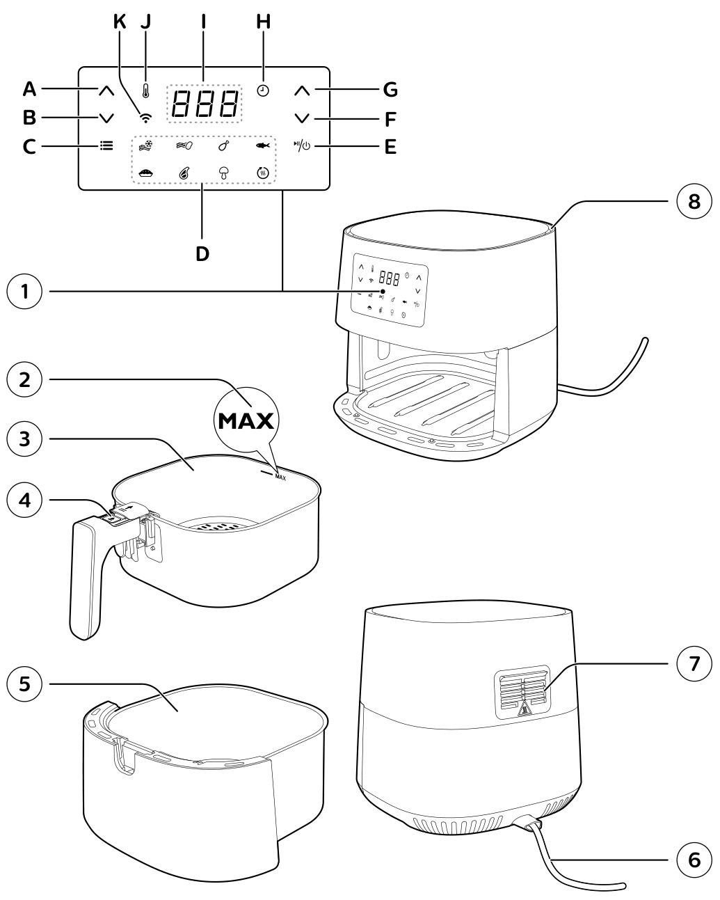
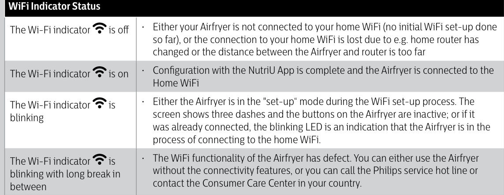

## The NutriU App

### App Features and Remote Cooking

Your Airfryer is Wi-Fi enabled and allows you to connect with the App to gain the full Airfryer experience. Within the App you can select your favorite recipes, send it to the Airfryer and start it from your smart device. You can start, monitor and adjust the cooking process on your smart device from wherever you are, even if you are not at home.

### Wi-Fi Setup and Pairing Steps

Connecting your Airfryer to the App:
1 Put the plug of the Airfryer in the wall outlet.
2 Make sure that your smart device is within reach of your home Wi-Fi network before you start the easy Wi-Fi set-up process.
3 Download the App on your smart device from the App store or from the registration process and select the connected Airfryer in your profile under "My Appliances".
4 Follow the instructions in the App to connect your Airfryer to your Wi-Fi and to pair your Airfryer.
5 When the Wi-Fi LED on the user interface of the Airfryer is solid on, the Airfryer is connected.

### Wi-Fi Requirements and Pairing Rules

Note: Make sure to connect your Airfryer to a 2.4 GHz 802.11 b/g/n home Wi-Fi. The easy Wi-Fi set-up is needed to connect the Airfryer to your home Wi-Fi. The pairing process is to connect the NutriU App with your smart Airfryer. The Wi-Fi setup process can be cancelled via the App or by unplugging the Airfryer. You can pair only one smart device at the same time to your Airfryer. If a second user starts the pairing process, the first user is kicked out and has to pair again the next time when cooking with the Airfryer. To start the pairing process, long press the temperature down button and follow the instructions in the App, or start it from the settings in the NutriU App.

## Voice Control

### Voice Assistant Setup and Commands

1.  Download the NutriU App.
2.  Connect the NutriU App with your Airfryer.
3.  Give consent to "remote cooking".
4.  Connect the NutriU App with your voice assistant App. This connection can be done directly while onboarding or later in the settings of the NutriU App. In case you do not see the option to activate voice control in NutriU, activate the Kitchen+ skill through your voice assistant App.

Note: If you do not have a voice control App, download it first to send commands to the Airfryer. Detailed voice commands are available in the App for voice control.

# Using the Appliance

## Before First Use & Preparing for Use

### Before First Use (Unpacking)

1 Remove all packing material.
2 Remove any stickers or labels (if available) from the appliance.
3 Thoroughly clean the appliance before first use, as indicated in the cleaning chapter.

### Preparing for Use (Placement)

Place the appliance on a stable, horizontal, level and heat-resistant surface.

Note: Do not put anything on top or on the sides of the appliance. This could disrupt the air flow and affect the frying result. Do not place the operating appliance near or underneath objects that could be damaged by steam, such as walls and cupboard. Leave the rubber plug in the pan. Do not remove it before cooking. 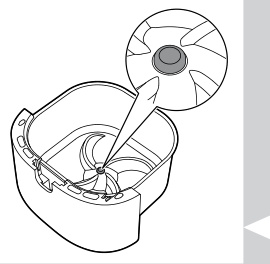

## Food Table

### Basic Cooking Settings and Shaking Guidance

The table below helps you select the basic settings for the types of food you want to prepare. Keep in mind that these settings are suggestions. As ingredients differ in origin, size, shape as well as brand, we cannot guarantee the best setting for your ingredients. 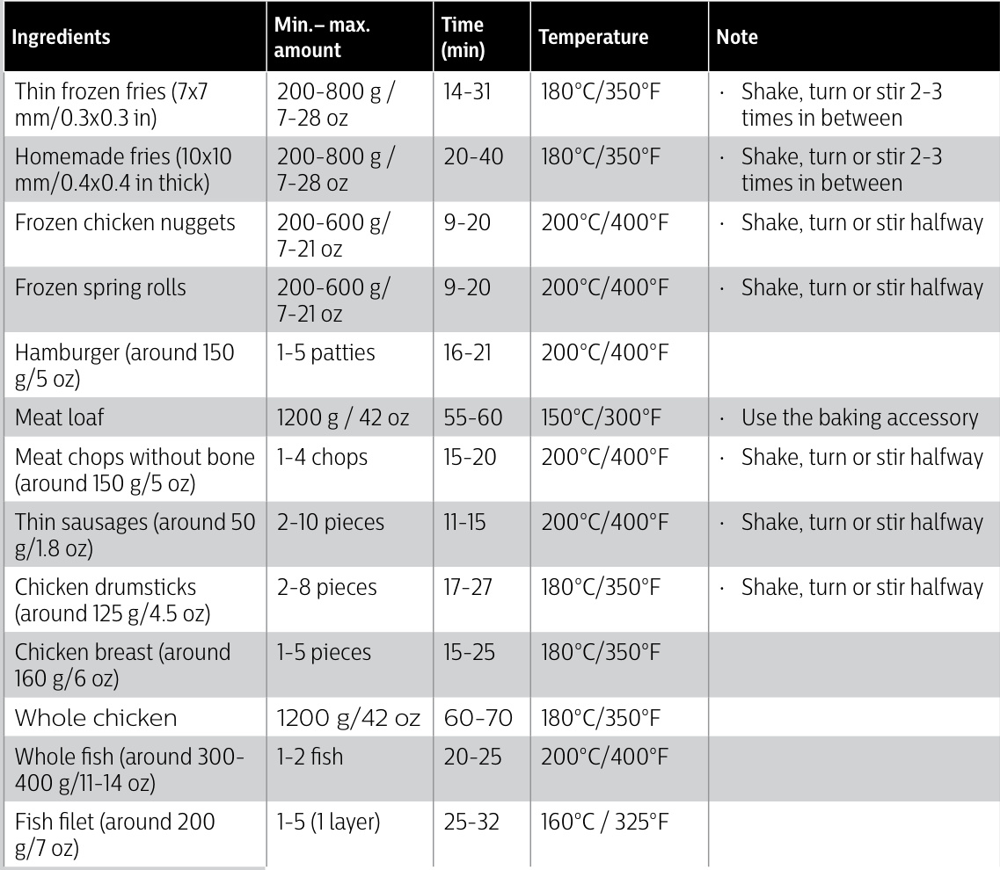 When preparing a larger amount of food (e.g. fries, prawns, drumsticks, frozen snacks), shake, turn, or stir the ingredients in the basket 2 to 3 times in order to achieve a consistent result. 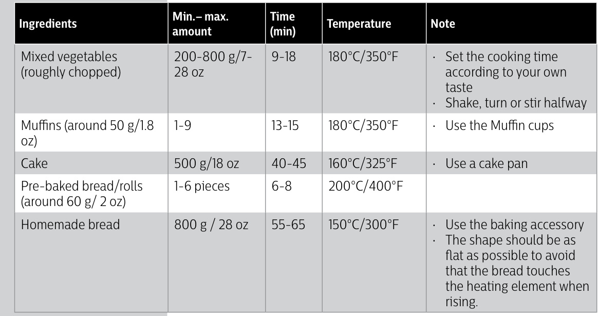

## Airfrying

### Hot Air Safety and First-time Use

Caution: This is an Airfryer that works on hot air. Do not fill the pan with oil, frying fat or any other liquid. Do not touch hot surfaces. Use handles or knobs. Handle the hot pan with oven-safe gloves. This appliance is for household use only. This appliance may produce some smoke when you use it for the first time. This is normal. Preheating of the appliance is not necessary. 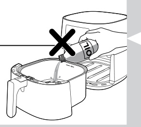

### Plug In, Remove the Pan and Add Ingredients

1 Put the plug in the wall outlet. 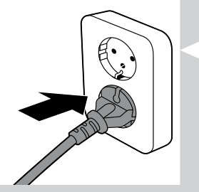
2 Remove the pan with the basket from the appliance by pulling the handle. 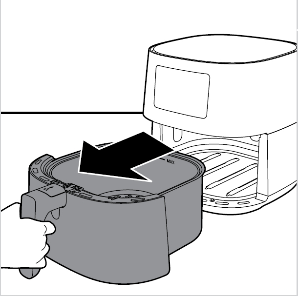
3 Put the ingredients in the basket.

Note: The Airfryer can prepare a large range of ingredients. Consult the 'Food table' for the right quantities and approximate cooking times. Do not exceed the amount indicated in the 'Food table' section or overfill the basket beyond the "MAX" indication as this could affect the quality of the end result. If you want to prepare different ingredients at the same time, make sure you check the suggested cooking time required for the different ingredients before you start to cook them simultaneously. 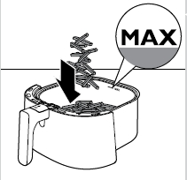

### Insert the Pan and Set Cooking Parameters

4 Put the pan with the basket back into the Airfryer. 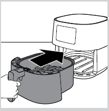

Caution: Never use the pan without the basket in it. Do not touch the pan or the basket during and for some time after use, as they get very hot.

5 Press the power On/Off button to switch on the appliance. 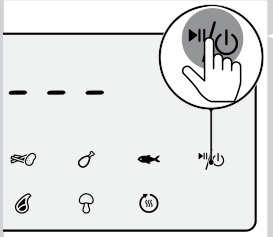
6 Press the temperature up or down button to choose the needed temperature. 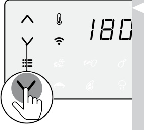
7 Press the time up button to choose the needed time. 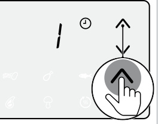
8 Press the On/Off button to start the cooking process. 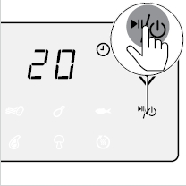

### Monitor, Adjust and Shake During Cooking

Note: During cooking the temperature and time are shown alternately. The last cooking minute counts down in seconds. Refer to the food table with basic cooking settings for different types of food. When the cooking process is started and your Airfryer is paired with your smart device, you can see, control and change the cooking parameters also in the NutriU App. To change the temperature unit from Celsius to Fahrenheit or the other way around on your Airfryer, press the temperature up and down button at the same time for about 10 seconds.

Tip: During cooking, if you want to change the cooking time or temperature, press the corresponding up or down button at any time to do so. To pause the cooking process, press the On/Off button. To resume the cooking process, press the On/Off button again to continue the cooking process. The device is automatically in pause mode when you pull out the pan and the basket. The cooking process continues when the pan and the basket are put in the appliance again. If you do not set the required cooking time within 30 minutes, the appliance automatically shuts off for safety reasons. Some ingredients require shaking or turning halfway through the cooking time (see 'Food table'). To shake the ingredients, pull out the pan with the basket, place it on a heat resistant work top, slide the lid and press the basket release button to remove the basket and shake the basket over the sink. Then put the basket into the pan, and slide them back into the appliance. If you set the timer to the half of the cooking time and you hear the timer bell it is time to shake or turn the ingredients. Be sure to reset the timer to the remaining cooking time. 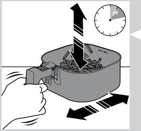

### End Cooking and Check Doneness

9 When you hear the timer bell, the cooking time has elapsed. You can stop the cooking process manually. To do this, press the On/Off button. 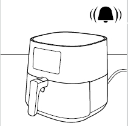
10 Pull out the pan and check if the ingredients are ready. 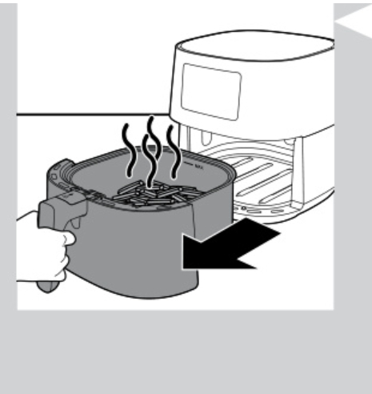

Caution: The Airfryer pan is hot after the cooking process. Always place it on a heat resistant work top (e.g. trivet, etc.) when you remove the pan from the device.

Note: If the ingredients are not ready yet, simply slide the pan back into the Airfryer by the handle and add a few extra minutes to the set time.

### Remove, Serve and Start Another Batch

11 To remove small ingredients (e.g. fries), lift the basket out of the pan by sliding the lid first, and then pressing the basket release button. 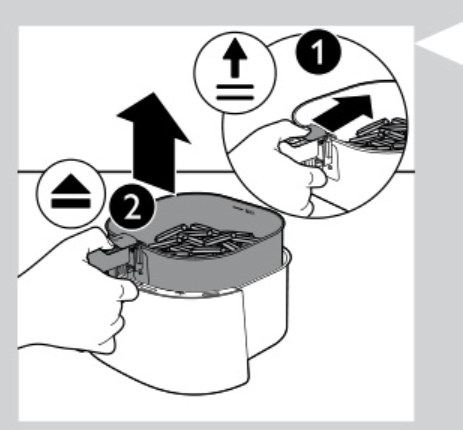

Caution: After the cooking process, the pan, the basket, the interior housing and the ingredients are hot. Depending on the type of ingredients in the Airfryer, steam may escape from the pan.

12 Empty the basket contents into a bowl or on to a plate. Always remove the basket from the pan to empty contents as hot oil may be in the bottom of the pan. 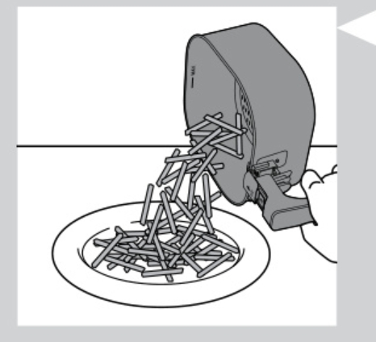

Note: To remove large or fragile ingredients, use a pair of tongs to lift out the ingredients. Excess oil or rendered fat from the ingredients is collected on the bottom of the pan. Depending on the type of ingredients cooking, you may want to carefully pour off any excess oil or rendered fat from the pan after each batch or before shaking or replacing the basket in the pan. Place the basket on a heat-resistant surface. Wear oven-safe gloves to pour off excess oil or rendered fat. Return the basket into the pan. When a batch of ingredients is ready, the Airfryer is instantly ready for preparing another batch. Repeat steps 3 to 12 if you want to prepare another batch.

## Choosing the Keep Warm Mode

### Keep Warm Operation and Usage Notes

1 Press the menu button as often as the keep warm icon is blinking. 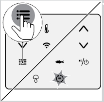
2 Press the On/Off button to start the keep warm mode. 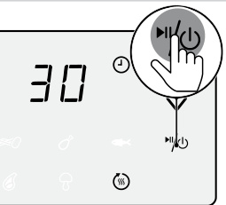

Note: The keep warm timer is set to 30 minutes. To change the keep warm time (1-30 minutes), press the time down button. The time will be confirmed automatically. The temperature cannot be changed in keep warm mode.

3 To pause the keep warm mode, press the On/Off button. To resume the keep warm mode, press the On/Off button again.
4 To exit the keep warm mode, long press the On/Off button.

Tip: If food like French fries loses too much crispness during the keep warm mode, either shorten the keep warm time by switching off the appliance earlier or crisp them up for 2-3 minutes at the temperature of 180/350.

Note: During the keep warm mode, the fan and heater inside of the appliance turn on from time to time. The keep warm mode is designed to keep your food warm immediately after it is cooked in the Airfryer. It is not meant for reheating.

## Cooking with a Preset

### Preset Selection and Preset Information

1 Follow steps 1 to 5 in chapter "Airfrying".
2 Press the Menu button. The frozen snacks icon is blinking. Press the Menu button as often as your needed preset is blinking. 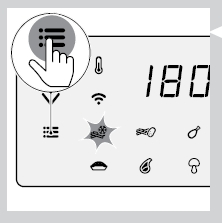
3 Start the cooking process by pressing the On/Off button.

Note: In the following table you can find more information about the presets. 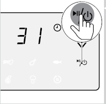 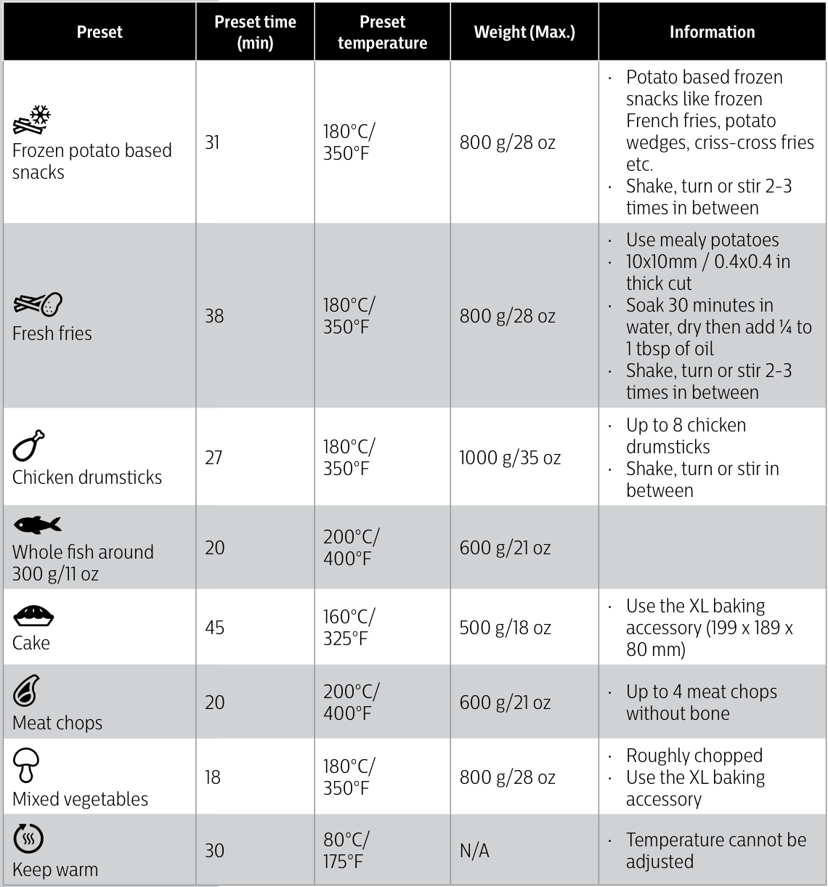

## Changing to Another Preset

### Stop Current Cooking and Select a New Preset

1 During the cooking process long press the power On/Off button to stop the cooking process. The device is then in stand-by mode. 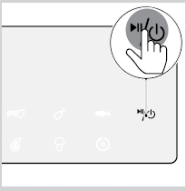
2 Press the On/Off button again to turn on the device. 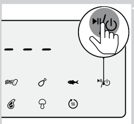
3 Press the menu button as often as your needed preset is blinking. 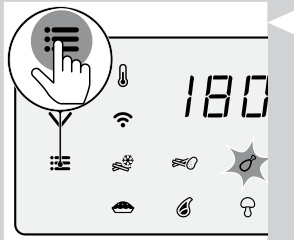
4 Press the On/Off button to start the cooking process. 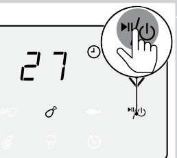

## Starting a Recipe from the NutriU App

### Start, Monitor and Adjust App-based Recipes

1 Press the On/Off button to turn on the Airfryer.
2 Open the NutriU App on your smart device and look for your preferred recipe.
3 Open the recipe and start the cooking process in the App.

Note: Make sure that when cooking recipes that are developed for your Airfryer, use the same amount of food mentioned in the recipes. When using different ingredients or a different amount of food items, adjust the cooking time. When cooking recipes that are not developed for your Airfryer, be aware the time and temperature might be adjusted. Via the filter in the recipe search you can filter your smart Airfryer to get the recipes that are developed for your device. When the cooking process is started from the App, you can see the cooking settings also on the screen of the Airfryer. You can pause the cooking process or change the settings on the Airfryer or in the App. When the cooking process is over you can start the keep warm mode in the App or start it from the "keep warm" preset on the Airfryer. If the food is not done yet, you can also prolong the cooking process within the App or on the Airfryer. To exit the cooking process before the cooking time is over, long press the On/Off button on the Airfryer or press the pause and then the stop icon in the App. You can also start your individual time and temperature in the NutriU App. On the bottom of the Home Screen there is the button to go to the home screen, the recipes, manual mode, articles or your profile. Press the manual mode button and send your individual time and temperature to the Airfryer.

## Making Home-made Fries

### Potato Preparation and Frying Steps

To make great home-made fries in the Airfryer: Choose a potato variety suitable for making fries, e.g. fresh, (slightly) floury potatoes. It is best to air fry the fries in portions of up to 800g/28 oz for an even result. Larger fries tend to be less crispy than smaller fries.
1 Peel the potatoes and cut into sticks 10*10 / 0.4*0.4 in thick.
2 Soak the potato sticks in a bowl of water for at least 30 minutes.
3 Empty the bowl and dry the potato sticks with a dish towel or paper towel.
4 Pour one tablespoon of cooking oil into the bowl, put the sticks in the bowl and mix until the sticks are coated with oil.
5 Remove the sticks from the bowl with your fingers or a slotted kitchen utensil so excess oil remains in the bowl.

Note: Do not tilt the bowl to pour all the sticks in the basket at once to prevent excess oil from going into the pan.

6 Put the sticks into the basket.
7 Fry the potato sticks and shake the basket 2-3 times during cooking.

# Cleaning and Storage

## Cleaning

### Cooling and Non-stick Cleaning Warnings

Warning: Let the basket, the pan, and the inside of the appliance cool down completely before you start cleaning. The pan, the basket, and the inside of the appliance have a non-stick coating. Do not use metal kitchen utensils or abrasive cleaning materials as this may damage the non-stick coating. Clean the appliance after every use. Remove oil and fat from the bottom of the pan after every use.

### Clean the Pan and Basket

1 Press the power On/Off button to switch off the appliance, remove the plug from the wall outlet and let the appliance cool down. Remove the pan and the basket to let the Airfryer cool down more quickly.
2 Dispose of rendered fat or oil from the bottom of the pan.
3 Clean the pan and the basket in a dishwasher. You can also clean them with hot water, dish washing liquid and a non-abrasive sponge (see 'Cleaning table').

Note: Put the pan with the rubber plug in the dishwasher. Do not remove the rubber plug before cleaning. 

### Remove Stuck Residues and Grease

Tip: If food residues stuck to the pan or the basket, you can soak them in hot water and dish washing liquid for 10-15 minutes. Soaking loosens the food residues and makes it easier to remove. Make sure you use a dish washing liquid that can dissolve oil and grease. If there are grease stains on the pan or the basket and you have not been able to remove them with hot water and dish washing liquid, use a liquid degreaser. If necessary, food residues stuck to the heating element can be removed with a soft to medium bristle brush. Do not use a steel wire brush or a hard bristle brush, as this might damage the coating on the heating element.

### Clean Exterior, Heating Element, Interior and Cleaning Table

4 Wipe the outside of the appliance with a moist cloth.

Note: Make sure no moisture remains on the control panel. Dry the control panel with a cloth after you have cleaned it. 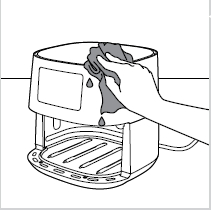

5 Clean the heating element with a cleaning brush to remove any food residues. 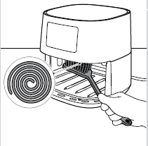
6 Clean the inside of the appliance with hot water and a non-abrasive sponge. 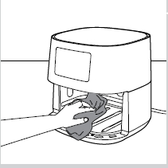

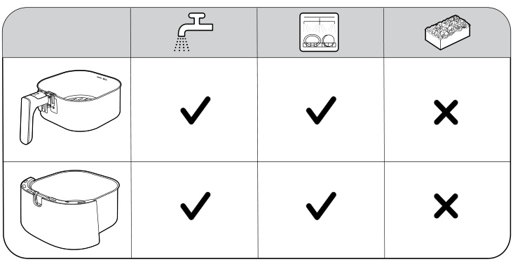
## Storage

### Cooling, Drying and Safe Carrying Before Storage

1 Unplug the appliance and let it cool down.
2 Make sure all parts are clean and dry before storing.

Note: Always hold the Airfryer horizontally when you carry it. Make sure that you also hold the pan on the front part of the appliance as the pan with the basket can slide out of the appliance if accidentally tilted downwards. This can lead to damaging of these parts. Always make sure that the removable parts of the Airfryer are fixed before you carry and/or store it.

# Additional Information

## Recycling

### Separate Collection and Disposal Requirements

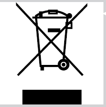 This symbol means that this product shall not be disposed of with normal household waste (2012/19/EU). Follow your country's rules for the separate collection of electrical and electronic products. Correct disposal helps prevent negative consequences for the environment and human health.

## Software Updates

### App and Firmware Update Requirements

Updating is essential to safeguard your privacy and the proper functioning of your Airfryer and the App. From time to time, the App is updating automatically to the latest software. Also the Airfryer is updating the firmware automatically.

Note: When an update is being installed, make sure that your Airfryer is connected to the home Wi-Fi. The smart device can be connected to any network. Always use the latest App and firmware. Updates are made available when there are software improvements or to prevent a security issue. A firmware update is started automatically when the Airfryer is in stand-by mode. This update takes up to 1 minute and the screen on the Airfryer shows blinking "---". During this time the Airfryer cannot be used.

## Device Compatibility

### App Compatibility Information

For detailed information about the compatibility of the App, please refer to the information in the App Store.

## Factory Reset

### Reset Button Combination and Pairing Removal

For a factory reset of the Airfryer, press the temperature and time up buttons at the same time for 10 seconds. Your Airfryer is then no more connected to your home Wi-Fi and not paired with your smart device anymore.

## Troubleshooting

### Outer Surface Heat During Operation

The outside of the appliance becomes hot during use. The heat inside radiates to the outside walls. This is normal. All handles and knobs that you need to touch during use stay cool enough to touch. 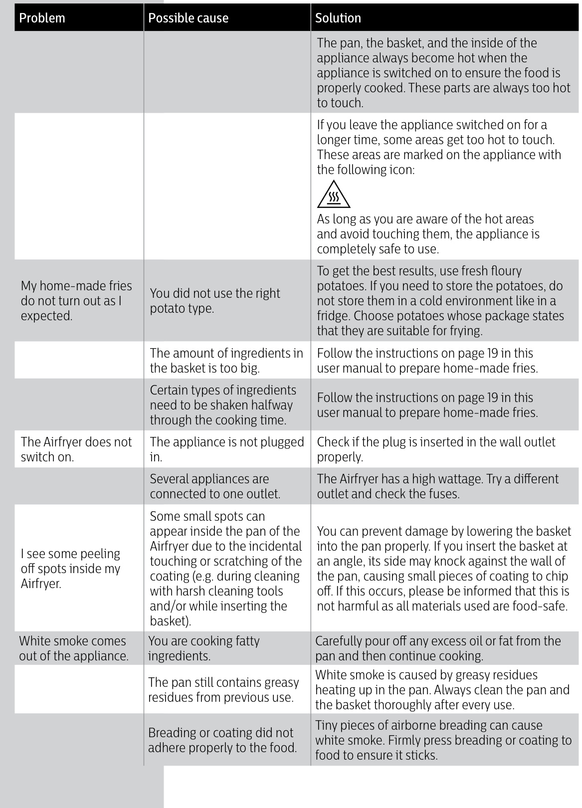 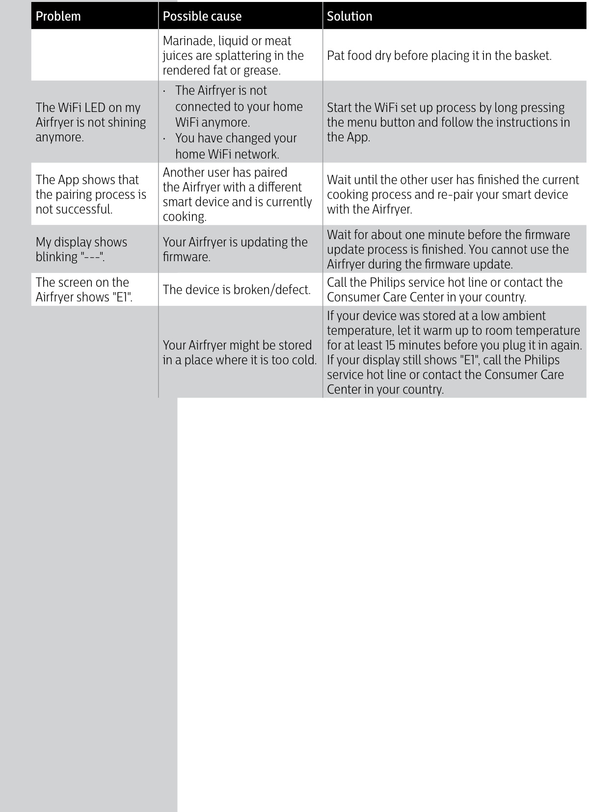

