# Camera

## Safety Warnings

Follow these safeguards and use the equipment properly to prevent injury, death, and material damage.

### Preventing Serious Injury or Death

To prevent fire, excessive heat, chemical leakage, and explosions, follow the safeguards below:

  - Do not use any batteries, power sources, and accessories not specified in this booklet. Do not use any home-made or modified batteries.
  - Do not short-circuit, disassemble, or modify the battery pack or back-up battery. Do not apply heat or apply solder to the battery pack or back-up battery. Do not expose the battery pack or back-up battery to fire or water. And do not subject the battery pack or back-up battery to strong physical shock.
  - Do not install the battery pack or back-up battery in reversed polarity (+ -). Do not mix new and old or different types of batteries.
  - Do not recharge the battery pack outside the allowable ambient temperature range of 0°C-40°C (32°F-104°F). Also, do not exceed the recharging time.
  - Do not insert any foreign metallic objects into the electrical contacts of the camera, accessories, connecting cables, etc.
### Battery Leakage, Children, and Disposal Precautions

  - Keep the back-up battery away from children. If a child swallows the battery, consult a physician immediately. (Battery chemicals may harm the stomach and intestines.)
  - When disposing of a battery pack or back-up battery, insulate the electrical contacts with tape to prevent contact with other metallic objects or batteries. This is to prevent fire or an explosion.
  - If excessive heat, smoke, or fumes are emitted during battery pack recharging, immediately unplug the battery charger from the power outlet to stop the recharging and prevent a fire.
  - If the battery pack or back-up battery leaks, changes color, deforms, or emits smoke or fumes, remove it immediately. Be careful not to get burned in the process.
  - Prevent any battery leakage from contacting your eyes, skin, and clothing. It can cause blindness or skin problems. If the battery leakage contacts your eyes, skin, or clothing, flush the affected area with lots of clean water without rubbing it. See a physician immediately.
### Charging, Cord, Flash, and Environment Safety

  - During the recharging, keep the equipment away from the reach of children. The cord can accidentally choke the child or give an electrical shock.
  - Do not leave any cords near a heat source. It can deform the cord or melt the insulation and cause a fire or electrical shock.
  - Do not fire the flash at someone driving a car. It may cause an accident.
  - Do not fire the flash near a person's eyes. It may impair the person's vision. When using flash to photograph an infant, keep at least 1 meter away.
  - Before storing the camera or accessory when not in use, remove the battery pack and disconnect the power plug. This is to prevent electrical shock, heat generation, and fire.
  - Do not use the equipment where there is flammable gas. This is to prevent an explosion or fire.
  - Do not look at the sun or an extremely bright light source through the camera or lens. Doing so may damage your vision.
  - Keep the camera from the reach of small children. The neck strap can accidentally choke the child.
  - Do not store the equipment in dusty or humid places. This is to prevent fire and electrical shock.
  - Before using the camera inside an airplane or hospital, check if it is allowed. Electromagnetic waves emitted by the camera may interfere with the plane's instruments or the hospital's medical equipment.
### Power Plug and Electrical Shock Prevention

  - To prevent fire and electrical shock, follow the safeguards below:
      - Always insert the power plug all the way in.
      - Do not handle a power plug with wet hands.
      - When unplugging a power plug, grasp and pull the plug instead of the cord.
      - Do not scratch, cut, or excessively bend the cord or put a heavy object on the cord. Also do not twist or tie the cords.
      - Do not connect too many power plugs to the same power outlet.
      - Do not use a cord whose insulation has been damaged.
  - Occasionally unplug the power plug and use a dry cloth to clean off the dust around the power outlet. If the surrounding is dusty, humid, or oily, the dust on the power outlet may become moist and short-circuit the outlet to cause a fire.

### Preventing Injury or Equipment Damage

  - Do not leave equipment inside a car under the hot sun or near a heat source. The equipment may become hot and cause skin burns.
  - Do not carry the camera around while it is attached to a tripod. Doing so may cause injury. Also make sure the tripod is sturdy enough to support the camera and lens.
  - Do not leave a lens or lens-attached camera under the sun without the lens cap attached. Otherwise, the lens may concentrate the sun's rays and cause a fire.
  - Do not cover or wrap the battery-recharging apparatus with a cloth. Doing so may trap heat within and cause the casing to deform or catch fire.
  - If you drop the camera in water or if water or metal fragments enter inside the camera, promptly remove the battery pack and back-up battery. This is to prevent fire and electrical shock.
  - Do not use or leave the battery pack or back-up battery in a hot environment. Doing so may cause battery leakage or a shorter battery life. The battery pack or back-up battery can also become hot and cause skin burns.
  - Do not use paint thinner, benzene, or other organic solvents to clean the equipment. Doing so may cause fire or a health hazard.

## Handling Precautions

### Camera Care

  - This camera is a precision instrument. Do not drop it or subject it to physical shock.
  - Never leave the camera near anything having a strong magnetic field such as a magnet or electric motor. Also avoid using or leaving the camera near anything emitting strong radio waves such as a large antenna. Strong magnetic fields can cause camera misoperation or destroy image data.
  - Do not leave the camera in excessive heat such as in a car in direct sunlight. High temperatures can cause the camera to malfunction.
  - The camera contains precision electronic circuitry. Never attempt to disassemble the camera yourself.
  - Use a blower to blow away dust on the lens, viewfinder, mirror, and focusing screen. Do not use cleaners that contain organic solvents to clean the camera body or lens. For stubborn dirt, take the camera to a service center.
  - Do not touch the camera's electrical contacts with your fingers. This is to prevent the contacts from corroding. Corroded contacts can cause camera misoperation.
  - If the camera is suddenly brought in from the cold into a warm room, condensation may form on the camera and internal parts. To prevent condensation, first put the camera in a sealed plastic bag and let it adjust to the warmer temperature before taking it out of the bag.
  - If condensation forms on the camera, do not use the camera. This is to avoid damaging the camera. If this occurs, remove the lens, CF card and battery from the camera, and wait until the condensation has evaporated before using the camera.
### Storage and Long-Term Camera Care

  - If the camera will not be used for an extended period, remove the battery and store the camera in a cool, dry, well-ventilated location. Even while the camera is in storage, press the shutter button a few times once in a while to check that the camera is still working.
  - Avoid storing the camera where there are corrosive chemicals such as a darkroom or chemical lab.
  - If the camera has not been used for an extended period, test all its functions before using the camera. If you have not used the camera for some time or if there is an important shoot coming up, have the camera checked by your dealer or check the camera yourself and make sure it is working properly.

### LCD Panel and LCD Monitor

  - Although the LCD monitor is manufactured with very high precision technology with over 99.99% active pixels, there might be a few dead pixels among the remaining 0.01% or less pixels. Dead pixels displaying only black or red, etc., are not a malfunction. They do not affect the images recorded.
  - At low temperatures, the liquid-crystal display response may become slower. And at high temperatures, the display may blacken. In either case, the display will return to normal at room temperature.

### CF Card / Lens Electrical Contacts

  - The CF card is a precision device. Do not drop the memory card or subject it to vibration. Doing so could damage the images recorded on them.
  - Do not store or use a memory card near anything having a strong magnetic field such as a TV set, speakers, or magnet. Also avoid places prone to having static electricity. Otherwise, the images recorded on the CF card might be lost.
  - Do not leave memory cards in direct sunlight or near a heat source. Doing so can warp the cards and make them unusable.
  - Do not spill any liquid onto the CF card.
  - Always store your CF cards in a case to protect the data stored on them.
  - CF cards may not be able to record and playback images. Using cards is recommended.
  - Do not bend the card or subject it to any excessive force or physical shock.
  - Do not store CF cards in hot, dusty, or humid locations.

After detaching the lens from the camera, attach the lens caps or put down the lens with the rear end up to avoid scratching the lens surface and electrical contacts. Contacts 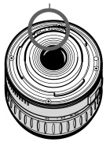
For detailed information, reference page numbers are provided in parentheses 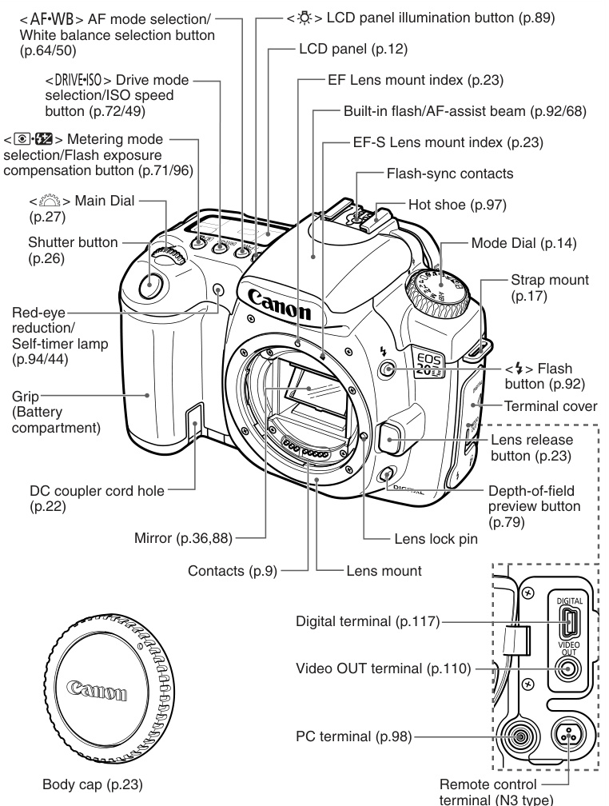 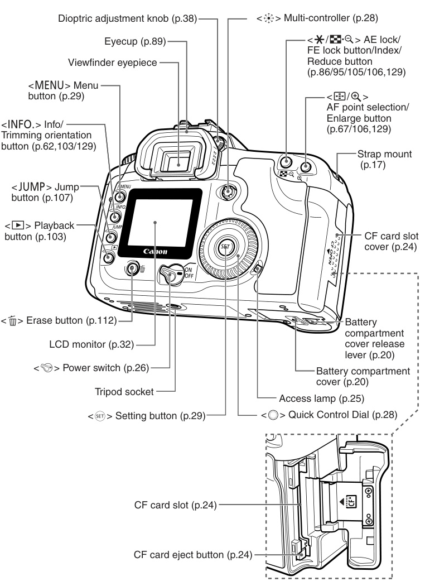

## Camera Components

### Display, Viewfinder, and Mode Dial
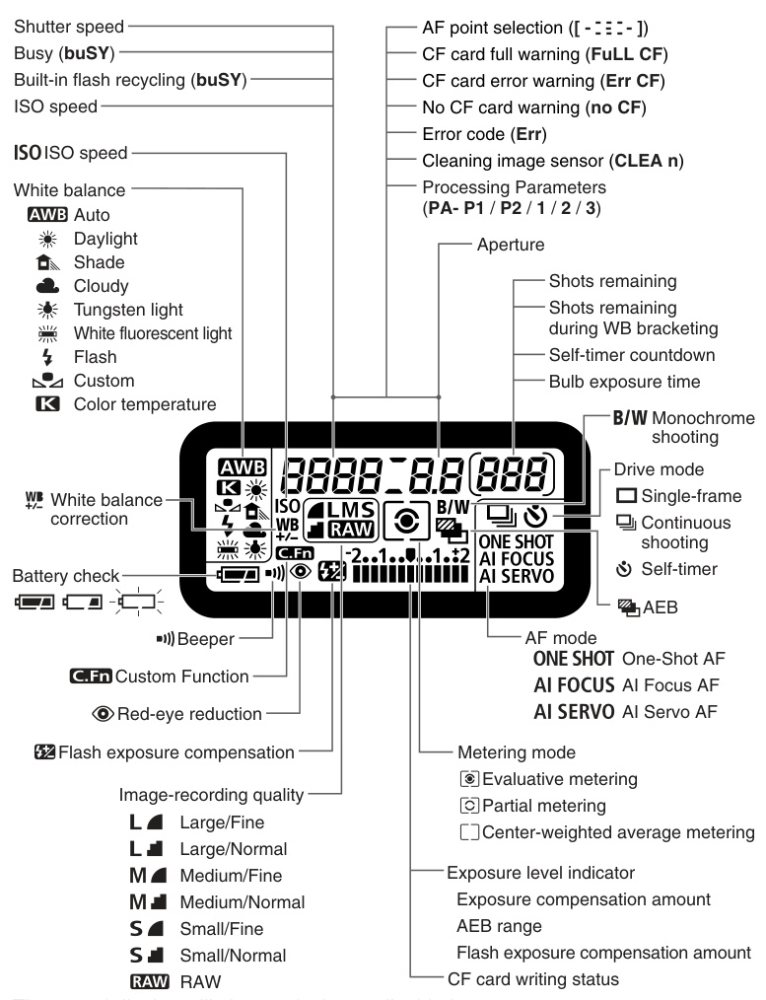
The actual display will show only the applicable items.

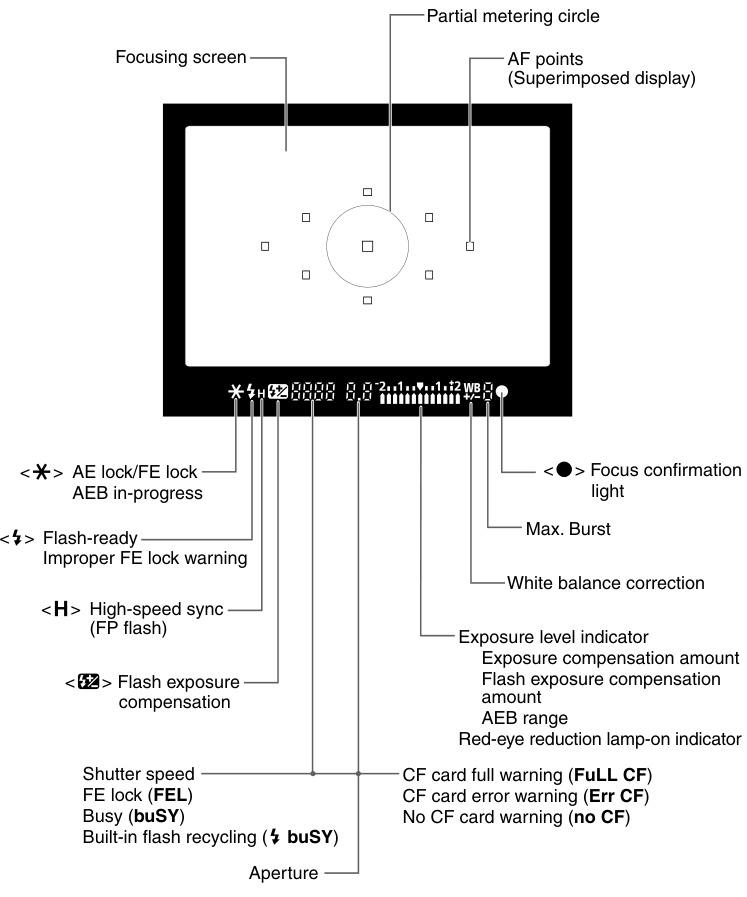
The actual display will show only the applicable items.

The Mode Dial is divided into two function zones. 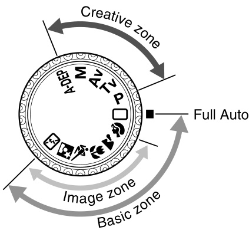

Basic Zone
All you do is press the shutter button. Full Auto (p.40) For fully automatic shooting.

Image Zone
Allows you fully automatic shooting for specific subjects.

  - Portrait (p.42)
  - Landscape (p.42)
  - Close-up (p.42)
  - Sports (p.43)
  - Night Portrait (p.43)
  - Flash Off (p.43)

Creative Zone
Set the camera as you wish.

  - P: Program AE (p.74)
  - Tv: Shutter-priority AE (p.76)
  - Av: Aperture-priority AE (p.78)
  - M: Manual exposure (p.80)
  - A-DEP: Automatic Depth-of-field Preview (p.82)

### Battery Chargers and Manual Conventions
Battery Charger CG-580: This is a battery pack charger. (p.18) 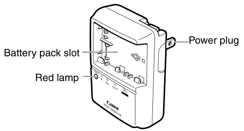
Battery Charger CB-5L: This is a battery pack charger. (p.18) 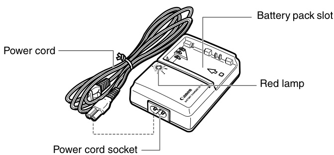

  - In the text, the icon indicates the power switch.
  - All operations described in this manual assume that the 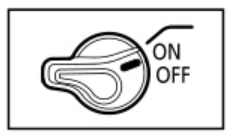
  - The icon indicates the Main Dial. 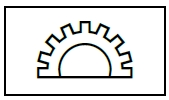
  - The icon indicates the Quick Control Dial. Operations with the dial assume that the switch is already set to 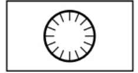
  - In the text, the icon indicates the Multi-controller. 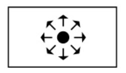
  - In the text, the icon indicates the SET button. It is used for menu functions and Custom Functions. 
  - In this manual, the icons and markings indicating the camera's buttons, dials, and settings correspond to the icons and markings on the camera. For more information, reference page numbers are provided in parentheses. The asterisk * on the right of the page title indicates that the respective feature is available only in Creative Zone modes (P, Tv, Av, M, A-DEP).
  - The procedures assume that the menu settings and Custom Functions are set to the default settings.
  - The MENU icon indicates that the setting can be changed with the menu.
  - (4), (6) or (16) indicates that the respective function remains active for 4 sec., 6 sec., or 16 sec. respectively after you let go of the button.

This manual uses the following alert symbols:

  - The Caution symbol indicates a warning to prevent shooting problems.
  - The Note symbol gives supplemental information.

# Getting Started

This chapter explains a few preliminary steps and basic camera operations. 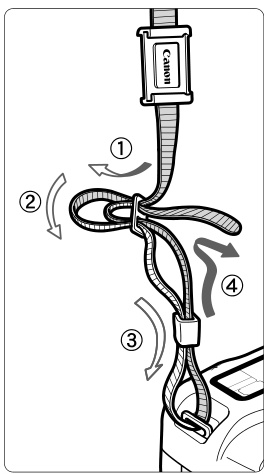

## Basic Setup

### Attaching the Strap
Pass the end of the strap through the camera's strap mount from the bottom. Then pass it through the strap's buckle as shown in the illustration. Pull the strap to take up any slack and make sure the strap will not loosen from the buckle. The eyepiece cover is also attached to the strap. (p.89) 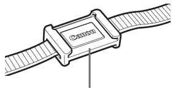

### Charging the Camera Battery When the Camera Is Not in Use
For details on the battery, refer to the instructions for Battery Pack BP-511A. Recharge the battery outside the camera with the battery charger as follows.

1.  Remove the cover. When you remove the battery from the camera, be sure to reattach the cover to protect against short circuit. 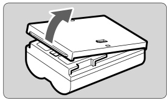
2.  Attach the battery. Align the battery front edge with the mark on the battery charger. While pressing down the battery, slide it in the direction of the arrow. To detach the battery, follow the above procedure in reverse. 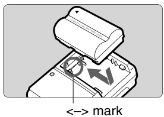
3.  For CG-580: Flip out the prongs and recharge the battery. As shown by the arrow, flip out the battery charger's prongs. Insert the prongs into a power outlet. 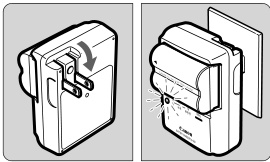
4.  For CB-5L: Connect the power cord and recharge the battery. Connect the power cord to the charger and insert the plug into the power outlet.
    Recharging starts automatically and the red lamp starts blinking. The recharging time for a completely exhausted battery is as follows: BP-511A and BP-514: Approx. 100 min. BP-511 and BP-512: Approx. 90 min. 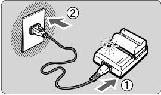
    The numbers and markings on the battery charger correspond to the table on the left. 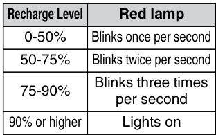

### Battery Recharging Notes and Precautions

<!-- end list -->

  - Do not recharge any battery pack other than Battery Pack BP-511A, BP-514, BP-511, or BP-512.
  - If the battery is left in the camera for a prolonged period without the camera being used, a low electrical current may be discharged excessively and the battery's service life may be affected. When not using the camera, remove the battery and attach the protective cover to prevent shorting. Before using the camera again, be sure to recharge the battery.
  - After the red lamp lights, continue to recharge the battery for an hour to attain a full charge.
  - By referring to the marking, you can attach the protective cover to the battery to indicate whether the battery has been recharged or not. 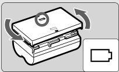
  - After recharging the battery, detach it and unplug the power cord from the power outlet.
  - The time required to recharge the battery depends on the ambient temperature and battery's recharge level.
  - The battery pack can operate in temperatures from 0°C to 40°C (32°F to 104°F). However, for full operating performance, using it between 10°C (50°F) and 30°C (86°F) is recommended. In cold locations such as ski areas, battery performance temporarily decreases and the operating time may be shorter.
  - If operating time is sharply reduced even after normal recharging, the battery pack may have reached its service life. Replace it with a new battery.

### Installing the Battery

Load a fully charged BP-511A battery pack into the camera. Battery Pack BP-514, BP-511, or BP-512 can also be used.

1.  Open the battery compartment cover. Slide the lever as shown by the arrow and open the cover. 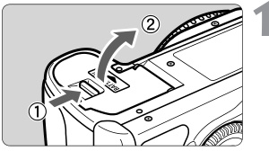
2.  Insert the battery. Point the battery contacts downward. Insert the battery until it locks into place. 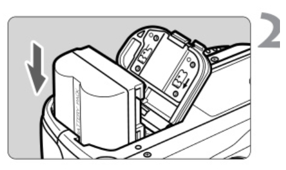
3.  Close the cover. Press the cover until it snaps shut. 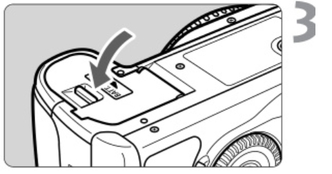

### Checking the Battery Level

When the switch is set to ON, the battery level will be indicated at one of three levels. 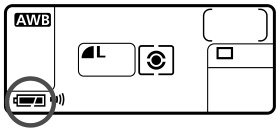 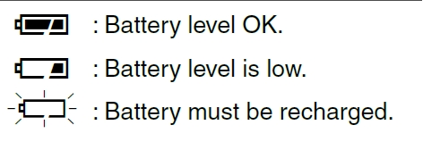

  - Battery level OK.
  - Battery level is low.
  - Battery must be recharged.

### Battery Life

  - The figures above are based on a fully-charged BP-511A and CIPA (Camera & Imaging Products Association) testing criteria. The actual number of shots may be fewer than indicated above depending on the shooting conditions.
  - The number of possible shots will decrease with more frequent use of the LCD monitor.
  - Pressing the shutter button halfway for long periods or operating the autofocus only can reduce the number of possible shots.
  - The number of possible shots with the BP-514 is the same as indicated in the table.
  - The number of possible shots with the BP-511 or BP-512 will be about 75% of the figures in the table for 20°C. At 0°C the figures will be about the same as in the table. [Number of shots] 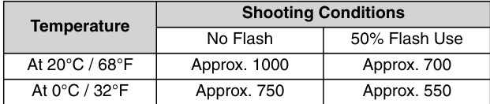

### Removing the Battery

1.  Open the battery compartment cover. Slide the lever as shown by the arrow and open the cover. 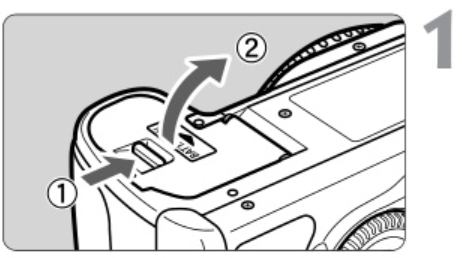
2.  Remove the battery. Slide the battery lock lever as shown by the arrow and remove the battery. 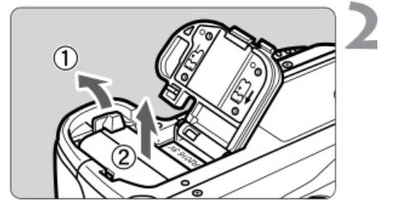

### Using a Household Power Outlet with the AC Adapter Kit
With AC Adapter Kit ACK-E2 (optional), you can connect the camera to a household power outlet and not worry about the battery level.

1.  Connect the DC Coupler. Connect the DC Coupler's plug to the AC adapter's socket. 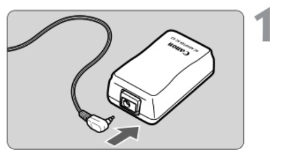
2.  Connect the power cord. Connect the power cord to the AC adapter. Insert the plug into a power outlet. When you are finished, disconnect the plug from the power outlet. 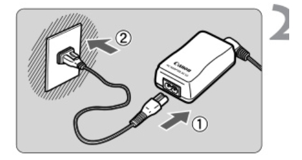
3.  Place the cord in the groove. Carefully insert the cord into the groove without damaging it. 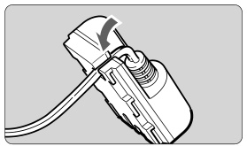
4.  Insert the DC Coupler. Open the battery compartment cover and open the DC Coupler cord notch cover. Insert the DC Coupler until the lock position and put the cord through the notch. Close the cover. Do not connect or disconnect the power cord while the camera's switch is set to ON. 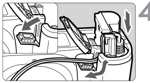

### Mounting a Lens

1.  Remove the caps. Remove the rear lens cap and the body cap by turning them as shown by the arrow. 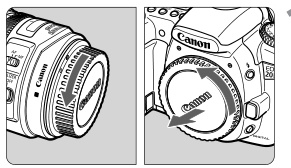
2.  Attach the lens. Align the EF-S lens with the camera's white EF-S lens mount index and turn the lens as shown by the arrow until it clicks in place. When attaching a lens other than an EF-S lens, align the lens with the red EF lens index mark. EF-S Lens mount index EF lens mount index 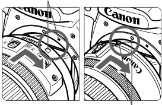
3.  On the lens, set the focus mode switch to AF. If it is set to MF, autofocus will not be possible. Remove the front lens cap. 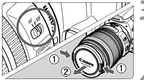

### Detaching the Lens

While pressing the lens release button, turn the lens as shown by the arrow. Turn the lens until it stops, then detach it. When attaching or detaching the lens, take care to prevent dust from entering the camera through the lens mount. 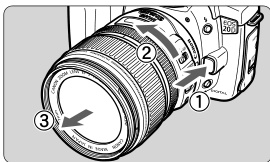

### Installing and Removing the CF Card
The captured image will be recorded onto the CF card (optional). Although the thickness is different, a Type I or Type II CF card can be inserted into the camera. The camera is also compatible with Microdrive and CF cards with 2 GB or higher capacity.

Installing the Card

1.  Open the cover. Slide the cover as shown by the arrow to open it. 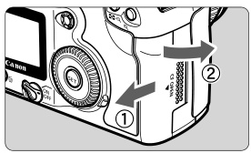
2.  Insert the CF card. Using CF cards is recommended. If the CF card is inserted in the wrong way, it may damage the camera. As shown by the arrow, face the label side toward you and insert the end with the small holes into the camera. The CF card eject button pops out. Top 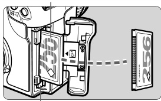 CF card eject button
3.  Close the cover. Close the cover and slide it in the direction shown by the arrow until it snaps shut. When the cover is closed, the shots remaining is displayed on the LCD panel. 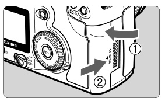 Shots remaining 

Removing the CF Card

1.  Open the cover. Turn the switch to OFF. Check that the "buSY" message is not displayed on the LCD panel. Make sure the access lamp is off, then open the cover. 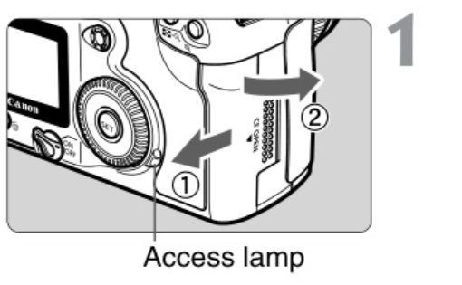
2.  Remove the CF card. Press the Eject button. The CF card will be ejected. Close the cover. 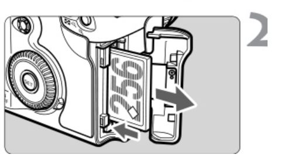

### CF Card Access Lamp and Error Precautions

A blinking access lamp indicates that data is being read, written, or erased on the CF card or that data is being transferred. Never do the following while the access lamp is lit or blinking. Such actions may destroy the image data. It may also damage the CF card or camera:

  - Shaking or banging the camera around.

  - Open the CF card slot cover.

  - Removing the battery.

  - If "Err CF" (Error CF) is displayed on the LCD panel, see page 114.

  - If you use a low-capacity CF card, it might not be able to record large images.

  - A Microdrive is vulnerable to vibration and physical shock. If you use a Microdrive, be careful not to subject the camera to vibration or physical shock especially while recording or displaying images.

## Basic Operations

### Power Switch
The camera can operate only after the switch is turned on. 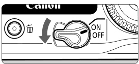
OFF: The camera is turned off and does not operate.
ON: The camera operates.
</>: The camera and quick control dial operate. (p.28)
To save battery power, the camera turns off automatically after 1 minute of non-operation. To turn on the camera again, just press the shutter button.

  - You can change the auto power-off time with the menu's [Auto power off] setting. (p.33)
  - If you turn the switch to OFF while the captured images are being recorded onto the CF card, the remaining number of captured images to be recorded will be indicated on the top LCD panel. When all the images are finished recording, the display will turn off and the camera will turn off.

### Shutter Button
The shutter button has two steps. You can press the shutter button halfway. Then you can further press the shutter button completely.
Pressing halfway: This activates autofocusing (AF) and automatic exposure (AE) that sets the shutter speed and aperture. The exposure setting (shutter speed and aperture) is displayed on the top LCD panel and in the viewfinder. (4) 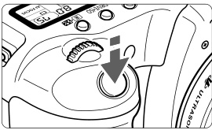
Pressing completely: This releases the shutter and takes the picture. 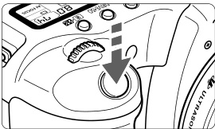
If you press the shutter button halfway and 4 seconds elapse, you must press it halfway again and wait a moment before pressing it completely to take a picture. If you press the shutter button completely without pressing it halfway first or if you press the shutter button halfway and then press it completely immediately, the camera will take a moment before it takes the picture.

  - No matter what state the camera is in (image playback, menu operation, image recording, etc.), you can return to shooting instantly just by pressing the shutter button halfway (except during direct printing).
  - Camera movement during the moment of exposure is called camera shake. Camera shake can cause blurred pictures. To prevent camera shake, note the advice below. Also see "Holding the Camera" (p.38).
  - Hold the camera steady.
  - Put your finger tip on the shutter button, hold the camera with your right hand, then press the shutter button gently.

### Operating the Main Dial
The dial is mainly used for shooting-related settings.

1.  After pressing a button, turn the dial. When you press a button, its function remains active for 6 seconds. During this time, you can turn the dial to set the desired setting. When the timer runs out or if you press the shutter button down halfway, the camera will be ready to shoot. In this way, you can set the AF mode, drive mode, and metering mode and select or set the AF point. 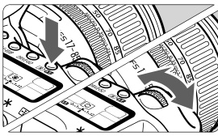
2.  Turn the dial only. While looking at the LCD panel or viewfinder, turn the dial to set the desired setting. In this way, you can set the shutter speed, aperture, etc. 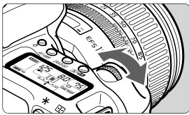

### Operating the Quick Control Dial / Operating the Multi-controller
The dial is mainly used for shooting-related settings and selecting LCD monitor items. When you want to use the dial to prepare for shooting, set the switch to ON first.

1.  After pressing a button, turn the dial. When you press a button, its function remains active for 6 seconds. During this time, you can turn the dial to set the desired setting. When the timer ends or if you press the shutter button down halfway, the camera will be ready to shoot. You can select the AF point or set the white balance, ISO speed, and flash exposure compensation. When using the LCD monitor, you can select menu operations and select images during playback. 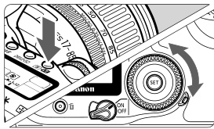
2.  Turn the dial only. While looking at the LCD panel or viewfinder, turn the dial to set the desired setting. You can set the exposure compensation or the aperture in the M mode. 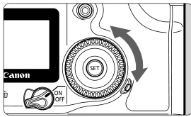
    You can also operate (1) when the switch is set to ON.

The Multi-controller consists of eight direction keys and a button at the center. Use it to select an AF point, set white balance correction, scroll around a magnified image display, and move the trimming frame for direct printing. 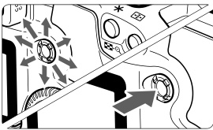

### Menu Operations
By setting various optional settings with the menus, you can set the image recording quality, processing parameters, the date/time, Custom Functions, etc. While looking at the LCD monitor, you use the MENU button, JUMP button, and Quick Control dial on the camera back to proceed to the next step. 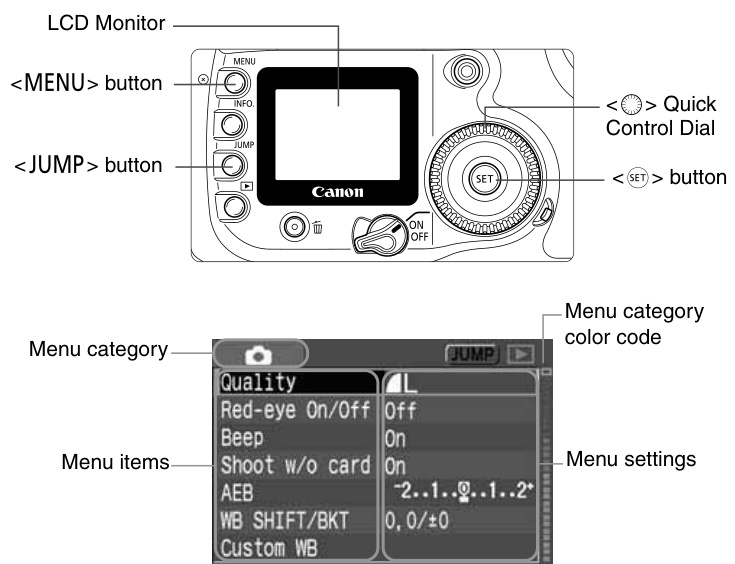
The menu screen is color coded for the three menu categories. 

  - Press the JUMP button to jump to the first item of each menu category.
  - Even while the menu is displayed, you can instantly go back to shooting by pressing the shutter button halfway.

### Menu Setting Procedure

1.  Display the menu. Press the MENU button to display the menu. To turn off the menu, press the button again.
2.  Select a menu item. Turn the dial to select the menu item, then press SET. Press the JUMP button to jump to the first item of each menu category.
3.  Select the menu setting. Turn the dial to select the desired setting.
4.  Set the desired setting. Press SET to set it.
5.  Exit the menu. Press the MENU button to exit the menu display. 

<!-- end list -->

  - When a Basic Zone mode is set, there are menu items which will not be displayed. (p.31)
  - You can also use the Main Dial to select menu items or playback images.
  - The explanation of menu functions hereinafter assumes that you pressed the MENU button to display the menu screen.
  - Menu operation will also work after the picture is taken while the image is being recorded to the CF card (access lamp blinks).

### Menu Settings / Shooting menu (Red) / About the LCD Monitor

  - These shaded menu items are not displayed in Basic Zone modes.
  - In Basic Zone modes, the RAW and RAW + JPEG recording quality modes are not displayed.

  - When using the LCD monitor, you can use the dial even while the switch is ON. The LCD monitor cannot be used as a viewfinder for shooting. You can adjust the brightness of the LCD monitor to one of five levels. (p.102)

### Restoring the Camera's Default Settings / Image-Recording Settings

1.  Select [Clear settings]. Press the MENU button. Turn the dial to select [Clear settings], then press SET.
2.  Select [Clear all camera settings]. Turn the dial to select [Clear all camera settings], then press SET. 
3.  Select [OK]. Turn the dial to select [OK], then press SET. The default settings will be restored. The camera's default settings will be as shown below. 

## Menu Operations & Initial Settings

### Setting the Language / Set the power-off time/Auto power off
The LCD monitor's interface language can be set to one of twelve languages.

1.  Select [Language]. Turn the dial to select [Language], then press SET. The Language screen will appear. 
2.  Set the desired language. Turn the dial to select the language, then press SET. The language will change.  

You can set the auto power-off time for the camera to turn off automatically after a set time of idle operation. If you do not want the camera to turn off automatically, set this to [Off]. If the camera turns off automatically, just press the shutter button halfway to turn it on again.

1.  Select [Auto power off]. Turn the dial to select [Auto power off], then press SET.
2.  Set the desired time. Turn the dial to select the desired time, then press SET. 

### Setting the Date and Time
Set the date and time as shown below.

1.  Select [Date/Time]. Turn the dial to select [Date/Time], then press SET. The date/time screen will appear. 
2.  Set the date and time. Turn the dial to select the digit, then press SET. The selection will then shift to the next item. 
3.  Set the date display format. Turn the dial to set the date format to [mm/dd/yy], [dd/mm/yy], or [yy/mm/dd]. 
4.  Press SET. The date and time will be set and the menu will reappear.
    Each captured image is recorded with the date and time it was taken. If the date and time are not properly set, the wrong date/time will be recorded. Make sure you set the date and time correctly.

### Replacing the Date/Time Battery
The date/time (back-up) battery maintains the camera's date and time. The battery's service life is about 5 years. If the date/time is reset when the battery is replaced, replace the back-up battery with a new CR2016 lithium battery as described below. The date/time setting will also be reset, so you must set the correct date/time.

1.  Turn the switch to OFF. Open the cover and remove the battery. 
2.  Take out the battery holder. 
3.  Replace the battery in the battery holder. Make sure the battery is in the proper + - orientation. 
4.  Close the cover. 

### Cleaning the CMOS sensor
The image sensor is like the film in a film camera. If any dust or other foreign matter adheres to the image sensor, it may show up as a dark speck in the images. To avoid this, follow the procedure below to clean the image sensor. Note that the image sensor is a very delicate component. If possible, you should have it cleaned by a service center.
While you clean the image sensor, the camera must be turned on. Using the AC Adapter Kit ACK-E2 (optional, see page 154) is recommended. If you use a battery, make sure the battery level is sufficient. Before cleaning the sensor, detach the lens from the camera.

1.  Install the DC Coupler (p.22) or a battery and turn the switch to ON.
2.  Select [Sensor clean.]. Turn the dial to select [Sensor clean.], then press SET. If you are using a battery with sufficient power, the screen shown in step 3 will appear. If the battery is exhausted, a warning message will appear and you will not be able to proceed further. Either recharge the battery or use a DC coupler and start from step 1 again. 
3.  Select [OK]. Turn the dial to select [OK], then press SET. The mirror will lock up and the shutter will open. "CLEA n" will blink on the LCD panel. 
4.  Clean the image sensor. Use a rubber blower to carefully blow away any dust, etc., on the surface of the image sensor. 
5.  Stop the cleaning. Turn the switch to OFF. The camera will turn off, the shutter will close, and the mirror will go back down. Set the switch to ON. The camera will then be ready to shoot.

### CMOS Sensor Cleaning Precautions

<!-- end list -->

  - During the sensor cleaning, never do any of the following that would turn off the power. If the power is cut off, the shutter will close and it may damage the shutter curtains and image sensor:
      - Turn the switch to OFF.
      - Open the CF card slot cover.
      - Open the battery compartment cover.
  - Do not insert the blower tip inside the camera beyond the lens mount. If the power goes out, the shutter will close and the shutter curtains and image sensor may be damaged.
  - Use a blower not attached with a brush. A brush can scratch the sensor.
  - Never use canned air or gas to clean the sensor. The blowing force can damage the sensor or the spray gas can freeze on the sensor.
  - When the battery is exhausted, the beeper will sound and the battery icon will blink on the LCD panel. Set the switch to OFF and replace the battery. Then start over again.
  - You cannot clean the sensor if Battery Grip BG-E2 (optional) is attached to the camera and size-AA batteries supply the power. Use AC Adapter Kit ACK-E2 (optional) or use a battery having sufficient power.

### Dioptric Adjustment
By adjusting the diopter to suit your eyesight, you can see a sharp viewfinder image even without eyeglasses. The camera's adjustable dioptric range is -3 to +1 dpt.
Turn the dioptric adjustment knob. Turn the knob left or right so that the AF points in the viewfinder look sharp. The illustration shows the knob at the standard setting (-1 dpt). 
If the camera's dioptric adjustment still cannot provide a sharp viewfinder image, using Dioptric Adjustment Lens E (10 types, optional) is recommended.

### Holding the Camera
To obtain sharp images, hold the camera still to minimize camera shake.

  - Firmly grasp the camera grip with your right hand, and press your both elbows lightly against your body.
  - Hold the lens bottom with your left hand.
  - Press the camera against your face and look through the viewfinder.
  - To maintain a stable stance, place one foot in front of the other instead of lining up both feet. 

# Shooting Operations

## Fully Automatic & Basic Zone Modes

This chapter explains how to use the Basic Zone modes on the Mode Dial for quick and easy shooting. In each mode, the AF mode, drive mode, etc., are set automatically to suit the subject. In these modes, all you do is point and shoot. In addition, to help prevent mistakes caused by operating the camera improperly, buttons are disabled in these modes. So you need not worry about accidental errors. 
Set the Mode Dial to one of the following modes: The shooting procedure is the same as for "Using Full Auto" (p.40). To see what is set automatically in the Basic Zone modes, see "Function Availability Table" (p.148).

### Using Full Auto
All you do is point the camera and press the shutter button. Everything is automatic so it is easy to photograph any subject. With nine AF points to focus the subject, anyone can easily take nice pictures.

1.  Set the Mode Dial. Automatically, the AF mode will be set to ONE SHOT, the drive mode will be set to Single, and the metering mode will be set to Evaluative. 
2.  Aim any AF point on the subject. Out of the nine AF points, the one covering the closest subject is selected automatically to achieve focus. 
3.  Focus the subject. Press the shutter button halfway to focus. The AF point which achieves focus flashes in red briefly. If focus cannot be achieved, the beeper will sound and the focus confirmation light in the viewfinder will blink. If necessary, the built-in flash will pop up automatically. 
4.  Check the display. The shutter speed and aperture value will be set automatically and displayed in the viewfinder and on the LCD panel. (4) Focus confirmation light, Shutter speed, Aperture 
5.  Take the picture. Compose the shot and press the shutter button completely. The captured image will be displayed for about 2 sec. on the LCD monitor. To view the images recorded on the CF card, press the Playback button. (p.103) 

### Basic Zone Modes / Portrait
Select a shooting mode to suit the target subject, and the camera will be set to obtain the best results.

This mode blurs the background to make the human subject stand out.

  - Holding down the shutter button executes continuous shooting.
  - To improve the background blur, use a telephoto lens and fill the frame with the subject. Or have the subject stand farther away from the background. Automatically, the AF mode will be set to ONE SHOT, the drive mode will be set to Continuous, and the metering mode will be set to Evaluative. 

### Landscape
This is for wide scenic views, night scenes, etc.

  - Using a wide-angle lens will further enhance the depth and breadth of the image. Automatically, the AF mode will be set to ONE SHOT, the drive mode will be set to Single, and the metering mode will be set to Evaluative. 

### Close-up
Use this mode to take close-up shots of flowers, insects, etc.

  - As much as possible, focus the subject at the lens' closest focusing distance.
  - To obtain a larger magnification, use the telephoto end of a zoom lens.
  - For better close-ups, an EF macro lens and Macro Ring Lite (both optional) are recommended. Automatically, the AF mode will be set to ONE SHOT, the drive mode will be set to Single, and the metering mode will be set to Evaluative. 

### Sports
This is for fast-moving subjects when you want to freeze the action.

  - The camera will first track the subject with the center AF point. Focus tracking will then continue with any of the nine AF points covering the subject.
  - While you press the shutter button, focusing will continue for continuous shooting.
  - Using a telephoto lens is recommended.
  - When focus is achieved, the beeper will sound softly. Automatically, the AF mode will be set to AI SERVO, the drive mode will be set to Continuous, and the metering mode will be set to Evaluative. 

### Night Portrait
This mode is for shooting people outside at twilight or at night. The flash illuminates the subject and a slow sync speed captures a natural-looking exposure of the background.

  - If you want to shoot only a night scene without people, use the Landscape mode instead.
  - Tell the subject to keep still even after the flash fires. Automatically, the AF mode will be set to ONE SHOT, the drive mode will be set to Single, and the metering mode will be set to Evaluative. 

### Flash off
You can disable the flash when you do not want it to fire.

  - The built-in flash or any external Speedlite will not fire. Automatically, the AF mode will be set to AI FOCUS, the drive mode will be set to Single, and the metering mode will be set to Evaluative. 
    In the Night Portrait mode, use a tripod to prevent camera shake. In the Landscape or Flash off mode, if the shutter speed display blinks, be aware that camera shake may occur.

### Self-timer Operation
Use the self-timer when you want to be in the picture. You can use self-timer in any Basic Zone mode or Creative Zone mode.

1.  Press the DRIVE-ISO button. (6)
2.  Select Self-timer. Look at the LCD panel and turn the dial to select Self-timer.
3.  Focus the subject. Look in the viewfinder and press the shutter button halfway to check that the focus confirmation light is on and the exposure setting is displayed. 
4.  Take the picture. Look through the viewfinder and press the shutter button completely. The beeper will sound, the self-timer lamp will blink, and the shot will be taken about 10 sec. later. During the first 8 sec., the beeper beeps slowly and the lamp blinks slowly. Then during the final 2 sec., the beeper beeps faster and the lamp stays lit. During the self-timer operation, the LCD panel counts down the seconds until the picture is taken. 
    Do not stand in front of the camera when you press the shutter button to start the self-timer. Doing so will throw off the focus. Use a tripod when you use the self-timer.

<!-- end list -->

  - To cancel the self-timer after it starts, press the DRIVE-ISO button.
  - When using the self-timer to shoot only yourself, use focus lock (p.69) for an object at about the same distance as where you will be.
  - You can also silence the beeper. (p.90)

## Advanced Operations (Creative Zone)

With Creative Zone modes, you can set the desired shutter speed or aperture value to obtain the result you want. You take control of the camera. 
The asterisk * on the right of the page title indicates that the respective feature is available only in Creative Zone modes (P, Tv, Av, M, A-DEP). After you press the shutter button halfway and let go, the timer operation will keep the LCD panel and viewfinder information displayed for about 4 sec. "Function Availability Table" (p.148).

### P Program AE
Like Full Auto mode, this is a general-purpose shooting mode. The camera automatically sets the shutter speed and aperture value to suit the subject's brightness. This is called Program AE. P stands for Program. AE stands for Auto Exposure. 

1.  Set the Mode Dial to P. 
2.  Focus the subject. Look through the viewfinder and aim any AF point over the subject. Then press the shutter button halfway. AF point 
3.  Check the display. The shutter speed and aperture value will be set automatically and displayed in the viewfinder and on the LCD panel. A correct exposure will be obtained as long as the shutter speed and aperture value display do not blink. 
4.  Take the picture. Compose the shot and press the shutter button completely. 
    If "30"" and the maximum aperture blink, it indicates underexposure. Increase the ISO speed or use flash. If "8000" and the minimum aperture blink, it indicates overexposure. Decrease the ISO speed or use an ND filter (optional) to reduce the amount of light entering the lens. 

### Differences Between P and Full Auto

  - In both modes, you can freely change the automatically-set shutter speed and aperture combination (program).
  - In the P mode, you can set or use the functions below, but not in the Full Auto mode:
    Shooting Settings: AF mode selection, AF point selection, Drive mode selection, Metering mode selection, Program Shift, Exposure compensation, AEB, AE lock, Depth-of-field preview, Clear all camera settings, Custom Function (C.Fn), Clear all Custom Functions, Sensor cleaning.
    Flash Settings (Built-in flash): Flash On/Off, FE lock, Flash exposure compensation.
    Flash Settings (EX-series Speedlite): Manual/Stroboscopic Flash, High-speed sync (FP flash), FE lock, Flash ratio control, Flash exposure compensation, FEB, 2nd-curtain sync, Modeling Flash.
    Image-Recording Settings: RAW and RAW + JPEG selection, ISO speed, White balance selection, Custom white balance selection, White balance correction, WB bracketing, Color temperature setting, Color space selection, Processing parameter setting.

### Shifting the Program

  - In Program AE mode, you can freely change the shutter speed and aperture value combination (program) set by the camera while maintaining the same exposure value. This is called program shift.
  - To do this, press the shutter button down halfway, then turn the Main Dial until the desired shutter speed or aperture value is displayed.
  - Program shift is canceled automatically after the image is captured.
  - If you are using a flash, you cannot shift the program.

### Tv Shutter-Priority AE / Shutter Speed Display
In this mode, you set the shutter speed and the camera automatically sets the aperture value to suit the brightness of the subject. This is called Shutter-Priority AE. A fast shutter speed can freeze the motion of a fast-moving subject and a slow shutter speed can blur the subject to give the impression of motion. Tv stands for Time value.  Fast shutter speed  Slow shutter speed

1.  Set the Mode Dial to Tv.
2.  Set the desired shutter speed. While looking at the LCD panel, turn the Main Dial. It can be set in 1/3-stop increments.  
3.  Focus the subject. Press the shutter button halfway. The aperture value is set automatically.
4.  Check the viewfinder display and shoot. As long as the aperture value is not blinking, the exposure will be correct. 
    If the maximum aperture blinks, it indicates underexposure. Turn the Main Dial to set a slower shutter speed until the aperture value stops blinking. If the minimum aperture blinks, it indicates overexposure. Turn the Main Dial to set a faster shutter speed until the aperture value stops blinking or lower the ISO speed. 

The shutter speeds from "8000" to "4" indicate the denominator of the fractional shutter speed. For example, "125" indicates 1/125 sec. Also, "0"6" indicates 0.6 sec. and "15"" is 15 sec. The full shutter speed display sequence is: 8000, 6400, 5000, 4000, 3200, 2500, 2000, 1600, 1250, 1000, 800, 640, 500, 400, 320, 250, 200, 160, 125, 100, 80, 60, 50, 40, 30, 25, 20, 15, 13, 10, 8, 6, 5, 4, 0"3, 0"4, 0"5, 0"6, 0"8, 1", 1"5, 2", 2"5, 3", 4", 5", 6", 8", 10", 15", 20", 25", 30".

### Av Aperture-Priority AE / Aperture Value Display
In this mode, you set the desired aperture and the camera sets the shutter speed automatically to suit the subject brightness. This is called aperture-priority AE. The smaller the aperture (larger f/number), the wider the depth of field (range of acceptable focus). The larger the aperture (smaller f/number), the narrower the depth of field. Av stands for Aperture value.  With a large aperture  With a small aperture

1.  Set the Mode Dial to Av. 
2.  Set the desired aperture value. While looking at the LCD panel, turn the Main Dial. It can be set in 1/3-stop increments. 
3.  Focus the subject. Press the shutter button halfway. The shutter speed is set automatically. 
4.  Check the viewfinder display and shoot. As long as the shutter speed is not blinking, the exposure will be correct. 
    If the "30"" shutter speed blinks, it indicates underexposure. Turn the Main Dial to set a larger aperture (smaller f/number) until the blinking stops or set a higher ISO speed. 
    If the "8000" shutter speed blinks, it indicates overexposure. Turn the Main Dial to set a smaller aperture (larger f/number) until the blinking stops or set a lower ISO speed. 

The larger the f/number, the smaller the aperture opening will be. The aperture values displayed will differ depending on the lens. If no lens is attached to the camera, "00" will be displayed for the aperture value. 

### Depth of Field Preview
Press the depth-of-field preview button to stop down to the current aperture setting. The diaphragm in the lens will be set to the current aperture so you can check the depth of field (range of acceptable focus) through the viewfinder. 

  - In the A-DEP mode, press the shutter button halfway to focus, then press the depth-of-field preview button while still pressing the shutter button halfway.
  - The exposure is locked (AE lock) while the Depth-of-Field Preview button is pressed.

### M Manual Exposure
In this mode, you set both the shutter speed and aperture value as desired. To determine the exposure, refer to the exposure level indicator in the viewfinder or use a handheld exposure meter. This method is called manual exposure. M stands for Manual. 

1.  Set the Mode Dial to M. 
2.  Set the desired shutter speed. While looking at the LCD panel, turn the Main Dial. 
3.  Set the desired aperture value. Set the Quick Control switch to ON, and while looking at the LCD panel, turn the Quick Control Dial. 
4.  Focus the subject. Press the shutter button halfway. The exposure setting will be displayed in the viewfinder and on the LCD panel. The exposure level icon lets you see how far you are from the standard exposure level. Standard exposure index Exposure level mark 
5.  Set the exposure. Check the exposure level and set the desired shutter speed and aperture value. : Standard exposure level. : To set it to the standard exposure level, set a slower shutter speed or a larger aperture. : To set it to the standard exposure level, set a faster shutter speed or a smaller aperture. 
6.  Take the picture.

### A-DEP Automatic Depth-of-Field AE
This mode is for obtaining a wide depth of field automatically between a near subject and far subject. It is effective for group photos and landscapes. The camera uses the nine AF points to detect the nearest and farthest subjects to be in focus. A-DEP stands for Auto-depth of field.

1.  Set the Mode Dial to A-DEP. 
2.  Focus the subject. Move the AF point over the subject and press the shutter button halfway. (4) All the subjects covered by the AF points which flashed in red will be in focus. Hold down the shutter button halfway and press the depth-of-field preview button (p.79) to see the depth of field (range of acceptable focus). 
3.  Take the picture. As long as the exposure setting is not blinking, the exposure will be correct.

<!-- end list -->

  - The A-DEP mode cannot be used if the lens' focus mode switch is set to MF. The result will be the same as using the P mode.
  - If the "30"" shutter speed blinks, it indicates underexposure. Increase the ISO speed.
  - If the "8000" shutter speed blinks, it indicates overexposure. Decrease the ISO speed.
  - If the aperture value blinks, it indicates that the exposure level is correct but the desired depth of field cannot be achieved. Either use a wide angle lens or move further away from the subjects.
  - In this shooting mode, you cannot freely change the shutter speed and aperture value. If the camera sets a slow shutter speed, hold the camera steady or use a tripod.
  - If you use flash, the result will be the same as using P with flash.

### Exposure Compensation
Exposure compensation is used to alter the standard exposure setting set by the camera. You can make the image look lighter (increased exposure) or darker (decreased exposure). You can set the exposure compensation up to +/- 2 stops in 1/3-stop increments.

1.  Turn the Mode Dial to any Creative Zone mode except M.
2.  Check the exposure level indicator. Press the shutter button halfway and check the exposure level indicator. 
3.  Set the Quick Control switch to ON, and while looking at the viewfinder or LCD panel, turn the Quick Control dial. Turn the dial while pressing the shutter button halfway or within 4 seconds after pressing the shutter button halfway.  Increased exposure  Decreased exposure 
    Set the exposure compensation amount. To cancel the exposure compensation, set the exposure compensation amount back to Standard exposure index 
4.  Take the picture.

<!-- end list -->

  - The exposure compensation amount will remain in effect even after the switch is set to OFF.
  - If the standard exposure setting is 1/125 sec. and f/5.6, setting the exposure compensation amount to plus or minus one stop will be the same as setting the shutter speed or aperture value as follows: 
  - Take care not to turn the dial and change the exposure compensation inadvertently.

### Auto Exposure Bracketing (AEB)
By changing the shutter speed or aperture automatically, the camera brackets the exposure up to ±2 stops in 1/3-stop increments for three successive shots. This is called Auto Exposure Bracketing (AEB).  Standard exposure  Decreased exposure  Increased exposure

1.  Select [AEB]. Turn the dial to select [AEB], then press SET. AEB amount
2.  Set the AEB amount. Turn the dial to set the AEB amount, then press SET. The icon and AEB amount will appear on the LCD panel. 
3.  Take the picture. The three bracketed shots will be exposed in the following sequence: standard exposure, decreased exposure, and increased exposure. As shown on the left, the respective bracketing amount will be displayed as each bracketed shot is taken. The current drive mode (p.72) will be used for the shooting. Standard exposure 

### Canceling AEB

  - Follow steps 1 and 2 to set the AEB amount to 0.
  - AEB will also be canceled automatically if you turn the switch to OFF, change lenses, have flash-ready, replace the battery, or replace the CF card. 
  - Neither flash nor bulb exposures can be used with AEB.
  - If the drive mode is set to continuous, the three bracketed shots will be taken continuously and then the shooting will stop automatically. If the drive mode is set to single image, you must press the shutter button three times.
  - If the self-timer has been set, the three bracketed shots will be taken continuously.
  - If C.Fn-12-1 is set for mirror lockup and AEB is set, only one bracketed shot will be taken at a time even in the continuous shooting mode.
  - AEB can be combined with exposure compensation.

### AE Lock
AE lock enables you to lock the exposure at a different place from the point of focus. After locking the exposure, you can recompose the shot while maintaining the desired exposure setting. This is called AE lock. It is effective for backlit subjects.

1.  Focus the subject. Press the shutter button halfway. The exposure setting will be displayed.
2.  Press the AE lock button. (4) lights in the viewfinder to indicate that the exposure setting is locked (AE lock). Each time you press the button, it locks the current exposure setting.   AE lock indicator
3.  Recompose and take the picture. If you want to maintain the AE lock while taking more shots, hold down the button and press the shutter button to take another shot.

<!-- end list -->

  - If One-Shot AF or AI Focus AF (when not AI Servo AF) is set, pressing the shutter button halfway to focus will automatically set AE lock at the same time. 
  - The AE lock effect will differ depending on the AF point and metering mode. For details, see "AE lock" (p.149).

### Bulb Exposures
When bulb is set, the shutter stays open while you hold down the shutter button fully, and closes when you let go of the shutter button. This is called bulb exposure. Use bulb exposures for night scenes, fireworks, the heavens, and other subjects requiring long exposures.

1.  Set the Mode Dial to M.
2.  Set the shutter speed to "buLb." Look at the LCD panel and turn the Main Dial to select "buLb." The next setting after "30"" is "buLb." 
3.  Set the desired aperture value. Set the Quick Control switch to ON and while looking at the LCD panel, turn the Quick Control Dial. Elapsed exposure time 
4.  Take the picture. Press the shutter button completely. The elapsed exposure time will be displayed on the LCD panel. (Displays 1 sec. to 999 sec.) The exposure continues as long as you hold down the shutter button. 

<!-- end list -->

  - Since bulb exposures will have more noise than usual, the image will look rough or grainy.
  - Bulb exposures may result in grainy images due to picture noise. You can reduce noise by setting C.Fn-02 [Long exposure noise reduction] to [1:On] (p.141).
  - For bulb exposures, using Remote Switch RS-80N3 or Timer Remote Controller TC-80N3 (both optional) is recommended.

### Mirror Lockup
Mirror lockup is enabled with C.Fn-12 [Mirror lockup] set to [1: Enable] (p.144). The mirror can be swung up separately from when the exposure is made. This prevents mirror vibrations which may blur the image during close-ups or when a super telephoto lens is used. Set Custom Functions with [Custom Functions (C.Fn)].

1.  Press the shutter button completely. The mirror will swing up. 
2.  Again press the shutter button completely. The picture is taken and the mirror goes back down.

<!-- end list -->

  - In very bright light such as at the beach or ski ground on a sunny day, take the picture promptly after mirror lockup.
  - During mirror lockup, do not point the camera lens at the sun. The sun's heat can scorch and damage the shutter curtains.
  - If you use bulb exposures, the self-timer, and mirror lockup in combination, keep pressing the shutter button completely (2 sec. self-timer + bulb exposure time). During the self-timer countdown, if you let go of the shutter button, there will be a shutter-release sound. This is not the shutter release (no picture is taken).
  - During mirror lockup, the drive mode will be single shooting regardless of the current drive mode (single or continuous).
  - If you use the self-timer and mirror lockup, the shot will be taken 2 sec. after the mirror goes up when you press the shutter button completely.
  - The mirror locks up, and after 30 seconds, it will go back down automatically. Pressing the shutter button completely again locks up the mirror again.
  - For bulb exposures, using Remote Switch RS-80N3 or Timer Remote Controller TC-80N3 (both optional) is recommended.

### LCD Panel Illumination
The LCD panel is provided with illumination. Each time you press the illumination button, the LCD panel illumination will turn on (6 sec.) or off. Use it to read the LCD panel in the dark. The illumination will turn off automatically after the shot is taken. Pressing any shooting-related button or turning the Mode Dial while the LCD panel is illuminated prolongs the illumination. 

### Using the Eyepiece Cover / You can also silence the beeper
During self-timer or remote switch (optional) operation when your eye does not cover the viewfinder eyepiece, stray light may enter the eyepiece and affect the exposure when the image is captured. In such a case, use the eyepiece cover (p.17).

1.  Remove the eyecup. From the bottom of the eyecup, push it upward. 
2.  Attaching the Eyepiece Cover. Slide the eyepiece cover down into the eyepiece groove to attach it. 

You can silence the beeper so it does not sound in any shooting mode.

1.  Select [Beep]. Turn the dial to select [Beep], then press SET.
2.  Select [Off]. Turn the dial to select [Off], then press SET. 

### CF Card Reminder
This prevents shooting if there is no CF card in the camera. This can be set in all shooting modes.

1.  Select [Shoot w/o card]. Turn the dial to select [Shoot w/o card], then press SET. 
2.  Select [Off]. Turn the dial to select [Off], then press SET.

## Autofocus, Metering & Drive Modes

Setting the AF, Metering, and Drive Modes 
Drive modes The viewfinder has 9 AF points. By selecting a suitable AF point, you can shoot with autofocus while framing the subject as desired. You can also set the AF mode to suit the subject or obtain the desired effect.  Evaluative, partial, and centerweighted average metering modes are provided. Single, continuous, and Self-timer drive modes are provided. Select the metering mode that suits the subject or your photographic intention.

  - The asterisk * on the right of the page title indicates that the respective feature is available only in Creative Zone modes (P, Tv, Av, M, A-DEP).
  - In the Basic Zone modes, the AF mode, AF point, metering mode, and drive mode are set automatically.

### Selecting the AF Mode
The AF mode is the autofocusing operation method. Three AF modes are provided. One-Shot AF is suited for still subjects, while AI Servo AF is for moving subjects. And AI Focus AF switches from One-Shot AF to AI Servo AF automatically if the still subject starts moving. In the Basic Zone modes, the optimum AF mode is set automatically.

1.  On the lens, set the focus mode switch to AF. 
2.  Set the Mode Dial to a Creative Zone mode.
3.  Press the AF-WB button. (6) 
4.  Select the AF mode. While looking at the LCD panel, turn the Main Dial. ONE SHOT: One-Shot AF, AI FOCUS: AI Focus AF, AI SERVO: AI Servo AF 
    If an Extender (optional) is attached and the maximum aperture of the lens is f/5.6 or smaller, AF will not be possible. For details, see the Extender's instructions.

### One-Shot AF for Still Subjects
Pressing the shutter button halfway activates the autofocus and achieves focus once. The AF point which achieves focus flashes briefly. At the same time, the focus confirmation light in the viewfinder is displayed. With evaluative metering, the exposure setting (shutter speed and aperture) will be set when focus is achieved. The exposure setting and focus will be locked as long as the shutter button is pressed halfway. (p.69) You can then recompose the shot while retaining the exposure setting and point of focus.  AF point Focus confirmation light 
If focus cannot be achieved, the focus confirmation light blinks. If this occurs, a picture cannot be taken even if the shutter button is pressed fully. Recompose the picture and try and focus again. Or see "When Autofocus Fails (Manual Focusing)" (p.70).

### AI Servo AF for Moving Subjects
While you press the shutter button halfway, the camera focuses continuously. This AF mode is for moving subjects when the focusing distance keeps changing. With predictive AF, the camera can also focus track a subject which steadily approaches or retreats from the camera. The exposure is set at the moment the picture is taken. 
About Predictive AF: If the subject approaches or retreats from the camera at a constant rate, the camera tracks the subject and predicts the focusing distance immediately before the picture is taken. This is for obtaining correct focus at the moment of exposure.

  - When the AF point selection is automatic, the camera first uses the center AF point to focus. During autofocusing, if the subject moves away from the center AF point, focus tracking continues as long as the subject is covered by another AF point.
  - With a manually selected AF point, the selected AF point will focus track the subject.

### AI Focus AF for Automatic Switching of AF Mode
AI Focus AF switches the AF mode from One-Shot AF to AI Servo AF automatically if the still subject starts moving. After the subject is focused in the One-Shot AF mode, if the subject starts moving, the camera will detect the movement and change the AF mode automatically to AI Servo AF. 
When focus is achieved in the AI Focus AF mode with the Servo mode active, the beeper will sound softly. The focus confirmation light in the viewfinder will not light.

### Selecting the AF Point
The AF point is used for focusing. The AF point can be selected automatically by the camera or manually by you. Automatic AF point selection is set in the Basic Zone modes and A-DEP. In the P, Tv, Av, M modes, you can switch between automatic and manual AF point selection.
Automatic AF point selection: The camera selects the AF point automatically according to the shooting conditions. All the AF points in the viewfinder will light in red.
Manual AF Point Selection: You can select any of the nine AF points manually. This is best when you want to focus on a particular subject, or autofocus quickly while composing the shot.

### Selecting with the Multi-controller

1.  Press the AF Point Selection button. (6) The selected AF point will be displayed in the viewfinder and on the LCD panel.
2.  Select the AF point. While looking at the viewfinder or LCD panel, use the Multi-controller. The AF point in the direction where you press the Multi-controller will be selected. If you press straight down, the center AF point will be selected. If you push the Multi-controller in the same direction as the currently-selected AF point, all the AF points will light and automatic AF point selection will be set. 

### Selecting with the Dial
Press the AF Point Selection button and turn the Main Dial or Quick Control dial. When you turn the dial, the selection will go in the looping sequence shown on the left. 

  - When looking at the LCD panel to select the AF point, note the following: Automatic selection, right, top.
  - If focus cannot be achieved with an external Speedlite's AF-assist beam, select the center AF point.

### AF-Assist beam with the Built-in Flash
Under low-light conditions, the built-in flash fires a brief burst of flashes when you press the shutter button halfway. This is to illuminate the subject to enable easier autofocusing.

  - In the Landscape, Sports, and Flash Off modes, the AF-assist beam does not light.
  - The built-in flash's AF-assist beam is effective up to about 4 meters/13.2 feet.
  - In the Creative Zone modes when the built-in flash is popped up with the flash button, the AF-assist beam will be emitted if necessary.

### Lens' Maximum Aperture and AF Sensitivity
With lenses whose maximum aperture is f/2.8 or larger: With the center AF point, high-precision, cross-type AF sensitive to both vertical and horizontal lines is possible. With cross-type AF, vertical-line detection is twice as sensitive as horizontal-line detection. The other eight AF points are horizontal-line sensitive or vertical-line sensitive.
With lenses whose maximum aperture is larger than f/5.6: The center AF point is a cross-type AF sensor. The other eight AF points are horizontal-line sensitive or vertical-line sensitive.

### Focusing an Off-Center Subject
After achieving focus, you can lock the focus on a subject and recompose the shot. This is called "focus lock." Focus lock works only in the One-Shot AF mode.

1.  Set the Mode Dial to a Creative Zone mode.
2.  Select the desired AF point.
3.  Focus the subject. Move the AF point over the subject and press the shutter button halfway. 
4.  Keep pressing the shutter button halfway and recompose the picture as desired. If the AF mode is AI Servo AF (or AI Focus AF set to Servo mode), focus lock will not work. Focus lock is also possible in Basic Zone modes (except Sports). In this case, start from step 3.
5.  Take the picture. 

### When Autofocus Fails (Manual Focusing) / Manual Focusing
Autofocus can fail to achieve focus (the focus confirmation light blinks) with certain subjects such as the following:
Subjects difficult to focus:
(a) Low-contrast subjects (Example: Blue sky, solid-color walls, etc.)
(b) Subjects in low light.
(c) Extremely backlit and reflective subjects (Example: Car with a reflective body, etc.)
(d) Overlapping near and far objects (Example: Animal in a cage, etc.)
(e) Repetitive patterns (Example: Skyscraper windows, computer keyboards, etc.)
In such cases, do one of the following:
(1) Focus an object at the same distance as the subject and lock the focus before recomposing.
(2) Set the lens focus mode switch to MF and focus manually.

1.  On the lens, set the focus mode switch to MF.
2.  Focus the subject. Focus by turning the lens focusing ring until the subject is in focus in the viewfinder. 

### Selecting the Metering Mode
The camera has three metering modes: Evaluative, partial, and centerweighted average metering. In the Basic Zone modes, evaluative metering will be set automatically.

1.  Press the Metering Mode button. (6)
2.  Select the metering mode. While looking at the LCD panel, turn the Main Dial. : Evaluative Metering, : Partial Metering, : Centerweighted Average Metering 

### Evaluative Metering / Partial Metering / Center weighted Average Metering
This is the camera's standard metering mode suited for most subjects even under backlit conditions. After detecting the main subject's position, brightness, background, front and back lighting, etc., the camera sets the proper exposure.

  - During manual focusing, evaluative metering is based on the center AF point.
  - If the subject brightness and background light level are very different (there is a strong backlight or spotlight), use partial metering instead. 

Effective when the background is much brighter than the subject due to backlighting, etc. Partial metering covers about 9% of the viewfinder area at the center. The area covered by partial metering is shown on the left. 

The metering is weighted at the center and then averaged for the entire scene. 

### Selecting the Drive Mode
Single and continuous drive modes are provided. In the Basic Zone modes, the optimum drive mode is set automatically.

1.  Press the DRIVE-ISO button. (6)
2.  Select the drive mode. While looking at the LCD panel, turn the Main Dial.

<!-- end list -->

  - Single shooting: When you press the shutter button completely, one shot will be taken.
  - Continuous shooting: (Max. 5 shots per sec.) While you press the shutter button completely, shots will be taken continuously.
  - Self-timer Operation: (p.44) 
    During continuous shooting, the captured images are first stored in the camera's internal memory and then successively transferred to the CF card. When the internal memory becomes full during continuous shooting, "busY" will be displayed on the LCD panel and in the viewfinder and the camera cannot take any more shots. As the captured images are transferred to the CF card, you will be able to capture more images. Press the shutter button halfway to check in the viewfinder's bottom right the current remaining shots of the maximum burst.  Max. Burst
  - If "FuLL CF" is displayed in the viewfinder and on the LCD panel, wait until the access lamp stops blinking, then replace the CF card.
  - When the battery level is low, the maximum burst will be slightly lower.

## Flash Photography

The built-in flash or an dedicated EX-series Speedlite enables E-TTL II autoflash (evaluative flash metering with preflash), making flash photography as easy as normal shooting. The result is natural-looking flash photos. In the Basic Zone modes, flash photography is fully automatic. In Creative Zone modes, flash can be used whenever necessary. 
E-TTL II autoflash obtains high-precision and consistent flash shots.

### Using the Built-in Flash in the Basic Zone and Related Notes
If necessary, the built-in flash will pop-up automatically in low-light or backlit conditions (except in Landscape, Sports, and Flash Off modes).

Regardless of the light level, you can press the flash button to pop-up and fire the built-in flash whenever desired.
P: For fully automatic flash photography. The shutter speed (1/60 sec. - 1/250 sec.) and aperture value are set automatically, just as in Full Auto mode.
Tv: For when you want to set the shutter speed (30 sec. - 1/250 sec.). The camera then automatically sets the flash aperture value to provide the proper exposure for your shutter speed.
Av: For when you want to set the aperture value. The camera then automatically sets the shutter speed (30 sec. - 1/250 sec.) to provide the proper exposure for your aperture. Against dark backgrounds such as the night sky, slow-sync shooting will be set so that both the subject and background are exposed correctly. The main subject is exposed with the flash, and the background is exposed with a slow shutter speed.

  - Because automatic slow-sync shooting uses a slow shutter speed, always use a tripod.
  - If you do not want a slow shutter speed to be set, set C.Fn-03 [Flash sync speed in Av mode] to [1: 1/250 sec. (fixed)]. (p.141)
    M: You can set both the shutter speed (bulb or 30 sec. - 1/250 sec.) and aperture value. The main subject is exposed properly by the flash. The background exposure varies depending on the shutter speed and aperture.
    A-DEP: The flash result will be the same as the P mode.

With EF-S17-85mm f/4-5.6 IS USM [m/ft] 
### With EF-S18-55mm f/3.5-5.6

  - Use the built-in flash at least 1 meter away from the subject. Closer distances will cause the lens to partially obstruct the flash.
  - When using the built-in flash, detach any hood attached to the lens. A lens hood will partially obstruct the flash.
  - When a super telephoto lens or fast, large-aperture lens is attached, the built-in flash coverage might be obstructed. Using an EX-series Speedlite (optional) is recommended.
  - The built-in flash's coverage is effective with lens focal lengths as short as 17mm. If the lens is shorter than 17mm, the periphery of the flash photo will look dark. To retract the flash, push it back down.
  - In the Tv and M modes, even if you set the shutter speed to one faster than 1/250 sec., it will be set automatically to 1/250 sec.
  - If autofocus cannot be achieved, the AF-assist beam will be emitted automatically (except in Landscape, Sports, and Flash Off modes). (p.68)

### Using Red-eye Reduction
When flash is used in a low-light environment, the subject's eyes may look red in the image. "Red eye" happens when the light from the flash reflects off the retina of the eyes. The camera's red-eye reduction feature turns on the red-eye reduction lamp to shine a gentle light into the subject's eyes to narrow the pupil diameter or iris. A smaller pupil reduces the chances of red eye from occurring. Red-eye reduction can be set in any shooting mode except Landscape, Sports, and Flash Off.

1.  Select [Red-eye On/Off]. Turn the dial to select [Red-eye On/Off], then press SET.
2.  Select [On]. Turn the dial to select [On], then press SET. 
    When you press the shutter button down halfway, the red-eye reduction lamp indicator appears in the viewfinder.

<!-- end list -->

  - Red-eye reduction will not work unless the subject looks at the red-eye reduction lamp. Tell the subject to look at the lamp.
  - To increase the effectiveness of red-eye reduction, press the shutter button down fully after the red-eye reduction lamp (which lights for approximately 1.5 seconds) indicator goes off. You can shoot anytime by pressing the shutter button down fully, even if the red-eye reduction lamp is still on.
  - The effectiveness of red-eye reduction varies from subject to subject.
  - Red-eye reduction is more effective in brighter rooms or when the camera is closer to the subject.  Red-eye reduction lamp On indicator

### FE lock
FE (flash exposure) lock obtains and locks the correct flash exposure reading for any part of a subject.

1.  Check that the icon is lit. Press the flash button to pop-up the built-in flash. In the viewfinder, check that the flash ready icon is lit. 
2.  Focus the subject. Press the shutter button halfway. Keep pressing the shutter button halfway until step 4.
3.  Press the FE lock button. The Speedlite will fire a preflash and the required flash output is retained in memory. (16 sec.) In the viewfinder, "FEL" is displayed and the indicator will light. Each time you press the FE lock button, a preflash is fired and the required flash output is retained in memory. Partial metering 
4.  Take the picture. Compose the shot and press the shutter button fully. The flash is fired to take the picture. 
    If the subject is too far away and beyond the effective range of the flash, the flash ready icon will blink. Get closer to the subject and repeat steps 2 to 4.

### Flash exposure compensation
In the same way as normal exposure compensation, you can set exposure compensation for flash. You can set flash exposure compensation up to +/- 2 stops in 1/3-stop increments.

1.  Press the Metering Mode/Flash Exposure Compensation button. (6) 
2.  Set the exposure compensation amount. Set the Quick Control switch to ON, and while looking at the LCD panel or viewfinder, turn the Quick Control dial. Standard exposure index Exposure level mark Decreased exposure Increased exposure. To cancel the flash exposure compensation, set the exposure compensation amount back to 0.  Increased exposure  Decreased exposure 
3.  Take the picture.

<!-- end list -->

  - The exposure compensation amount will remain in effect even after the switch is set to OFF.
  - The procedure is the same with EX-series Speedlites. The flash exposure compensation amount can be set with the camera.

### Using Flash Units

  - E-TTL II Autoflash: E-TTL II is a new autoflash exposure system incorporating improved flash exposure control and lens focusing distance information, making it more precise than the previous E-TTL (evaluative flash metering with preflash) system. The camera can execute E-TTL II autoflash with any EX-series Speedlite.
  - High-speed sync (FP flash): With high-speed sync, you can set a sync speed faster than 1/250 sec.
  - FE (Flash Exposure) Lock: Press the camera's FE lock button to lock the flash exposure at the desired part of the subject.
  - Flash exposure compensation: In the same way as normal exposure compensation, you can set exposure compensation for flash. Set flash exposure compensation up to ±3 stops in 1/3-stop increments.
  - FEB (Flash Exposure Bracketing): The flash output is changed automatically for three successive shots (only with FEB-compatible Speedlites). Set flash exposure bracketing up to ±3 stops in 1/3-stop increments.
  - E-TTL II wireless autoflash with multiple Speedlites: As with wired, multiple Speedlites, wireless E-TTL II autoflash with multiple Speedlites provides all the above features. Since connection cords are unnecessary, flexible and sophisticated lighting setups are possible (only with wireless-compatible Speedlites).

### About EZ/E/EG/ML/TL-series Speedlites / Sync Speed
The flash cannot be fired with an EZ-, E-, EG-, ML-, or TL-series Speedlite set in the TTL or A-TTL autoflash mode. Use the Speedlite's manual flash mode instead if provided. When using an external Speedlite, retract the built-in flash before mounting the external Speedlite.

  - If the EX-series Speedlite's firing mode is set to TTL autoflash with the Custom Function, the Speedlite will not fire.
  - The AF-assist beam will be emitted automatically (except in Landscape, Sports, and Flash Off modes).

The camera can synchronize with compact, flash units at 1/250 sec. or slower shutter speeds. With large studio flash, the sync speed is 1/125 sec. or slower. Be sure to test the flash unit beforehand to make sure it synchronizes properly with the camera.

### PC Terminal

  - The camera's PC terminal is provided for flash units having a sync cord. The PC terminal is threaded to prevent inadvertent disconnection.
  - The camera's PC terminal has no polarity so you can connect any sync cord regardless of its polarity.
  - If the camera is used with a flash unit or flash accessory dedicated to another camera brand, the camera may not operate properly and malfunction may result.
  - Also, do not connect to the camera's PC terminal any flash unit requiring 250 V or more.
  - Do not attach a high-voltage flash unit on the camera's hot shoe. It might not work.
    A Speedlite attached to the camera's hot shoe and a flash unit connected to the PC terminal can be used at the same time.

# Image Settings & Playback

## Image Settings

This chapter explains the digital image settings for the image-recording quality, ISO speed, white balance, color space, and processing parameters. For Basic Zone modes, only the image-recording quality (except RAW and RAW+JPEG), file numbering, and camera setting check will apply in this chapter.

### Setting the Image-recording Quality
The L/L/M/M/S/S modes record the image in the widely-used JPEG format. In the RAW mode, the captured image will require post-processing with the software provided. The RAW+JPEG modes simultaneously record the image in both RAW and JPEG formats. Note that in the Basic Zone modes, the RAW and RAW+JPEG formats cannot be selected.

1.  Select [Quality]. Turn the dial to select [Quality], then press SET. The recording quality screen will appear.
2.  Set the desired recording quality. Turn the dial to select the desired recording quality, then press SET. 

### Image-recording Quality Settings

  - The Fine/Normal icons indicate the image's compression rate. For better image quality, select Fine for low compression. To save space so you can record more images, select Normal for a higher compression.
  - Images recorded simultaneously will be stored in the same folder as two types of data (RAW and JPEG) bearing the same file No. With JPEG images, direct printing and print ordering are possible.

### About the RAW Format
The RAW format assumes that the image will undergo post-processing with a personal computer. Special knowledge is required, but you can use the bundled software to obtain the desired effect. RAW images are processed according to the white balance, color space, and processing parameters set at the time of shooting. Image processing refers to adjusting the RAW image's white balance, contrast, etc., to create the final image. Note that direct printing and print ordering (DPOF) will not work with RAW images.

Image File Size and CF Card Capacity According to Image-Recording Quality 

  - The number of possible shots applies to a 256MB CF card.
  - The single image size, number of possible shots, and maximum burst during continuous shooting (p.48) are based on Canon testing standards (ISO 100 with [Parameter 1] set). The actual single image size, number of possible shots, and maximum burst will vary depending on the subject, shooting mode, ISO speed, parameters, etc.
  - In the case of monochrome images (p.59), the file size will be smaller so the number of possible shots will be higher.
  - On the top LCD panel, you can check the remaining number of images the CF card can record.
  - A different image-recording quality can be set separately for the Basic Zone modes and Creative Zone modes.

### Max. Burst During Continuous Shooting
The maximum burst during continuous shooting depends on the image recording quality. The approx. maximum burst during continuous shooting is indicated below for each image-recording quality. Note that with high-speed CF cards, the maximum burst may be higher than shown in the table below depending on the shooting conditions.
(With the recording quality set to JPEG.) 
The number of shots remaining during the maximum burst is displayed on the lower right of the viewfinder.

  - If "9" is displayed, it indicates that the maximum burst is nine or more shots. If "6" is displayed, it is six shots.
  - While you are shooting and the number of shots remaining in the maximum burst is fewer than 9, the viewfinder will display "8", "7", etc. If you stop the continuous shooting, the maximum burst will increase.

### Maximum Burst Precautions for JPEG Recording Quality

    The following applies to the L/L/M/M/S/S (JPEG) recording quality modes:
  - The maximum burst may greatly decrease (6 or less) in the following cases:
      - In the Full Auto mode, the built-in flash automatically switches between firing and non-firing.
      - During continuous shooting, the external flash cannot recycle fast enough.
  - Since the maximum burst may greatly decrease (6 or less), avoid doing the following operations:
      - Pressing the shutter button completely repeatedly at short intervals.
      - Right after image capture, you change the shooting mode and take pictures immediately.
      - During continuous shooting, you pop-up or retract the built-in flash or turn the external Speedlite on or off.
  - After all the captured images are processed and written to the CF card, the above table's figures for the maximum burst will apply.
  - With white balance bracketing (p.54), the maximum burst will be 6.
  - The maximum burst is displayed even when the drive mode is set to Single or Self-timer.
  - The maximum burst is displayed even when a CF card is not in the camera. Therefore, before shooting, make sure that a CF card is installed in the camera.

### Setting the ISO Speed
The ISO speed is a numeric indication of the sensitivity to light. A higher ISO speed number indicates a higher sensitivity to light. Therefore, a high ISO speed is suited for low light and moving subjects. However, the image may look more coarse with noise, etc. On the other hand, a low ISO speed is not suited for low light or action shots, but the image will look cleaner. The camera can be set between ISO 100 and 1600 in 1-stop increments.
ISO Speed in the Basic Zone Modes: The ISO speed is set automatically within ISO 100-400.
ISO Speed in the Creative Zone Modes: You can set the ISO speed to "100", "200", "400", "800", or "1600". With C.Fn-08 [ISO expansion] set to [1: On] (p.143), "H" (ISO 3200) can also be set.

1.  Press the DRIVE-ISO button. (6) The current ISO speed will be displayed on the LCD panel. In a Basic Zone mode, "Auto" will be displayed on the LCD panel.
2.  Setting the ISO Speed: While looking at the top LCD panel, turn the Quick Control dial.

<!-- end list -->

  - At higher ISO speeds and higher ambient temperatures, the image will have more noise.
  - High temperatures, high ISO speeds, or long exposures may cause irregular colors in the image. 

### Setting the White Balance
Normally, the AWB setting will set the optimum white balance automatically. If natural-looking colors cannot be obtained with AWB, you can set the white balance manually to suit the respective light source. In the Basic Zone modes, AWB will be set automatically.

1.  Press the AF-WB button. (6)
2.  Select the white balance setting. While looking at the top LCD panel, turn the Quick Control dial.  
    Set the optimum white balance manually to suit the lighting. (p.51)

### About White Balance
The three RGB (red, green, and blue) primary colors exist in the light source in varying proportions depending on the color temperature. When the color temperature is high, there is more blue. And when the color temperature is low, there is more red. To the human eye, a white object looks white regardless of the type of lighting. With a digital camera, the color temperature can be adjusted with software so that the colors in the image look more natural. The subject's white color is used as the criteria for adjusting the other colors. The camera's AWB setting uses the CMOS sensor for auto white balance.

### Custom White Balance
With custom white balance, you shoot a white object that will serve as the basis for the white balance setting. By selecting this image, you import its white balance data for the white balance setting.

1.  Press the AF-WB button. (6)
2.  Select the custom white balance. Look at the LCD panel and turn the Quick Control dial to select Custom WB. 
3.  Photograph a white object. The plain, white object should fill the partial metering circle. Set the lens focus mode switch to MF, then focus manually. (p.70) Set any white balance setting. (p.50) Shoot the white object so that a standard exposure is obtained. 
4.  Select [Custom WB]. Turn the dial to select [Custom WB], then press SET. The custom white balance screen will appear. 
5.  Select the image. Turn the dial to select the image captured in step 3, then press SET. The image's white balance data will be imported and the menu will reappear. 

<!-- end list -->

  - If the exposure obtained in step 3 is underexposed or overexposed, a correct white balance might not be obtained.
  - If an image was captured while the processing parameter was set to [B/W] (p.59), it cannot be selected in step 5.
  - Instead of a white object, an 18% gray card (commercially available) can produce a more accurate white balance.

### Setting the Color Temperature
You can numerically set the white balance's color temperature.

1.  Press the AF-WB button. (6)
2.  Select the color temperature. Look at the LCD panel and turn the dial to select Color temperature.
3.  Select [Color temp.]. Turn the dial to select [Color temp.], then press SET. 
4.  Set the color temperature. Turn the dial to select the desired color temperature, then press SET. The color temperature can be set from 2800K to 10000K in 100K increments. 

<!-- end list -->

  - When setting the color temperature for an artificial light source, set white balance correction (magenta or green bias) as necessary.
  - If you want to set the reading taken with a color temperature meter, take test shots and adjust the setting to compensate for the difference between the color temperature meter's reading and the camera's color temperature reading.

### White Balance Correction
You can correct the standard color temperature for the white balance setting. This adjustment will have the same effect as using a color temperature conversion or color compensating filter. Each color can be corrected to one of nine levels. Users familiar with using color temperature conversion or color compensating filters will find this feature handy.

1.  Select [WB SHIFT/BKT]. Turn the dial to select [WB SHIFT/BKT], then press SET. The WB correction/WB bracketing screen will appear. 
2.  White Balance Correction. Use the Multi-controller to move the mark to the desired position on the screen. B is blue, A is amber, M is magenta, and G is green. The color in the respective direction will be corrected. 

<!-- end list -->

  - The upper right of the "SHIFT" screen will show the bias direction and correction amount.
  - To cancel the white balance correction, use the Multi-controller to move the mark to the center so that the "SHIFT" is 0, 0.
  - Press SET to exit the setting and return to the menu. 
  - During the white balance correction, the WB correction icon will be displayed in the viewfinder and on the LCD panel.
  - One level of the blue/amber correction is equivalent to 5 mireds of a color temperature conversion filter. (Mired: A measurement unit indicating the density of a color temperature conversion filter.)
  - You can also set white balance bracketing and AEB shooting in combination with white balance correction. If you turn the Main Dial in step 2, WB bracketing will be set. (p.54)

### White Balance Auto Bracketing
With just one shot, three images having a different color tone can be recorded simultaneously. Based on the white balance mode's standard color temperature, the image will be bracketed with a blue/amber bias or magenta/green bias. This is called white balance bracketing. It can be set up to ±3 levels in single-level increments.

1.  Set the image-recording quality to any setting except RAW and RAW+JPEG. (p.46)
2.  Select [WB SHIFT/BKT]. Turn the dial to select [WB SHIFT/BKT], then press SET. The WB correction/WB bracketing screen will appear. 
3.  Set the bracketing amount. Turn the Main Dial to set the bracketing direction and bracketing level. When you turn the Main Dial, the mark on the screen will change to 3 points. Turning the Main Dial to the right sets the B/A bracketing, and turning it to the left sets the M/G bracketing. Set the bracketing level for the B/A or M/G bias up to ±3 levels in single-level increments. (The bracketing level cannot be set for both the B/A and M/G bias.) On the right side of the screen, "BKT" indicates the bracketing direction and the bracketing level is also displayed. Press SET to exit the setting and return to the menu.  B/A bias ±3 levels  M/G bias ±3 levels 
4.  Take the picture. When B/A bracketing has been set, the three images will be recorded onto the CF card in the following sequence: Standard WB, B (blue) bias, and A (amber) bias. If M/G bracketing has been set, the sequence will be Standard WB, M (magenta) bias, and G (green) bias. The current drive mode (p.72) will be used for the shooting.

### Canceling White Balance Auto Bracketing

  - In step 3, set "BKT" to ±0.
  - White balance bracketing will not work if the image-recording quality is set to RAW or RAW+JPEG.
  - With white balance bracketing, the maximum burst will be 6 shots. 
  - When white balance bracketing is set, the white balance icon will blink on the LCD panel and the remaining shots will decrease to about 1/3.
  - Since three images are recorded for one shot, the CF card will take longer to record the shot.
  - You can also set white balance correction and AEB shooting in combination with white balance bracketing. If you set AEB in combination with white balance bracketing, a total of nine images will be recorded for a single shot. "BKT" stands for bracketing.

### Setting the Color Space
The color space refers to the range of reproducible colors. With this camera, you can set the color space for captured images to sRGB or Adobe RGB. For normal images, sRGB is recommended. In the Basic Zone modes, sRGB will be set automatically.

1.  Select [Color space]. Turn the dial to select [Color space], then press SET.
2.  Set the desired color space. Turn the dial to select [sRGB] or [Adobe RGB], then press SET. 

### About Adobe RGB
This is mainly used for commercial printing and other industrial uses. This setting is not recommended if you do not know about image processing, Adobe RGB, and Design rule for Camera File System 2.0 (Exif 2.21). Since the image will look very subdued with sRGB personal computers and printers not compatible with Design rule for Camera File System 2.0 (Exif 2.21), post-processing of the image with software will be required. If the image is captured with the color space set to Adobe RGB, the file name will start with "_MG_" (first character is an underscore). The ICC profile is not appended.

### Selecting the Processing Parameters / About Processing Parameters
The image you capture can be processed to look more vivid and sharp or more subdued. The processing parameters can be set according to the preset Parameter 1 or Parameter 2 or to Set 1, 2, or 3 that you can set yourself. Monochrome can also be set. In the Basic Zone modes, Parameter 1 will be set automatically.

1.  Select [Parameters]. Turn the dial to select [Parameters], then press SET. Processing parameter setting screen will appear. Press SET.
2.  Select the desired Parameter. Turn the dial to select the desired setting, then press SET. Press the MENU button to return to the menu. 

  - [Parameter 1] sets the contrast, sharpness, and color saturation by +1 level.
  - [Parameter 2] sets all the parameters to "0."
  - In Creative Zone modes, [Parameter 2] is set by default.

### Setting the Processing Parameters
The image you capture can be processed automatically by the camera in accordance with the parameter settings you set (five settings each for [Contrast], [Sharpness], [Saturation], and [Color tone]). You can register and save up to three sets of processing parameters.

1.  Select [Parameters]. Turn the dial to select [Parameters], then press SET. Processing parameter setting screen will appear. Press SET. 
2.  Select the set number. Turn the dial to select [Set 1], [Set 2], or [Set 3], then press SET. The default parameter settings for [Set 1], [Set 2], and [Set 3] are all [0] (Standard). 
3.  Select the item to be set. Turn the dial to select the menu item, then press SET.  
4.  Set the desired setting. Turn the dial to select the desired effect, then press SET. Press the MENU button to return to the menu. 

### Black-and-White Shooting
When you capture images with the processing parameter set to Monochrome, the camera will process and record the images as black-and-white images onto the CF card.

1.  Select [B/W]. In step 3 on page 58, select [B/W] then press SET.
2.  Select the item to be set. Turn the dial to select the menu item, then press SET. The [Contrast] and [Sharpness] will be the same as in the table in step 4 on page 58. For details on [Filter effects] and [Toning Effect], see page 60. 
3.  Set the desired setting. Turn the dial to select the desired effect, then press SET. Press the MENU button to return to the menu.

<!-- end list -->

  - When the camera returns to being ready for shooting, the B/W icon appears on the top LCD panel. 
  - To obtain natural-looking, black-and-white images, set a suitable white balance.
  - JPEG images captured with the parameter set to [B/W] cannot be converted to color with any personal computer software.

### Filter effects / Toning Effect
The same effect as using filters with black-and-white film can be obtained with digital images. A color can be brightened by using a filter having a similar or same color. At the same time, the complementary colors will be darkened.  Setting the Contrast to the plus side will make the filter effect more pronounced.

When color toning is set, color toning will be applied to the captured black-and-white image before being recorded to the CF card. It can make the image look more impressive. The following can be selected: [N:None] [S:Sepia] [B:Blue] [P:Purple] [G:Green] 

### File Numbering Methods / Continuous

1.  Select [File numbering]. Turn the dial to select [File numbering], then press SET.
2.  Select the file numbering method. Turn the dial to select [Continuous] or [Auto reset], then press SET. The file number is like the frame number on film. There are two file numbering methods: [Continuous] and [Auto reset]. The images you take are automatically assigned a file number from 0001 to 9999 and saved in a folder (created automatically) that can hold up to 100 images. 

The file numbering continues in sequence even after you replace the CF card. This prevents images from having the same file number, so image management with a personal computer is easier. File numbering after changing the CF card. Next sequential file number 

### Auto reset / Checking Camera Settings / Camera Setting Display
Each time you replace the CF card, the file numbering will be reset to the first file number (XXX-0001). Since the file number starts from 0001 in each CF card, you can organize images according to CF card. File numbering after changing the CF card. File number is reset 

If folder No. 999 is created, "Folder number full" will appear on the LCD monitor. Then if file No. 9999 is created, "Err CF" will be displayed on the LCD panel and in the viewfinder. Replace the CF card with a new one. For both JPEG and RAW images, the file name will start with "IMG_". The file name extension will be ".JPG" for JPEG images and ".CR2" for RAW images.

When the camera is ready to shoot, press the INFO. button to view the current camera settings on the LCD monitor.
Display the camera settings. Press the INFO. button. The current camera settings appear on the LCD monitor. To turn off the LCD monitor, press the INFO. button again. 

## Image Playback & Management

This chapter explains image playback operations such as how to view and erase captured images and how to connect the camera to a TV monitor. For images taken with another camera: The camera might not be able to properly display images captured with a different camera or edited with a personal computer or whose file name was changed.

### Setting the Image Review Time
You can set how long the image is to be displayed on the LCD monitor right after it is captured. To keep the image displayed, set [Hold]. To not have the image displayed, set [Off].

1.  Select [Review time]. Turn the dial to select [Review time], then press SET.
2.  Set the desired review time. Turn the dial to select the desired setting, then press SET.

<!-- end list -->

  - If you press the INFO. button during the image review right after shooting, you can change the display format.
  - The [Hold] setting keeps displaying the image until you press the shutter button halfway. However, if auto power off has been set, the camera will turn off automatically after the auto power off time elapses.
  - During the image review for single-shooting, you can delete the displayed image by pressing the Erase button and selecting [OK].
  - To view images captured so far, see "Image Playback" (p.103).

### Auto Image Rotation
Vertical shots can be rotated automatically so that they are displayed upright during playback.

1.  Select [Auto rotate]. Turn the dial to select [Auto rotate], then press SET.
2.  Select [On]. Turn the dial to select [On], then press SET. 
3.  Take a vertical shot. For the image review right after image capture, the image will not be displayed vertically on the LCD monitor.
4.  Playback the image. Press the Playback button. The vertical shot will be displayed vertically as shown on the left. 

<!-- end list -->

  - Auto rotate will work only if [Auto rotate] has been set to [On]. Auto rotate will not work with vertical images captured while [Auto rotate] was [Off].
  - If the vertical image is taken while the camera is pointed up or down, the image might not rotate automatically for playback.
  - When you change the camera's orientation between horizontal and vertical, the camera orientation sensor will make a small sound. This is normal and not a defect.

### Setting the LCD Brightness / Image Playback
You can adjust the brightness of the LCD monitor to one of five levels.

1.  Select [LCD Brightness]. Turn the dial to select [LCD Brightness], then press SET. The brightness adjustment screen will appear. 
2.  Adjust the brightness. While looking at the gray chart on the left, turn the dial to adjust. Press SET to exit the setting and return to the menu. 

You can select any captured image to view. You can view a single image, the shooting information, an index display, or a magnified view.

### Single image display

1.  Playback the image. Press the Playback button. The last captured image will appear on the LCD monitor. 
2.  Select the image. To playback images starting with the last image, turn the dial counterclockwise. To playback images starting with the first captured image, turn the dial clockwise. Press the INFO. button to switch the display format.   Single image display (with basic info)  Shooting information  Single image display (no shooting info)
    To quit the playback, press the Playback button. The LCD monitor will turn off.

<!-- end list -->

  - Even in display formats other than single image (index display, magnified view, etc.), you can press the INFO. button to display or hide the basic info.
  - While data is being written to the CF card (access lamp blinking) after continuous shooting, press the Playback button to display the last image which has been written to the CF card. Turn the dial to select the image. After all the images have been written to the CF card, they can be displayed in sequence.

### Shooting Information Display / Histogram / Highlight Alert

A histogram is a graph indicating the image's brightness. The horizontal axis indicates the brightness level (darker on the left and brighter on the right), while the vertical axis indicates how many pixels exist for each brightness level. The more pixels there are toward the left, the darker the image. And the more pixels there are toward the right, the brighter the image. If there are too many pixels on the left, the shadow detail will be lost. And if there are too many pixels on the right, the highlight detail will be lost. The tones in between will be reproduced. By checking the image's brightness histogram, you can see the exposure level bias and the overall tone reproduction condition.
Sample Histograms  Dark image  Normal image 

When the shooting information is displayed, any overexposed areas of the image will blink. To obtain more image detail in the overexposed areas, set the exposure compensation to a negative amount and shoot again.

### Index Display
Nine thumbnail images are displayed on one screen.

1.  Set the camera for playback. Press the Playback button. The last captured image will appear on the LCD monitor.
2.  Display the index images. Press the Index Display button. The selected thumbnail will be highlighted with a green frame. 
3.  Select the image. Turn the dial to move the green frame. 
    Switching from the index display to another display mode:

<!-- end list -->

  - To display a single image, press the Playback button.
  - Pressing the Magnify button switches to the single image display and pressing it again switches to magnified view.

### Magnified View
You can magnify the image by 1.5x to 10x on the LCD monitor.

1.  Display the image. Display the image in the single-image or image info display mode.
2.  Magnify the image. Press the Magnify button. First, the center of the image will be magnified. To increase the magnification, hold down the button. Press the Reduce button to reduce the magnification. Hold down the button to continue reducing the magnification until it reaches the size in step 1.  Magnified area
3.  Scroll around the image. Use the Multi-controller to scroll around the image in any direction. Repeat steps 2 and 3 to magnify other areas of the image.

<!-- end list -->

  - To exit the magnified display, press the Playback button. 

### Jump Display
During the single image, image with shooting information, index, or magnified image display, you can jump forward or back to images stored on the CF card.

1.  Display the image. Display a single image, image with shooting information, index, or magnified image.
2.  Go to the jump display. Press the JUMP button. The jump bar will appear at the bottom of the screen. 
3.  Jump forward or back. Turn the dial. During magnified view, turn the dial. To quit the image jump, press the JUMP button. The jump bar will disappear. 
    Jumping during Single image, image with shooting information, magnified image view: Turn the dial counterclockwise to jump ten images backward, or turn it clockwise to jump ten images forward. In the magnified view, the magnified area and magnification will be maintained during the image jump.
    Jumping in the index display mode: Turn the dial counterclockwise to jump nine images backward, or turn it clockwise to jump nine images forward. Image jump is also possible during [Protect] and [Rotate].

### Automated Playback of Images (Auto playback)
You can playback the CF card's images in an automatic slide show. Each image will be displayed for about 3 sec.

1.  Select [Auto Play]. Turn the dial to select [Auto Play], then press SET. The auto play screen will appear. 
2.  Start the auto play. After [Loading image..] is displayed for a few seconds, auto play will start. To pause the auto play, press SET. During pause, [II] will be displayed on the upper left of the image. Press SET again to resume the auto play.  
3.  Stop the auto play. To stop the auto play and return to the menu, press the MENU button.

<!-- end list -->

  - During auto play, auto power off will not work.
  - The display time may vary depending on the image.
  - During auto play, you can press the INFO. button to change the display format.
  - During pause, you can turn the dial to view another image.

### Rotating an Image
You can rotate an image by 90° or 270° clockwise. Images will then be displayed in the correct orientation during playback.

1.  Select [Rotate]. Turn the dial to select [Rotate], then press SET. The Rotate screen will appear. 
2.  Rotate the image. Turn the dial to select the image to be rotated, then press SET. Each time you press SET, the image will rotate clockwise.

<!-- end list -->

  - To rotate another image, repeat step 2.
  - To stop rotating the image, press the MENU button. The menu will reappear. 
    If you have set [Auto rotate] to [On] (p.101) before taking the vertical shots, you need not rotate the image as described above. You can rotate the image even after you change the display format to shooting info display, magnified view, or index display after step 1.

### Viewing the Images on a TV
By connecting the camera to a TV set with the video cable (provided), you can view the captured images on a TV set. Always turn off the camera and the television before connecting or disconnecting them.

1.  Connect the camera to the TV. Open the camera's terminal cover. Use the video cable (provided) to connect the camera's VIDEO OUT terminal to the TV monitor's VIDEO IN terminal. Insert the cable plug all the way in.
2.  Turn on the TV and switch the TV's line input to Video IN. 
3.  Set the switch to ON.
4.  Press the Playback button. The image will appear on the TV screen. (Nothing will be displayed on the camera's LCD monitor.) After you finish, set the switch to OFF, turn the TV off, then disconnect the video cable. 

<!-- end list -->

  - If the proper video system format is not set, the image will not be displayed properly. Set the proper video system format with [Video system].
  - Depending on your TV, the image periphery may be cut off.

### Protecting Images
This prevents the image from being erased accidentally.

1.  Select [Protect]. Turn the dial to select [Protect], then press SET. The protect setting screen will appear. 
2.  Protect the image. Turn the dial to select the image to be protected, then press SET. When an image is protected, the protect icon will appear below the image. To cancel the image protection, press SET again. The protect icon will disappear. To protect another image, repeat step 2.

<!-- end list -->

  - To exit the image protection, press the MENU button. The menu will reappear.  Image protect icon
  - Once an image is protected, it cannot be erased by the camera's Erase function. To erase a protected image, you must first cancel the protection.
  - If you erase all the images (p.113), only the protected images will remain. This is convenient when you want to erase unnecessary images all at once.
  - You can protect the image even after you change the display format to shooting info display, magnified view, or index display after step 1.

### Erasing Images
You can erase images individually or erase all the images at one time in the CF card. Only protected images will not be erased. Once an image is erased, it cannot be recovered. Make sure you no longer need the image before erasing it. To prevent important images from being erased accidentally, protect them.

### Erasing a Single Image

1.  Display the image. Press the Playback button. 
2.  Select the image to be erased. Turn the dial to select the image to be erased.
3.  Display the erase menu. Press the Erase button. The Erase menu will appear at the bottom of the screen. 
4.  Erase the image. Turn the dial to select [Erase], then press SET. The access lamp will blink and the image will be erased. If there are other images you want to select, repeat steps 2 to 4. 

### Erasing All Images

1.  Display the image. Press the Playback button.
2.  Display the erase menu. Press the Erase button. The Erase menu will appear at the bottom of the screen. 
3.  Select [All]. Turn the dial to select [All], then press SET. The confirmation dialog will appear. 
4.  Erase the images. Turn the dial to select [OK], then press SET. All unprotected images will be erased. While the images are being erased, you can cancel the erasure by pressing SET. 
    While data is being written to the CF card (access lamp blinking) after continuous shooting, press the Playback button and then press the Erase button to erase the displayed image or all images. If you select [All] and press the Erase button, the images captured during continuous shooting (including those not yet processed) and all the images on the CF card will be erased.

### Formatting the CF Card
Format the CF card before using it in the camera. Formatting a CF card will erase everything in the card. Even protected images will be erased, so make sure there is nothing you need to keep. If necessary, transfer images to a personal computer before formatting the card.

1.  Select [Format]. Turn the dial to select [Format], then press SET. The confirmation dialog will appear. 
2.  Format the CF card. Turn the dial to select [OK], then press SET. The CF card will be formatted (initialized). When the formatting is completed, the menu will reappear. 

<!-- end list -->

  - A CF card or a CF card formatted with another camera or personal computer might not work with the camera. If this happens, format the card with the camera first. Then it might work with the camera.
  - The CF card's capacity displayed on the formatting screen may be lower than the capacity indicated on the card.

### Handling "Err CF"
If "Err CF" (CF error) is displayed on the LCD panel, it indicates that a problem with the CF card is preventing the image data from being recorded or read. Use another CF card instead. Or, if you have a commercially-available CF card reader that can read the CF card, use it to transfer all the images in the card to a personal computer. After transferring all the image data to a personal computer, format the CF card. It may then return to normal.

# Direct Printing & Customization

## Direct Printing

### Direct Printing from the Camera
You can connect the camera directly to a printer and print out the images in the CF card. This chapter explains how to print your digital camera photos with a printer capable of direct printing via BubbleJet Direct standard. 
You do the direct printing procedure entirely through your camera's LCD monitor.

### Setting the Camera
On the menu, set [Communication] to [PTP]

1.  Select [Communication]. Turn the dial to select [Communication], then press SET.
2.  Turn the dial to select [PTP], then press SET. 
    When connecting the camera to the personal computer, set [Communication] to [Normal]. Transmissions between the camera and personal computer will not work with the [PTP] setting.

### Connect the camera to the printer

1.  Turn the camera's switch to OFF. 
2.  Set up the printer. For details, refer to the printer's manual. RAW images are not compatible with direct printing. Do not disconnect the cable during direct printing.
3.  Connect the camera to the printer. Refer to the table (Printers and Cables) below to select the proper cable to connect the camera to printer.

### Printers and Cables

When connecting the cable plug to the camera's DIGITAL terminal, the cable plug's icon must face the front side of the camera. To connect to the printer, refer to the printer's instruction manual. 
4. Turn on the printer.
5. Turn the camera's switch to ON. Some printers may have a beeping sound.
6. Playback the image. Press the Playback button. The image will appear and one of three icons will appear on the upper left to indicate that the camera is connected to the printer. The procedure will be different depending on the icon displayed. See the applicable pages below.   

  - If you use a battery to power the camera, make sure it is fully charged. During direct printing, keep checking the battery level.
  - If there is a long beeping sound in step 5, it indicates a problem with the PictBridge printer. To find out what's wrong, do the following: Press the Playback button to playback the image and follow the steps below. 1. Press SET. 2. On the print setting screen, select [Print]. The error message will be displayed on the LCD monitor. See "Error Messages" on page 122.
  - Before disconnecting the cable, turn off the camera and printer. Pull out the cable while holding the plug, not the cord.
  - When connecting the camera to the printer, do not use any cable other than the dedicated interface cable.

### Printing with PictBridge
The setting options will differ depending on the printer. Some settings might be disabled. For details, refer to your printer's instruction manual.

1.  Select the image to be printed. Check that the icon is displayed on the upper left of the LCD monitor. Turn the dial to select the image to be printed. Press SET. The print setting screen will appear.  Printer connected icon
    Print setting screen:

<!-- end list -->

  - Set the date imprinting to on or off.
  - Set the printing effects.
  - Sets the quantity to be printed.
  - Sets the trimming area.
  - Sets the Paper Size, Type, and Layout.
  - Returns to the screen in step 1.
  - Starts the printing.
    The Paper Size, Type, and Layout you have set will be displayed. Depending on your printer, certain settings like the date imprinting and trimming might not be available. 

<!-- end list -->

2.  Select [Paper Settings]. Turn the dial to select [Paper Settings], then press SET. The Paper Settings screen will appear. 
3.  Setting the Paper Size. Turn the dial to select the size of the paper loaded in the printer, then press SET. The Paper Type screen will appear. 
4.  Setting the Paper Type. Turn the dial to select the type of paper loaded in the printer, then press SET. The Layout screen will appear. 
    About the Paper Types: If you are using a Canon printer, refer to the printer's instruction manual for the recommended paper type settings. 
5.  Setting the Layout. Turn the dial to select the desired layout, then press SET. The Print setting screen will reappear. 
### About Layout / Handling Printer Errors

6.  Set the other options. If desired, also set the date imprinting, printing effects, and number of copies. Printing effects, Number of copies  Date imprinting
    Turn the dial to select the menu item, then press SET. Turn the dial to select the desired setting, then press SET. Depending on the BJ printer, the Printing effects setting may enable you to select the [VIVID] (for vivid greens and blue sky), [NR] (noise reduction), [VIVID+NR] or [On] setting. For details on trimming, see page 129.
7.  Start printing. Turn the dial to select [Print], then press SET. The printing will start. When the printing ends, the screen will return to step 1. To stop the printing, press SET while [Stop] is displayed, then turn the dial to select [OK] and press SET. 

<!-- end list -->

  - Depending on the image's file size and recording quality, it may take some time for the printing to start after you select [Print].
  - The [Default] setting for printing effects and other options are the printer's own default settings as set by the printer's manufacturer. See the printer's instruction manual to find out what the [Default] settings are.

If you resolve a printer error (no ink, no paper, etc.) and select [Continue] to resume printing but it does not resume, operate the buttons on the printer to resume printing. For details, see the printer's instruction manual.

### Error Messages
If a problem occurs during printing, an error message will appear on the camera's LCD monitor. Press SET to stop printing. After resolving the problem, resume printing. For details on how to resolve a printing problem, refer to the printer's instruction manual.
Paper Error: Check whether the paper is properly loaded in the printer.
Ink Error: The printer has run out of ink or the waste ink tank is full.
Hardware Error: Check for any printer problems other than paper and ink problems.
File Error: You attempted to print an image that cannot be printed with PictBridge. Images taken with a different camera or images edited with a computer might not be printable.

### Printing with CP Direct

1.  Select the image to be printed. Check that the icon is displayed on the upper left of the LCD monitor. Turn the dial to select the image to be printed. Press SET. The print setting screen will appear. Printer connected icon 
    Print setting screen:
    Trimming frame: Appears when you want to trim the image. The printing style settings are displayed.

<!-- end list -->

  - Sets the quantity to be printed.
  - Sets the trimming area.
  - Sets the printing style.
  - Returns to step 1.
  - Starts the printing. 

<!-- end list -->

2.  Select [Style]. Turn the dial to select [Style], then press SET. The Style screen will appear. 
3.  Set the options as desired. Set the [Image], [Borders], and [Date] as desired. Turn the dial to select the desired setting, then press SET. [Image] is selectable when card-size paper is used. If you select [Multiple], 8 small images of the same picture will be printed on the paper. Check the [Borders] and [Date] settings and set them if necessary. When you are done, press the MENU button to return to the print setting screen. 
4.  Set the number of copies. Set as necessary. Turn the dial to select [copies], then press SET. Turn the dial to set the number of copies, then press SET. Set a number from 1 to 99. 
5.  Set the trimming. Set as necessary. For details on trimming, see page 129.
6.  Start printing. Turn the dial to select [Print], then press SET. The printing will start. When the printing ends, the screen will return to step 1. To stop the printing, press SET while [Stop] is displayed, then turn the dial to select [OK] and press SET. 

### CP Direct Printing Notes

<!-- end list -->

  - The date may look light if it is imprinted on a bright background or border.
  - If [Multiple] is selected, [Borders] and [Date] cannot be selected. [Borderless] and [Date] will be set to [Off]. The image will also be cut off along all four edges.
  - If [Date] is [On], the date recorded for the image will appear on the print. The date will appear on the lower right of the image.
  - If you select [Stop] while printing only one picture, the printing will not stop until it finishes printing the picture. If you are printing multiple pictures, the printing will stop after the current picture is finished printing.
  - If a problem occurs during printing, an error message will appear on the camera's LCD monitor. Select [Stop] or [Resume] (after resolving the problem). If [Resume] is not displayed, select [Stop].

### Printing with Bubble Jet Direct

1.  Select the image to be printed. Check that the icon is displayed on the upper left of the LCD monitor. Turn the dial to select the image to be printed. Press SET. The print setting screen will appear. Printer connected icon 
    Print setting screen:

<!-- end list -->

  - Sets the quantity to be printed.
  - Sets the trimming area.
  - Sets the printing style.
  - Returns to step 1.
  - Starts the printing.
    The printing style settings are displayed. Date icon. Trimming frame: Appears when you want to trim the image. 

<!-- end list -->

2.  Select [Style]. Turn the dial to select [Style], then press SET. The Style screen will appear. 
3.  Set the options as desired. [Paper] [Borders] [Date]. Turn the dial to select the menu item, then press SET. Turn the dial to select the desired setting, then press SET. [Paper] is the size of the paper loaded in the printer. Check the [Borders] and [Date] settings and set them if necessary. When you are done, press the MENU button to return to the print setting screen.   
4.  Set the number of copies. Set as necessary. Turn the dial to select [copies], then press SET. Turn the dial to set the number of copies, then press SET. Set a number from 1 to 99. 
5.  Set the trimming. Set as necessary. For details on trimming, see page 129.
6.  Start printing. Turn the dial to select [Print], then press SET. The printing will start. When the printing ends, the screen will return to step 1. To stop the printing, press SET while [Stop] is displayed, then turn the dial to select [OK] and press SET. 

### Bubble Jet Direct Printing Notes

<!-- end list -->

  - If [Bordered] is set, the date might be imprinted on the border, depending on the printer.
  - If [Date] is [On], the date recorded for the image will appear on the print. The date will appear on the lower right of the image.
  - If you select [Stop] during the printing, the picture being printed will stop printing and the paper will be discharged.
  - If a problem occurs during printing, an error message will appear on the camera's LCD monitor. Select [Stop] or [Continue]. If you select [Continue] and the printer does not resume printing, it will resume automatically after you resolve the problem. If you are using a BJ printer equipped with an operation display panel, the error No. will be displayed if an error occurs. To resolve the respective error, refer to the BJ printer's instruction manual.

### Setting the Trimming / DPOF: Digital Print Order Format
You can trim the image and print only the trimmed portion as if the image was recomposed. Do the trimming right before printing. If you set the trimming and then set the print settings, you may have to set the trimming again.

1.  Select [Trimming]. Turn the dial to select [Trimming], then press SET. The trimming screen will appear. 
2.  Trim the image. The image area within the trimming frame will be printed. The operation guide disappears while you trim the image. It will reappear after 5 sec. of idle time. 
    Changing the trimming frame size: When you press the Magnify or Reduce button, the size of the trimming frame will change. The smaller the trimming frame, the larger the image magnification will be. 
    Moving the trimming frame: Use the Multi-controller to scroll around the image in any direction. Move the trimming frame until it shows the desired image area or composition. 
    Rotating the frame: The INFO. button toggles between the vertical and horizontal orientation of the trimming frame. For example, a horizontal shot can be printed as a vertical shot.
    Image area to be printed
3.  Exit the menu. Press SET. The Print setting screen will reappear. On the upper left, you can see the trimmed image area that will be printed. 

<!-- end list -->

  - Depending on the printer, the trimmed image area might not be printed as you specified.
  - The smaller you make the trimming frame, the grainier the picture will look. If the picture will be too grainy, the trimming frame will turn red.
  - While trimming the image, look at the camera's LCD monitor. If you look at the image on a TV screen, the trimming frame might not be displayed accurately.
  - The trimming frame will be different depending on the Paper, Size/Image, and Borders settings.

With DPOF (Digital Print Order Format), you can use the camera to specify which images in the CF card are to be printed and the quantity. This feature is very convenient when you make prints with a DPOF-compatible printer or photo lab.

### About DPOF
DPOF (Digital Print Order Format) is a standard for recording print ordering instructions to the CF card. It is for images taken with a digital camera, and you can specify which photos and the quantity to print. With a DPOF-compatible digital camera:

  - By inserting a CF card into a DPOF-compatible printer, you can make prints as specified. Printers capable of direct printing from the camera can print the images as specified by DPOF.
  - When ordering prints from a photo lab, you do not need to fill in any order form to specify the image selections, quantity, etc.  

### Print settings
Set the print type, date imprinting, and file No. imprinting. The print settings will be applied to all print-ordered images. (They cannot be set individually for each image.) 

1.  Select [Print Order]. Turn the dial to select [Print Order], then press SET. The Print Order screen will appear. 
2.  Select [Set up]. Turn the dial to select [Set up], then press SET. The print setting screen will appear. 
3.  Set the options as desired. Set the [Print Type], [Date], and [File No.]. Turn the dial to select the menu item, then press SET. Turn the dial to select the desired setting, then press SET.  
4.  Exit the menu. Press the MENU button. The Print Order screen will reappear. Next, select [Order] or [All] to select the images to be printed.

### DPOF Print Setting Notes

<!-- end list -->

  - RAW images cannot be selected for printing.
  - Even if [Date] and [File No.] are set to [On], the date or file No. might not be imprinted depending on the print type setting and printer type.
  - With [Index] prints, both the [Date] and [File No.] cannot be set to [On] at the same time.
  - When printing with DPOF, you must use the CF card whose Print Order specifications have been set. It will not work if you just extract images from the CF card and try to print them.
  - Certain DPOF-compatible printers and photo labs might not be able to print the photos as you specified. If this happens with your printer, refer to the printer's instruction manual. Or check with your photo lab about compatibility when ordering prints.
  - Do not insert into the camera a CF card containing images captured by a different camera and then try to order prints. The error icon will appear and the images specified for the print order might all be overwritten unintentionally. Also, depending on the image file format, the print order may not be possible.

### Selecting Individual Images for Printing

1.  Select [Order]. Turn the dial to select [Order], then press SET. The order screen will appear. 
2.  Select the image to be printed. Turn the dial to select the image to be printed. Press the Index button to see a three-image view. To return to the single-image view, press the Magnify button.  Three-image view 
3.  Order the print. The print order will vary depending on the [Print Type] (p.132) setting.
    For [Standard] and [Both]: You can set the quantity for each image for standard-type prints. Press SET then turn the dial to select the print quantity. Then press SET. 
    For [Index]: If you want to include the image in the index print, checkmark the box. Otherwise, leave the box unchecked. Press SET to checkmark the box, or press SET again to remove the checkmark.
    If there are other images you want to select, repeat steps 2 and 3. You can select up to 998 images.
4.  Exit the menu. Press the MENU button. The Print Order screen will reappear. Press the MENU button again to save the print order to the CF card. The menu will then reappear.

### Selecting All images
The print order can also be set or canceled for all the images in the CF card. For standard-type prints, a quantity of one will be ordered for all the images. Note that after following the "Selecting Individual Images" procedure, if you do the "Selecting All Images" procedure, the print order will change to "All images."

1.  Select [All]. Turn the dial to select [All], then press SET. The All screen will appear. 
2.  Select [Mark all]. Turn the dial to select [Mark all], then press SET. One print each will be specified for all the images, then the print order screen will reappear. If you select [Clear all], all the images selected for printing will be deselected. If you select [Cancel], the print order screen will reappear. 
3.  Exit the menu. On the Print Order screen, press the MENU button. The settings will be saved to the CF card, and the menu will reappear.

<!-- end list -->

  - Note that RAW images cannot be selected for printing even when you set "Mark all."
  - When using a PictBridge printer, print no more than 500 images for one print order. If you specify more than this, all the selected images might not be printed.

### Direct Printing with DPOF
With a printer compatible with direct printing, you can easily print images specified with DPOF.

1.  Prepare to print. See "Setting the Camera" (steps 1 and 2) and "Connect the camera to the printer" (steps 1 to 5) on pages 116 to 117.
2.  Select [Print Order]. Turn the dial to select [Print Order], then press SET. The Print Order screen will appear. 
3.  Select [Print]. Turn the dial to select [Print], then press SET. [Print] will be displayed only if the camera is connected to the printer and printing is possible. The print setting screen will appear.  PictBridge
4.  Set the printing options. Bubble Jet Direct 
    PictBridge: Set the [Paper settings] and printing effects. (p.119)
    CP Direct / Bubble Jet Direct: Set the [Style]. (p.123/126)
5.  Start printing. Turn the dial to select [OK], then press SET. The printing will start. To stop the printing, press SET while [Stop] is displayed, then turn the dial to select [OK] and press SET.

### DPOF Direct Printing Notes and Resume Conditions

<!-- end list -->

  - When printing with a PictBridge or Bubble Jet Direct printer, be sure to set the paper size.
  - With PictBridge, the file No. cannot be imprinted.
  - If [Bordered] is set, the date might be imprinted on the border, depending on the printer.
  - The date might look light if it is imprinted on a bright background or border.
  - With CP Direct, if [Print Type] is set to [Index], the number of images printed on one index sheet will be as follows:
      - Credit card size: 20 images
      - L size: 42 images
      - Postcard size: 63 images
        As for the number of index images with Bubble Jet Direct, see the BJ printer's instruction manual.
        If you stopped the printing and want to resume printing the remaining images, select [Resume]. Note that printing will not resume if you stop the printing and any of the following occurs:
  - Before resuming the printing, you changed the print order settings.
  - Before resuming the printing, you erased an image that was to be printed.
  - In the case of index printing with CP Direct, you changed the paper cassette before resuming the printing.
  - In the case of index printing with PictBridge, you changed the paper settings before resuming the printing.
  - When you stopped the printing, the CF card's remaining capacity was low.
    If there is a printing problem, see page 122 for PictBridge, page 125 for CP Direct, or page 128 for Bubble Jet Direct.

## Customizing the Camera

### Custom Function Setup Procedure for Fine-Tuning Camera Settings

Custom Functions enable you to customize and fine-tune various camera features and settings to suit your picture-taking preferences. Custom Functions work in Creative Zone modes.

1.  Select [Custom Functions (C.Fn)]. Turn the dial to select [Custom Functions (C.Fn)], then press SET. The Custom Function screen will appear. 
2.  Select Custom Function No. Turn the dial to select the desired setting, then press SET. 
3.  Change the setting. Turn the dial to select the desired setting, then press SET. Repeat steps 2 and 3 if you want to set other Custom Functions. On the bottom of the screen, you can see the current Custom Function settings. 
4.  Exit the menu. Press the MENU button to return to the menu.

Custom Function No.

### Resetting All Custom Functions

In step 1 above, if you select [Clear settings] and then select [Clear all Custom Functions], the Clear all Custom Functions screen will appear. Turn the dial to select [OK], then press SET. All the Custom Functions will be reset to the default settings. 

### C.Fn-01–C.Fn-03 Custom Function Notes
You can change the function assigned to SET. With C.Fn-01-1/2, you can press SET then look at the LCD panel and set directly.
0: Default (no function)
1: Change quality. Enables you to select the recording quality directly.
2: Change parameters. Enables you to select the processing parameter directly. "PA-P1, P2" stand for Parameter 1 and 2, and "PA-1" to "PA-3" stand for Set 1 to 3. "PA-B/W" is for monochrome.
3: Menu display. Gives the same function as the MENU button.
4: Image replay. Gives the same function as the Playback button.

0: Off
1: On
Reduces noise in exposures 1 sec. or longer. After the picture is taken, the time required for noise-reduction processing will be the same as the exposure time. During the noise reduction processing, "busY" will be displayed and shooting will not be possible.

0: Auto
1: 1/250sec. (fixed)
Sets the flash sync speed to 1/250 sec. in the aperture-priority AE (Av) mode. (Against dark backgrounds such as the night sky, the subject's background will look dark.)

### C.Fn-04 Shutter button/AE lock button
0: AF/AE lock
1: AE lock/AF. Convenient when you want to focus and meter separately. Press the AE lock button to autofocus and press the shutter button halfway to attain AE lock.
2: AF/AF lock, no AE lock. In the AI Servo AF mode, you can press the AE lock button to stop the AF operation momentarily. This prevents the AF from being thrown off by any obstacle passing between the camera and subject. The exposure is set at the moment the picture is taken.
3: AE/AF, no AE lock. This is useful for subjects which keep moving and stopping repeatedly. In the AI Servo AF mode, you can press the AE lock button to start or stop the AI Servo AF operation. The exposure is set at the moment the picture is taken. Thus, the focusing and exposure will always be at the optimum point as you wait for the decisive moment.
C.Fn-04 and C.Fn-17-0, 1, 2 (p.146) both have AF start/stop and AE lock functions. If you have set both these Custom Functions and you execute both Custom Function operations, the latter operation will not work. The only exception will be when AF stop is executed after AF start.

### C.Fn-05 AF-assist beam / C.Fn-06 Exposure level increments / C.Fn-07 Flash firing / C.Fn-08 ISO expansion
You can set the AF-assist beam to be emitted from the camera or Speedlite.
0: Emits
1: Does not emit. AF-assist beam not emitted.
2: Only ext.flash emits. When a Speedlite is used, the AF-assist beam is emitted only when necessary. When the built-in flash is used, the AF-assist beam is not emitted.

0: 1/3-stop
1: 1/2-stop
Sets 1/2-stop increments for the shutter speed, aperture, exposure compensation, AEB, etc.

You can enable the built-in flash, external Speedlite, and flash connected to the PC terminal to fire.
0: Fires
1: Does not fire. The flash will not fire.

0: Off
1: On
For the ISO speed, "H" (equivalent to ISO 3200) will be selectable.

### C.Fn-09 Bracket sequence / Auto cancel / C.Fn-10 Superimposed display
You can change the AEB sequence when the pictures are bracketed with the shutter speed or aperture and the file-saving sequence for white balance bracketing (WB-BKT). When "Auto cancellation" is set, bracketing will be canceled in the following cases:
AEB: You turn the switch to OFF, change lenses, have flash ready, replace the battery, or replace the CF card.
WB-BKT: You turn the switch to OFF, replace the battery, or replace the CF card.
0: 0,-,+/Enable
1: 0,-,+/Disable. The first bracketed shot is the standard exposure (or exposed with the standard white balance). This bracketing sequence can be repeated.
2: -,0,+/Enable. Starts the bracketing sequence with the minus (bluish or magenta bias) setting.
3: -,0,+/Disable. Repeats the bracketing sequence starting with the minus (or bluish or magenta bias) setting. This bracketing sequence can be repeated. 

0: On
1: Off
The AF point in the viewfinder will not flash in red. Recommended when it is bothersome to see it light up. The AF point will still light when you select it.

### C.Fn-11 Menu button display position / C.Fn-12 Mirror lockup
When you press the MENU button, you can set the menu screen setting.
0: Previous (top if power off). Displays the preceding menu screen that was used. Note that the top menu screen [Quality] will be displayed instead in the following cases: The switch is OFF, the battery is replaced, or the CF card is replaced.
1: Previous. Displays the preceding menu screen that was used.
2: Top. Always displays the top menu screen [Quality].

0: Disable
1: Enable
Effective for close-up and telephoto shots to prevent camera shake caused by the mirror's reflex action. See page 88 for the mirror lockup procedure.

### C.Fn-13 AF point selection method
0: Normal. Press the AF Point Selection button and use Multi-controller to select the AF point.
1: Multi-controller direct. Without pressing the AF Point Selection button first, you can just use the Multi-controller to select the desired AF point. Pressing the AF Point Selection button will set it to automatic AF point selection.
2: Quick Control Dial direct. At first, you can just use the Quick Control Dial to select an AF point directly without pressing the AF Point Selection button. By holding down the Exposure Compensation button and turning the Main Dial, you can set the exposure compensation.

### C.Fn-14 E-TTL II
0: Evaluative. Fully automatic flash photography for all conditions, from low light to daylight fill-flash.
1: Average. The flash is averaged for the entire area covered by the flash. Since automatic flash exposure compensation will not be executed, you may have to set it yourself depending on the scene. This also applies if you use FE lock.

### C.Fn-15 Shutter curtain sync / C.Fn-16 Safety shift in Av or Tv
0: 1st-curtain sync
1: 2nd-curtain sync
When a slow shutter speed is set, you can capture a light trail following the subject. The flash fires right before the shutter closes. This Custom Function can be used to obtain 2nd-curtain sync effects even with EX-series Speedlites which do not have this feature. If the EX-series Speedlite has this feature, it will override this Custom Function. When 2nd-curtain sync is used, a preflash will be fired for flash metering control right after you press the shutter button completely. Remember that the main flash will fire right before the shutter closes.

0: Disable
1: Enable
This works in the shutter-priority AE (Tv) and aperture-priority AE (Av) modes. If the subject's brightness changes suddenly and the current shutter speed or aperture becomes unsuitable, the shutter speed or aperture is shifted automatically to obtain a suitable exposure.

### C.Fn-17 Lens AF stop button function
0: AF stop
1: AF start. AF operates only while the AF stop button is pressed. While the button is pressed, AF operation with the camera is disabled.
2: AE lock while metering. When the button is pressed while metering is still active, AE lock is applied. Convenient when you want to focus and meter separately.
3: AF point: M -\> Auto / Auto -\> ctr. In the manual AF point selection mode, holding down the button switches to automatic AF point selection. Holding down the button switches from manual AF point selection to automatic AF point selection instantly. Convenient when you are no longer able to focus track a moving subject with a manually-selected AF point in the AI Servo AF mode. In the automatic AF point selection mode, holding down the button selects the center AF point instantly.
4: ONE SHOT \<-\> AI SERVO. In the One-Shot AF mode, the button switches to the AI Servo AF mode only while you hold it down. In the AI Servo AF mode, the button switches to the One-Shot AF mode only while you hold it down. Convenient when you need to keep switching between One-Shot AF and AI Servo AF for a subject which keeps moving and stopping.
5: IS start. With the lens' IS switch already ON, the Image Stabilizer operates only while you press the button.
The AF stop button is provided only on super telephoto lenses.

### C.Fn-18 Add original decision data
0: Off
1: On
Data for verifying whether the image is original or not is appended to the image. When an image appended with the verification data is played back, the icon will be displayed. (p.104) To verify whether the image is original, the Data Verification Kit DVK-E2 (optional) is required.

## Reference & Troubleshooting

This section will help you understand your camera better. It covers information on camera features, system accessories, and other reference information.

### Function Availability Table and AE Lock Notes

*When the lens' focus mode switch is set to MF, AE lock is applied at the center AF point. 

If there is a problem, first refer to this Troubleshooting Guide.

### Troubleshooting: Power Source
The battery cannot be recharged.

  - You are using the wrong battery. Do not recharge any battery pack other than Battery Pack BP-511A, BP-514, BP-511, or BP-512.
  - The battery is not properly attached to the battery charger. Attach the battery properly to the charger. (p.18)
    The camera does not operate even when the switch is set to ON.
  - The battery is exhausted. Recharge the battery. (p.18)
  - The battery is not installed properly. Install the battery properly. (p.20)
  - Battery compartment cover is not closed. Close the battery compartment cover tightly. (p.20)
  - CF card slot cover is not closed. Close the CF card slot cover firmly. (p.24)
    The access lamp blinks even when the switch is set to OFF.
  - If you set the switch to OFF right after shooting, the access lamp will still light/blink for a few seconds while the image is recorded onto the CF card. When the camera finishes recording the image to the CF card, the access lamp will stop blinking and the power will turn off automatically.
    The battery becomes exhausted quickly.
  - The battery is not fully charged. Recharge the battery fully. (p.18)
  - The battery's service life has expired. Replace the battery with a new one.
    The camera turns off by itself.
  - Auto power off is in effect. Press the shutter button halfway. If you do not want auto power off to take effect, set [Auto power off] on the menu to [Off].
    Only the battery icon blinks on the top LCD panel.
  - The battery is almost exhausted. Recharge the battery. (p.18)

### Troubleshooting: Shooting
No images can be shot or recorded.

  - The CF card is not properly inserted. Insert the CF card properly. (p.24)
  - The CF card is full. Use a new CF card or erase unnecessary images. (p.24, 112)
  - The battery is exhausted. Recharge the battery. (p.18)
  - You did not focus well. (The focus confirmation light in the viewfinder blinks.) Press the shutter button halfway again and focus the subject. If you still cannot focus properly, focus manually. (p.26, 70)
    The LCD monitor does not display a clear image.
  - The LCD monitor screen is dirty. Use a soft, lens cloth to clean the screen.
  - The LCD's service life has expired. Consult your nearest customer service center or dealer.
    The image is out of focus.
  - The lens focus mode switch is set to MF. Set the lens focus mode switch to AF. (p.23)
  - Camera shake occurred when you pressed the shutter button. To prevent camera shake, hold the camera still and press the shutter button gently. (p.26, 38)
    The CF card cannot be used.
  - [Err **] is displayed on the LCD panel. If it is [Err CF], see page 114. If it is [Err 02], see page 153.
  - You are using a CF card. Using CF cards is recommended. (p.155)

### Troubleshooting: Image Review and Operation
The image cannot be erased.

  - The image is erase-protected. Cancel the protection. (p.111)
    The wrong shooting date and time is displayed.
  - The correct date and time has not been set. Set the correct date and time. (p.34)
    No image appears on the TV screen.
  - Video cable plugs are not inserted all the way. Insert the video cable plugs firmly all the way. (p.110)
  - The correct video format (NTSC or PAL) has not been set. Set the camera to the correct video format to match the TV set. (p.31)

If a camera error occurs, "Err xx" will be displayed on the LCD panel. Follow the instruction below to resolve the problem for respective error code. If the same error occurs often, something is probably wrong with the camera. Jot down the "xx" error code and take your camera to the service center.
If an error occurs after you take a picture, the camera might have missed the shot. Press the Playback button to see if the image appears on the LCD monitor. 

### Major Accessories (Optional)

High-capacity, lithium-ion, secondary power pack. 

Power source kit (AC adapter, DC coupler, power cord) for supplying power to the camera with a household power outlet. Compatible with AC 100 - 240 V. 

Quick charger for BP-511A. It takes about 110 minutes to recharge one pack. Two packs can be attached to it at one time. DC Coupler DR-400 (optional) can also be connected to the CA-PS400. Compatible with AC 100 - 240 V. 

This accommodates two BP-511A packs or six size-AA batteries. It has a vertical-grip shutter button, electronic dial, AE lock/FE lock button, and AF point selection button. 

Dedicated case to protect the camera. It can accommodate the camera attached with the EF-S17-85mm f/4-5.6 IS USM lens (optional). 

An EX-series Speedlite can be attached to the camera's hot shoe. In the same way as normal exposures, you can use E-TTL II autoflash for flash exposures. 

The EX-series Macro Lites (two models) are ideal for close-up flash photography. You can fire only one or both flash tubes and control the flash ratio to easily obtain sophisticated lighting effects with E-TTL II autoflash. 

This is a remote switch to prevent camera shake for super-telephoto shots, macro shooting, and bulb exposures. The cord is 80 cm / 2.6 ft. The switch provides the same effect as pressing the shutter button halfway or completely. A shutter-release lock is also provided. The connection plug for the camera has a quick-lock feature. 

Attached with an 80 cm / 2.6 ft cord, this remote switch has four built-in functions: 1. Self-timer, 2. Interval timer, 3. Bulb-exposure timer, and 4. Shutter-release count setting. The timer can be set anywhere from 1 sec. to 99 hours, 59 min., 59 sec. in 1-sec. increments. The connection plug for the camera has a quick-lock feature. 

One of ten E-series dioptric adjustment lenses (-4 to +3 diopters) can be attached to the camera's eyepiece to further expand the dioptric adjustment range. 

Data storage media where the captured images are recorded. CF cards made by Canon are recommended. 

Enables a CF card to be inserted into a PC card slot or PC card reader.   

### Specifications: Type and Imaging Element

Recording media: Type I or II CF card * Compatible with Microdrive and 2GB or larger CF cards
Image size: 22.5 x 15.0mm
Compatible lenses: EF lenses (including EF-S lenses) (35mm-equivalent focal length is equal to approx. 1.6 times the marked focal length.)

Type: High-sensitivity, high-resolution, large single-plate CMOS sensor
Pixels: Effective pixels: Approx. 8.20 megapixels. Total pixels: Approx. 8.50 megapixels
Aspect ratio: 3:2
Color filter system: RGB primary color filter
Low-pass filter: Located in front of the image sensor, non-removable

### Specifications: Recording System and White Balance
Design rule for Camera File System 2.0: JPEG and RAW, RAW+JPEG simultaneous recording: Possible
File size:
(1) Large/Fine: Approx. 3.6MB (3504 x 2336 pixels)
(2) Large/Normal: Approx. 1.8MB (3504 x 2336 pixels)
(3) Medium/Fine: Approx. 2.2MB (2544 x 1696 pixels)
(4) Medium/Normal: Approx. 1.1MB (2544 x 1696 pixels)
(5) Small/Fine: Approx. 1.2MB (1728 x 1152 pixels)
(6) Small/Normal: Approx. 0.6MB (1728 x 1152 pixels)
(7) RAW: Approx. 8.7MB (3504 x 2336 pixels)

  * Exact file sizes depend on the subject, ISO speed, processing parameters, etc.
    File numbering: Consecutive numbering, auto reset
    Color space: sRGB, Adobe RGB
    Processing parameters: Parameter 1 and 2, set 1 to 3 (three custom processing parameters), B/W
    Interface: USB 2.0 Hi-Speed (Normal/PTP selectable) Video output (NTSC/PAL)

Type: Auto white balance with the image sensor
Auto white balance: Auto, daylight, shade, cloudy, tungsten, white fluorescent light, flash, custom, color temperature setting
Color temperature correction: White balance correction: ±9 stops in full-stop increments. White balance bracketing: ±3 stops in full-stop increments. *Blue/amber bias or magenta/green bias possible.
Color temperature information transmission: Provided

### Specifications: Viewfinder and Autofocus
Type: Eye-level pentaprism
Coverage: Vertical/Horizontal 95%
Magnification: 0.9x (-1 diopter with 50mm lens at infinity)
Eyepoint: 20 mm
Built-in dioptric adjustment: -3.0 - +1.0 diopter
Focusing screen: Fixed, precision matte
Mirror: Quick-return half mirror (Transmission:reflection ratio of 40:60, no mirror cut-off with EF 600mm f/4 or shorter lens)
Viewfinder information: AF information (AF points, focus confirmation light), exposure information (shutter speed, aperture value, AE lock, exposure level, partial metering circle, exposure warning), flash information (flash ready, red-eye reduction lamp on, high-speed sync, FE lock, flash exposure compensation), white balance correction, maximum burst, CF card information.
Depth-of-field preview: Enabled with depth-of-field preview button

Type: TTL-CT-SIR with a CMOS sensor (TTL secondary image-registration, phase detection)
AF points: 9 AF points
Metering range: EV -0.5 - 18 (at 20°C/68°F, ISO 100)
Focus modes: One-Shot AF, AI Servo AF, AI Focus AF, Manual focusing (MF)
AF point selection: Auto, manual
AF point display: Superimposed in viewfinder and indicated on LCD panel
AF-assist beam: Built-in flash fires intermittently. Effective range: Approx. 4.0m/13.1ft. at center, approx. 3.5m/11.5ft. at periphery.

### Specifications: Exposure, Shutter, and Flash
Metering modes: 35-zone TTL full aperture metering. Evaluative metering (linkable to any AF point), Partial metering (approx. 9% of viewfinder at center), Centerweighted Average Metering.
Metering range: EV 1-20 (at 20°C/68°F with 50mm f/1.4 lens, ISO 100)
Exposure control: Program AE (Full Auto, Portrait, Landscape, Close-up, Sports, Night Portrait, Flash Off, Program), shutter-priority AE, aperture-priority AE, depth-of-field AE, manual exposure, E-TTL II autoflash.
ISO speed: Basic Zone modes: Automatically set (ISO 100-400). Creative Zone modes: ISO 100, 200, 400, 800, 1600, extendable to ISO 3200.
Exposure compensation: Manual: ±2 stops in 1/3- or 1/2-stop increments (can be combined with AEB). AEB: ±2 stops in 1/3- or 1/2-stop increments.
AE lock: Auto: Applied in One-Shot AF mode with evaluative metering when focus is achieved. Manual: By AE lock button in all metering modes.

Type: Electronically-controlled, focal-plane shutter
Shutter speeds: 1/8000 to 30 sec. (1/3- and 1/2-stop increments), bulb X-sync at 1/250 sec.
Shutter release: Soft-touch electromagnetic release
Self-timer: 10-sec. delay
Remote control: Remote control with N3 type terminal

Type: Retractable, auto pop-up flash
Flash metering: E-TTL II autoflash
Guide No.: 13/43 (ISO 100, in meters/feet)
Recycle time: Approx. 3 sec.
Flash-ready indicator: Flash-ready icon lights in viewfinder
Flash coverage: 17mm lens focal length covered
FE lock: Provided
Flash exposure compensation: ±2 stops in 1/3- or 1/2-stop increments.

Speedlite: E-TTL II autoflash with EX-series Speedlite
PC terminal: Provided
Zooming to match lens focal length: Provided

### Specifications: Operation, Playback, and Printing
Drive modes: Single, continuous, and Self-timer (10 sec.)
Continuous: Max. 5 shots per sec.
Max. burst: JPEG (Large/Fine): Approx. 20, RAW: Approx. 6. * Varies depending on the subject, ISO speed, processing parameters, CF card, etc.

Type: TFT color liquid-crystal monitor
Monitor size: 1.8 in.
Pixels: Approx. 118,000
Coverage: 100% with respect to the effective pixels
Brightness adjustment: Five levels provided
Interface languages: 12

Display format: Single image, shooting information, 9-image index, magnified view (Approx. 1.5x - 10x), autoplay, image rotation, and jump
Highlight warning: In the shooting information mode, any overexposed highlight areas with no image information will blink.

Protect: Single images can be erase-protected or not.
Erase: One image or all images in the CF card can be erased (except protected images).

Compatible printers: CP Direct, Bubble Jet Direct, and PictBridge-compatible printers
Printable images: JPEG images (DPOF printing possible)

Custom Functions: 18 Custom Functions with 50 settings

### Specifications: Power, Size, and Environment
Battery: One Battery Pack BP-511A, BP-514, BP-511, or BP-512.

  * AC power can also be supplied with the DC Coupler.
  * With Battery Grip BG-E2, size-AA batteries can be used.
    Battery life: [shots] 
  * The above figures apply when a fully-charged Battery Pack BP-511A is used.
    Battery check: Automatic
    Power saving: Provided. Power turns off after 1, 2, 4, 8, 15, or 30 min.
    Date/Time battery: One CR2016 lithium battery

Dimensions: 144 (W) x 105.5 (H) x 71.5 (D) mm / 5.7 x 4.2 x 2.8 in.
Weight: 685g / 24.2 oz. (body only)

Working temperature range: 0°C - 40°C / 32°F - 104°F
Working humidity: 85% or less

### Battery Charger CG-580
Compatible battery: Battery Pack BP-511A, BP-514, BP-511, or BP-512.
Recharging time: BP-511A, BP-514: Approx. 100 min. BP-511, BP-512: Approx. 90 min.
Rated input: AC 100-240V
Rated output: DC 8.4V
Working temperature range: 0°C - 40°C / 32°F - 104°F
Working humidity: 85% or less
Dimensions (W x H x D): 91 x 67 x 31 mm / 3.6 x 2.6 x 1.2 in
Weight: 115 g / 4.0 oz

### Battery Charger CB-5L
Compatible battery: Battery Pack BP-511A, BP-514, BP-511, or BP-512.
Power cord length: Approx. 1.8 m / 5.9 ft.
Recharging time: BP-511A, BP-514: Approx. 100 min. BP-511, BP-512: Approx. 90 min.
Rated input: AC 100-240V
Rated output: DC 8.4V
Working temperature range: 0°C - 40°C / 32°F - 104°F
Working humidity: 85% or lower
Dimensions (W x H x D): 91 x 67 x 32.3 mm / 3.6 x 2.6 x 1.3 in
Weight: 105 g / 3.7 oz (excluding power cord)

The camera's specifications and physical appearance are subject to change without notice.

# Installation Guide

### Camera Overview

This is a networked camera that is exceptionally simple to deploy and configure due to its integration into the dashboard and the use of cloud augmented edge storage. The MV family eliminates the complex and costly servers and video recorders required by traditional solutions which removes the limitations typically placed on video surveillance deployments.

### Package Contents

In addition to the MV camera, the following are provided: 

## Pre-Install Preparation

You should complete the following steps before going on-site to perform an installation.

### Configure Your Network in Dashboard

The following is a brief overview only of the steps required to add an camera to your network. For detailed instructions about creating, configuring and managing Camera networks, refer to the online documentation.

1.  Login to website. If this is your first time, create a new account.
2.  Find the network to which you plan to add your cameras or create a new network.
3.  Add your cameras to your network. You will need your order number (found on your invoice) or the serial number of each camera, which looks like Qxxx-xxxx-xxxx, and is found on the bottom of the unit.
4.  Verify that the camera is now listed under Cameras \> Monitor \> Cameras.

### Check and Configure Firewall Settings

If a firewall is in place, it must allow outgoing connections on particular ports to particular IP addresses. The most current list of outbound ports and IP addresses for your particular organization can be found here.

### DNS Configuration

Each camera will generate a unique domain name to allow for secured direct streaming functionality. These domain names resolve an A record for the private IP address of the camera. Any public recursive DNS server will resolve this domain.

If utilizing an on site DNS server, please whitelist *.devices.direct or configure a conditional forwarder so that local domains are not appended to *.devices.meraki.direct and that these domain requests are forwarded.

### Assigning IP Addresses

At this time, the camera does not support static IP assignment. Camera units must be added to a subnet that uses DHCP and has available DHCP addresses to operate correctly.

## Installation Instructions

Note: Each camera comes with an instruction pamphlet within the box. This pamphlet contains detailed step by step guides and images to assist in the physical install of the camera. A pdf of the pamphlet can be found here.

Note: During first time setup, the camera will automatically update to the latest stable firmware. Some features may be unavailable until this automatic update is completed. This process may take up to 20 minutes due to enabling of whole disk encryption.

### Wall Mounting Instructions

For most mounting scenarios, the wall mount provides a quick, simple, and flexible means of mounting your device. The installation should be done in a few simple steps:

1.  Leave protective plastic sticker on camera bubble. 
2.  Use template to determine mounting hole locations before screwing in the mount plate. Peel backing from mount template to stick on wall. Slide the camera on to the wall mount. 
3.  Screw the mounting plate onto the wall in pre-determined locations. Use template holes marked with the letter "A" for standard wall mounting. 
4.  Connect PoE cable to camera. For cords that will exit the top of the camera, loop the cable inside the camera as shown. 
5.  Slide camera over top of mount plate and slide down into mount plate hooks. Secure with safety screw. 
6.  Turn bubble counter clockwise to unlock. Hinge bubble off of body to remove. 
7.  Pinch near thumb screws and pull straight away from the camera to remove lens guard. 
8.  Aim the lens. Look through the camera on the Dashboard to fine tune the picture. The camera sensor and lens unit can be physically tilted through a range of 65 degrees, rotated through a range of 350 degrees, and panned through a range of 350 degrees. The image can only be rotated by 180 degrees in software and no other adjustments can be made. Zoom and focus can be adjusted remotely and can not be adjusted physically on the camera. 
9.  Replace lens guard and bubble. Turn bubble clockwise to lock. 
10. Remove protective plastic sticker. Check LED function. Use the Dashboard to adjust camera focus and configure other settings. 

### T-rail Mounting Instructions

To mount your camera on a drop ceiling T-rail, use the included hardware. The hardware can be used to mount to most 9/16", 15/16", or 1 1/2" T-rails.

1.  Using the dashed lines on the mount plate template as a guide, set the proper spacing of the clips. 
2.  Tighten the set screws on the T-rail clips and secure them using a 5/64" (2 mm) hex key. 
3.  Attach the mount plate to the T-rail clips using the mount plate holes (marked with a "G"). 
4.  Attach the T-rail clips to the T-rail by rotating them and snapping them into place as shown. The black foam pads should be compressed slightly after installation. 

Standard 6-32x4mm T-rail screws can be used for modifications for recessed T-rail. 

### Powering the Camera with an 802.3af PoE Switch or PoE Injector

Remove the cable guard and route the Ethernet cable from an active port on a 802.3af PoE switch or PoE injector.

To power the camera during installation, supply power through the Ethernet cable using Power over Ethernet (PoE). These are the camera power steps for the installation guide: remove the cable guard, route the Ethernet cable, and connect it to an active 802.3af PoE switch or PoE injector.

Note: Power over Ethernet supports a maximum cable length of 300 ft (100m).

### LED Indicator

Your camera is equipped with a LED light on the front of the unit to convey information about system functionality and performance:

  - Flashing Green (2 second interval) - MV is upgrading or initializing for the first time.
  - Solid Green - MV is operating nominally.
