# Earphones

Active Noise Canceling Truly Wireless Earphones

  * Multifunction Button 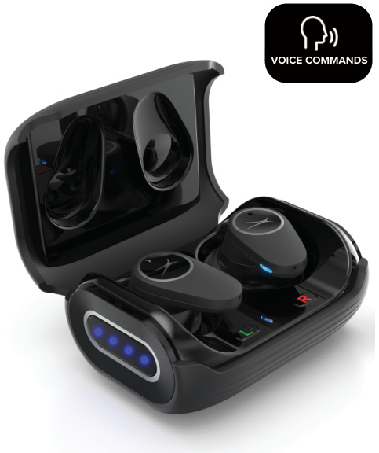
  * Right Earbud, Left Earbud 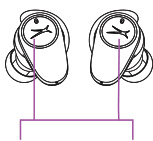
  * Status LED Indicators 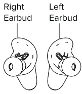
  * Battery Level LED Indicators
  * Battery Level Display Button 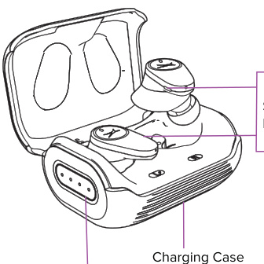

## Charging Case Battery Level

1.  To power the charging case, insert the USB-C cable into the charging port located at the back of the charging case. 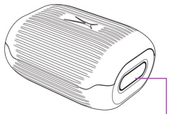
2.  Insert the standard USB cable into any suitable USB port. 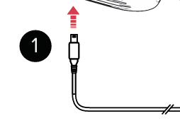
3.  The Battery Level LED Indicators will light up according to the battery capacity. 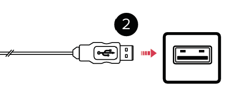
4.  You can see the case battery level at any time by pressing the button on the right hand side of the case. 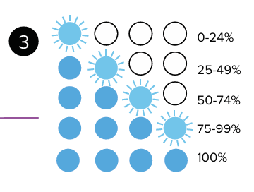

# Setup and Connection

## Powering ON/Pairing and Bluetooth Connection

When the case is opened the earbuds will first connect to each other then enter pairing mode. 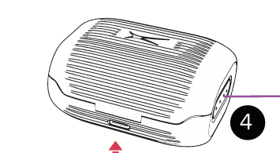

When in the case the earbud LEDs show their charge status: 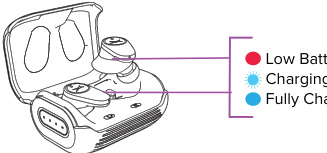
When removed from the case the earbud LEDs show their pairing status: 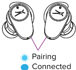

Go to the Bluetooth page in the settings app on your phone. Make sure Bluetooth is ON before connecting to the available device ‘earphones’. 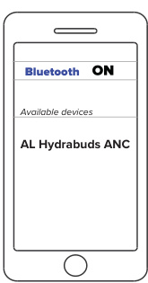

**Note:** If the earbuds have been previously paired to a nearby device they will automatically re-connect to it.

## Multipoint Bluetooth Connection

With the multipoint connection function, you can connect up to two devices with your earbuds (i.e. a smartphone and a computer).

  * To activate multipoint connection, go to the Bluetooth menu of the device already paired to your earbuds and turn Bluetooth OFF. The earbuds will disconnect from your device and become available for pairing to a second device.
  * Pair earbuds to your second device.
  * Turn Bluetooth back ON on your first device and the earbuds will auto-reconnect to it. You now have two devices paired and can use either for music or calls.

## Pair a New Device

Turn Bluetooth OFF on your phone/device. The earphones will go into pairing mode. Alternatively, you can press then press and hold either the left or right earbud to drop the current connection and enter pairing mode. 

# Controls and Features

## Controlling Music and Calls

  * Controlling Music 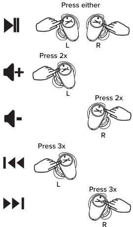
  * Controlling Calls 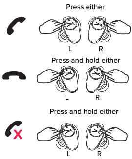

## Other Functions

To activate phone Voice Assistant, press and hold to first beep then let go.

To activate music app, press and hold to first beep then let go. 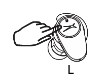 The music app resumes playback where you left off. If there was no previous session or to play other music, simply tap again and music app will play songs it thinks you’ll like.

To Turn ON/OFF ambient awareness and ANC Modes, press the left earbud, the earbud cycles modes. 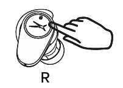

**Low Latency Mode:** This mode reduces the latency (time delay) inherent in Bluetooth connections. It’s best for lipsync and gaming. To turn ON/OFF Low Latency Mode, press and hold to second beep then let go. 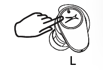

## Reset

Earbuds must be disconnected from Bluetooth and removed from case in order to reset.

To perform a factory reset, press and hold for 6 seconds. This erases all settings. 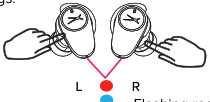
To perform a hardware reset (restarts earphones), press and hold for 10 seconds. Press again to power on. 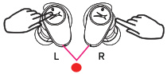
Flashing red and blue lights. Hardware resets are only necessary in the rare case that the earbuds lock up and are unresponsive.

## Earphones App and Voice Control

Via the App you can enable hands-free voice control, customize button actions, browse and enable advanced features and update the firmware where necessary. When the App notifies you, please update to the latest firmware to ensure the best performance and user experience.

Once enabled in the earphones App, simply say “Hey assistant” and you will hear a confirmation tone. Use any of the following commands to control your earphones ANC by voice command (a second tone is heard after successful command).

Say, “Hey assistant”, followed by: “Play”, “Pause”, “Next”, “Volume Up”, “Volume Down”, “Ambient ON”, “Ambient OFF”, “Noise Canceling ON”, “Noise Canceling OFF”, “Spotify”, “Assistant”, “End Call”.

If a call is coming in, you can also use these commands without having to say “Hey assistant” first: “Accept”, “Reject”.

# Safety, Care, and Specifications

## Important Safety Instructions

When using your earphones, basic safety precautions should always be followed including: 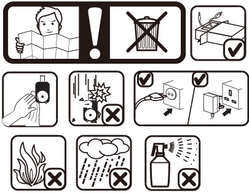

1.  READ ALL INSTRUCTIONS BEFORE USING YOUR EARPHONES AND CHARGING CASE.
2.  Do not use the product near water. Do not put on wet surfaces.
3.  Only clean using a clean cloth.
4.  Do not allow children to play with this product. This product contains small pieces that can be a choking hazard. Parental supervision is advised.
5.  Do not expose this product to excessive heat or fire.
6.  Do not expose this product to temperatures above 100°F. Keep out of direct sunlight.
7.  Do not attempt to repair this product yourself. Contact a qualified service center if the product is in need of service.
8.  Do not drop, crush, or expose this product to excessive physical force.
9.  This product is not intended for commercial use.
10. When charging, keep all charging cables well ventilated. Do not keep your charging cable in contact with flammable materials such as bedding, linens or synthetic fabrics.

## Maintenance and Care

  * Use a soft cloth or paper towel to clean your earphones. Never use any harsh chemicals or detergents for cleaning. Make sure your earphones are dry before charging.
  * When your earphones are not in use, they should be stored in a cool, dry place.
  * Never tug or yank on a cable while it is connected to your charging case. Connect and disconnect cables as carefully as possible.
  * Never expose your earphones to high temperatures, extreme cold.
  * Please recycle or dispose of your earphones properly based on the laws and rules of your municipality. Contact local recycling facilities and/or the manufacturer of your earphones for further information.

## Specifications

  * **Sweat and Dustproof Rating:** IP55
  * **Battery Type:** Lithium Polymer Battery
  * **Bluetooth Version:** V5.2
  * **Bluetooth Range:** 50 ft
  * **Earbud Battery Capacity:** 60mAh
  * **Charging Case Battery Capacity:** 600mAh
  * **Earbud Charging Time:** Approximately 1 Hour
  * **Fast Charge Time:** 10 minutes for 2 Hours Playtime
  * **Play Time:** Approximately 9 Hours*
    **Case holds 3 charges giving 36 hours total*

## FCC Statement

This equipment complies with Part 15 of the FCC Rules. Operation is subject to the following two conditions: (1) This device may not cause harmful interference, and (2) This device must accept any interference received, including interference that may cause undesired operation.

This equipment has been tested and found to comply with the limits for a Class B digital device, pursuant to part 15 of the FCC rules. These limits are designed to provide reasonable protection against harmful interference in a residential installation. This equipment generates, uses and can radiate radio frequency energy and, if not installed and used in accordance with the instructions, may cause harmful interference to radio communications.

However, there is no guarantee that interference will not occur in a particular installation. If this equipment does cause harmful interference to radio or television reception, which can be determined by turning the equipment off and on, the user is encouraged to try to correct the interference by one or more of the following measures:

  * Reorient or relocate the receiving antenna.
  * Increase the separation between the equipment and receiver.
  * Connect the equipment into an outlet on a circuit different from that to which the receiver is connected.
  * Consult the dealer or an experienced radio/TV technician for help.

**FCC Radiation Exposure Statement:** The device has been evaluated to meet general RF exposure requirement. The device can be used in the portable exposure condition without restriction.

# Warranty and Support

## Having trouble? We’re here to help\!

Keep manual and all relevant information for future reference.

This warranty covers the original consumer purchaser only and is not transferable. This warranty covers products that fail to function properly UNDER NORMAL USAGE, due to defects in material or workmanship. Your product will be repaired or replaced at no charge for parts or labor for a period of one year.

## What Is Not Covered by Warranty

Damages or malfunctions not resulting from defects in material or workmanship and damages or malfunctions from other than normal use, including but limited to, repair by unauthorized parties, tampering, modification or accident.

## To Obtain Warranty Service and Troubleshooting Information

To receive Warranty service along with the name and address of an authorized product service center, the original consumer purchaser must contact us for problem determination and service procedures.

Proof of purchase in the form of a bill of sale or receipted invoice, evidencing that the Product is within the applicable Warranty period(s), MUST be presented in order to obtain the requested service.

It is your responsibility to properly package and send any defective products along with a dated copy of proof of purchase, a written explanation of the problem, and a valid return address to the authorized service center at your expense. Do not include any other items or accessories with the defective product. Any products received by the authorized service center that are not covered by warranty will be returned unrepaired.