# Espresso Machine

## Product Introduction

### Extraction System and Instruction Scope

An exclusive system creating the perfect Espresso, time after time. All machines are equipped with a unique extraction system that guarantees up to 19 Bar pressure. Each parameter has been calculated with great precision to ensure that all the aromas from each Grand Cru can be extracted, to give the coffee body and create an exceptionally thick and smooth crema. These instructions are part of the appliance. Read all instructions and all safety instructions before operating the appliance.

# Important Safeguards

## General Safety Instructions

### Basic Precautions and Manual Retention

When using electrical appliances, basic safety precautions should always be followed, including the following: 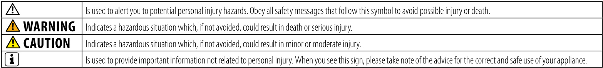

  * Read all instructions. Do not use outdoors. Do not let cord hang over edge of table or counter, or touch hot surfaces. The safety precautions are part of the appliance. Read them carefully before using your new appliance for the first time. Keep them in a place where you can find and refer to them later on.
  * The appliance is intended to prepare beverages according to these instructions. Do not use the appliance for any use other than the intended use. This appliance has been designed for indoor, non-extreme temperature conditions use only. Protect the appliance from direct sunlight, prolonged water splash and humidity.
  * This appliance is intended to be used in households and similar applications only such as: staff kitchen areas in shops, offices and other working environments; by clients in hotels, motels and other residential type environments; bed and breakfast type environments.
### User Eligibility, Warranty, and Descaling Notice

  * This appliance can be used by children aged from 8 years and above and persons with reduced physical, sensory or mental capabilities or lack of experience and knowledge if they have been given supervision or instruction concerning use of the appliance in a safe way and understand the hazards involved. Children shall not play with the appliance. Cleaning and user maintenance shall not be made by children without supervision. Children should be supervised to ensure that they not play with the appliance. Close supervision is necessary when the appliance is used by or near children.
  * The manufacturer accepts no responsibility and the warranty will not apply for any commercial use, inappropriate handling or use of the appliance, any damage resulting from use for other purposes, faulty operation, non-professional repair or failure to comply with the instructions.
  * Descaling agent, when used correctly, helps to ensure the proper functioning of your machine over its lifetime and that your coffee experience is as perfect as on the first day. For the correct amount and procedure to follow, consult the user manual included in the descaling kit.

## Avoid risk of fatal electric shock and fire

### Emergency Power Connection and Cord Requirements

  * In case of an emergency: immediately remove the plug from the power socket. Only plug the appliance into suitable, easily accessible, earthed mains connections. The appliance must only be connected after installation. Make sure that the voltage of the power source is the same as that specified on the rating plate. The use of an incorrect connection voids the warranty.
  * Do not pull the cord over sharp edges, clamp it or allow it to hang down. Keep the cord away from heat and damp. If the supply cord is damaged, it must be replaced by the manufacturer, its service agent or similarly qualified persons. If the cord is damaged, do not operate the appliance. Return the appliance to the Club.
  * If an extension cord is required, use only an earthed cord with a conductor cross-section of at least 16AWG size or matching the input power. Always attach the plug to the appliance first, then plug the cord into the wall outlet. To disconnect, turn any control to «off», then remove the plug from the outlet.
### Placement, Disconnection, and Water Contact Warnings

  * To avoid hazardous damage, never place the appliance on or beside hot surfaces such as radiators, stoves, ovens, gas burners, open flames, or similar. Do not touch hot surfaces. Use handles or knobs. Always place the appliance on a horizontal, stable and even surface. The surface must be resistant to heat and fluids such as water, coffee, descaling agent or similar.
  * Disconnect the appliance from the mains when not in use for a long period. Disconnect by pulling out the plug and not by pulling the cord itself or the cord may become damaged. Before cleaning and servicing, remove the plug from the mains socket and let the appliance cool down.
  * Never touch the cord with wet hands. Never immerse the appliance or part of it in water or any other liquid. Never put the appliance or part of it in a dishwasher. Electricity and water together are dangerous and can lead to fatal electric shocks. Do not open the appliance; dangerous voltage inside. Do not dismantle the appliance. Do not put anything into any openings; doing so may cause fire or electric shock\!

## Avoid possible harm when operating the appliance

### Supervision, Lever Use, and Capsule Safety

  * Never leave the appliance unattended during operation. Do not use the appliance if it is damaged or not operating perfectly. Immediately remove the plug from the power socket. Contact the Club for examination, repair or adjustment. A damaged appliance can cause electric shocks, burns and fire.
  * Always close the lever completely and never lift it during operation; scalding may occur. Do not put fingers under coffee outlet, risk of scalding. Do not put fingers into the capsule compartment or capsule shaft; danger of injury\! Water could flow around a capsule when not perforated by the blades and damage the appliance.
  * Never use a damaged or deformed capsule. If a capsule is stuck in the capsule compartment, turn the machine off and unplug it before any operation; call the Club.
### Water Tank, Cleaning, Capsules, and Quality Control

  * Always fill the water tank with fresh, drinking, cold water. Do not overfill water tank. Empty water tank if the appliance will not be used for an extended time (holidays, etc.). Replace water in water tank when the appliance is not operated during a weekend or a similar period of time.
  * Do not use the appliance without the drip tray and drip grid to avoid spilling any liquid on surrounding surfaces.
  * Do not use any strong cleaning agent or solvent cleaner. Use a damp cloth and mild cleaning agent to clean the surface of the appliance. Do not use a steam or pressure cleaner to clean the appliance; this may damage the appliance to the point of creating a life-threatening hazard.
  * When unpacking the machine, remove the plastic film on the drip grid and dispose.
  * This appliance is designed for coffee capsules available exclusively through the Club or your authorized representative. Quality is only guaranteed when capsules are used in appliances. For your own safety, you should use only parts and appliance accessories from that are designed for your appliance.
  * All appliances pass stringent controls. Reliability tests under practical conditions are randomly performed on selected units. Some units can therefore show traces of previous use. Reserves the right to change instructions without prior notice.

## Short cord instructions

### Short Cord and Extension Cord Use

a) A short power-supply cord or detachable power-supply cord is to be provided to reduce risks resulting from becoming entangled in or tripping over a longer cord.
b) Longer detachable power-supply cord or extension cords are available and may be used if care is exercised in their use.
c) If a long detachable power-supply cord or extension cord is used: 1) The marked electrical rating or the detachable power-supply cord or extension should be at least as great as the electrical rating of the appliance, 2) If the appliance is of the grounded type, the extension cord should be a grounding type 3-wire cord; and 3) The longer cord should be arranged so that it will not drape over the counter top or table top where it can be pulled on by children or tripped over.

### Polarized Plug and Instruction Retention

  * The appliance has a polarized plug (one blade is wider than the other). To reduce the risk of electric shock, this plug is intended to fit into a polarized outlet only one way. If the plug does not fit fully into the outlet, reverse the plug. If it still does not fit, contact a qualified electrician. Do not attempt to modify the plug in any way.

SAVE THESE INSTRUCTIONS. Pass them on to any subsequent user.

# Overview & Specifications

## Overview

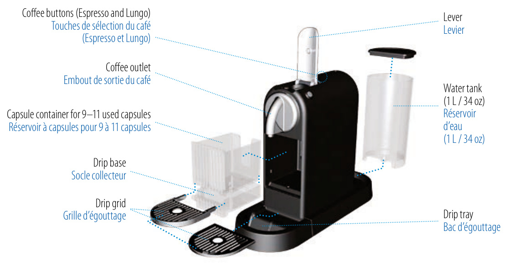

## Specifications

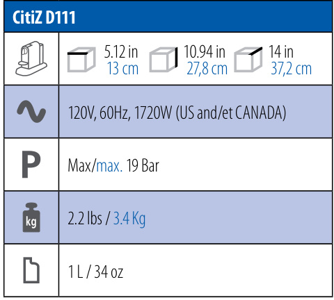

## Packaging Content

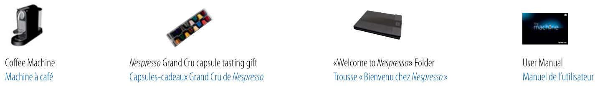

# Machine Operation

## Energy Saving Mode

### Automatic Power Off and Manual Shutdown

This machine is equipped with an energy saving feature. The machine will automatically enter power off mode after 9 minutes. To turn the machine on either press the Espresso or Lungo button. 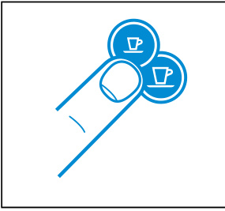

To turn the machine off before automatic Power Off mode, press both the Espresso and Lungo button simultaneously. 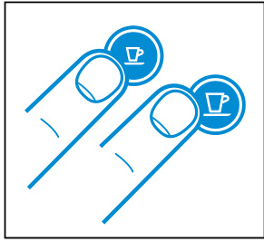

### Changing the Energy Saving Setting

**To change this setting:**

1.  With machine being turned off, press and hold the Espresso button for 3 seconds. 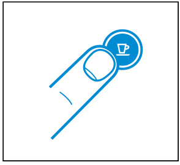
2.  The Espresso button will blink to indicate the current setting. 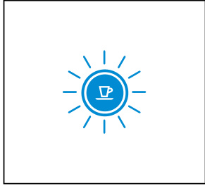
3.  To change this setting press the espresso button: One time for power off mode after 9 minutes. One more time for power off mode after 30 minutes. One more time to deactivate. 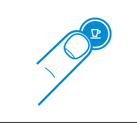
4.  To exit the energy saving mode press the Lungo button for 3 seconds. 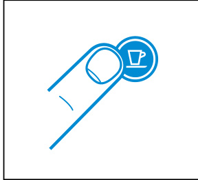

## First Use or After a Long Period of Non-Use

### Initial Setup, Heating, and Rinsing Before Use

CAUTION: first read the important safeguards to avoid risks of fatal electrical shocks and fire.

1.  Remove the plastic film from the drip grid. 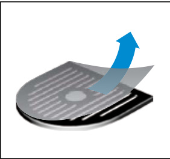
2.  Rinse the water tank before filling with drinkable water. 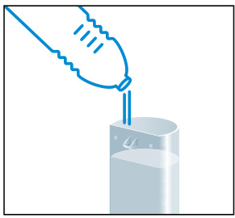
3.  Place a container (minimum 1 L / 34 oz) under coffee outlet. 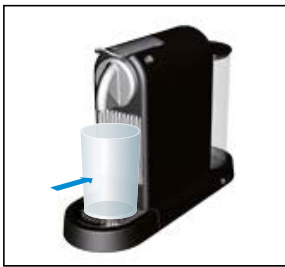
4.  Plug into mains. 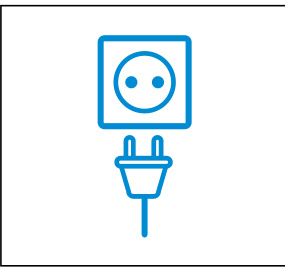
5.  Press the espresso or Lungo button to activate the machine. 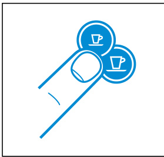
    Blinking lights: heating up (25 seconds). Steady lights: ready 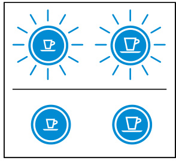
6.  Press the Lungo button to rinse the machine. Repeat 3 times. 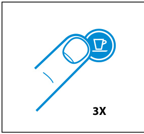

## Coffee Preparation

### Water Filling, Capsule Brewing, and Capsule Ejection

1.  Rinse then fill the water tank with drinkable water. 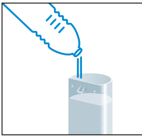
2.  Press the espresso or Lungo button to activate the machine. 
    Blinking lights: heating up (25 seconds). Steady lights: ready 
3.  Lift the lever completely and insert a capsule. CAUTION: never lift lever during operation and refer to the important safeguards to avoid possible harm when operating the appliance. NOTE: during heat up, you can press either coffee button while blinking. The coffee will then flow automatically when the machine is ready. 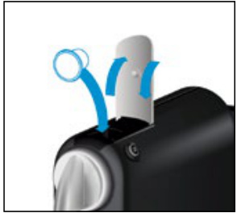
4.  Close the lever and place a cup under the coffee outlet. 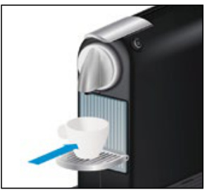
5.  Press the espresso (40 ml / 1.35 oz) or the Lungo (110 ml / 3.7 oz) button to start. Preparation will stop automatically. To stop the coffee flow manually or add more coffee, press again. 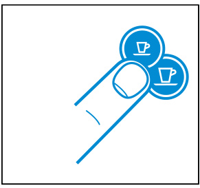
6.  Remove the cup. Lift and close the lever to eject the capsule into the used capsule container. 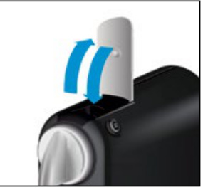

## Programming the Water Volume

### Volume Programming Procedure

1.  Turn the machine on and wait for it to be in ready mode (steady lights). 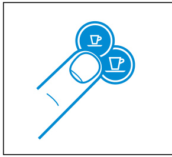
2.  Fill the water tank with potable water and insert a capsule. 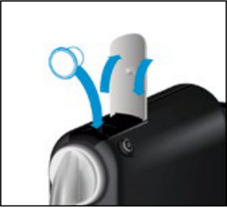
3.  Place a cup under the coffee outlet. 
4.  Press and hold the Espresso or Lungo button. 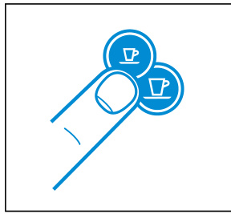
5.  Release button once the desired volume is served.
6.  Water volume level is now stored.

## Emptying the System

### Emptying Mode Procedure and Cleanup

(Before a period of non-use and for frost protection, or before a repair)
NOTE: your machine will be blocked for 10 minutes after emptying mode.

1.  To enter the emptying mode, press both the Espresso and Lungo button to turn the machine off. 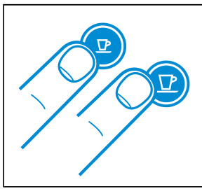
2.  Remove the water tank and open the lever. 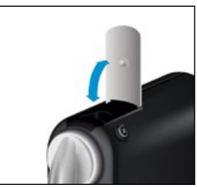
3.  Press both the Espresso and Lungo button for 3 seconds. 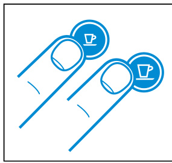
    Both LEDs blink alternatively. 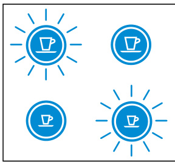
4.  Close the lever. 
5.  Machine switches off automatically.
6.  Empty and clean the used capsule container and drip tray.

## Reset to Factory Settings

### Factory Reset Procedure and Default Values

1.  With machine being turned off, press and hold down the Lungo button for 5 seconds. 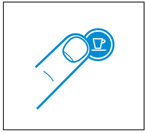
2.  LEDs will blink fast 3 times to confirm machine has been reset to factory settings. 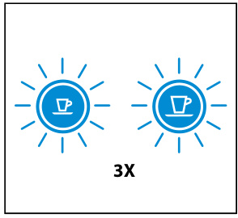
3.  LEDs will then continue to blink normally, as heating up, until ready. Steady lights: machine ready 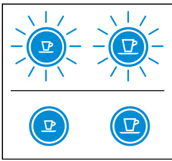

**Factory settings**
Espresso Cup: 40 ml / 1.35 oz
Lungo Cup: 110 ml / 3.7 oz
Power Off mode: 9 minutes

# Maintenance & Troubleshooting

## Descaling

### Descaling Preparation and Mode Entry

NOTE: duration approximately 15 minutes.

1.  Remove the capsule and close the lever. 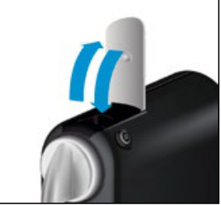
2.  Empty the drip tray and used capsule container. 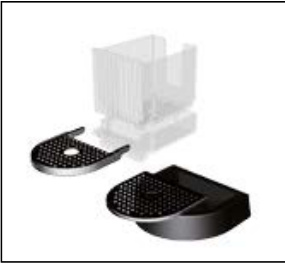
3.  Fill the water tank with 0.5 L / 17 oz of drinkable water and add 1 descaling liquid. 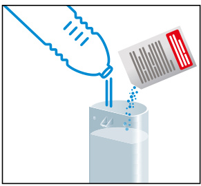
4.  Place a container (minimum volume 1 L / 34 oz) under the coffee outlet. 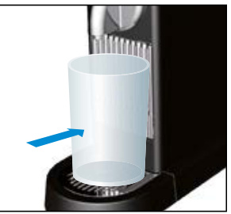
5.  To enter the descaling mode, while the machine is turned on, press both the Espresso and Lungo button for 3 seconds. 
    Both LEDs blink. 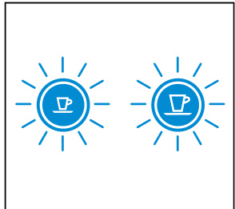
### Descaling Cycle and Rinsing

6.  Press the Lungo button and wait until the water tank is empty. 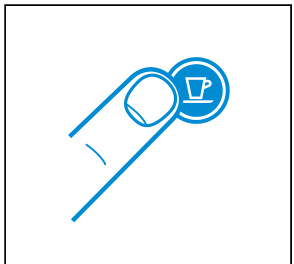
7.  Refill the water tank with the used descaling solution collected in the container and repeat step 4 and 6. 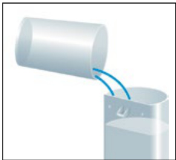
8.  Empty and rinse the water tank. Fill with drinkable water. 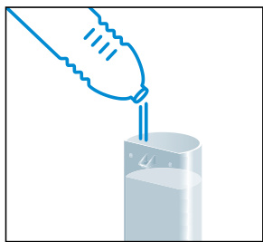
9.  When ready, repeat step 4 and 6 to now rinse the machine.
10. To exit the descaling mode, press both the Espresso and Lungo button for 3 seconds. 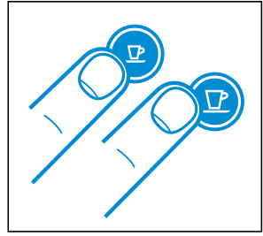
11. The machine is now ready for use.

### Descaling Caution and Frequency Guidance

CAUTION: the descaling solution can be harmful. Avoid contact with eyes, skin and surfaces. Never use any product other than the descaling kit available at the Club to avoid damage to your machine. The following table will indicate the descaling frequency required for the optimum performance of your machine, based on water hardness. For any additional questions you may have regarding descaling, please contact your Club. 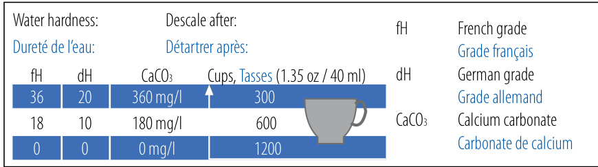

## Cleaning

### Cleaning Warnings and Maintenance Unit

WARNING: Risk of fatal electrical shock and fire. Never immerse the appliance or part of it in water. Make sure to unplug the machine before cleaning. Do not use any strong cleaning agent or solvent cleaner. Do not use sharp objects, brushes or sharp abrasives. Do not place in a dishwasher. Clean the coffee outlet regularly with a soft damp cloth. 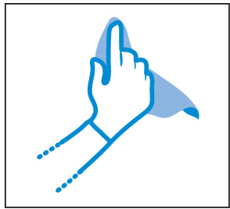
Maintenance unit can be removed in separate pieces for easy cleaning. 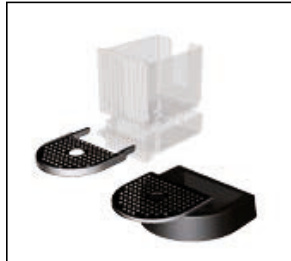

## Troubleshooting

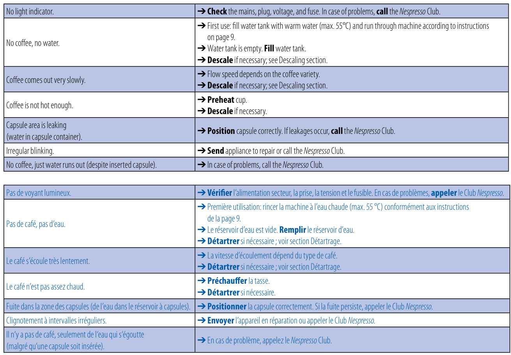

# Support & Environmental Protection

## Contact The Club

### Support Contact Information

Should you need any additional information, in case of problems or simply to seek advice, call the Club. Contact details for your nearest Club can be found in the «Welcome to» folder in your machine box.

## Disposal and Environmental Protection

### Recycling and Disposal Guidance

Packaging materials and appliance contain recyclable materials. Your appliance contains valuable materials that can be recovered or can be recyclable. Separation of the remaining waste materials into different types facilitates the recycling of valuable raw materials. Leave the appliance at a collection point. You can obtain information on disposal from your local authorities.
### Environmental Commitment and Capsule Materials

We have committed to buying coffee of the very highest quality grown in a way that is respectful of the environment and farming communities. Since 2003 we have been working together with the Rainforest Alliance developing our. We chose aluminium as the material for our capsules because it protects the coffee and aromas of the Grand Cru. Aluminium is also infinitely recyclable, without losing any of its qualities. Is committed to designing and making appliances that are innovative, high-performing and user friendly. Now we are engineering environmental benefits into the design of our new and future machine ranges.