# Gas Grill

# Safety and Precautions

## Important Safety Instructions

### Outdoor Use and Immediate Gas Warnings

This Grill is for Outdoor Use Only.Read and follow all Safety, Assembly and Use and Care Instructions in this Guide before assembling and cooking with this grill.Failure to follow all instructions in this Use and Care Guide may lead to fire or explosion, which could result in property damage, personal injury or death.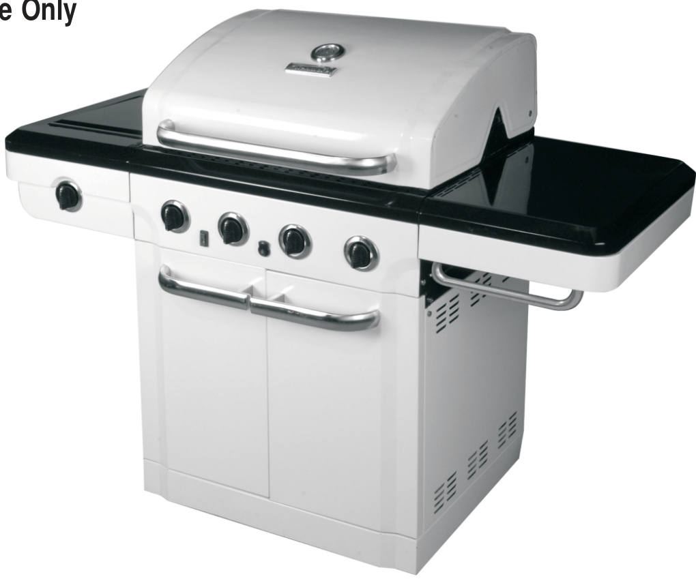

SAVE THESE INSTRUCTIONS\!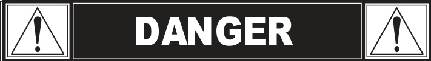

If you smell gas: 1. Shut off gas to the appliance. 2. Extinguish any open flame. 3. Open lid. 4. If odor continues, keep away from the appliance and immediately call your gas supplier or your fire department.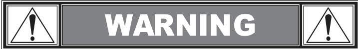

1.  Do not store or use gasoline or other flammable liquids or vapors in the vicinity of this or any other appliance. 2.An LP Tank not connected for use shall not be stored in the vicinity of this or any other appliance.

### Service Contacts and Product Records

Call Grill Service Center For Help And Parts: If you have questions or need assistance during assembly please call 1-800-241-7548. You will be speaking to a representative of the grill manufacturer and not a Sears employee.To order new parts call Sears at 1-800-4-MY-HOME.

Product Record IMPORTANT: Fill out the product record information below. Model Number, Serial Number (See rating label on grill for serial number), Date Purchased. To Installer/Assembler: Leave these instructions with consumer. To Consumer: Keep this manual for future reference.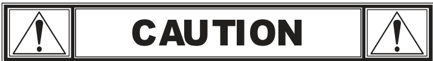

### Handling Precautions and Residential Use

Some parts may contain sharp edges, especially as noted in these instructions. Wear protective gloves if necessary.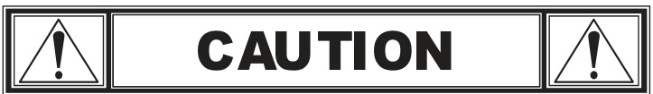

For residential use only. Do not use for commercial cooking.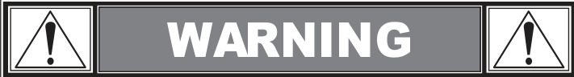

CALIFORNIA PROPOSITION 65: 1. Combustion by-products produced when using this product contain chemicals known to the State of California to cause cancer, birth defects, and other reproductive harm.

### Installation Safety Precautions

Installation Safety Precautions:
Use grill, as purchased, only with LP (propane) gas and the regulator/valve assembly supplied.Grill installation must conform with local codes, or in the absence of local codes, with either the National Fuel Gas Code, ANSI Z223.1/NFPA 54, Natural Gas and Propane Installation Code, CSA B149.1, or Propane Storage and Handling Code, B149.2, or the Standard for Recreational Vehicles, ANSI A119.2/NFPA 1192, and CSA Z240 RV Series, Recreational Vehicle Code, as applicable.
All electrical accessories (such as rotisserie) must be electrically grounded in accordance with local codes, or National Electrical Code, ANSI/NFPA 70 or Canadian Electrical Code, CSA C22.1.Keep any electrical cords and/or fuel supply hoses away from any hot surfaces.
Grill is not for use in or on recreational vehicles and/or boats.
This grill is safety certified for use in the United States and/or Canada only. Do not modify for use in any other location.Modification will result in a safety hazard.

### Safety Symbols and Signal Words

Safety Symbols:
The symbols and boxes shown below explain what each heading means. Read and follow all of the messages found throughout the manual.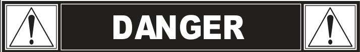
DANGER: Indicates an imminently hazardous situation which, if not avoided, will result in death or serious injury.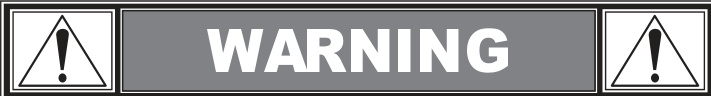
WARNING: Be alert to the possibility of serious bodily injury if the instructions are not followed. Be sure to read and carefully follow all of the messages.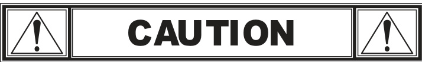
CAUTION: Indicates a potentially hazardous situation which, if not avoided, may result in minor or moderate injury.

## Warranty and Agreements

### Repair Protection Agreement Coverage

Repair Protection Agreements:
Congratulations on making a smart purchase. Your new grill product is designed and manufactured for years of dependable operation. But like all products, it may require repair from time to time.That's when having a Repair Protection Agreement can save you money and aggravation.
Expert service by our 10,000 professional repair specialists. Unlimited service and no charge for parts and labor on all covered repairs. Discount of 10% from regular price of service and related installed parts not covered by the agreement; also, 10% Off regular price of preventive maintenance check. Phone support from a Sears representative.Think of us as a "talking owner's manual."
Once you purchase the Repair Protection Agreement, a simple phone call is all that it takes for you to schedule service.You can call anytime day or night, or schedule a service appointment online.
The Repair Protection Agreement is a risk-free purchase. If you cancel for any reason during the product warranty period we will provide a full refund. Or, a prorated refund anytime after the product warranty period expires.Purchase your Repair Protection Agreement today\!
Some limitations and exclusions apply. For prices and additional information in the U.S.A. call 1-800-827-6655. *Coverage in Canada varies on some items.For full details call Sears Canada at 1-800-361-6665.

### Kenmore Grill Warranty Terms

KENMORE GRILL WARRANTY:
One Year Full Warranty on Grill: If this grill fails due to a defect in material or workmanship within one year from the date of purchase, call 1-800-4-MY-HOME to arrange for free repair (or replacement if repair proves impossible).
Ten-Year Limited Warranty on Burners: For ten years from the date of purchase, any burner that rusts through will be replaced free of charge.After the first year from the date of purchase, you pay for labor if you wish to have it installed.
All warranty coverage excludes ignitor batteries and grill part paint loss, discoloration or rusting, which are either expendable parts that can wear out from normal use within the warranty period, or are conditions that can be the result of normal use, accident or improper maintenance.
All warranty coverage is void if this grill is ever used for commercial or rental purposes.All warranty coverage applies only if this grill is used in the United States.
This warranty gives you specific legal rights, and you may also have other rights which vary from state to state.
Sears Installation Service: For Sears professional installation of home appliances, garage door openers, water heaters, and other major home items, in the U.S.A or Canada call 1-800-4-MY-HOME.

# LP Tank and Gas Specifications

## LP Tank Requirements and Safety

### LP Cylinder Storage and Overfill Warnings

NEVER store a spare LP cylinder under or near the appliance or in an enclosed area.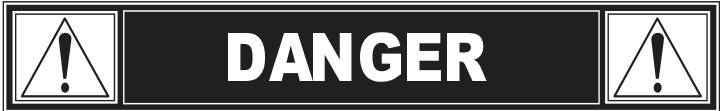
Never fill the cylinder beyond 80% full.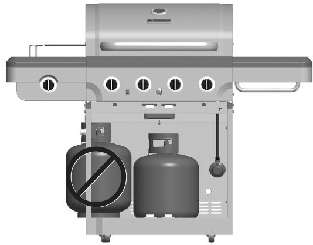
If the information in two points above is not followed exactly, a fire causing death or serious injury may occur.
An overfilled or improperly stored cylinder is a hazard due to possible gas release from the safety relief valve.This could cause an intense fire with risk of property damage, serious injury or death.
If you see, smell or hear gas escaping, immediately get away from the LP cylinder/appliance and call your fire department.

### LP Tank Removal, Transport and Storage

LP Tank Removal, Transport And Storage:
Turn OFF all control knobs and LP tank valve.Turn coupling nut counterclockwise by hand only - do not use tools to disconnect.
Lift LP tank wire upward off of LP tank collar, then lift LP tank up and off of support bracket. Install safety cap onto LP tank valve. Always use cap and strap supplied with valve. Failure to use safety cap as directed may result in serious personal injury and/or property damage.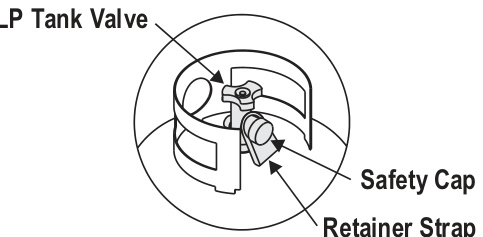
A disconnected LP tank in storage or being transported must have a safety cap installed (as shown). Do not store an LP tank in enclosed spaces such as a carport, garage, porch, covered patio or other building.Never leave an LP tank inside a vehicle which may become overheated by the sun.
Do not store an LP tank in an area where children play.

### LP Tank Construction and Valve Requirements

The LP Tank used with your grill must meet the following requirements:
Use LP Tanks only with these required measurements: 12" (30.5cm) (diameter) x 18" (45.7 cm) (tall) with 20 lb. (9 kg.) capacity maximum.
LP Tanks must be constructed and marked in accordance with specifications for LP Tanks of the U.S. Department of Transportation (DOT) or for Canada, CAN/CSA-B339, tanks, spheres and tubes for transportation of dangerous goods. Transport Canada (TC).See LP Tank collar for marking.
LP Tank valve must have: Type 1 outlet compatible with regulator or grill. Safety relief valve. UL listed Overfill Protection. OPD Hand Wheel feature is identified by a unique triangular hand wheel. Use only LP Tanks equipped with this type of valve.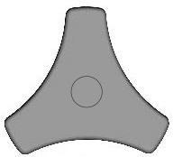
LP Tank must be arranged for vapor withdrawal and include collar to protect LP Tank valve. Always keep LP Tanks in upright position during use, transit or storage. LP Tank in upright position for vapor withdrawal.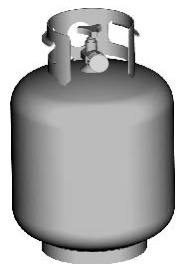

### LP Gas Properties

LP (Liquefied Petroleum Gas):
LP gas is nontoxic, odorless and colorless when produced.For Your Safety, LP gas has been given an odor (similar to rotten cabbage) so that it can be smelled.
LP gas is highly flammable and may ignite unexpectedly when mixed with air.

### LP Tank Filling and Exchange

LP Tank Filling and Exchange:
Use only licensed and experienced dealers. LP dealer must purge new tank before filling. Dealer should NEVER fill LP Tank more than 80% of LP Tank volume.Volume of propane in tank will vary by temperature.
A frosty regulator indicates gas overfill.Immediately close LP Tank valve and call local LP gas dealer for assistance.
Do not release liquid propane (LP) gas into the atmosphere. This is a hazardous practice. To remove gas from LP Tank, contact an LP dealer or call a local fire department for assistance.Check the telephone directory under "Gas Companies" for nearest certified LP dealers.
Many retailers that sell grills offer you the option of replacing your empty LP tank through an exchange service. Use only those reputable exchange companies that inspect, precision fill, test and certify their tanks.Exchange your tank only for an OPD safety feature-equipped tank as described in the "LP Tank" section of this manual.
Always keep new and exchanged LP tanks in upright position during use, transit or storage.Leak test new and exchanged LP tanks BEFORE connecting to grill.

## Leak Testing and Connection

### LP Tank Leak Test Procedure

LP Tank Leak Test For your safety:
Leak test must be repeated each time LP tank is exchanged or refilled. Do not smoke during leak test.Do not use an open flame to check for gas leaks.
Grill must be leak tested outdoors in a well-ventilated area, away from ignition sources such as gas fired or electrical appliances.During leak test, keep grill away from open flames or sparks.
Use a clean paintbrush and a 50/50 mild soap and water solution. Brush soapy solution onto areas indicated by arrows in figure below. Leaks are indicated by growing bubbles.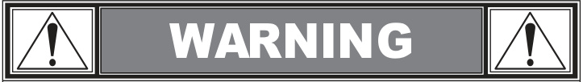
If "growing" bubbles appear do not use or move the LP tank. Contact an LP gas supplier or your fire department\! Do not use household cleaning agents. Damage to gas train components can result.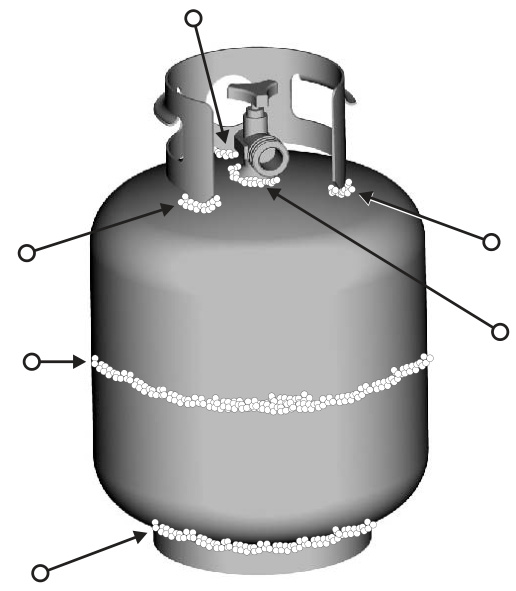

### Regulator Connection to LP Tank

Connecting Regulator To The LP Tank:

1.  LP tank must be properly secured onto grill. (Refer to assembly section.)
2.Turn all control knobs to the OFF position.
3.Turn LP tank OFF by turning OPD hand wheel clockwise to a full stop.
4.  Remove the protective cap from LP tank valve. Always use cap and strap supplied with valve. 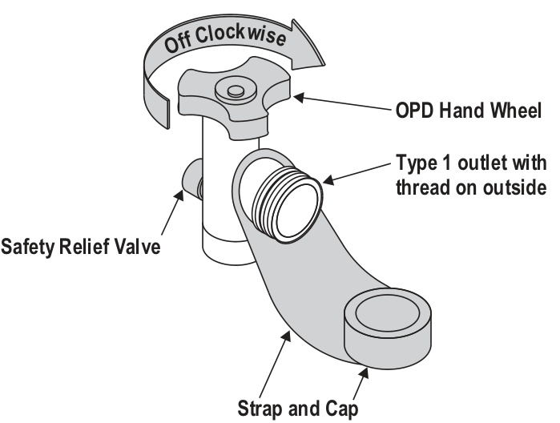 Do not use a POL transport plug (plastic part with external threads)\! It will defeat the safety feature of the valve.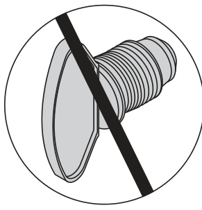
5.  Hold regulator and insert nipple into LP tank valve. Hand-tighten the coupling nut, holding regulator in a straight line with LP tank valve so as not to cross-thread.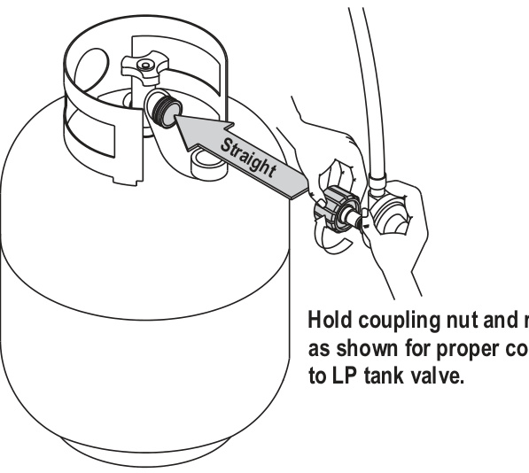 Nipple has to be centered into the LP tank valve.
6.  Turn the coupling nut clockwise and tighten to a full stop. The regulator will seal on the back-check feature in the LP tank valve, resulting in some resistance. An additional one-half to three-quarters turn is required to complete the connection.Tighten by hand only - do not use tools.
    NOTE: If you cannot complete the connection, disconnect regulator and repeat steps 5 and 6. If you are still unable to complete the connection, do not use this regulator\!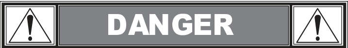
    Do not insert any tool or foreign objects into the valve outlet or safety relief valve. You may damage the valve and cause a leak.Leaking propane may result in explosion, fire, severe personal injury, or death.
    If a leak is detected at any time, STOP and call the fire department.If you cannot stop a gas leak, immediately close LP tank valve and call LP gas supplier or your fire department\!

### Valve, Hose and Regulator Leak Test

Leak Testing Valves, Hose and Regulator:

1.Turn all grill control knobs to OFF.
2.Be sure regulator is tightly connected to LP tank.
3.  Completely open LP tank valve by turning OPD hand wheel counterclockwise. If you hear a rushing sound, turn gas off immediately. There is a major leak at the connection.Correct before proceeding by calling Sears for replacement parts at 1-800-4-MY-HOME.
4.Brush soapy solution onto areas where bubbles are shown in picture below: 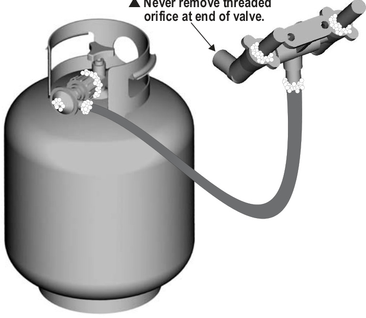
5.  If "growing" bubbles appear, there is a leak. Close LP tank valve immediately and retighten connections. If leaks cannot be stopped do not try to repair.Call Sears for replacement parts at 1-800-4-MY-HOME.
6.  Always close LP tank valve after performing leak test by turning hand wheel clockwise.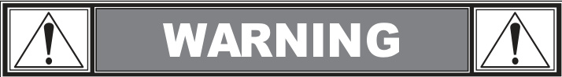
    Never attempt to attach this grill to the self-contained LP gas system of a camper trailer or motor home. Do not use grill until leak-tested.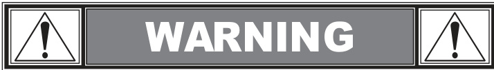

# Operation and Maintenance

## Grill Operation and Lighting

### Safe Grill Use and Clearance Requirements

For Safe Use Of Your Grill And To Avoid Serious Injury:
Do not let children operate or play near grill. Keep grill area clear and free from materials that burn. Do not block holes in bottom or back of grill. Check burner flames regularly. Use grill only in well-ventilated space.NEVER use in enclosed space such as carport, garage, porch, covered patio, or under an overhead structure of any kind.
Do not use charcoal or ceramic briquets in a gas grill\! (Unless briquets are supplied with your grill).
Use grill at least 3 ft. from any wall or surface.Maintain 10 ft. clearance to objects that can catch fire or sources of ignition such as pilot lights on water heaters, live electrical appliances, etc. 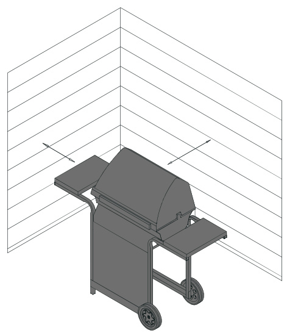

### Operating Safety Tips

Safety Tips:
Before opening LP tank valve, check the coupling nut for tightness. When grill is not in use, turn off all control knobs and LP tank valve. Never move grill while in operation or still hot.Use long-handled barbecue utensils and oven mitts to avoid burns and splatters.
Maximum load for shelves is 10 lbs.Do not use a cooking pot larger than 9" on grid.
The grease tray must be installed into opening in back panel and should be emptied after each use.Do not remove grease tray until grill has completely cooled.
If you notice grease or other hot material dripping from grill onto valve, hose or regulator, turn off gas supply at once. Determine the cause, correct it, then clean and inspect valve, hose and regulator before continuing.Perform a leak test.
The regulator may make a humming or whistling noise during operation. This will not affect safety or use of grill. If you have a grill problem see the "Troubleshooting Section".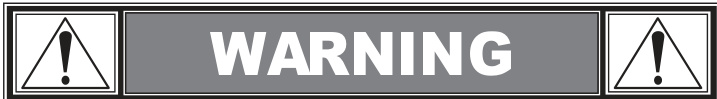
If the regulator frosts, turn off grill and LP tank valve immediately. This indicates a problem with the tank and it should not be used on any product. Return to supplier\!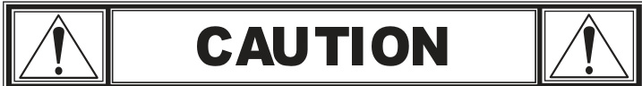
If burner does not light, turn knobs to OFF, wait 5 minutes, and try again. Always close valve during the 5 minute waiting period.If the burner does not ignite with the valve open, gas will continue to flow out of the burner and could accidentally ignite with risk of injury.

### Apartment Use Restrictions

Apartment Dwellers:
Check with management to learn the requirements and fire codes for using an LP gas grill in your apartment complex. If allowed, use outside on the ground floor with a three (3) foot clearance from walls or rails.Do not use on or under balconies.
NEVER attempt to light burner with lid closed. A buildup of non-ignited gas inside a closed grill is hazardous. Never operate grill with LP tank out of correct position specified in assembly instructions.Always close LP tank valve and remove coupling nut before moving LP tank from specified operation position.

### Ignitor Lighting Procedure

Ignitor Lighting:
Do not lean over grill while lighting.

1.Open lid during lighting.
2.Turn on gas Tank valve.
3.Push and turn burner control knob to HI and immediately press and hold ELECTRONIC IGNITION button.
4.If ignition does NOT occur in 5 seconds, turn burner control knob OFF, wait 5 minutes, and repeat the lighting procedure.
5.Repeat above steps to light each burner individually.

### Main Burner Match Lighting Procedure

Main Burner Match Lighting:
Do not lean over grill while lighting.

1.Open lid during lighting.
2.  Place match into match holder (hanging from side of cart).Light match, place into lighting hole on right side of firebox.
3.  Push in and turn right knob to HI position.Be sure burner lights and stays lit.
4.If ignition does NOT occur in 5 seconds, turn the burner control knob OFF, wait 5 minutes for gas to clear, and repeat the lighting procedure.
5.  Light other burners by pushing knob in and turning to HI position. After lighting: Leave knobs in HI position for 15 minutes to preheat the grill. Then turn knobs to desired setting for cooking.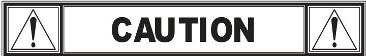

### Grease Fire Prevention and Response

Putting out grease fires by closing the lid is not possible. Grills are well ventilated for safety reasons. Do not use water on a grease fire. Personal injury may result.If a grease fire develops, turn knobs and LP tank off.
Do not leave grill unattended while preheating or burning off food residue on high. If grill has not been regularly cleaned, a grease fire can occur that may damage the product. Follow instructions on General Grill Cleaning and Cleaning The Burner Assembly to prevent grease fires.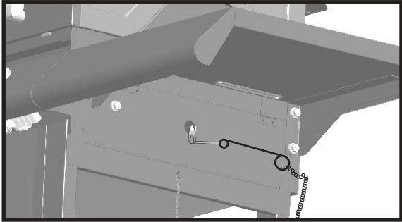

### Side Burner Match Lighting Procedure

Side Burner Match Lighting:
Do not lean over grill while lighting.

1.  Open lid during lighting.Turn on gas at LP Tank.
2.Place lit match near burner.
3.  Turn sideburner knob to HI position.Be sure burner lights and stays lit.
4.  If ignition does NOT occur in 5 seconds, turn the burner control knob OFF, wait 5 minutes for gas to clear, and repeat the lighting procedure.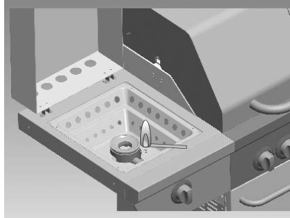

### First Cookout Preparation

Before Your First Cookout:
Light burners, check to make sure they are lit, close the lid and warm up grill on HIGH for 15 minutes.This curing of paint and parts will produce an odor only on first lighting.

### Burner Flame Check

Burner Flame Check:
Light burner, rotate knobs from HIGH to LOW. You should see a smaller flame in LOW position than seen on HIGH. Always check flame prior to each use. If only low flame is seen refer to "Sudden drop or low flame" in the Troubleshooting Section.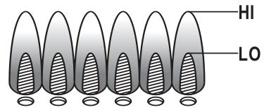

### Hose Check

Hose Check:
Before each use, check to see if hoses are cut, worn or kinked. Replace damaged hoses before using grill. Use only valve/hose/regulator specified in the Parts List.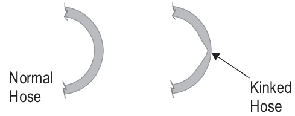

### Turning Grill Off

Turning Grill Off:
Turn all knobs to OFF position.Turn LP tank off by turning OPD hand wheel clockwise to a full stop.

### Ignitor Check

Ignitor Check:
Turn gas off at LP tank. Push and turn burner control to "Clicking" should be heard and sparking seen each time between collector box or burner and electrodes.See "Troubleshooting" if no click or spark occurs.

### Valve Check

Valve Check:
Important: Make sure gas is off at LP tank before checking valves. Knobs lock in OFF position. To check valves, first push in knobs and release, knobs should spring back. If knobs do not spring back, replace valve assembly before using grill. Turn knobs to LO position then turn back to OFF position.Valves should turn smoothly.

## Cleaning and Storage

### General Grill Cleaning

General Grill Cleaning:
Keep the outside of your grill looking new by cleaning it once a month with warm soap and water or a non-abrasive cleaner.If you don't have a grill cover, wipe off dust and grime before starting your grill.
Coating the cooking grids with spray-on cooking oil will keep the food from sticking and make clean up easier.After cooking, scrape the grates with a long handled, brass wire bristle brush.
Check inside the grill bottom for grease build up and clean often, especially after cooking fatty meat. Do not mistake brown or black accumulation of grease and smoke for paint. Apply a strong solution of detergent and water or use a grill cleaner with scrub brush on insides of grill lid and bottom. Rinse and allow to completely air dry.Do not apply a caustic grill/oven cleaner to painted surfaces.
Plated wire grates: Wash grates with concentrated grill cleaner or use soap and water solution.Dry thoroughly and store indoors between cookouts.
Plastic parts: Wash with warm soapy water and wipe dry. Do not use citrisol, abrasive cleaners, degreasers or a concentrated grill cleaner on plastic parts.Damage to and failure of parts can result.
Porcelain grates: Because of glass-like composition, most residue can be wiped away with baking soda/water solution or specially formulated cleaner.Use non-abrasive scouring powder for stubborn stains.
Cooking surfaces: If a bristle brush is used to clean any of the grill cooking surfaces, ensure no loose bristles remain on cooking surfaces prior to grilling.It is not recommended to clean cooking surfaces while grill is hot.

### Spider Alert and Flashback Prevention

SPIDER ALERT\!
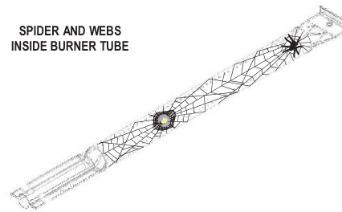 If you notice that your grill is getting hard to light or that the flame isn't as strong as it should be, take the time to check and clean the burners.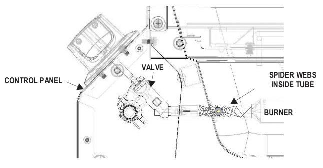
In some areas of the country, spiders or small insects have been known to create "flashback" problems. The spiders spin webs, build nests and lay eggs in the grill's burner tube(s) obstructing the flow of gas to the burner. The backed-up gas can ignite in the tube behind the control panel.This is known as a flashback and it can damage your grill and even cause injury.
To prevent flashbacks and ensure good performance the burner assembly should be removed from the grill and cleaned before use whenever the grill has been idle for an extended period.

### Cleaning the Burner Assembly

Cleaning the Burner Assembly:
Follow these instructions to clean and/or replace parts of burner assembly or if you have trouble igniting grill.

1.Turn gas off at control knobs and LP cylinder.
2.Remove cooking grates and flame tamers.
3.Remove hitch pins and carryover tubes from rear of burners.
4.Remove Hitch pin to disengage burner from bracket on firebox.
5.  Detach electrode from burner with a flat screwdriver by pressing the electrode clamp out of the burner through the notch on the clamp.Electrode should remain in firebox.
6.  Carefully lift each burner up and away from valve openings.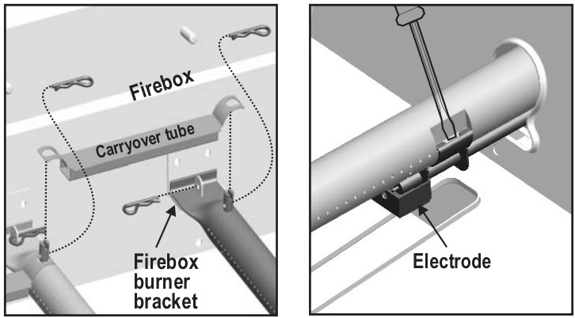
    We suggest three ways to clean the burner tubes. Use the one easiest for you. (A) Bend a stiff wire (a lightweight coat hanger works well) into a small hook. Run the hook through each burner tube several times. (B) Use a narrow bottle brush with a flexible handle (do not use a brass wire brush), run the brush through each burner tube several times. (C) Wear eye protection: Use an air hose to force air into the burner tube and out the burner ports.Check each port to make sure air comes out each hole.
7.Wire brush entire outer surface of burner to remove food residue and dirt.
8.Clean any blocked ports with a stiff wire such as an open paperclip.
9.  Check burner for damage, due to normal wear and corrosion some holes may become enlarged.If any large cracks or holes are found replace burner.
10. Attach electrode to burner. 11. Carefully replace burners. 12. Attach burners to brackets on firebox.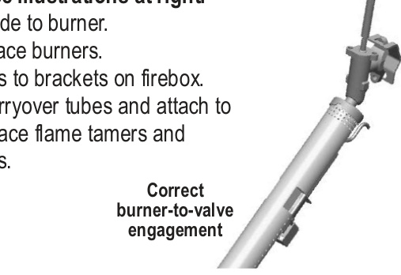

### Storing Your Grill

Storing Your Grill:
Clean cooking grates. Store in dry location. When LP tank is connected to grill, store outdoors in well-ventilated space and out of reach of children.Cover grill if stored outdoors.
Store grill indoors ONLY if LP tank is turned off and disconnected, removed from grill and stored outdoors.When removing grill from storage follow "Cleaning Burner Assembly" instructions before starting grill.

# Cooking and Food Safety

## Food Preparation

### Food Safety Basics

Food Safety:
Food safety is a very important part of enjoying the outdoor cooking experience. To keep food safe from harmful bacteria, follow these four basic steps:
Clean: Wash hands, utensils, and surfaces with hot soapy water before and after handling raw meat and poultry.
Separate: Separate raw meats and poultry from ready-to-eat foods to avoid cross contamination. Use a clean platter and utensils when removing cooked foods.
Cook: Cook meat and poultry thoroughly to kill bacteria. Use a thermometer to ensure proper internal food temperatures.
Chill: Refrigerate prepared foods and leftovers promptly.
For more information call: USDA Meat and Poultry Hotline at 1-800-535-4555 (In Washington, DC (202) 720-3333, 10:00 am-4:00pm EST).

### Meat Doneness and Internal Temperatures

How To Tell If Meat Is Grilled Thoroughly:
Meat and poultry cooked on a grill often browns very fast on the outside.Use a meat thermometer to be sure food has reached a safe internal temperature, and cut into food to check for visual signs of doneness.
Whole poultry should reach 165°F.Juices should run clear and flesh should not be pink.
Hamburgers made of any ground meat or poultry should reach 160°F, and be brown in the middle with no pink juices. Beef, veal and lamb steaks, roasts and chops can be cooked to 145°F.All cuts of pork should reach 160°F.
NEVER partially grill meat or poultry and finish cooking later. Cook food completely to destroy harmful bacteria.When reheating takeout foods or fully cooked meats like hot dogs, grill to 165°F, or until steaming hot.
WARNING: To ensure that it is safe to eat, food must be cooked to the minimum internal temperatures listed in the table below.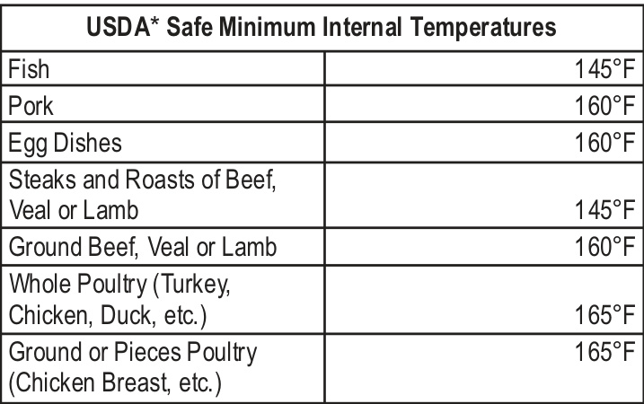 United States Department of Agriculture

## Cooking Methods

### Indirect Cooking

Indirect Cooking:
Poultry and large cuts of meat cook slowly to perfection on the grill by indirect heat. The heat from selected burners circulates gently throughout the grill, cooking meat or poultry without the touch of a direct flame. This method greatly reduces flare-ups when cooking extra fatty cuts because there is no direct flame to ignite the fats and juices that drip during cooking.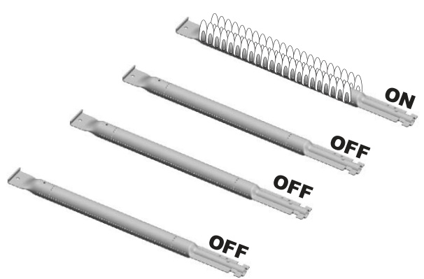
1 Burner Cooking: Cook with direct or indirect heat. Best for smaller meals or foods.Consumes less fuel.

Indirect Cooking Instructions:
Always cook with the lid closed. Due to weather conditions, cooking times may vary. During cold and windy conditions the temperature setting may need to be increased to insure sufficient cooking temperatures.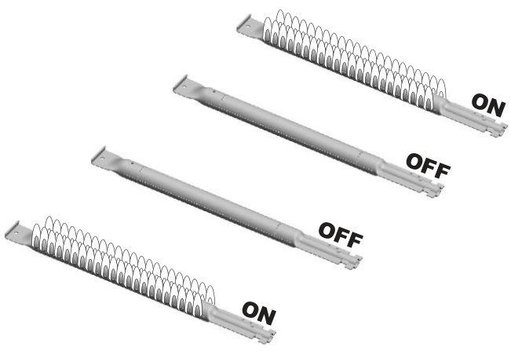
Great indirect cooking on low. Produces slow, even heating.Ideal for slow roasting and baking.

# Electrical Instructions and Halogen Light

## Halogen Light Operation

### Light Operation Instructions

LIGHT OPERATION INSTRUCTIONS:

1.Make sure light switch on the control panel is in the "OFF" position.
2.Connect light plug to an extension cord, then put the extension cord plug into the outlet on the wall.
3.  Turn the light switch to "ON".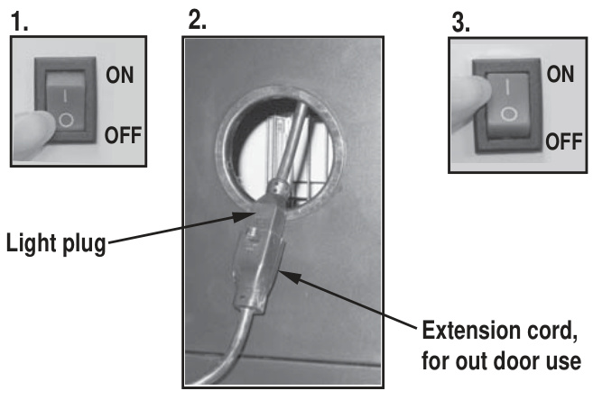 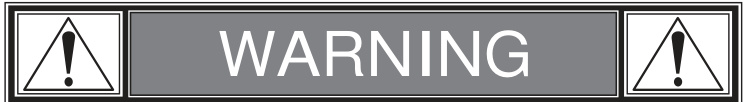
    Keep any electrical supply cord away from any heated surface. Use the shortest length extension cord required.Do not connect 2 or more extension cords together.

### Bulb Replacement

Bulb Replacement:
Make sure light switch on the control panel is in the "OFF" position and adapter plug is disconnected from outlet.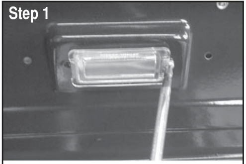
Release the screw securing the light socket.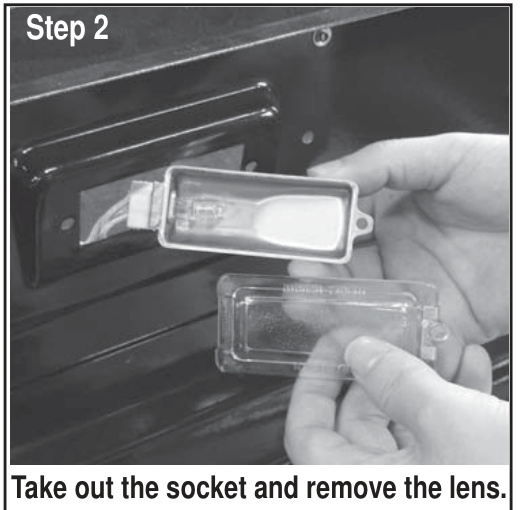
Take out the socket and remove the lens.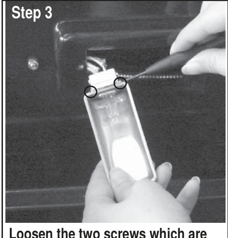
Loosen the two screws which are locking the bulb.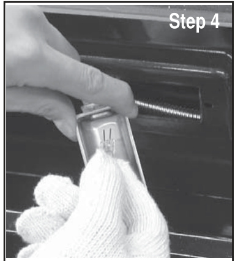
Pull out the bulb and replace with a new bulb.Reverse instructions from step 3 through step 1 to re-install socket.
Bulb Specification: Bulb Type: Halogen. Wattage: 10W per bulb.Voltage: 12V.
CAUTION: Take care not to touch the bulb with your bare fingers.Touching bulb with your skin can leave a film on the bulb that causes it to burn out quickly.

### Cleaning the Lens

Cleaning the Lens:

1.Prior to cleaning, make sure the light switch is in the "OFF" position and the light plug is disconnected from the power supply.
2.  Do not clean the glass lens when warm. Allow to cool before cleaning.Sudden change in temperature may cause cracking of the glass lens.
3.Use a damp towel to clean the surface of the glass lens.
4.Allow the lens to dry before reconnecting the light plug to the power supply and turning the light switch to the "ON" position.

## Electrical Safety

### GFI Protection and Electrical Requirements

IMPORTANT:
Since 1971 the National Electric Code (NEC) has required Ground Fault Interrupter devices on all outdoor circuits.If your residence was built before 1971, check with a qualified electrician to determine if a Ground Fault Interrupter protector exists.
Do not use this appliance if the circuit does not have GFI protection. Do not plug this appliance into an indoor circuit.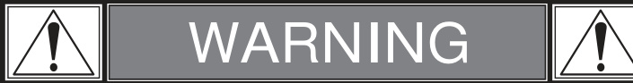

### Electrical Use Precautions

1.To protect against electric shock, do not immerse cord or plugs in water or other liquid.
2.  Unplug from the outlet when not in use and before cleaning.Allow to cool before putting on or taking off parts.
3.Do not operate grill with a damaged cord, plug, or after the appliance malfunctions or has been damaged in any manner.
4.Do not let the cord hang over the edge of a table or touch hot surfaces.
5.Do not use an outdoor cooking gas appliance for purposes other than intended.
6.When connecting, first connect plug to the outdoor cooking gas appliance then plug appliance into the outlet.
7.Use only a Ground Fault Interrupter (GFI) protected circuit with this outdoor cooking gas appliance.
8.Never remove the grounding plug or use with an adapter of 2 prongs.
9.Use only extension cords with a 3 prong grounding plug, rated for the power of the equipment, and approved for outdoor use with a W-A marking.

# Parts and Assembly

## Parts Information

### Tools, Parts List and Diagram

Tools needed for assembly: Adjustable wrench (not provided), Screwdriver (not provided), 7/16" Combination wrench (not provided).
PARTS LIST 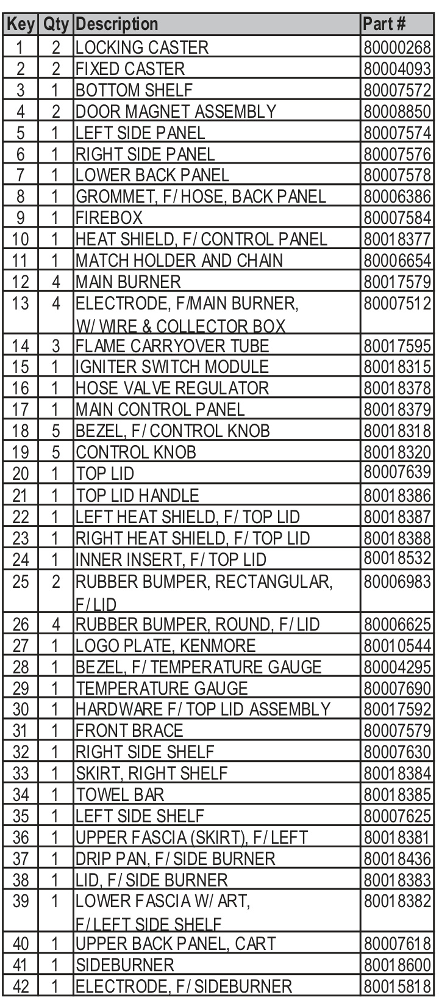 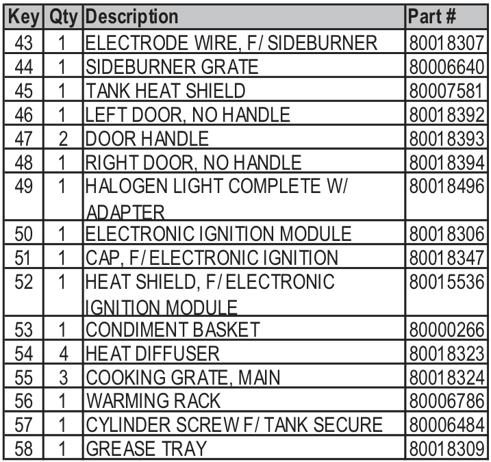
NOT Pictured 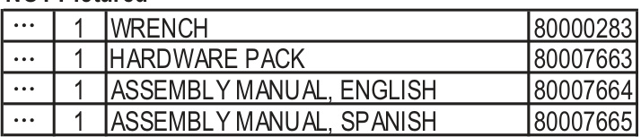
If you are missing hardware or have damaged parts, please call 1-800-241-7548 for replacement.
PARTS DIAGRAM 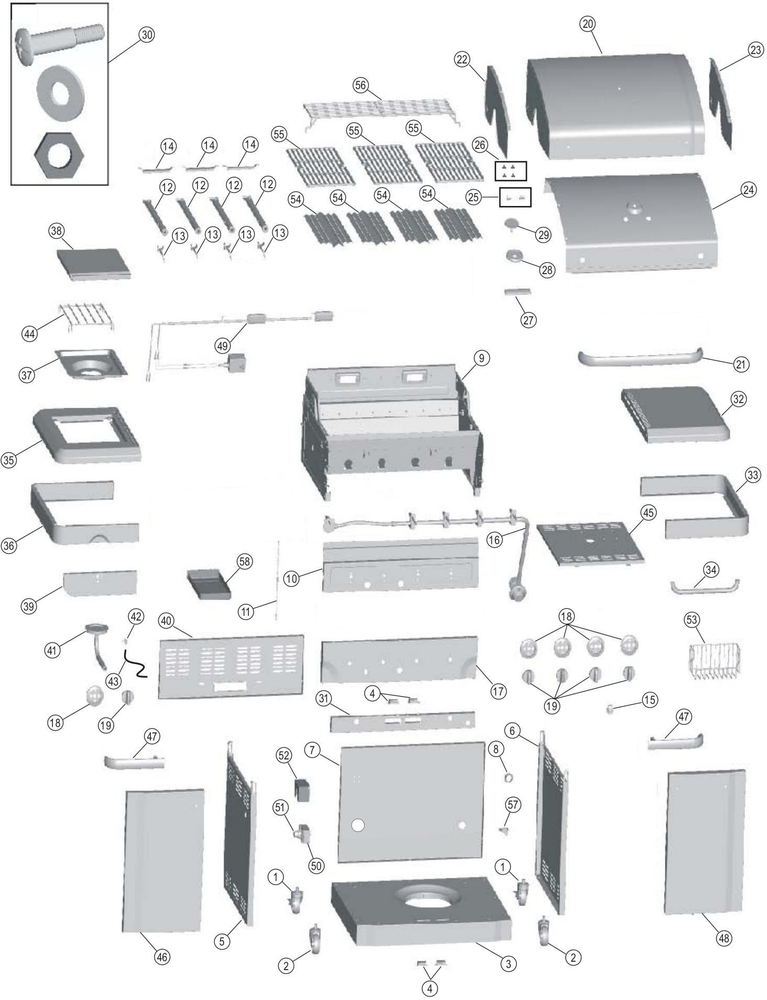

## Assembly Instructions

### Assembly Steps 1-5: Cart Base and Grill Head

1.  Attach the two locking casters at the rear of the bottom shelf and the two fixed casters at the front using the supplied wrench.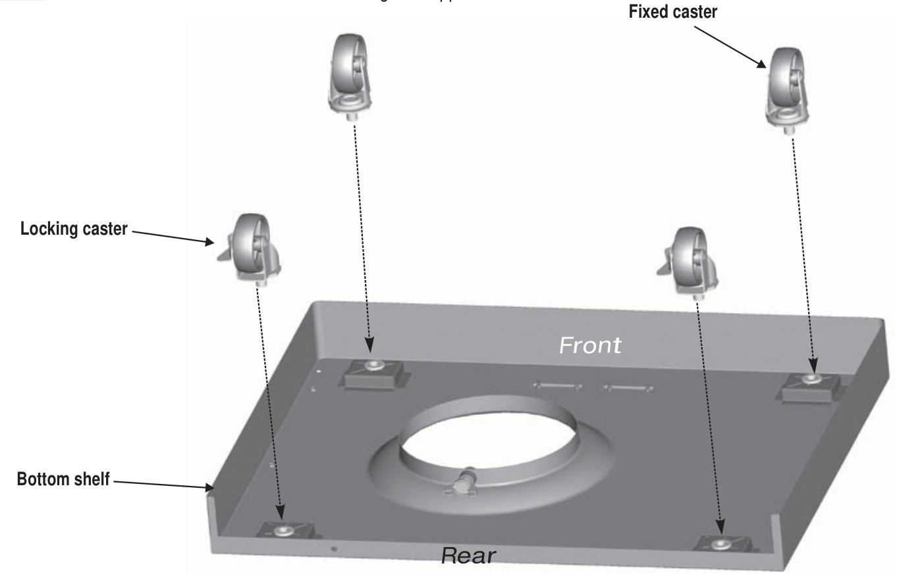
2.
3.  Attach light adapter to back panel using four #8-32x3/8" screws, 4mm lock washers, 4mm flat washers and #8 nuts, shown A. Place lower back panel between side panels at rear of bottom shelf. Secure lower back panel to side panels using two 1/4-20x1/2" screws and 7mm lock washers each side.Secure lower back panel to bottom shelf using one 1/4-20x1/2" screw and 7 mm lock washer, shown B.  #8-32x3/8" screw Qty.4, 4mm lock washer Qty.4, 4mm flat washer Qty.4, 1/4-20x1/2" screw Qty.5, 7mm lock washer Qty.5. 
4.  This step requires two people to lift and position grill head onto cart. Carefully lower the grill head onto the cart, aligning slots at bottom of grill head with posts on cart side panels. Make sure the regulator hose is hanging inside the cart. Grill head must face open side of cart.
5.  Insert front brace under control panel and between cart side panels.Secure using two 1/4-20x1/2" screws, 7 mm lock washers on each side. NOTE: MAKE SURE THAT THE FRONT BRACE IS MOUNTED AS ILLUSTRATED BELOW. 
### Assembly Steps 6-8: Side Shelves and Back Panels

6.Remove the two screws and washers which were attached on right side of firebox front, shown A. Insert flange on right side shelf into side shelf brackets on side of firebox, shown B. Attach right side shelf front using the two screws and washers which were removed from right side of firebox, shown C. Attach rear of shelf using one 1/4"-20x1/2" screw, 7mm lock washer, fiber washer and 1/4" nut, shown D/E. 
7.Attach left side lower fascia to left side upper fascia using three #10x3/8" screws, 5mm lock washers and 5mm flat washers, shown A. Remove the three screws and washers which were attached on left side of firebox front, shown B. Insert flange on left side shelf into side shelf brackets on side of firebox, shown C. Attach front of side shelf using the three screws and washers which were removed from left side of firebox front, shown D. Attach rear of shelf using one 1/4-20x1/2" screw, 7 mm lock washer, fiber washer and 1/4" Nut, shown E/F.    
8.  On back of grill, place upper back panel between side panels and above lower back panel.Secure upper back panel, in lower holes, using one 1/4-20x1/2" screw and 7mm lock washer on each side. In upper holes, using one 1/4-20x1/2" screw and 7mm lock washer on each side, shown A. In the cart, secure upper back panel to lower back panel using 
### Assembly Steps 9-12: Side Burner and Wiring

9.  First, remove the two screws and lock washers factory attached to the side burner valve bracket. Position sideburner valve bracket beneath side burner shelf fascia so that valve stem comes through larger center hole in fascia. Align the holes on valve bracket with left and right holes on fascia. Secure using lock washers and screws that were removed from bracket. Next, place side burner bezel over valve stem on front side of fascia. Align small holes on bezel with upper and lower holes on fascia, making sure "OFF" is on the top.Attach using two #8-32x3/8" screws and 4 mm lock washers. Press side burner control knob onto valve stem. 
10. Insert sideburner burner into left shelf.The stud on bottom of burner fits into rear small hole in sideburner drip pan on shelf, shown A. Secure burner to sideburner drip pan with one Wing nut, shown B. Make sure burner tube engages side burner valve, shown C.  Wing nut Qty.1 
11.Under sideburner shelf, attach sideburner ignitor wire to electrode, shown A. Place sideburner grate onto sideburner shelf aligning grate legs with holes in shelf, shown B.  Side burner Ignitor Wire 
12. Connect Adapter wire harness and Light wire harness.
### Assembly Steps 13-16: Shields, Ignition Module and Doors

13.Inside of cart, insert rear shield tabs into slots next to grease tray opening on upper back panel, shown A. Attach front shield tabs (with holes) under front brace with two #8x3/8" self-tapping screws, shown B. 
14. Connect each of the wires from the main burner electrodes, and sideburner electrode into the back of the Electronic Ignition Module. Total (5) connections, shown A. Connect the two wires [(a) and (b)] from the switch wiring harness into the back of the Electronic Ignition Module. Total (2) connections, shown A. NOTE: Switch terminals are larger than electrode terminals and should only be installed in location shown as (a), (b). Release the cap and nut from electronic ignition module. Attach electronic ignition module and heat shield to the cart left side panel with the nut, shown B. Insert AA battery into ignition module, negative (-) end first.Then put on the cap, shown C. 
15. Insert hinge pin on bottom of doors into hole in bottom shelf. Press upper hinge pin in front brace, align hinge hole on top of door, and release hinge pin into door.
16. Place the Condiment Basket on the right door inside, make sure to insert the legs of the Condiment Basket into the brackets which were attached on the door inside shown as below.
### Assembly Steps 17-20: Cooking Components, LP Cylinder and Grease Tray

17. Install heat diffusers by sliding one end of each heat diffuser into slots at front of firebox and resting opposite end on pins in back of firebox.Note: Some parts omitted for 
18. Place cooking grates onto the firebox as shown. Insert the two wire ends at rear of warming rack into holes in back of firebox. Front wires of warming rack rest on sides of firebox. Note: Some parts omitted for clarity of illustration.
19. LP CYLINDER IS SOLD SEPARATELY. Fill and leak check the cylinder before attaching to grill and regulator (see Use & Care section). Once cylinder has been filled and leak checked, place cylinder into hole in bottom shelf. Make sure cylinder valve is facing front of grill. Secure cylinder with cylinder screw under bottom shelf. See Use & Care section of this manual to perform the "Burner Flame Check" and for important safety instructions before using.  Always keep LP cylinders in upright position during use, transport, and storage.  Cylinder valve must face to front of cart once tank is attached. Failure to install cylinder correctly may allow gas hose to be damaged in operation, resulting in the risk of fire.
20. On back of grill, slide grease tray into opening in upper back panel.CAUTION: Failure to install grease tray will cause hot grease to drip from bottom of grill with risk of fire or property 

# Troubleshooting

## Emergency and Fault Resolution

### Emergency Response and Troubleshooting Tables

EMERGENCIES: If a gas leak cannot be stopped, or a fire occurs due to gas leakage, call the fire department.
Troubleshooting 
Troubleshooting (continued) 
Troubleshooting - Electronic Ignition 
