# Microwave

Over-the-Range Microwave Use and Care Manual For Models: HMV9302, HMV9305, HMV9306, HMV9307 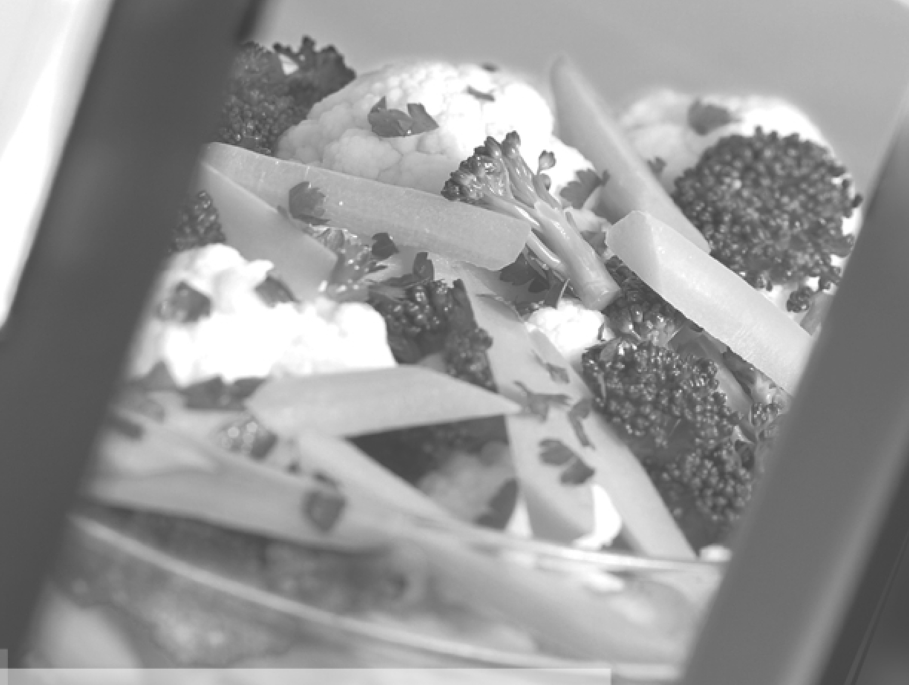

PLEASE READ ENTIRE INSTRUCTIONS BEFORE PROCEEDING IMPORTANT: Save these instructions for the local electrical inspector's use. INSTALLER: Please leave these Installation Instructions with this unit for the owner. OWNER: Please retain these instructions for future reference.

# Important Safety Instructions

## Precautions To Avoid Possible Exposure To Excessive Microwave Energy

### Door Interlock And Sealing Surface Precautions

(a) Do not attempt to operate this oven with the door open since open-door operation can result in harmful exposure to microwave energy. It is important not to defeat or tamper with the safety interlocks.
(b) Do not place any object between the oven front face and the door or allows oil or cleaner residue to accumulate on sealing surfaces.
(c) Do not operate the oven if it is damaged. It is particularly important that the oven door closes properly and that there is no damage to the: (1) Door (bent), (2) Hinges and latches (broken or loosened), (3) Door seals and sealing surfaces.
(d) The oven should not be adjusted or repaired by anyone except properly qualified service personnel.

## Federal Communications Commission Radio Frequency Interference Statement (U.S.A. Only)

### Radio And Television Interference Correction

WARNING: This equipment generates and uses ISM frequency energy and if not installed and used properly, that is in strict accordance with the manufacturer's instructions. may cause interference to radio and television reception. It has been type tested and found to comply with limits for ISM Equipment pursuant to part 18 of FCC Rules, which are designed to provide reasonable protection against such interference in a residential installation. However, there is no guarantee that interference will not occur in a particular installation. If this equipment does cause interference to radio or television reception, which can be determined by turning the equipment off and on, the user is encouraged to try to correct the interference by one or more of the following:
· Clean door and sealing surface of the oven.
· Reorient the receiving antenna of the radio or television.
· Relocate the Microwave Oven with respect to the receiver.
· Move the microwave oven away from the receiver.
· Plug the microwave oven into a different outlet so that the microwave oven and the receiver are on different branch circuits.
The manufacturer is not responsible for any radio or TV interference caused by unauthorized modification to this microwave oven. It is the responsibility of the user to correct such interference.

## General Safety Instructions

### Basic Use, Supervision And Intended Purpose

The safety instructions below will tell you how to use your oven and avoid harm to yourself or damage to your oven. WARNING - To reduce the risk of burns, electric shock, fire, injury to persons, or exposure to excessive microwave energy:
· Read all the instructions before using your oven.
· Do not allow children to use this oven without close supervision.
· Read and follow the specific PRECAUTIONS TO AVOID POSSIBLE EXPOSURE TO EXCESSIVE MICROWAVE ENERGY found on page 3.
· Do not use corrosive chemicals or vapors, such as sulfide and chloride, in this appliance. This type of oven is specifically designed to heat, cook, or dry food. It is not designed for industrial or laboratory use.
· Do not use or store this appliance outdoors. Do not use this product near water (for example, near a kitchen sink, in a wet basement near a swimming pool, or similar location.)
· Do not use the cavity for storage purposes. Do not leave paper products, cooking utensils or food in the cavity when not in use.
· Clean the ventilating hood frequently. Do not allow grease to accumulate on the hood or the filters.
· Use care when cleaning the vent hood filters. Corrosive cleaning agents such as lye-based oven cleaners may damage the filters.
· Do not tamper with the built-in safety switches on the oven door. The oven has several built-in safety switches to make sure the power is off when the door is open.
· Always turn fan on HlGH when cooking foods that might flame up, or any time flames occur on the cooktop. Suitable for use above both gas and electric cooking equipment 36 inches wide or less.
· Do not use this oven for commercial purposes. It is made for household use only.
· When cleaning the door and the surfaces that touch the door, use only mild, non-abrasive soaps or detergents and a sponge or soft cloth.
· If your oven is dropped or damaged, have it thoroughly checked by a qualified service technician before using it again.
### Fire Prevention And Emergency Response

· To avoid a fire hazard: Do not severely overcook food. Severely overcooked foods can start a fire in the oven. Watch the oven carefully, especially when you have paper, plastic, or other combustibles in the oven. Do not store combustible items (bread, cookies etc.) in the oven, because if lightning strikes the power lines it may cause the oven to turn on. Do not use wire twist-ties in the oven. Be sure to inspect purchased items for wire twist-ties and remove them before placing the item in the oven.
· If a fire should start inside the oven: Keep the oven door closed. Turn the oven off. Disconnect the power cord or shut off the power at the fuse or circuit breaker panel.
### Electric Shock Prevention And Restricted Food Heating

· To avoid electric shock: This appliance must be grounded. Connect the oven only to a properly grounded outlet. See the electrical GROUNDING INSTRUCTIONS on page 5. Do not operate this appliance if it has a damaged cord or plug, if it is not working properly, or if it has been damaged or dropped. Do not immerse the electrical cord or plug in water. Keep the cord away from heated surfaces.
· To avoid improperly cooking some foods: Do not heat any types of baby bottles or baby food. Uneven heating may occur and possibly cause personal injury. Do not heat small-necked containers, such as syrup bottles. Do not deep-fat fry in your microwave oven. Do not attempt home canning in your microwave oven. Do not heat the following items in the microwave oven: whole eggs in the shell, water with oil or fat, sealed containers, or closed glass jars. These items may explode.
· Do not cover or block any openings in the oven.
· Use your oven only for the operations described in this manual.
· Do not run the oven empty, without food in it.
· Do not let cord hang over edge of table or counter.
### Oven Floor Protection, Installation And Service

· Preserve the oven floor: Do not heat the oven floor excessively. Do not allow the gray film on special microwave-cooking packages to touch the oven floor. Put the package on a microwavable dish. Do not cook anything directly on the oven floor or turntable. Use a microwavable dish. Keep a browning dish at least 3/16 inch above floor. Carefully read and follow the instructions for the browning dish. If you use a browning dish incorrectly, you could damage the oven floor.
· Install or locate this appliance only in accordance with the provided installation instructions.
· This appliance should be serviced only by qualified service personnel. Contact the nearest authorized service facility for examination, repair or adjustment.
### Liquid Heating And Superheating Precautions

· Liquids such as water, coffee, or tea are able to be overheated beyond the boiling point without appearing to be boiling. Visible bubbling or boiling when the container is removed from the microwave oven is not always present. THIS COULD RESULT IN VERY HOT LIQUIDS SUDDENLY BOILING OVER WHEN THE CONTAINER IS DISTURBED OR A SPOON OR OTHER UTENSIL IS INSERTED INTO THE LIQUID. To reduce the risk of injury to persons: Do not overheat the liquid. Stir the liquid both before and halfway through heating it. Use extreme care when inserting a spoon or other utensil into the container once heating has begun. Do not use straight-sided containers with narrow necks. After heating, allow the container to stand in the microwave oven for a short time before removing the container.

## Electrical Requirements & Grounding Instructions

### Electrical Supply Requirements

WARNING: Observe all governing codes and ordinances. A 120 Volt, 60 Hz AC only 15 or 20 amp fused electrical supply is required. (A time-delay fuse is recommended.) It is recommended that a separate circuit serving only this appliance be provided.
ELECTRICAL SHOCK HAZARD Plug in to a grounded 3 prong outlet. Do not remove ground prong. Do not use an adapter. Do not use an extension cord. Failure to follow these instructions can result in death, fire, or electrical shock. 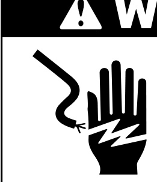

### Grounding Instructions For Cord Connected Appliances

For all cord connected appliances: The microwave oven must be grounded. In the event of an electrical short circuit, grounding reduces the risk of electric shock by providing an escape wire for the electric current. The microwave oven is equipped with a cord having a grounding wire with a grounding plug. The plug must be plugged into an outlet that is properly installed and grounded. 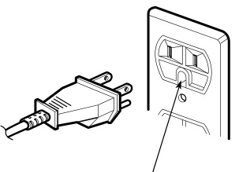
Ensure proper ground exists before use. WARNING: Improper use of the grounding can result in a risk of electric shock. Consult a qualified electrician or serviceman if the grounding instructions are not completely understood, or if doubt exists as to whether the microwave oven is properly grounded. Do not use an extension cord. If the power supply cord is too short, have a qualified electrician or serviceman install an outlet near the microwave oven.

### Grounding Instructions For Permanently Connected Appliances

For a permanently connected appliance: The microwave oven must be connected to a grounded metallic, permanent wiring system, or an equipment grounding conductor should be run with the circuit conductors and connected to the equipment grounding terminal or lead on the microwave oven.

# Cookware Guide & Tips

## Cookware Guide

### Cookware Safety Test

Most heat-resistant, non-metallic cookware is safe for use in your microwave oven. However, to test cookware before using, follow these steps:

1.  Place the empty cookware in the microwave oven.
2.  Measure 1 cup of water in a glass measuring cup and place it in the oven beside the cookware.
3.  Microwave on 100% power for 1 minute. If the dish is warm, it should not be used for microwave cooking.

### Cookware Materials Safe To Use

**USE:**
· Ovenproof Glass: Glass treated for use in high-intensity heat includes utility dishes, bread dishes, pie plates, cake plates, liquid measuring cups, casseroles, and bowls without metallic trim.
· China: Bowls, cups, serving plates, and platters without metallic trim can be used in your oven.
· Plastic: When using plastic wrap as a cover, make sure that the dish is deep enough so the plastic wrap does not touch the food. As the food heats, it may melt the plastic wrap wherever the wrap touches the food. Place plastic wrap loosely over the top of the dish and secure it by pressing the wrap to the sides of the dish. Vent by turning back one corner of the plastic wrap. This will allow excess steam to escape. Use plastic dishes, cups, semi-rigid freezer containers, and plastic bags only for short time cooking. Use these with care because the plastic may soften from the heat of the food.
· Paper: Microwave-safe paper towels, waxed paper, paper napkins, and paper plates with no metallic trim or design can be used in your oven. Refer to the manufacturer's label for use of any paper product in the microwave oven.

### Cookware Materials Not Safe To Use

**DO NOT USE:**
· Metal Utensils: Metal shields food from microwave energy and produces uneven cooking. Avoid metal skewers, thermometers, or foil trays. Metal utensils can cause arcing, which is a discharge of electric current. Arcing can damage your microwave oven.
· Metal Decoration: Do not use metal-trimmed or metal-banded dinnerware, casserole dishes, etc.
· CenturaTM Tableware: The Corning Company recommends that you do not use Centura tableware and some CorelleTM closed handle cups for microwave cooking.
· Aluminum Foil: Avoid large sheets of aluminum foil because they hinder cooking and may cause arcing. Use small pieces of foil to shield poultry legs and wings. Keep all aluminum foil at least 1 inch from the walls and door of the oven.
· Wood: Wooden bowls, boards, and baskets will dry out and may split or crack when you use them in the microwave oven.
· Tightly Closed Containers: Tightly closed cookware can explode. Be sure to leave an opening for steam to escape from covered cookware.
· Brown Paper: Avoid using brown paper bags. They absorb heat and could burn.

## Tips For Microwave Cooking

### Browning, Covering And Moisture Control

· BROWNING: Meat and poultry with high fat content will brown lightly when cooked for 10 or 15 minutes or longer. Foods cooked a shorter time can be brushed with a browning agent, such as Worcestershire sauce, soy sauce, or barbecue sauce.
· COVERING: A cover traps heat and steam and causes the food to cook more quickly. Use a lid or microwave-safe plastic wrap with one corner folded back to vent the excess steam. Lids on glass casseroles can become hot during cooking. Handle carefully. Waxed paper will prevent the food from splattering in the oven and help retain heat. When warming bread items, use waxed paper, napkins, or paper towels. To absorb extra moisture, wrap sandwiches and fatty foods in paper towels.
### Food Placement, Stirring And Turning

· SPACING: Arrange individual foods, such as baked potatoes, cupcakes, and hors d'oeuvres in a circle and at least 1 inch apart. This will help the food cook more evenly.
· STIRRING: Stirring blends flavors and redistributes the heat in foods. Always stir from the outside toward the center of the dish. Food at the outside of the dish heats first.
· TURNING: Large foods, such as roasts and whole poultry, should be turned during cooking so that the top and bottom cook evenly. Also turn over chicken pieces and chops.
· ARRANGEMENT: Do not stack food. Arrange in a single layer in the dish for more even cooking. Because dense foods cook more slowly, place thicker portions of meat, poultry, fish and vegetables toward the outside of the dish.
### Doneness, Standing Time And Shielding

· TESTING FOR DONENESS: Because foods cook quickly in a microwave oven, you need to test frequently for doneness.
· STANDING TIME: Food often needs to stand from 2 to 15 minutes after cooking inside as well as outside the oven. Usually, you need to cover food during standing time to retain heat. Stop the cooking when they are slightly undercooked and they will finish cooking during standing time. The internal temperature of food will rise about 10°F during standing time.
· SHIELDING: To prevent some portions of food in rectangular or square dishes from overcooking, you may need to cover the dish with small strips of aluminum foil to block the microwaves. You can also cover poultry legs and wingtips with foil to keep them from overcooking. Always keep foil at least 1 inch from oven walls to prevent arcing.
### Piercing Foods Before Cooking

· PIERCING: Pierce the shell, skin, or membrane of foods before cooking to prevent them from bursting. Foods that require piercing include yolks and whites of eggs, hot dogs, clams, oysters, and whole vegetables such as potatoes and squash.

# Parts, Accessories & Control Panel

## Parts And Accessories

### Oven Specifications And Removable Parts

OVEN SPECIFICATIONS 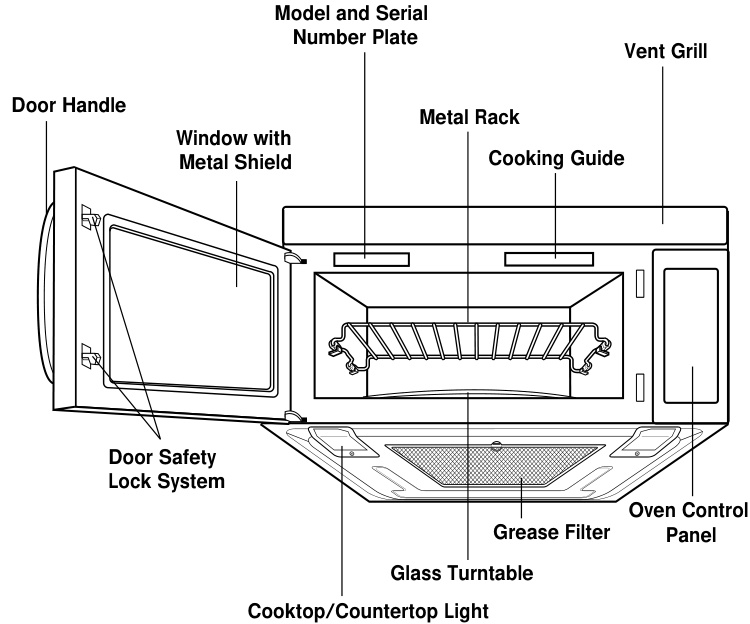 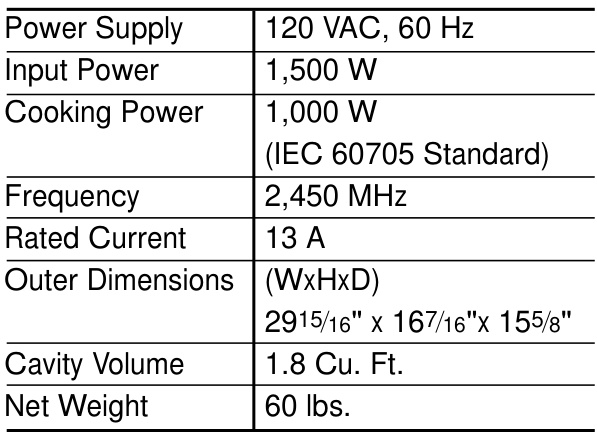

REMOVABLE PARTS: The turntable and turntable roller rest are removable. They should be hand-washed in warm (not hot) water with a mild detergent and a soft cloth. Once they are clean, rinse well and dry with a soft cloth. Never use cleaning powders, steel wool, or rough pads. The turntable may be cleaned in the sink. Be careful not to chip or scratch the edges as this may cause the turntable to break during use. The turntable roller rest should be cleaned regularly.

### Door Panel, Front Frame And Control Panel Care

SPECIAL CARE: For best performance and safety, the inner door panel and the oven front frame should be free of food or grease buildup. Wipe often with a mild detergent; then rinse and wipe dry. Never use cleaning powders or rough pads. After cleaning the control panel, touch STOP/CLEAR to clear any entries that might have been entered accidentally while cleaning the panel.

## Control Panel Features

### Control Panel Display And Sensor Food Pads

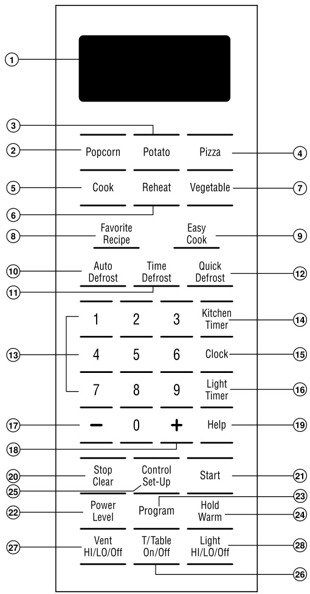 NOTE: Styling and features vary by model.

1.  Display: The Display includes a clock and indicators to tell you time of day, cooking time settings and cooking functions selected.
2.  Popcorn: Touch this pad when popping popcorn in your microwave oven. The oven's sensor will tell the oven how long to cook depending on the amount of humidity it detects from the popcorn.
3.  Potato: Touch this pad to cook potatoes. The oven's sensor will tell the oven how long to cook depending on the amount of humidity it detects from the potato.
4.  Pizza: Touch this pad to reheat pizza. The oven's sensor will tell the oven how long to cook depending on the amount of humidity it detects from the pizza.
5.  Cook: Touch this pad to cook frozen entrees, casserole and rice. The oven's sensor will tell the oven how long to cook depending on the amount of humidity coming from the food.
6.  Reheat: Touch this pad to reheat casseroles, dinner plates and soup or sauce. The oven's sensor will tell the oven how long to cook depending on the amount of humidity coming from the food.
7.  Vegetable: Touch this pad to cook vegetables. The oven's sensor will tell the oven how long to cook depending on the amount of humidity it detects from the vegetables.
### Recipe, Defrost And Number Pads

8.  Favorite Recipe: Touch this pad to recall one cooking instruction previously programmed into memory.
9.  Easy Cook: Touch this pad to set and start quickly at 100% power level.
10. Auto Defrost: Meat, poultry, fish. Touch this pad to select food type and defrost food by weight.
11. Time Defrost: Touch this pad to defrost most other frozen foods.
12. Quick Defrost: This pad provides Quick defrosting for 1.0 pound of frozen foods.
13. Numbers: Touch number pads to enter cooking time, power level, quantities, or weights.
### Timer, Clock, Light Timer And Adjustment Pads

14. Kitchen Timer: Touch this pad to set the kitchen timer.
15. Clock: Touch this pad to enter the time of day.
16. Light Timer: Touch this pad to set the light timer.
17.   - (Less): Touch this pad to subtract ten seconds of cooking time each time you press it.
18.   + (More): Touch this pad to add ten seconds of cooking time each time you press it.
19. Help: Touch this pad to learn how to use each oven function.
### Stop, Start, Power And Program Pads

20. Stop/Clear: Touch this pad to stop the oven or to clear all entries.
21. Start: Touch this pad to start a function. If you open the door after oven begins to cook, touch START again.
22. Power Level: Touch this pad to select a cooking power level.
23. Program: Touch this pad to set a cooking time.
24. Hold Warm: Touch this pad to keep hot, cooked foods warm in your microwave oven for up to 99 minutes and 59 seconds.
### Setup, Turntable, Vent And Light Pads

25. Control Set-Up: Touch this pad to change the oven's default settings for sound, clock, display speed and defrost weight from Lbs to Kg.
26. T/Table On/Off: Touch this pad to turn off the turntable. OFF will appear in the display. NOTE: This option not available in sensor cook and defrost modes.
27. Vent HI/LO/Off: Touch this pad to turn the fan on or off.
28. Light Hl/LO/Off: Touch this pad to turn on the cooktop/counter top light.

# Operating Instructions

## Learn About Your Microwave Oven

### Basic Operating Concepts And Safety Cautions

This section discusses the concepts behind microwave cooking and introduces you to the basics you need to know to operate your microwave oven. Please read this information before use.
CAUTION: To avoid risk of personal injury or property damage, do not run oven empty. To avoid risk of personal injury or property damage, do not use stoneware, aluminum foil, metal utensils, or metal trimmed utensils in the oven.

### Help Feature

HELP: The Help pad displays feature information and helpful hints. Press Help, then select a key pad. Example: To learn about the Popcorn feature. 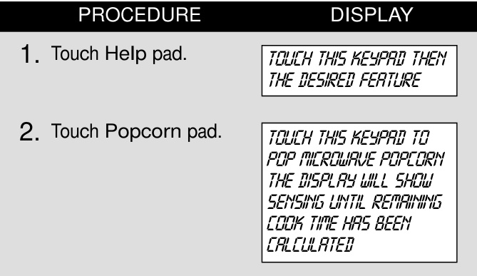

### Clock Setting

CLOCK: This oven includes a 12-hour clock. Example: To set 8:00 AM 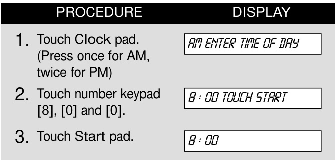

### Kitchen Timer

KITCHEN TIMER: You can use your microwave oven as a timer. Use the Timer for timing up to 99 minutes and 59 seconds. Example: To time 3 minutes 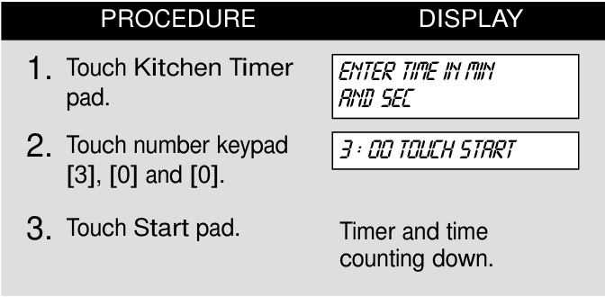 When the time is over, you will hear seven beeps and END will display.

### Control Set-Up Options

CONTROL SET-UP: You can change the default values for beep sound, clock, display speed and defrost weight. (LBS/KG) 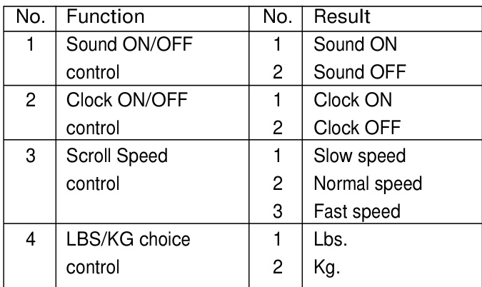 Example: To change defrost weight mode from Lbs to Kg. 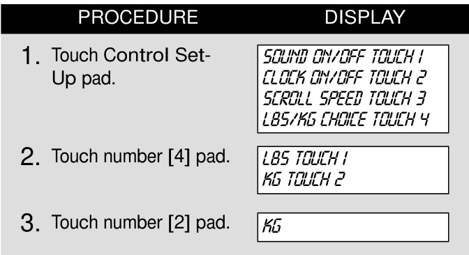

### Vent Fan Control

VENT HI/LO/OFF: The Vent moves steam and other vapors from the cooking surface. From the off position, the first touch of the vent pad turn the vent on High speed. Touch the pad again to turn the vent on Low speed, and a third time to turn the fan back off. NOTE: If the temperature gets too hot around the microwave oven, the fan in the vent hood will automatically turn on at the LOW setting. It may stay on for up to an hour. When this occurs, you cannot turn the vent fan off. Wait until it turns off automatically.

### Turntable Control

T/TABLE ON/OFF: For best cooking results, leave the turntable on. It can be turned off for large dishes. Press T/TABLE ON/OFF pad to turn the turntable on or off. NOTE: The T/Table On/Off feature does not operate with the DEFROST or SENSOR cooking modes. Sometimes the turntable can become hot to touch. Be careful touching the turntable during and after cooking. Do not run the oven empty.

### Child Lock

CHILD LOCK: Child Lock is a safety feature used to lock the control panel so that it cannot be operated. To set Child Lock, touch STOP/CLEAR once. Touch and hold 0 pad more than four seconds. LOCKED will appear in the display window and you hear two beeps. To cancel child lock, touch and hold 0 more than four seconds. LOCKED will disappear and you hear two beeps.

### Cooktop Light Control

LIGHT HI/LO/OFF: Touch Light pad once for bright light, again for low light and a third time to turn the light back off.

### Light Timer

LIGHT TIMER: You can set the Lo Light to turn on and off automatically at any time. The light will come on at the low setting the same time everyday and turn off at a set time until reset. Example: Turn on 2:00 AM, turn off 7:00 AM. 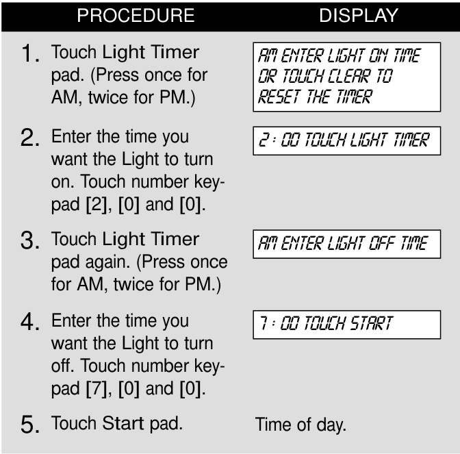 NOTE: To reset the time to turn on and off the Light, repeat steps 1 to 5. Example: To cancel the Light Timer 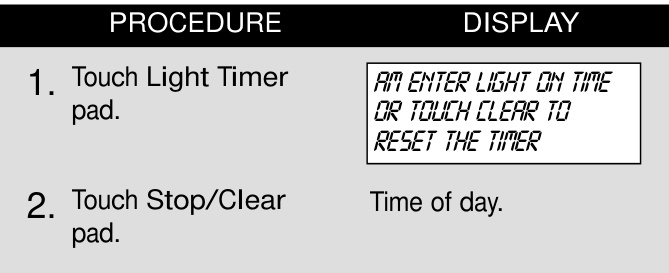 NOTE: If you want to cancel the Light Timer in operation touch Light HI/LO/Off the pad.

## Manual Cooking Features

### Easy Cook

EASY COOK: A timesaving pad, this simplified control lets you quickly set and start microwave cooking without the need to touch Start pad. This feature cooks for 30 seconds on Hl each time you press the pad. Example: To set Easy Cook for 2 minutes 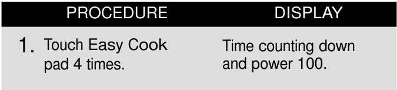 Easy Cook will add 30 seconds up to 3 minutes. After 3 minutes, every touch will add 1 minute up to 99 minutes and 59 seconds.

### Hold Warm

HOLD WARM: You can keep cooked food warm in your microwave oven for up to 99 minutes and 59 seconds. You can use Hold Warm by itself or to follow a cooking cycle automatically. Example: To use Hold Warm. 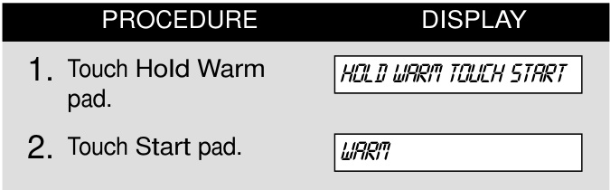 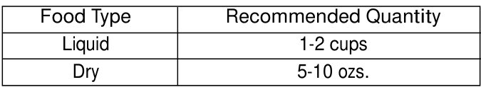 To make Hold Warm automatically follow another cycle: While you are programming the cooking instructions, touch Hold Warm before touching Start. When the last cooking cycle is over, you will hear two tones and "WARM" will appear in the oven display. You can set Hold Warm to follow Auto Defrost, or multi cycle cooking. NOTE: HOLD WARM operates for up to 99 minutes 59 seconds. Food cooked covered should remain covered during Hold Warm. Pastry items (pies, turnovers, etc.) should be uncovered during Hold Warm. Complete meals kept warm on a dinner plate can be covered during Hold Warm.

### Favorite Recipe

FAVORITE RECIPE: Favorite Recipe lets you recall one cooking instruction previously placed in memory and begin cooking quickly. Example: To program cooking for 2 minutes 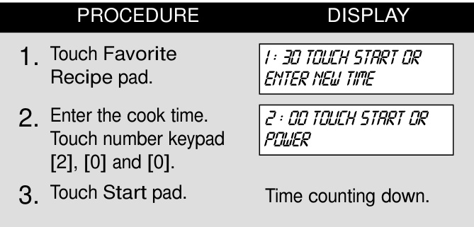 Example: To recall the custom recipe 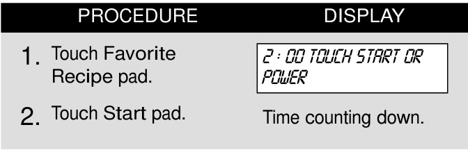 When the cook time is over, you will hear four beeps and END will display. NOTE: Power level will default to Hi, but this setting is modifiable.

### More And Less Time Adjustment

\+/- (MORE/LESS): By using the + or - keys, all of the pre-programmed cook and time cook features can be adjusted to cook food for a longer or shorter time. Pressing + will add 10 seconds of cooking time each time you press it. Pressing - will subtract 10 seconds of cooking time each time you press it. NOTE: This feature cannot be used during cooking, only when setting the initial cook time.

### Cooking At High Power Level

COOKING AT HIGH POWER LEVEL: Example: To cook food for 8 minutes, 30 seconds at 100% power. 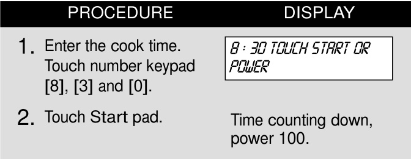 When the cook time is over, you will hear four beeps and END will display.

### Cooking At Lower Power Levels

COOKING AT LOWER POWER LEVELS: HIGH power cooking does not always give you the best results with foods that needs lower cooking, such as roasts, baked goods, or custards. Your oven has 10 power settings in addition to HlGH. Example: To cook food for 7 minutes, 30 seconds at 70% power. 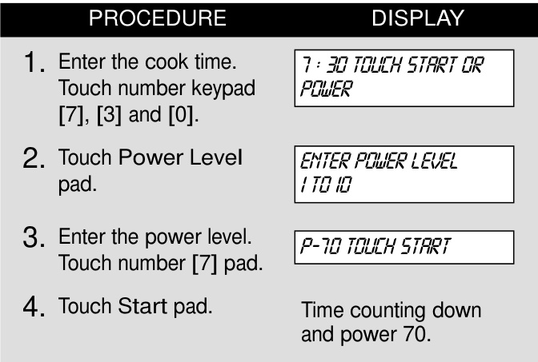 When the cook time is over, you will hear four beeps and END will display.

### Cooking With More Than One Cook Cycle

COOKING WITH MORE THAN ONE COOK CYCLE: For best results, some recipes call for one Power Level for a certain length of time, and another Power Level for another length of time. Your oven can be set to change from one to another automatically for up to three cycles if the first heating cycle is defrost or the last at 0% power. Example: To cook food for 3 minutes at 100% power and then 70% power for 7 minutes 30 seconds. 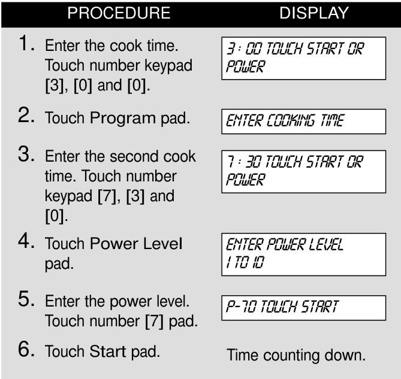 When the cook time is over, you will hear four beeps and END will display.

### Cooking Guide For Lower Power Levels

COOKING GUIDE FOR LOWER POWER LEVEL: The 10 power levels in addition to HlGH allow you to choose the best power level for the food you are cooking. The power levels are listed below, with examples of foods best cooked at each level and the amount of microwave power output you are using at each Level. 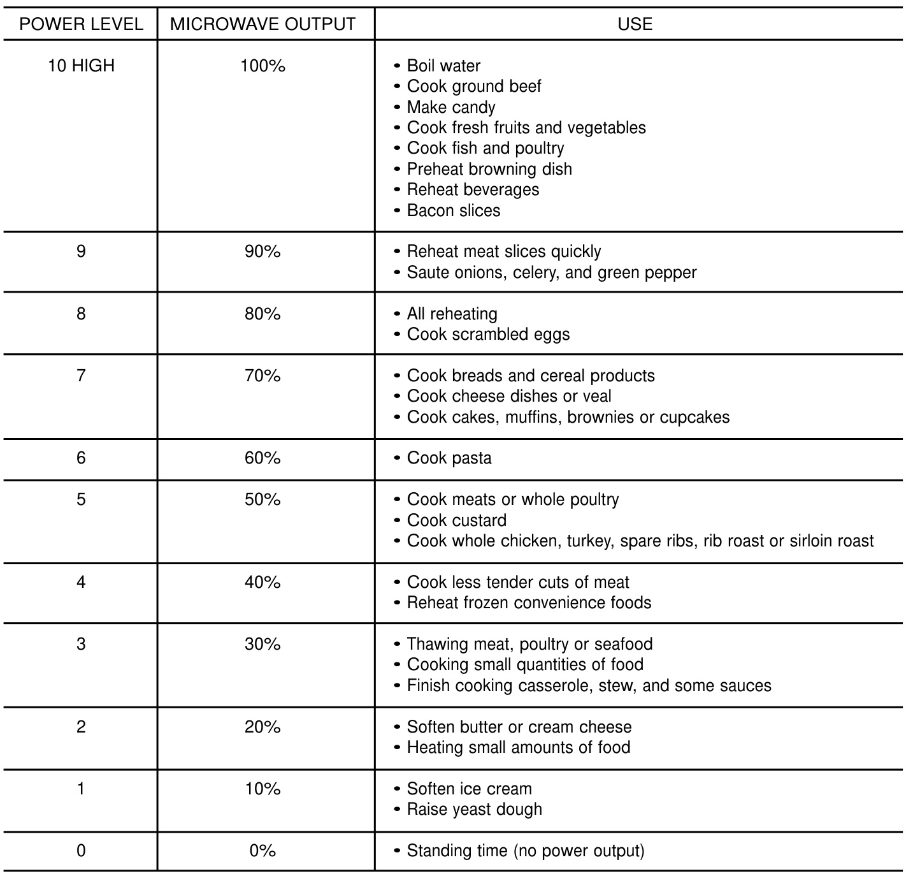

## Sensor Cooking

### Sensor Operating Instructions

SENSOR OPERATING INSTRUCTIONS: Sensor Cook allows you to cook most of your favorite foods without selecting cooking times and power levels. The oven automatically determines required cooking time for each food item. The display will indicate SENSING during the initial sensing period. When the internal sensor detects a certain amount of humidity coming from the food, it will tell the oven how much longer to heat. The display will show the remaining heating time. For best results for cooking by Sensor, following these recommendations:

1.  Food cooked with the sensor system should be at normal storage temperature.
2.  Glass TURNTABLE and outside of container should be dry to assure best cooking results.
3.  Foods should always be covered loosely with microwavable plastic wrap, waxed paper or a lid.
4.  Do not open the door or touch the Stop/Clear pad during the sensing time.
    When sensing time is over, the oven beeps twice and the remaining cooking time will appear in the display window. At this time you can open the door to stir, turn, or rearrange the food.

### Sensor Cooking Container And Covering Guide

SENSOR COOKING GUIDE: Appropriate containers and coverings help assure good Sensor cooking results.

1.  Always use microwavable containers and cover them with lids or vented plastic wrap.
2.  Never use tight-sealing plastic covers. They can prevent steam from escaping and cause food to overcook.
3.  Match the amount to the size of the container. Fill containers at least half full for best results.
4.  Be sure the outside of the cooking container and the inside of the microwave oven are dry before placing food in the oven. Beads of moisture turning into steam can mislead the sensor.

### Adding Or Subtracting Sensor Cook Time

ADDING OR SUBTRACTING SENSOR COOK TIME: If the SENSOR function is too long or too short, you can increase or decrease the cook time by 10 seconds after choosing the function. You can only increase or decrease cook time when sensor is displayed. Example: If you want to add to the Sensor Cook casserole cooking time. 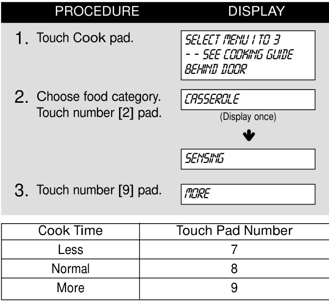

### Popcorn Sensor Program

POPCORN (SENSOR): POPCORN lets you pop 3.0 and 3.5 ounce bags of commercially packaged microwave popcorn. Pop only one package at a time. If you are using a microwave popcorn popper, follow manufacturer's instructions. Example: To pop popcorn. 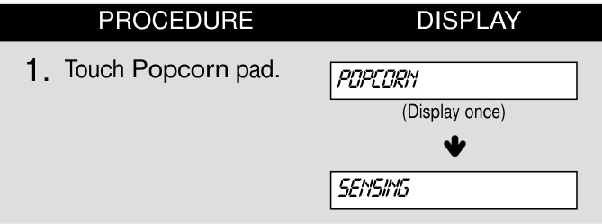 When the cook time is over, you will hear four beeps and END will display. CAUTION: DO NOT leave microwave oven unattended while popping corn.

### Pizza Sensor Program

PIZZA (SENSOR): PIZZA lets you reheat one or several slices of pizza without selecting cooking times and power level. Example: To reheat 2 slices of pizza 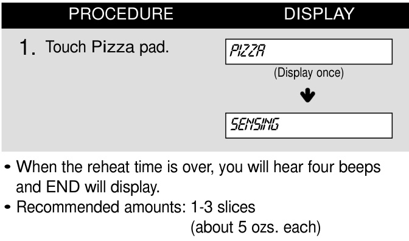

### Potato Sensor Program

POTATO (SENSOR): POTATO lets you bake one or several potatoes without selecting cooking times and power levels. Example: To cook 2 potatoes. 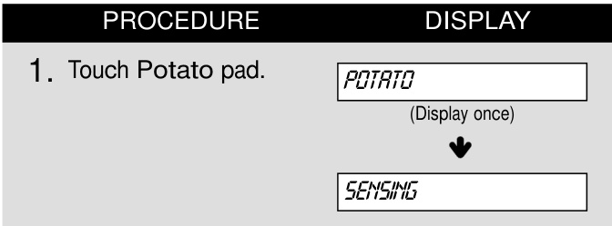 Recommended amounts: 1-4 potatoes (about 8-10 ozs. each). NOTE: Before baking, pierce potato with fork several times. After baking, let stand for 5 minutes.

### Vegetable Sensor Program

VEGETABLE (SENSOR): VEGETABLE has preset cook powers for 3 food categories: Fresh, Frozen and Canned. Example: To cook frozen vegetables 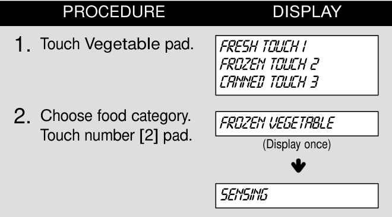 When the cook time is over, you will hear four beeps and END will display. NOTE: Place the canned vegetable in a microwavable bowl or casserole. Cover with plastic wrap and vent. Let stand 5 minutes. Recommended amounts: 1-4 cups. Recommended 1/4" - 1/2" venting of cover.

### Cook Sensor Program

COOK (SENSOR): COOK lets you heat common microwave-prepared foods without needing to program times and Power Levels. COOK has preset power for 3 food categories: Frozen Entree, Casserole and Rice. Example: To cook rice. 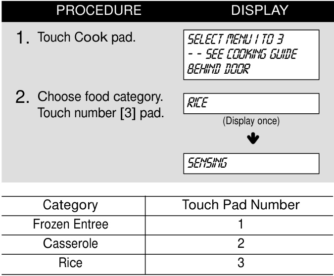 When the cook time is over, you will hear four beeps and END will display. Recommended amounts: 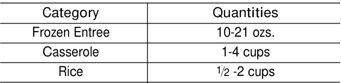 NOTE: Use only long grain rice with sensor cook program. See page 27 to cook other types of rice.

### Reheat Sensor Program

REHEAT (SENSOR): Reheat lets you heat foods without needing to program times and Power Levels. Reheat has preset Power Levels for 3 categories: Casserole, Dinner Plate and Soup/Sauce. 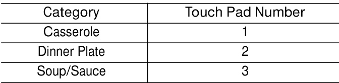 Example: To reheat Casserole 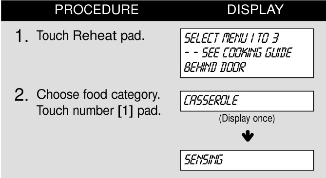 When the cook time is over, you will hear four beeps and END will display. Recommended amounts: 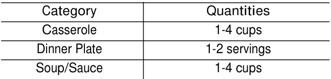

## Defrosting

### Auto Defrost

AUTO DEFROST: Your microwave oven is preset with three defrost sequences. Using AUTO DEFROST is the best way to defrost frozen foods. The Auto Defrost Chart provides some basic guidelines for using the three defrost sequences. 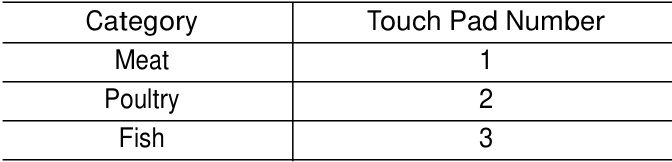 Example: To defrost 1.2 lbs. of ground beef. 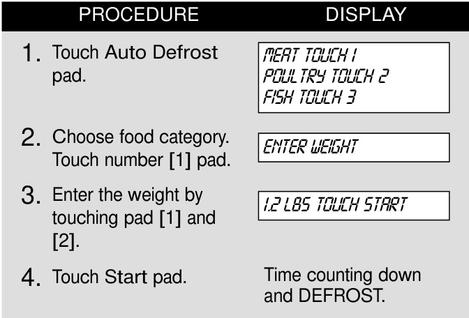 NOTE: When you touch the START pad, the display changes to defrost time countdown. The oven will beep during the DEFROST cycle. At this time, open the door and turn, separate, or rearrange the food. Remove any portions that have thawed. Return frozen portions to the oven and touch START to resume the defrost cycle.

### Weight Conversion Chart

WEIGHT CONVERSION CHART: To enter food weight in Auto Defrost, you must specify pounds and tenths of a pound. If the weight on the food package is in fractions of a pound, you can use the following chart to convert the weight to decimals. 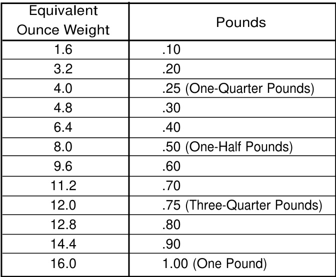

### Defrosting Tips

DEFROSTING TIPS:
· When using Auto Defrost, the weight to be entered is the net weight in pounds and tenths of pounds (the weight of the food minus the container).
· Use Auto Defrost only for raw food. Auto Defrost gives best results when food to be thawed is a minimum of 0°F (taken directly from a freezer). If food has been stored in a refrigerator-freezer that does not maintain a temperature of 5°F or below, always program a lower food weight (for a shorter defrosting time) to prevent cooking the food.
· If the food is stored outside the freezer for up to 20 minutes, enter a lower food weight.
· The shape of the package alters the defrosting time. Shallow rectangular packets defrost more quickly than a deep block.
· Separate pieces as they begin to defrost. Separated pieces defrost more easily.
· You can use small pieces of aluminum foil to shield foods like chicken wings, leg tips, and fish tails, but the foil must not touch the side of the oven. Foil causes arcing, which can damage the oven lining.
· Shield areas of food with small pieces of foil if they start to cook too fast.
· For better results, a preset standing time is included in the defrosting time.
· For best results, elevate food to be defrosted on a microwave safe roasting rack. This prevents the possibility of warm meat juices cooking food during defrost.

### Auto Defrost Chart

AUTO DEFROST CHART:
Meat Setting: Meat of irregular shape and large, fatty cuts of meat should have the narrow or fatty areas shielded with foil at the beginning of a defrost sequence. 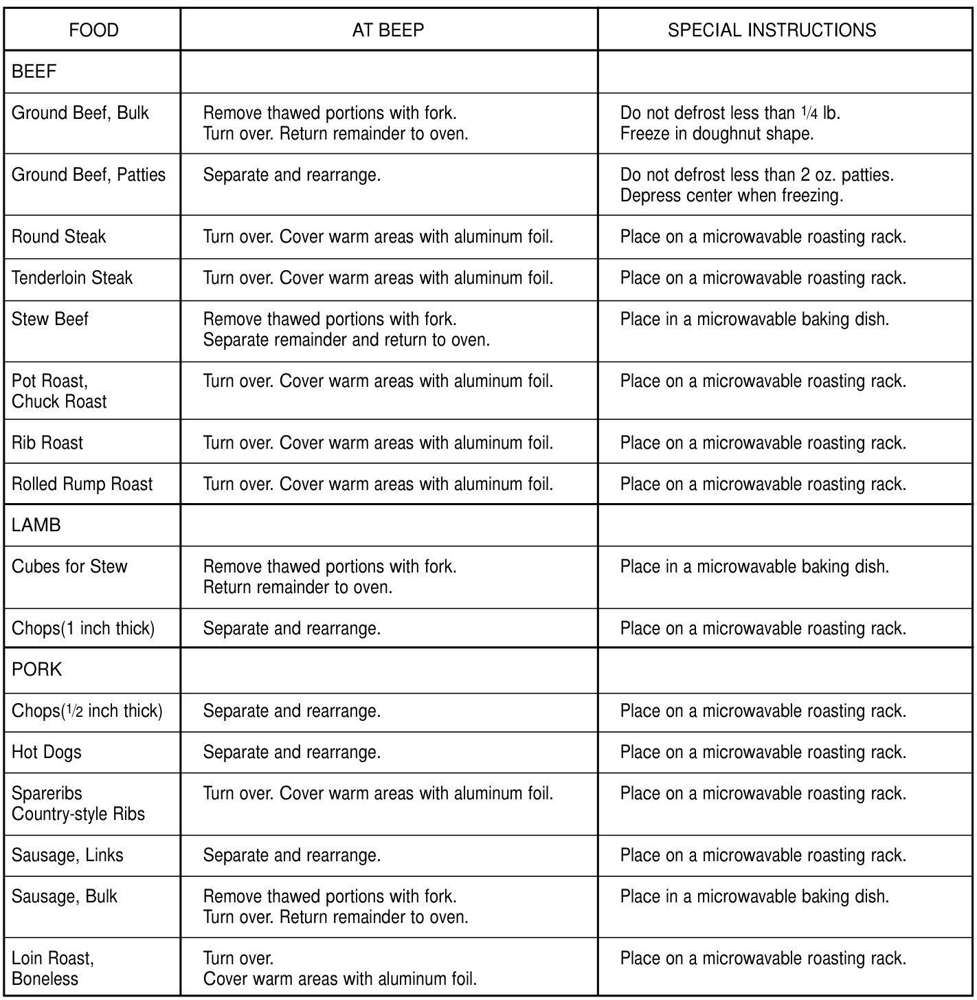
Poultry Setting: 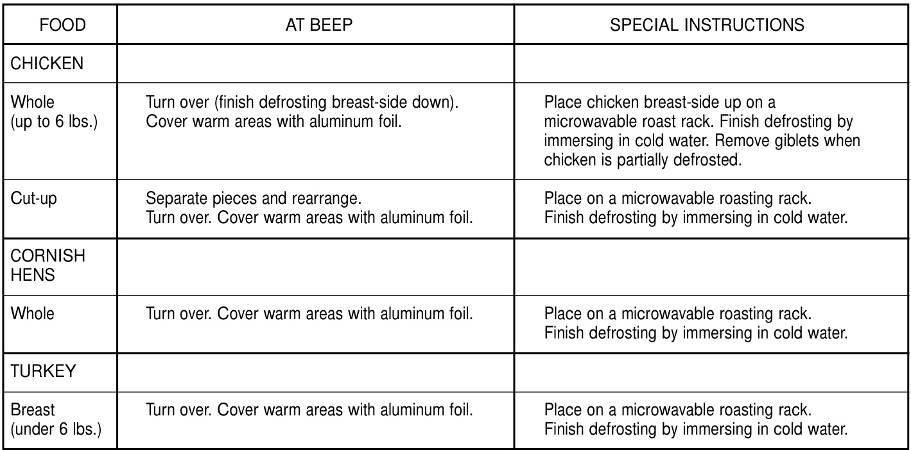
Fish Setting: 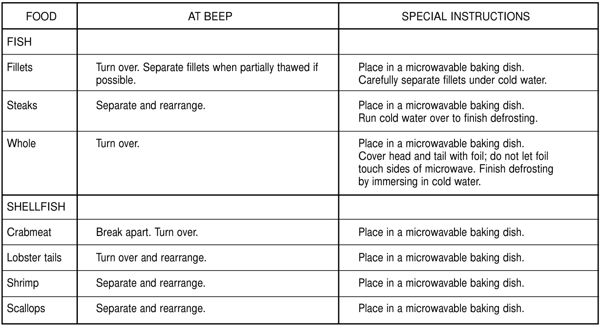
NOTE: Food to be defrosted must be not more than 6.0 lbs (4.0 Kg). Available weight is 0.1-6.0 lbs (0.1-4.0 Kg).

### Time Defrost

TIME DEFROST: This feature allows you to choose the time you want to defrost. The Time Defrost Chart provides some basic guidelines for using Time Defrost. Example: To defrost for 2 minutes. 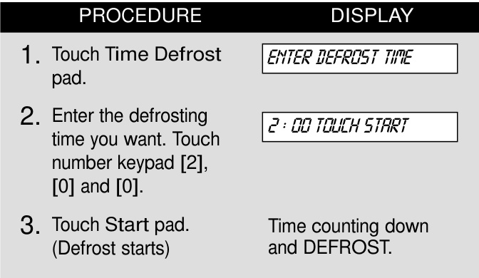 When the defrost time is over, you will hear four beeps and END will display. TIME DEFROST CHART 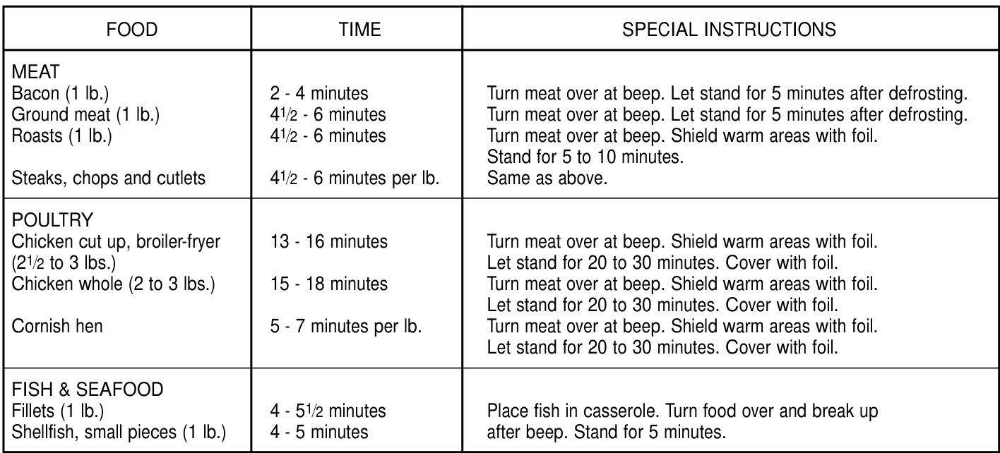 NOTE: Defrost times are approximate and are intended as guidelines.

### Quick Defrost

QUICK DEFROST: The Quick Defrost feature provides rapid defrosting for 1 lb. of frozen food. The oven automatically sets the defrosting time for ground beef. Example: To defrost 1 lb. ground beef. 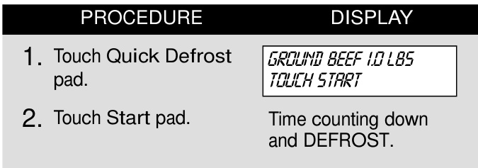 NOTE: The microwave will beep and defrosting will pause so the door can be opened and the meat can be turned. If the door is not opened at this time, the countdown will resume. Any ground meat can be used with Quick Defrost, but this feature works best with ground beef.

## Getting The Best Cooking Results

### Two Position Metal Rack Use

USE OF THE TWO POSITION METAL RACK: The two position metal rack gives you extra space when cooking in more than one container at the same time. The metal rack can be turned upside down to accommodate different container sizes. To use rack:

1.  Place rack securely in the four plastic supports. Rack MUST NOT touch metal walls or back of microwave oven.
2.  Place equal amounts of food both ABOVE and BELOW rack. Amount of food must be approximately the same in both containers to balance out cooking energy. 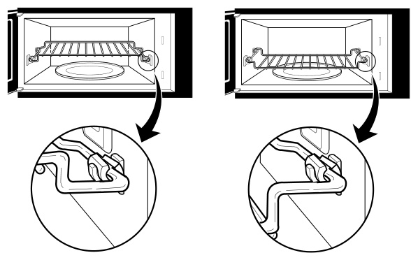
    CAUTION: To avoid risk of property damage: Do not use rack to pop popcorn. Rack must be on the four plastic supports when used. Use the rack only when cooking food on two positions. Do not cook with rack on floor of the oven.

### General Cooking Result Guidelines

To get the best results from your microwave oven, read and follow the guidelines below.
· Storage Temperature: Foods taken from the freezer or refrigerator take longer to cook than the same foods at room temperature. The times in this book are based on the normal storage temperature of the food.
· Size: Small pieces of food cook faster than large ones; pieces similar in size and shape cook more evenly. For even cooking, reduce the power when cooking large pieces of food.
· Natural Moisture: Very moist foods cook more evenly because microwave energy is attracted to water molecules.
· Stir foods such as casseroles and vegetables from the outside to the center to distribute the heat evenly and speed cooking. Constant stirring is not necessary, occasional stirring is sufficient.
· Turn over foods like pork chops, whole potatoes, roasts, or whole cauliflower halfway through the cooking time to expose all sides equally to microwave energy.
· Place delicate areas of foods, such as asparagus tips, toward the center of the dish.
· Arrange unevenly shaped foods, such as chicken pieces or salmon steaks, with the thicker, meatier parts toward the outside of the dish.
· Shield parts of food that may cook quickly, such as wing tips and leg ends of poultry with small pieces of aluminum foil.
· Let Stand: After you remove the food from the microwave, cover food with foil or casserole lid and let it stand to finish cooking in the center and avoid overcooking the outer edges. The length of standing time depends on the density and surface area of the food.
· Wrapping in waxed paper or paper towel: Sandwiches and many other foods containing prebaked bread should be wrapped prior to microwaving to prevent drying out.

## Food Category Cooking Guidelines

### Fish And Shellfish Cooking Guidelines

FISH AND SHELLFISH: Cooking Fish and Shellfish: General Directions. Prepare the fish for cooking: Completely defrost the fish or shellfish. Arrange unevenly shaped pieces with thicker parts toward the outside of the dish. Arrange shellfish in a single layer for even cooking. The type of cover you use depends on how you cook. Poached fish needs a microwavable lid or vented plastic wrap. Baked fish, coated fish, or fish in sauce needs to be covered lightly with waxed paper to keep the coating crisp and sauce from getting watery. Always set the shortest cooking time. Fish is done when it turns opaque and the thickest part begins to flake. Shellfish is done when the shell turns from pink to red and the flesh is opaque and firm. FISH AND SHELLFISH COOKING TABLE 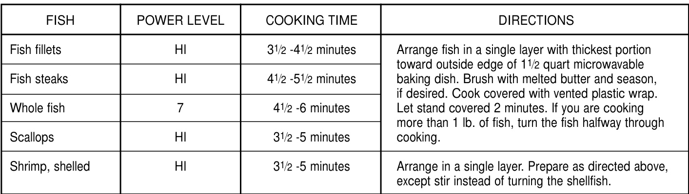

### Appetizers, Sauces And Soups Cooking Guidelines

APPETIZERS/SAUCES/SOUPS: Cooking Appetizers: Tips and Techniques. Crisp crackers, such as melba toast, shredded wheat, and crisp rye crackers are best for microwave use. Wait until party time to add the spreads. Place a paper towel under the crackers while they cook in the microwave oven to absorb extra moisture. Arrange individual appetizers in a circle for even cooking. Stir dips to distribute heat and shorten cooking time. Cooking Sauces: Tips and Techniques. Use a microwavable casserole or glass measuring cup that is at least 2 or 3 times the volume of the sauce. Sauces made with cornstarch thicken more rapidly than those made with flour. Cook sauces made with cornstarch or flour uncovered so you may stir them 2 or 3 times during cooking for a smooth consistency. To adapt a conventional sauce or gravy recipe, reduce the amount of liquid slightly. Cooking Soups: Tips and Techniques. When converting a conventional soup recipe to cook in the microwave, reduce the liquid, salt, and strong seasonings. Cook soups in a microwavable dish which holds double the volume of the recipe ingredients to prevent boil-over, especially if you use cream or milk in the soup. Generally, cover microwaved soups with VENTED plastic wrap or a microwavable lid. Cover foods to retain moisture. Uncover foods to retain crispness. Avoid overcooking by using the minimum suggested time. Add more time, if necessary, only after checking the food. Stirring occasionally will help blend flavors, distribute heat evenly, and may even shorten the cooking time. Not Recommended: Appetizers with a crisp coating or puff pastry are best done in a conventional oven with dry heat. Breaded products can be warmed in the microwave oven but will not come out crisp.

### Meat Cooking Guidelines

MEAT: Cooking Meat: General Directions. Prepare the meat for cooking: Defrost completely. Trim off excess fat to avoid splattering. Place the meat, fat side down, on a microwavable rack in a microwavable dish. Use oven cooking bag for less tender cuts of meat. Arrange the meat so that thicker portions are toward the outside of the dish. Cover the meat with waxed paper to prevent splattering. Tend the meat as it cooks. Drain juices as they accumulate to reduce splattering and keep from overcooking the bottom of the meat. Shield thin or bony portions with strips of foil to prevent overcooking. NOTE: Keep the foil at least 1 inch from the oven walls, and do not cover more than one-third of the meat with foil at any one time. Let the meat stand covered with foil 10-15 minutes after you remove it from the oven. The internal temperature of the meat may rise from 5-10°F during standing time. MEAT COOKING TABLE 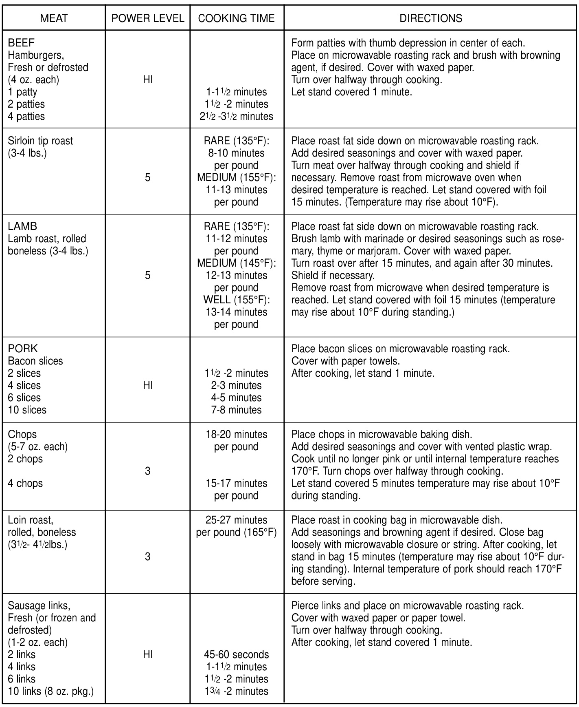

### Poultry Cooking Guidelines

POULTRY: Cooking Poultry: General Directions. Prepare the poultry for cooking: Defrost completely. Arrange poultry pieces with thicker pieces at the outside edge of the baking dish. When cooking legs, arrange them like the spokes of a wheel. Cover the baking dish with waxed paper to reduce splattering. Use a browning agent (such as worcestershire sauce) or cook with a sauce to give a browned appearance. Watch the poultry as it cooks. Drain and discard juices as they accumulate. Shield thin or bony pieces with small strips of aluminum foil to prevent overcooking. Keep foil at least 1 inch from the oven walls and other pieces of foil. Poultry is done when it is no longer pink and the juices run clear. When done, the temperature in the thigh meat should be 180-185°F. Let the poultry stand after cooking covered with foil for 10 minutes. POULTRY COOKING TABLE 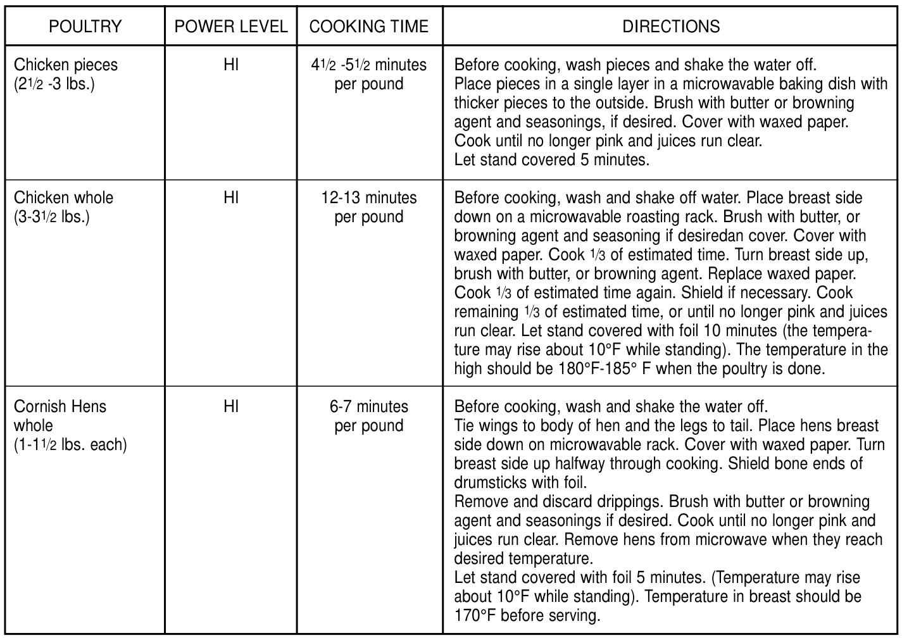

### Pasta And Rice Cooking Guidelines

PASTA AND RICE: Microwave cooking and conventional cooking of pasta, rice, and cereal require about the same amount of time, but the microwave is a more convenient method because you can cook and serve in the same dish. There is no stirring needed and leftover pasta tastes just like fresh cooked when reheated in the microwave oven. Cooking Pasta and Rice: Tips and Techniques. If you are planning to use rice or pasta in a casserole, undercook it so it is still firm. Allow for standing time with rice, but not for pasta. PASTA COOKING TABLE 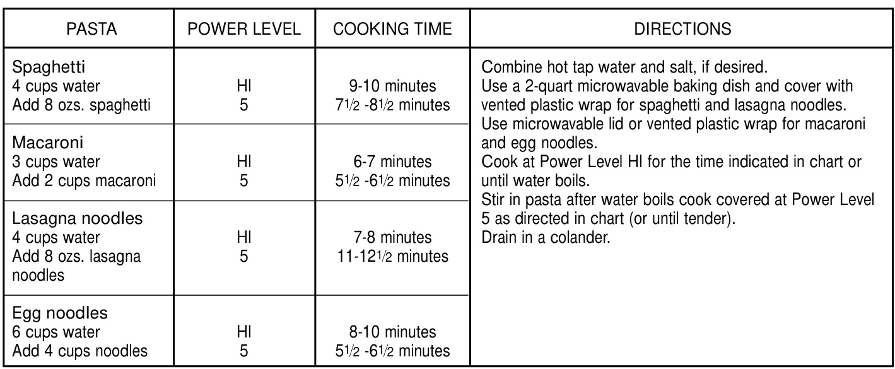 RICE COOKING TABLE 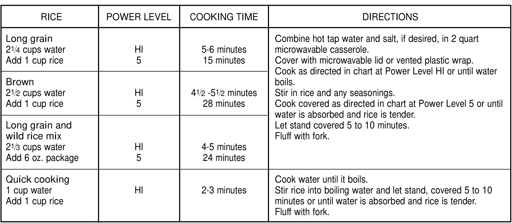

# Care And Cleaning

## General Care

### Interior, Exterior And Rack Cleaning

For best performance and safety, keep the oven clean inside and outside. Take special care to keep the inner door panel and the oven front frame free of food or grease build-up. Never use rough powder or pads. Wipe the microwave oven inside and out, including the hood bottom cover, with a soft cloth and a warm (not hot) mild detergent solution. Then rinse and wipe dry. Use a chrome cleaner and polish on chrome, metal and aluminum surfaces. Wipe spatters immediately with a wet paper towel, especially after cooking chicken or bacon. Clean your oven weekly or more often, if needed.

### Metal Rack Cleaning

METAL RACK: Wash the metal rack with a mild soap and a soft or nylon scrub brush. Dry completely. Do not use abrasive scrubbers or cleaners to clean rack.

## Filter Replacement

### Grease Filter Cleaning

CLEANING THE GREASE FILTER: The grease filter should be removed and cleaned often, at least once a month.

1.  To remove grease filter, slide filter to the side. Pull filter downward and push to the other side. The filter will drop out. 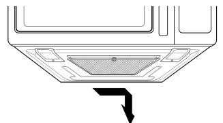
2.  Wash in dishwasher or soak grease filter in hot water and a mild detergent. Rinse well and shake to dry. Do not use ammonia or place in a dishwasher. The aluminum filter will darken. 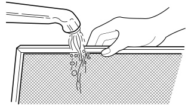
3.  To reinstall the filter, slide it into the side slot, then push up and toward oven center to lock. 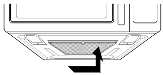
    CAUTION: To avoid risk of personal injury or property damage, do not operate oven hood without filter in place.

### Charcoal Filter Replacement

CHARCOAL FILTER REPLACEMENT: If your oven is vented inside, the charcoal filter should be replaced every 6 to 12 months, and more often if necessary. The charcoal filter cannot be cleaned.

1.  Unplug the oven or turn off power at the main power supply.
2.  Remove the two vent grill mounting screws. (2 middle screws) 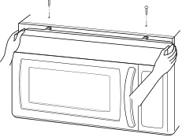
3.  Tip the grill forward, then lift it out.
4.  Remove old filter. 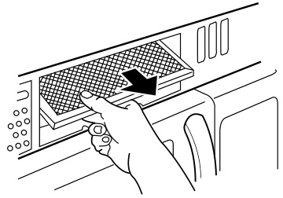
5.  Slide a new charcoal filter into place. The filter should rest at the angle shown. 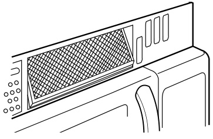
6.  Slide the bottom of the grill into place. Push the top until it snaps into place. Replace the mounting screws. Turn the power back on at the main power supply and set the clock.

## Light Replacement

### Cooktop Light Replacement

COOKTOP LIGHT REPLACEMENT:

1.  Unplug the oven or turn off power at the main power supply. 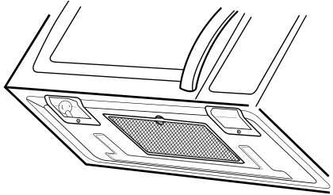
2.  Remove the bulb cover and mounting screws.
3.  Replace bulb(s) with 30 or 40 watt appliance bulb(s).
4.  Replace bulb cover and mounting screws.
5.  Turn the power back on at the main power supply or plug in the oven.
    CAUTION: To avoid personal injury or property damage, wear gloves when replacing light bulb.

### Oven Light Replacement

OVEN LIGHT REPLACEMENT:

1.  Unplug oven or turn off power at the main power supply.
2.  Remove the vent cover mounting screws. (2 middle screws)
3.  Tip the cover forward, then lift out to remove. 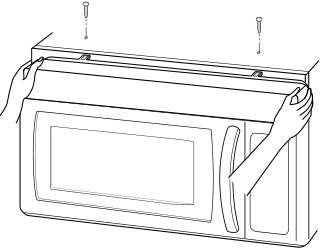
4.  Remove bulb holder. 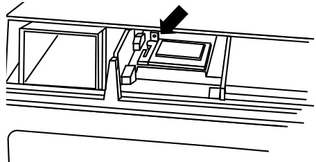
5.  Lift up the bulb holder. 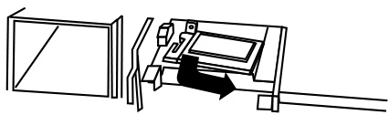
6.  Replace bulb with a 30 or 40 watt appliance bulb.
7.  Replace the bulb holder.
8.  Slide the bottom of the vent cover into place. Push the top until it snaps into place. Replace the mounting screws. Turn the power back on at the main power supply or plug in the oven.

# Troubleshooting & Warranty

## Troubleshooting

### Before Calling For Service

BEFORE CALLING FOR SERVICE: Check the following list to be sure a service call is necessary. Reviewing additional information on items to check may prevent an unneeded service call. 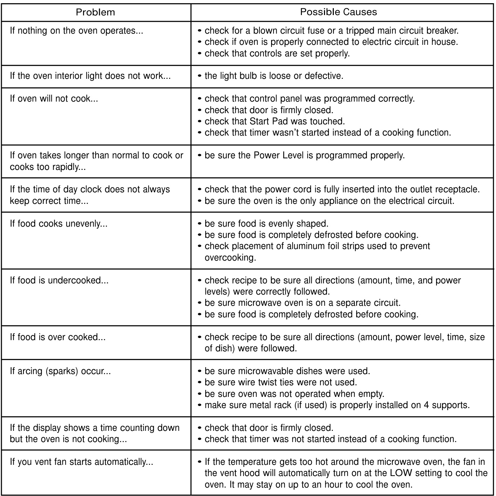 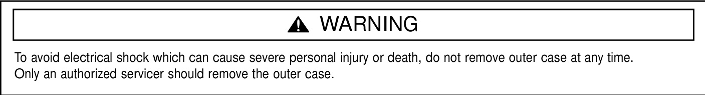

### Questions And Answers

QUESTIONS AND ANSWERS: 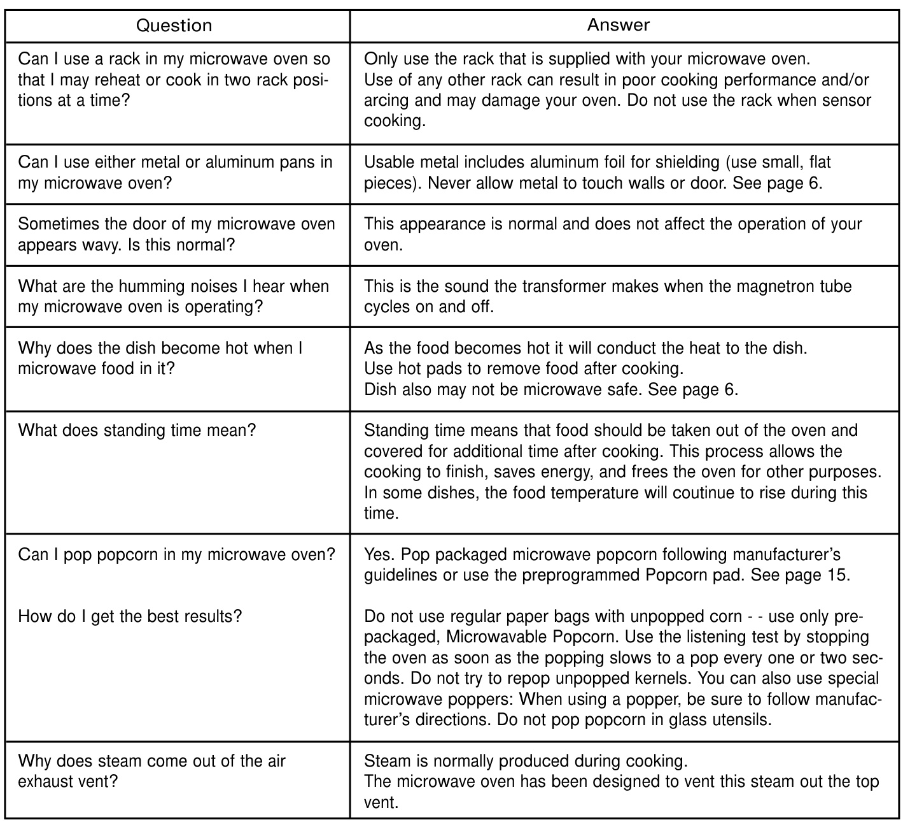

## Warranty

### Warranty Coverage And Eligible Purchasers

WHAT THIS WARRANTY COVERS & WHO IT APPLIES TO: The limited warranty provided in this Statement of Limited Product Warranty applies only to the appliance sold to you, the first using purchaser, provided that the Product was purchased:
· For your normal, household (non-commercial) use, and has in fact at all times only been used for normal household purposes.
· New at retail (not a display, "as is", or previously returned model), and not for resale, or commercial use. Within the United States or Canada, and has at all times remained within the country of original purchase.
The warranties stated herein apply only to the first purchaser of the Product and are not transferable. Please make sure to return your registration card; while not necessary to effectuate warranty coverage, it is the best way to notify you in the unlikely event of a safety notice or product recall.

### Warranty Duration

How Long the Warranty Lasts: It is warranted that the Product is free from defects in materials and workmanship for a period of twelve (12) months from the date of purchase. The foregoing timeline begins to run upon the date of purchase, and shall not be stalled, tolled, extended, or suspended, for any reason whatsoever.

### Repair Or Replacement Remedy

Repair/Replace as Your Exclusive Remedy: During this warranty period, one of the authorized service providers will repair your Product without charge to you (subject to certain limitations stated herein) if your Product proves to have been manufactured with a defect in materials or workmanship. If reasonable attempts to repair the Product have been made without success, then it will replace your Product (upgraded models may be available to you, for an additional charge). All removed parts and components and all replaced and/or repaired parts shall assume the identity of the original part for purposes of this warranty and this warranty shall not be extended with respect to such parts. The sole liability and responsibility hereunder is to repair manufacturer-defective Product only, using an authorized service provider during normal business hours. For safety and property damage concerns, it is highly recommended that you do not attempt to repair the Product yourself, or use an un-authorized servicer; it will have no responsibility or liability for repairs or work performed by a non-authorized servicer. If you choose to have someone other than an authorized service provider work on your Product, THIS WARRANTY WILL AUTOMATICALLY BECOME NULL AND VOID. Authorized service providers are those persons or companies that have been specially trained on the products, and who possess a superior reputation for customer service and technical ability (note that they are independent entities and are not agents, partners, affiliates or representatives). Notwithstanding the foregoing, it will not incur any liability, or have responsibility, for the Product if it is located in a remote area (more than 100 miles from an authorized service provider) or is reasonably inaccessible, hazardous, threatening, or treacherous locale, surroundings, or environment; in any such event, if you request, it would still pay for labor and parts and ship the parts to the nearest authorized service provider, but you would still be fully liable and responsible for any travel time or other special charges by the service company assuming they agree to make the service call.

### Out Of Warranty Product

Out of Warranty Product: It is under no obligation, at law or otherwise, to provide you with any concessions, including repairs, pro-rates, or Product replacement, once this warranty has expired.

### Warranty Exclusions

Warranty Exclusions: The warranty coverage described herein excludes all defects or damage that are not the direct fault, including without limitation, one or more of the following:
· Use of the Product in anything other than its normal, customary and intended manner (including without limitation, any form of commercial use, use or storage of an indoor product outdoors, use of the Product in conjunction with air or water-going vessels).
· Any party's willful misconduct, negligence, misuse, abuse, accidents, neglect, improper operation, failure to maintain, improper or negligent installation, tampering, failure to follow operating instructions, mishandling, unauthorized service (including self-performed "fixing" or exploration of the appliance's internal workings).
· Adjustment, alteration or modification of any kind.
· A failure to comply with any applicable state, local, city, or county electrical, plumbing and/or building codes, regulations, or laws, including failure to install the product in strict conformity with local fire and building codes and regulations.
· Ordinary wear and tear, spills of food, liquid, grease accumulations, or other substances that accumulate on, in, or around the Product.
· Any external, elemental and/or environmental forces and factors, including without limitation, rain, wind, sand, floods, fires, mud slides, freezing temperatures, excessive moisture or extended exposure to humidity, lightning, power surges, structural failures surrounding the appliance, and acts of God.
### Property Damage, Cosmetic Damage And Service Visit Exclusions

In no event shall it has any liability or responsibility whatsoever for damage to surrounding property, including cabinetry, floors, ceilings, and other structures or objects around the Product. Also excluded from this warranty are scratches, nicks, minor dents, and cosmetic damages on external surfaces and exposed parts; Products on which the serial numbers have been altered, defaced, or removed; service visits to teach you how to use the Product, or visits where there is nothing wrong with the Product; correction of installation problems (you are solely responsible for any structure and setting for the Product, including all electrical, plumbing or other connecting facilities, for proper foundation/flooring, and for any alterations including without limitation cabinetry, walls, floors, shelving, etc.); and resetting of breakers or fuses.

### Legal Limitations And Exclusions Of Damages

TO THE EXTENT ALLOWED BY LAW, THIS WARRANTY SETS OUT YOUR EXCLUSIVE REMEDIES WITH RESPECT TO PRODUCT, WHETHER THE CLAIM ARISES IN CONTRACT OR TORT (INCLUDING STRICT LIABILITY, OR NEGLIGENCE) OR OTHERWISE. THIS WARRANTY IS IN LIEU OF ALL OTHER WARRANTIES, WHETHER EXPRESS OR IMPLIED. ANY WARRANTY IMPLIED BY LAW, WHETHER FOR MERCHANTABILITY OR FITNESS FOR A PARTICULAR PURPOSE, OR OTHERWISE, SHALL BE EFFECTIVE ONLY FOR THE PERIOD THAT THIS EXPRESS LIMITED WARRANTY IS EFFECTIVE. IN NO EVENT WILL THE MANUFACTURER BE LIABLE FOR CONSEQUENTIAL, SPECIAL, INCIDENTAL, INDIRECT, "BUSINESS LOSS", AND/OR PUNITIVE DAMAGES, LOSSES, OR EXPENSES, INCLUDING WITHOUT LIMITATION TIME AWAY FROM WORK, HOTELS AND/OR RESTAURANT MEALS, REMODELLING EXPENSES IN EXCESS OF DIRECT DAMAGES WHICH ARE DEFINITIVELY CAUSED EXCLUSIVELY. SOME STATES DO NOT ALLOW THE EXCLUSION OR LIMITATION OF INCIDENTAL OR CONSEQUENTIAL DAMAGES, AND SOME STATES DO NOT ALLOW LIMITATIONS ON HOW LONG AN IMPLIED WARRANTY LASTS, SO THE ABOVE LIMITATIONS MAY NOT APPLY TO YOU. THIS WARRANTY GIVES YOU SPECIFIC LEGAL RIGHTS, AND YOU MAY ALSO HAVE OTHER RIGHTS WHICH VARY FROM STATE TO STATE.