# Motherboard

## Legal Information

### Copyright, warranty, and trademark notices

 No part of this manual, including the products and software described in it, may be reproduced, transmitted, transcribed, stored in a retrieval system, or translated into any language in any form or by any means, except documentation kept by the purchaser for backup purposes, without the express written permission.Product warranty or service will not be extended if: (1) the product is repaired, modified or altered, unless such repair, modification of alteration is authorized in writing; or (2) the serial number of the product is defaced or missing.THIS MANUAL WITHOUT WARRANTY OF ANY KIND, EITHER EXPRESS OR IMPLIED, INCLUDING BUT NOT LIMITED TO THE IMPLIED WARRANTIES OR CONDITIONS OF MERCHANTABILITY OR FITNESS FOR A PARTICULAR PURPOSE.IN NO EVENT SHALL ITS DIRECTORS, OFFICERS, EMPLOYEES OR AGENTS BE LIABLE FOR ANY INDIRECT, SPECIAL, INCIDENTAL, OR CONSEQUENTIAL DAMAGES (INCLUDING DAMAGES FOR LOSS OF PROFITS, LOSS OF BUSINESS, LOSS OF USE OR DATA, INTERRUPTION OF BUSINESS AND THE LIKE), EVEN IF IT HAS BEEN ADVISED OF THE POSSIBILITY OF SUCH DAMAGES ARISING FROM ANY DEFECT OR ERROR IN THIS MANUAL OR PRODUCT.SPECIFICATIONS AND INFORMATION CONTAINED IN THIS MANUAL ARE FURNISHED FOR INFORMATIONAL USE ONLY, AND ARE SUBJECT TO CHANGE AT ANY TIME WITHOUT NOTICE, AND SHOULD NOT BE CONSTRUED AS A COMMITMENT.IT ASSUMES NO RESPONSIBILITY OR LIABILITY FOR ANY ERRORS OR INACCURACIES THAT MAY APPEAR IN THIS MANUAL, INCLUDING THE PRODUCTS AND SOFTWARE DESCRIBED IN IT.Products and corporate names appearing in this manual may or may not be registered trademarks or copyrights of their respective companies, and are used only for identification or explanation and to the owners’ benefit, without intent to infringe.

### Offer to Provide Source Code of Certain Software
This product contains copyrighted software that is licensed under the General Public License (“GPL”), under the Lesser General Public License Version (“LGPL”) and/or other Free Open Source Software Licenses.Such software in this product is distributed without any warranty to the extent permitted by the applicable law.Copies of these licenses are included in this product.Where the applicable license entitles you to the source code of such software and/or other additional data, you may obtain it for a period of three years after our last shipment of the product, either (1) for free by downloading it or (2) for the cost of reproduction and shipment, which is dependent on the preferred carrier and the location where you want to have it shipped to, by sending a request to: In your request please provide the name, model number and version, as stated in the About Box of the product for which you wish to obtain the corresponding source code and your contact details so that we can coordinate the terms and cost of shipment with you.The source code will be distributed WITHOUT ANY WARRANTY and licensed under the same license as the corresponding binary/object code.This offer is valid to anyone in receipt of this information.It is eager to duly provide complete source code as required under various Free Open Source Software licenses.If however you encounter any problems in obtaining the full corresponding source code we would be much obliged if you give us a notification, stating the product and describing the problem (please DO NOT send large attachments such as source code archives, etc. to this email address).

## Safety information

### Electrical safety
• To prevent electrical shock hazard, disconnect the power cable from the electrical outlet before relocating the system.
• When adding or removing devices to or from the system, ensure that the power cables for the devices are unplugged before the signal cables are connected.If possible, disconnect all power cables from the existing system before you add a device.
• Before connecting or removing signal cables from the motherboard, ensure that all power cables are unplugged.
• Seek professional assistance before using an adapter or extension cord.These devices could interrupt the grounding circuit.
• Ensure that your power supply is set to the correct voltage in your area.If you are not sure about the voltage of the electrical outlet you are using, contact your local power company.
• If the power supply is broken, do not try to fix it by yourself.Contact a qualified service technician or your retailer.

### Operation safety
• Before installing the motherboard and adding components, carefully read all the manuals that came with the package.
• Before using the product, ensure all cables are correctly connected and the power cables are not damaged.If you detect any damage, contact your dealer immediately.
• To avoid short circuits, keep paper clips, screws, and staples away from connectors, slots, sockets and circuitry.
• Avoid dust, humidity, and temperature extremes.Do not place the product in any area where it may be exposed to moisture.
• Place the product on a stable surface.
• If you encounter technical problems with the product, contact a qualified service technician or your retailer.

## About this guide

### Guide purpose

This user guide contains the information you need when installing and configuring the motherboard.

### How this guide is organized
This guide contains the following parts:
• Chapter 1: Product introduction.This chapter describes the features of the motherboard and the new technology it supports.It includes descriptions of the switches, jumpers, and connectors on the motherboard.
• Chapter 2: BIOS information.This chapter discusses changing system settings through the BIOS Setup menus.Detailed descriptions for the BIOS parameters are also provided.

### Where to find more information
Refer to the following sources for additional information and for product and software updates.

1. websites. The website provides updated information on hardware and software products.Refer to the contact information.
2. Optional documentation.Your product package may include optional documentation, such as warranty flyers, that may have been added by your dealer.These documents are not part of the standard package.

### Conventions used in this guide
To ensure that you perform certain tasks properly, take note of the following symbols used throughout this manual.
DANGER/WARNING: Information to prevent injury to yourself when completing a task.
CAUTION: Information to prevent damage to the components when completing a task.
IMPORTANT: Instructions that you MUST follow to complete a task.
NOTE: Tips and additional information to help you complete a task.

### Typography and key notation
**Bold text:** Indicates a menu or an item to select.
*Italics*: Used to emphasize a word or a phrase.
\<Key\>: Keys enclosed in the less-than and greater-than sign means that you must press the enclosed key.Example: \<Enter\> means that you must press the Enter or Return key.
\<Key1\> + \<Key2\> + \<Key3\>: If you must press two or more keys simultaneously, the key names are linked with a plus sign (+).

## Package contents

### Package item checklist

Check your motherboard package for the following items.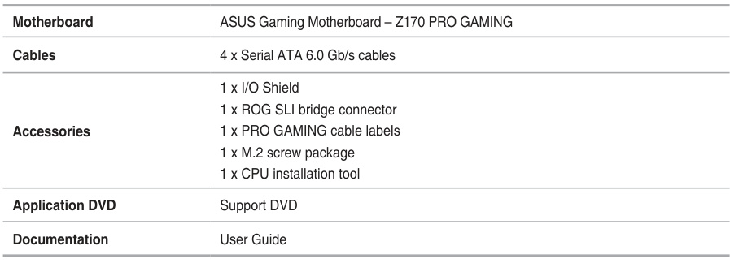

## Specifications summary

### Hardware and feature summary

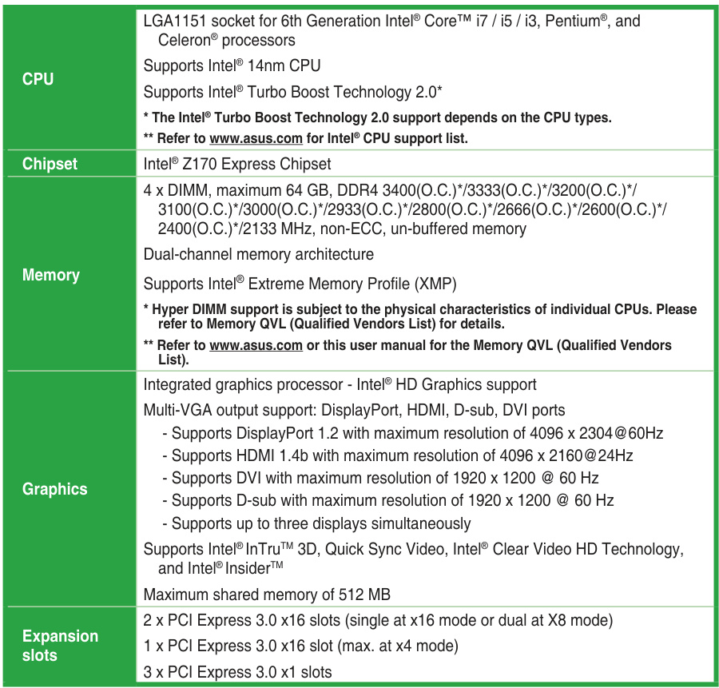 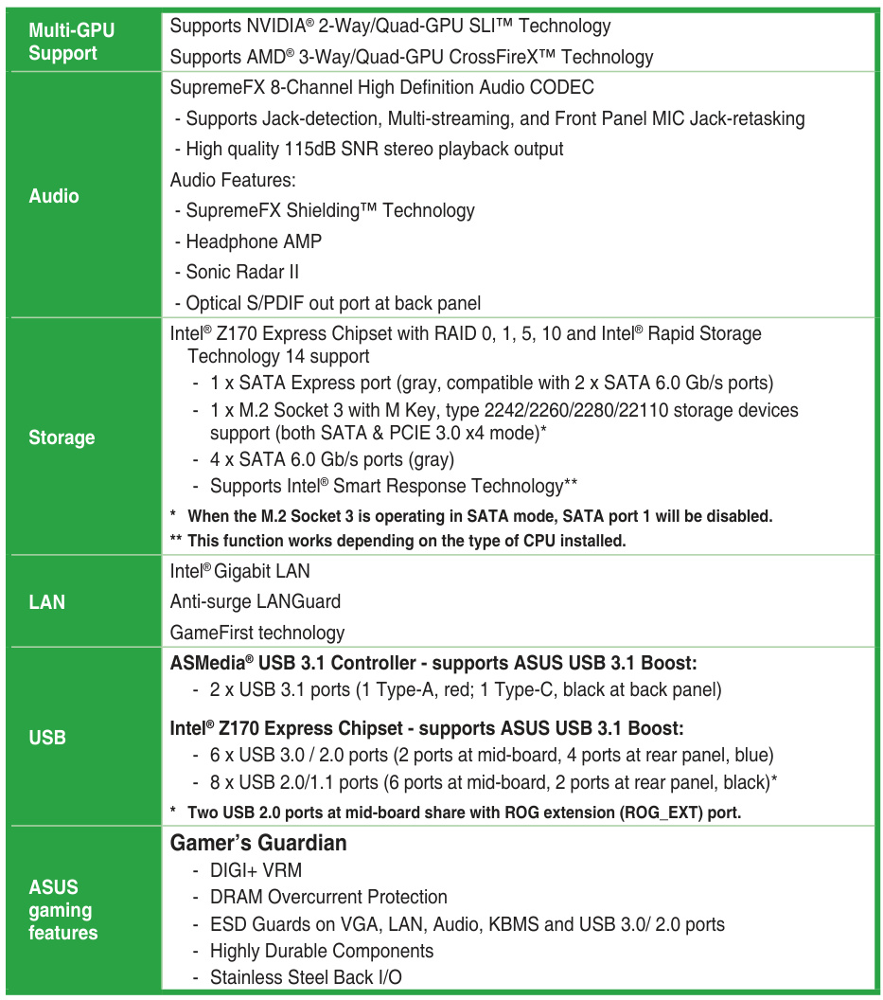

**Performance Optimization:**

 -5-Way Optimization tuning key perfectly consolidates TPU, EPU, DIGI+ VRM, Fan Xpert 3, and Turbo App DIGI+ VRM
 -DIGI+ VRM utility EPU
 -EPU TPU
 -Auto Tuning, TurboV, GPU Boost Fan Xpert 3 featuring Fan Auto Tuning function and multiple thermistors selection for optimized system cooling control

**RAMCache:**

RAMCache is listed as one of the included motherboard software features in this summary.

**Media Streamer:**

 -Pipe music or movies from your PC to a smart TV, your entertainment goes wherever you go\!
 -Media Streamer app for portable smartphone/tablet, supporting iOS 7 & Android 4.0 systems

**EZ DIY:**
Push Notice

 -Monitor your PC status with smart devices in real time
 UEFI BIOS EZ Mode featuring friendly graphics user interface
 - O.C.Tuner
 -CrashFree BIOS 3
 -EZ Flash 3

**Q-Design:**

 -Q-Shield
 -Q-DIMM
 -Q-LED (CPU, DRAM, VGA, Boot Device LED)
 -Q-Slot

**Exclusive Features:**

 -USB 3.1 Boost featuring speedy USB 3.1 transmission
 -AI Suite 3
 -Disk Unlocker
 -AI Charger+
 -CPU-Z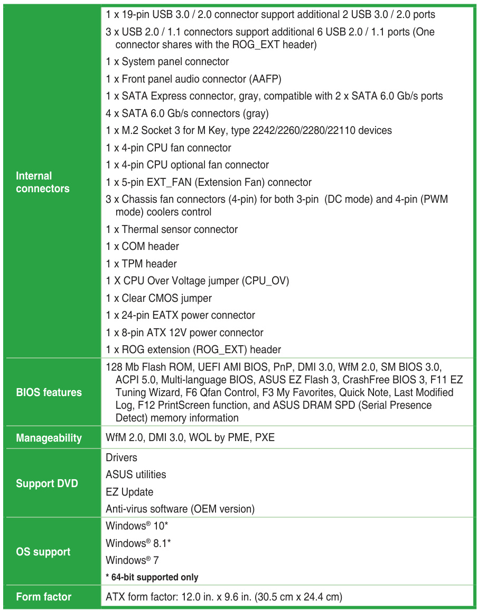

Specifications are subject to change without notice.

# Chapter 1: Product introduction

## 1.1 Before you proceed

### 1.1.1 Installation precautions

Take note of the following precautions before you install motherboard components or change any motherboard settings.
• Unplug the power cord from the wall socket before touching any component.
• Before handling components, use a grounded wrist strap or touch a safely grounded object or a metal object, such as the power supply case, to avoid damaging them due to static electricity.
• Hold components by the edges to avoid touching the ICs on them.
• Whenever you uninstall any component, place it on a grounded antistatic pad or in the bag that came with the component.
• Before you install or remove any component, ensure that the ATX power supply is switched off or the power cord is detached from the power supply.Failure to do so may cause severe damage to the motherboard, peripherals, or components.

## 1.2 Motherboard overview

### 1.2.0 Chassis fit and installation warning

Before you install the motherboard, study the configuration of your chassis to ensure that the motherboard fits.Unplug the power cord before installing or removing the motherboard.Failure to do so can cause you physical injury and damage to motherboard components.

### 1.2.1 Placement direction
When installing the motherboard, place it into the chassis in the correct orientation.The edge with external ports goes to the rear part of the chassis as indicated in the image.

### 1.2.2 Screw holes
Place nine screws into the holes indicated by circles to secure the motherboard to the chassis.Do not over tighten the screws\!Doing so can damage the motherboard.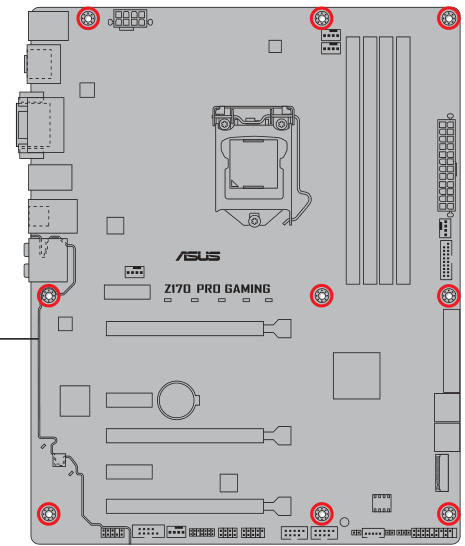 Place this side towards the rear of the chassis.

### 1.2.3 Motherboard layout and layout contents
The following diagrams show the motherboard layout and identify the major onboard components, connectors, slots, jumpers, LEDs, and related layout contents for reference during installation.

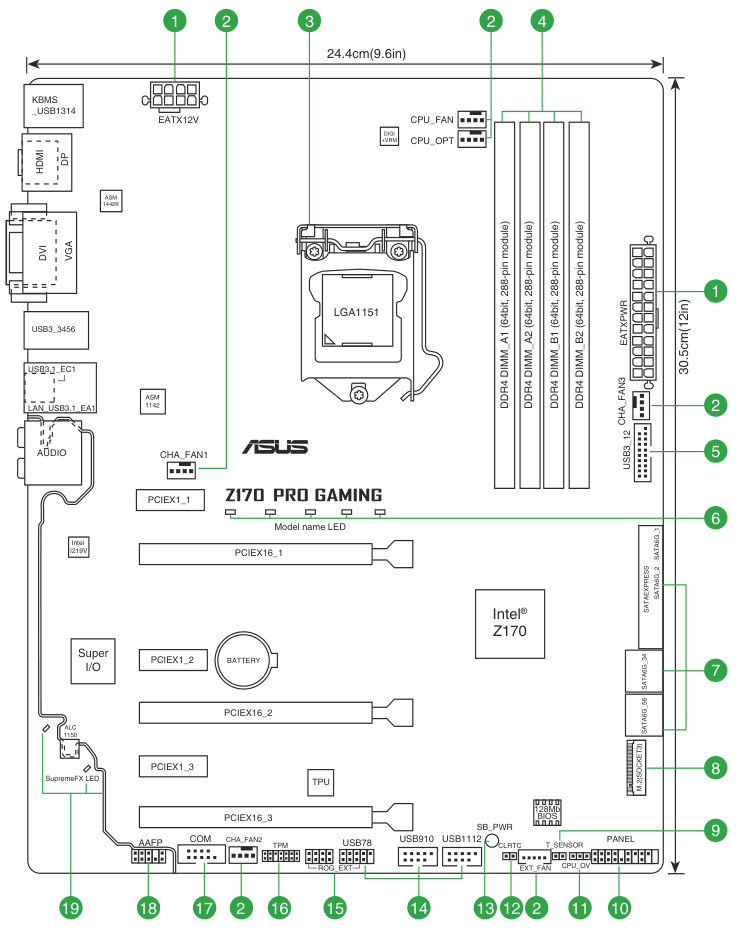

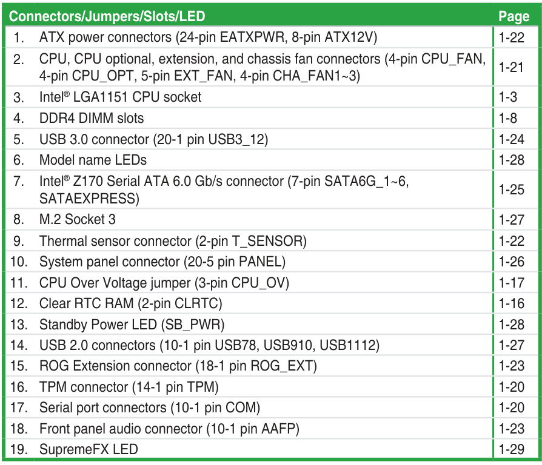

## 1.3 Central Processing Unit (CPU)

### 1.3.0 CPU socket overview and warnings

This motherboard comes with a surface mount LGA1151 socket designed for 6th Generation processors.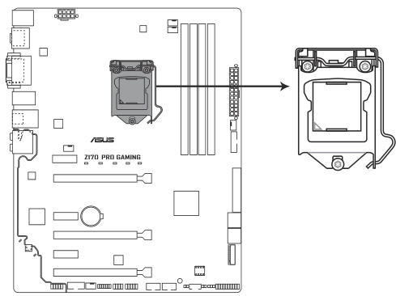 CPU socket LGA1151.Unplug all power cables before installing the CPU.
• Ensure that you install the correct CPU designed for the LGA1151 socket only.DO NOT install a CPU designed for LGA1150, LGA1155 and LGA1156 sockets on the LGA1151 socket.
• Upon purchase of the motherboard, ensure that the PnP cap is on the socket and the socket contacts are not bent.Contact your retailer immediately if the PnP cap is missing, or if you see any damage to the PnP cap/socket contacts/motherboard components.
• Keep the cap after installing the motherboard.It will process Return Merchandise Authorization (RMA) requests only if the motherboard comes with the cap on the LGA1151 socket.
• The product warranty does not cover damage to the socket contacts resulting from incorrect CPU installation/removal, or mis placement/loss/incorrect removal of the PnP cap.

### 1.3.1 Installing the CPU
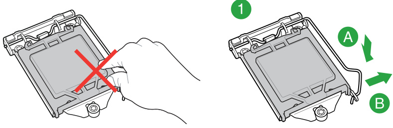 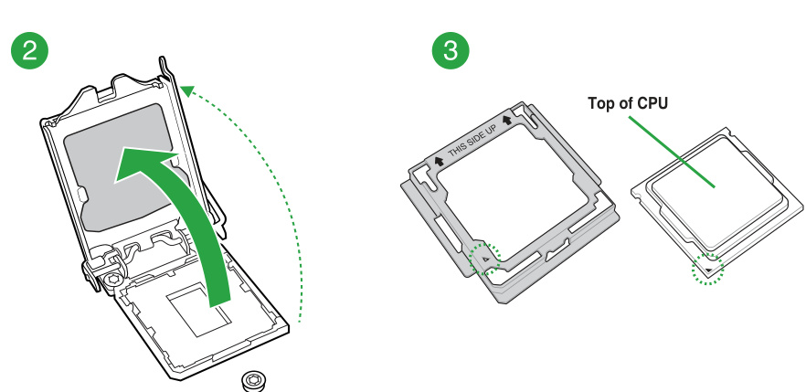 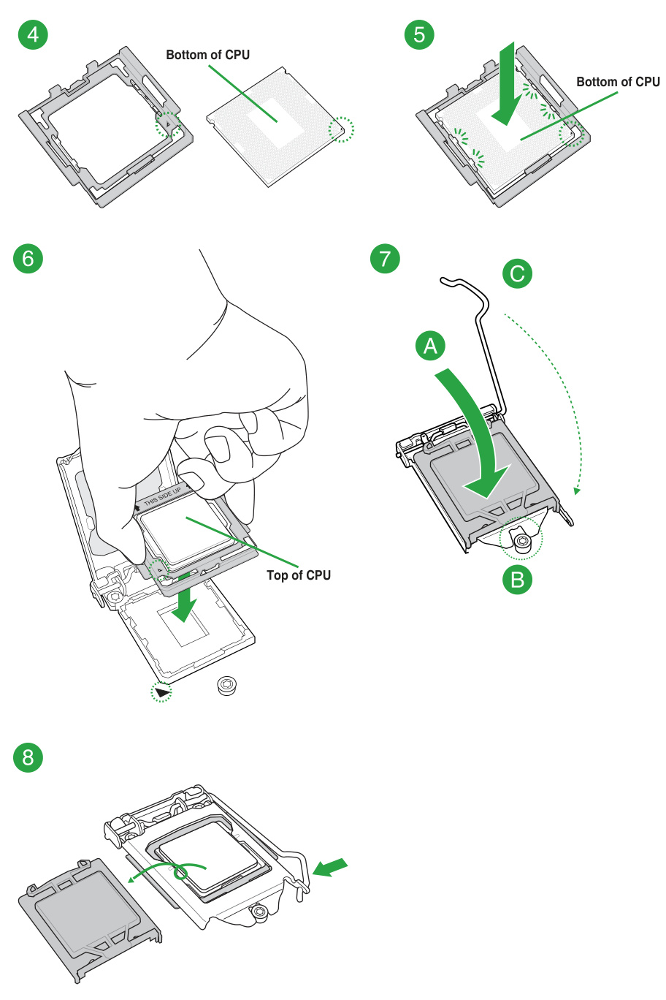
• Ensure that the CPU is firmly clicked into place before installing it onto the CPU socket on the motherboard.
• Use the CPU Installation Tool for installing the CPU only.DO NOT damage or bend the CPU Installation Tool.
• Always firmly hold both sides of the CPU Installation Tool when installing, removing, or picking up the CPU Installation Tool.
• It will not cover damages resulting from incorrect CPU installation/removal, incorrect CPU orientation/placement, or other damages resulting from negligence by the user.

### 1.3.2 CPU heatsink and fan assembly installation
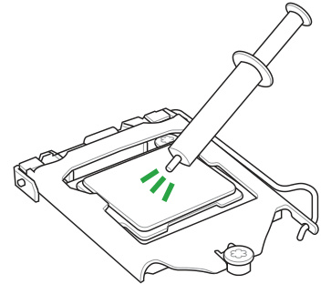  Apply the Thermal Interface Material to the CPU heatsink and CPU before you install the heatsink and fan if necessary.
To install the CPU heatsink and fan assembly: 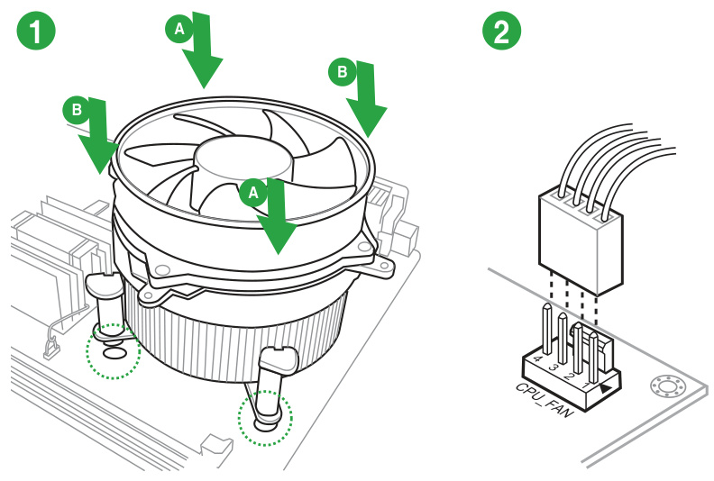 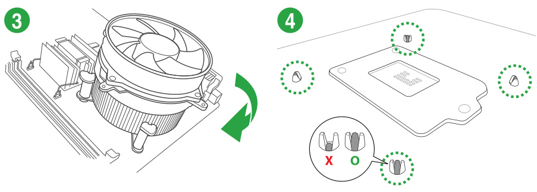
To uninstall the CPU heatsink and fan assembly: 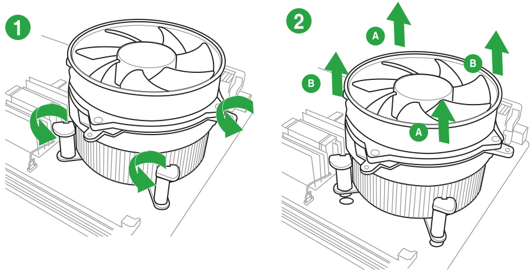

## 1.4 System memory

### System Memory Overview and Memory Configurations
This motherboard comes with four Double Data Rate 4 (DDR4) Dual Inline Memory Module (DIMM) sockets.A DDR4 module is notched differently from a DDR, DDR2, or DDR3 module.DO NOT install a DDR, DDR2, or DDR3 memory module to the DDR4 slot.DIMM voltage below 1.65 V is recommended to protect the CPU.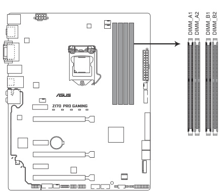 288-pin DDR4 DIMM sockets.

You may install 2 GB, 4 GB, 8 GB, and 16 GB unbuffered non-ECC DDR4 DIMMs into the DIMM sockets.You can refer to the recommended memory population below. Recommended memory configurations: 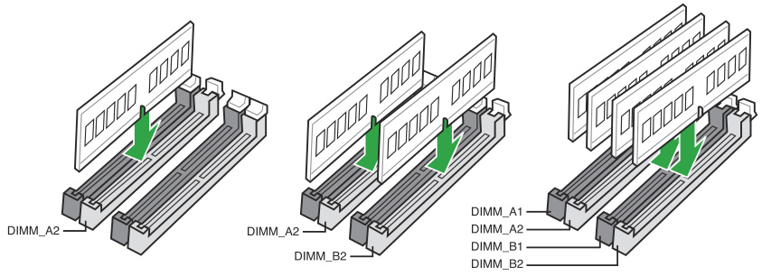
• You may install varying memory sizes in Channel A and Channel B. The system maps the total size of the lower-sized channel for the dual-channel configuration.Any excess memory from the higher-sized channel is then mapped for single-channel operation.
• DIMM voltage below 1.65V is recommended to protect the CPU.
• Due to the memory address limitation on 32-bit, when you install 4GB or more memory on the motherboard, the actual usable memory for the OS can be about 3GB or less.For effective use of memory, we recommend that you do any of the following: Use a maximum of 3 GB system memory if you are using a 32-bit.Install a 64-bit if you want to install 4GB or more on the motherboard.
• The default memory operation frequency is dependent on its Serial Presence Detect (SPD), which is the standard way of accessing information from a memory module.Under the default state, some memory modules for overclocking may operate at a lower frequency than the vendor-marked value.To operate at the vendor-marked or at a higher frequency, refer to section 2.5 Ai Tweaker menu for manual memory frequency adjustment.
• Always install the DIMMS with the same CAS Latency.For an optimum compatibility, we recommend that you install memory modules of the same version or data code (D/C) from the same vendor.Check with the vendor to get the correct memory modules.
• We highly recommend to use 4-DIMM/2-DIMM kit for full DIMM configuration.Full DIMM support is subject to the physical characteristics of individual CPUs or Memory.
• For system stability, use a more efficient memory cooling system to support a full memory load (4 DIMMs) or overclocking condition.

### Motherboard memory Qualified Vendors Lists (QVL)
DDR4 3400 (O.C.) MHz capability 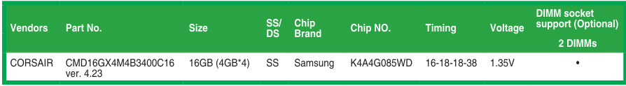
DDR4 3333 (O.C.) MHz capability 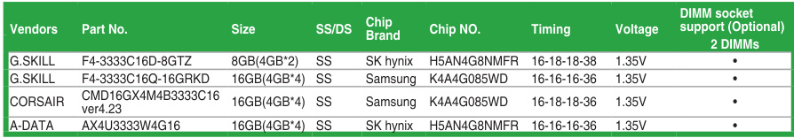
DDR4 3300 (O.C.) MHz capability 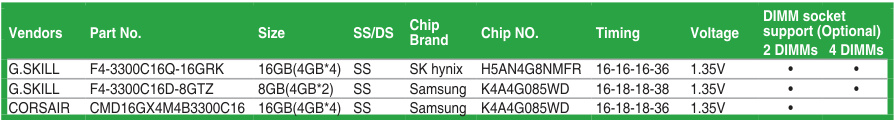
DDR4 3200 (O.C.) MHz capability 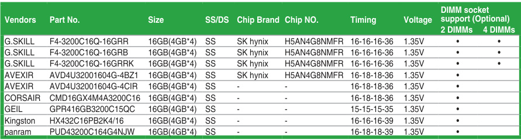
DDR4 3000 (O.C.) MHz capability 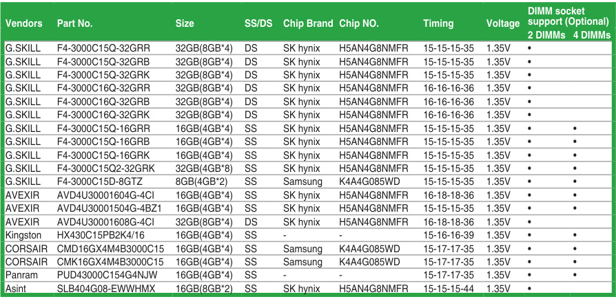
DDR4 2800 (O.C.) MHz capability 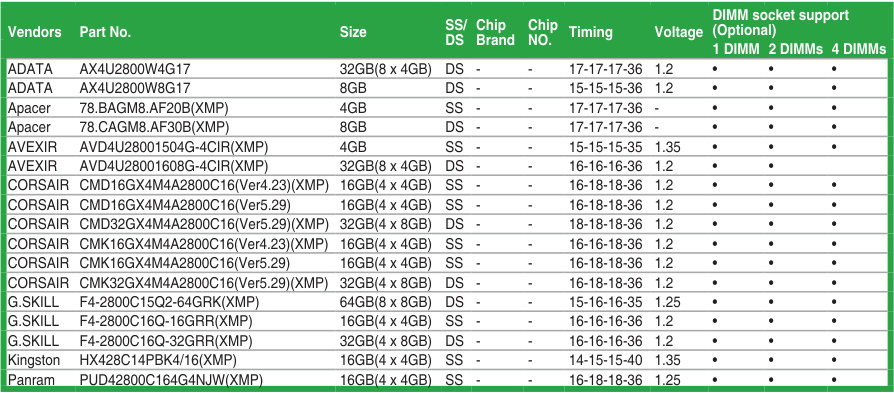
DDR4 2666 (O.C.) MHz capability 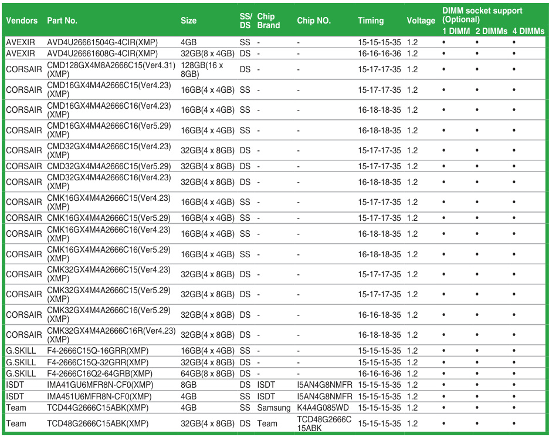
DDR4 2400 (O.C.) MHz capability 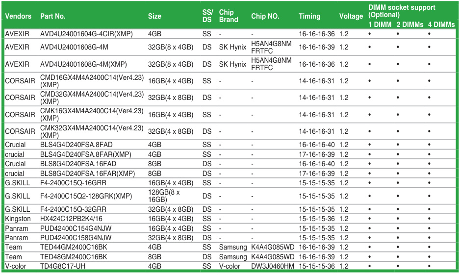
DDR4 2133 MHz capability 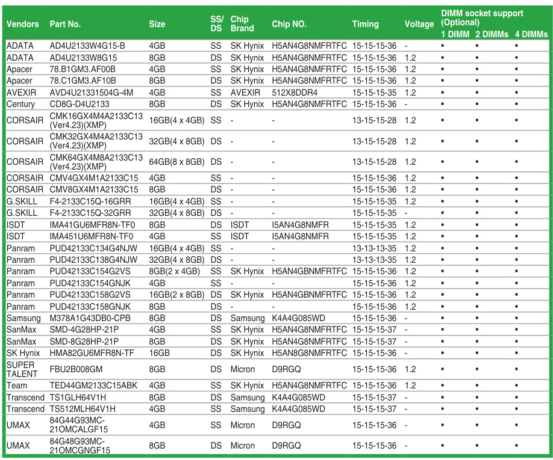

• SS: Single-sided / DS: Double-sided

### DIMM support:
• 1 DIMM: Supports one (1) module inserted into any slot as Single-channel memory configuration.Install the module into A2 slot for better compatibility.
• 2 DIMMs: Supports two (2) modules inserted into the same color slots as one pair of Dual-channel memory configuration.Install the modules into A2/B2 slots for better compatibility.
• 4 DIMMs: Supports four (4) modules inserted into both A1/A2 and B1/B2 slots as two pairs of Dual-channel memory configuration.
• Visit the website for the latest QVL.

### 1.4.3 Installing a DIMM
The following diagrams show how to install a DIMM module into the memory slot and how to remove it when required.

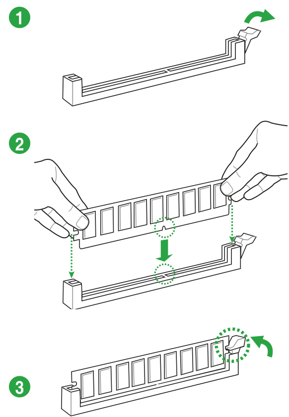
To remove a DIMM 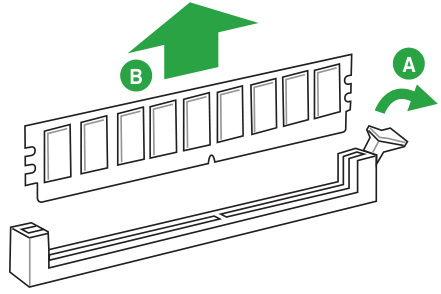

## 1.5 Expansion slots

### 1.5.0 Expansion slot precautions

In the future, you may need to install expansion cards.The following sub-sections describe the slots and the expansion cards that they support.Unplug the power cord before adding or removing expansion cards.Failure to do so may cause you physical injury and damage motherboard components.

### 1.5.1 Installing an expansion card
To install an expansion card:

1.Before installing the expansion card, read the documentation that came with it and make the necessary hardware settings for the card.
2.Remove the system unit cover (if your motherboard is already installed in a chassis).
3. Remove the bracket opposite the slot that you intend to use.Keep the screw for later use.
4.Align the card connector with the slot and press firmly until the card is completely seated on the slot.
5.Secure the card to the chassis with the screw you removed earlier.
6.Replace the system cover.

### 1.5.2 Configuring an expansion card
After installing the expansion card, configure it by adjusting the software settings.

1.Turn on the system and change the necessary BIOS settings, if any.See Chapter 2 for information on BIOS setup.
2.Assign an IRQ to the card.
3.Install the software drivers for the expansion card.
When using PCI cards on shared slots, ensure that the drivers support “Share IRQ” or that the cards do not need IRQ assignments.Otherwise, conflicts will arise between the two PCI groups, making the system unstable and the card inoperable.

### 1.5.3 PCI Express 3.0 x1 slots
This motherboard supports PCI Express x1 network cards, SCSI cards, and other cards that comply with the PCI Express specifications.

### 1.5.4 PCI Express 3.0 x16 slots
This motherboard has three PCI Express 3.0 x16 slot that supports PCI Express 3.0 x16 graphic cards complying with the PCI Express specifications.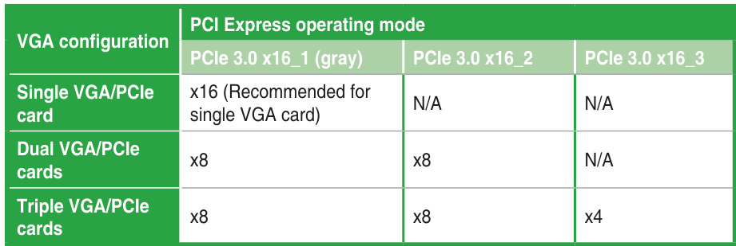
• In single VGA card mode, use the PCIe 3.0x16_1 slot (gray) for a PCI Express x16 graphics card to get better performance.
• We recommend that you provide sufficient power when running some modes.See page 1-22 for details.
• Connect a chassis fan to the motherboard connector labeled CHA_FAN1/2/3 when using multiple graphics cards for better thermal environment.

### IRQ assignments for this motherboard
The following table summarizes IRQ assignments for this motherboard, helping users understand shared interrupt routing when configuring expansion cards or troubleshooting device conflicts.

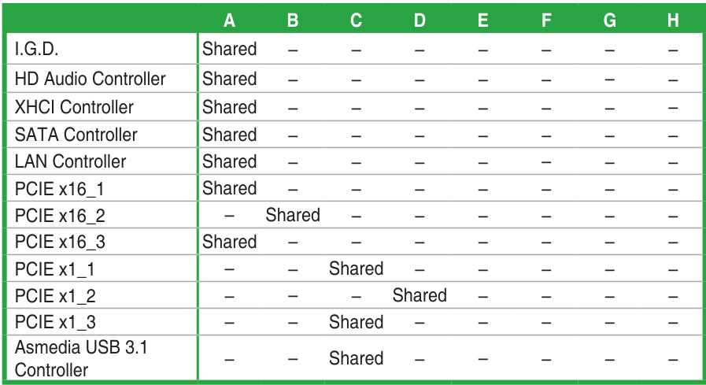

## 1.6 Jumpers

### 1. Clear RTC RAM (2-pin CLRTC)
This header allows you to clear the Real Time Clock (RTC) RAM in CMOS.You can clear the CMOS memory of date, time, and system setup parameters by erasing the CMOS RTC RAM data.The onboard button cell battery powers the RAM data in CMOS, which include system setup information such as system passwords.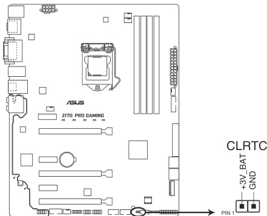
To erase the RTC RAM:

1.Turn OFF the computer and unplug the power cord.
2.Use a metal object such as a screwdriver to short the two pins.
3.Plug the power cord and turn ON the computer.
4.Hold down the \< Del \> key during the boot process and enter BIOS setup to reenter data.
• If the steps above do not help, remove the onboard battery and short the two pins again to clear the CMOS RTC RAM data.After clearing the CMOS, reinstall the battery.
• You do not need to clear the RTC when the system hangs due to overclocking.For system failure due to overclocking, use the CPU Parameter Recall (C.P.R.) feature.Shut down and reboot the system, then the BIOS automatically resets parameter settings to default values.

### 2. CPU Over Voltage jumper (3-pin CPU_OV)
The CPU Over Voltage jumper allows you to set a higher CPU voltage for a flexible overclocking system, depending on the type of the installed CPU.To gain more CPU voltage setting, insert the jumper to pins 2-3.To go back to its default CPU voltage setting, insert the jumper to pins 1-2.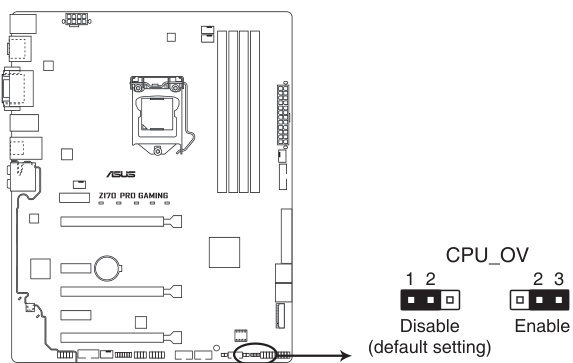 CPU_OV setting

## 1.7 Connectors

### 1.7.1 Rear panel connectors
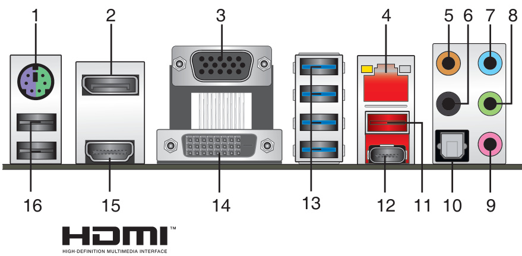

1.PS/2 Mouse/Keyboard combo port.This port connects to a PS/2 mouse or PS/2 keyboard.
2.Display Port.This port is for a Display Port-compatible devices.
3.Video Graphics Adapter (VGA) port.This 15-pin port is for a VGA monitor or other VGA-compatible devices.
4.LAN (RJ-45) port.This port allows Gigabit connection to a Local Area Network (LAN) through a network hub.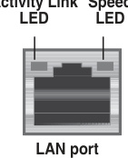 LAN port LED indications 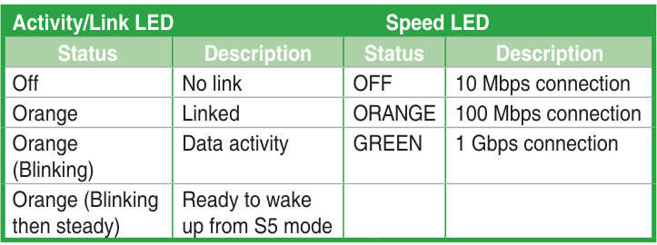
### 1.7.1.1 Audio rear panel ports
5.Center / Subwoofer port (orange).This port connects the center/subwoofer speakers.
6.Rear Speaker Out port (black).This port connects the rear speakers in a 4.1 channel, 5.1 channel, or 7.1 channel audio configuration.
7. Line In port (light blue).This port connects to the tape, CD, DVD player, or other audio sources.
8. Line Out port (lime).This port connects to a headphone or a speaker.In the 4.1, 5.1, and 7.1 channel configurations, the function of this port becomes Front Speaker Out.
9. Microphone port (pink).This port connects to a microphone.Audio 2, 4.1, 5.1, or 7.1-channel configuration 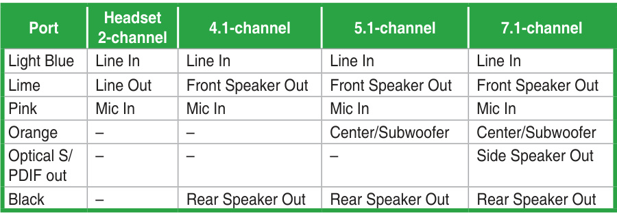
10.Optical S/PDIF out port.This port allows you to connect your PC to amplified speakers, headphones, or Sony/Phillips Digital Interconnect Format (S/PDIF) compliant devices.
### 1.7.1.2 USB rear panel ports
11. USB 3.1 Type A port.This 9-pin Universal Serial Bus (USB) Type A port is for USB 3.1 devices.
12. USB 3.1 Type C port.This Universal Serial Bus (USB) Type C port is for USB 3.1 mobile or peripheral devices.
13. USB 3.0 ports 3\~6.These 9-pin Universal Serial Bus (USB) ports are for USB 3.0 devices.
• The plugged USB 3.0 device may run on xHCI or EHCI mode, depending on the operating system’s setting.
• USB 3.0 devices can only be used for data storage.
• We strongly recommend that you connect USB 3.0 devices to USB 3.0 ports for faster and better performance from your USB 3.0 devices.
• All USB devices connected to the USB 2.0 and USB 3.0 ports are controlled by the xHCI controller.Some legacy USB devices must update their firmware for better compatibility.
• Multi-VGA output supports up to three displays under environment, two displays under BIOS, and one display under DOS.
• Intel display architecture design supports the following maximum supported pixel clocks (Pixel Clock = H total x V Total X Frame Rate (Screen refresh rate)): - Display Port port: 553 MHz - DVI port: 165 MHz - VGA port: 180 MHz - HDMI port: 300 MHz
### 1.7.1.3 Display rear panel ports
14.DVI-D port.This port is for any DVI-D compatible device.DVI-D can not be converted to output from RGB Signal to CRT and is not compatible with DVI-I.
15. HDMI port.This port is for a High-Definition Multimedia Interface (HDMI) connector, and is HDCP compliant allowing playback of HD DVD, Blu-ray, and other protected content.
16.USB 2.0 ports 13 and 14. These two 4-pin Universal Serial Bus (USB) ports are for USB 2.0/1.1 devices.

### 1.7.2 Internal connectors
The following subsections describe the motherboard internal connectors, including serial, TPM, fan, power, audio, USB, SATA, system panel, and M.2 interfaces used during system assembly.

### 1. Serial port connector (10-1 pin COM)
This connector is for a serial (COM) port.Connect the serial port module cable to this connector, then install the module to a slot opening at the back of the system chassis.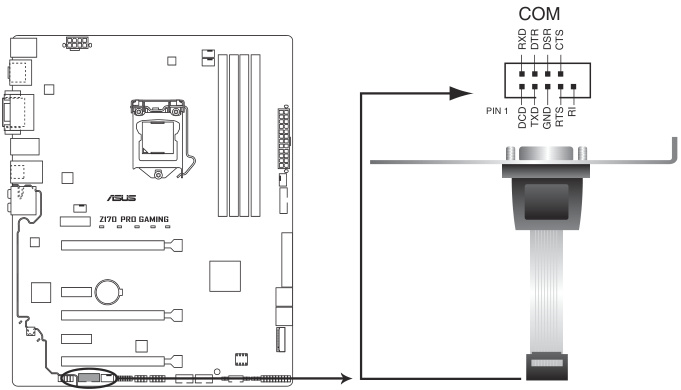 Serial port (COM) connector.The COM module is purchased separately.

### 2. TPM connector (14-1 pin TPM)
This connector supports a Trusted Platform Module (TPM) system, which securely store keys, digital certificates, passwords and data.A TPM system also helps enhance the network security, protects digital identities, and ensures platform integrity.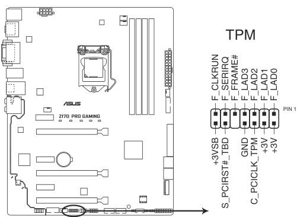 TPM connector

### 3. CPU, CPU optional, extension, and chassis fan connectors (4-pin CPU_FAN; 4-pin CPU_OPT; 5-pin EXT_FAN, 4-pin CHA_FAN1\~3)
Connect the fan cables to the fan connectors on the motherboard, ensuring that the black wire of each cable matches the ground pin of the connector.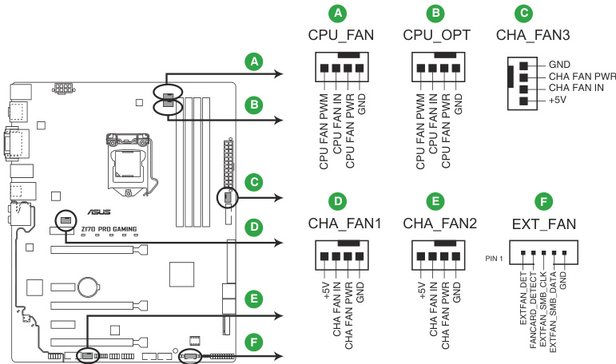 Fan connectors
• Do not forget to connect the fan cables to the fan connectors.Insufficient air flow inside the system may damage the motherboard components.These are not jumpers\!Do not place jumper caps on the fan connectors\!
• Ensure that the CPU fan cable is securely installed to the CPU fan connector.
• The CPU_FAN connector supports a CPU fan of maximum 1 A (12 W) fan power.
• The CPU_FAN connector and CHA_FAN connectors support the FAN Xpert 3 feature.
• The EXT_FAN connector supports 2 of 5 thermal sensor sources.
• The CPU fan connector detects the type of CPU fan installed and automatically switches the control modes.To configure the CPU fan’s control mode, go to Advanced \> Monitor \> Q-Fan Configuration \> CPU Q-Fan Control item in BIOS.
• The chassis fan connectors support DC and PWM modes.To set these fans to DC or PWM, go to Advanced \> Monitor \> Q-Fan Configuration \> Chassis Fan 1/2/3 Q-Fan Control items in BIOS.
• The extension fan connectors support DC and PWM modes.To set these fans to DC or PWM, go to Advanced \> Monitor \> Q-Fan Configuration \> Extension Fan 1/2/3 Q-Fan Control items in BIOS.The FAN EXTENSION CARD is purchased separately.

### 4. ATX power connectors (24-pin EATXPWR, 8-pin ATX12V)
These connectors are for ATX power supply plugs.The power supply plugs are designed to fit these connectors in only one orientation.Find the proper orientation and push down firmly until the connectors completely fit.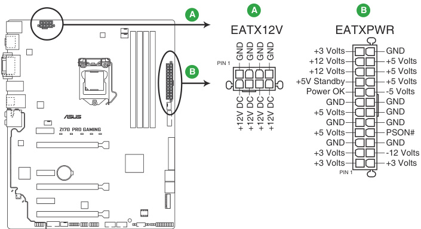 ATX power connectors
• For a fully configured system, we recommend that you use a power supply unit (PSU) that complies with ATX 12 V Specification 2.0 (or later version) and provides a minimum power of 350 W.
• DO NOT forget to connect the 4-pin/8-pin ATX +12V power plug.Otherwise, the system will not boot up.
• We recommend that you use a PSU with higher power output when configuring a system with more power-consuming devices or when you intend to install additional devices.The system may become unstable or may not boot up if the power is inadequate.
• If you are uncertain about the minimum power supply requirement for your system, refer to the Recommended Power Supply Wattage Calculator for details.

### 5. Thermal sensor connector (2-pin T_SENSOR)
This connector is for the thermistor cable that allows you to monitor the temperature of your motherboard’s critical components and connected devices.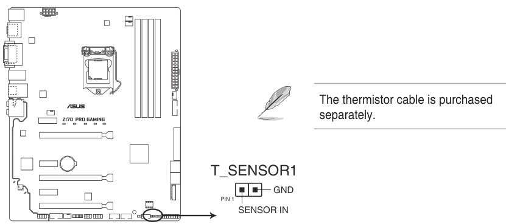

### 6. Front panel audio connector (10-1 pin AAFP)
This connector is for a chassis-mounted front panel audio I/O module that supports either HD Audio or legacy AC`97 audio standard.Connect one end of the front panel audio I/O module cable to this connector.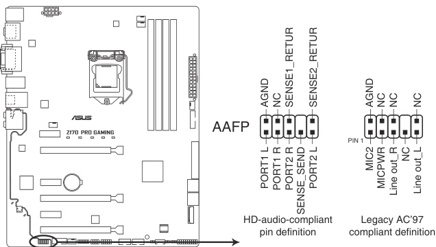 Front panel audio connector
• We recommend that you connect a high-definition front panel audio module to this connector to avail of the motherboard’s high-definition audio capability.
• If you want to connect a high-definition front panel audio module to this connector, set the Front Panel Type item in the BIOS setup to [HD].If you want to connect an AC’97 front panel audio module to this connector, set the item to [AC97].By default, this connector is set to [HD].See section 2.6.7 Onboard Devices Configuration for details.

### 7. ROG Extension - ROG_EXT connector (18-1 pin ROG_EXT)
This connector is for the Front Base.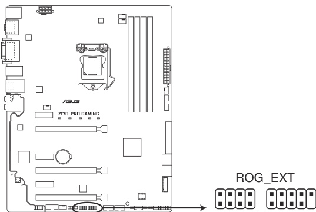 ROG_EXT connectors
• The Front Base is purchased separately.

### 8. USB 3.0 connector (20-1 pin USB3_12, USB3_34)
This connector allows you to connect a USB 3.0 module for additional USB 3.0 front or rear panel ports.With an installed USB 3.0 module, you can enjoy all the benefits of USB 3.0 including faster data transfer speeds of up to 5 Gbps, faster charging time for USB-chargeable devices, optimized power efficiency, and backward compatibility with USB 2.0.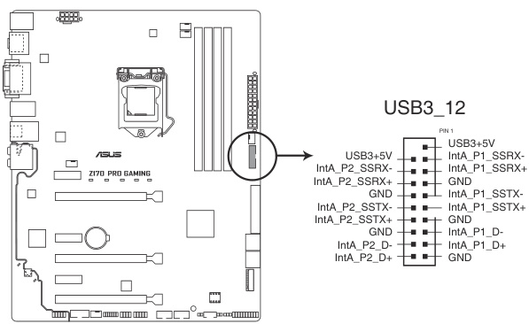 USB3.0 Front panel connector
The USB 3.0 module is purchased separately.
• These connectors are based on xHCI specification.We recommend you to install the related driver to fully use the USB 3.0 ports.
• The plugged USB 3.0 device will run on xHCI mode.
• These USB 3.0 ports support native UASP transfer standard in Windows 8.1 and Turbo Mode when using USB 3.0 Boost feature.

### 9. Intel Serial ATA 6.0Gb/s connector (7-pin SATA6G_1\~6, SATA EXPRESS)
This connector connects to Serial ATA 6.0 Gb/s hard disk drives via Serial ATA 6.0 Gb/s signal cables.If you installed Serial ATA hard disk drives, you can create a RAID 0, 1, 5, and 10 configuration through the onboard Intel chipset.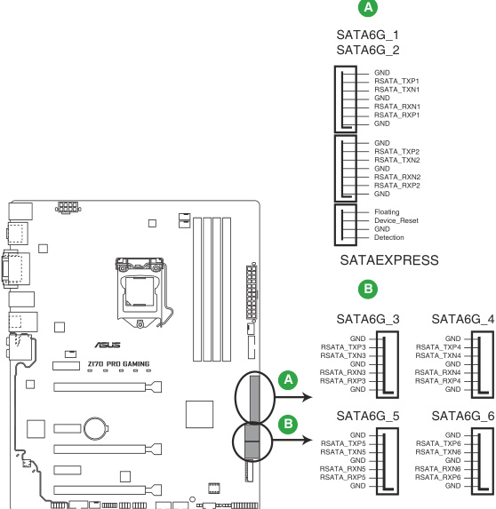 Intel SATA 6.0Gb/s connectors 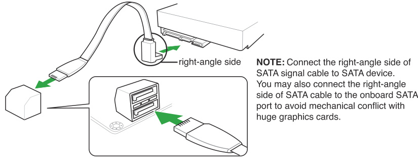
• These connectors are set to [AHCI] by default.If you intend to create a Serial ATA RAID set using these connectors, set the SATA Mode item in the BIOS to [RAID].Refer to section 2.6.5 SATA Configuration for details.
• Before creating a RAID set, refer to the manual bundled in the motherboard support DVD.The SATA EXPRESS connector can support one SATA Express device or two SATA devices.

### 10. System panel connector (20-5 pin PANEL)
This connector supports several chassis-mounted functions.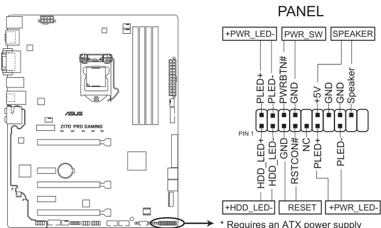 System panel connector
• System power LED (4-pin +PWR_LED-): This 2-pin connector is for the system power LED.Connect the chassis power LED cable to this connector.The system power LED lights up when you turn on the system power, and blinks when the system is in sleep mode.
• Hard disk drive activity LED (2-pin +HDD_LED-): This 2-pin connector is for the HDD Activity LED.Connect the HDD Activity LED cable to this connector.The HDD LED lights up or flashes when data is read from or written to the HDD.
• System warning speaker (4-pin SPEAKER): This 4-pin connector is for the chassis-mounted system warning speaker.The speaker allows you to hear system beeps and warnings.
• ATX power button/soft-off button (2-pin PWR_SW): This connector is for the system power button.Pressing the power button turns the system on or puts the system in sleep or soft-off mode depending on the operating system settings.Pressing the power switch for more than four seconds while the system is ON turns the system OFF.
• Reset button (2-pin RESET): This 2-pin connector is for the chassis-mounted reset button for system reboot without turning off the system power.

### 11. M.2 socket 3
This socket allows you to install an M.2 (NGFF) SSD module.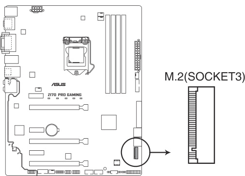 M.2(SOCKET3)
• This socket supports M Key and type 2242/2260/2280/22110 storage devices.
• The M.2 (NGFF) SSD module is purchased separately.
• When the M.2 Socket 3 is operating in SATA mode, SATA port 1 will be disabled.

### 12. USB 2.0 connectors (10-1 pin USB78, USB910, USB1112)
These connectors are for USB 2.0 ports.Connect the USB module cable to any of these connectors, then install the module to a slot opening at the back of the system chassis.These USB connectors comply with USB 2.0 specifications and supports up to 480Mbps connection speed.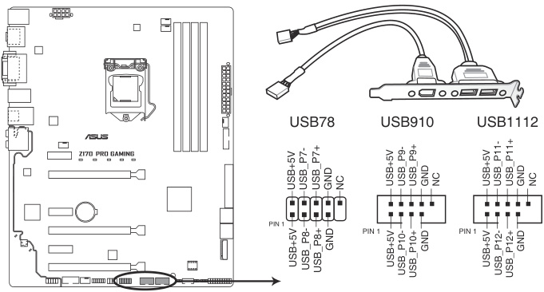 USB2.0 connectors 
Never connect a 1394 cable to the USB connectors.Doing so will damage the motherboard\!The USB 2.0 module is purchased separately.

## 1.8 Onboard LED

### Onboard LEDs: Standby Power, Model Name LEDs, and SupremeFX LED
The motherboard comes with a standby power LED that lights up to indicate that the system is ON, in sleep mode, or in soft-off mode.This is a reminder that you should shut down the system and unplug the power cable before removing or plugging in any motherboard component.The illustration below shows the location of the onboard LED.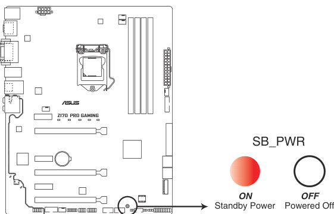 Onboard LED

The model name LEDs are a group of five small LEDs, located right below the printed model name.The LEDs light up in the following two modes to highlight the model name.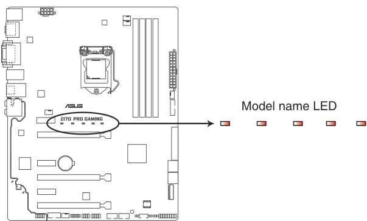 Model name LED Lighting You can turn off the model name LEDs or change the lit modes from the BIOS or the LED Control app in Ai Suite 3. To change the setting in BIOS, go to Advanced \> Onboard Devices Configuration \> Model Name LED Lighting item.See section 2.6.7 Onboard Devices Configuration for details.

The SupremeFX LED lights up in the following three ways to bring you an ultimate lighting effect.This LED also outlines the separation of the audio components from the rest of your motherboard.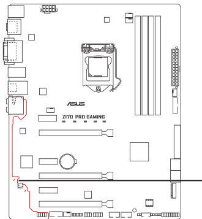 SupremeFX LED SupremeFX LED Lighting You can turn off the SupremeFX LED or change the lit modes from the BIOS or the LED Control app in Ai Suite 3. To change the setting in BIOS, go to Advanced \> Onboard Devices Configuration \> SupremeFX LED Lighting item.See section 2.6.7 Onboard Devices Configuration for details.

## 1.9 Software support

### 1.9.1 Installing an operating system
This motherboard supports Windows (32-bit / 64-bit), Windows 8.1 (64-bit) and Windows 10 (64-bit) Operating Systems (OS).Always install the latest OS version and corresponding updates to maximize the features of your hardware.Motherboard settings and hardware options vary.Refer to your OS documentation for detailed information.

### 1.9.2 Support DVD information
The Support DVD that comes with the motherboard package contains the drivers, software applications, and utilities that you can install to avail all motherboard features.The contents of the Support DVD are subject to change at any time without notice.
To run the Support DVD: Place the Support DVD into the optical drive.If Autorun is enabled in your computer, the DVD automatically displays the lists of the unique features of your motherboard.Click the Driver, Utilities, Manual, or Special tabs to display their respective menus.The following screen is for reference only. 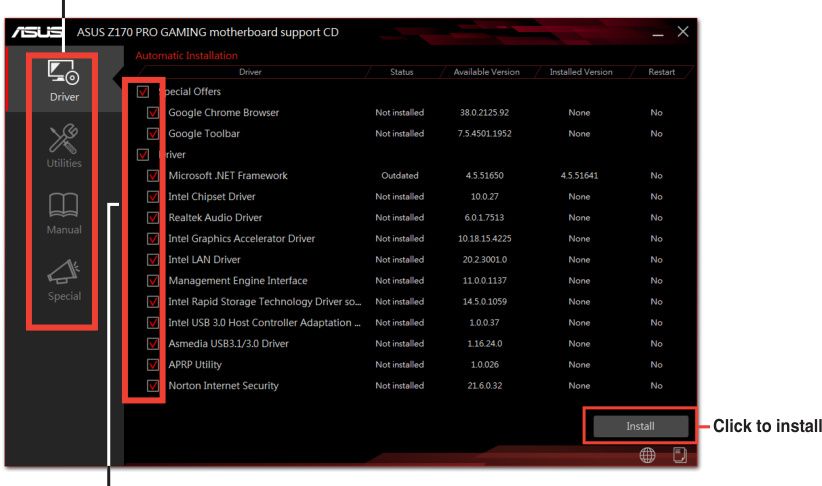 Click an icon to display a tab.If Autorun is NOT enabled in your computer, browse the contents of the Support DVD to locate the file Setup.exe in the root folder.Double-click the Setup.exe to run the DVD.

# Chapter 2: BIOS information

## 2.1 Managing and updating your BIOS

### 2.1.0 BIOS backup recommendation

Save a copy of the original motherboard BIOS file to a USB flash disk in case you need to restore the BIOS in the future.Copy the original motherboard BIOS using the Update utility.

### 2.1.1 EZ Update
EZ Update is a utility that allows you to automatically update your motherboard’s softwares, drivers and the BIOS version easily.With this utlity, you can also manually update the saved BIOS and select a boot logo when the system goes into POST.To launch EZ Update, click EZ Update on the AI Suite 3 main menu bar.Click to automatically motherboard’s driver, software and firmware 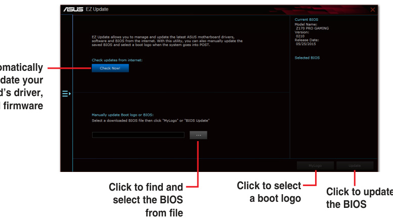 EZ Update requires an Internet connection either through a network or an ISP (Internet Service Provider).

### 2.1.2 EZ Flash 3
The EZ Flash 3 feature allows you to update the BIOS without using an OS-based utility.
• Ensure that you load the BIOS default settings to ensure system compatibility and stability.Select the Load Optimized Defaults item under the Exit menu.See section 2.10 Exit Menu for details.
• Check your Internet connection before updating the BIOS via the Internet.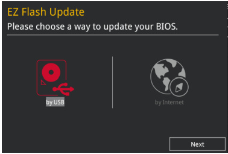
To update the BIOS using EZ Flash 3:

1.Enter the Advanced Mode of the BIOS setup program.Go to the Tool menu to select EZ Flash 3 Utility and press \<Enter\> to enable it.
2.Follow the steps below to update the BIOS via USB or Internet.
 Via USB:
a) Insert the USB flash disk that contains the latest BIOS file to the USB port, then select by USB.
b) Press \<Tab\> to switch to the Drive field.
c) Press the Up/Down arrow keys to find the USB flash disk that contains the latest BIOS, and then press \<Enter\>.
d) Press \<Tab\> to switch to the Folder Info field.
e) Press the Up/Down arrow keys to find the BIOS file, and then press \<Enter\> to perform the BIOS update process.
 Via the Internet:
a) Select by Internet.
b) Press the Left/Right arrow keys to select an Internet connection method, and then press \<Enter\>.
c) Follow the onscreen instructions to complete the update.
3.Reboot the system when the update process is done.
• EZ Flash 3 supports USB devices, such as a USB flash disk, with FAT 32/16 format and single partition only.
• DO NOT shut down or reset the system while updating the BIOS to prevent system boot failure\!

### 2.1.3 CrashFree BIOS 3 utility
The CrashFree BIOS 3 is an auto recovery tool that allows you to restore the BIOS file when it fails or gets corrupted during the updating process.You can restore a corrupted BIOS file using the motherboard support DVD or a USB flash drive that contains the updated BIOS file.
• Before using this utility, rename the BIOS file in the removable device into Z17PG.CAP.
• The BIOS file in the support DVD may not be the latest version.Download the latest BIOS file.
Recovering the BIOS:

1.Turn on the system.
2.Insert the support DVD to the optical drive or the USB flash drive that contains the BIOS file to the USB port.
3.The utility automatically checks the devices for the BIOS file.When found, the utility reads the BIOS file and enters EZ Flash 3 utility automatically.
4.The system requires you to enter BIOS Setup to recover BIOS settings.To ensure system compatibility and stability, we recommend that you press \<F5\> to load default BIOS values.DO NOT shut down or reset the system while updating the BIOS\!Doing so can cause system boot failure\!

### 2.1.4 BIOS Updater
BIOS Updater allows you to update the BIOS in DOS environment.The screen captures used in this section are for reference only and may not be exactly the same as actually shown on your computer screen.
### 2.1.4.1 Before updating BIOS
Before updating BIOS:
• Prepare the motherboard support DVD and a USB flash drive.
• Download the latest BIOS file and BIOS Updater and save them in your USB flash drive.NTFS is not supported under FreeDOS environment.Ensure that your USB flash drive is in single partition and in FAT32/16 format.
• Turn off the computer.
• Ensure that your computer has a DVD optical drive.
### 2.1.4.2 Booting the system in DOS environment
Booting the system in DOS environment:

1.Insert the USB flash drive with the latest BIOS file and BIOS Updater to the USB port.
2.Boot your computer then press \<F8\> to launch the select boot device screen.
3.When the select boot device screen appears, insert the Support DVD into the optical drive then select the optical drive as the boot device.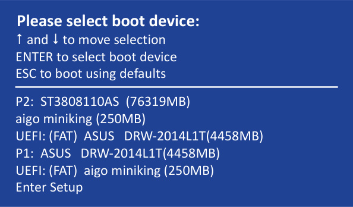
4.When the booting message appears, press \<Enter\> within five (5) seconds to enter FreeDOS prompt.ISOLINUX 3.20 2006-08-26 Copyright (C) 1994-2005 H. Peter Anvin A Bootable DVD/CD is detected.Press ENTER to boot from the DVD/CD.If no key is pressed within 5 seconds, the system will boot next priority device automatically.boot:
5.On the FreeDOS prompt, type d: then press \<Enter\> to switch the disk from Drive C (optical drive) to Drive D (USB flash drive).
### 2.1.4.3 Updating the BIOS file
 Updating the BIOS file:
6.On the FreeDOS prompt, type bupdater /pc /g and press \<Enter\>.D:/\> bupdater /pc /g
7.On the BIOS Updater screen, press \<Tab\> to switch from Files panel to Drives panel then select D:.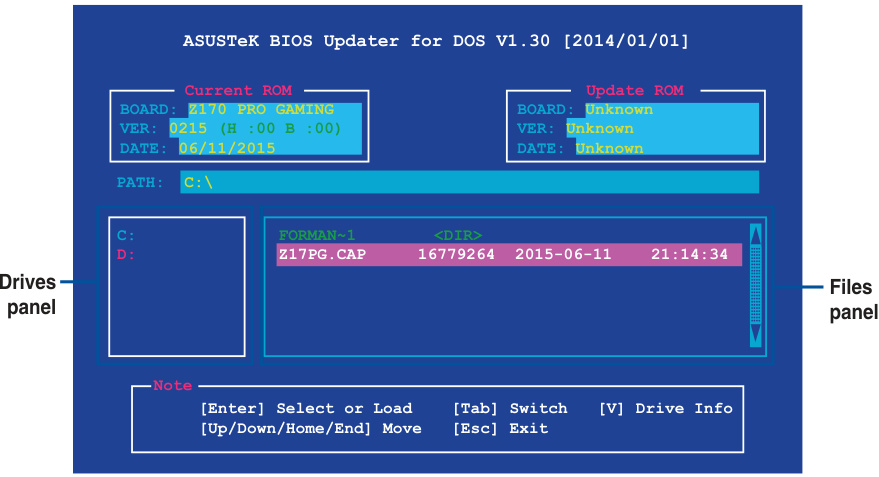
8.Press \<Tab\> to switch from Drives panel to Files panel then press \<Up/Down or Home/ End\> keys to select the BIOS file and press \<Enter\>.
9.After the BIOS Updater checks the selected BIOS file, select Yes to confirm the BIOS update. The BIOS Backup feature is not supported due to security regulations.
10. Select Yes then press \<Enter\>.When BIOS update is done, press \<ESC\> to exit BIOS Updater.
11.Restart your computer.DO NOT shut down or reset the system while updating the BIOS to prevent system boot failure.Ensure to load the BIOS default settings to ensure system compatibility and stability.Select the Load Optimized Defaults item under the Exit BIOS menu.See section 2.10 Exit Menu for details.

## 2.2 BIOS setup program

### 2.2.0 BIOS access and setup precautions

Use the BIOS Setup program to update the BIOS or configure its parameters.The BIOS screens include navigation keys and brief online help to guide you in using the BIOS Setup program.
Entering BIOS Setup at startup: Press \<Delete\> or \<F2\> during the Power-On Self Test (POST).If you do not press \<Delete\> or \<F2\>, POST continues with its routines.
Entering BIOS Setup after POST: Press \<Ctrl\> + \<Alt\> + \<Del\> simultaneously.Press the reset button on the system chassis.Press the power button to turn the system off then back on.Do this option only if you failed to enter BIOS Setup using the first two options.Using the power button, reset button, or the \<Ctrl\> + \<Alt\> + \<Del\> keys to force reset from a running operating system can cause damage to your data or system.We recommend you always shut down the system properly from the operating system.
• The BIOS setup screens shown in this section are for reference purposes only, and may not exactly match what you see on your screen.
• Download the latest BIOS file for this motherboard.
• Ensure that a USB mouse is connected to your motherboard if you want to use the mouse to control the BIOS setup program.
• If the system becomes unstable after changing any BIOS setting, load the default settings to ensure system compatibility and stability.Select the Load Optimized Defaults item under the Exit menu or press hotkey F5.See section 2.10 Exit Menu for details.
• If the system fails to boot after changing any BIOS setting, try to clear the CMOS and reset the motherboard to the default value.See section 1.6 Headers for information on how to erase the RTC RAM.
BIOS menu screen: The BIOS setup program can be used under two modes: EZ Mode and Advanced Mode.Press \<F7\> to change between the two modes.

### 2.2.1 EZ Mode
By default, the EZ Mode screen appears when you enter the BIOS setup program.The EZ Mode provides you an overview of the basic system information, and allows you to select the display language, system performance mode, fan profile and boot device priority.To access the Advanced Mode, click Advanced Mode(F7) or press \<F7\>.The default screen for entering the BIOS setup program can be changed.Refer to the Setup Mode item in section 2.8 Boot menu for details.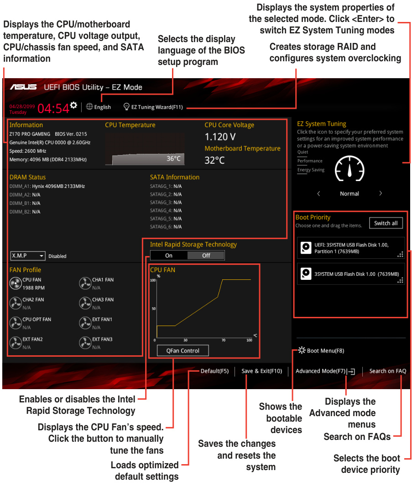 The boot device options vary depending on the devices you installed to the system.

### 2.2.2 Advanced Mode
The Advanced Mode provides advanced options for experienced end-users to configure the BIOS settings.The figure below shows an example of the Advanced Mode.Refer to the following sections for the detailed configurations. To access the EZ Mode, click EzMode(F7) or press \<F7\>.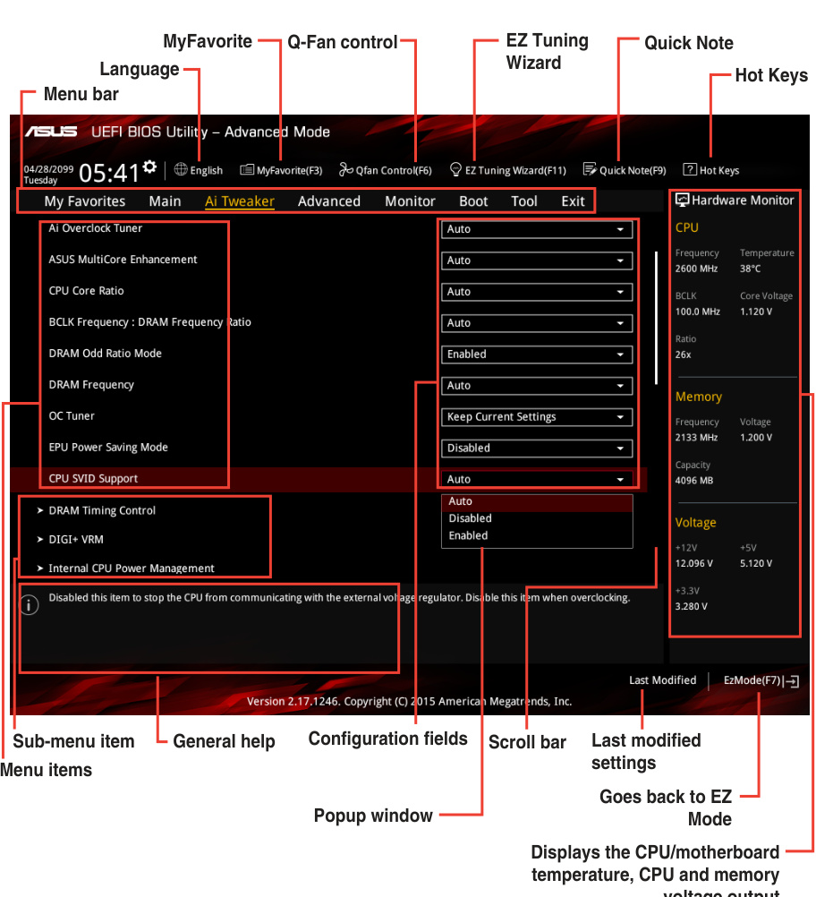

### Menu bar
The menu bar on top of the screen has the following main items: 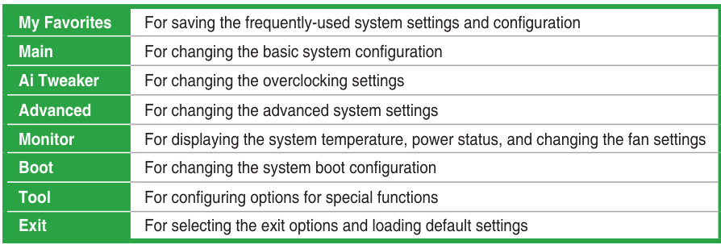

### Menu items
The highlighted item on the menu bar displays the specific items for that menu.For example, selecting Main shows the Main menu items.The other items (My Favorites, Ai Tweaker, Advanced, Monitor, Boot, Tool, and Exit) on the menu bar have their respective menu items.

### Submenu items
A greater than sign (\>) before each item on any menu screen means that the item has a submenu.To display the submenu, select the item and press \<Enter\>.

### Language
This button above the menu bar contains the languages that you can select for your BIOS.Click this button to select the language that you want to display in your BIOS screen.

### My Favorites (F3)
This button above the menu bar shows all BIOS items in a Tree Map setup.Select frequently used BIOS settings and save it to My Favorites menu.Refer to section 2.3 My Favorites for more information.

### Q-Fan Control (F6)
This button above the menu bar displays the current settings of your fans.Use this button to manually tweak the fans to your desired settings.Refer to section 2.2.3 QFan Control for more information.

### EZ Tuning Wizard (F11)
This button above the menu bar allows you to view and tweak the overclocking settings of your system.It also allows you to change the motherboard’s SATA mode from AHCI to RAID mode.Refer to section 2.2.4 EZ Tuning Wizard for more information.

### Quick Note (F9)
This button above the menu bar allows you to key in notes of the activities that you have done in BIOS.• The Quick Note function does not support the following keyboard functions: delete, cut, copy and paste.• You can only use the alphanumeric characters to enter your notes.

### Hot keys
This button above the menu bar contains the navigation keys for the BIOS setup program.Use the navigation keys to select items in the menu and change the settings.

### Search on FAQ
Move your mouse over this button to show a QR code.Scan this QR code with your mobile device to connect to the BIOS FAQ web page.You can also scan the QR code below.

### Scroll bar
A scroll bar appears on the right side of a menu screen when there are items that do not fit on the screen.Press the Up/Down arrow keys or \<Page Up\> / \<Page Down\> keys to display the other items on the screen.

### General help
At the top right corner of the menu screen is a brief description of the selected item.Use \<F12\> key to capture the BIOS screen and save it to the removable storage device.

### Configuration fields
These fields show the values for the menu items.If an item is user-configurable, you can change the value of the field opposite the item.You cannot select an item that is not user-configurable.A configurable field is highlighted when selected.To change the value of a field, select it and press \<Enter\> to display a list of options.

### Last Modified button
This button shows the items that you last modified and saved in BIOS Setup.

### 2.2.3 QFan Control
The QFan Control allows you to set a fan profile or manually configure the operating speed of your CPU and chassis fans.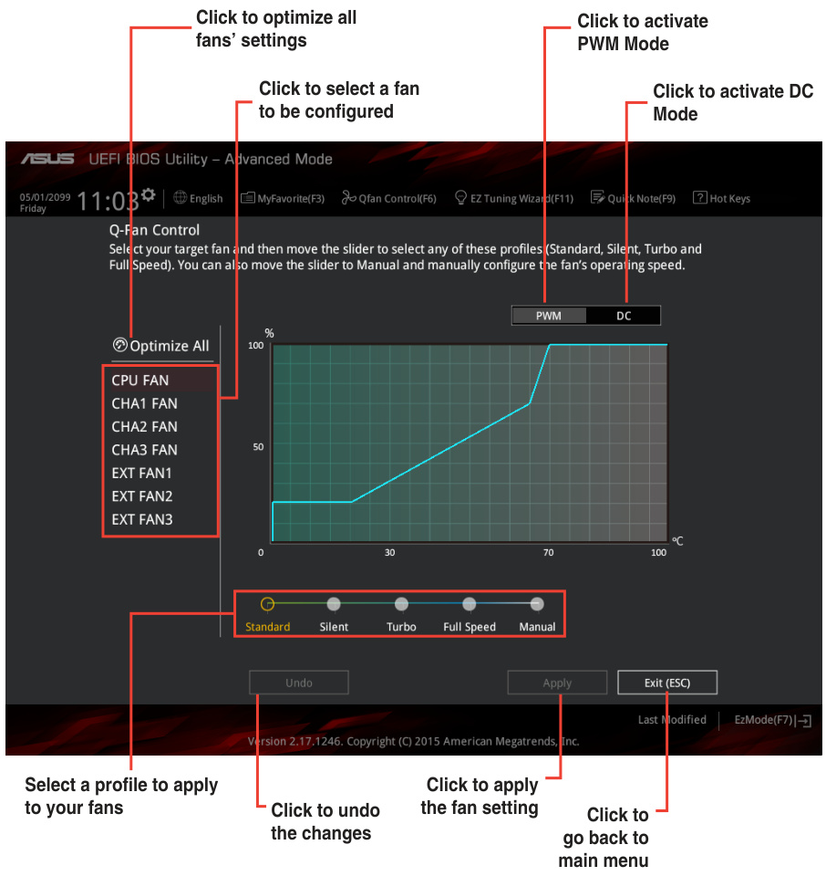
Configuring fans manually: Select Manual from the list of profiles to manually configure your fans’ operating speed.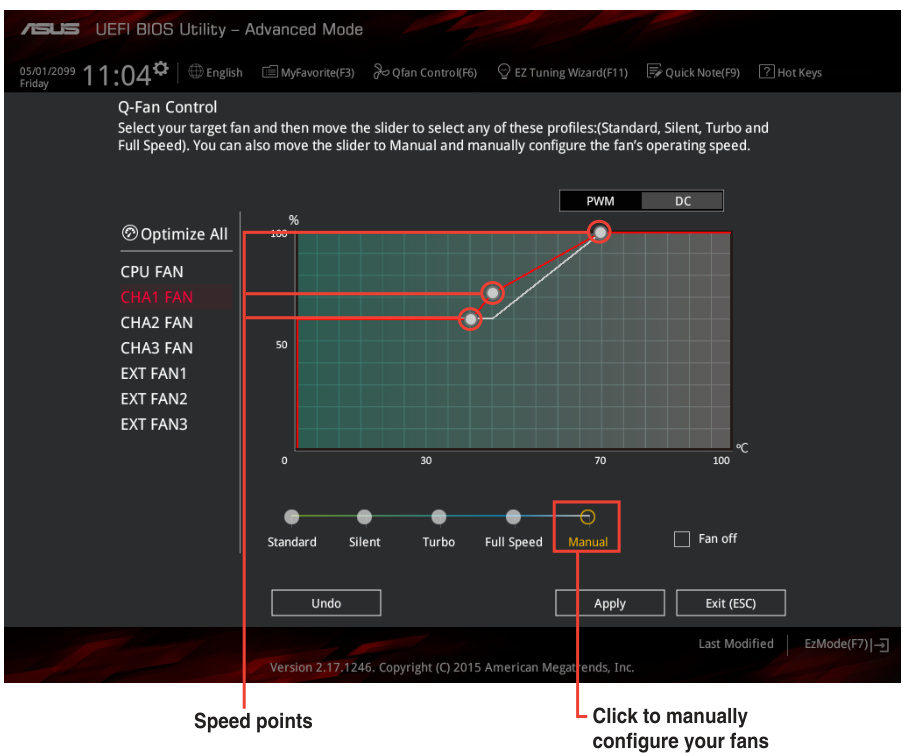 To configure your fans:

1.Select the fan that you want to configure and to view its current status.
2.Click and drag the speed points to adjust the fans’ operating speed.
3.Click Apply to save the changes then click Exit (ESC).

### 2.2.4 EZ Tuning Wizard
EZ Tuning Wizard allows you to overclock your CPU and DRAM, computer usage, and CPU fan to their best settings.You can also easily set RAID in your system using this feature.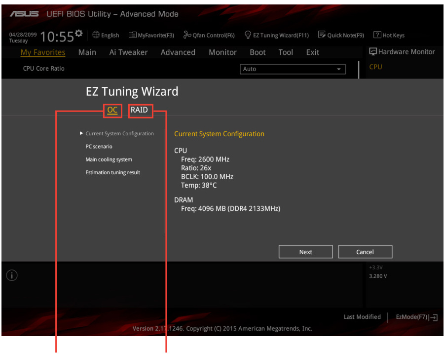 System OC setup RAID setup.
Tuning your system settings:

1.Press \<F11\> on your keyboard or click from the BIOS screen to open EZ Tuning Wizard screen, then click Next.
2.Select a PC scenario Daily Computing or Gaming/Media Editing, then click Next.
3.Select the CPU fan type (Box cooler, Tower cooler, or Water cooler) that you installed then click Next.If you are not sure of the CPU fan type, click I’m not sure.The system automatically detects the CPU fan type.
4.Click Next then click Yes to confirm auto-tuning.
 Creating RAID:
5.Press \<F11\> on your keyboard or click from the BIOS screen to open EZ Tuning Wizard screen.
6.Click RAID then click Yes to enable RAID.
• Ensure that your HDDs have no existing RAID volumes.• Ensure to connect your HDDs to Intel SATA connectors.
7. The available HDDs display.Click Next to continue.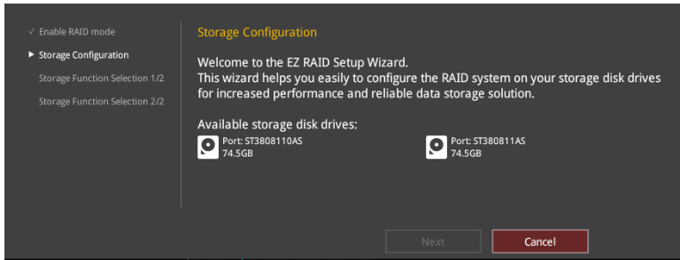
8.Select the type of storage for your RAID Easy Backup or Super Speed, then click Next.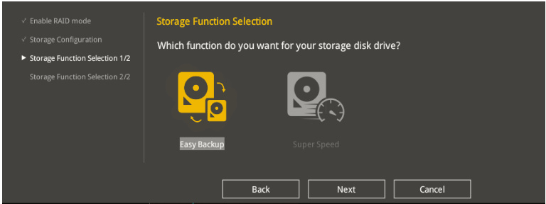
 a.For Easy Backup, select from Easy Backup (RAID1) or Easy Backup (RAID10) then click Next.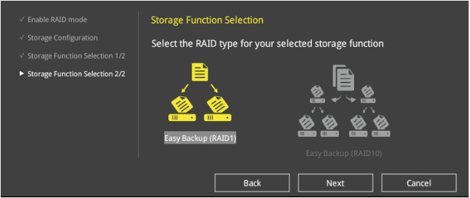 You can only select Easy Backup (RAID 10) if you connect four (4) HDDs.
 b.For Super Speed, select from Super Speed (RAID0) or Super Speed (RAID5) then click Next.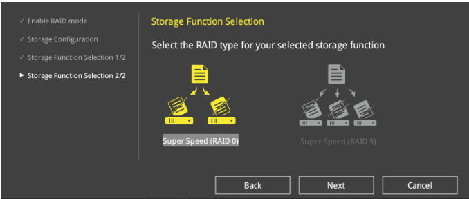
9.After selecting the type of RAID, click Yes to continue the RAID setup.
10.After the RAID setup is done, click Yes to exit the setup then click OK to reset your system.

## 2.3 My Favorites

### 2.3.0 My Favorites overview

My Favorites is your personal space where you can easily save and access your favorite BIOS items.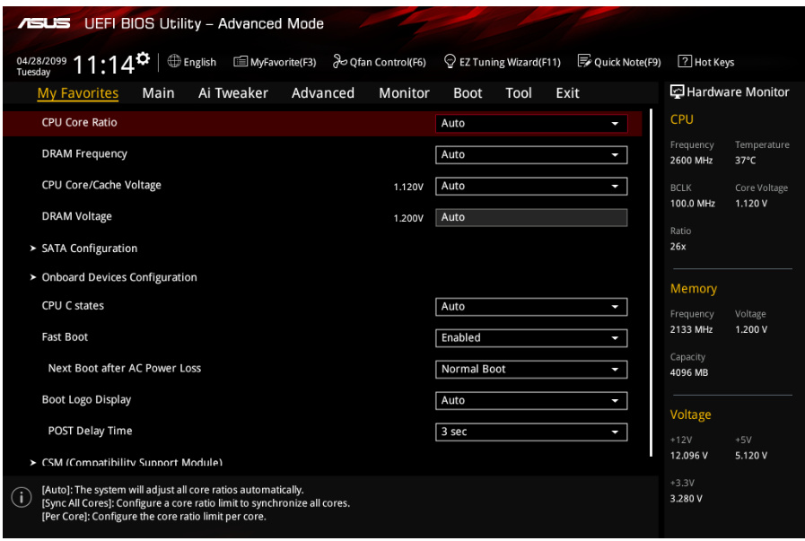 My Favorites comes with several performance, power saving, and fast boot related items by default.You can personalize this screen by adding or removing items.Adding items to My Favorites To add BIOS items: 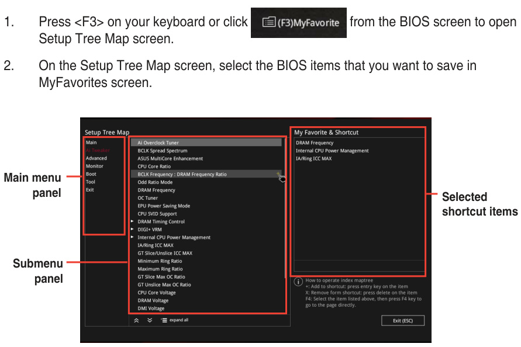
3.Select an item from main menu panel, then click the submenu that you want to save as favorite from the submenu panel and click.You cannot add the following items to My Favorite items: • User-managed items such as language and boot order
4.Click Exit (ESC) or press \<esc\> key to close Setup Tree Map screen.
5.Go to My Favorites menu to view the saved BIOS items.

## 2.4 Main menu

### 2.4.0 Main menu overview

The Main menu screen appears when you enter the Advanced Mode of the BIOS Setup program.The Main menu provides you an overview of the basic system information, and allows you to set the system date, time, language, and security settings.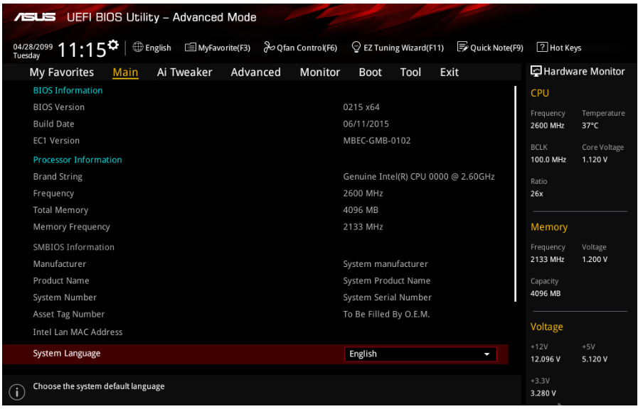

### 2.4.1 Language [English]
Allows you to choose the BIOS language version from the options.

### 2.4.2 Security
The Security menu items allow you to change the system security settings.
• If you have forgotten your BIOS password, erase the CMOS Real Time Clock (RTC) RAM to clear the BIOS password.See section 1.6 Headers for information on how to erase the RTC RAM.
• The Administrator or User Password items on top of the screen show the default Not Installed.After you set a password, these items show Installed.
### 2.4.2.1 Administrator Password
Administrator Password: If you have set an administrator password, we recommend that you enter the administrator password for accessing the system.To set an administrator password:

1.Select the Administrator Password item and press \<Enter\>.
2.From the Create New Password box, key in a password, then press \<Enter\>.
3.From the Confirm New Password box, key in your password again to confirm the password, then click OK.
 To change an administrator password:
4.Select the Administrator Password item and press \<Enter\>.
5.From the Enter Current Password box, key in the current password, then press \<Enter\>.
6.From the Create New Password box, key in a new password, then press \<Enter\>.
7.From the Confirm New Password box, key in your password again to confirm the password, then click OK.
To clear the administrator password, follow the same steps as in changing an administrator password, but click OK when prompted to create/confirm the password.After you clear the password, the Administrator Password item on top of the screen shows Not Installed.
### 2.4.2.2 User Password
User Password: If you have set a user password, you must enter the user password for accessing the system.The User Password item on top of the screen shows the default Not Installed.After you set a password, this item shows Installed.
 To set a user password:
8.Select the User Password item and press \<Enter\>.
9.From the Create New Password box, key in a password, then press \<Enter\>.
10.From the Confirm New Password box, key in your password again to confirm the password, then click OK.
 To change a user password:
11.Select the User Password item and press \<Enter\>.
12.From the Enter Current Password box, key in the current password, then press \<Enter\>.
13.From the Create New Password box, key in a new password, then press \<Enter\>.
14.From the Confirm New Password box, key in your password again to confirm the password, then click OK.
To clear the user password, follow the same steps as in changing a user password, but click OK when prompted to create/confirm the password.After you clear the password, the User Password item on top of the screen shows Not Installed.

## 2.5 Ai Tweaker menu

### 2.5.0 Ai Tweaker overview and caution

The Ai Tweaker menu items allow you to configure overclocking-related items.Be cautious when changing the settings of the Ai Tweaker menu items.Incorrect field values can cause the system to malfunction.The configuration options for this section vary depending on the CPU and DIMM model you installed on the motherboard.Scroll down to display other BIOS items. 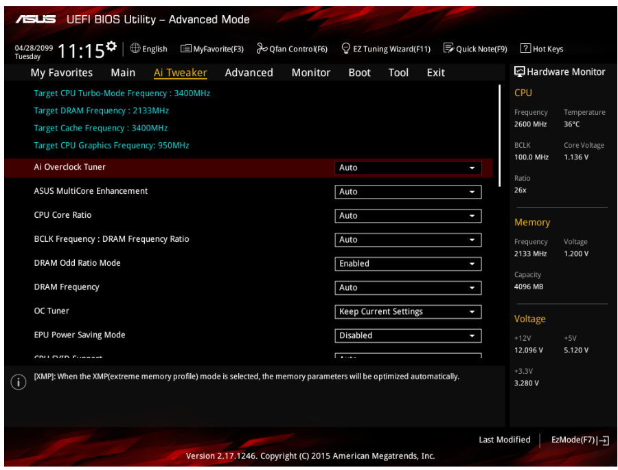

### 2.5.1 Ai Overclock Tuner [Auto]
This item allows you to select the CPU overclocking options to achieve the desired CPU internal frequency.Select any of these preset overclocking configuration options: [Auto] Loads the optimal settings for the system automatically.[Manual] Allows you to assign the BCLK (base clock) frequency manually.The following items appear only when you set the Ai Overclocking Tuner to [Manual].
BCLK Frequency [100.00]: This item allows you to set the BCLK (base clock) frequency to enhance the system performance.Use the \<+\> or \<-\> to adjust the value.The values range from 40.0 MHz to 500.0 MHz.We recommend you to set the value based on the CPU specification, as high BCLK frequencies may damage the CPU permanently.
BCLK Amplitude [Auto]: This item allows you to set the magnitude of the base clock driven for the processor.High values may improve overclocking stability.Configuration options: [Auto] [700mV] [800mV] [900mV] [1000mV]
BCLK Frequency Slew Rate [Auto]: This item allows you to set the frequency update rate.Lower values speed up clock changes.Configuration options: [Auto] [40us/MHz] [80us/MHz] [128us/MHz] [512us/MHz]

### 2.5.2 MultiCore Enhancement [Auto]
[Auto] This item allows you to maximize the overclocking performance optimized by core ratio settings.[Disabled] This item allows you to set to default core ratio settings.

### 2.5.3 CPU Core Ratio [Auto]
This item allows you to set the CPU core ratio limit per core or synchronize automatically to all cores.Configuration options: [Auto] [Sync All Cores] [Per Core]When the CPU Core Ratio is set to [Sync All Cores] or [Per Core], the following items appear.
1-Core Ratio Limit [Auto]: Select [Auto] to apply the CPU default Turbo Ratio setting or manually assign a 1-Core Limit value that must be higher than or equal to the 2-Core Ratio Limit.
2-Core Ratio Limit [Auto]: Select [Auto] to apply the CPU default Turbo Ratio setting or manually assign a 2-Core Limit value that must be higher than or equal to the 3-Core Ratio Limit. If you assign a value for 2-Core Ratio Limit, do not set the 1-Core Ratio Limit to [Auto].
3-Core Ratio Limit [Auto]: Select [Auto] to apply the CPU default Turbo Ratio setting or manually assign a 3-Core Limit value that must be higher than or equal to the 4-Core Ratio Limit.If you assign a value for 3-Core Ratio Limit, do not set the 1-Core Ratio Limit and 2-Core Ratio Limit to [Auto].
4-Core Ratio Limit [Auto]: Select [Auto] to apply the CPU default Turbo Ratio setting or manually assign a 4-Core Limit value that must be higher than or equal to the 3-Core Ratio Limit.If you assign a value for 4-Core Ratio Limit, do not set the 1-Core Ratio Limit, 2-Core Ratio Limit, and 3-Core Ratio to [Auto].

### 2.5.4 BCLK Frequency: DRAM Frequency Ratio [Auto]
Allows you to set the CPU bus speed to DRAM speed ratio mode.
[Auto] DRAM speed is set to the optimized settings.[100:133] The BCLK frequency to DRAM speed ratio is set to 100:133.[100:100] The BCLK frequency to DRAM speed ratio is set to 100:100.

### 2.5.5 DRAM Odd Ratio Mode [Enabled]
Enable the odd ratio mode for better granularity.Configuration options: [Disabled] [Enabled]

### 2.5.6 DRAM Frequency [Auto]
This item allows you to set the memory operating frequency.The configurable options vary with the BCLK (base clock) frequency setting.Select the auto mode to apply the optimized setting.Configuration options: [DDR4-800MHz] [DDR4-933MHz] [DDR4-1066MHz] [DDR4- 1200MHz] [DDR4-1333MHz] [DDR4-1400MHz] \~ [DDR4-4133MHz] [DDR4-4266MHz]Selecting a very high memory frequency may cause the system to become unstable\!If this happens, revert to the default setting.

### 2.5.7 OC Tuner [Keep Current Settings]
This item allows you to automatically overclock the CPU and DRAM frequencies and voltage for an enhanced system performance.It also accelerates the CPU graphics performance to the extreme depending on the CPU graphics loading.Configuration options: [Keep Current Settings] [Ratio Tuning] [BCLK + Ratio Tuning]Ensure that you installed an efficient CPU fan for CPU and graphics loading before selecting either [BCLK + Ratio Tuning] or [Ratio Tuning].To keep the current overclocking tuner status, select [Keep Current Settings].

### 2.5.8 EPU Power Saving Mode [Disabled]
EPU (Energy Processing Unit) sets the CPU in its minimum power consumption settings.Enable this item to set lower CPU VCCIN and Vcore voltages and achieve the best energy saving condition.Configuration options: [Disabled] [Enabled]

### 2.5.9 CPU SVID Support [Auto]
Disable this item to stop the processor from communicating with the external voltage regulator.Configuration options: [Auto] [Disabled] [Enabled]

### 2.5.10 DRAM Timing Control
The subitems in this menu allow you to set the DRAM timing control features.Use the \<+\> and \<-\> keys to adjust the value.To restore the default setting, type [auto] using the keyboard and press the \<Enter\> key.Changing the values in this menu may cause the system to become unstable\!If this happens, revert to the default settings.

### 2.5.11 DIGI+ VRM
CPU Load-Line Calibration [Auto]: Load-line is defined by Intel VRM specification and affects the CPU power voltage.The CPU working voltage will decrease proportionally depending on the CPU loading.Higher levels of the load-line calibration can get a higher voltage and a better overclocking performance but increases the CPU and VRM thermal.Select from level 1 to 7 to adjust the CPU power voltage from 0% to 100%.Configuration options: [Auto] [Level 1] [Level 2] [Level 3] [Level 4] [Level 5] [Level 6] [Level 7]The boosted performance may vary depending on the CPU specification.Do not remove the thermal module.
### 2.5.11.1 CPU Current Capability [Auto]
CPU Current Capability [Auto]: Allows you to configure the total power range, and extends the overclocking frequency range simultaneously.Configuration options: [Auto] [100%] [110%] [120%] [130%] [140%] Choose a higher value when overclocking, or under a high CPU loading for extra power support.
### 2.5.11.2 CPU VRM Switching Frequency [Auto]
CPU VRM Switching Frequency [Auto]: This item affects the VRM transient response speed and the component thermal production.Select [Manual] to configure a higher frequency for a quicker transient response speed.Configuration options: [Auto] [Manual] DO NOT remove the thermal module.The thermal conditions should be monitored.The following item appears only when you set the CPU VRM Switching Frequency to [Manual].
Fixed CPU VRM Switching Frequency (KHz) [300]: This item allows you to set a higher frequency for a quicker transient response speed.Use the \<+\> and \<-\> keys to adjust the value.The values range from 250KHz to 500KHz with a 50KHz interval.
### 2.5.11.3 CPU Power Duty Control [T.Probe]
CPU Power Duty Control [T.Probe]: DIGI + VRM Duty control adjusts the current and thermal conditions of every component’s phase.[T. Probe] Select to maintain the VRM thermal balance.[Extreme] Select to maintain the current VRM balance.
CPU Power Phase Control [Auto]: This item allows you to set the power phase control of the CPU.Configuration options: [Auto] [Standard] [Optimized] [Extreme]
### 2.5.11.4 CPU Graphics Load-Line Calibration [Auto]
CPU Graphics Load-Line Calibration [Auto]: Load-line is defined by Intel VRM specification and affects the GT power voltage.The GT working voltage will decrease proportionally depending on the GT loading.Higher levels of the load-line calibration can get a higher voltage and a better overclocking performance but increases the GT and VRM thermal.Select from level 1 to 7 to adjust the GT power voltage from 0% to 100%.Configuration options: [Auto] [Level 1] [Level 2] [Level 3] [Level 4] [Level 5] [Level 6] [Level 7]The boosted performance may vary depending on the GT specification.Do not remove the thermal module.
### 2.5.11.5 CPU Graphics Current Capability [Auto]
CPU Graphics Current Capability [Auto]: Allows you to configure the total power range, and extends the overclocking frequency range simultaneously.Configuration options: [Auto] [100%] [110%] [120%] [130%] [140%] Choose a higher value when overclocking, or under a high GT loading for extra power support.
### 2.5.11.6 CPU Graphics Switching Frequency [Auto]
CPU Graphics Switching Frequency [Auto]: This item affects the GT transient response speed and the component thermal production.Select [Manual] to configure a higher frequency for a quicker transient response speed.Configuration options: [Auto] [Manual]DO NOT remove the thermal module.The thermal conditions should be monitored.The following item appears only when you set the GT VRM Switching Frequency to [Manual].
Fixed VCCGT Switching Frequency (KHz) [300]: This item allows you to set a higher frequency for a quicker transient response speed.Use the \<+\> and \<-\> keys to adjust the value.The values range from 250KHz to 500KHz with a 50KHz interval.
### 2.5.11.7 GT Power Phase Control [Auto]
GT Power Phase Control [Auto]: This item allows you to set the power phase control of GT.Configuration options: [Auto] [Standard] [Optimized] [Extreme]

### 2.5.12 Internal CPU Power Management
The subitems in this menu allow you to set the CPU ratio and their features.
Intel SpeedStep [Enabled]: This item allows the operating system to dynamically adjust the processor voltage and cores frequency, resulting to a decreased average power consumption and decreased average heat production.Configuration options: [Disabled] [Enabled]
### 2.5.12.1 Turbo Mode [Enabled]
Turbo Mode [Enabled]: This item allows you to enable your core processor’s speed to run faster than the base operating frequency when it is below operating power, current and temperature specification limit.Configuration options: [Disabled] [Enabled]The following items appear only when you set the Turbo Mode to [Enabled].
Turbo Mode Parameters:
### 2.5.12.2 Turbo Mode Parameters
Long Duration Package Power Limit [Auto]: Allows you to limit the Turbo Ratio’s time duration that exceeds the TDP (Thermal Design Power) for maximum performance.Use the \<+\> or \<-\> keys to adjust the value.The values range from 1 W to 4095 W.
Package Power Time Window [Auto]: Also known as Power Limit 1, this item allows you to maintain the time window for Turbo Ratio over TDP (Thermal Design Power).Use the \<+\> or \<-\> keys to adjust the value.The values range from 1 to 127 in seconds.
Short Duration Package Power Limit [Auto]: Also known as Power Limit 2, this item allows you to provide rapid protection when the package power exceeds the Power Limit 1. Use the \<+\> or \<-\> keys to adjust the value.The values range from 1 W to 4095 W.
IA AC Load Line [Auto]: This item allows you to set the AC loadline defined in 1/100 mOhms.Use the \<+\> and \<-\> keys to adjust the value.Configuration options: [Auto] [0.01] - [62.49]
IA DC Load Line [Auto]: This item allows you to set the DC loadline defined in 1/100 mOhms.Use the \<+\> and \<-\> keys to adjust the value.Configuration options: [Auto] [0.01] - [62.49]

### 2.5.13 CPU Core/Cache Current Limit Max. [Auto]
Allows you to set a higher current limit to prevent a frequency or power throttling when overclocking.Use the \<+\> or \<-\> keys to adjust the value.The values range from 0.00A to 255.50A with a 0.25A interval.

### 2.5.14 CPU Graphics Current Limit Max. [Auto]
Allows you to set a higher current limit to prevent a frequency or power throttling when overclocking.Use the \<+\> or \<-\> keys to adjust the value.The values range from 0.00A to 255.50A with a 0.25A interval.

### 2.5.15 Min. CPU Cache Ratio [Auto]
Allows you to set the minimum possible CPU cache ratio.Use the \<+\> or \<-\> keys to adjust the value.The values range from 8 to 83 with a 1 interval.

### 2.5.16 Max. CPU Cache Ratio [Auto]
Allows you to set the maximum possible CPU cache ratio.Use the \<+\> or \<-\> keys to adjust the value.The values range from 8 to 83 with a 1 interval.

### 2.5.17 Max. CPU Graphics Ratio [Auto]
Allows you to set the maximum possible CPU graphics ratio.Use the \<+\> or \<-\> keys to adjust the value.The values range from 1 to 60 with a 1 interval.

### 2.5.18 Extreme Over-voltage [Disabled]
This item allows you to set higher voltages for overclocking.When you enable this item, you can choose a high level voltage to overclock, but does not guarantee the CPU life.Configuration options: [Disabled] [Enabled]

### 2.5.19 CPU Core/Cache Voltage [Auto]
This item allows you to configure the amount of voltage fed to the CPU cores.Increase the voltage when setting a high Core Frequency value.Configuration options: [Auto] [Manual Mode] [Offset Mode] [Adaptive Mode]
• The following item appears only when you set the CPU Core Voltage to [Manual Mode].
• [Adaptive Mode] is available for some specific CPU types.
### 2.5.19.1 CPU Core Voltage Override [Auto]
CPU Core Voltage Override [Auto]: Allows you to set the input voltage for the CPU by the external voltage regulator.Use the \<+\> or \<-\> keys to adjust the value.The values range from 0.600V to 1.700V with a 0.005V interval.The following items appear only when you set the CPU Core Voltage to [Offset Mode].
### 2.5.19.2 Offset Mode Sign
Offset Mode Sign: [+] To offset the voltage by a positive value.[-] To offset the voltage by a negative value.
CPU Core Voltage Offset [Auto]: Use the \<+\> or \<-\> keys to adjust the value.The values range from -0.635V to +0.635V with a 0.005V interval.The following item appears only when you set the CPU Core Voltage to [Adaptive Mode].
### 2.5.19.3 Additional Turbo Mode CPU Core Voltage [Auto]
Additional Turbo Mode CPU Core Voltage [Auto]: This item allows you to set the amount of voltage fed to the CPU cores when running in turbo mode.Increase the voltage when configuring a high CPU core frequency.The voltage you set is affected by the offset value.Use the \<+\> or \<-\> range from 0.25V to 1.920V with a 0.001V interval.
Offset Voltage [Auto]: Use the \<+\> or \<-\> keys to adjust the value.The values range from 0.001V to 0.999V with a 0.001V interval.
Total Adaptive Mode CPU Core Voltage [By CPU]: This item sums up the voltages of the CPU Core Voltage offset and Additional Turbo Mode CPU Core Voltage options.

### 2.5.20 DRAM Voltage [Auto]
This item allows you to set the voltage for the DRAM.Use the \<+\> and \<-\> keys to adjust the value.The values range from 1.000V to 1.800V with a 0.005 interval.

### 2.5.21 CPU VCCIO Voltage [Auto]
This item allows you to set the voltage for the CPU VCCIO.Use the \<+\> and \<-\> keys to adjust the value.The values range from 0.700V to 1.585V with a 0.005V interval.

### 2.5.22 CPU System Agent Voltage [Auto]
This item allows you to set the voltage for the CPU System Agent.Use the \<+\> and \<-\> keys to adjust the value.The values range from 0.700V to 1.685V with a 0.005V interval.

### 2.5.23 CPU Graphics Voltage Mode [Auto]
This item allows you to configure the mode of voltage fed to the CPU Graphics Voltage.Manual mode allows user-defined values.Offset mode modifies values by SVID.Configuration options: [Auto] [Manual Mode] [Offset Mode]The following item appears only when you set the CPU Graphics Voltage Mode to [Manual Mode].
CPU Graphics Voltage Override [Auto]: This item allows you to configure the CPU Graphics Voltage Override.Use the \<+\> or \<-\> keys to adjust the value.The values range from 0.600% to 1.700V with a 0.005V interval.The following item appears only when you set the CPU Core Voltage Mode to [Offset Mode].
Offset Mode Sign [+]: [+] To offset the voltage by a positive value.[-] To offset the voltage by a negative value.
CPU Graphics Voltage Offset [Auto]: This item allows you to configure the CPU Graphics Voltage Offset.Use the \<+\> or \<-\> keys to adjust the value.The values range from 0.001V to 0.635V with a 0.005V interval.

### 2.5.24 PCH Core Voltage [Auto]
This item allows you to set the PCH core voltage.Use the \<+\> and \<-\> keys to adjust the value.The values range from 0.800V to 1.635V with a 0.005V interval.

### 2.5.25 CPU Standby Voltage [Auto]
This item allows you to set the voltage for the CPU Standby.Use the \<+\> and \<-\> keys to adjust the value.The values range from 0.800V to 1.635V with a 0.005V interval.

### 2.5.26 DRAM REF Voltage Control [Auto]
The subitems in this menu allows you to set the DRAM reference voltage on the control lines from the memory bus.You can use the \<+\> or \<-\> keys to adjust the value.The values range from 0.39500V to 0.63000V with a 0.00500V interval.

## 2.6 Advanced menu

### 2.6.0 Advanced menu overview and caution

The Advanced menu items allow you to change the settings for the CPU and other system devices.Be cautious when changing the settings of the Advanced menu items.Incorrect field values can cause the system to malfunction.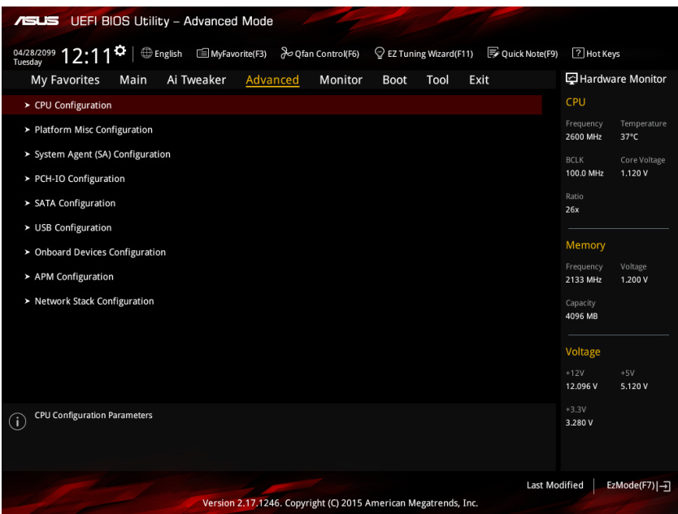

### 2.6.1 CPU Configuration
The items in this menu show the CPU-related information that the BIOS automatically detects.The items shown in submenu may be different due to the CPU you installed.
Active Processor Cores [All]: This item allows you to select the number of CPU cores to activate in each processor package.Configuration options: [All] [1] [2] [3]
Intel Virtualization Technology [Enabled]: When set to [Enabled], a VMM can utilize the additional hardware capabilities provided by Vanderpool Technology.Configuration options: [Disabled] [Enabled]
Hardware Prefetcher [Enabled]: This item allows the CPU to prefetch commands and data in the L2 cache, reduces the DRAM loading time and improves the system performance.Configuration options: [Disabled] [Enabled]
Adjacent Cache Line Prefetch [Enabled]: This item allows the mid level cache (L2) to prefetch adjacent cache lines, reducing the DRAM loading time and improves the system performance.Configuration options: [Disabled] [Enabled]
Boot Performance Mode [Auto]: This item allows you to select the CPU performance state during system boot before the operating system takes control.The CPU runs at a selected performance ratio based on CPU configuration.Configuration options: [Max Battery] [Max Non-Turbo Performance] [Turbo Performance] [Auto]
CPU Power Management Configuration: This item allows you to manage and configure the CPU’s power.
Intel SpeedStep [Enabled]: This item allows the operating system to dynamically adjust the processor voltage and cores frequency, resulting to a decreased average power consumption and decreased average heat production.Configuration options: [Disabled] [Enabled]
### 2.5.12.1 Turbo Mode [Enabled]
Turbo Mode [Enabled]: This item allows you to enable your core processor’s speed to run faster than the base operating frequency when it is below operating power, current and temperature specification limit.Configuration options: [Disabled] [Enabled]
CPU C states [Auto]: This item allows you to set the power saving of the CPU states.Configuration options: [Auto][Disabled] [Enabled]The following items appear only when you set the CPU C-States to [Enabled].
Enhanced C-States [Enabled]: This item allows your CPU to reduce power consumption when the system is in idle mode.Configuration options: [Enabled] [Disabled]
CPU C3 Report [Enabled]: This item allows you to disable or enable the CPU C3 report to the operating system.Configuration options: [Enabled] [Disabled]
CPU C6 Report [Enabled]: This item allows you to disable or enable the CPU C6 report to the operating system.Configuration options: [Enabled] [Disabled]
Package C State limit [Auto]: This item allows you to set the a C-state support for the CPU package.Configuration options: [C0/C1] [C2] [C3] [C6] [C7] [C7s] [Auto]
CFG lock [Enabled]: This item allows you to enable or disable the CFG lock.Configuration options: [Disabled] [Enabled]

### 2.6.2 Platform Misc Configuration
The items in this menu allow you to configure the platform-related features.
PCI Express Native Power Management [Disabled]: This item allows you to enhance the power saving feature of PCI Express and perform ASPM operations in the operating system.Configuration options: [Disabled] [Enabled]The following item appears only when you set the PCI Express Native Power Management to [Enabled].
Native ASPM [Disabled]: [Enabled] Vista OS controls the ASPM (active state power management) support for devices.[Disabled] BIOS controls the ASPM support for the device.
PCH - PCI Express options:
DMI Link ASPM Control [Disabled]: This item allows you to control the Active State Power Management on both NB (NorthBridge) side and SB (SouthBridge) side of the DMI Link.Configuration options: [Disabled] [Enabled]
ASPM Support [Disabled]: This item allows you to select the ASPM state for energy-saving conditions.Configuration options: [Disabled] [L0s] [L1] [L0sL1] [Auto]
SA - PCI Express options:
DMI Link ASPM Control [Disabled]: This item allows you to control the Active State Power Management on both CPU and PCH (platform controller hub) Both DMI link ASPM control items of the CPU and PCH sides must be enabled for the ASPM to take effect.Configuration options: [Disabled] [L1]
PEG ASPM [Disabled]: This item allows you to select the ASPM state for energy-saving conditions, or use the optimized energy saving profile.Configuration options: [Disabled] [Auto] [ASPM L0s] [ASPM L1] [ASPM L0sL1]

### 2.6.3 System Agent (SA) Configuration
Above 4GB MMIO BIOS assignment [Disabled]: Allows you to enable or disable the above 4 GB memory mapped IO BIOS assignment.Configuration options: [Enabled] [Disabled]
Graphics Configuration: Allows you to select a primary display from CPU, PCIE and PCI graphical devices.
Primary Display [Auto]: Allows you to select the primary display from CPU, PCIE and PCI graphics devices.Configuration options: [Auto] [CPU Graphics] [PCIE]
iGPU Multi-Monitor [Disabled]: This item allows you to empower both integrated and discrete graphics devices for the multi-monitor output.The CPU graphics shared system memory size is fixed at 64 MB.Configuration options: [Disabled] [Enabled]
RC6(Render Standby) [Enabled]: Allows you to enable or disable Intel Graphics Render Standby support to reduce iGPU power use when the system is idle.Configuration options: [Disabled] [Enabled]
DMI/OPI Configuration: This item allows you to control various DMI (direct media interface) to run at PCI-E 2.0 speed.
DMI Max Link Speed [Gen2]: Allows you to configure the DMI speed.Configuration options: [Auto] [Gen1] [Gen2] [Gen3]
PEG Port Configuration: Allows you to configure the PEG Port settings.
PCIEx16_1/ PCIEx16_2 Link Speed [Auto]: Allows you to configure the PCIEx16 speed for slot 1 or slot 2. Configuration options: [Auto] [Gen1] [Gen2] [Gen3]
Memory Configuration: Allows you to configure the memory configuration parameters.
Memory Remap [Enabled]: Set this item to [Enabled] to support DRAM address remapping for 64-bit operating systems.Configuration options: [Enabled] [Disabled]

### 2.6.4 PCH-IO Configuration
This item allows you to configure the PCI Express configuration settings.
PCI Express Configuration PCIe Speed [Auto]: Allows you to configure the PCIe speed.Configuration options: [Auto] [Gen1] [Gen2] [Gen3]

### 2.6.5 SATA Configuration
While entering Setup, the BIOS automatically detects the presence of SATA devices.The SATA Port items show Empty if no SATA device is installed to the corresponding SATA port.
### 2.6.5.1 SATA Controller(s) [Enabled]
SATA Controller(s) [Enabled]: Enables or disables onboard the SATA device.Configuration options: [Disabled] [Enabled] The following items appear only when you set the SATA Controller(s) to [Enabled].
### 2.6.5.2 SATA Mode Selection [AHCI]
SATA Mode Selection [AHCI]: Allows you to set the SATA configuration.
[AHCI] Set to [AHCI] when you want the SATA hard disk drives to use the AHCI (Advanced Host Controller Interface).The AHCI allows the onboard storage driver to enable advanced Serial ATA features that increases storage performance on random workloads by allowing the drive to internally optimize the order of commands.
[RAID] Set to [RAID Mode] when you want to create a RAID configuration from the SATA hard disk drives.The following items appear only when you set the SATA Mode Selection to [RAID].
### 2.6.5.3 RAID and RST storage remapping options
CR#1/2/3 RST Pcie Storage Remapping [Disabled]: This item allows you to enable or disable the RST Pcie Storage Remapping feature.Configuration options: [Auto] [Disabled] [Enabled]
Alternate ID [Disabled]: This item allows you to enable or disable the report for the alternate device ID.Configuration options: [Auto] [Disabled] [Enabled]
### 2.6.5.4 Software Feature Mask Configuration
Software Feature Mask Configuration: Allows you to configure the SWFM (Software Feature Mask) settings.
RAID 0 / RAID 1 / RAID 10 / RAID 5 [Enabled]: Allows you to enable or disable the RAID 0 /RAID 1/ RAID 10/ RAID 5 feature.Configuration options: [Disabled] [Enabled]
Intel Rapid Recovery Technology [Enabled]: Allows you to enable or disable the Intel Rapid Recovery Technology.Configuration options: [Disabled] [Enabled]
OROM UI and Banner [Enabled]: When enabled, the OROM UI is shown.Configuration options: [Disabled] [Enabled]
HDD Unlock [Enabled]: When enabled, the HDD password unlock feature is activated.Configuration options: [Disabled] [Enabled]
Smart Response Technology [Enabled]: Allows you to enable or disable the Smart Response technology.Configuration options: [Disabled] [Enabled]
OROM UI Normal Delay [2 sec]: Allows you to select the delay time of the OROM UI Splash screen in a normal status.Configuration options: [2 sec] [4 sec] [6 sec] [8 sec]
### 2.6.5.5 Aggressive LPM Support [Disabled]
Aggressive LPM Support [Disabled]: This item is designed for LPM (link power management) support with a better energy saving conditions.When disabled, the hot plug function of SATA ports are disabled.Configuration options: [Disabled] [Enabled]
SMART Self Test [On]: S.M.A.R.T. (Self-Monitoring, Analysis and Reporting Technology)is a monitoring system that shows a warning message during POST (Power-on Self Test) when an error occurs in the hard disks.Configuration options: [On] [Off]
SATA6G_1\~6(Gray) [Enabled]: Allow you to enable/disable the SATA6G_1\~6 port.Configuration options: [Disabled] [Enabled]
Hot Plug [Disabled]: These items allow you to enable/disable SATA Hot Plug Support.Configuration options: [Disabled] [Enabled]
External SATA [Disabled]: Allow you to enable/disable the external SATA support.Configuration options: [Disabled] [Enabled]
Spin Up Device [Disabled]: Allow you to enable/disable the spin up device feature.Configuration options: [Disabled] [Enabled]
SATA Device Type [Hard Disk Drive]: Allow you to identify the installed SATA device type.Configuration options: [Hard Disk Drive] [Solid State Drive]
Typology [Unknown]: This item allows you to identify the SATA topology.Configuration options: [Unknown] [M2] [Direct Connect] [ISATA] [Flex]
Device Sleep [Disabled]: This item allows you to enable or disable device sleep.Configuration options: [Disabled] [Enabled]
SATA DEVSLEP Idle Timeout Config [Disabled]: This item allows you to enable or disable SATA DTIO Configuration.Configuration options: [Disabled] [Enabled]

### 2.6.6 USB Configuration
The items in this menu allow you to change the USB-related features.The USB Devices item shows the auto-detected values.If no USB device is detected, the item shows None.
Legacy USB Support [Enabled]: [Enabled] Your system supports the USB devices in legacy operating systems.[Disabled] Your USB devices can be used for BIOS setup only and cannot be recognized in the boot devices list.[Auto] Your system automatically detects the presence of USB devices at startup.If any USB devices are detected, the legacy USB support is enabled.
XHCI Hand-off [Disabled]: [Enabled] Enables the support for operating systems without an XHCI hand-off feature.[Disabled] Disables the XHCI Hand-off support.
USB Port Disable Override: The subitems in this menu allow you to set the USB Port Disable Override features.USB3_1/2/3/4/5/6, USB7/8/9/10/11/12/13/14 [Enabled]: Allows you to enable or disable the USB ports individually.Configuration options: [Disabled] [Enabled]Refer to section 1.2.3 Motherboard layout for the location of the USB ports.

### 2.6.7 Onboard Devices Configuration
Model Name LED Lighting [Breathing Mode]: Allows you to set the behavior of the model name LED.Configuration options: [Disabled] [Still Mode] [Breathing Mode]
### 2.6.7.1 HD Audio Controller [Enabled]
HD Audio Controller [Enabled]: [Enabled] Enables the HD Audio Device.[Disabled] Disables the HD Audio Device.The following two items appear only when you set the HD Audio Controller item to [Enabled].
Front Panel Type [HD Audio]: Allows you to set the front panel audio connector (AAFP) mode to legacy AC’97 or high-definition audio depending on the audio standard that the front panel audio module supports.[HD] Sets the front panel audio connector (AAFP) mode to high definition audio.[AC97] Sets the front panel audio connector (AAFP) mode to legacy AC’97.
Depop [Enabled]: Configuration options: [Enabled] [Disabled]
### 2.6.7.2 SupremeFX LED Lighting [Breathing Mode]
SupremeFX LED Lighting [Breathing Mode]: Allows you to set the behavior of the model name LED.Configuration options: [Disabled] [Still Mode] [Breathing Mode] [Flowing Mode]
### 2.6.7.3 M.2 and SATA Express SATA Mode Configuration [SATA Express]
M.2 and SATA Express SATA Mode Configuration [SATA Express]: M.2 shares SATA mode with SATA Express.Changes this item before installing M.2 SATA devices.[SATA Express] SATA mode will be switched to SATA Express.M.2 can only support PCIe devices.[M.2] SATA mode will be switched to M.2.SATA Express can only support PCIe devices.
### 2.6.7.4 Asmedia USB 3.1 Controller [Enabled]
Asmedia USB 3.1 Controller [Enabled]: [Enabled] Enables the onboard USB 3.0 controller.[Disabled] Disables the controller.
Asmedia USB 3.1 Battery Charging Support [Disabled]: This item appears only when the Asmedia USB 3.0 Controller item is set to [Enabled].[Enabled] Enables the Asmedia USB 3.0 battery charging function.[Disabled] Disables this function.
### 2.6.7.5 Intel LAN Controller [Enabled]
Intel LAN Controller [Enabled]: [Enabled] Enables the Intel LAN controller.[Disabled] Disables the controller.
Intel PXE Option ROM [Off]: This item appears only when you set the previous item to [On] and allows you to enable or disable the PXE OptionRom of the Intel LAN controller.Configuration options: [On] [Off]
### 2.6.7.6 Serial Port Configuration
Serial Port Configuration: The sub-items in this menu allow you to set the serial port configuration.
Serial Port [On]: Allows you to enable or disable the serial port (COM).Configuration options: [On] [Off]
Change Settings [IO=3F8h;IRQ=4]: This item appears only when you set the Serial Port to [On] and allows you to select the Serial Port base address.Configuration options: [IO=3F8h; IRQ=4] [IO=2F8h; IRQ=3] [IO=3E8h; IRQ=4] [IO=2E8h;IRQ=3]

### 2.6.8 APM Configuration
ErP Ready [Disabled]: Allows BIOS to switch off some power at S5 to get the system ready for ErP requirement.When set to [Enabled], all other PME options will be switched off.Configuration options: [Enabled] [Disabled]
Deep S4 [Disabled]: When enabled, the system in S4 state will further reduce power usage and will power off the USB and PS/2 devices.The system in deep S4 state can be woken up via the power button, devices in LAN, or other ways except via the USB and PS/2 devices.Configuration options: [Disabled] [Enabled]
Restore AC Power Loss [Power Off]: [Power On] The system goes into on state after an AC power loss.[Power Off] The system goes into off state after an AC power loss.[Last State] The system goes into either off or on state, whatever the system state was before the AC power loss.
Power On By PS/2 Keyboard [Disabled]: [Disabled] Disables the Power On by a PS/2 keyboard.[Space Bar] Sets the Space Bar on the PS/2 keyboard to turn on the system.[Ctrl-Esc] Sets the Ctrl+Esc key on the PS/2 keyboard to turn on the system.[Power Key] Sets Power key on the PS/2 keyboard to turn on the system.This feature requires an ATX power supply that provides at least 1A on the +5VSB lead.
Power On By PCI-E/PCI [Disabled]: This item allows you to enable or disable the Wake-on-LAN function of the onboard LAN controller or other installed PCIe/PCI LAN cards.Configuration options: [Disabled] [Enabled]
Power On By Ring [Disabled]: [Disabled] Disables Ring to generate a wake event.[Enabled] Enables Ring to generate a wake event.
Power On By RTC [Disabled]: This item allows you to enable or disable the RTC (Real-Time Clock) to generate a wake event and configure the RTC alarm date.When enabled, you can set the days, hours, minutes, or seconds to schedule an RTC alarm date.Configuration options: [Disabled] [Enabled]

### 2.6.9 Network Stack Configuration
Network Stack [Disabled]: This item allows user to disable or enable the UEFI network stack.Configuration options: [Disabled] [Enabled]The following two items appear only when you set the previous item to [Enabled].
Ipv4 / Ipv6 PXE Support [Enabled]: This item allows you to enable or disable the Ipv4/Ipv6 PXE wake event.Configuration options: [Disabled] [Enabled]

## 2.7 Monitor menu

### 2.7.0 Monitor menu overview

The Monitor menu displays the system temperature/power status, and allows you to change the fan settings.Scroll down to display the other BIOS items. 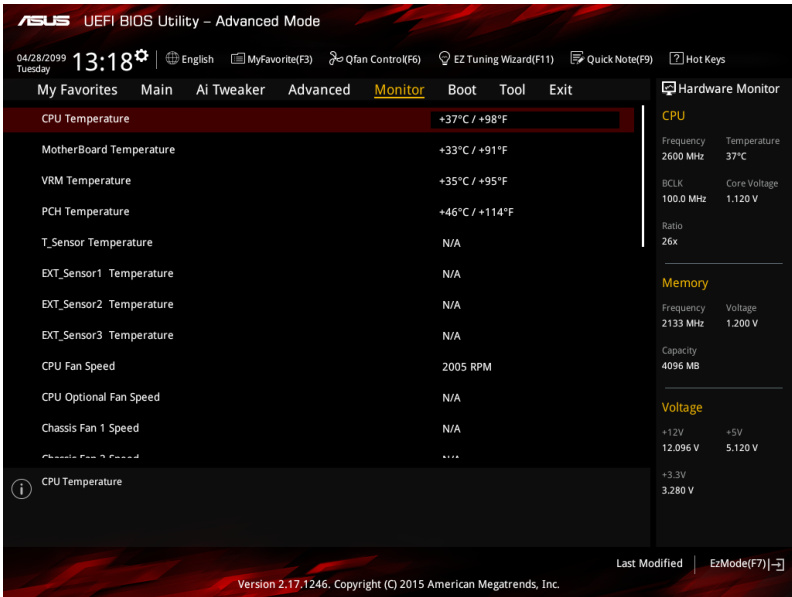

### 2.7.1 CPU Temperature, MotherBoard Temperature, VRM Temperature, PCH Temperature, T_Sensor Temperature, EXT_Sensor 1/2/3 Temperature [xx°C/ xx°F] or [Ignore]
The onboard hardware monitor automatically detects and displays the CPU and motherboard temperatures.Select [Ignore] if you do not wish to display the detected temperatures.

### 2.7.2 CPU Fan Speed, CPU Optional Fan Speed, Chassis Fan 1/2/3 Speed, Extension Fan 1/2/3 Speed [xxxx RPM] or [Ignore] / [Monitor]
The onboard hardware monitor automatically detects and displays the CPU, chassis and extension fan speeds in rotations per minute (RPM).If the fan is not connected to the motherboard, the field shows N/A.Select [Ignore] if you do not wish to display the detected speed.

### 2.7.3 CPU Core Voltage, CPU Graphics Voltage, 3.3V Voltage, 5V Voltage, 12V Voltage, PCH Core Voltage, CPU System Agent Voltage, CPU VCCIO Voltage, DRAM Voltage, CPU Standby Voltage
The onboard hardware monitor automatically detects the voltage output through the onboard voltage regulators.Select [Ignore] if you do not want to detect this item.

### 2.7.4 Q-Fan Configuration
The subitems in this menu allows you to configure the Q-Fan features.
Qfan Tuning: Click this item to automatically detect the lowest speed and configure the minimum duty cycle for each fan.
### 2.7.4.1 CPU Q-Fan Control [PWM Mode]
CPU Q-Fan Control [PWM Mode]: [Auto] Enables the CPU Q-Fan control for 4-pin CPU fan.[Disabled] Disables the CPU Q-Fan control feature.[PWM Mode] Enable the CPU Q-Fan control in PWM mode for 4-pin CPU fan.[DC Mode] Enable the CPU Q-Fan control in DC mode for 3-pin CPU fan.
CPU Fan Speed Lower Limit [300 RPM]: This item appears only when you enable the CPU Q-Fan Control feature and allows you to disable or set the CPU fan warning speed.Configuration options: [Ignore] [200RPM] [300 RPM] [400 RPM] [500 RPM] [600RPM]
### 2.7.4.2 CPU Fan Profile [Standard]
CPU Fan Profile [Standard]: This item appears only when you enable the CPU Q-Fan Control feature and allows you to set the appropriate performance level of the CPU fan.[Standard] Sets to [Standard] to make the CPU fan automatically adjust depending on the CPU temperature.[Silent] Sets to [Silent] to minimize the fan speed for quiet CPU fan operation.[Turbo] Sets to [Turbo] to achieve maximum CPU fan speed.[Manual] Sets to [Manual] to assign detailed fan speed control parameters.The following items appear only when you set CPU Fan Profile to [Manual].
CPU Upper Temperature [70]: Use the \<+\> and \<-\> keys to adjust the upper limit of the CPU temperature.The values range from 25°C to 75°C.
CPU Fan Max.Duty Cycle (%) [100]: Use the \<+\> and \<-\> keys to adjust the maximum CPU fan duty cycle.The values range from 20% to 100%.When the CPU temperature reaches the upper limit, the CPU fan will operate at the maximum duty cycle.
CPU Middle Temperature [25]: Use the \<+\> or \<-\> keys to set the value for CPU Middle Temperature.The range of the values depends on the CPU installed.
CPU Fan Middle Duty Cycle (%) [20]: Use the \<+\> or \<-\> keys to adjust the CPU fan middle duty cycle.The values range from 20% to 100%.When the CPU temperature reaches the upper limit, the CPU fan operates at the maximum duty cycle.
CPU Lower Temperature [20]: Use the \<+\> or \<-\> keys to adjust the CPU fan’s lower temperature.The values range from 0°C to 75°C.
CPU Fan Min.Duty Cycle(%) [20]: Use the \<+\> and \<-\> keys to adjust the minimum CPU fan duty cycle.The values range from 20% to 100%.When the CPU temperature is under the lower limit, the CPU fan will operate at the minimum duty cycle.

### 2.7.5 Chassis Fan 1/2/3 Q-Fan Control [DC Mode]
[PWM mode] Enables the chassis Q-Fan control in PWM mode for 4-pin chassis fan.[DC mode] Enables the chassis Q-Fan control in DC mode for 3-pin chassis fan.[Disabled] Disables the chassis Q-Fan control feature.The following items appear only when you set the Chassis Fan 1/2/3 Q-Fan Control to [PWM Mode] or [DC Mode].
### 2.7.5.1 Chassis Fan 1/2/3 Q-Fan Source [CPU]
Chassis Fan 1/2/3 Q-Fan Source [CPU]: This item controls the assigned fan according to the selected temperature source.Configuration options: [CPU] [MotherBoard] [VRM] [PCH] [T_Sensor] [EXT Sensor 1] [EXT_ Sensor2] [EXT Sensor 3]
Chassis Fan 1/2/3 Speed Low Limit [300 RPM]: This item allows you to disable or set the chassis fan warning speed.Configuration options: [Ignore] [200RPM] [300 RPM] [400 RPM] [500 RPM] [600 RPM]
### 2.7.5.2 Chassis Fan 1/2/3 Profile [Standard]
Chassis Fan 1/2/3 Profile [Standard]: This item allows you to set the appropriate performance level of the chassis fan.[Standard] Sets to [Standard] to make the chassis fan automatically adjust depending on the chassis temperature.[Silent] Sets to [Silent] to minimize the fan speed for quiet chassis fan operation.[Turbo] Sets to [Turbo] to achieve maximum chassis fan speed.[Manual] Sets to [Manual] to assign detailed fan speed control parameters.The following items appear only when you set Chassis Fan 1/2/3 Profile to [Manual].
Chassis Fan 1/2/3 Upper Temperature [70]: Use the \<+\> or \<-\> keys to adjust the upper limit of the chassis fan temperature.The values range from 45°C to 75°C.
Chassis Fan 1/2/3 Max.Duty Cycle (%) [100]: Use the \<+\> or \<-\> keys to adjust the maximum chassis fan duty cycle.The values range from 60% to 100%.When the chassis temperature reaches the upper limit, the chassis fan will operate at the maximum duty cycle.
Chassis Fan 1/2/3 Middle Temperature [45]: Use the \<+\> or \<-\> keys to set the value for Chassis Fan Middle Temperature.
Chassis Fan 1/2/3 Middle Duty Cycle (%) [60]: Use the \<+\> or \<-\> keys to adjust the chassis fan middle duty cycle.The values range from 60% to 100%.
Chassis Fan 1/2/3 Lower Temperature [40]: Use the \<+\> or \<-\> keys to adjust the chassis fans’ lower temperature.The values range from 0°C to 75°C.
Chassis Fan 1/2/3 Min.Duty Cycle (%) [60]: Use the \<+\> or \<-\> keys to adjust the minimum chassis fan duty cycle.The values range from 0% to 100%.When the CPU temperature is under the lower limit, the chassis fan operates at the minimum duty cycle.

### 2.7.6 Extension Fan 1/2/3 Q-Fan Control [DC Mode]
[PWM mode] Enables the extension Q-Fan control in PWM mode for 4-pin chassis fan.[DC mode] Enables the extension Q-Fan control in DC mode for 3-pin chassis fan.[Disabled] Disables the extension Q-Fan control feature.The following items appear only when you set the Extension Fan 1/2/3 Q-Fan Control to [PWM Mode] or [DC Mode].
### 2.7.6.1 Extension Fan 1/2/3 Q-Fan Source [CPU]
Extension Fan 1/2/3 Q-Fan Source [CPU]: This item controls the assigned fan according to the selected temperature source.Configuration options: [CPU] [MotherBoard] [VRM] [PCH] [T_Sensor] [EXT Sensor 1] [EXT_ Sensor2] [EXT Sensor 3]
Extension Fan 1/2/3 Speed Low Limit [300 RPM]: This item allows you to disable or set the extension fan warning speed.Configuration options: [Ignore] [200RPM] [300 RPM] [400 RPM] [500 RPM] [600 RPM]
### 2.7.6.2 Extension Fan 1/2/3 Profile [Standard]
Extension Fan 1/2/3 Profile [Standard]: This item allows you to set the appropriate performance level of the extension fan.[Standard] Sets to [Standard] to make the extension fan automatically adjust depending on the chassis temperature.[Silent] Sets to [Silent] to minimize the fan speed for quiet extension fan operation.[Turbo] Sets to [Turbo] to achieve maximum extension fan speed.[Manual] Sets to [Manual] to assign detailed fan speed control parameters.The following items appear only when you set Extension Fan 1/2/3 Profile to [Manual].
Extension Fan 1/2/3 Upper Temperature [70]: Use the \<+\> or \<-\> keys to adjust the upper limit of the extension fan temperature.The values range from 20°C to 75°C.
Extension Fan 1/2/3 Max.Duty Cycle (%) [100]: Use the \<+\> or \<-\> keys to adjust the maximum extension fan duty cycle.The values range from 60% to 100%.When the chassis temperature reaches the upper limit, the extension fan will operate at the maximum duty cycle.
Extension Fan 1/2/3 Middle Temperature [45]: Use the \<+\> or \<-\> keys to set the value for Extension Fan Middle Temperature.
Extension Fan 1/2/3 Middle Duty Cycle (%) [60]: Use the \<+\> or \<-\> keys to adjust the extension fan middle duty cycle.The values range from 60% to 100%.
Extension Fan 1/2/3 Lower Temperature [40]: Use the \<+\> or \<-\> keys to adjust the extension fans’ lower temperature.The values range from 0°C to 75°C.
Extension Fan 1/2/3 Min.Duty Cycle (%) [60]: Use the \<+\> or \<-\> keys to adjust the minimum extension fan duty cycle.The values range from 60% to 100%.When the CPU temperature is under the lower limit, the extension fan operates at the minimum duty cycle.

### 2.7.7 Anti Surge Support [On]
This item allows you to enable or disable the Anti Surge function.Configuration options: [On] [Off]

## 2.8 Boot menu

### 2.8.0 Boot menu overview and caution

The Boot menu items allow you to change the system boot options.Scroll down to display the other BIOS items. 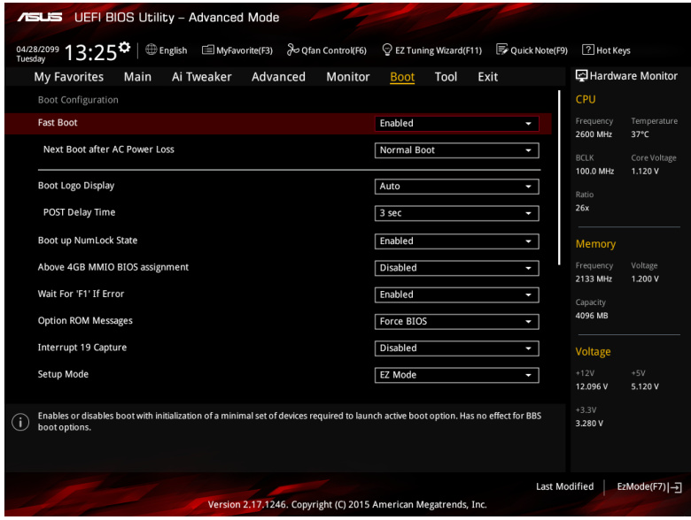

### 2.8.1 Fast Boot [Enabled]
[Enabled] Select to accelerate the boot speed.[Disabled] Select to go back to normal boot speed.The following five items appear when you set Fast Boot to [Enabled].

### 2.8.2 Next Boot after AC Power Loss [Normal Boot]
[Normal Boot] Returns to normal boot on the next boot after AC power loss.[Fast Boot] Accelerates the boot speed on the next boot after AC power loss.

### 2.8.3 Boot Logo Display [Auto]
[Auto] Adjusts logo automatically based on display requirements.[Full Screen] Maximize the boot logo size.[Disabled] Hide the logo during POST.
POST Delay Time [3 sec]: This item appears only when you set Boot Logo Display to [Auto] and [Full Screen].This item allows you to select the desired additional POST waiting time to easily enter the BIOS setup.You can only execute the POST delay time during Normal Boot.The values range from 0 to 10 seconds.This feature will only work under normal boot.
Post Report [5 sec]: This item appears only when you set Boot Logo Display to [Disabled].This item allows you to select a desired post report waiting time.Configuration options: [1 sec] \~ [10 sec] [Until Press ESC].

### 2.8.4 Boot up NumLock State [Enabled]
This item allows you to enable or disable power-on state of the NumLock.Configuration options: [Disabled] [Enabled]

### 2.8.5 Above 4GB MMIO BIOS assignment [Disabled]
This item allows you to enable or disable boot with initialization of a minimal set of devices required to launch active boot option.This item is ineffective for BBS boot options.Configuration options: [Disabled] [Enabled]

### 2.8.6 Wait for ‘F1’ If Error [Enabled]
When this item is set to [Enabled], the system waits for the F1 key to be pressed when error occurs.Configuration options: [Disabled] [Enabled]

### 2.8.7 Option ROM Messages [Force BIOS]
[Force BIOS] The third-party ROM messages will be displayed during POST.[Keep Current] Disables the ROM messages during POST.

### 2.8.8 Interrupt 19 Capture [Disabled]
This item allows you to trap Interrupt 19 by the option ROMs.Configuration options: [Disabled] [Enabled]

### 2.8.9 Setup Mode [EZ Mode]
[Advanced Mode] This item allows you to go to Advanced Mode of the BIOS after POST.[EZ Mode] This item allows you to go to EZ Mode of the BIOS after POST.

### 2.8.10 CSM (Compatibility Support Module)
Allows you to configure the CSM (Compatibility Support Module) items to fully support the various VGA, bootable devices and add-on devices for better compatibility.
Launch CSM [Enabled]: [Auto] The system automatically detects the bootable devices and the add-on devices.[Enabled] For a better compatibility, enable the CSM to fully support the non-UEFI driver add-on devices or the UEFI mode.[Disabled] Disable the CSM to fully support the Security Update and Security Boot.The following four items appear when you set Launch CSM to [Enabled].
### 2.8.10.2 Boot Device Control [UEFI and Legacy OPROM]
Boot Device Control [UEFI and Legacy OPROM]: Allows you to select the type of devices that you want to boot up.Configuration options: [UEFI and Legacy OPROM] [Legacy OPROM only] [UEFI only]
### 2.8.10.3 Boot Device Type Controls
Boot from Network Devices [Legacy only]: Allows you to select the type of network devices that you want to launch.Configuration options: [Ignore] [Legacy only] [UEFI driver first]
Boot from Storage Devices [Legacy Only]: Allows you to select the type of storage devices that you want to launch.Configuration options: [Ignore] [Legacy only] [UEFI driver first]
Boot from PCI-E Expansion Devices [Legacy Only]: Allows you to select the type of PCIe/PCI expansion devices that you want to launch.Configuration options: [Legacy only] [UEFI driver first]

### 2.8.11 Secure Boot
Allows you to configure the Secure Boot settings and manage its keys to protect the system from unauthorized access and malwares during POST.
OS Type [UEFI mode]: Allows you to select your installed operating system.[UEFI mode] This item allows you to select your installed operating system.Execute the Secure Boot check.Only select this option when booting on UEFI mode or other Secure Boot compliant OS.[Other OS] Get the optimized function when booting on non-UEFI mode.Secure Boot only supports UEFI mode.
### 2.8.11.2 Key Management
Key Management: This allows you to manage the Secure Boot keys.
### 2.8.11.2.1 Install Default Secure Boot keys
Install Default Secure Boot keys: This item allows you to immediately load the default Security Boot keys, Platform key (PK), Key-exchange Key (KEK), Signature database (db), and Revoked Signatures (dbx).When the default Secure boot keys are loaded, all the Secure Boot keys’ state will change from Unloaded mode to loaded mode.
Save Secure Boot Keys: This item allows you to save all the Secure Boot keys to a USB storage device.
### 2.8.11.2.2 PK Management
PK Management: The Platform Key (PK) locks and secures the firmware from any non-permissible changes.The system verifies the PK before your system enters the OS.
Set New Key: This item allows you to load the downloaded PK from a USB storage device.
Delete key: Allows you to delete the PK from your system.Once the PK is deleted, all the system’s Secure Boot keys will not be active.Configuration options: [Yes] [No]The PK file must be formatted as a public key certificate or UEFI variable structure with time-based authenticated variable.
### 2.8.11.2.3 KEK Management
KEK Management: The KEK (Key-exchange Key or Key Enrollment Key) manages the Signature database (db) and Revoked Signature database (dbx).Key-exchange Key (KEK) refers to Secure Boot Key-Enrollment Key (KEK).
Set New Key: Allows you to load the downloaded KEK from a USB storage device.
Append Key: Allows you to load the additional KEK from a storage device for an additional db and dbx loaded management.The KEK file must be formatted as a public key certificate or UEFI variable structure with time-based authenticated variable.
Delete key: Allows you to delete the Key from your system.Configuration options: [Yes] [No]
### 2.8.11.2.4 DB Management
DB Management: The db (Authorized Signature database) lists the signers or images of UEFI applications, operating system loaders, and UEFI drivers that you can load on the single computer.
Set New Key: Allows you to load the downloaded db from a USB storage device.
Append Key: Allows you to load the additional KEK from a storage device for an additional db and dbx loaded management.The KEK file must be formatted as a public key certificate or UEFI variable structure with time-based authenticated variable.
Delete key: Allows you to delete the Key from your system.Configuration options: [Yes] [No]
### 2.8.11.2.5 DBX Management
DBX Management: The DBX (Revoked Signature database) lists the forbidden images of db items that are no longer trusted and cannot be loaded.
Set New Key: Allows you to load the downloaded dbx from a USB storage device.
Append Key: Allows you to load the additional KEK from a storage device for an additional db and dbx loaded management.The KEK file must be formatted as a public key certificate or UEFI variable structure with time-based authenticated variable.
Delete key: Allows you to delete the Key from your system.Configuration options: [Yes] [No]

### 2.8.12 Boot Option Priorities
These items specify the boot device priority sequence from the available devices.The number of device items that appears on the screen depends on the number of devices installed in the system.
• To access OS in Safe Mode, press \<F8\> after POST (8 not supported).
• To select the boot device during system startup, press \<F8\> when Logo appears.

### 2.8.13 Boot Override
These items displays the available devices.The number of device items that appears on the screen depends on the number of devices installed in the system.Click an item to start booting from the selected device.

## 2.9 Tool menu

### 2.9.0 Tool menu overview

The Tool menu items allow you to configure options for special functions.Select an item then press \<Enter\> to display the submenu.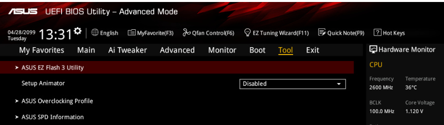

### 2.9.1 EZ Flash 3 Utility
Allows you to run EZ Flash 3. Press [Enter] to launch the EZ Flash 3 screen.For more details, see section 2.1.2 EZ Flash 3.

### 2.9.2 Setup Animator [Disabled]
Enables or disables the Setup animator.Configuration options: [Disabled] [Enabled]

### 2.9.3 Overclocking Profile
This item allows you to store or load multiple BIOS settings.The Overclocking Profile items show Not assigned if no profile is created.
Load from Profile: Allows you to load the previous BIOS settings saved in the BIOS Flash.Key in the profile number that saved your CMOS settings, press \<Enter\>, and then select Yes.
• DO NOT shut down or reset the system while updating the BIOS to prevent the system boot failure\!
• We recommend that you update the BIOS file only coming from the same memory/ CPU configuration and BIOS version.
Profile Name: Allows you to create a name for the profile you want to save.
Save to Profile: Allows you to save the current BIOS settings to the BIOS Flash, and create a profile.Key in a profile number from one to eight, press \<Enter\>, and then select Yes.
Load/Save Profile from/to USB Drive: This item allows you to load or save profile from your USB drive, load and save profile to your USB drive.

### 2.9.4 SPD Information
DIMM Slot Number [DIMM_A1]: Displays the Serial Presence Detect (SPD) information of the DIMM module installed on the selected slot.Configuration options: [DIMM_A1] [DIMM_B1] [DIMM_A2] [DIMM_B2]

## 2.10 Exit menu

### 2.10.0 Exit options and BIOS defaults

The Exit menu items allow you to load the optimal default values for the BIOS items, and save or discard your changes to the BIOS items.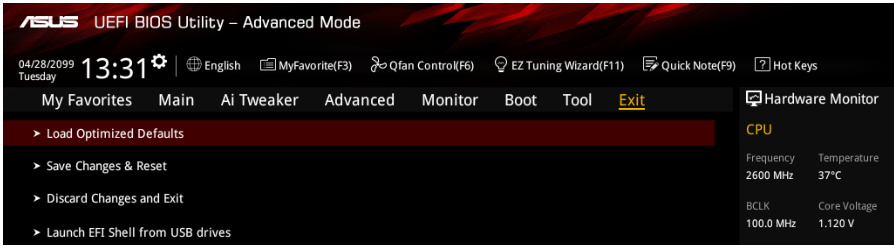
Load Optimized Defaults: This option allows you to load the default values for each of the parameters on the Setup menus.When you select this option or if you press \<F5\>, a confirmation window appears.Select OK to load the default values.
Save Changes & Reset: Once you are finished making your selections, choose this option from the Exit menu to ensure the values you selected are saved.When you select this option or if you press \<F10\>, a confirmation window appears.Select OK to save changes and exit.
Discard Changes and Exit: This option allows you to exit the Setup program without saving your changes.When you select this option or if you press \<Esc\>, a confirmation window appears.Select OK to discard changes and exit.
Launch EFI Shell from USB drives: This option allows you to attempt to launch the EFI Shell application (shellx64.efi) from one of the available USB devices.

## 2.11 Installing an operating system

### 2.11.0 Operating system installation overview

Motherboard settings and hardware options vary.The setup procedures presented in this chapter are for reference only.Refer to operating system documentation for detailed information.

### 2.11.1 OS 7 and USB 3.0 driver for 100 Series
Based on the chipset specification, the 100 series requires USB 3.0 drivers to be preloaded in order to use USB keyboard/mouse during OS 7 installation.This section is a guide on preloading USB 3.0 drivers and installing OS 7.

### Method 1: Using SATA ODD & USB devices
Load USB 3.0 drivers using the support DVD and install OS 7 using a USB device.
### Method 3.1 Requirement
Requirement:
• 1 x support DVD
• 1 x OS 7 installation source
• 1 x SATA ODD
• 1 x USB device (ODD or storage)
The USB storage device requires 8 GB or more capacity.It is recommended to format the storage device before use.

1.Insert the OS 7 installation DVD into a USB ODD, or copy all files on the OS 7 installation DVD to a USB storage device on a working system.
2.Connect the USB ODD or USB storage device to your 100 series platform.
3.Insert the support DVD into a SATA ODD on your 100 series platform.
4.Power on your system and press F8 during POST (Power-On Self Test) to enter the boot screen.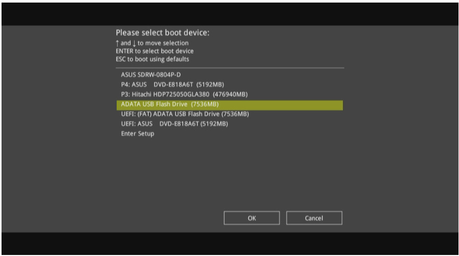
5.The USB 3.0 driver will be loaded automatically during installation startup. The “Setup is starting...” screen will show up if the USB 3.0 driver is loaded correctly.
6.Follow the onscreen instructions to complete the OS 7 installation.

### Method 2: Using a modified Windows 7 ISO
Load USB 3.0 drivers and install OS 7 using a modified OS 7 installation DVD.
### Method 3.1 Requirement
Requirement:
• 1 x support DVD
• 1 x OS 7 installation source
• 1 x Working system (PC or notebook)
• 1 x SATA ODD

1.On your working system, create an ISO image file of the OS 7 installation source using a third-party ISO software.
2.Copy both "AutoUnattend.xml" and "AutoUnattend" folder from the root directory of the supporting DVD to your system.
3.Edit the ISO file and add both "AutoUnattend.xml" and "AutoUnattend" folder into the ISO file.
4.Burn this ISO file onto an empty DVD to create a modified OS 7 installation DVD.
5.Insert the modified OS 7 installation DVD into an ODD on your 100 series platform.
6.Power on your system and press F8 during POST (Power-On Self Test) to enter the boot screen.
7. Select the ODD as the boot device.
8.The USB 3.0 driver will be loaded automatically during installation startup. The “Setup is starting...” screen will show up if the USB 3.0 driver is loaded correctly.
9.Follow the onscreen instructions to complete the OS 7 installation.

### Method 3: Using EZ Installer
Use the EZ Installer to create a modified OS 7 installation source.
### Method 3.1 Requirement
Requirement:
• 1 x support DVD
• 1 x OS 7 installation DVD
• 1 x Working system (PC or notebook)
• 1 x SATA ODD
• 1 x USB storage device (8 GB or more)

### Method 3.2 Launch EZ Installer and select creation method
1.Insert the OS 7 installation DVD.
2.Launch the EZ Installer located on the support DVD.
3. Select a method of creating a modified OS 7 installation file:
• Windows 7 OS disk to USB storage device - Select Windows 7 OS disk to USB storage device then click Next.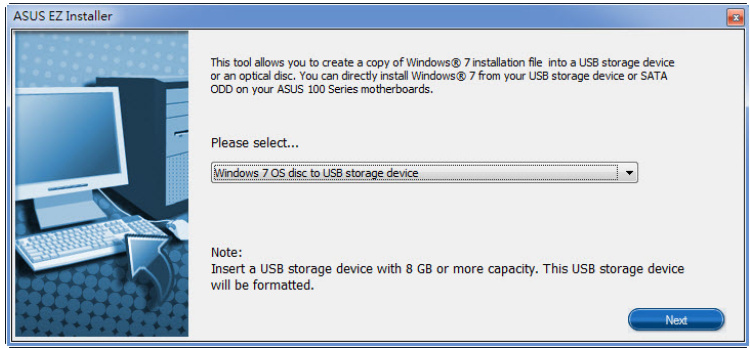 - Check I agree and then click Next.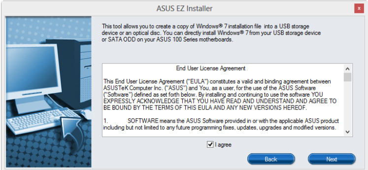 - Select the source of the Windows 7 OS installation disk then click Next.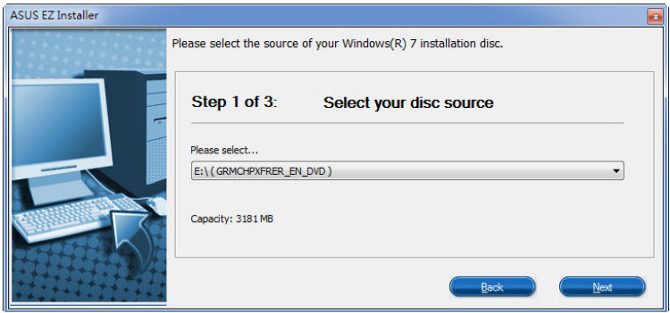 - Select the USB storage device and click next.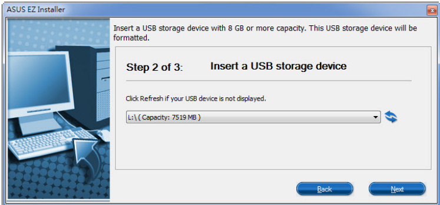 Click the refresh icon if the USB storage device is not displayed.-Click Yes to clear the contents on the USB storage device and create a bootable USB device.Make sure to backup contents on the USB storage device, as it will be formatted.- Once completed, click OK to finish.
### Method 3.3 Windows 7 OS disk to ISO file
• Windows 7 OS disk to ISO file 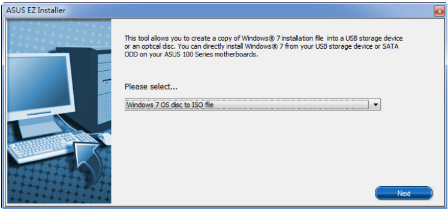 - Select Windows 7 OS disk to ISO file then click Next - Check I agree and then click Next.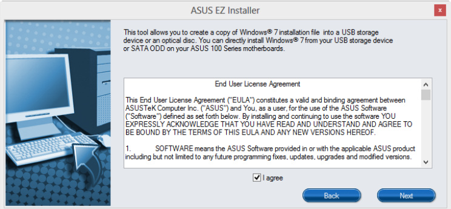 - Select the source of the Windows 7 installation disk then click Next.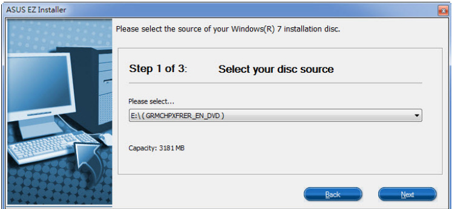 - Select the folder to save the modified Windows 7 OS installation ISO file and click Next.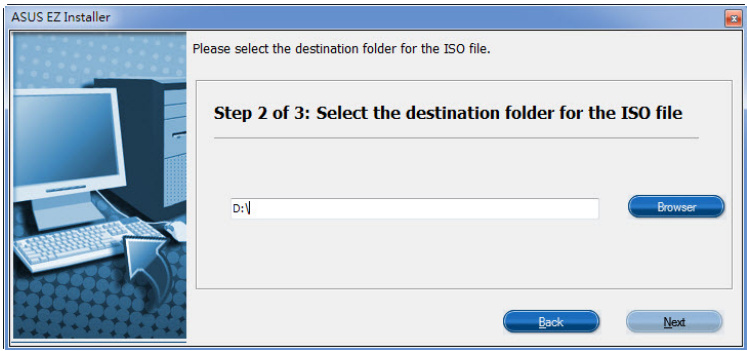 - Once completed, click OK to finish. -Burn this ISO file onto an empty DVD to create a modified Windows 7 OS installation DVD.
### Method 3.4 Install OS 7 on the 100 series platform
4.Insert the modified OS 7 installation DVD into an ODD or connect the USB storage device with modified OS 7 installation files onto your 100 series platform.
5.Power on your system and press F8 during POST (Power-On Self Test) to enter the boot screen.
6.Select the ODD or USB storage device as the boot device.
7.The USB 3.0 driver will be loaded automatically during installation startup.The “Setup is starting...” screen will show up if the USB 3.0 driver is loaded correctly.
8.Follow the onscreen instructions to complete the OS 7 installation.

# Appendices

## Notices

### Federal Communications Commission Statement
This device complies with Part 15 of the FCC Rules.Operation is subject to the following two conditions:
• This device may not cause harmful interference.
• This device must accept any interference received including interference that may cause undesired operation.
This equipment has been tested and found to comply with the limits for a Class B digital device, pursuant to Part 15 of the FCC Rules.These limits are designed to provide reasonable protection against harmful interference in a residential installation.This equipment generates, uses and can radiate radio frequency energy and, if not installed and used in accordance with manufacturer’s instructions, may cause harmful interference to radio communications.However, there is no guarantee that interference will not occur in a particular installation.If this equipment does cause harmful interference to radio or television reception, which can be determined by turning the equipment off and on, the user is encouraged to try to correct the interference by one or more of the following measures:
• Reorient or relocate the receiving antenna.
• Increase the separation between the equipment and receiver.
• Connect the equipment to an outlet on a circuit different from that to which the receiver is connected.
• Consult the dealer or an experienced radio/TV technician for help.
The use of shielded cables for connection of the monitor to the graphics card is required to assure compliance with FCC regulations.Changes or modifications to this unit not expressly approved by the party responsible for compliance could void the user’s authority to operate this equipment.

### IC: Canadian Compliance Statement
Complies with the Canadian ICES-003 Class B specifications.This device complies with RSS 210 of Industry Canada.This Class B device meets all the requirements of the Canadian interference-causing equipment regulations.This device complies with Industry Canada license exempt RSS standard(s).Operation is subject to the following two conditions: (1) this device may not cause interference, and (2) this device must accept any interference, including interference that may cause undesired operation of the device.

### Canadian Department of Communications Statement
This digital apparatus does not exceed the Class B limits for radio noise emissions from digital apparatus set out in the Radio Interference Regulations of the Canadian Department of Communications.This class B digital apparatus complies with Canadian ICES-003.

### VCCI: Japan Compliance Statement VCCI Class B Statement
This is a Class B product based on the standard of the VCCI Council.If this is used near a radio or television receiver in a domestic environment, it may cause radio interference.Install and use the equipment according to the instruction manual.

### REACH
Complying with the REACH (Registration, Evaluation, Authorisation, and Restriction of Chemicals) regulatory framework, we published the chemical substances in our products at REACH website.DO NOT throw the motherboard in municipal waste.This product has been designed to enable proper reuse of parts and recycling.This symbol of the crossed out wheeled bin indicates that the product (electrical and electronic equipment) should not be placed in municipal waste.Check local regulations for disposal of electronic products.DO NOT throw the mercury-containing button cell battery in municipal waste.This symbol of the crossed out wheeled bin indicates that the battery should not be placed in municipal waste.

### Recycling/Takeback Services
Recycling and takeback programs come from our commitment to the highest standards for protecting our environment.We believe in providing solutions for you to be able to responsibly recycle our products, batteries, other components as well as the packaging materials.It declares that this device is in compliance with the essential requirements and other relevant provisions of CE Directives.Please see the CE Declaration of Conformity for more details.
