# Phone

Always there to help you XL490 XL495 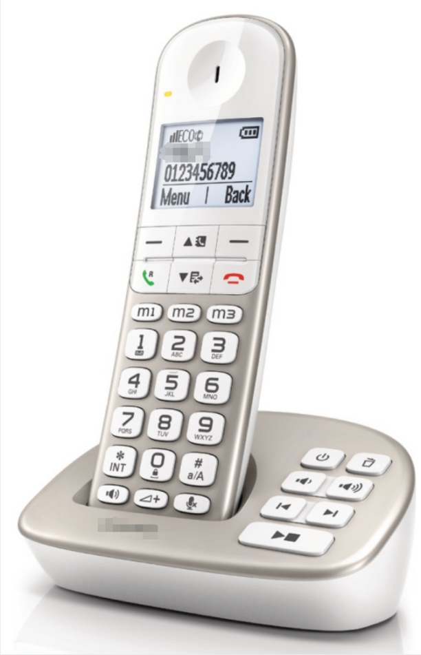

## Important safety instructions

### General safety precautions

•• Handsfree activation could suddenly increase the volume in the earpiece to a very high level: make sure the handset is not too close to your ear.
•• This equipment is not designed to make emergency calls when the power fails. An alternative has to be made available to allow emergency calls.
•• Do not allow the product to come into contact with liquids.
•• Do not use any cleaning agents containing alcohol, ammonia, benzene, or abrasives as these may harm the set.
•• Do not expose the phone to excessive heat caused by heating equipment or direct sunlight.
•• Do not drop your phone or allow objects to fall on your phone.
•• Active mobile phones in the vicinity may cause interference.
•• The Electrical network is classified as hazardous. The only way to power down the charger is to unplug the power supply from the electrical outlet. Ensure that the electrical outlet is always easily accessible.

## Power requirements

### Electrical supply requirements

• This product requires an electrical supply of 100-240 volts AC. In case of power failure, the communication can be lost.
• The voltage on the network is classified as TNV-3 (Telecommunication Network Voltages), as defined in the standard EN 60950.

## About operating and storage temperatures

### Operating and storage temperature range

• Operate in a place where temperature is always between $0^{\circ}\mathrm{C}$ to $+40^{\circ}\mathrm{C}$ (up to $90\%$ relative humidity).
• Store in a place where temperature is always between $-20^{\circ}\mathrm{C}$ and $+45^{\circ}\mathrm{C}$ (up to $95\%$ relative humidity).
• Battery life may be shorter in low temperature conditions.

## To avoid damage or malfunction

### Product damage and malfunction prevention

•• Use only the power supply listed in the user instructions.
•• Use only the batteries listed in the user instructions.
•• Risk of explosion if battery is replaced by an incorrect type.
•• Dispose of used batteries according to the instructions.
•• Do not dispose of batteries in fire.
•• Always use the cables provided with the product.
•• Do not allow the charging contacts or the battery to come into contact with metal objects.
•• Do not let small metal objects come into contact with the product. This can deteriorate audio quality and damage the product.
•• Metallic objects may be retained if placed near or on the handset receiver.
•• Do not use the product in places where there are explosive hazards.
•• Do not open the handset, base station or charger as you could be exposed to high voltages.
•• For pluggable equipment, the socket-outlet shall be installed near the equipment and shall be easily accessible.

# Your phone

## What is in the box

### Package contents

Base station (XL490) 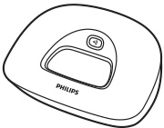
Base station (XL495) 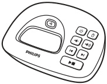
Power adapter** 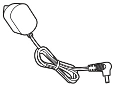
Line cord* 
Quick start guide 

•• * In some countries, you have to connect the line adapter to the line cord, then plug the line cord to the telephone socket.
•• ** In multi-handset packs, there are additional handsets and chargers and power adapters.

## Overview of the phone

### Earpiece and navigation controls

**Handset diagrams**

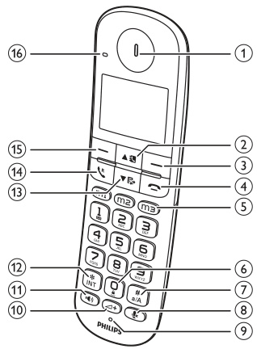 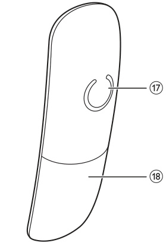

Earpiece
• Scroll up on the menu.
• Increase the earpiece/speaker volume.
• Access the phonebook in standby mode.

c
• Delete text or digits.
• Cancel operation.
• Access the redial list in standby mode.
• Change the sound profile during a call.

d
• End the call.
• Exit the menu/operation.
• Press and hold to switch the handset on or off.

m1/m2/m3
Store the emergency phone numbers or numbers you call frequently.
• Press to enter a space during text editing.
• Press and hold to lock/unlock the keypad in standby mode.
• Press and hold to enter a pause when making a call.
• Switch to upper/lower case during editing.
• Mute or unmute the microphone.
• Access to the answer machine menu in standby mode (for XL495 only).
• Listen to new messages from the answering machine (for XL495 only).

### Microphone, speakerphone and call controls

Microphone
Activate/deactivate audio boost in earpiece or handsfree mode.
• Turn the speaker phone on/off.
• Make and receive calls through the speaker.
• Press and hold to make an intercom call (for multi-handset version only).
• Change the dial mode (from pulse mode to temporary tone mode).
• Scroll down on the menu.
• Decrease the earpiece/speaker volume.
• Access the call log in standby mode.
• Make and receive calls.
• Recall key (This function is network dependent.)
• Access the main menu in standby mode.
• Confirm selection.
• Enter the options menu.
• Select the function displayed on the handset screen directly above the key.

### Indicators, loudspeaker and playback controls

LED indicator
View events or charging status.

Loudspeaker
Battery door
Turn the answering machine on or off.
• Delete the current playback message.
• Press and hold to delete all old messages.
/ Decrease/increase the speaker volume.
/ Skip backward/forward during playback.
• Play messages.
• Stop messages playback.

## Overview of the base station

### Base station controls and indicators

• Press to find handsets.
• Press and hold to enter the registration mode. 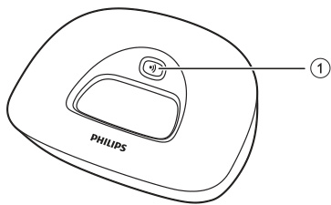

• Press to find handsets.
• Press and hold to enter the registration mode. 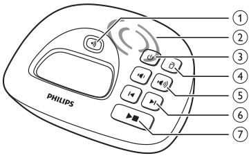

Speaker

# Get started

## Connect the base station

### Connection precautions and requirements

•• Make sure that you have read the safety instructions in the 'Important safety instructions' section before you connect and install your handset.
•• Risk of product damage\! Ensure that the power supply voltage corresponds to the voltage printed on the back or the underside of the phone. 
•• Use only the supplied power adapter to charge the batteries.
•• If you subscribe to the digital subscriber line (DSL) high speed internet service through your telephone line, ensure you install a DSL filter between the telephone line cord and the power socket. The filter prevents noise and caller ID problems caused by the DSL interference. For more information on the DSL filters, contact your DSL service provider.
•• The type plate is located on the bottom of the base station.

**Connect each end of the power adapter to:**

• the DC input jack at the bottom of the base station;
• the power socket on the wall. 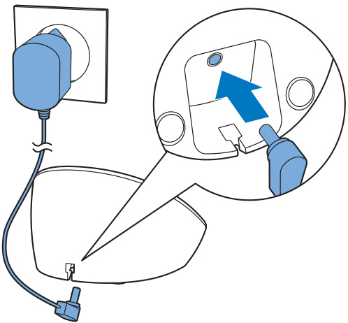

### Connect each end of the line cord to:
• the telephone socket at the bottom of the base station;
• the telephone socket on the wall.
• the power socket on the wall.

## Install the handset

### Handset Battery Installation, Safety Warnings, and First Charging

The batteries are pre-installed in the handset. Pull the battery tape off from the battery door before charging. 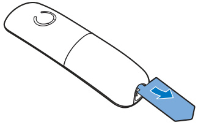

•• Risk of explosion\! Keep batteries away from heat, sunshine or fire. Never discard batteries in fire. 
•• Use only the supplied batteries.
•• Risk of decreased battery life\! Never mix different brands or types of batteries. 
•• Charge the batteries for 8 hours before first use.
•• If the handset becomes warm when the batteries are charging, it is normal.
•• Check the battery polarity when inserting in the battery compartment. Incorrect polarity may damage the product.

## Configure your phone (country dependent)

1 When using your phone for the first time, you see a welcome message.
2 Press [OK].

### Set the country/language
Select your country/language, then press [OK] to confirm.
•• The country/language setting option is country dependent. If no welcome message is displayed, it means the country/language setting is preset for your country. Then you can set the date and time. To re-set the language, see the following steps.
1 Select [Menu] \> [Phone setup] \> [Language], then press [OK] to confirm.
2 Select a language, then press [OK] to confirm.
$\hookrightarrow$ The setting is saved.

### Set the date and time
1 Select [Menu] \> [Phone setup] \> [Date & time], then press [OK] to confirm.
2 Press the numeric buttons to enter the date, then press [OK] to confirm.
$\hookrightarrow$ The time setting menu is displayed on the handset.
3 Press the numeric buttons to enter the time.
• If the time is in 12-hour format, press / to select [am] or [pm] (Country dependent).
4 Press [OK] to confirm.
$\hookrightarrow$ The country/language setting is saved.

### Change the remote access PIN code (for XL495)
•• This feature is available only for models with answering machine.
•• The default answering machine remote access PIN code is 0000 and it is important to change it to ensure the security.
1 Select [Menu] \> [Answ. Machine] \> [Remote access] \> [Change PIN], then press [OK] to confirm.
2 Enter the old PIN, then press [OK] to confirm.
3 Enter the new PIN code, then press [OK] to confirm.
4 Enter the new PIN code again, then press [Save] to confirm.
$\hookrightarrow$ The setting is saved.

## Charge the handset

### Charging procedure and first use

Place the handset on the base station to charge the handset. When the handset is placed correctly on the base station, you hear a docking sound.
$\hookrightarrow$ The handset starts charging.
•• Charge the batteries for 8 hours before first use.
•• If the handset becomes warm when the batteries are being charged, it is normal.
You can activate or deactivate the docking tone (see 'Set the docking tone' on page 25). Your phone is now ready to use.

## Check the battery level

### Battery icon and low-battery behavior

The battery icon displays the current battery 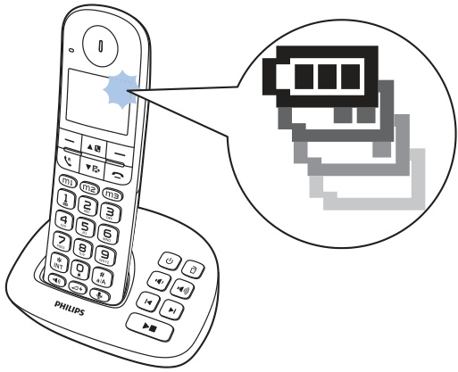
The handset turns off if the batteries are empty. If you are on the phone, you hear warning tones when the batteries are almost empty. The call gets disconnected after the warning. 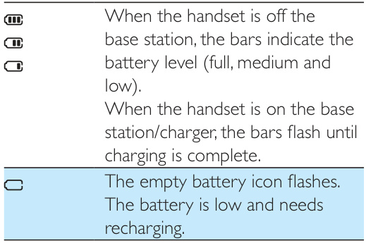

## What is standby mode?

### Standby screen information

Your phone is in standby mode when it is idle. The handset name, date and time, and handset number are displayed on the standby screen.

## Display icons

### Main screen icons

In standby mode, the icons shown on the main screen tell you what features are available on your handset. 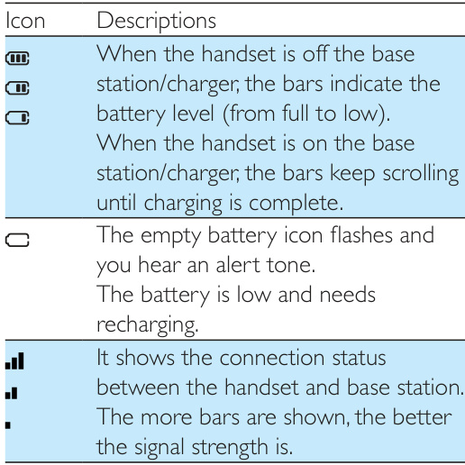 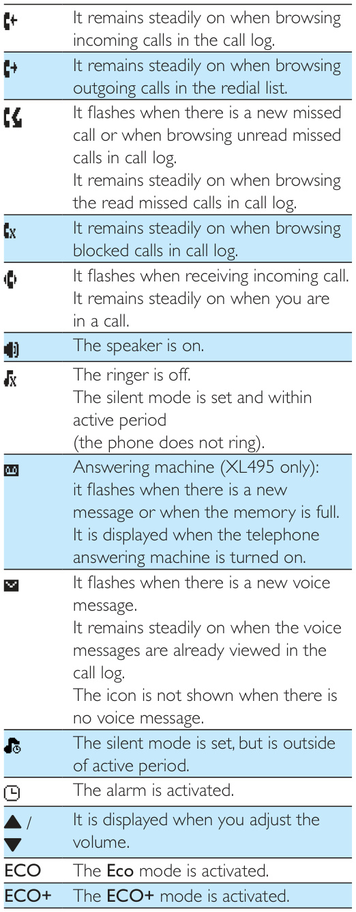

## Check the signal strength

### Signal bars and connection status

The number of bars indicates the connection status between the handset and base station. The more bars are shown, the better the connection is.
• Make sure the handset is connected to the base station before you make or receive calls and carry out the phone functions and features.
• If you hear warning tones when you are on the phone, the handset is almost out of battery or the handset is out of range. Charge the battery or move the handset nearer to the base station.
•• When ECO+ is on, the signal strength is not displayed.

**Switch the handset on or off**

Press and hold to switch the handset on or off.

# Calls and Phonebook

## Calls

### Calling precautions and available call methods

•• When the power fails, the phone cannot access emergency services.
•• Check the signal strength before you make a call or when you are in a call (see 'Check the signal strength' on page 11).

### Make a call
You can make a call in these ways:
• Normal call.
• Predial call.
• Call through the direct keys
You can also make a call from the redial list (see 'Redial a call' on page 23), phonebook list (see 'Call from the phonebook' on page 19) and call log (see 'Return a call' on page 21).

### Normal call
1 Press or .
2 Dial the phone number.
$\hookrightarrow$ The number is dialed out.
$\hookrightarrow$ The duration of your current call is displayed.

### Predial call
1 Dial the phone number
• To erase a digit, press [Clear].
• To enter a pause, press and hold .
2 Press or to dial out the call.

### Call through the direct key
You can make a quick call from the record presaved in the direct key in the following ways:
• Press m1, m2 or m3 in standby mode, then press $\backsim$ or to dial out the number.
• Press $\backsim$ or to get the dial tone first. Then press m1, m2 or m3 to display the record content. Then press [OK] to dial out the number.
•• For information of how to set the direct keys, see the chapter 'Phonebook', section 'Direct keys'.
•• The talk time of your current call is displayed on the call timer.
•• If you hear warning tones, the phone is almost out of battery or out of range. Charge the battery or move the phone close to the base station.

### Answer a call
When the phone rings, you can select from the following options:
• press $\backsim$ or to answer the call.
• pick up the phone from the base station (or from the charger) to answer the call when you have activated the auto answer feature (see 'Auto answer' on page 26).
•• When the handset rings or when the handsfree is activated, keep the handset away from your ear to avoid ear damage.
•• The caller ID service is available if you have registered to the caller ID service with your service provider.
•• When there is a missed call, a notification message is displayed.
•• Select [Silent] to turn off the ringer of the current incoming call.

### End a call
You can end a call in these ways:
• Press ;
• Place the handset to the base station or charging cradle.

### Adjust the earpiece/speaker volume
Press / to adjust the volume during a call.
$\hookrightarrow$ The earpiece/speaker volume is adjusted and the phone is back to the call screen.

### Mute the microphone
1 Press during a call.
$\hookrightarrow$ [Mute on] is displayed on the handset.
$\hookrightarrow$ The caller cannot hear you, but you can still hear his voice.
2 Press again to unmute the microphone.
$\hookrightarrow$ You can now communicate with the caller.

**Turn the speaker on or off**

Note
•• This service is network dependent.

### Make a second call
1 Press during a call.
$\hookrightarrow$ The first call is put on hold.
2 Dial the second number.
$\hookrightarrow$ The number displayed on the screen is dialed out.

### Answer a second call
Note
•• This service is network dependent.
When there is a periodical beep to notify you of an incoming call, you can answer the call in these ways:
Press and $\supseteqq$ to answer the call.
$\hookrightarrow$ The first call is put on hold, and you are now connected to the second call.
Press and to end the current call and answer the first call.

### Switch between two calls
Note
•• This service is network dependent.
You can switch your calls in these ways:
• Press $\backsim$ and $\supseteqq$ ;
or • Press [Option] and select [Switch calls], then press [OK] again to confirm.
$\hookrightarrow$ The current call is put on hold, and you are now connected to the other call.
Press .

### Make a conference call with the external callers
•• This service is network dependent. Check with the service provider for additional charges.
When you are connected to two calls, you can make a conference call in these ways:
• Press , then $\exists$ ;
or • Press [Option], select [Conference] and then press [OK] again to confirm.
$\hookrightarrow$ The two calls are combined and a conference call is established.

## Intercom and conference calls

### Make a call to another handset

**Intercom and conference call overview**

•• This feature is available for multi-handset versions only.
An intercom call is a call to another handset that shares the same base station. A conference call involves a conversation between you, another handset user and the outside callers.

•• If the base station only has 2 registered handsets, press and hold to make a call to another handset.
1 Press and hold .
$\hookrightarrow$ For multi-handset versions, the handsets available for intercom are displayed, then go to step 2.
$\hookrightarrow$ For two-handset versions, the other handset rings, then go to step 3.
2 Select a handset, then press [OK] to confirm.
$\hookrightarrow$ The selected handset rings.
3 Press on the selected handset.
$\hookrightarrow$ The intercom is established.
4 Press to end the intercom call.

**While you are on the phone**

You can go from one handset to another during a call:
1 Press and hold .
$\hookrightarrow$ The current caller is put on hold.
$\hookrightarrow$ For multi-handset versions, the handsets available for intercom are displayed, then go to step 2.
2 Select a handset, then press [OK] to confirm.
$\hookrightarrow$ Wait for the other side to answer your call.

**Switch between calls**

Press and hold to switch between the outside call and the intercom call.

### Make a conference call
A 3-way conference call is between you, another handset user and the outside callers. It requires two handsets to share the same base station.

**During an external call**

Press and hold to initiate an internal call.
$\hookrightarrow$ The external caller is put on hold.
$\hookrightarrow$ For multi-handset versions, the handsets available for intercom are displayed, then go to step 2.
$\hookrightarrow$ For two-handset versions, the other handset rings, then go to step 3.
Select a handset, then press [OK] to confirm.
$\hookrightarrow$ The selected handset rings.
Press on the selected handset.
$\hookrightarrow$ The intercom is established.
Press [Conf].
$\hookrightarrow$ You are now in a 3-way conference call with an $\ominus\times$ternal call and a selected handset.
Press to end the conference call and transfer the existing call to the selected handset.
•• Press to join an ongoing conference with another handset if [Services] \> [Conference] is set to [Auto].

**During the conference call**

1 Press [Int.] to put the external call on hold and go back to the internal call.
$\hookrightarrow$ The external call is put on hold.
2 Press [Conf] to establish the conference call again.
•• If a handset hangs up during the conference call, the other handset remains connected to the external call.

## Text and numbers

### Enter text and numbers

**Text entry overview**

You can enter text and numbers for handset name, phonebook records, and other menu items.

1 Press once or several times on the alphanumeric key to enter the selected character.
2 Press [Clear] to delete a character.
Press and hold [Clear] to delete all characters.
Press and to move the cursor left and right.
3 Press to add a space.
•• For information on key mapping of characters and numbers, see the chapter 'Appendix'.

### Switch between uppercase and lowercase
By default, the first letter of each word in a sentence is uppercase and the rest is lowercase.
Press and hold $\mathbf{\Pi}_{a/\mathsf{A}}^{#}$ to switch between the uppercase and lowercase letters.

## Phonebook

### Phonebook capacity and record limits

This phone has a phonebook that stores up to 50 records. Each record can have a name up to 16 characters long. Each record can store up to 2 numbers, with each number up to 24 digits long.

### Direct keys
The phone also features 3 direct keys to store the emergency phone numbers or numbers you call frequently.
### Set the direct keys
1 Enter the number.
2 Press and hold m1, m2 or m3.
3 Enter/edit the name, then press [OK] to confirm.
4 Enter/edit the number, then press [Save] to confirm.
$\hookrightarrow$ The direct key is set.
•• If there is already a record saved in the direct key, you need to confirm whether you want to replace the old record with the new one.
•• The phonebook records and the direct key records are saved in the base station. For multiple handset versions, the same phonebook records and direct key records are shared among different handsets.

### Direct access memories
You have up to 2 direct access memories (Keys 1 and 2). Depending on your country, keys 1 and 2 are preset to the voice mail number and information service number of your service provider respectively. When you press and hold on the key in standby mode, the saved phone number is dialed automatically.
•• The availability of direct access memory is country dependent.

### View the phonebook
•• You can view the phonebook on one handset only each time.
1 Press or select [Menu] \> [Phonebook] \> [View] \> [OK] to access the phonebook list.
2 Select a contact and view the available information.

### Search a record
You can search the phonebook records in these ways:
• Scroll the contacts list.
• Enter the first character of the contact name.
### Scroll the contact list
1 Press or select [Menu] \> [Phonebook] \> $\mathsf{[V i e w]}>\mathsf{[O K]}$ to access the phonebook list.
2 Press and $\blacktriangledown$ to scroll through the phonebook list.
### Enter the first character of a contact
1 Press or select [Menu] \> [Phonebook] \> [View] \> [OK] to access the phonebook list.
2 Press the alpha numerical key that matches the character.
$\hookrightarrow$ The first record that starts with this character is displayed.

### Call from the phonebook
Press or select [Menu] \> [Phonebook] \> [View] \> [OK] to access the phonebook list.
Select a contact in the phonebook list.
Press [View].
Select a type of number (mobile/home/ office), press $\backsim$ to make the call.

### Access the phonebook during a call
1 Press [Option] and select [Phonebook].
2 Press [OK] to confirm.
3 Select a contact, then press [OK] to confirm.
$\hookrightarrow$ The number is displayed.

### Add a record
•• If your phonebook memory is full, a notification message is displayed on the handset. Delete some records to add new ones.
•• When you change the number of a record, the new number will overwrite the old number.
1 Select [Menu] \> [Phonebook] \> [Add new], then press [OK] to confirm.
2 Enter the name, then press [OK] to confirm.
3 Enter the mobile number, home number and office number (choose either two of them), then press [Save] to confirm.
$\hookrightarrow$ Your new record is saved.
•• Press and hold $\mathbf{\Pi}_{\mathsf{a}/\mathsf{A}}^{#}$ to insert a pause.
•• Press once or several times on the alphanumeric key to enter the selected character.
•• Press [Clear] to delete the character.
Press / to move the cursor left and right.
•• You can save 2 numbers at maximum per each phonebook entry.

### Edit a record
1 Select [Menu] \> [Phonebook] \> [Edit], then press [OK] to confirm.
2 Select a contact, then press [OK] to confirm.
3 Edit the name, then press [OK] to confirm.
4 Select the mobile/home/office number, then press [OK] to confirm.
5 Edit the number, then press [Save] to confirm.

### Delete a record
1 Select [Menu] \> [Phonebook] \> [Delete], then press [OK] to confirm.
2 Select a contact, then press [OK] to confirm.
$\hookrightarrow$ A confirmation request is displayed on the handset.
3 Press [OK] to confirm.
$\hookrightarrow$ The record is deleted.

### Delete all records
1 Select [Menu] \> [Phonebook] \> [Delete all], press [OK] to confirm.
$\hookrightarrow$ A confirmation request is displayed on the handset.
2 Press [OK] to confirm.
$\hookrightarrow$ All records (except the 2 direct access memory records) are deleted.

## Call log

### Call log capacity and caller information

The call log stores the incoming call history of all missed, received or blocked calls. The incoming call history includes the name and number of the caller, call time and date. This feature is available if you have registered to the caller ID service with your service provider. Your phone can store up to 50 incoming call records. The call log icon on the handset flashes to remind you of any unanswered calls. If the caller allows the display of his identity, you can view his name or number. The call records are displayed in chronological order with the most recent received call at the top of the list.
•• Make sure that the number in the call list is valid before you can call back directly from the call list.
The icons shown on the screen tell you whether they are missed/received/blocked calls. 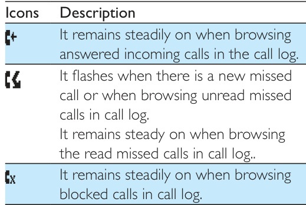

### Call list type
You can set if you can see all incoming calls or only missed calls from the call log.
•• This is a country dependent feature.
1 Select [Menu] \> [Services] \> [Call list type], then press [OK] to confirm.
2 Select an option, then press [OK] to confirm.
$\hookrightarrow$ The setting is saved.

### View the call records
Press .
$\hookrightarrow$ The incoming call log is displayed.
Select a record, then press [Option].
Select [View] > [OK] for more available information.

### Save a call record to the phonebook
Press .
$\hookrightarrow$ The incoming call log is displayed.
Select a record, then press [Option].
Select [Save number], then press [OK] to confirm.
Enter and edit the name, then press [OK] to confirm.
Select a type of number (mobile/home/ office), then press [OK] to confirm.
Edit the number, then press [Save] to confirm.
$\hookrightarrow$ The record is saved.

**Return a call**

1 Press .
2 Select a record on the list.
3 Press to make the call.

### Delete a call record
1 Press .
$\hookrightarrow$ The incoming call log is displayed.
2 Select a record, then press [Option].
3 Select [Delete], then press [OK] to confirm.
$\hookrightarrow$ A confirmation request is displayed on the handset.
4 Press [OK] to confirm.
$\hookrightarrow$ The record is deleted.

### Delete all call records
1 Press .
$\hookrightarrow$ The incoming call log is displayed.
2 Press [Option] to enter the options menu.
3 Select [Delete all], then press [OK] to confirm.
$\hookrightarrow$ A confirmation request is displayed on the handset.
4 Press [OK] to confirm.
$\hookrightarrow$ All records are deleted.

## Redial list

### Redial history capacity

The redial list stores the call history of dialed calls. It includes the names and/or numbers you have called. This phone can store up to 20 redial records.

**View the redial records**

Select [Redial].

### Save a redial record to the phonebook
1 Press [Redial] to enter the list of dialed calls.
2 Select a record, press [OK], then press [Option].
3 Select [Save number], then press [OK] to confirm.
4 Enter and edit the name, then press [OK] to confirm.
5 Select a type of number (mobile/home/ office), then press [OK] to confirm.
6 Edit the number, then press [Save] to confirm.
$\hookrightarrow$ The record is saved.

**Access the redial list during a call**

1 Press [Option] and select [Redial].
2 Press [OK] to confirm.

### Delete a redial record
Press [Redial] to enter the list of dialed calls.
Select a record, then press [Option].
Select [Delete], then press [OK] to confirm.
$\hookrightarrow$ A confirmation request is displayed on the handset.
Press [OK] to confirm.
$\hookrightarrow$ The record is deleted.

### Delete all redial records
Press [Redial] to enter the list of dialed calls.
Select [Option] \> [Delete all], then press [OK] to confirm.
$\hookrightarrow$ A confirmation request is displayed on the handset.
Press [OK] to confirm.
$\hookrightarrow$ All records are deleted.

### Redial a call
1 Press [Redial].
2 Select the record you want to call.
Press .
$\hookrightarrow$ The number is dialed out.

# Phone settings and Services

## Phone settings

### Audio boost

**Phone customization overview**

You can customize the settings to make it your own phone.

**Sound settings**

•• Audio boost should only be used by people with hearing impairment.
•• For hearing safety, audio boost will be deactivated at the end of each call.
This feature can amplify the sound volume in earpiece or handsfree mode. Press to activate/deactivate audio boost during a call. When audio boost is activated, the LED indicator on the handset will stay steadily on. [Audio boost on] will be displayed.

### Set the hearing aid compatibility
Your phone is hearing aid compatible (according to the standard ETS300381). This enables the phone to couple with the hearing aid device to amplify the sound and reduce noise interference.
Select [Menu] \> [Phone setup] \> [Sounds] \> [MySound] \> [Earpiece] \> [HAC], then press [OK] to confirm.
$\hookrightarrow$ The setting is saved.

### Set the sound profile
You can set the sound in the earpiece or loudspeaker among 3 different profiles.
1 Select [Menu] \> [Phone setup] \> [Sounds] \> [MySound], then press [OK] to confirm.
2 Select [Earpiece] / [Loudspeaker].
3 Select a profile, then press [OK] to confirm.
$\hookrightarrow$ The setting is saved.

**Access the sound profile during a call**

Press [Sound] for once or several times to change the sound profile during a call.

### Set the handset's ringtone volume
You can select among 5 ringtone volume levels or [Off].
1 Select [Menu] \> [Phone setup] \> [Sounds] \> [Ring volume], then press [OK] to confirm.
2 Select a volume level, then press [OK] to confirm.
$\hookrightarrow$ The setting is saved.

### Set the handset's ringtone
You can select from 10 ringtones.
1 Select [Menu] \> [Phone setup] \> [Sounds] \> [Ring tones], then press [OK] to confirm.
2 Select a ringtone, then press [OK] to confirm.
$\hookrightarrow$ The setting is saved.

### Set the visual ring
When the visual ring is activated, the display backlight will flash when there is an incoming call.
1 Select [Menu] \> [Phone setup] \> [Sounds] \> [Visual ring], then press [OK] to confirm.
2 Select [Flashing on] / [Flashing off], then press [OK] to confirm.
$\hookrightarrow$ The setting is saved.

### Silent mode
You can set your phone to silent mode and enable the silent mode for a specified duration. When the silent mode is turned on, your phone does not ring and does not sound the key tone and docking tone.
•• When you press to find your handset, or when you activate the alarm, your phone still sends alert even when the silent mode is activated.
1 Select [Menu] \> [Phone setup] \> [Sounds] \> [Silent mode], then press [OK] to confirm.
2 Select [On/off] > [On]/[Off], then press [OK] to confirm.
$\hookrightarrow$ The setting is saved.
3 Select [Start & end], then press [OK] to confirm.
4 Set the time, then press [OK] to confirm.
$\hookrightarrow$ The setting is saved.
$\hookrightarrow$ » is displayed.

### Set the key tone
Key tone is the sound made when you press a key on the handset.
1 Select [Menu] \> [Phone setup] \> [Sounds] \> [Key tone], then press [OK] to confirm.
2 Select $[\mathsf{O n}]/[\mathsf{O f f}]$, then press [OK] to confirm.
$\hookrightarrow$ The setting is saved.

### Set the docking tone
Docking tone is the sound made when you place the handset on the base station or charger.
1 Select [Menu] \> [Phone setup] \> [Sounds] \> [Docking tone], then press [OK] to confirm.
2 Select [On] / [Off], then press [OK] to confirm.
$\hookrightarrow$ The setting is saved.

### Set the battery tone
Battery tone is the sound made when the battery is low and needs recharging.
1 Select [Menu] \> [Phone setup] \> [Sounds] \> [Battery tone], then press [OK] to confirm.
2 Select [On] / [Off], then press [OK] to confirm.
$\hookrightarrow$ The setting is saved.

### Eco mode
The ECO mode reduces the transmission power of the handset and base station when you are on a call or when the phone is in standby mode.
1 Select [Menu] \> [Phone setup] \> [Eco mode], then press [OK] to confirm.
2 Select [On] / [Off], and press [OK] to confirm.
$\hookrightarrow$ The setting is saved.
$\hookrightarrow$ ECO is displayed in standby mode.
•• When ECO mode is set to [On], the connection range between the handset and the base station can be reduced.

### ECO+ mode
When the $\mathsf{E C O+}$ mode is activated, it eliminates the radiation of the handset and base station in standby mode.
1 Select [Menu] \> [Phone setup] \> [ECO+ mode], then press [OK] to confirm.
2 Select [On] / [Off], and press [OK] to confirm.
$\hookrightarrow$ The setting is saved.
$\hookrightarrow\mathsf{E C O}+$ is displayed in standby mode after a while.
•• Make sure that all the handsets registered to the base station are $\times\mathsf{L490}/\mathsf{X}\mathsf{L495}$ in order to have the $\mathsf{E C O+}$ feature functioning properly.
•• When ECO+ is activated, the standby time is reduced. This is because in $\mathsf{E C O}+\mathsf{\Delta}$ mode the base station is not transmitting any signal in standby mode; therefore the handset needs to “listen” more frequently for signals from the base station to detect incoming calls or other requests from the base station. The time it takes for the handset to access features like call setup, call log, paging, and phonebook browsing is also delayed. The handset will not alert you to link loss in case of power loss or moving out of range.
The following table shows you the current status of the handset screen with different ECO mode and $\mathsf{E C O+}$ mode settings. 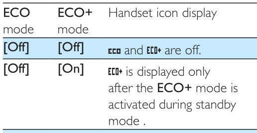 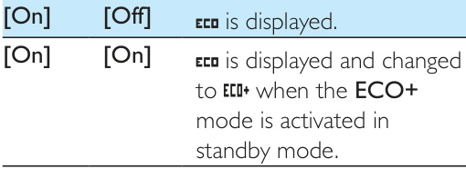

### Name the handset
The name of the handset can be up to 14 characters. It is displayed on the handset screen in standby mode.
1 Select [Menu] \> [Phone setup] \> [Phone name], then press [OK] to confirm.
2 Enter or edit the name. To erase a character, select [Clear].
3 Press [OK] to confirm.
$\hookrightarrow$ The setting is saved.

### Set the display language
•• This feature only applies to models with multiplelanguage support.
•• Languages available vary from country to country.
1 Select [Menu] \> [Phone setup] \> [Language], then press [OK] to confirm.
2 Select a language, then press [OK] to confirm.
$\hookrightarrow$ The setting is saved.

### Auto answer
When you activate the auto answer feature, you can connect to the incoming call automatically once you pick up the handset. When you deactivate this feature, you have to press $\backsim$ or to answer the incoming call.
1 Select [Menu] \> [Phone setup] \> [Auto answer], then select [OK] to confirm.

### Set the handset LED indicator behavior
You can set the LED indicator behavior on your handset for different events or charging status.
Select [Menu] \> [Phone setup] \> [LED status] \> [Events status] / [Charge status ], then press [OK] to confirm.
$\hookrightarrow$ The setting is saved.
The table below shows you the current status with different LED indicator behavior on the handset. 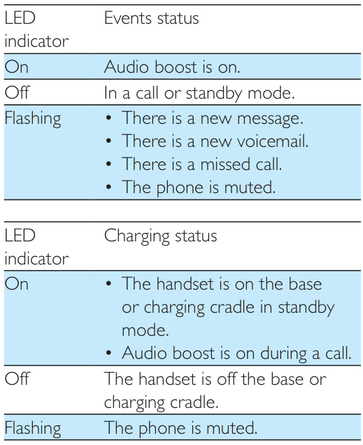

## Alarm clock

### Set the alarm

**Alarm clock overview**

Your phone has a built-in alarm clock. Check the information below to set your alarm clock.

1 Select [Menu] \> [Alarm], then press [OK] to confirm.
2 Select [On once] or [On daily], then press [OK] to confirm.
3 Enter an alarm time, then press [OK] to confirm.
$\hookrightarrow$ The alarm is set and is displayed on the screen.
•• Press / to switch between [am] / [pm] (Country dependent).

**Turn off the alarm**

**When the alarm rings**

Press any key to turn off the alarm.

**Before the alarm rings**

Select [Menu] \> $\mathsf{[A l a r m]}>\mathsf{[O f f]}$, then press [OK] to confirm.
$\hookrightarrow$ The setting is saved.

## Services

### Call list type

**Service features overview**

The phone supports a number of features that help you handle and manage the calls.

You can set if you can see all incoming calls or only missed calls from the call log.
•• This is a country dependent feature.
1 Select [Menu] \> [Services] \> [Call list type], then press [OK] to confirm.
2 Select an option, then press [OK] to confirm.
$\hookrightarrow$ The setting is saved.

### Auto conference
To join an $\ominus\times$ternal call with another handset, press .
•• This feature is available only for multi-handset versions.
### Activate/Deactivate auto conference
1 Select [Menu] \> [Services] \> [Conference], then press [OK] to confirm.
2 Select [Auto] / [Off], then press [OK] to confirm.
$\hookrightarrow$ The setting is saved.

### Call barring
You can block outgoing calls to numbers, such as overseas calls or undesirable hotlines by barring calls that start with certain digits. You can create 4 sets of numbers with 4 digits at maximum for each set of numbers. When you make a call that starts with one of these 4 sets of numbers, the outgoing call is then barred.
### Select the barring mode
1 Select [Menu] \> [Services] \> [Call barring], then press [OK] to confirm.
2 Enter the call barring PIN/passcode. The default PIN/passcode is 0000. Then press [OK] to confirm.
3 Select [Barring mode], then press [OK] to confirm.
4 Select [On] / [Off], then press [OK] to confirm.
$\hookrightarrow$ The setting is saved.
### Add new numbers to the barred list
1 Select [Menu] \> [Services] \> [Call barring], then press [OK] to confirm.
2 Enter the call barring PIN/passcode. The default PIN is 0000. Then press [OK] to confirm.
3 Select [Barring number], then press [OK] to confirm.
4 Select a number from the list, then press [OK] to confirm.
5 Edit the number, then press [OK] to confirm.
$\hookrightarrow$ The setting is saved.
### Change the barring $\mathsf{P}\mathsf{I}\mathsf{N},$/passcode
1 Select [Menu] \> [Services] \> [Call barring], then press [OK] to confirm.
2 Enter the call barring PIN/passcode. The default PIN is 0000. Then press [OK] to confirm.
3 Select [Change PIN], then press [OK] to confirm.
4 Enter the old barring PIN/passcode. The default PIN is 0000. Then press [OK] to confirm.
5 Enter the new PIN/passcode, then press [OK] to confirm.
6 Enter the new PIN/passcode again, then press [Save] to confirm.
$\hookrightarrow$ The setting is saved.

### Call blocking
There are two ways to block incoming calls:
• block anonymous calls;
• create a blacklist.
•• Make sure you have subscribed to the caller ID service before you use this feature.
### Block anonymous calls
You can block calls without identity in order to reduce unwanted calls, like calls from tele marketers.
1 Select [Menu] \> [Services] \> [Call block], then press [OK] to confirm.
2 Enter the call blocking PIN/passcode. The default PIN is 0000. Then press [OK] to confirm.
3 Select [Anonymous call] \> $[\mathsf{O n}]/[\mathsf{O f f}]$ to activate/deactivate call blocking, then press [OK] to confirm.
$\hookrightarrow$ The setting is saved.
### Blacklist
You can put numbers into the blacklist to block incoming calls from certain undesirable numbers. You can create 4 sets of numbers with 24 digits at maximum for each set of numbers. When there is an incoming call that starts with one of these 4 sets of numbers, the ringer will be muted.
•• The contact's name in phonebook will not be displayed if this contact's number matches the record saved in the blacklist.
### Create a blacklist
1 Select [Menu] \> [Services] \> [Call block] then press [OK] to confirm.
2 Enter the call blocking PIN/passcode. The default PIN is 0000. Then press [OK] to confirm.
3 Select [Blacklist] \> [Block number] if you have activated call blocking, enter the number, then press [OK] to confirm.
$\hookrightarrow$ The setting is saved.
### Activate/deactivate the blacklist
1 Select [Menu] \> [Services] \> [Call block] then press [OK] to confirm.
2 Enter the call blocking PIN/passcode. The default PIN is 0000. Then press [OK] to confirm.
3 Select [Blacklist] \> [Block mode] \> [On] / [Off], then press [OK] to confirm.
$\hookrightarrow$ The setting is saved.
### Change the call blocking PIN/ passcode
1 Select [Menu] \> [Services] \> [Call block], then press [OK] to confirm.
2 Enter the call blocking PIN/passcode. The default PIN is 0000. Then press [OK] to confirm.
3 Select [Change PIN], then press [OK] to confirm.
4 Enter the old PIN/passcode. The default PIN is 0000. Then press [OK] to confirm.
5 Enter the new PIN/passcode, then press [OK] to confirm.
6 Enter the new PIN/passcode again, then press [Save] to confirm.
$\hookrightarrow$ The setting is saved.

### Network type
•• This is a country dependent feature. It only applies to models with network type support.
1 Select [Menu] \> [Services] \> [Network type], then press [OK].
2 Select a network type, then press [OK].
$\hookrightarrow$ The setting is saved.

### Auto prefix
This feature checks and formats your outgoing call number before it is dialed out. The prefix number can replace the detect number you set in the menu. For example, you set 604 as the detect number and 1250 as the prefix. When you have dialed out a number such as 6043338888, your phone changes the number to 12503338888 when it dials out.
•• The maximum length of a detect number is 10 digits. The maximum length of an auto prefix number is 10 digits.
•• This is a country dependent feature.
### Set auto prefix
1 Select [Menu] \> [Services] \> [Auto prefix], then press [OK] to confirm.
2 Enter the detect number, then press [OK] to confirm.
3 Enter the prefix number, then press [OK] to confirm.
$\hookrightarrow$ The setting is saved.
•• To enter a pause, press and hold $\mathbf{\Pi}_{\mathsf{a}/\mathsf{A}}^{#}$.
•• If the prefix number is set and the detect number is left empty, the prefix number is added to all outgoing calls.
•• The feature is unavailable if the dialed number starts with * and #.

### Select the recall duration
Make sure that the recall time is set correctly before you can answer a second call. In normal case, the phone is already preset for the recall duration. You can select among 3 options: [Short], [Medium] and [Long]. The number of available options varies with different countries. For details, consult your service provider.
1 Select [Menu] \> [Services] \> [Recall time], then press [OK] to confirm.
2 Select an option, then press [OK] to confirm.
$\hookrightarrow$ The setting is saved.

### Dial mode
•• This feature only applies to models that support both tone and pulse dial.
Dial mode is the telephone signal used in your country. The phone supports tone (DTMF) and pulse (rotary) dial. Consult the service provider for detailed information.
### Set the dial mode
1 Select [Menu] \> [Services] \> [Dial mode]then press [OK] to confirm.
2 Select a dial mode, then press [OK] to confirm.
$\hookrightarrow$ The setting is saved.
•• If your phone is in pulse dial mode, press during a call for temporary tone mode. Digits entered for this call are then sent out as tone signals.

### Auto clock
•• This service is country and network dependent.
•• Make sure you have subscribed to the caller ID service before you use this feature.
It synchronizes the date and time on your phone with the public switched telephone network (PSTN) automatically. For the date to be synchronized, make sure the current year is set.
1 Select [Menu] \> [Services] \> [Auto clock], then press [OK] to confirm.
2 Select [On] / [Off]. Press [OK].
$\hookrightarrow$ The setting is saved.

### Register additional handsets
You can register additional handsets to the base station. The base station can register up to 4 handsets.
### Auto registration
Extra handsets of the same model can be autoregistered. Place the unregistered handset on the base station.
$\hookrightarrow$ The handset detects the base station and registers automatically.
$\hookrightarrow$ Registration is complete in less than two minutes. The base station automatically assigns a handset number to the handset.
### Manual registration
If auto registration fails, register your handset manually to the base station.
1 Select [Menu] \> [Services] \> [Register], then press [OK] to confirm.
2 Press and hold on the base station for 5 seconds.
3 Enter the system PIN. Press [Clear] to make corrections. Then press [OK] to confirm the PIN.
$\hookrightarrow$ Registration is complete in less than 2 minutes. The base automatically assigns a handset number to the handset.
•• If the PIN is incorrect or no base is found within a certain period, your handset displays a notification message. Repeat the above procedure if registration fails.
•• The preset PIN is 0000. No change can be made on it.

### Unregister the handsets
1 Select [Menu] \> [Services] \> [Unregister] then press [OK] to confirm.
2 Enter the system PIN. (The preset PIN is 0000). Press [Clear] to remove the number.
3 Select the handset number to be unregistered.
4 Press [OK] to confirm.
$\hookrightarrow$ The handset is unregistered.
•• The handset name is displayed beside the handset number in standby mode.

### Restore default settings
You can reset your phone settings to the original factory settings.
1 Select [Menu] \> [Services] \> [Reset], then press [OK] to confirm.
$\hookrightarrow$ A confirmation request is displayed on the handset.
2 Press [OK] to confirm.
$\hookrightarrow$ All settings (except the phonebook and direct access keys information) are reset.

# Telephone answering machine

•• Available only for XL495.
Your phone includes a telephone answering machine that records unanswered calls when it is on. You can access the answering machine remotely and change the settings through the answering machine menu on the handset. The button on the base station lights up when the answering machine is on.

## Turn the answering machine on or off

### Through the base

**Answering machine activation overview**

You can turn the answering machine on or off through the base station or the handset.

**Through the handset**

1 Select [Menu] \> [Answ. Machine] \> $[\mathsf{O n}/$ off] \> $[\mathsf{O n}]/[\mathsf{O f f}]$, then press [OK] to confirm.
2 When the answering machine is on, select [Answer only] / [Record also], then press [OK] to confirm.
$\hookrightarrow$ The setting is saved.
•• [Answer only] means calls are only answered, messages are not recorded.
•• [Record also] means calls are answered and messages are recorded.
Press $\odot$ to turn the answering machine on or off in standby mode.
•• When the answering machine is switched on, it answers incoming calls after a certain number of rings based on the ring delay setting.

## Family notes

### Record and save a family note

You can leave your family an audio note in the answering machine.
1 Select [Menu] \> [Answ. Machine] \> [Family note], then press [OK] to confirm.
2 Start recording close to the microphone after the beep.
3 Press [OK] to stop recording.
4 Press [OK] to listen to the audio note.
5 Press [OK] to save the family note or [Delete] to remove it.

## Settings and Announcements

### Set the answering machine language

**Answering machine settings overview**

•• This feature only applies to models with multiplelanguage support.
The answering machine language is the language for the announcements.
1 Select [Menu] \> [Answ. Machine] \> [Voice language], then press [OK] to confirm.
2 Select a language, then press [OK] to confirm.
$\hookrightarrow$ The setting is saved.

### Set the answer mode
You can set the answering machine and select if the callers can leave messages. Select [Record also] if you allow the callers to leave messages. Select [Answer only] if you forbid the callers to leave messages.
1 Select [Menu] \> [Answ. Machine] \> [Voice answer], then press [OK] to confirm.
2 Select an answer mode, then press [OK] to confirm.
$\hookrightarrow$ The setting is saved.
•• If the memory is full, the answering machine switches to [Answer only] mode automatically.

### Announcements
The announcement is the message your caller hears when the answering machine picks up the call. The answering machine has 2 pre-recorded announcements: [Record also] and [Answer only].

### Record an announcement
The maximum length of the announcement you can record is 3 minutes. The newly recorded announcement automatically replaces the old one.
1 Select [Menu] \> [Answ. Machine] \> [Announcement], then press [OK] to confirm.
2 Select [Answer only] or [Record also], then press [OK] to confirm.
3 Select [Record], then press [OK] to confirm.
4 Start recording close to the microphone after the beep.
5 Press [OK] to stop recording or the recording stops after 3 minutes.
$\hookrightarrow$ You can listen to the newly recorded announcement on the handset.
•• Make sure that you speak close to the microphone when you record an announcement.

### Listen to the announcement
1 Select [Menu] \> [Answ. Machine] \> [Announcement], then press [OK] to confirm.
2 Select [Answer only] or [Record also], then press [OK] to confirm.
3 Select [Play], then press [OK] to confirm.
$\hookrightarrow$ You can listen to the current announcement.
•• You can no longer listen to the announcement when you pick up an incoming call.

### Restore the default announcement
1 Select [Menu] \> [Answ. Machine] \> [Announcement], then press [OK] to confirm.
2 Select [Record also] or [Answer only], then press [OK] to confirm.
3 Select [Use default], then press [OK] to confirm.
$\hookrightarrow$ The default announcement is restored.

## Incoming messages

### Incoming message storage and notification

Each message can be up to 3 minutes long. When you receive new messages, the new message indicator flashes on the answering machine and the handset.
•• If you pick up the phone when the caller leaves a message, the recording stops and you can talk to the caller directly.
•• If the memory is full, the answering machine switches to [Answer only] automatically. Delete old messages to receive new ones.

**Listen to the incoming messages**

You can listen to the incoming messages in the sequence they are recorded.

**From the base**

• To start/stop listening, press .
• To adjust the volume, press / .
• To play the previous message/replay the current message, press .
• To play the next message, press .
• To delete the current message, press .
•• No deleted messages can be recovered.

**From the handset**

You can listen to the incoming messages in the sequence they are recorded.
• If there are new messages, press to listen. If there is no new message, press , then [OK] to listen to old messages.
• Select [Menu] \> [Answ. Machine] \> [Play], then press [OK] to confirm.
$\hookrightarrow$ New messages start playing. Old messages start playing if there is no new message.
• Press [Back] to stop listening.
• Press [OK] to enter the options menu.
• Press / to increase/decrease the volume.

**Delete an incoming message**

**From the base**

Press when you listen to the message.
$\hookrightarrow$ The current message is deleted.

**From the handset**

1 When you listen to the message, press [Option] to enter the options menu.
2 Select [Delete], then press [OK] to confirm.
$\hookrightarrow$ The current message is deleted.

### Delete all old incoming messages
Press and hold on the base station in standby mode.
$\hookrightarrow$ All old messages are permanently deleted.

**From the handset**

1 Select [Menu] \> [Answ. Machine] \> [Delete all], then press [OK] to confirm.
$\hookrightarrow$ A confirmation request is displayed on the handset.
2 Press [OK] to confirm.
$\hookrightarrow$ All old messages are permanently deleted.
•• You can only delete the read messages. No deleted messages can be recovered.

**Call screening**

You can hear the caller while he is leaving a message. Press $\backsim$ to answer the call.

**From the base**

Press / to adjust the speaker volume during call screening.
•• If you turn the speaker to the lowest volume level, the call screening function is off.

### Set the ring delay
You can set the number of times the phone rings before the answering machine picks up the call.
1 Select [Menu] \> [Answ. Machine] \> [Ring delay], then press [OK] to confirm.
2 Select a new setting, then press [OK] to confirm.
$\hookrightarrow$ The setting is saved.
•• Make sure that the answering machine is switched on before this feature can be applied.
•• When you access the answering machine remotely, you are recommended to set the ring delay to [Toll saver] mode. This is a cost effective way to manage your messages. When there are new messages, the answering machine picks up the call after 3 rings; When there is no messages, it picks up the call after 5 rings.

## Remote access

### Activate/deactivate the remote access

**Remote access overview and PIN requirement**

You can operate your answering machine when you are away from home. Simply make a call to your phone with a touch tone phone and enter your 4-digit PIN code.
•• The remote access PIN code is the same as your system PIN. The preset PIN is 0000.

You can allow or block remote access to the answering machine.
1 Select [Menu] \> [Answ. Machine] \> [Remote access], then press [OK] to confirm.
2 Select [Activate] / [Deactivate], then press [OK] to confirm.
$\hookrightarrow$ The setting is saved.

### Change the PIN code
1 Select [Menu] \> [Answ. Machine] \> [Remote access] \> [Change PIN], then press [OK] to confirm.
2 Enter the old $\mathsf{P}\|\mathsf{N}$, then press [OK] to confirm.
3 Enter the new PIN code, then press [OK] to confirm.
4 Enter the new PIN code again, then press [Save] to confirm.
$\hookrightarrow$ The setting is saved.

### Access the answering machine remotely
1 Make a call to your home number with a touch tone phone.
2 Enter # when you hear the announcement.
3 Enter your PIN code.
$\hookrightarrow$ You now have access to your answering machine, and you can now listen to the new messages.
•• You have 2 chances to enter the correct PIN code before your phone hangs up.
Press a key to carry out a function. See the Remote access commands table below for a list of available functions.
•• When there is no message, the phone hangs up automatically if no key is pressed for 8 seconds.

### Behavior of the LED indicator on the base station

**Remote access commands**

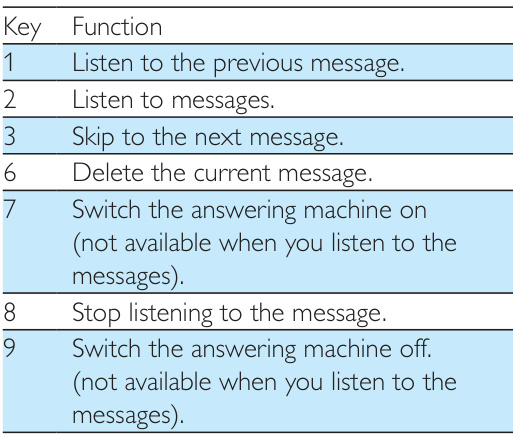

The table below shows you the current status with different LED indicator behavior on the base station. 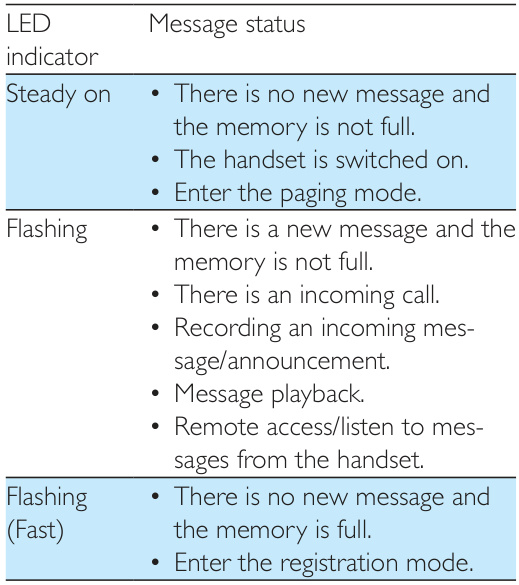

# Technical data and Notice

## Technical data

### General specification and features

**Product specifications overview**

• Talk time: 16 hours
• Standby time: 250 hours
• Range indoor: 50 meters
• Range outdoor: 300 meters
• Phonebook list with 50 entries
• Redial list with 20 entries
• Call log with 50 entries
• Answering machine with up to 30 minutes recording time
• Caller identification standard support: FSK, DTMF

**Battery**

• 2 x AAA Ni-MH 1.2V 650 mAh rechargeable batteries

### Base and charger

**Power adapter**
• MEIC: MN-A102-U130, input: 100-240 V\~, 50/60 Hz 200 mA, output: 6 Vdc 400 mA
• Tenpao: S003IB0600040, input: 100-240 V\~, 50/60 Hz 150 mA, output: 6 Vdc 400 mA

**Power consumption**

• Power consumption in idle mode: around 0.70 W (XL490), 0.75 W (XL495)

### Weight and dimensions (XL490)
• Handset: 142g (with Battery) $183.5\times53\times30.5\;\mathsf{m m}\;(\mathsf{H}\times\mathsf{W}\times\mathsf{D})$
• Base: 87 grams $57.5\times125.5\times85\;\mathsf{m m}\;(\mathsf{H}\times\mathsf{W}\times\mathsf{D})$
• Charger: 56.0 grams $57.5\times94\times85\;\mathsf{m m}\;(\mathsf{H}\times\mathsf{W}\times\mathsf{D})$
57.5 x 94 x 85 mm (H x W x D)

### Weight and dimensions (XL495)
• Handset: $\uparrow42g$ (with Battery) $183.5\times53\times30.5\;\mathsf{m m}\;(\mathsf{H}\times\mathsf{W}\times\mathsf{D})$
• Base: 106 grams $57.5\times125.5\times85\;\mathsf{m m}\;(\mathsf{H}\times\mathsf{W}\times\mathsf{D})$
• Charger: 56.0 grams $57.5\times94\times85\;\mathsf{m m}\;(\mathsf{H}\times\mathsf{W}\times\mathsf{D})$

## Notice

### Declaration of conformity

**Regulatory and environmental notice overview**

Hereby, it is declared that this product is in compliance with the essential requirements and other relevant provisions of Directive 1999/5/EC.

### Use GAP standard compliance
The GAP standard guarantees that all DECT™ GAP handsets and base stations comply with a minimum operating standard irrespective of their make. The handset and base station are GAP compliant, which means they guarantee the minimum functions: register a handset, take the line, make a call and receive a call. The advanced features may not be available if you use them with other makes. To register and use this handset with a GAP compliant base station of different make, first follow the procedure described in the manufacturer's instructions, then follow the procedure described in this manual for registering a handset. To register a handset from different make to the base station, put the base station in registration mode, then follow the procedure described in the handset manufacturer's instructions.

### Compliance with EMF
This product complies with all applicable standards and regulations regarding exposure to electromagnetic fields.

### Disposal of your old product and battery
Your product is designed and manufactured with high quality materials and components, which can be recycled and reused.
This symbol on a product means that the product is covered by European Directive 2012/19/EU.
This symbol means that the product contains batteries covered by European Directive 2013/56/EU which cannot be disposed of with normal household waste.
Inform yourself about the local separate collection system for electrical and electronic products and batteries. Follow local rules and never dispose of the product and batteries with normal household waste. Correct disposal of old products and batteries helps prevent negative consequences for the environment and human health.

**Removing the disposable batteries**

To remove the disposable batteries, see the chapter "Frequently asked questions".

### Environmental information
When this logo is attached to a product, it means a financial contribution has been paid to the associated national recovery and recycling system.
All unnecessary packaging has been omitted. We have tried to make the packaging easy to separate into three materials: cardboard (box), polystyrene foam (buffer) and polyethylene (bags, protective foam sheet.)
Your system consists of materials which can be recycled and reused if disassembled by a specialized company. Please observe the local regulations regarding the disposal of packaging materials, exhausted batteries and old equipment.

## Appendix: Text and number input tables

**Character and number mapping tables**

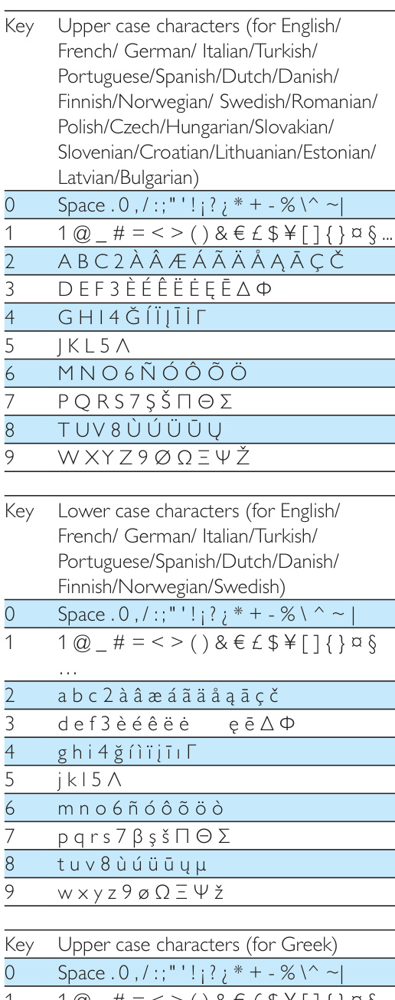 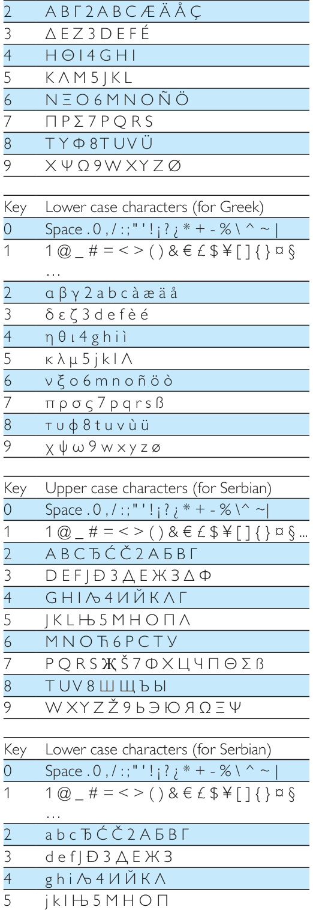 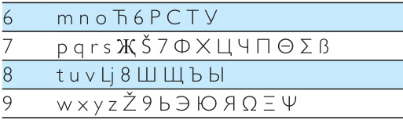

# Frequently asked questions

## Troubleshooting questions

### No signal bar is displayed on the screen.
• • The handset is out of range. Move it closer to the base station.
• • If the handset displays [Register your Handset], put the handset on the base until the signal bar appears.
•• For further information, see the chapter 'Services', section 'Register additional handsets'.

### If I fail to pair (register) the additional handsets to the base station, what do I do?
Your base memory is full. Unregister the unused handsets and try again.
•• For further information, see the chapter 'Services', section 'Unregister the handsets'.

### My handset is in searching status, what do I do?
• Make sure that the base station has power supply.
• Register the handset to the base station.
• Move the handset closer to the base station.

### I have chosen a wrong language which I cannot read, what do I do?
1 Press to go back to the standby screen.
2 Press [Menu] to access the main menu screen.
3 One of the following texts appears on the screen:
4 Select it to access the language options.
5 Select your own language.

### The handset loses connection with the base or the sound is distorted during a call.
Check if the $\mathsf{E C O+}$ mode is activated. Turn it off to increase the handset range and enjoy the optimal call conditions.

**No dialing tone.**

Check your phone connections.
• The handset is out of range. Move it closer to the base station.

### No docking tone.
• • The handset is not placed properly on the base station/charger.
• • The charging contacts are dirty. Disconnect the power supply first and clean the contacts with a damp cloth.

### I am a hearing aid user, what do I do to improve the sound volume?
This phone is hearing aid compatible. This enables the phone to couple with the hearing aid device to amplify the sound and reduce noise interference (see 'Set the hearing aid compatibility' on page 24).

### I cannot change the settings of my voice mail, what do I do?
The voice mail service is managed by your service provider but not the phone itself. Contact your service provider to change the settings.

### The handset on the charger does not charge.
• • Make sure the batteries are inserted correctly.
• • Make sure the handset is placed properly on the charger. The battery icon animates when charging.
• • Make sure the docking tone setting is turned on. When the handset is placed correctly on the charger, you can hear a docking tone.
• • The charging contacts are dirty. Disconnect the power supply first and clean the contacts with a damp cloth.
• • Check the LED indicator of your handset for the charging status if [Menu] \> [Phone setup] \> [Charge status ] is selected.
• • Batteries are defective. Purchase new ones with the same specifications. To remove the battery door, refer to the instruction in the following picture.
•• If the above solutions do not help, disconnect the power supply from both the handset and base station. Try again after 1 minute. 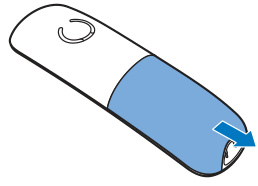

**No display.**

• • Make sure the batteries are charged.
• • Make sure there is power and the phone is connected.

### Bad audio (crackles, echo, etc.).
• • The handset is nearly out of range. Move it closer to the base station.
• • The phone receives interference from the nearby electrical appliances. Move the base station away from them.
• • The phone is at a location with thick walls. Move the base away from them.

**The handset does not ring.**

Make sure the handset ringtone is turned on.

### The caller ID does not display.
• • The service is not activated. Check with your service provider.
• • The caller's information is withheld or unavailable.
