# Pressure Cooker

### Model Scope

MULTI-USE PRESSURE COOKER AND AIR FRYER-5.7 AND 8 LITRE

## Welcome to the world of Cooking

### Welcome and Cooking Resources

As the new owner, we'd like to welcome you. We are committed to helping home chefs worldwide to cook healthier, and get delicious meals on the table, quicker and easier than ever before. Our multi functional cooking appliances will ignite your passion for making mealtimes amazing. We have created a world of cooking resources to help you on your journey to create a variety of culinary masterpieces at home. Full Manual, How-to Videos, FAQs and more available. Download the Multi-use pressure cooker and air fryer App with 1000+ recipes to access recipe ideas. 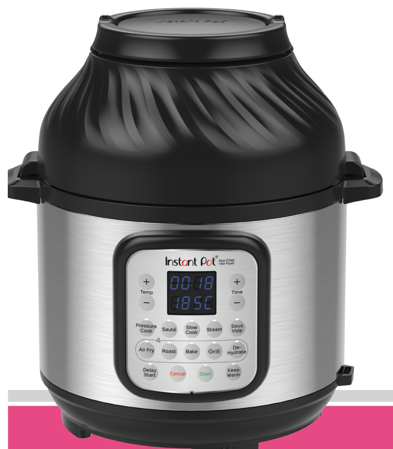

### Community, Support and Appliance Overview

Subscribe to our e-newsletter to receive regular recipe e-books and find your next dinner favourite. Join other home chefs on the Multi-use pressure cooker and air fryer UK community on Facebook for tips, tricks, and inspiration from the recipes they have created. And of course, we want to hear from you, so don't forget to tag us online. Say hello to the healthy and convenient alternative to deep frying. The Multi-use pressure cooker and air fryer is the best of all possible worlds. With 11-in-1 functionality it does everything a regular Multi-use pressure cooker and air fryer does but swap out the pressure cooker lid for the innovative air fryer lid, and you've got a whole new set of cooking techniques available-all fast, easy and at the touch of a button. Clear the clutter from your counter and do it all with just one tool. If you have any comments or queries, please get in touch with us via the helpdesk. You may also find the Frequently Asked Questions page on our website useful, which answers common Pressure Cooking questions. Finally, don't forget to register your appliance online.

## Product Specifications

### Specification Images

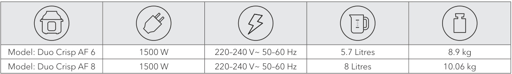
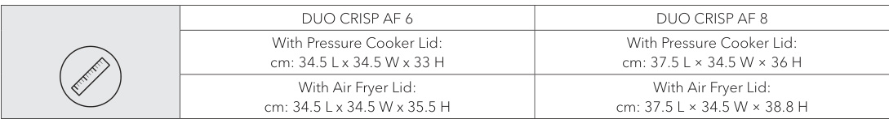

## Product, Parts and Accessories

### Parts Overview and Lid Components

See Care, cleaning and storage: Removing and installing parts to find out how everything fits together.
Top of pressure cooking lid 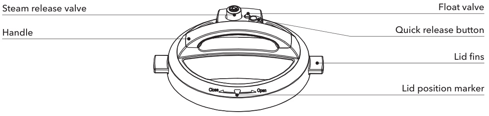
Bottom of pressure cooking lid 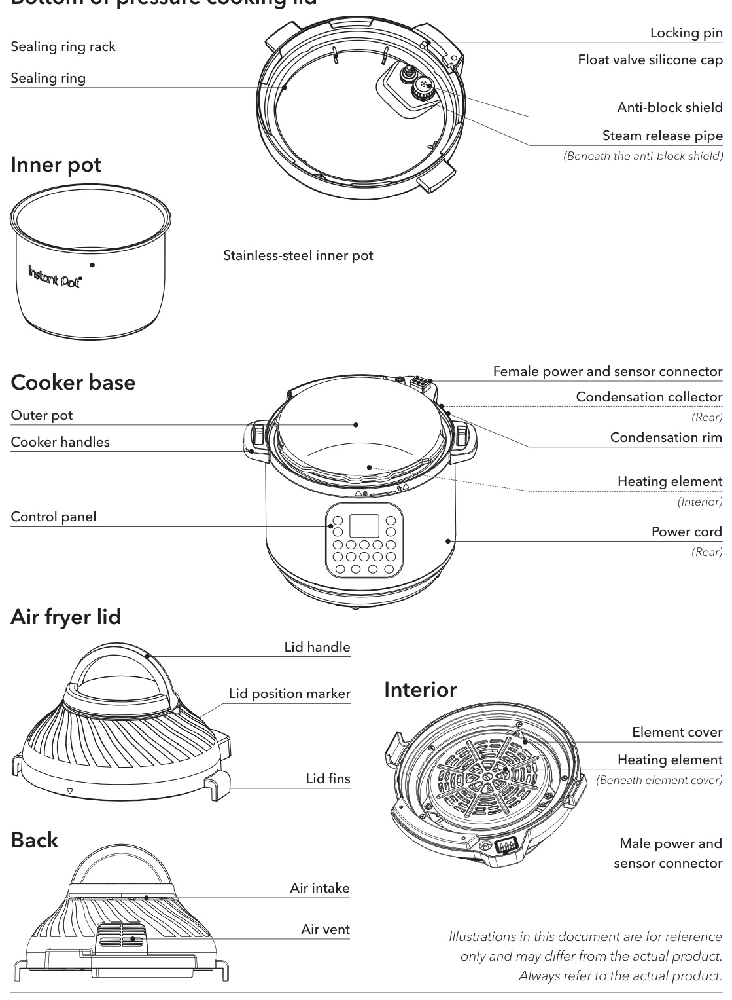
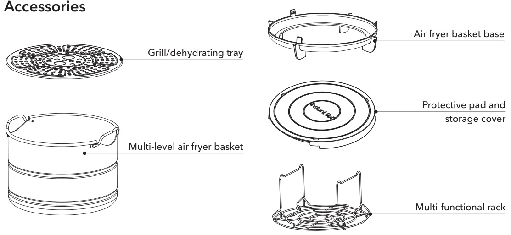

# Important Safeguards

### Safety Scope and Operating Premise

CEUK (Yes, we have to)

Your safety always comes first. It was designed with your safety in mind, and we mean business. Checkout this Multi-use pressure cooker and air fryer's long list of safety mechanisms to see what we mean. When using electrical appliances, basic safety precautions should always be followed:

01 READ THIS ENTIRE DOCUMENT BEFORE OPERATING THE APPLIANCE. FAILURE TO FOLLOW THESE SAFEGUARDS AND INSTRUCTIONS MAY RESULT IN INJURY AND/OR PROPERTY DAMAGE.
02 Use only the Multi-use pressure cooker and air fryer pressure cooking lid and air fryer lid with the Multi-use pressure cooker and air fryer cooker base. Using any other pressure cooking lids or air fryer lids may cause injury and/or damage.
03 To reduce the risk of pressure leakage, cook only in an authorized stainless-steel Multi-use pressure cooker and air fryer inner pot. DO NOT use the appliance without the removable inner pot installed.
04 Always use an Multi-use pressure cooker and air fryer stainless-steel inner pot when using the air fryer lid. DO NOT use a ceramic coated inner pot.
### Pressure Opening and Depressurization Safety

05 A CAUTION When pressure cooking, do not open the appliance until it has de pressurized, and all internal pressure has been released. If the float valve is still up and/or the lid is difficult to open, this indicates that the appliance is still pressurized—do not force it open. Any pressure in the appliance can be hazardous. Refer to Releasing pressure: Venting methods for information on releasing pressure. Opening the appliance while it is still pressurized may lead to sudden release of hot contents and may cause burns or other injuries.
06 Always operate the appliance on a stable, non-combustible, level surface.
07 Do not use the appliance for anything other than its intended use. Failure to follow this instruction may result in injury or property damage.
08 For household use only. Do not use outdoors. Not for commercial use.
### Placement, Heat Source and Water Exposure

09 A CAuTioN Do not place the appliance on or in close proximity to a hot gas or electric burner, or a heated oven. Heat from an external source will damage the appliance. Failure to follow these instructions may result in injury or property damage.
10 A CAUTION Do not use the appliance near water or flame. Keep out of direct sunlight. Failure to follow these instructions may result in injury or property damage.
11 A CAUTION Do not touch hot surfaces. Only use side handles for carrying or moving. Extreme caution must be used when moving the appliance containing hot liquids. Do not move the appliance when it is under pressure.
12 A CAUTION The cooker base and air fryer lid contain electrical components. To avoid electrical shock, do not put liquid of any kind into cooker base or air fryer lid, and do not immerse power cord, plug, or the appliance in water or other liquid. Do not rinse the appliance under tap.
### Filling Limits and Pressure-Cooking Closure

13 A CAUTION Do not fill over PC MAX — 2/3 as indicated on the inner pot. When cooking foods that expand during cooking such as rice or dried vegetables, do not fill the inner pot over — 1/2 line. Over filling may cause a risk of clogging the steam release pipe and developing excess pressure. Refer to Cooking: Pressure Cook and Steam.
14 A WARNING This appliance cooks under pressure. Make certain the appliance is properly closed before operating. Failure to do so may result in burns, injury and/or property damage. Refer to Pressure Control Features: Pressure Cooking Lid - Closing the lid.
15 When cooking meat with skin (e.g., sausage with casing), the skin can swell when heated. Do not pierce the skin while it is swollen; this could result in scalding injury.
16 A CAUTION When pressure cooking food with a doughy or thick texture, or a high fat/oil content, contents may splatter when opening the lid. Please follow recipe instructions for pressure release method. Refer to Releasing pressure: Venting methods.
### Steam Release Components and Pressure Hazards

17 A CAUTION Before using the pressure cooking lid, check the steam release valve, steam release pipe, anti-block shield and float valve for clogging. Failure to do so may result in injury or property damage.
18 Do not use this appliance for deep frying or pressure frying with oil.
19 Do not lean over or place your hands or face over the steam release valve or float valve when the appliance is in operation or has residual pressure. Do not touch the metal portion of the lid when the appliance is in operation as this could result in injury.
20 Do not cover or obstruct the steam release valve and/or the float valve with cloth or any other objects. Covering or obstructing the steam release valve and/or float valve can create a safety issue and may cause injury.
### Abnormal Steam Escape and Power Disconnection

21 Turn the appliance off if steam escapes from the steam release valve and/or float valve in a steady stream for longer than 3 minutes. There may be residual pressure in the appliance. Allow the appliance to de pressurize naturally or release all excess pressure before opening. Refer to Releasing pressure: Venting methods for information on safe de pressurization.
22 Turn the appliance off if steam escapes from the sides of the lid and ensure sealing ring is properly installed. Refer to Care, cleaning and storage: Removing and installing parts for information on checking the sealing ring.
23 To disconnect, press Cancel, then remove plug from power source.
24 Unplug from the outlet when not in use, as well as before adding or removing parts or accessories, and before cleaning. To unplug, grasp the plug and pull from the outlet. Never pull from the power cord.
### Cord Safety and Power Supply Restrictions

25 Regularly inspect the appliance and power cord. Do not operate the appliance if the power cord or plug is damaged, or after the appliance malfunctions or is dropped or damaged in any manner. For assistance, contact Customer Care.
26 A CAUTION Spilled food can cause serious burns. A short power supply cord is provided to reduce the hazards resulting from grabbing, entanglement and tripping. Keep the appliance and cord away from children. Never drape the power cord over edges of tables or counters. Never use below-counter power outlets, and never use with an extension cord.
27 A CAUTION Do not let the power cord hang over edges of tables or counters, or touch hot surfaces or open flame, including the stovetop.
28 Intended for counter top use only. Keep the appliance on a stable heat-resistant platform. Do not place on anything that may block the vents on the bottom of the cooker base or on the air fryer lid. Leave at least 13 cm of space around the air fryer lid when in use. Do not place the appliance on a hot stove. Do not operate the appliance on or near combustible materials such as tablecloths and curtains.
### Air Fryer Ventilation and Authorized Accessories

29 A CAUTION Do not cover the air vents while the air fryer lid is in operation. Doing so will prevent even cooking and may cause damage to the appliance.
30 A CAUTION Do not use any accessories or attachments not authorized. The use of attachments not recommended by the manufacturer may cause a risk of injury, fire or electric shock.
31 A CAUTION Before inserting the inner pot into the appliance, wipe the outer surface of the inner pot as well as the heating element, located at the bottom of the interior of the cooker base, with a clean dry cloth. Ensure they are dry and free of debris. Refer to Care, Cleaning and Storage. Failure to do so may result in injury or property damage.
### Repairs, Safety Mechanisms and Electrical Limits

32 Do not attempt to repair, replace or modify components of the appliance as this may cause electric shock, fire or injury, and will void the warranty.
33 Do not tamper with any of the safety mechanisms as this may result in injury or property damage.
34 Avoid contact with moving parts as this may result in injury.
35 Do not use the appliance in electrical systems other than 220-240V\~  $50/60\,\mathsf{H z}$  . Do not use with power converters or adapters.
### Children, Sealing Ring and Routine Checks

36 This appliance is NOT to be used by children or by persons with reduced physical, sensory or mental capabilities. Close supervision is necessary when any appliance is used near children and these individuals. Children should not play with this appliance.
37 To prevent personal injury and damage to the appliance, only replace the sealing ring with an authorized Multi-use pressure cooker and air fryer sealing ring. Visit our online store for purchasing details.
38 The use of accessory attachments not recommended by the appliance manufacturer may cause injuries.
39 Proper maintenance is recommended before and after each use:
· Check the steam release valve, steam release pipe, anti-block shield and float valve on the pressure cooking lid for clogging;
· Check the heating element and element cover on the air fryer lid for grease and food debris;
· Prior to inserting the inner pot into the multi cooker base, make sure both parts are dry and free of food debris;
· Let the appliance cool to room temperature before cleaning or storage. Do not allow children to clean or maintain the unit. See Care, cleaning and storage for more information.
### Air Fryer Capacity, Timers and Hot Accessories

40 When using the air fryer lid, do not overfill the air fryer basket. Over filling may cause food to contact the heating element, which may result in fire and/or personal injury.
41 Never connect this appliance to an external timer switch or separate remote-control system.
42 A CAUTION DO NOT touch accessories during or immediately after cooking. To avoid personal injury, Always use heat-resistant hand protection when removing accessories, and to handle the inner pot. Always place hot accessories on a heat-resistant surface or cooking plate. Only place the air fryer lid on the protective pad provided; do not place on counter top. Use extreme caution when disposing of hot grease. Failure to do so may result in serious injury or property damage.
43 While cooking, the internal temperature of the appliance reaches several hundred degrees. To avoid personal injury, never place unprotected hands inside the appliance until it has cooled to room temperature.
### Hot Air, Smoke and Unattended Operation

44 A CAUTION When the air fryer lid is in operation, hot air is released through the air vents. Keep your hands and face at a safe distance from the air vents and take extreme caution when removing hot accessories from the appliance. Failure to do so may result in injury or property damage.
45 Should the unit emit black smoke when using the air fryer lid, press Cancel and unplug the appliance immediately. Wait for smoking to stop before removing the lid, then clean thoroughly. For further information refer to Troubleshooting online.
46 Do not leave the appliance unattended while in use.
47 A CAUTIoN Extreme caution must be used when the inner pot contains hot food, hot oil or other hot liquids. Improper use, including moving the air fryer lid or cooker base, may result in personal injury. Do not move the appliance while it is in use.
### Food Size, Storage and Accessory Restrictions

48 Oversized foods and/or metal utensils must not be inserted into the inner pot or air fryer basket as they may cause risk of fire and/or personal injury.
49 Do not store any materials in the cooker base or inner pot when not in use.
50 Do not place any combustible materials in the cooker base or inner pot such as paper, cardboard, plastic, Styrofoam or wood.
51 Do not use the included accessories in a microwave, toaster oven, convection or conventional oven, or on a ceramic cook top, electric coil, gas range, or outdoor grill.
### Heavy Inner Pot and Lid Removal Heat Risk

52 The removable inner pot can be extremely heavy when full of ingredients. Care should be taken when lifting the inner pot from the cooker base to avoid burn injury.
53 Use caution when removing the lid. Heat and steam escape as soon as the lid is removed. Never place your face, hands or exposed skin over the appliance opening where heat and steam escape when removing the lid.

### Model Identification, Warnings and Cord Set Instructions

SAVE THESE INSTRUCTIONS. Find your model name and serial number. Model Name: Find it on the rating label on the back of the cooker base, near the power cord. Serial Number: You can find the serial number on a white sticker near the rating label. WARNING Read this manual carefully and completely and retain for future reference. Failure to adhere to safety instructions may result in serious injury or damage. WARNING To avoid injury, read and understand the instructions in this user manual before attempting to use this appliance. A WARNING Electrical shock hazard. Use grounded outlet only. DO NOT remove ground. DO NOT use an adapter. DO NOT use an extension cord. Failure to follow these instructions may result in electric shock and/or serious injury. A WARNING THE FAILURE TO FOLLOW ANY OF THE IMPORTANT SAFEGUARDS AND/OR THE INSTRUCTIONS FOR SAFE USE IS A MISUSE OF YOUR APPLIANCE THAT CAN VOID YOUR WARRANTY AND CREATE THE RISK OF SERIOUS INJURY. Special cord set instructions: Per safety requirement, a short power supply cord is provided to reduce the hazards resulting from entanglement and tripping. This appliances comes with one power lead. To reduce the risk of electric shock, plug the power lead into an earthed and easily accessible electric socket.

# Getting Started

## Initial Setup

### Unboxing, Washing and Base Placement

Initial setup (It won't bite\!) You-yes, you-can do this\! Pull that out of the box\! Always use a stainless-steel inner pot, not the non-stick ceramic coated variety, with the air fryer lid. Remove the packaging material and accessories from in and around the cooker and make sure all the parts are accounted for. See Product, parts and accessories for a full parts breakdown. Make sure to check under the inner pot\! Wash the inner pot in a dishwasher or with hot water and dish soap. Rinse it well with warm, clear water and use a soft cloth to thoroughly dry the outside of the inner pot. Wipe the heating element with a soft, dry cloth to make sure there are no stray packaging particles left in the cooker base.
· Don't remove the safety warning stickers from the lid or the rating label from the back of the cooker base.
You may be tempted to put the on your stovetop - but don't do it\! Place the cooker base on a stable, level surface, away from combustible material and external heat sources. Is something missing or damaged? ### Troubleshooting Reference

Get in touch with a Customer Care Advisor by email.

### Initial Setup Warnings

WARNING Read the Important safeguards before using the appliance. Failure to read and follow those instructions for safe use may result in damage to the appliance, property damage or personal injury. Do not place the appliance on a stovetop or upon another appliance. Heat from an external source will damage the appliance. Do not place anything on top of the appliance, and do not cover or block the steam release valve or anti-block shield, located on the appliance lid.

## Initial Test Run (Water Test)

### Water Test Purpose and Preparation

Do you have to do the water test? No - but getting to know the ins and outs of your prepares you for success in the kitchen\! Take a few minutes to get to know how this baby works.
### Water Test Step-by-Step Procedure

01 Remove the inner pot from the cooker base and add $750\;\mathrm{{mL}}$ of water to the inner pot, then place it back into the cooker base.
02 Connect the power cord to a 220-240V power source. The display shows OFF.
03 Place and close the pressure cooking lid as described in Pressure control features: Pressure cooking lid.
04 Select Pressure Cook.
05 Use the $-\,/\,+$ Time buttons to adjust the cooking time to 5 minutes (00:05).
06 Press Keep Warm to turn the automatic Keep Warm setting off.
07 Press Start. The display shows On. While the cooker does its thing, read Pressure cooking 101 on the next page to find out how the magic happens.
08 When the Smart Program finishes, the display shows End.
09 Follow instructions for a Quick Release in Releasing pressure: Venting methods.
### Water Test Steam and Lid Safety

A CAUTIoN Pressurized steam releases through the top of the steam release valve. Keep exposed skin away from the steam release valve.
10 Wait for the float valve to drop then carefully open and remove the lid as described in Pressure control features: Pressure cooking lid.
A DANGER DO NOT attempt to remove the lid while the float valve is up and NEVER attempt to force the lid open. Contents are under extreme pressure. Float valve must be down before attempting to remove the lid. Failure to follow these instructions may result in serious personal injury and/or property damage.
### Water Test Completion

11 Using proper hand protection, remove the inner pot from the cooker base, discard the water and thoroughly dry the inner pot.
A CAUTION The inner pot will be hot after cooking. Always use appropriate heat protection when handling a hot inner pot. That's it\! You're good to go :)

# Pressure Cooking 101

### Three Stages of Pressure Cooking

When pressure cooking, the goes through 3 stages.
Pre-heating 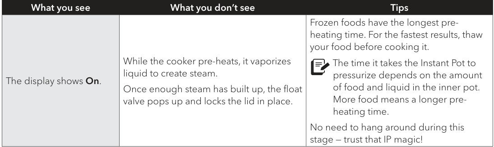
Cooking 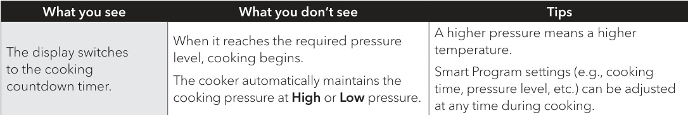
De pressurization 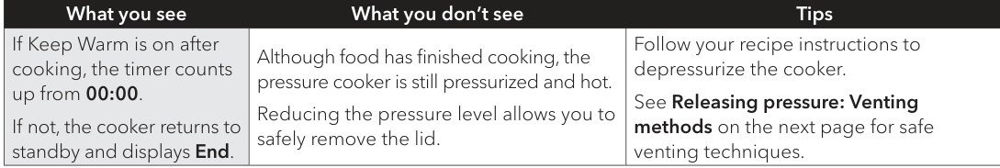

### Pressure Release Safety Notices

\! DANGER DO NOT attempt to remove the lid while the float valve is up and NEVER attempt to force the lid open. Contents are under extreme pressure. Float valve must be down before attempting to remove the lid. Failure to follow these instructions may result in serious personal injury and/or property damage.
WARNING Steam ejected from the steam release valve is hot. DO NOT cover the steam release valve. DO NOT place hands, face, or any exposed skin over the steam release valve when releasing pressure.
NOTICE Do not use QR when cooking fatty, oily, thick or high-starch foods (e.g., stews, chilis, pasta and congee) or when cooking foods that expand when cooked (e.g. beans and grains).

## Releasing Pressure and Venting Methods

You must release pressure after pressure cooking before attempting to open the lid. Follow your recipe's instructions to choose a venting method.

### Natural Release Method

Natural Release (NR or NPR)
Cooking stops gradually. As the temperature within the cooker drops, the cooker de pressurizes naturally over time. 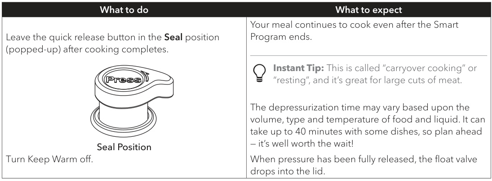
NOTICE Use NR to de pressurize the cooker after cooking high-starch foods (e.g., soups, stews, chilis, pasta, oatmeal and congee) or after cooking foods that expand when cooked (e.g., beans and grains).

### Quick Release Method

Quick Release (QR or QPR)
Stops cooking quickly and prevents overcooking. Perfect for quick-cooking vegetables and delicate seafood\!
What to do: Press the quick release button down until it clicks and locks into the Vent position. 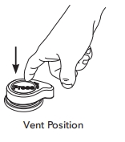
What to expect: When pressed down, a jet of steam ejects through the top of the steam release valve. This is normal\! When pressure has been fully released, the float valve drops into the lid. 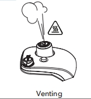

## Control Panel

### Control Panel Reference

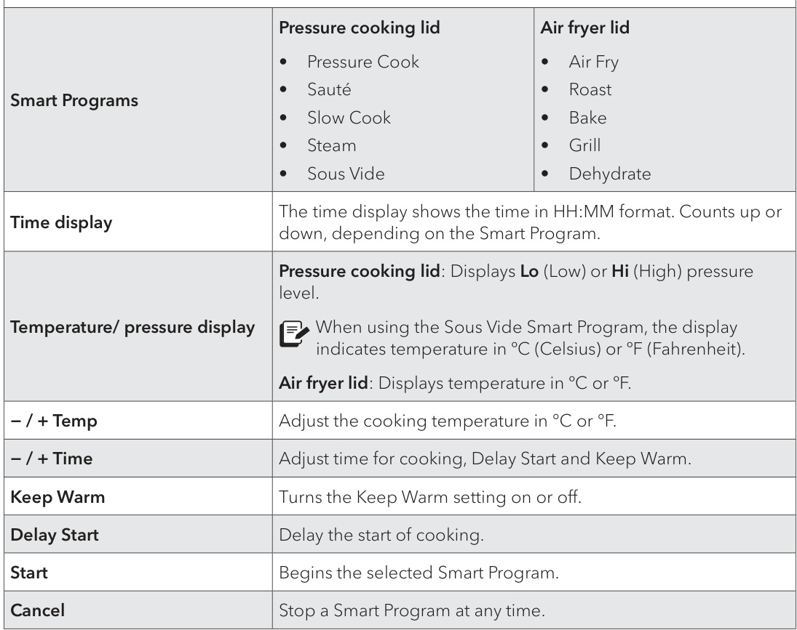 View the full user manual online.

## Pressure Control Features (Your little bag of tricks!)

See Care, cleaning and storage for installation and removal of parts.

### Pressure Cooking Lid Setup: Removing the Lid and Closing the Lid

Pressure cooking lid 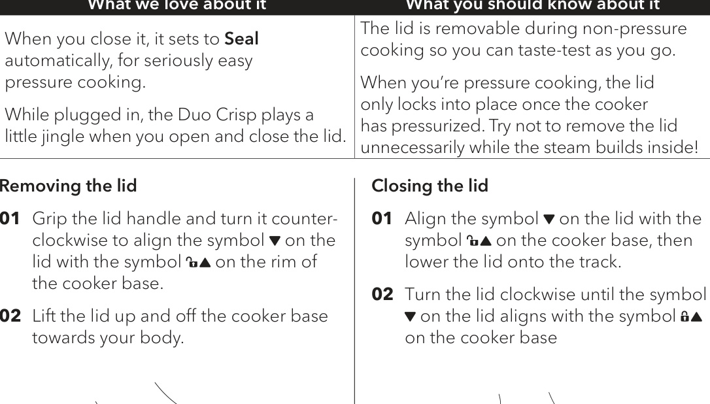

**Removing the lid**
01 Grip the lid handle and turn it counterclockwise to align the symbol on the lid with the symbol on the rim of the cooker base.
02 Lift the lid up and off the cooker base towards your body. 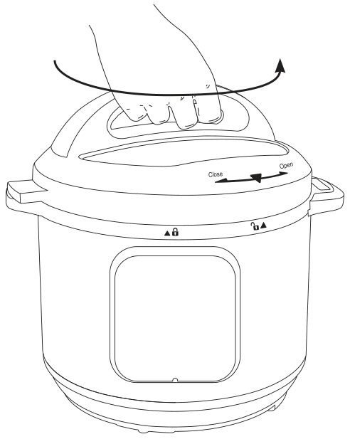

**Closing the lid**
01 Align the symbol on the lid with the symbol on the cooker base, then lower the lid onto the track.
02 Turn the lid clockwise until the symbol on the lid aligns with the symbol on the cooker base. 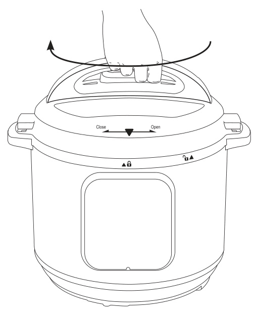

### Quick Release Button Function

Quick release button
The quick release button controls the steam release valve - the part controls whether pressure is released or not. 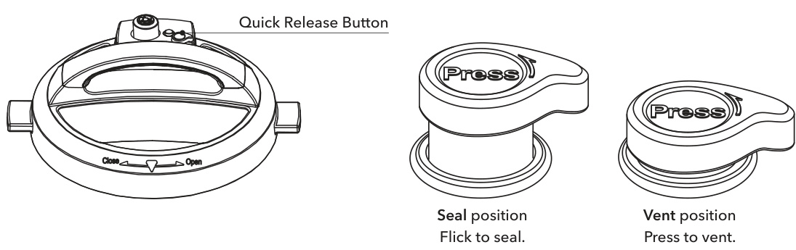
What we love about it: It's really easy to use, and keeps our hands far away from the steam\!
What you should know about it: The lid says Turn to Seal, but it's more like a flicking motion. Don't turn the quick release button more than $\%\^{\prime\prime}$ (or $45^{\circ}$, and let it spring back to its original position. See Releasing pressure: Venting methods for safe de pressurization techniques.

### Steam Release Valve Function

Steam release valve
The steam release valve sits loosely on the steam release pipe. When the cooker releases pressure, steam ejects from the top of the steam release valve. The steam release valve is integral to product safety and necessary for pressure cooking. 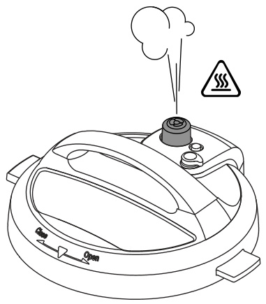
A WARNING Do not cover or block the steam release valve in any way.

### Sealing Ring Function and Replacement

Sealing ring
When the pressure cooking lid is closed, the sealing ring creates an air-tight seal between the lid and the inner pot. The sealing ring must be installed before using the cooker. Only one sealing ring should be installed in the lid at a time. Tip: Silicone is porous, so it absorbs strong aromas and certain flavors. Keep extra sealing rings on hand to limit the transfer of aromas and flavors between dishes. 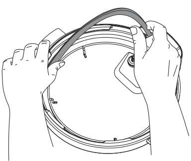
CAUTION Only use authorized Multi-use pressure cooker and air fryer sealing rings. DO NOT use a stretched or damaged sealing ring.
· Always check for cuts, deformation and correct installation of the sealing ring before cooking.
· Sealing rings stretch over time with normal use. The sealing ring should be replaced every 12-18 months or sooner if you notice stretching, deformation or damage. Failure to follow these instructions may cause food to discharge, which may lead to personal injury or property damage.

### Float Valve Pressure Indicator

Float Valve
The float valve is a visual indication of whether there is pressure in the cooker (pressurized) or not (de pressurized). It appears in 2 positions:
Pressurized: The float valve has visibly popped up above the surface of the lid. 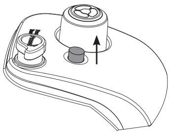
De pressurized: The float valve has descended, and the top is flush with the lid. 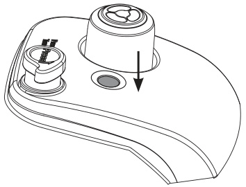
The float valve and silicone cap work together to seal in pressurized steam. These parts must be installed before use. Do not attempt to operate the Multi-use pressure cooker and air fryer without the float valve properly installed. Do not touch the float valve during use.
DANGER DO NOT attempt to remove the lid while the float valve is up and NEVER attempt to force the lid open. Contents are under extreme pressure. Float valve must be down before attempting to remove the lid. Failure to follow these instructions may result in serious personal injury and/or property damage.

### Anti-Block Shield Function

Anti-block shield
The anti-block shield prevents food particles from coming up through the steam release pipe, assisting with pressure regulation. The anti-block shield is integral to product safety and necessary for pressure cooking. 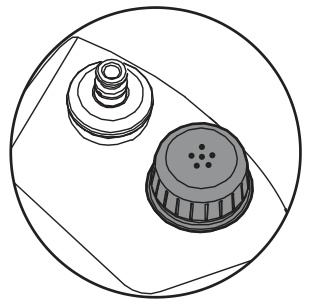

# Cooking

### Cooking Mode Overview

The pot is super versatile in the kitchen - whether you want to pressure cook first and use the air fryer lid to crisp up your dish, or if you'd prefer to cook your meal just using the air fryer lid - you can\!

## Pressure Cooking Lid & Air Fryer Lid Programs

### Pressure Lid and Air Fryer Lid Program List

Pressure Cook • Sauté • Slow Cook • Steam • Sous Vide 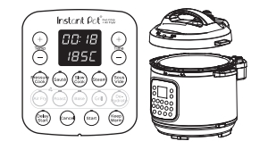
Air fryer lid: Air Fry • Roast • Bake • Grill • Dehydrate 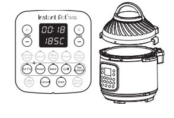
Tip: A jingle sounds when the lids are in the correct position, and the display indicates OFF.

### Program Filling and Inner Pot Safety

WARNING Do not fill inner pot higher than the PC MAX — 2/3 line as indicated on the inner pot. When cooking foods that expand (e.g., rice, beans, pasta) do not fill the inner pot higher than the —1/2 line as indicated on the inner pot. Always cook with the inner pot in place. Do not pour food or liquid into the cooker base. To avoid risk of personal injury and/or property damage, place food and liquid ingredients in the inner pot, then insert the inner pot into the cooker base.
A CAUTION Always inspect the lid and inner pot carefully to make sure they are clean and in good working condition before use.
· To avoid personal injury or damage to the appliance, replace the inner pot if it is dented, deformed or damaged.
· Use only authorized Multi-use pressure cooker and air fryer inner pots made for this model when cooking.
Always make sure the heating element is clean and dry before inserting the inner pot into the cooker base. Failure to follow these instructions may damage the cooker. Replace damaged parts to make sure safe function.

## Pressure Cook and Steam

### Pressure Cook and Steam Function

The Pressure Cook and Steam Smart Programs are pressure cooking programs. Using pressurized steam ensures your dish is cooked evenly and deeply, for predictably delicious results every time. The pot features 2 pressure levels to choose from: 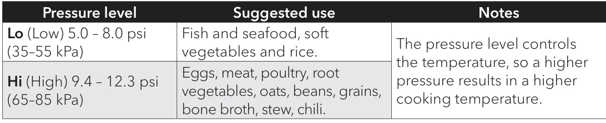  *Unless otherwise specified by your recipe.
### Pressure Cooking Liquids and Oil Limits

Liquids for pressure cooking should be water-based, such as broth, stock, soup or juice. If using canned, condensed or cream-based soup, add water as directed below.
CAUTION To avoid scorching or scalding injury, be cautious when pressure cooking with more than 60 mL oil, oil-based sauces, condensed cream-based soups, and thick sauces. Add suitable liquid to thin sauces. Avoid recipes that call for more than 1/4 cup 60mL of oil or fat content.

### Pressure Cooking Procedure and Venting

To get pressure cooking, follow the same basic steps as you did in the Initial test run (water test) - but add food this time\! Tip: Using the multi-functional rack will ensure your food items are steamed and not boiled. It helps heat food evenly, prevents nutrients from leeching into the cooking liquid, and stops food items from scorching on the bottom of the inner pot. When the Smart Program finishes, follow your recipe's directions to select the appropriate venting method. See Releasing pressure: Venting methods for safe venting techniques. Find full instructions for use and pressure cooking timetables online.
DANGER DO NOT attempt to remove the lid while the float valve is up and NEVER attempt to force the lid open. Contents are under extreme pressure. Float valve must be down before attempting to remove the lid. Failure to follow these instructions may result in serious personal injury and/or property damage.

## Slow Cook, Saute and Sous Vide

### Slow Cook Program

Slow Cook
The Slow Cook Smart Program is comparable to the cooking process of traditional slow cookers, and is compatible for use with any of your slow cooker recipes. Follow recipe directions for slow cooking. The float valve should not rise during Slow Cook. The lid is removable throughout the cooking process for easy access. If the float valve rises, make sure the quick release button is set to the Vent position. Refer to Releasing pressure: Venting methods. 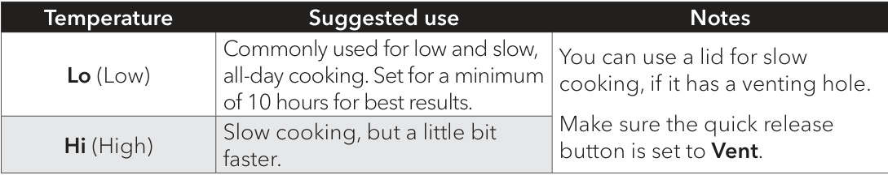 Find full instructions for use online.

### Saute Program

Saute
Sauté can be used in place of a frying pan, griddle or flat-top grill. Sautéing meat and vegetables before pressure cooking is the perfect way to boost flavors. 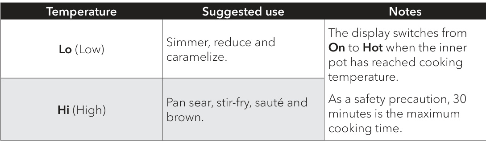
When pressure cooking after using Sauté, deglaze the inner pot to make sure food items do not scorch. To deglaze: remove food items from the inner pot and add a thin liquid (e.g., water, broth, wine) to the hot surface. Use a wooden or silicone scraper to loosen anything that may be stuck to the bottom of the inner pot. Find full instructions for use online.
WARNING The Saute Smart Program reaches high temperatures. If un monitored, food may burn on this setting. Do not use the lid and do not leave your cooker unattended while using Saute.

### Sous Vide Program

Sous Vide
Sous Vide cooking involves cooking food underwater, in an air-tight, food-safe bag for a long period of time. Food cooks in its own juices and comes out delicious and unbelievably tender. 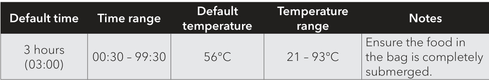 Find full instructions for use and sous vide cooking tips and timetables online.

## Air Fry, Roast, Bake, Grill and Dehydrate

### Air Fryer Lid Use Overview

Using the air fryer lid is an amazing way to ramp up your meal's flavor and texture.
NOTICE If the Food burn error appears while using the air fryer lid, deglaze the bottom of the inner pot as necessary, according to Cooking: Saute instructions.
A CAUTION Always ensure the stainless-steel inner pot is present in the cooker base when using the air fryer lid. DO NOT use a non-stick ceramic coated inner pot. 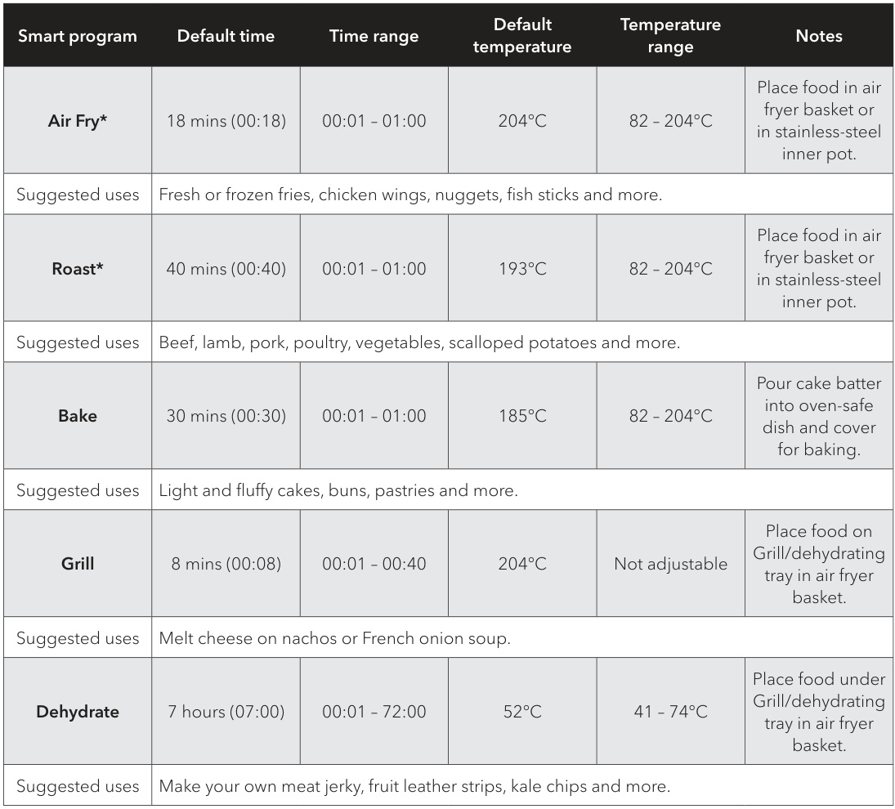
*You can place food in the air fryer basket, in any oven-safe dish, or directly in the stainless-steel inner pot, but the air fryer basket allows for the best airflow and an even crisp all over.

### Air Fryer Lid Step-by-Step Procedure

01 Insert food into the multi-level air fryer basket, oven-safe cookware, or directly into the inner pot, according to your recipe. If using an accessory, insert the accessory into the inner pot.
02 Insert the stainless-steel inner pot into the cooker base.
03 Place the air fryer lid on the cooker base by lining up the lid fins and inserting them into the base handles. Press the lid down to ensure the power and sensor connectors are in full contact with each other. 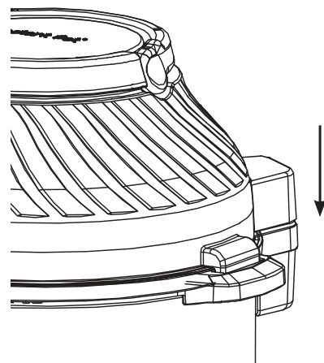
A CAUTION If the power and sensor parts are not fully connected, you may get a Lid message or C9 error. Failure to ensure a proper connection could result in damage to the cooker.
04 Select a Smart Program: Air Fry, Grill Bake, Roast or Dehydrate.
05 Use the $+\,/\,-$ buttons to adjust the Time and Temperature.
06 Press Start. The display shows On as the air fryer lid Preheats. After preheating, the display changes to the set time and counts down. During Air Fry and Roast, the cooker beeps partway through cooking and the display shows turn Food.
07 If you need to remove the lid, carefully lift the air fryer lid off the cooker base and place it on the protective pad provided. Lifting the lid automatically pauses cooking.
08 Carefully turn, flip, or rotate your food, then place the air fryer lid back on the cooker base to resume cooking.
### Air Fryer Lid Turning and Completion Safety

A CAUTION The inner pot and accessories will be hot during and after cooking. To avoid injury, use hand protection and do not touch the inner pot accessories with bare skin. Some food doesn't need to be flipped. If you don't remove the lid after the turn food indicator appears, cooking continues after 10 seconds.
09 When one minute remains, the display counts down by seconds. When the Smart Program completes, the cooker beeps and the display shows End.

### Air Fryer Settings and Status Messages

Settings 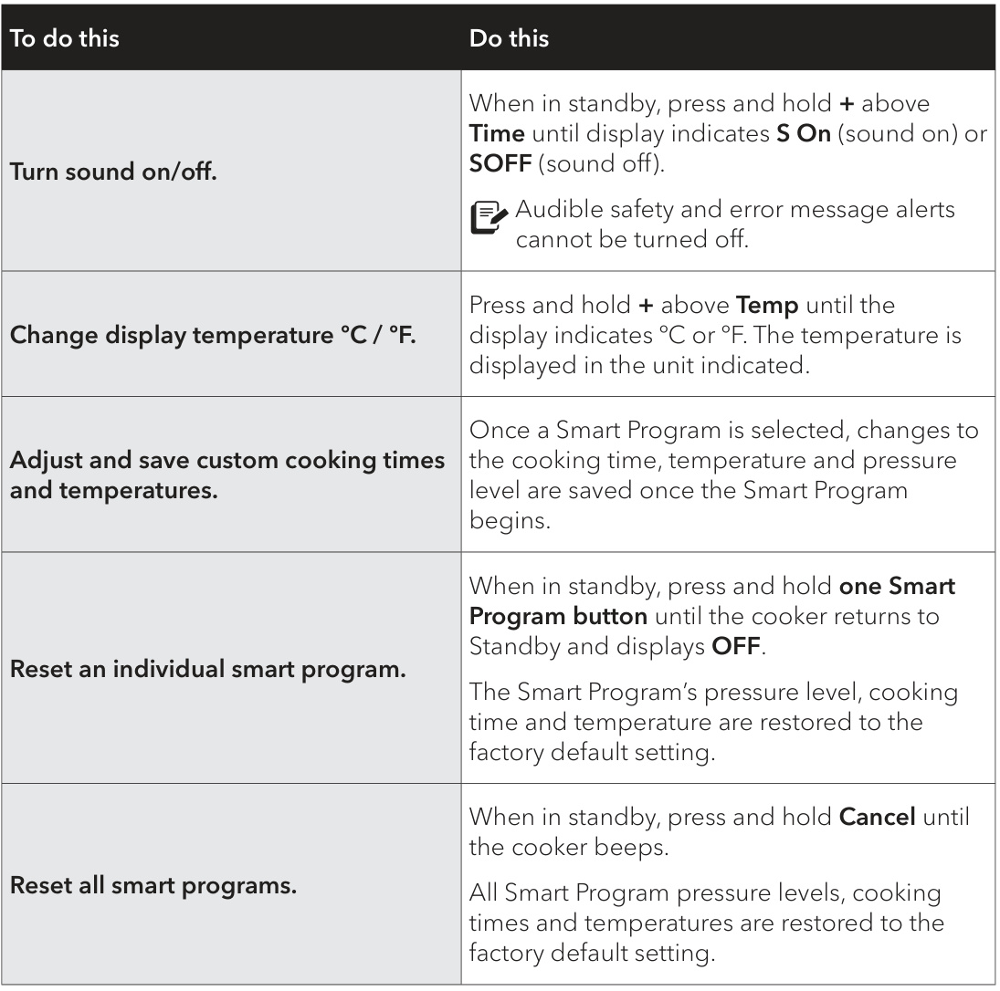
Status messages 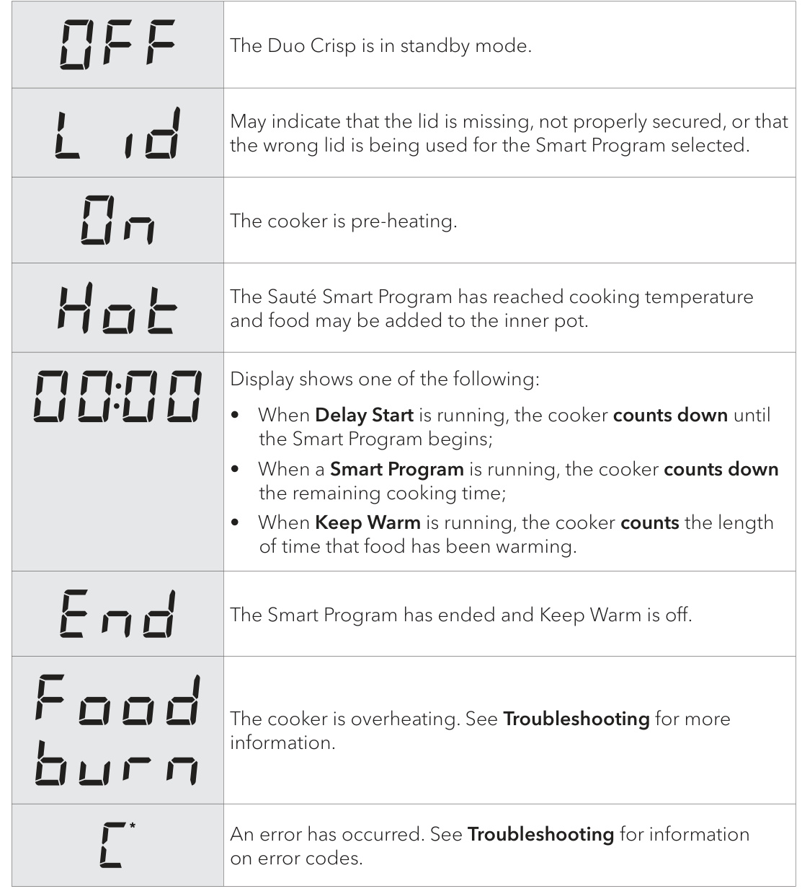

# Care, Cleaning and Storage

### Cleaning Frequency and General Rules

Clean your and its parts after each use. Failure to follow these cleaning instructions may result in catastrophic failure, which may lead to property damage, severe personal injury and/or death. Always unplug your cooker and let it cool to room temperature before cleaning. Never use metal scouring pads, abrasive powders or harsh chemical detergents on any of the pot's parts or accessories. Let all surfaces dry thoroughly before use, and before storage. 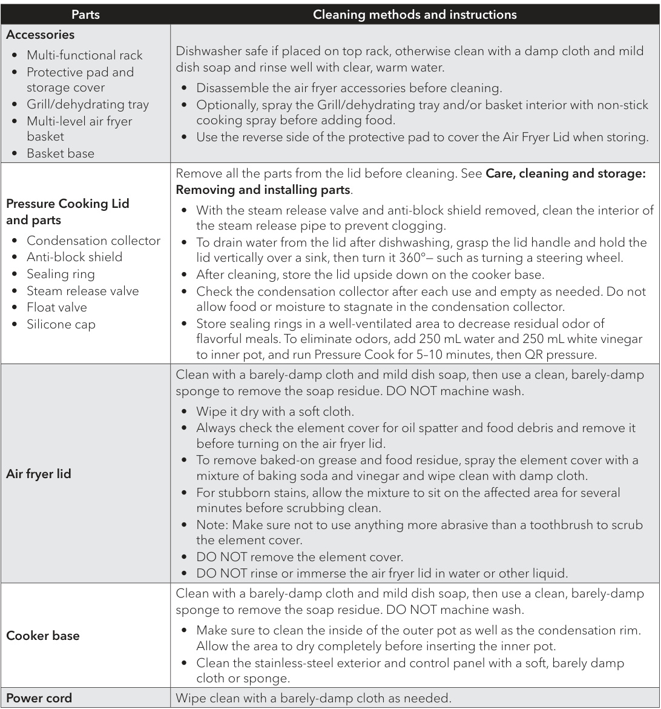
Some discoloration may occur after machine washing, but this will not affect the cooker's safety or performance.

### Electrical Cleaning Warnings

\! WARNING The Multi-use pressure cooker and air fryer cooker base contains electrical components. To avoid fire, electric leakage or personal injury, make sure the cooker base stays dry.
· DO NOT immerse the cooker base in water or other liquid, or attempt to cycle it through the dishwasher.
· DO NOT rinse the heating element.
· DO NOT submerge or rinse the power cord or the plug.

## Removing and Installing Parts

### Silicone Sealing Ring Removal and Installation

Silicone sealing ring
Remove the sealing ring: Grip the edge of the silicone and pull the sealing ring out from behind the circular stainless-steel sealing ring rack. With the sealing ring removed, inspect the steel rack to make sure it is secured centered, and an even height all the way around the lid. Do not attempt to repair a deformed sealing ring rack. The sealing ring is easiest to remove and install when it is wet and soapy. 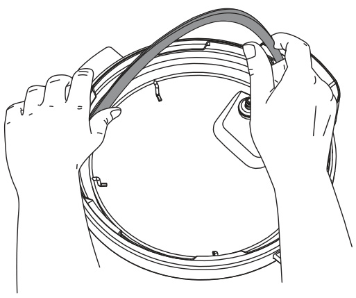
Install the sealing ring: Place the sealing ring over the sealing ring rack and press it into place. Press down firmly to prevent puckering. When installed properly, the sealing ring is snug behind sealing ring rack and should not fall out when the lid is turned over. 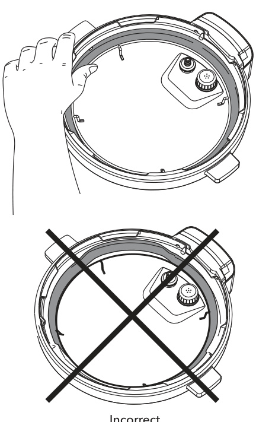

### Steam Release Valve: Remove and Install on Steam Release Pipe

Steam release valve
Remove the steam release valve: Pull the steam release valve up and off the steam release pipe. The steam release valve must be installed before using the cooker. 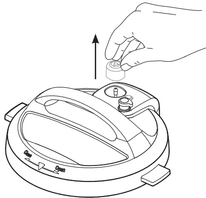
Install the steam release valve: Place the steam release valve on the steam release pipe and press down firmly. The steam release valve sits loosely on the steam release pipe when installed properly but should remain in place when the lid is turned over. 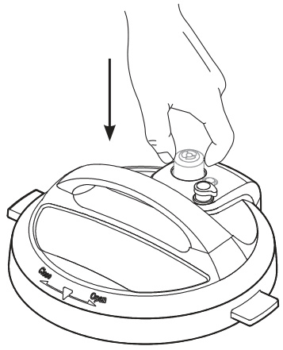

### Anti-Block Shield Removal and Installation

Anti-block shield
Remove the anti-block shield: Grip the lid like a steering wheel and use your thumbs to press firmly against the side of the anti-block shield (pressing towards the side of the lid and up) until it pops off the prongs underneath. 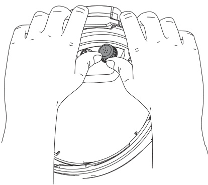
Install the anti-block shield: Place the anti-block shield over the prongs and press down until it snaps into position. Do not attempt to operate the pressure cooker without the anti-block shield installed. 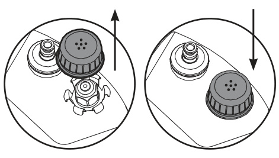

### Float Valve and Silicone Cap Removal and Installation

Float valve and silicone cap
Remove the float valve from the lid: Place one finger on the flat top of float valve, then turn the lid over. Detach the silicone cap from the bottom side of the float valve. Remove the float valve from the top of the lid. Do not discard the float valve or silicone cap. 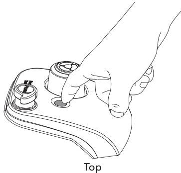
Install the float valve: Drop the narrow end of the float valve into the float valve hole on the top of the lid. Place one finger on the flat top of the float valve, then turn the lid over. Firmly attach the silicone cap to the bottom of the float valve. Do not attempt to operate the pressure cooker without the float valve and/or silicone cap properly installed in the pressure cooking lid. 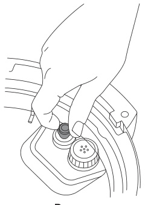

### Condensation Collector Removal and Installation

Condensation collector
The condensation collector sits at the back of the cooker base and catches any overflow from the condensation rim. It should be installed before cooking, then emptied and rinsed out after each use.
Remove the condensation collector: Pull the condensation collector away from the cooker base; do not pull down. Note the tabs on the cooker base and the grooves on the condensation collector.
Install the condensation collector: Align the grooves on the condensation collector over the tabs on the back of the cooker base and slide the condensation collector into place. 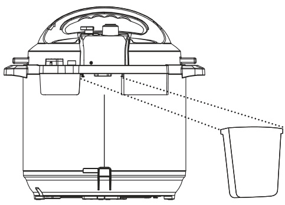

## Troubleshooting

Get in touch with a Customer Care Advisor by email. View the full Troubleshooting table online.
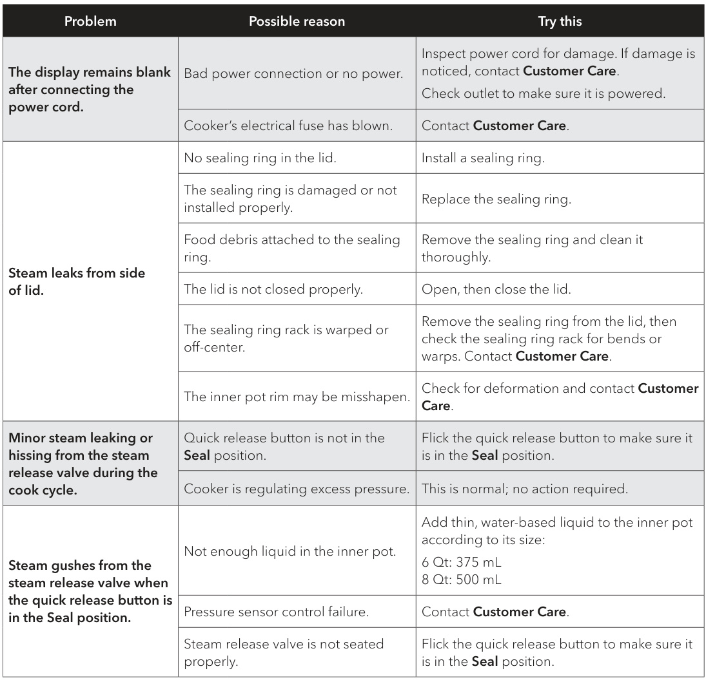
Troubleshooting 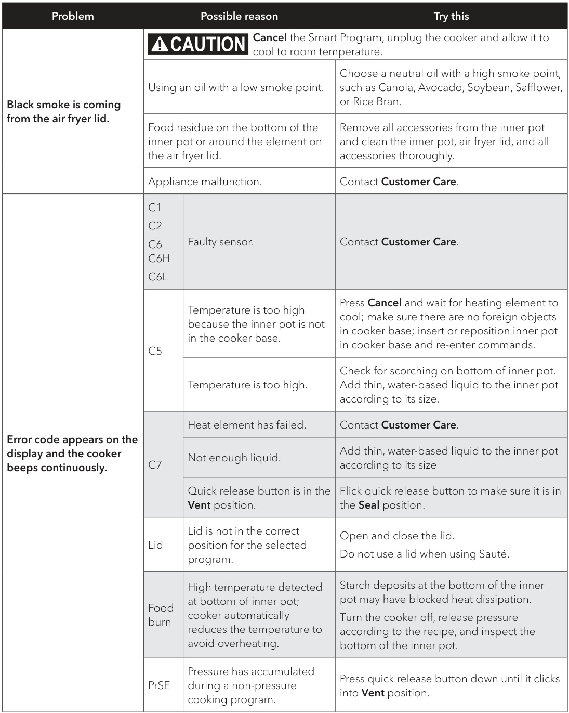
Any other servicing must be performed by an authorized representative.

# Warranty and Recycling

## Limited Warranty

### Warranty Coverage and Replacement Terms

It warrants this appliance to be free from defects in workmanship and material, under normal household use, for a period of one (1) year from the date of original purchase. This Limited Warranty extends only to the original purchaser and use of the appliance in the UK. This warranty does not cover appliance use outside of the UK. Proof of original purchase date and, if requested, return of your appliance is required to obtain service under this Limited Warranty. Provided that this appliance is operated and maintained in accordance with the written instructions included with the appliance (which are also available), the Company will, at its sole discretion, either: (i) repair defects in materials and workmanship; or (ii) replace the appliance. In the event the appliance is replaced, the Limited Warranty on the replacement appliance will expire 12 months from the date of original consumer purchase. The Company is not responsible for shipping costs for warranty service.

## Limitation and Exclusions

### Warranty Exclusions

Any modification or attempted modification to your appliance may interfere with the safe operation of the appliance and may result in serious injury and damage. Any modification or attempted modification to your appliance or any part thereof will void the warranty, unless such modification(s) or alteration(s) were expressly authorised by the Company. This warranty does not cover (1) normal wear and tear; (2) damage resulting from negligent, unreasonable or misuse of the appliance, improper assembly or disassembly, use contrary to the operating instructions, failure to provide reasonable and necessary maintenance, Acts of God (such as fire, flood, hurricanes and tornadoes), or repair or alteration by anyone, unless expressly directed and authorised by the Company; and (3) repairs where your appliance is used for other than normal household use and in a manner contrary to published user or operator instructions.

### Liability Limitations

To the extent permitted by applicable law, the liability of the Company, if any, for any allegedly defective appliance or part shall be limited to repair or replacement of the appliance or part thereof, and shall not exceed the purchase price of a comparable replacement appliance. Except as expressly provided herein and to the extent permitted by law, (1) the Company makes no warranties conditions or representations, express or implied, usage, custom of trade or otherwise with respect to the appliance or parts covered by this warranty and (2) the Company shall not be responsible or liable for indirect, incidental or consequential damages arising out of or in connection with the use or performance of the appliance or damages with respect to any economic loss, loss of property, loss of revenues or profits, loss of enjoyment or use, costs of removal, installation or other consequential damages of any nature or kind. You may have rights and remedies under applicable laws, which are in addition to any right or remedy which may be available under this limited warranty.

## Warranty Registration and Service

### Warranty Registration Requirements

Please register your appliance. You will be asked to provide your name, your email address, the store name, date of purchase, model number and serial number (both of which are found on the appliance). This registration will enable us to keep you up-to-date with product developments and recipes, and contact you in the unlikely event of a product safety notification. By registering, you acknowledge that you have read and understood the instructions for use and warnings accompanying the appliance.
### Warranty Service Materials

Warranty Service requires:
· Your name, email address or phone number
· A copy of the original purchase receipt with order number, model and serial number
· A description of the product defect, including any photographs or video if possible
This warranty was last updated on 1 September 2019 for all products sold from [1 November 2019]. If your product comes with our older warranty version, your warranty will continue to be honoured.

## Recycling

### Recycling and Compliance

This appliance complies with the WEEE Directive 2012/19/EU on the disposal of electrical and electronic equipment (WEEE). This appliance complies with the European directive for electromagnetic compatibility (EMC) 2014/30/EU and its revisions, as well as Low Voltage Directive (LVD) 2014/35/EU and its revisions. This marking indicates that this product should not be disposed of with other household waste throughout the EU. To prevent possible harm to the environment or human health from uncontrolled waste disposal, recycle it responsibly to promote the sustainable re-use of material sources. To return your used device, please use the return and collection systems or contact Customer Care for further recycling and WEEE information. 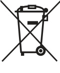