# Snowmobile
## Machine Identification
### Identification Number Record
Identification numbers record.
A. FRAME NUMBER: 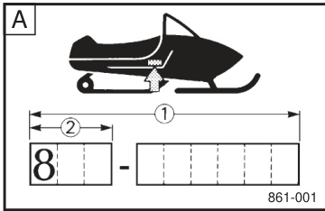
B. ENGINE NUMBER (PRIMARY I.D.): 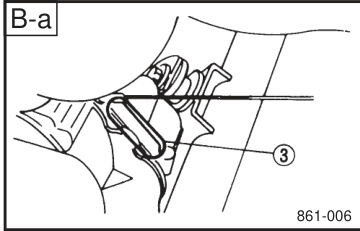 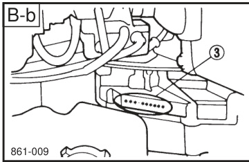 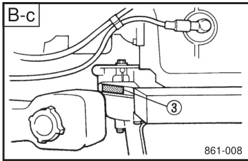 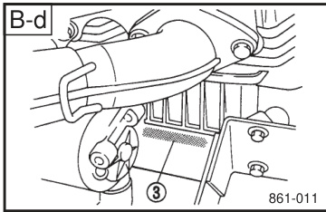
C. KEY NUMBER:
Record your frame number, engine number (Primary I.D.) and key number in the spaces provided, to assist you in ordering spare parts from your dealer.
$\textcircled{1}$ The frame number is the nine-digit number stamped on the frame of the machine. (See Fig.A)
$\circledcirc$ The model code number is the first three digits of the frame number. (See Fig.A)
$\textcircled{3}$ The engine number is stamped in the location as shown. (See Fig.B)
$\textcircled{4}$ Key number (See Fig.)
Also, record and keep these I.D. numbers in a separate place in case your machine is stolen. 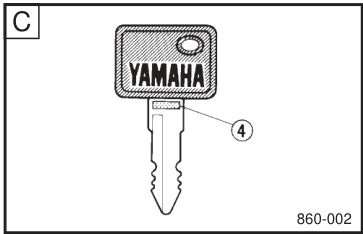

## Introduction
### Manual Purpose and Dealer Support
Congratulations\! Your choice of a snowmobile assures you of the highest quality and dependability. Your snowmobile is manufactured by a company well known for excellence in the field of snowmobiles. The most advanced production equipment and technology have made one of the best machine manufacturers. We are confident that this snowmobile will meet the greatest expectations of our customers. This manual is designed to acquaint you with the operation of this snowmobile and minor maintenance required for satisfactory service.

Should major repairs ever be required, you are advised to consult a nearby dealer who has the techniques, tools and parts to ensure your satisfaction. We hope that the information within this booklet will help you enjoy many hours of pleasure with your snowmobile.

PLEASE READ AND UNDERSTAND THIS MANUAL COMPLETELY BEFORE OPERATING THE MACHINE.

### Mandatory Reading Notice
NOTE: We continually seek advancements in product design and quality. Therefore, while this manual contains the most current product information available at the time of printing, there may be minor discrepancies between your machine and this manual. If there is any question concerning this manual, please consult your dealer. This manual should be considered a permanent part of this machine and should remain with this machine when resold.

Particularly important information is distinguished in this manual by the following notations. The Safety Alert Symbol means ATTENTION\! BECOME ALERT\! YOUR SAFETY IS INVOLVED\!

### Product Information Notice / Safety Notation Definitions

**Product Information Notice**

WARNING: Failure to follow WARNING instructions could result in severe injury or death to the machine operator, a bystander, or a person inspecting or repairing the machine.

**Safety Notation Definitions**

CAUTION: A CAUTION indicates special precautions that must be taken to avoid damage to the machine.

NOTE: A NOTE provides key information to make procedures easier or clearer.

# Safety Information
## Location of the Important Labels
### Label Reading and Maintenance / Warning Label – General Operation

**Label Reading and Maintenance**

Please read the following labels carefully before operating this machine. 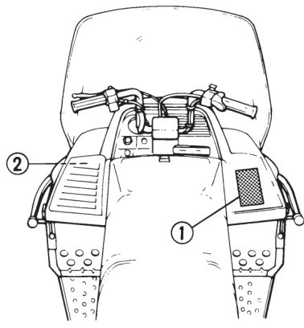
NOTE: Maintain or replace safety and instruction labels, as necessary.

**Warning Label – General Operation**

WARNING: SEVERE INJURY OR DEATH MAY RESULT IF YOU IGNORE ANY OF THE FOLLOWING:
· Read the Owner's Manual and all labels before operating this vehicle.
· Check throttle, brake, and steering for proper operation before starting engine.
· Set parking brake before attempting to start engine. Never run this vehicle with the parking brake applied.
· To stop engine in an emergency, push the engine stop switch down.
· Do not operate engine without drive belt or drive guard.
· Make sure the fuel tank cap is closed securely after refueling.
· Do not operate this vehicle on public roads. You could collide with another vehicle.
· This vehicle is designed for operator only-no passengers.
· Wear an approved helmet, eye protection, and adequate clothing for snowmobiling. 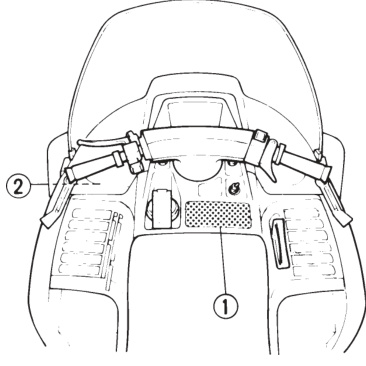

### Warning Label – Bilingual Operation Notice (CS340E)
WARNING / AVERTISSEMENT: SEVERE INJURY OR DEATH MAY RESULT IF YOU IGNORE ANY OF THE FOLLOWING:
· Read the Owner's Manual and all labels before operating this vehicle.
· Check throttle, brake, and steering for proper operation before starting engine.
· Set parking brake before attempting to start engine. Never run this vehicle with the parking brake applied.
· To stop engine in an emergency, push the engine stop switch down.
· Do not operate engine without drive belt or drive guard.
· Make sure the fuel tank cap is closed securely after refueling.
· Do not operate this vehicle on public roads. You could collide with another vehicle.
· This vehicle is designed for operator only-no passengers.
· Wear an approved helmet, eye protection, and adequate clothing for snowmobiling. 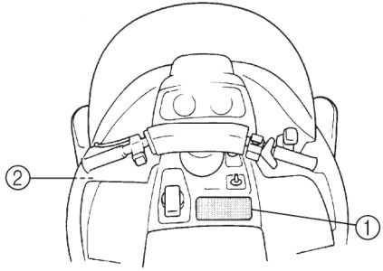 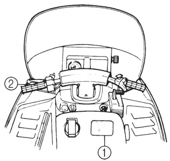

### Warning Label – Drive Selection and Operation / DRIVE SELECT LEVER LABEL

**Warning Label – Drive Selection and Operation**

WARNING: SEVERE INJURY OR DEATH MAY RESULT IF YOU IGNORE ANY OF THE FOLLOWING:
· Read the Owner's Manual and all labels before operating this vehicle.
· Check throttle, brake, and steering for proper operation before starting engine.
· Set parking brake before attempting to start engine. Never run this vehicle with the parking brake applied.
· To stop engine in an emergency, push the engine stop switch down.
· Do not operate engine without drive belt or drive guard.
· Make sure the fuel tank cap is closed securely after refueling.
· Do not operate this vehicle on public roads. You could collide with another vehicle.
· Check lever position (Forward or Reverse) before moving.
· Wear an approved helmet, eye protection, and adequate clothing for snowmobiling.
· Check lever position (Drive, Reverse, or Low) before moving.

**DRIVE SELECT LEVER LABEL**

· Read owner's manual carefully before operating.
· Before moving the drive select lever, make sure that the vehicle is at a full stop and that the throttle lever is fully released.
· Low range must not be used for speeds exceeding $50~\mathsf{K M/H}$.

## General Safety Guidelines
### General Guideline Overview / Before Operating – General Readiness and Controls

**General Guideline Overview**

When you ride your snowmobile, you must know and use the following for your safety. Severe injury or death may result if you ignore any of the following. 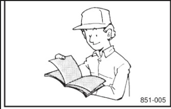 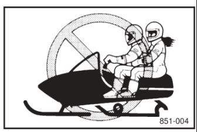 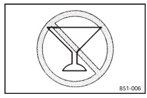

**Before Operating – General Readiness and Controls**

1.  Read the Owner's Manual and all labels before operating this machine. Become familiar with all of the operating controls and their function. Consult a dealer about any control or function you do not understand.
2.  This machine was not manufactured for use on public streets, roads, or highways. Such use is prohibited by law, and you could collide with another vehicle.
3.  BR 250 T and CS 340 E are designed to carry the OPERATOR ONLY. Passengers are prohibited. Carrying a passenger can cause loss of control.
4.  Do not operate the machine after drinking alcohol or taking drugs. Your ability to operate the machine is reduced by the influence of alcohol or drugs.
5.  For safety and proper care of the machine, always perform the pre-operation checks on page 6-1\~6-8 before starting the engine. Check the throttle steering and brake operation everytime before starting the engine. Be sure the throttle lever moves freely and it returns to the idle position when it is released.
6.  Apply the parking brake before starting the engine. Never drive the machine with the parking brake applied. This may overheat the brake disc and reduce braking ability.
7.  Do not allow anyone to stand behind the machine when starting, inspecting or adjusting the machine. A broken track, track fittings or debris thrown by the track could be dangerous to the operator or bystanders. 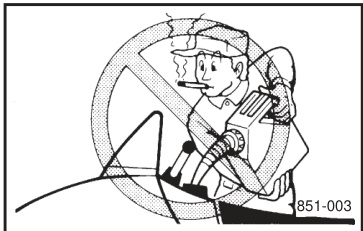

### Before Operating – Fuel Handling / Before Operating – Protective Clothing

**Before Operating – Fuel Handling**

8.  Handle fuel with care; it is highly flammable. Never add fuel when the engine is running or hot. Allow the engine to cool for several minutes after running. Use an approved fuel container. Fill the fuel tank outdoors with extreme care. Never remove the fuel cap indoors. Never fill the fuel tank indoors. Never refuel while smoking or in the vicinity of an open flame. Make sure the fuel tank cap is closed securely after refueling. Wipe up any spilled fuel immediately.
9.  If you swallow some gasoline, inhale a lot of gasoline vapor, or get some gasoline into your eye(s), see your doctor immediately. If any gasoline spills on your skin or clothing, immediately wash your skin with soap and water, and change your clothes. 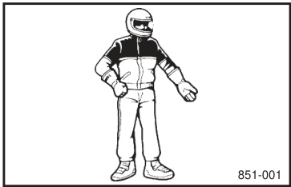 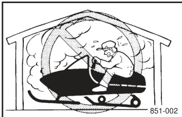

**Before Operating – Protective Clothing**

10. Wear protective clothing. Wear an approved helmet, and a face shield or goggles. Also, wear a good quality snowmobile suit, boots, and a pair of snowmobile gloves or mittens that will permit use of your thumbs and fingers for operation of the controls.

### Operation
1.  Do not run the engine indoors, except when starting the engine to transport the machine in or out of the building. Open the outside doors; exhaust fumes are dangerous.
2.  Be careful where you ride. There may be obstacles hidden beneath the snow. Stay on established trails to minimize your exposure to hazards. Ride slowly and cautiously when you ride off of established trails. Hitting a rock or stump, or running into wires could cause an accident and injury.
3.  This machine is not designed for use on surfaces other than snow or ice. Use on dirt, sand, grass, rocks, or bare pavement may cause loss of control and may damage the machine.
4.  Avoid operating on glare ice, or on snow which has a lot of dirt or sand mixed in. Operation under such conditions will damage or result in rapid wear of ski runners, drive track, slide runners and drive sprockets.
5.  Always have other snowmobilers with you when going on a ride. You may need help if you run out of fuel, have an accident, or damage your snowmobile.
6.  Many surfaces such as ice and hard-packed snow require much longer stopping distances. Be alert, plan ahead and begin decelerating early. The best braking method on most surfaces is to release the throttle and apply the brake gently-not suddenly.

### Maintenance and Storage
1.  Modifications made to the machine not approved by, or the removal of original equipment may render your machine unsafe for use and may cause severe personal injury. Modifications may also make your machine illegal to use.
2.  Never store the machine with fuel in the fuel tank inside a building where ignition sources are present such as hot water and space heaters, open flame, spark, clothes dryers, and the like. Allow the engine to cool before storing in any enclosure.
3.  Always refer to "STORAGE" for important details if the machine is to be stored for an extended period.
4.  Maintain or replace safety and instruction labels, as necessary.

## Machine Layout
### Machine Layout – Diagram Group 1 / Machine Layout – Diagram Group 2

**Machine Layout – Diagram Group 1**

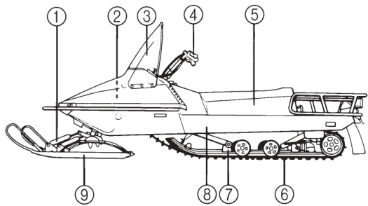 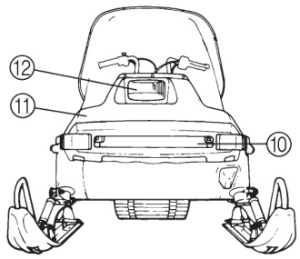 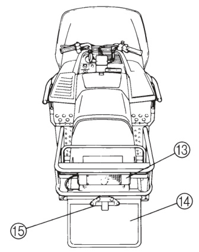
$\textcircled{1}$ Ski damper $\circledcirc$ Fuel cock lever $\textcircled{3}$ Windshield $\textcircled{4}$ Steering handlebar $\circledcirc$ Seat $\circledcirc$ Drive track $\textcircled{\scriptsize{2}}$ Slide rail suspension $\circledast$ Frame $\circledcirc$ Steering ski $\circledcirc$ Front baffle plate $\circledcirc$ Shroud $\circledcirc$ Headlight $\textcircled{3}$ Taillight $\textcircled{4}$ Flap $\textcircled{5}$ Tow hitch $\circledcirc$ Speedometer $\circledcirc$ Primer pump knob $\circledast$ Engine stop switch $\circledcirc$ Throttle lever $\circledcirc$ Starter handle $\circledcirc$ Shroud latch $\circledcirc$ Starter lever $\circledcirc$ Main switch $\circledast$ Headlight beam switch $\circledcirc$ Brake lever $\circledast$ Parking brake button 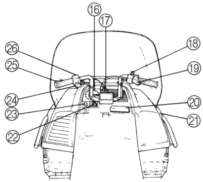 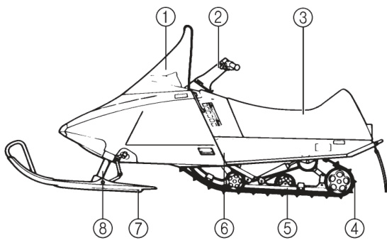 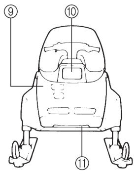 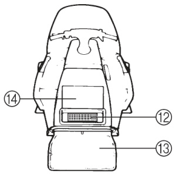

**Machine Layout – Diagram Group 2**

$\textcircled{1}$ Windshield $\circledcirc$ Steering handlebar $\textcircled{3}$ Seat $\textcircled{4}$ Drive track $\circledcirc$ Slide rail suspension $\circledcirc$ Frame $\textcircled{\scriptsize{2}}$ Steering ski $\circledast$ Telescopic strut suspension $\circledcirc$ Shroud $\circledcirc$ Headlight $\circledcirc$ Front baffle plate $\circledcirc$ Taillight $\textcircled{3}$ Flap $\textcircled{4}$ Luggage box $\textcircled{5}$ Speedometer $\circledcirc$ Engine stop switch $\circledcirc$ Throttle lever $\circledast$ Shroud latch $\circledcirc$ Main switch $\circledcirc$ Grip warmer switch $\circledcirc$ Starter handle $\circledcirc$ Starter lever $\circledcirc$ Headlight beam switch $\circledast$ Brake lever $\circledcirc$ Parking brake button 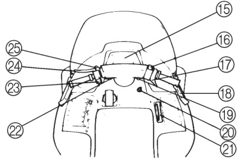 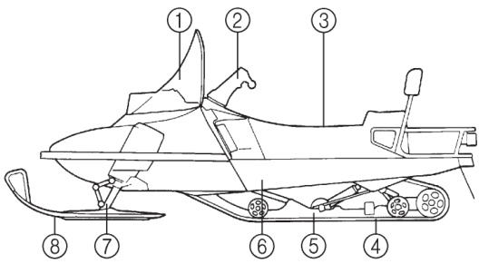 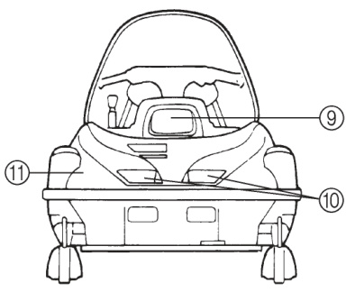 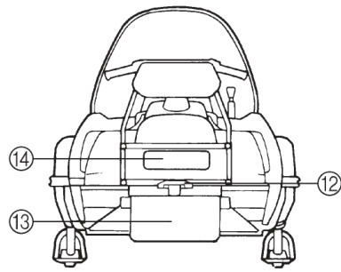

### Machine Layout – Diagram Group 3
$\textcircled{1}$ Windshield $\circledcirc$ Steering handlebar $\textcircled{3}$ Seat $\textcircled{4}$ Drive track $\circledcirc$ Slide rail suspension $\circledcirc$ Frame $\textcircled{\scriptsize{2}}$ Telescopic strut suspension $\circledast$ Steering ski $\circledcirc$ Headlight $\circledcirc$ Front baffle plate $\circledcirc$ Shroud $\circledcirc$ Tow hitch $\textcircled{3}$ Flap $\textcircled{4}$ Taillight $\textcircled{5}$ Brake lever $\circledcirc$ Parking brake button $\circledcirc$ Headlight beam switch $\circledast$ Odometer $\circledcirc$ Speedometer $\circledcirc$ Trip odometer $\circledcirc$ Engine stop switch $\circledcirc$ Throttle lever $\circledcirc$ Drive select lever (Shift lever) $\circledast$ Shroud latch $\circledcirc$ Grip warmer switch $\circledast$ Starter handle $\circledcirc$ Main switch $\circledast$ Trip odometer reset knob $\circledcirc$ Starter lever 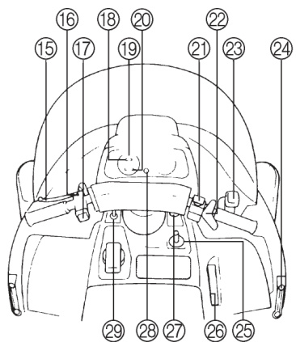 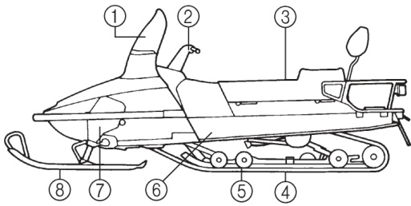 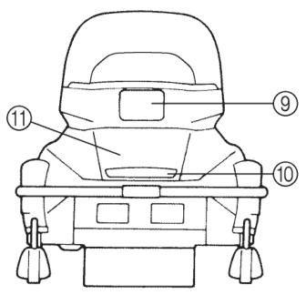 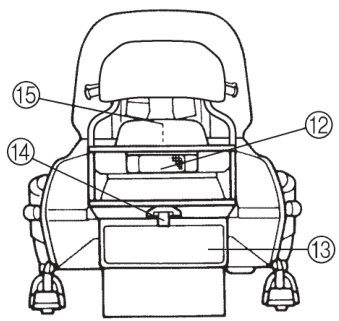

### Machine Layout – Diagram Group 4
$\textcircled{1}$ Windshield $\circledcirc$ Steering handlebar $\textcircled{3}$ Seat $\textcircled{4}$ Drive track $\circledcirc$ Slide rail suspension $\circledcirc$ Frame $\textcircled{\scriptsize{2}}$ Telescopic strut suspension $\circledast$ Steering ski $\circledcirc$ Headlight $\circledcirc$ Front baffle plate $\circledcirc$ Shroud $\circledcirc$ Taillight $\textcircled{3}$ Flap $\textcircled{4}$ Tow hitch $\textcircled{5}$ Luggage box $\circledcirc$ Headlight adjusting knob $\circledcirc$ Engine stop switch $\circledast$ Throttle lever $\circledcirc$ Drive select lever (Shift lever) $\circledcirc$ Main switch $\circledcirc$ Starter handle $\circledcirc$ Starter lever $\circledcirc$ Grip warmer switch $\circledast$ Headlight beam switch $\circledcirc$ Brake lever $\circledast$ Parking brake button 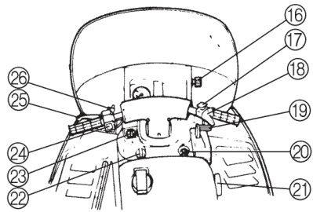

# Control Functions
## Ignition and Starting Controls
### MAIN SWITCH
The main switch controls the following items.
$\textcircled{1}$ OFF: Ignition circuit is switched off. The key can be removed only in this position.
ON: Ignition circuit is switched on. The engine can be started: Starting circuit is switched on. The starter motor starts. 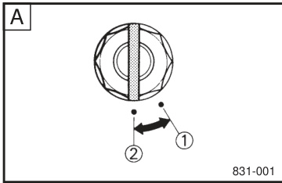 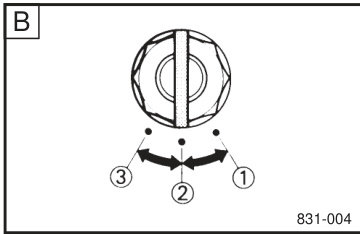 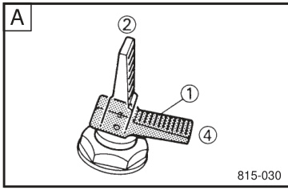 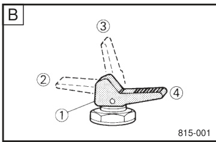
NOTE: The lights will come on after the engine starts.
CAUTION: Release the switch immediately after the engine starts.

### STARTER LEVER (CHOKE) / PRIMER PUMP KNOB (BR250T)

**STARTER LEVER (CHOKE)**

Use this lever when starting and warming up a cold engine.
$\textcircled{1}$ Starter lever (choke)
$\circledcirc$ When starting a cold engine.
$\textcircled{3}$ Warming up (CS340E/ET410TR/VK540E)
$\textcircled{4}$ When the engine is warm.
NOTE: Refer to STARTING THE ENGINE for proper operation. 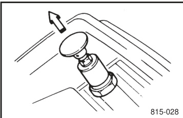 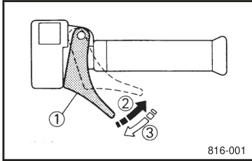

**PRIMER PUMP KNOB (BR250T)**

Pump the knob several times in low temperatures for easier engine starting.
CAUTION: Excessive use of the primer knob may flood the engine with fuel.

## Throttle and Brake Controls
### THROTTLE LEVER
Once the engine is running cleanly, squeezing $\circledcirc$ of the throttle lever $\textcircled{1}$ will increase the engine speed and cause engagement of the drive system. Regulate the speed of the machine by varying the throttle position. Because the throttle is spring-loaded, the machine will decelerate, and the engine will return to an idle when the thumb is released $\textcircled{3}$.
WARNING: Check throttle, brake, and steering for proper operation before starting engine.

### THROTTLE OVERRIDE SYSTEM (T.O.R.S.)
If the carburetor or throttle cable should malfunction during operation, release the throttle lever. The T.O.R.S. is designed to interrupt the ignition and stop the engine if the carburetor fails to return to idle when the lever is released.
WARNING: If T.O.R.S. stops the engine, make sure that the cause of the malfunction has been corrected and that the engine can be operated without a problem before restarting the engine. 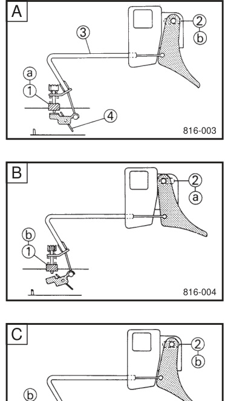 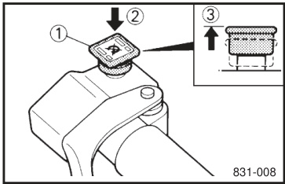
Idle or starting / Run / Trouble 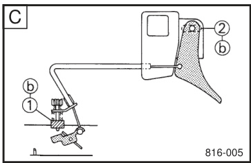
$\textcircled{1}$ Carburetor switch $\circledcirc$ Throttle switch $\textcircled{3}$ Throttle cable $\textcircled{4}$ Throttle valve $\circledcirc$ "ON" $\circledcirc$ "OFF" 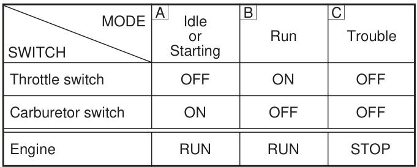

### ENGINE STOP SWITCH
The engine stop switch $\textcircled{1}$ is used to stall the engine in an emergency. Simply push $\circledcirc$ the engine stop switch, and the engine will stop. To start the engine, pull $\textcircled{3}$ the engine stop switch and see page 7-1\~7-2 for more details. During the first few rides, you should practice using the switch while driving so that you can react quickly in an emergency.

### Brake Lever and Parking Brake Button

**Brake lever**

The machine is stopped by braking the entire drive system. Squeeze the brake lever towards the handlebar to stop the machine.
$\textcircled{1}$ Brake lever $\circledcirc$ Brake lever end $\textcircled{3}$ Handlebar end
NOTE: When the brake is operated, the brake light will illuminate. 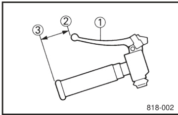
CAUTION: Be sure the brake lever end does not project out over the handlebar end. This will help prevent brake lever damage when the machine is placed on its side for service. 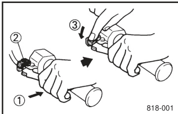

**Parking brake button**

When parking the machine or starting the engine, apply the parking brake. Squeeze the brake lever $\textcircled{1}$, then push down $\textcircled{3}$ the parking brake button $\circledcirc$ while releasing the brake lever. To release the parking brake, just squeeze the brake lever.
WARNING: Always set the parking brake before attempting to start the engine. Never run the machine with the parking brake applied. This may overheat the brake disc and reduce braking ability.

## Drive and Body Components
### DRIVE SELECT LEVER (SHIFT LEVER) (ET410TR)
The drive select lever is used to shift your machine into forward or reverse. After coming to a complete stop, move the lever to the desired direction.
$\textcircled{1}$ Drive select lever (Shift lever) 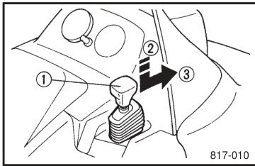 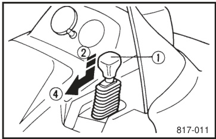 $\textcircled{3}$ Move to forward $\textcircled{4}$ Move to reverse 
CAUTION: Do not shift from "Forward" to "Reverse" or "Reverse" to "Forward" while the machine is moving. Otherwise the drive system could be damaged.

### DRIVE SELECT LEVER (SHIFT LEVER) (VK540E) / V-BELT GUARD

**DRIVE SELECT LEVER (SHIFT LEVER) (VK540E)**

The drive select lever is used to shift your machine into drive, low or reverse. After coming to a complete stop, squeeze the stopper underneath the lever and move the lever to the desired position.
$\textcircled{1}$ Drive select lever (Shift lever) $\circledcirc$ Stopper 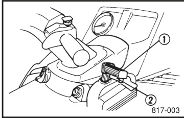 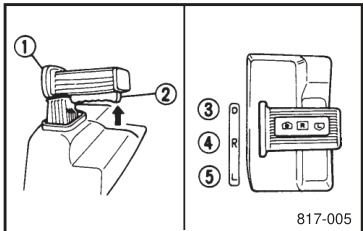 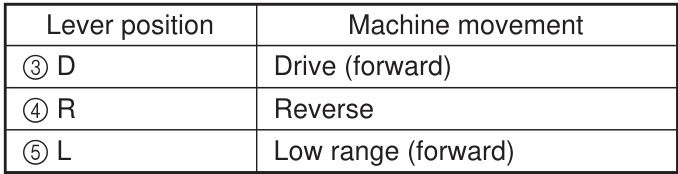
CAUTION: Do not shift from "Forward" to "Reverse" or "Reverse" to "Forward" while the machine is moving. Otherwise the drive system could be damaged.

**V-BELT GUARD**

The V-belt guard is designed to cover the clutch and V-belt in case parts break or come loose. 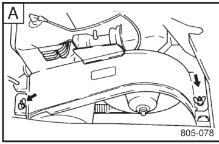 
WARNING: Be sure the V-belt guard is tightened securely before operating the machine. Never run the engine without the V-belt or with the V-belt guard removed.  

### V-BELT HOLDER
Keep a spare V-belt for emergency use by putting it into the holder provided.
NOTE: Loosen the bolt $\textcircled{1}$ to remove the V-belt. 
CAUTION: Be sure to tighten the bolt when installing the V-belt in the holder.  Be sure the fuel hose is not pinched and is in place when installing the V-belt.  
CAUTION: Be sure the V-belt is installed securely in the holder. The V-belt could be damaged by the hot muffler if it comes loose. 
CAUTION: Be sure the V-belt is installed securely in the holder. 

### SHROUD LATCH
To open the shroud, unhook the latch, then slowly raise the shroud forward until it stops. When closing the shroud, slowly lower it to its home position, then hook the shroud latches.
$\textcircled{1}$ Latch $\circledcirc$ Shroud 
CAUTION: Be sure all cables and wires are in place when closing the shroud.
WARNING: Do not drive the machine with the shroud open or unlatched or with the shroud removed. Keep your body and clothing away from rotating parts when servicing with the shroud open. Do not touch the hot muffler and engine during or immediately after operation.    

### ENGINE ROOM PLATES / ENGINE ROOM PLATES (CS340E)

**ENGINE ROOM PLATES**

Open the plates to cool down the engine. 
CAUTION: Close the baffle plate $\textcircled{1}$, install the recoil seal $\circledcirc$ and side plate $\textcircled{3}$ when operating the machine in deep powder snow. Open the baffle plate, remove the recoil seal and side plate when the ambient temperature is above $\mathtt{5^{\circ}C}$ $(41.5^{\circ}\mathsf{F})$.

**ENGINE ROOM PLATES (CS340E)**

Open the plates to cool down the engine.
CAUTION: Close the baffle plate when the machine is operated in deep powder snow. Remove the louver plate $\circledcirc$ when the ambient temperature is $\mathtt{5^{\circ}C}$ $(41.5^{\circ}\mathsf{F})$ or higher.     

### ENGINE ROOM PLATES / ENGINE ROOM PLATES

**ENGINE ROOM PLATES**

Open the plates to cool down the engine. 
CAUTION: Close the plates when the machine is operated in deep snow. Remove the louver plate and belly pan plates $\circledcirc$ when the ambient temperature is $\mathtt{5^{\circ}C}$ $(41.5^{\circ}\mathsf{F})$ or higher.

**ENGINE ROOM PLATES**

Open the plates to cool down the engine. 
CAUTION: Close the plate when the machine is operated in deep snow. Remove the belly pan plates $\textcircled{1}$ when the ambient temperature is $\mathtt{5^{\circ}C}$ $(41.5^{\circ}\mathsf{F})$ or higher.    

## Fuel and Accessories
### FUEL TANKS (BR250T) / FUEL COCK LEVER / SPARK PLUG HOLDER / REAR CARRIER (BR250T/ET410TR/VK540E)

**FUEL TANKS (BR250T)**

This machine is equipped with two fuel tanks; main tank $\textcircled{1}$ in the engine room and sub-tank $\circledcirc$ under the instrument panel. Always add fuel to each of the tanks. See page 6-1\~6-2 for details.

**FUEL COCK LEVER**

The fuel cock lever controls the fuel lines.
$\textcircled{1}$ OFF: With the lever in this position, fuel does not flow. The engine cannot be started.
$\circledcirc$ ON: In this position, fuel flows from the main tank to the carburetor. The engine can be started and operated. The lever should usually be kept in the "ON" position while operating the machine.
$\textcircled{3}$ RES: In this position, fuel flows from the sub-tank to the carburetor. The machine can be operated for a short time. If the machine runs out of fuel in the "ON" position, turn the lever to the "RES" position. Remember to fill both main and sub fuel tanks at the first opportunity. After refueling, return the lever to the "ON" position.

**SPARK PLUG HOLDER**

Keep spare spark plugs for emergency use by screwing them into the holder provided.    

**REAR CARRIER (BR250T/ET410TR/VK540E)**

### LUGGAGE BOX
Open the box to store the service tools, spare parts, or other small items. Luggage box is located under the seat. The seat can be opened left side by unhooking the latches on the right side seat. To close the seat, slowly turn the seat right side. When it fits back to the home position, hook the latches.

### TOW HITCH and Related Items

**TOW HITCH**

Use the tow point within the specified weight limits.
$\textcircled{1}$ Tow point 
CAUTION: Avoid towing for a long time under the (0.6mph)speed to prevent early wear of the drive V-belt. 

**HEADLIGHT BEAM SWITCH**

Push the switch to change the headlight beam alternately to high or low.
$\textcircled{1}$ Headlight beam switch $\circledcirc$ Push $\textcircled{3}$ High beam  

**HEADLIGHT ADJUSTING KNOB (VK540E)**

Use the knob to adjust the headlight vertical position.
$\textcircled{1}$ Up $\circledcirc$ Down 

**GRIP AND THUMB WARMER SWITCH (CS340E/ET410TR/VK540E)**

This switch controls the electrically heated handlebar grips and throttle lever.
$\textcircled{1}$ Grip and thumb warmer switch $\circledcirc$ ON $\textcircled{3}$ OFF

**TRIP ODOMETER RESET KNOB (ET410TR/VK540E)**

Use knob to reset the trip odometer.
$\textcircled{1}$ Reset knob $\circledcirc$ Turn counterclockwise

# Pre-Operation Checks & Operation
## Pre-Operation Checks
Pre-operation checks should be made each time the machine is used.
WARNING: The engine and muffler will be very hot after the engine has been run. Avoid touching the engine and muffler while they are still hot with any part of your body or clothing during inspection or repair. 

### FUEL
Make sure there is sufficient fuel in both main and sub tanks.
Recommended fuel: Unleaded gasoline Pump octane $\textstyle{\frac{\mathsf{R}+\mathsf{M}}{2}}$; 88 or higher
Fuel tank capacity:
$\textcircled{1}$ Main tank: 15 L (3.3 Imp gal, 4.0 US gal)
$\circledcirc$ Sub tank: 9.3 L (2.05 Imp gal, 2.46 US gal) 
WARNING: Fuel is highly flammable and poisonous. Check "SAFETY INFORMATION" (see page 3-2) carefully before refueling. Do not fill the fuel tank all the way to the top. When the machine is tilted, this could cause the fuel to overflow. Make sure that the fuel tank cap is closed securely after refueling. Leaking fuel can catch fire. 
CAUTION: Oxygenated fuels ("gasohol") containing max. $5\%$ of ethanol can be used, although richer jetting may be required to prevent engine damage. Consult a dealer. Gasohol containing methanol is not recommended. Be sure that snow and/or ice does not enter into the fuel tank when refueling.  Do not use alcohol deicers or water absorbing additives with oxygenated fuel. The tank should be filled with straight gasoline as specified.     

### FUEL (CS340E/ET410TR/VK540E)
Make sure there is sufficient fuel in the tank. Recommended fuel: Unleaded gasoline Pump octane $\textstyle{\frac{\mathsf{R}+\mathsf{M}}{2}}$; 88 or higher
Fuel tank capacity:
CS340E/ET410TR Total: 30.6 L (6.7 Imp gal, 8.1 US gal)
VK540E Total: 31.0 L (6.8 Imp gal, 8.2 US gal)
CS340E BET410TR VK540E
WARNING: Fuel is highly flammable and poisonous. Check "SAFETY INFORMATION" (see page 3-2) carefully before refueling. Do not fill the fuel tank all the way to the top. When the machine is tilted, this could cause the fuel to overflow. Make sure that the fuel tank cap is closed securely after refueling. Leaking fuel can catch fire.
CAUTION: Oxygenated fuels ("gasohol") containing max. $5\%$ of ethanol can be used, although richer jetting may be required to prevent engine damage. Consult a dealer. Gasohol containing methanol is not recommended. Be sure that snow and/or ice does not enter into the fuel tank when refueling. Do not use alcohol deicers or water absorbing additives with oxygenated fuel. The tank should be filled with straight gasoline as specified.   

### ENGINE OIL / THROTTLE LEVER / MANUAL STARTER

**ENGINE OIL**

Make sure there is sufficient oil in the oil tank.
$\textcircled{1}$ Lower level $\circledcirc$ Upper level
Oil tank capacity:
BR250T 1.8 L (1.6 Imp qt, 1.9 US qt)
CS340E/ET410TR 2.2 L (1.9 Imp qt, 2.3 US qt)
VK540E 2.5 L (2.2 Imp qt, 2.6 US qt)
Recommended oil: YAMALUBE 2-cycle oil
BR250T BCS340E ET410TR VK540E    

**THROTTLE LEVER**

Check the throttle lever operation before starting the engine. It must open smoothly and spring back to idle when released.

**MANUAL STARTER**

Check for proper operation. Check the rope for damage.

### THROTTLE OVERRIDE SYSTEM (T.O.R.S.) CHECK
WARNING: When checking T.O.R.S.: Be sure the parking brake is applied. Be sure the throttle lever moves smoothly. Do not run the engine up to clutch engagement rpm. Otherwise, the machine could start moving forward unexpectedly, which could cause an accident.

1.  Start the engine. NOTE: Refer to STARTING THE ENGINE.
2.  Hold the pivot point of the throttle lever away from the throttle switch by putting your thumb (above) and forefinger (below) between the throttle lever pivot $\textcircled{1}$ and stop switch housing $\circledcirc$. While holding as described above, press the throttle lever $\textcircled{3}$ gradually. The engine should stop immediately. 
    WARNING: If the engine does not stop, stop the engine by turning the main switch to the "OFF" position and consult a dealer.

### BRAKE
Test the brake at slow speed when starting out to make sure it is working properly. If the brake does not provide proper braking performance, inspect the brake for wear. (See page 8-17 to 8-19 for more details.)
WARNING: Do not operate the machine if you find any problem with the brake. You could lose braking ability, which could lead to an accident.
CAUTION: Be sure the brake lever end should not project out over the handlebar end for preventing brake lever damage when the machine is placed on its side.

### V-BELT
Open the shroud and remove the V-belt guard. Check the V-belt for wear and damage. Replace if necessary.
Wear limit $\textcircled{1}$ 28.0 mm (1.10 in) 32.0mm (1.26in)
WARNING: Be sure the V-belt guard is tightened securely before operating the machine. Never run the engine without the V-belt or with the V-belt guard removed.  

### DRIVE V-BELT GUARD / DRIVE TRACK

**DRIVE V-BELT GUARD**

Check the drive belt guard mounts for damage, and check the tightness of the wing bolt. Make sure the drive belt guard is firmly in place. BR250T BCS340E ET410TR VK540E 

**DRIVE TRACK**

Check the drive track for deflection, wear and damage. Adjust/replace if necessary.  
WARNING: Do not operate the machine if you find damage to the drive track, or misadjustment. Drive track damage and/or failure could result in loss of braking ability and machine control, which could cause an accident. 

### SLIDE RUNNERS
Check wear and damage. If the slide runners reach the wear limit, they should be replaced.
$\textcircled{1}$ Slide runners $\circledcirc$ Wear limit
Wear limit height: 10 mm (0.39 in)
CAUTION: Be sure to ride on the fresh snow frequently to avoid rapid wear of slide runner when operating on ice or hard packed snow.  

### SKI/SKI RUNNER / STEERING SYSTEM / LIGHTS / BATTERY / FITTINGS/FASTENERS

**SKI/SKI RUNNER**

Check wear and damage. Replace if necessary.
Ski runner wear limit $\textcircled{1}$ ABR250T/CS340E/ET410TR 4.5 mm (0.18 in) BVK540E 8 mm (0.31 in)

**STEERING SYSTEM**

1.  Check the following for excessive free play: 1) Push the handlebar up and down and back and forth. 2) Turn the handlebar slightly to the right and left.
2.  If excessive free play is noticed, consult a dealer.

**LIGHTS**

Check the lights. Replace any burned out bulbs. 

**BATTERY**

Check the fluid level and top-up if necessary. Use only distilled water if refilling is necessary.

**FITTINGS/FASTENERS**

Check the tightness of fittings/fasteners. Tighten in proper sequence and torque if necessary.

### SERVICE TOOLS AND SPARE PARTS
It is a good practice to carry service tools and spare parts with your machine so that minor repairs can be done by yourself. The following should be carried with you (for BR250T/ET410TR) or in the luggage box (for CS340E/VK540E).
Tool kit, Flashlight, Roll of plastic tape, Steel wire, Tow rope, Emergency starter rope.
In addition to these, it is advisable to have the following spare parts: Drive belt, Light bulbs, Spark plugs.
When you start out for a long distance trip, extra fuel and oil should be carried.      

## Starting the Engine
### Starting Safety Prerequisites
WARNING: Be sure to check "SAFETY INFORMATION" carefully before starting the engine. Be sure the parking brake is applied. NOTE: Be sure the engine stop switch is in the "ON" position.

1.  Fully open the starter lever (choke)
    $\textcircled{1}$ Starter lever (choke) $\circledcirc$ Fully open (cold engine starting) $\textcircled{3}$ Half-open (warm engine up) (CS340E/ET410TR/VK540E) $\textcircled{4}$ Close (warm engine starting)
    NOTE: The starter lever (choke) is not required when the engine is warm. Put the starter lever in the "Close" position.

### Manual Starting Model
2. Turn the main switch to the "ON" position.
$\textcircled{1}$ "ON"
Pull slowly on the recoil starter until it is engaged, then pull it briskly. After the engine starts, warm up the engine until it does not run roughly or begin to stall when the starter lever is returned to the "Close" position. 
Pull slowly on the recoil starter until it is engaged, then pull it briskly. After the engine starts, put the starter lever (choke) in the "Half-open" position. Warm up the engine until it does not run roughly or begin to stall when the starter lever is returned to the "Close" position.

### Electric Starting Model

2. Turn the main switch to the "START" position. After the engine starts, put the starter lever (choke) in the "Half-open" position. Warm up the engine until it does not run roughly or begin to stall when the starter lever is returned to the "Close" position.
$\textcircled{1}$ "START"
CAUTION: Release the switch immediately after the engine starts. If the engine fails to start, release the switch, wait a few seconds, then try again. Each attempt should be as short as possible to preserve the battery. Do not crank the engine more than 10 seconds on anyone attempt.      

### EMERGENCY ENGINE STARTING (BR250T/ET410TR)
If the recoil starter system should fail, take the emergency starter rope out of the tool kit box and proceed as follows. NOTE: The emergency starter rope is supplied in the tool kit box at the factory.
ABR25U1 BET410TR

1.  Proceed with item 1. for the "STARTING THE ENGINE" and item 2. for the "Manual Starting Model".
2.  Tighten the emergency starter rope on the screwdriver handle. $\textcircled{1}$ Screwdriver handle
3.  Mesh the rope stopper with the primary sheave edge. $\textcircled{1}$ Rope stopper $\circledcirc$ Primary sheave edge
4.  Wind the rope 3-counterclockwise turns on the primary sheave.
5.  Grasp the screwdriver handle and pull briskly.
    WARNING: Do not wind the emergency starter rope around your hand. 
    After the engine starts, warm up the engine until the engine does not stop when the starter lever is returned to "Close" position. After the engine starts, put the starter lever (choke) in the "Half-Open" position. Warm up the engine until it does not run roughly or begin to stall when the starter lever is returned to the "Close" position.
6.  Install the drive guard and shroud.
    WARNING: Avoid contact with the moving primary sheave. 

### EMERGENCY ENGINE STARTING
1.  Proceed with the "STARTING THE ENGINE" item 1.
2.  Turn the main switch to the "ON" position. ① "ON"
3.  Pull slowly on the recoil starter until it is engaged, then pull it briskly. After the engine starts, put the starter lever (choke) in the "Half-open" position. Warm up the engine until it does not run roughly or begin to stall when the starter lever is returned to the "Close" position. 

### BREAK-IN
There is never a more important period in the life of your machine than the Break-In period. For the first 10 hours, approximately $200~\mathsf{k m}$ $125\;\mathrm{mi})$, do not put an excessive load on the engine. Avoid prolonged full throttle operation. Also avoid lugging the engine, such as laborious operation in wet snow. If any abnormal condition is noticed, such as excessive vibration or noise, consult a dealer.

## Riding Your Snowmobile
### GETTING TO KNOW YOUR SNOWMOBILE
A snowmobile is a rider active vehicle, and your riding position and your balance are the two basic factors of maneuvering your snowmobile. Riding your snowmobile requires skills acquired through practice over a period of time. Take the time to learn the basic techniques well before attempting more difficult maneuvers. Riding your new snowmobile can be a very enjoyable activity, providing you with hours of pleasure. But it is essential to familiarize yourself with the operation of the snowmobile to achieve the skill necessary to enjoy riding safely. Before you begin to ride, be sure you have read this Owner's Manual completely and understand the operation of the controls. Pay particular attention to the safety information on page 3-1\~3-3. Please read all warning and caution labels on your snowmobile. Also read the Snowmobiler's Safety Handbook originally supplied with your machine.

### LEARNING TO RIDE YOUR SNOWMOBILE
Before you ride, always perform the pre-operation checks listed on page 8-1\~8-3. The short time spent checking the condition of the machine will be rewarded with added safety and a more reliable snowmobile. Always wear the proper clothing for both warmth and to help protect you from injury if an accident occurs. Become familiar with this snowmobile at slow speeds even if you are an experienced operator. Do not attempt to operate at maximum performance until you are totally familiar with the machine's handling and performance characteristics. The beginning operator should select a large, flat area to become familiar with the snowmobile. Make sure that this area is free of obstacles and other traffic. You should practice control of the throttle and brake, and master turning techniques in this area before trying more difficult terrain. Set the parking brake and follow the instructions on page 7-1\~7-2 to start the engine. Once it has warmed up, you are ready to begin riding your Snowmobile.

### TO START OUT AND ACCELERATE
1.  With the engine idling, release the parking brake.
2.  Apply the throttle slowly and smoothly. The centrifugal clutch will engage and you will start to accelerate.
    WARNING: The operator should always keep both hands on the handlebars. Never put your feet outside the running boards. Avoid higher speeds until you have become thoroughly familiar with your Snowmobile and all of its controls.

### BRAKING
When slowing down or stopping, release the throttle and apply the brake gently-not suddenly.
WARNING: Many surfaces such as ice and hard packed snow require much longer stopping distances. Be alert, plan ahead and begin decelerating early. Improper use of the brake can cause the drive track to lose traction, reducing control and increasing the possibility of an accident.

### TURNING
For most snow surfaces, "body English" is the key to turning. As you approach a curve, slow down and begin to turn the handlebars in the desired direction. As you do so, put your weight on the running board to the inside of the turn and lean your upper body into the turn. This procedure should be practiced at slow speed many times in a large flat area with no obstacles. Once you have learned this technique, you should be able to perform it at higher speeds or in tighter curves. Lean more as the turn gets sharper or is made at higher speeds. Improper riding procedures such as abrupt throttle changes, excessive braking, incorrect body movements, or too much speed for the sharpness of the turn may cause the snowmobile to tip. If your snowmobile begins to tip while turning, lean more into the turn to regain balance. If necessary, gradually let off on the throttle and/or steer to the outside of the turn. 
Remember: Avoid higher speeds until you are thoroughly familiar with the operation of your snowmobile.

### RIDING UPHILL
You should practice first on gentle slopes. Try more difficult climbs only after you have developed your skill. As you approach a hill, accelerate before you start the climb, and then reduce the throttle opening to prevent track slippage. It is also important to keep your weight on the uphill side at all times. On climbs straight up the hill this can be accomplished by leaning forward and, on steeper inclines, standing on the running boards and leaning forward over the handlebars. (Also see "CROSSING A SLOPE.") Slow down as you reach the crest of the hill, and be prepared to react to obstacles, sharp drops, or other people or vehicles which may be on the other side. If you are unable to continue up a hill, do not spin the track. Stop the engine and set the parking brake. Then pull the rear of the snowmobile around to point the machine back down the hill. Do not get on the downhill side of the machine. When the snowmobile is pointed downhill, restart the engine, release the parking brake, and descend the hill.
WARNING: Side hills and steep slopes are not recommended for a beginner or novice snowmobiler.

### RIDING DOWNHILL
When riding downhill, keep speed to a minimum. It is important to apply just enough throttle to keep the clutch engaged while descending the hill. This will allow you to use engine compression to help slow the machine, and to keep the snowmobile from rolling freely down the hill. Also apply the brake frequently, with light pressure. 
WARNING: Use extra caution when applying the brake during descent. Excessive braking will cause the track to lock and will cause a loss of control.

### CROSSING A SLOPE (SIDE HILL)
WARNING: Side hills are not recommended for a beginner or novice snowmobiler.
Crossing the face of a slope (side hill) requires you to properly position your weight to maintain proper balance. As you travel across the slope, lean your body to position your weight towards the uphill side. A recommended riding position is to kneel with the knee of the downhill leg on the seat and the foot of the uphill leg on the running board. This position will make it easier for you to shift your body weight as needed. Snow and ice are slippery, so be prepared for the possibility that your snow-mobile could begin to slip sideways on the slope. If this happens, steer in the direction of the slide if there are no obstacles in your path. As you regain proper balance, gradually steer again in the direction you wish to travel. If your snowmobile starts to tip, steer down the hill to regain balance. 
WARNING: If you are unable to maintain correct balance, and your snowmobile is going to tip over, dismount your snow mobile immediately on the uphill side.

### ICE OR ICY SURFACE / HARD-PACKED SNOW

**ICE OR ICY SURFACE**

Operating on ice or icy surfaces can be very dangerous. Traction for turning, stopping or starting is much less than that on snow.
WARNING: When you have to operate on ice or icy surfaces, drive slowly and cautiously. Avoid rapid acceleration, turning or braking. Steering is minimal and uncontrolled spins are a never-present danger.

**HARD-PACKED SNOW**

It can be more difficult to negotiate on hard-packed snow as both skis and track do not have as much traction. Avoid rapid acceleration, turning or braking.

### OPERATION ON SURFACES OTHER THAN SNOW OR ICE
Operation of your snowmobile on surfaces other than ice or snow should be avoided. Operation under such conditions will damage or result in rapid wear of ski runners, drive track, slide runners and drive sprockets. Operation of the machine under the following conditions should be avoided at all costs:

1.  Dirt 2. Sand 3. Rocks 4. Grass 5. Bare pavement
    Other conditions that should be avoided for the sake of drive track and slide runner life are:
2.  Glare ice surfaces 2. Snow mixed with a lot of dirt and sand
    All the above conditions have one thing in common in regard to drive track and slide runners; little or no lubricating ability. Drive track and all slide rail systems require lubrication (snow or water) between the plastic runners and the metal track inserts. In the absence of lubrication, the plastic runners will rapidly wear and in severe cases, literally melt away, and the drive track will be subjected to damage and/or failure. Also, traction aids such as studs, cleats etc., may cause further track damage and/or failure. Drive track damage and/or failure could result in loss of braking ability and machine control, which could cause an accident. Always check the drive track for damage or misadjustment before operating the machine. Do not operate the machine if you find damage to the drive track.
    CAUTION: Be sure to ride on the fresh snow frequently to avoid rapid wear and damage of the drive track and slide runners when operating under ice or hard packed snow conditions.

## Driving and Transporting
### DRIVING (BR250T/CS340E)
WARNING: Be sure to read "SAFETY INFORMATION" and "RIDING YOUR SNOWMOBILE" carefully before operating the machine.
NOTE: Be sure the engine is warmed up enough before riding.

1.  Release the parking brake by squeezing the brake lever.
2.  Press the throttle lever slowly to move the machine.
3.  Turn the handlebar in the desired direction.
4.  Squeeze the brake lever to stop the machine.
5.  Apply parking brake-squeeze the brake lever and push down the button, then pinch it in place by releasing the brake lever.   

### DRIVING (ET410TR/VK540E) / STOPPING THE ENGINE

**DRIVING (ET410TR/VK540E)**

Be sure to read "SAFETY INFORMATION" and "RIDING YOUR SNOWMOBILE" carefully before operating the machine.
NOTE: Be sure the engine is warmed up enough before riding.

1.  Select the desirable shifting position by moving the shift lever.
    $\textcircled{1}$ "FWD" Forward $\circledcirc$ "REV" Reverse
    · Be sure the throttle lever is fully released and the machine is at a full stop before shifting.
    · Be sure to move the shift lever to forward or reverse until it stops completely while the engine is idling. Low range must not be used for speeds exceeding (30mph). Be sure the area behind is clear before reversing. Watch behind. Reduce speed and avoid sharp turning when reversing.
    $\textcircled{1}$ "D" Forward $\circledcirc$ "R" Reverse $\textcircled{3}$ "L" Forward low speed 
    NOTE: The back buzzer beeps while the shift lever is in reverse.
2.  Release the parking brake by squeezing the brake lever.
3.  Press the throttle lever slowly to move the machine.
4.  Turn the handlebar in the desired direction.
5.  Squeeze the brake lever to stop the machine.
6.  Apply parking brake-squeeze the brake lever and push down the button, then pinch it in place by releasing the brake lever. 

**STOPPING THE ENGINE**

1.  Turn the main switch to the "OFF" position to stop the engine.
    ① "OFF"
    WARNING: Push down the engine stop switch to stop the engine in an emergency. Be sure the key is removed from the switch whenever the operator leaves the machine, to prevent accidental starting.

### TRANSPORTING
When transporting your machine on a trailer or in a truck, observe the following recommendations to help protect your machine from damage:
Make sure the fuel level in the fuel tank is lower than the carburetors. Otherwise, the vibration and bumps from the road surface could make it possible for fuel to flow through the carburetor into the crankcase. This can result in "hydrostatic lock," a condition where the engine cannot rotate because of fuel accumulated in the engine. Severe engine damage can result from hydrostatic lock. When possible, the fuel tank should be empty during transportation, especially if the trip will be 30 minutes or longer.
If transporting the machine in an open trailer or truck put a tight fitting cover on the machine. A cover specifically designed for your snowmobile is best. This will help keep foreign objects out of the cooling vents in the shroud, and also help protect the machine against damage from debris on the road.
If transporting the machine in an open trailer or truck in areas where road salt is used, coat metal suspension surface slightly with oil or other protectant. This will help protect against corrosion. Be sure to clean the machine when you get to your destination to remove any corrosive salts.   

# Maintenance, Troubleshooting & Storage
## Periodic Maintenance
### TOOL KIT
The owner's tool kit has the tools which are sufficient for most periodic maintenance and minor repair. A torque wrench is also necessary to properly tighten nuts and bolts.
$\textcircled{1}$ Tool kit
NOTE: If you do not have a torque wrench available during a service operation requiring one, take your machine to a dealer to check the torque settings and adjust them if necessary. BR250T BCS340E ET410TR VK540E 

### Spark Plug Inspection, Reach, Gap, and Installation Torque

**Inspection and color check**

The spark plug is an important engine component and is easy to inspect. The condition of the spark plug can indicate something of the condition of the engine. Check the coloration on the white porcelain insulator around the center electrode. The ideal coloration at this point is a medium to a light tan color for a machine that is being ridden normally. If a spark plug shows a distinctly different color, there could be something wrong with the engine. For example, a very white center electrode porcelain color could indicate an intake track air leak or carburetion problem for that cylinder. Do not attempt to diagnose such problems yourself. Instead, take the machine to your dealer. You should periodically remove and inspect the spark plug because heat and deposits will cause any spark plug to slowly break down and erode. Consult your dealer before changing to a different type of spark plug.

**Spark plug reach and thread length**

Spark plugs are produced in several different thread lengths. The thread length (reach) is the distance from the spark plug gasket seat to the end of the threaded portion. If the reach is too long, overheating and engine damage may result. If the reach is too short, spark plug fouling and poor performance may result. Also, if too short, carbon will form on the exposed threads resulting in combustion chamber hot spots and thread damage. Always use a spark plug with the proper reach. 

**Spark plug gap and installation torque**

Before installing any spark plug, measure the electrode gap with a wire thickness gauge and adjust to specification. 
When installing the plug, always clean the gasket surface. Wipe off any grime from the threads and torque the spark plug properly.
Spark plug torque: 28 Nm (2.8 m-kg, 20 ft-lb)

### ENGINE IDLE SPEED ADJUSTMENT / THROTTLE CABLE ADJUSTMENT / OIL PUMP CABLE ADJUSTMENT

**ENGINE IDLE SPEED ADJUSTMENT**

   
CAUTION: Be sure this adjustment is serviced by a dealer. Be sure the throttle lever moves smoothly.

1.  Start the engine. NOTE: Refer to STARTING THE ENGINE.
2.  Turn the throttle stop screw $\textcircled{1}$ in or out to adjust the engine idle speed.    

**THROTTLE CABLE ADJUSTMENT**

CAUTION: Be sure the engine idle speed is adjusted first.

1.  Loosen the adjuster lock nut.
2.  Turn the adjuster in or out until proper throttle lever free play is achieved.  $\circledcirc$ Locknut $\textcircled{3}$ Adjuster
3.  Tighten the locknut.  

**OIL PUMP CABLE ADJUSTMENT**

### CARBURETOR ADJUSTMENT

CAUTION: Be sure this adjustment is serviced by a dealer. Be sure the carburetor silencer is installed during running to prevent engine damage. Under some operating conditions the carburetor setting may have to be changed due to air temperature changes, elevation changes, use of alcohol oxygenated fuels, etc. and should be done by an authorized dealer.
CAUTION: The drive chain gears and V-belt clutch should be adjusted when operating over 900 m (3000ft) high altitude. Consult a dealer.   
Pilot Screw Adjustment: Turn the pilot screw in or out to adjust low speed tuning.  
Main Jet Replacement: Replace the main jet according to the setting chart which is available at an authorized dealer.
WARNING: Never remove the drain plug or the float chamber while the engine is hot. Fuel will flow out from the float chamber which could ignite and cause injury.    Place a rag under the carburetor before removing the drain plug or float chamber to catch any spilled fuel. Handle fuel with care: it is highly flammable.  

1.  Loosen the carburetor clamps and turn over the carburetor.
2.  Pinch the fuel hose to prevent fuel flowing.
3.  Remove the drain plug and install the proper main jet.
4.  Assemble by reversing the removal steps.
    WARNING: Be sure the throttle outer cable is firmly seated in the holder and the throttle operates smoothly after assembling the carburetor.

### HIGH ALTITUDE ADJUSTMENTS
Operating at high altitude reduces the performance of a gasoline engine, about $3\%$ for every $305~\mathsf{m}$ (1000ft) of elevation. This is because there is less air as altitude increases. Less air means less oxygen available for combustion. Your snowmobile can be adjusted to overcome most of the problems found in high altitude riding. Carburetor adjustments are the most important. Less air at high altitude makes the fuel/air ratio too rich, which can cause poor performance. Common problems are hard starting, bogging, and plug fouling. Follow the Main Jet Setting chart which is available at an authorized dealer carefully. Proper carburetion adjustments will correct the fuel/air ratio.
Remember: less air at higher altitude means there is less horsepower available, even with proper carburetion. Expect acceleration and top speed to be reduced at higher altitudes.
To overcome operating with less power at high altitudes, your snowmobile may also require different clutch and drive line settings to avoid poor performance and rapid wear. If you plan to operate your snowmobile at an altitude different from the area where you bought your machine, be sure to consult your dealer. He can tell you if there are any changes necessary for the altitude where you plan to ride.
CAUTION: The drive chain gears and V-belt clutch should be adjusted when operating over (3000ft) high altitude. Consult a dealer.

### FAN BELT (VK540E)
Deflection check

1.  Remove the fan cover. 
2.  Measure the fan belt deflection by applying 50 N {5 kg (11 lb)} of force at the center of belt. $\textcircled{1}$ Deflection ② 50 N {5 kg (11 lb)}
    Standard belt deflection: 8 mm (0.31 in)/50 N {5 kg (11 lb)}
    If the deflection exceeds the specification, consult a dealer.    

### DRIVE V-BELT REPLACEMENT (BR250T/CS340E)
NOTE: Apply the parking brake before replacement.

1.  Remove the drive V-belt guard.
2.  Rotate the secondary sliding sheave clockwise $\textcircled{1}$ and push $\circledcirc$ it so that it separates from the fixed sheave.
3.  Pull $\textcircled{3}$ the belt up over the secondary fixed sheave.
4.  Remove the belt from the secondary sheave and primary sheave.
5.  Install the new belt over the primary sheave.
6.  Rotate the secondary sliding sheave clockwise $\textcircled{4}$ and push $\circledast$ it so that it separates from the fixed sheave.
7.  Install the belt $\circledcirc$ between the secondary sliding and fixed sheaves.
8.  Install the drive V-belt guard.
    WARNING: Never run the engine without the drive V-belt or with the drive V-belt guard removed. 

### DRIVE V-BELT REPLACEMENT (ET410TR/VK540E)
WARNING: Be sure there are 2 spacers $\textcircled{1}$ between secondary fixed and sliding sheaves when installing the NEW belt. If there is no gap, the clutch engagement speed will be reduced. The machine may move unexpectedly when the engine is started. The spacer adjustment of the secondary sheave should be serviced by a dealer. Serious injury can occur from sudden release of spring tension during sheave disassembly.
CAUTION: To ensure proper clutch performance, the spacers in the secondary clutch must be repositioned as the V belt wears. For this adjustment, consult a dealer.      
NOTE: Apply the parking brake before replacement.

1.  Remove the drive V-belt guard.
2.  Rotate the secondary sliding sheave clockwise $\textcircled{1}$ and push $\circledcirc$ it so that it separates from the fixed sheave.
3.  Pull $\textcircled{3}$ the belt up over the secondary fixed sheave.
4.  Remove the belt from the secondary sheave and primary sheave.
5.  Install the new belt over the primary sheave.
6.  Rotate the secondary sliding sheave clockwise $\textcircled{4}$ and push $\circledast$ it so that it separates from the fixed sheave.
7.  Install the belt $\circledcirc$ between the secondary sliding and fixed sheaves.
8.  Install the drive V-belt guard.
    WARNING: Never run the engine without the drive V-belt or with the drive V-belt guard removed.   

### DRIVE CHAIN HOUSING
Oil Replenishing

1.  Check the oil level by removing the level bolt and filler cap.  $\textcircled{1}$ Level bolt $\circledcirc$ Filler cap 
2.  Add chain oil until it begins to flow out from the level hole. 
    CAUTION: Be sure no foreign material enters the gearcase.
3.  BR250T/CS340E: Check the level hole bolt gasket. If damaged, replace it. ET410TR/VK540E: Check the level hole bolt gasket and filler cap O-ring. If damaged, replace it.
4.  Install the level hole bolt and filler cap.    

Chain Adjustment (BR250T/CS340E/ET410TR)

1.  Loosen the adjuster locknut.
2.  Turn the adjuster in finger-tight. $\textcircled{1}$ Locknut $\circledcirc$ Adjuster
    NOTE: Be sure the oil seal $\textcircled{3}$ is separated from the chain case $\textcircled{4}$ surface.
3.  Tighten the locknut.

Chain Tension Adjustment (VK540E)

1.  Remove the cap and measure the chain deflection by pushing the chain by finger. ① Cap
    Standard chain deflection $\circledcirc$ $8\sim15\,\mathsf{m m}$ (0.3 \~ 0.6 in)
    If the deflection exceeds specification, adjust the chain tension.
2.  Loosen the lock nut.
3.  Turn the adjuster bolt in or out until proper chain deflection is achieved. $\textcircled{3}$ Locknut $\textcircled{4}$ Adjuster bolt
4.  Tighten the locknut.
5.  Install the cap.

### BRAKE/PARKING BRAKE
Checking Pad Wear: Check pad wear by measuring the thickness of the brake pad. If the pad reaches the wear limit, consult a dealer for replacement.    

Adjustment
Brake adjustment is necessary when the brake lever exceeds the proper free play.
WARNING: Be sure this adjustment is serviced by a dealer.

1.  Loosen the locknut $\textcircled{1}$.
2.  Turn the pad adjuster $\circledcirc$ in or out to adjust the clearance between the pad $\textcircled{3}$ and disc $\textcircled{4}$. Clearance $\circledcirc$: 0.2 \~ 1.0 mm (0.008 \~ 0.040 in).
3.  Turn the cable adjuster $\circledcirc$ in or out to adjust the clearance between the pad $\textcircled{\scriptsize{2}}$ and disc $\textcircled{4}$. Clearance $\circledast$: 0.2 \~ 1.0 mm (0.008 \~ 0.040 in).
4.  Check the brake lever free play. Brake lever free play $\circledcirc$: 6 \~ 7 mm (0.24 \~ 0.28 in).
    Repeat steps 2, 3, and 4 until the specified clearances and free play are achieved.
5.  Tighten the locknut. 

### BRAKE/PARKING BRAKE (CS340E/ET410TR)
Checking Pad Wear: Check pad wear by measuring the thickness of the brake pad. If the pad reaches the wear limit, consult a dealer for replacement. Wear limit ①: 9.5 mm (0.37 in).

Adjustment
Brake adjustment is necessary when the brake lever exceeds the proper free play.
WARNING: Be sure this adjustment is serviced by a dealer.

1.  Loosen the locknut $\textcircled{1}$.
2.  Turn the cable adjuster $\circledcirc$ in or out to adjust the distance $\textcircled{\scriptsize{1}}$. Distance $\textcircled{\scriptsize{1}}$: 57 mm (2.24 in).
3.  Turn the pad adjuster $\textcircled{3}$ in or out to adjust the clearance between the pad $\textcircled{4}$ and disc $\circledcirc$. Clearance: 0.15 \~ 0.30 mm (0.006 \~ 0.012 in).   
    CAUTION: Insert the proper feeler gauge between pad and disc to measure the clearance.
4.  Check the brake lever free play. Brake lever free play $\textcircled{\scriptsize{2}}$: 6 \~ 7 mm (0.24 \~ 0.28 in).
    Repeat steps 2, 3 and 4 until the specified clearances and free play are achieved.
5.  Tighten the locknut. 

### BRAKE/PARKING BRAKE (VK540E)
Checking Pad Wear: Check pad wear by measuring the thickness of the brake pad. If the pad reaches the wear limit, consult a dealer for replacement. Wear limit ①: 9.5 mm (0.37 in).

Adjustment
This machine has a self-adjusting brake caliper. No adjustment is necessary under normal conditions. If free play at the brake lever is incorrect, consult a dealer.
WARNING: Be sure this adjustment is serviced by a dealer.

### SUSPENSION
The suspension can be adjusted to suit rider preference. A softer setting, for example, may provide greater rider comfort, while a stiffer setting may allow more precise handling and control over certain types of terrain or riding conditions.
WARNING: Be sure this adjustment is serviced by a dealer.
WARNING: This shock absorber contains highly pressurized nitrogen gas. It could explode by improper handling, causing injury or property damage. Do not tamper with or attempt to open the shock absorber assembly. Do not subject the shock absorber assembly to open flame or other high heat, which could cause it to explode. Do not deform or damage the shock absorber in any way. Do not dispose of a damaged or worn out shock absorber by yourself. Take the unit to your dealer.

Spring Preload
Adjust the spring preload by turning the spring seat.   
CAUTION: Be sure the left and right spring preload is same.

### SUSPENSION (VK540E)
The suspension can be adjusted to suit rider preference. A softer setting, for example, may provide greater rider comfort, while a stiffer setting may allow more precise handling and control over certain types of terrain or riding conditions.
WARNING: Be sure this adjustment is serviced by a dealer.

Spring Preload
The spring preload can be adjusted by turning the adjuster $\textcircled{1}$.     

Extension Spring Preload
Adjust the spring preload by turning the adjuster $\textcircled{1}$. 
CAUTION: Be sure the left and right spring preload is same.

### FULL RATE ADJUSTER (VK540E)
The total suspension spring rate and damping characteristics can be adjusted by changing the installed position of the shock-absorber assembly.
WARNING: Be sure this adjustment is made by a dealer.    
Be sure to make this adjustment when there is no load (rider or cargo) on the snowmobile.

1.  Loosen the nut $\textcircled{1}$ 1/2 or $_{3/4}$ turns, while holding the adjusting bolt $\circledcirc$ securely with a wrench so it does not move.
    CAUTION: Never allow the adjusting bolt $\circledcirc$ to move while loosening the nut.
2.  Turn the adjusting bolt $\circledcirc$ to the desired position.
    CAUTION: Be sure the adjusting bolt ends are set at the same position on each side.
3.  While holding the adjusting bolt securely, tighten the nut ①. Nut tightening torque: 49 Nm (4.9 m-kg, 35.4 ft-lb).
    CAUTION: Never allow the adjusting bolt to move while tightening the nut.

### TRACK ADJUSTMENT
WARNING: A broken track, track fittings, or debris thrown by the track could be dangerous to an operator or bystanders. Observe the following precautions: Do not allow anyone to stand behind the machine when the engine is running. When the rear of the machine is raised to allow the track to spin, a suitable stand must be used to support the rear of the machine. Never allow anyone to hold the rear of the machine off the ground to allow the track to spin. Never allow anyone near a rotating track. Inspect track condition frequently. Replace damaged track guide clips. Replace the track if it is damaged to the depth where fabric reinforcement material is visible or support rods are broken. Otherwise, track damage and/or failure could result in loss of braking ability and machine control, which could cause an accident. Never install studs (cleats) closer than three inches from the edge of the track.

### Track Deflection Measurement
1.  Lay the machine on its side.
2.  Measure the track deflection with a spring scale. Pull at the center of the track with a force of 100 N {10 kg (22 lb)}
    NOTE: Measure the gap between the slide runner and the edge of the track window. Measure both sides. 
    ① Deflection ② 100 N {10 kg (22 Ib)}
    Standard track deflection:
    BR250T 40 \~ 50 mm (1.57 \~ 1.97 in)/100 N {10 kg (22 Ib)}
    CS340E 25 \~ 30 mm (0.98 \~ 1.18 in)/100 N {10 kg (22 Ib)}
    ET410TR 30 \~ 35 mm (1.18 \~ 1.38 in)/100 N {10 kg (22 Ib)}
    VK540E 35 \~ 45 mm (1.38 \~ 1.77 in)/100 N {10 kg (22 Ib)}
3.  If the deflection is incorrect, adjust the track.    

### Track Adjustment (BR250T)
WARNING: Be sure this adjustment is made by a dealer. Support the machine securely on a suitable stand before working underneath the machine. Operate the engine in a well-ventilated area.

1.  Lift the rear of the machine onto a suitable stand to raise the track off the ground.
2.  Loosen the rear axle bolts $\textcircled{1}$.
3.  Start the engine and rotate the track one or two turns. Stop the engine.
4.  Check the track alignment with the slide runner $\textcircled{3}$. If the alignment is incorrect, turn the left and right adjuster to adjust. 
    $\circledast$ Slide runner $\circledcirc$ Track $\circledcirc$ Track metal $\circledcirc$ Gap $\circledcirc$ Forward  
    NOTE: Install the box $\textcircled{3}$ and wrench $\textcircled{4}$ of the toolkit on the adjuster lock nut $\textcircled{5}$ to turn the adjuster as follows; Set the wrench as far as space permits and turn it. Remove the wrench and turn it over $\circledcirc$ and install wrench on the box. Repeat the above steps.
5.  Adjust track deflection to the specified amount. 
    CAUTION: The adjusters should be turned an equal amount.
6.  Recheck alignment and deflection. If necessary, repeat steps 3 to 5 until proper adjustment is achieved.
7.  Tighten the rear axle bolts.

### Track Adjustment (CS340E/ET410TR/VK540E)
WARNING: Be sure this adjustment is made by a dealer. Support the machine securely on a suitable stand before working underneath the machine. Operate the engine in a well-ventilated area.

1.  Lift the rear of the machine onto a suitable stand to raise the track off the ground.
2.  Loosen the rear axle nut $\textcircled{1}$.  
    NOTE: It is not necessary to remove the cotter pin $\circledcirc$.
3.  Start the engine and rotate the track one or two turns. Stop the engine.
4.  Check the track alignment with the slide runner $\textcircled{3}$. If the alignment is incorrect, turn the left and right adjusters to adjust.    
    $\circledast$ Slide runner $\circledcirc$ Track $\circledcirc$ Track metal $\circledcirc$ Gap $\circledcirc$ Forward
5.  Adjust track deflection to the specified amount. 
    CAUTION: The adjusters should be turned an equal amount.
6.  Recheck alignment and deflection. If necessary, repeat steps 3 to 5 until proper adjustment is achieved.
7.  Tighten the rear axle nut. 

### SKI ALIGNMENT / Handlebar Adjustment (BR250T)

**SKI ALIGNMENT**

1.  Turn the handlebars so the skis face straight ahead.
2.  Check the following for ski alignment: 1) Ski is facing forward. 2) Ski toe-out is within specification. 
3.  If alignment is not correct, consult a dealer. 

**Handlebar Adjustment (BR250T)**

1.  Loosen the handlebar bolts. Move the handlebar assembly up or down to adjust the handlebar height to the desired position.
2.  Tighten the handlebar bolts. Handlebar bolt tightening torque 14 Nm (1.4 m-kg, 10 ft-lb).
    CAUTION: Be sure the small gap $\textcircled{1}$ side of the holder faces forward $\circledcirc$.    

### Handlebar Adjustment (CS340E/BET410TR/VK540E) / LUBRICATION

**Handlebar Adjustment (CS340E/BET410TR/VK540E)**

3.  Loosen the handlebar bolts. Move the handlebar assembly up or down to adjust the handlebar height to the desired position.
4.  Tighten the handlebar bolts and install the handlebar cover. Handlebar bolt tightening torque: 15 Nm (1.5 m-kg, 11 ft-lb).
    CAUTION: Be sure the small gap $\textcircled{1}$ side of the holder faces forward $\circledcirc$. CS340E BET410TR VK540E    

**LUBRICATION**

Lubricate the following points. Lubricant: Low-temperature grease.
$\textcircled{1}$ Brake/Throttle cable ends $\circledcirc$ Ski wear plate $\textcircled{3}$ Front suspension $\textcircled{4}$ Rear suspension 
WARNING: Apply a dab of grease to the cable end only. Do not grease the brake/throttle cables themselves because they could become frozen, which could cause loss of control. 

### HEADLIGHT
Bulb Replacement

1.  Lift up the shroud.
2.  Disconnect the lead coupler.
3.  Remove the bulb cover. 
4.  Remove the bulb holder by depressing and turning it counterclockwise.  $\textcircled{1}$ Bulb cover 
5.  Remove the bulb. 
    WARNING: Keep flammable products or your hands away from the hot bulb until it cools down.
6.  Install the new bulb.
    CAUTION: Keep oil or your hands away from the glass part of bulb or its life and illumination will be affected. If the glass is oil stained, thoroughly clean it with a cloth moistened with alcohol or lacquer thinner. 

Beam Adjustment

1.  Turn the adjuster $\textcircled{1}$ in or out to adjust the headlight beam.

### HEADLIGHT
Bulb Replacement

1.  Lift up the shroud.
2.  Disconnect the lead coupler.
3.  Remove the socket cover and bulb set spring. $\textcircled{1}$ Socket cover.
4.  Remove the bulb. 
    WARNING: Keep flammable products or your hands away from the hot bulb until it cools down.
5.  Install the new bulb. Bulb type: 12 V, 60/55 W.
    CAUTION: Keep oil or your hands away from the glass part of bulb or its life and illumination will be affected. If the glass is oil stained, thoroughly clean it with a cloth moistened with alcohol or lacquer thinner.
6.  Set the spring and install the socket cover. Reconnect the bulb coupler. 

Beam Adjustment

1.  Turn the adjuster $\textcircled{1}$ in or out to adjust the headlight beam.

### Battery Fluid and Fuse Check
1. Check the fluid level. $\textcircled{1}$ Upper level $\circledcirc$ Lower level.
2.  Add only distilled water if necessary. 
    CAUTION: Normal tap water contains minerals which are harmful to a battery; therefore refill only with distilled water.
    WARNING: Battery electrolyte is poisonous and dangerous, causing severe burns, etc. contains sulfuric (sulphuric) acid. Avoid contact with skin, eyes or clothing.
    Antidote: INTERNAL-Drink large quantities of water or milk. Follow with milk of magnesia, beaten egg or vegetable oil. Call physician immediately.
    Eyes: Flush with water for 15 minutes and get prompt medical attention. Batteries produce explosive gases. Keep sparks, flame cigarettes, etc. away. Ventilate when charging or using in closed space. Always cover eyes when working near batteries. KEEP OUT OF REACH OF CHILDREN.
    Be sure to use specified fuse. A wrong fuse will cause electrical system damage and A FIRE HAZARD.
    CAUTION:  Be sure the main switch is turned off to prevent accidental short circuiting.
3.  Lift up the shroud.
4.  Replace the blown fuse with one of proper amperage. If the fuse immediately blows again, consult dealer. Fuse type: 10 A.

## Troubleshooting
### A. Engine turns over but doesn't start
1.  Fuel system No fuel supplied to combustion chamber
    No fuel in tanks ... Supply fuel both tanks.
    No fuel in tank ... Supply fuel.
    Clogged fuel line ... Clean fuel line.
    Foreign matter in fuel cock ... Clean fuel cock.
    Clogged carburetor ... Clean carburetor.
    Fuel supplied to combustion chamber.
    Flooded engine (too much choke). Crank engine with throttle open or wipe spark plug dry.
2.  Electrical system Poor or no spark
    Spark plug dirty with carbon/wet ... Remove carbon/wipe spark plug dry, or replace spark plug.
    Faulty ignition system ... Consult dealer.
    T.O.R.S. system malfunction ... Disconnect the carburetor switch connectors and connect the wire harness connectors together to bypass T.O.R.S.   
    WARNING: Before bypassing the T.O.R.S., be sure the throttle returns properly to the fully-closed position. The T.O.R.S. is an important safety device; in the case of a malfunction, take the machine to a dealer immediately for repair.
3.  Compression Insufficient
    · Loose cylinder head nuts... Tighten nuts properly.
    · Damaged gasket... Replace gasket.
    · Worn out piston and cylinder ... Consult dealer.

### B. Engine does not turn over with manual starter and Related Items

**B. Engine does not turn over with manual starter**

1.  Seized engine ... Seizure is caused by poor lubrication, inadequate fuel, or an air leak—Consult dealer.
2.  "Hydrolock" (fuel has filled crankcase when vehicle was transported) ... Remove spark plug(s), turn engine over several times with ignition off to expel excess fuel. Consult dealer.

**C. Electric starter does not operate or operates slowly (CS340E/VK540E)**

1.  Faulty wire connections ... Check connections or consult dealer.
2.  Battery discharged ... Check battery fluid and charge battery.
3.  Engine trouble ... Check B above.

### D. Engine power is low / E. Engine constantly backfires or misfires

**D. Engine power is low**

1.  Faulty spark plug(s) ... Clean or replace spark plug(s).
2.  Jetting incorrect for altitude or temperature ... carburetor. Consult dealer.
3.  Improper fuel flow ... See A.1. above.
4.  Clutch settings not correct for altitude and/or conditions ... Consult dealer.

**E. Engine constantly backfires or misfires**

1.  Faulty spark plug(s) ... Replace spark plug(s).
2.  Fuel system clogged ... See A.1. above.
3.  T.O.R.S. malfunction ... See T.O.R.S. in A.2. above.

### I. Engine does not up shift or down shift properly/engages harshly and Related Items

**I. Engine does not up shift or down shift properly/engages harshly**

1.  Drive belt worn ... replace belt or consult dealer.
2.  Clutch settings incorrect for altitude/conditions ... Consult dealer.
3.  Primary clutch worn or sticking ... Consult dealer.
4.  Secondary clutch worn or sticking ... Consult dealer.

**J. Noise or excessive vibration in drive line**

1.  Broken clutch components ... Consult dealer.
2.  Worn or damaged bearings ... Consult dealer.
3.  Drive belt damaged or worn with flat spots ... Replace.
4.  Idler wheel/shaft damage ... Consult dealer.
5.  Track damaged ... Consult dealer.

### F. Machine does not move / G. Drive belt twists / H. Drive belt slips or burns

**F. Machine does not move**

1.  Clutch malfunction ... Consult dealer.
2.  Drive track does not move ... foreign object is caught in track, or slide runner has melted to track metal due to lack of lubrication.
3.  Drive chain too tight, too loose, or broken ... Consult dealer.

**G. Drive belt twists**

1.  Improper belt ... Replace with correct belt.
2.  Clutch offset incorrect ... Consult dealer.
3.  Engine mount loose or broken ... Consult dealer.

**H. Drive belt slips or burns**

1.  Belt or sheave surface oily or dirty ... clean.
2.  Problem with driveline ... See F above.

## Storage and Return to Service
### STORAGE
Long term storage, requires some preventive procedures to guard against deterioration.

1.  Cleaning: Thoroughly clean the machine, inside and out, to remove the corrosive salts and acids that can accumulate. Use Mud and Grease Release, or an equivalent, to loosen mud, grease and grime. Wash with mild soap, then rinse and dry completely.
2.  Lubrication: Lubricate moving parts, suspension linkage and pivot points. Use the grease or lubricant specified in the MAINTENANCE section, or Lube-Z all general purpose lubricant. Proper lubrication fights corrosion while it reduces friction.

### Storage – Fuel System and Engine Protection
3.  Fuel system preparation: Add Fuel Conditioner/Stabilizer, or an equivalent, to the fuel tank to help prevent fuel oxidation, gum and varnish deposits, and to inhibit corrosion in the fuel system and carburetor. In areas where oxygenated fuel ("gasohol") is used, completely drain the fuel system. Consult your dealer.
4.  Engine: Proper storage of the engine is essential to prevent costly rust and corrosion damage to internal engine components. This is more important than ever in those areas where oxygenated fuel ("gasohol") is used, because the alcohol content in the fuel increases the chance for water to enter the engine. Use Stor-Rite Fogging Oil, or an equivalent, to protect both combustion chamber and crankshaft from corrosion. An alternate method is to remove the airbox and squirt oil into the carburetor throats while the engine is running.
    CAUTION: Do not attempt to store the machine by simply starting the engine occasionally during the storage period. This can cause more harm than good\! Moisture and acids form during combustion which can actually increase the chance for corrosion damage during the storage period.

### Storage – Exterior Protection and Battery
5.  Protection: Apply a coat of wax, such as Silicone Wax, to painted surfaces. Spray Silicone Spray, or an equivalent protectant, on the exterior of the engine, on the track, and on other metal, plastic and rubber parts.
6.  Battery: Remove the battery from the machine and check the fluid level. Charge the battery. Store it in a cool, dry place that is above $0^{\circ}\mathrm{C}$ $(32^{\circ}\mathsf{F})$, but less than $30^{\circ}\mathrm{C}$ $(90^{\circ}\mathsf{F})$. Check battery condition with a hydrometer monthly, and charge as necessary.
    WARNING: Never smoke or make and break connections at the battery while charging. Sparks may ignite the battery gas. Be sure the battery terminals are tight and that the battery vent tube is properly routed and is securely attached to the battery.
    Do not charge battery quickly. Charge for 10 hours at 1.4 amperes. Do not charge battery quickly. Charge for 10 hours at 1.6 amperes.

### Storage – Track, Drive Belt, and Cover
7.  Track: Loosen the track, and block up the chassis so that the track is suspended above the ground.
8.  Drive belt: Remove the drive belt and store separately.
9.  Storage: Store the machine in a dry, well-ventilated place out of direct sunlight. Put a fabric (breathable) cover over it, preferably one designed for your machine. Do not use a plastic or vinyl cover—condensation could be trapped underneath which could increase the chance of rusting.

### RETURN TO SERVICE AFTER STORAGE
When returning your machine to service, reinstall the drive belt and adjust the track. Reinstall the battery, and make sure the battery vent tube is properly reinstalled and is not kinked. Remove the spark plugs and clean them or replace them. Perform all other pre-operation and seasonal maintenance listed in the Periodic Maintenance chart. For peak performance, it is recommended that you have your machine checked and tuned by your dealer. He has the experience and training to help you get the maximum performance and use from your dealer.

# Specifications & Wiring Diagrams
## Specifications
本手册规格章节涵盖各车型（BR250T / CS340E / ET410TR / VK540E）的尺寸（DIMENSIONS）、发动机（ENGINE）、底盘（CHASSIS）和电气（ELECTRIC）参数。具体规格数值请参见车辆铭牌或向授权经销商查询。

## Wiring Diagrams
### Wiring Diagram – Component List and Color Code 1
$\textcircled{1}$ Speedometer light $\circledcirc$ Carburetor switch $\textcircled{3}$ Tail/brake light $\textcircled{4}$ Spark plug $\circledcirc$ Ignition coil $\circledcirc$ CDI unit $\textcircled{\scriptsize{2}}$ CDI magneto $\circledast$ Voltage regulator $\circledcirc$ Brake light switch $\circledcirc$ Headlight beam switch $\circledcirc$ Main switch $\circledcirc$ Accel switch $\textcircled{3}$ Engines top switch $\textcircled{4}$ Engine stop switch $\textcircled{5}$ Frame ground $\circledcirc$ Headlight $\circledcirc$ Thumb warmer (option) $\circledast$ Grip warmer (option) $\circledcirc$ Grip warmer switch (option)

COLOR CODE: B Black, Blue, G Green, Yellow, R Red, Orange, Br Brown, B/Y Black/Yellow, B/W Black/White, G/Y Green/Yellow, Y/B Yellow/Black, Y/R Yellow/Red, W/R White/Red

### Wiring Diagram – Component List and Color Code 2
$\textcircled{1}$ Speedometer light $\circledcirc$ Tachometer (option) $\textcircled{3}$ Thumb warmer $\textcircled{4}$ Grip warmer $\circledcirc$ Grip warmer switch $\circledcirc$ Main switch $\textcircled{\scriptsize{2}}$ Fuse $\circledast$ Battery $\circledcirc$ Starter relay $\circledcirc$ Starter motor $\circledcirc$ Tail/brake light $\circledcirc$ Spark plug $\textcircled{3}$ Ignition coil $\textcircled{4}$ CDI unit $\textcircled{5}$ CDI magneto $\circledcirc$ Rectifier/regulator $\circledcirc$ Frame ground $\circledast$ Brake light switch $\circledcirc$ Headlight beam switch $\circledcirc$ Carburetor switch $\circledcirc$ Throttle switch $\circledcirc$ Engine stop switch $\circledcirc$ Headlight 

COLOR CODE: B Black, Br Brown, G Green, L Blue, Orange, R Red, W White, Y Yellow, B/W Black/White, B/Y Black/Yellow, G/Y Green/Yellow, L/W Blue/White, R/W Red/White, W/R White/Red, Y/B Yellow/Black, Y/L Yellow/Blue, Y/R Yellow/Red

### Wiring Diagram – Component List and Color Code 3
$\textcircled{1}$ Speedometer light $\circledcirc$ Tachometer light (option) $\textcircled{3}$ Thumb warmer $\textcircled{4}$ Grip warmer $\circledcirc$ Grip warmer switch $\circledcirc$ Main switch $\textcircled{\scriptsize{2}}$ Fuse (option) $\circledast$ Battery (option) $\circledcirc$ Starter relay (option) $\circledcirc$ Tail/brake light $\circledcirc$ Spark plug $\circledcirc$ Ignition coil $\textcircled{3}$ Starter motor (option) $\textcircled{4}$ CDI unit $\textcircled{5}$ CDI magneto $\circledcirc$ Rectifier/regulator $\circledcirc$ Frame ground $\circledast$ Back buzzer $\circledcirc$ Gear position switch $\circledcirc$ Brake light switch $\circledcirc$ Headlight beam switch $\circledcirc$ Carburetor switch $\circledcirc$ Accel switch $\circledast$ Engines top switch $\circledcirc$ Headlight 

COLOR CODE: B Black, Br Brown, Ch Chocolate, G Green, L Blue, Orange, P Pink, R Red, W White, Y Yellow, B/W Black/White, B/Y Black/Yellow, G/Y Green/Yellow, R/W Red/White, W/R White/Red, Y/B Yellow/Black, Y/R Yellow/Red

### Wiring Diagram – Component List and Color Code 4
$\textcircled{1}$ Back buzzer $\circledcirc$ Speedometer light $\textcircled{3}$ Tachometer light (option) $\textcircled{4}$ Tachometer (option) $\circledcirc$ Gear position switch $\circledcirc$ Thumb warmer $\textcircled{\scriptsize{2}}$ Grip warmer $\circledast$ Grip warmer switch $\circledcirc$ Main switch $\circledcirc$ Fuse $\circledcirc$ Rectifier $\circledcirc$ Starter relay $\textcircled{3}$ Battery $\textcircled{4}$ Tail/brake light $\textcircled{5}$ Spark plug $\circledcirc$ Ignition coil $\circledcirc$ Starter motor $\circledast$ CDI unit $\circledcirc$ CDI magneto $\circledcirc$ Voltage regulator $\circledcirc$ Frame ground $\circledcirc$ Brake light switch $\circledcirc$ Headlight beam switch $\circledast$ Carburetor switch $\circledcirc$ Accel switch $\circledast$ Engines top switch $\circledcirc$ Engine stop switch $\circledast$ Headlight 

COLOR CODE: B Black, Br Brown, Ch Chocolate, G Green, L Blue, Orange, P Pink, R Red, W White, Y Yellow, B/W Black/White, B/Y Black/Yellow, G/Y Green/Yellow, L/W Blue/White, R/W Red/White, W/R White/Red, Y/B Yellow/Black, Y/L Yellow/Blue, Y/R Yellow/Red
