# TV

# Important Safety Instructions

## Warning and Caution Labels

### Fire, moisture, and electric-shock warnings

**WARNING:** TO REDUCE THE RISK OF FIRE OR ELECTRIC SHOCK, DO NOT EXPOSE THIS PRODUCT TO RAIN OR MOISTURE.

**CAUTION:** TO REDUCE THE RISK OF ELECTRIC SHOCK, DO NOT REMOVE COVER (OR BACK). NO USER-SERVICEABLE PARTS INSIDE. REFER SERVICING TO QUALIFIED SERVICE PERSONNEL.

## Cleaning

### Cleaning precautions and recommended method

Unplug this television receiver from the wall outlet before cleaning. Do not use liquid cleaners or aerosol cleaners. Use a damp cloth for cleaning. Do not use attachments not recommended by the television receiver manufacturer as they may cause hazards.

## Power Supply

### Power-source requirements and verification

This television receiver should be operated only from the type of power source indicated on the marking label. If you are not sure of the type of power supplied to your home, consult your television dealer or local power company.

## Installation

### Placement near water and stable mounting

Do not use this television receiver near water, for example, near a bathtub, washbowl, kitchen sink or laundry tub, in a wet basement, or near a swimming pool, etc. Do not place this television receiver on an unstable cart, stand, or table. The television receiver may fall, causing serious injury to a child or an adult, and serious damage to the appliance. Use only with a cart or stand recommended by the manufacturer, or sold with the television receiver. Wall or shelf mounting should follow the manufacturer's instructions and should use a mounting kit approved by the manufacturer.

### Ventilation and overheating prevention

Slots and openings in the cabinet and the back or bottom are provided for ventilation, and to insure reliable operation of the television receiver, and to protect it from overheating. These openings must not be blocked or covered. The openings should never be blocked by placing the television receiver on a bed, sofa, rug, or other similar surface. This television receiver should not be placed in a built-in installation such as a bookcase unless proper ventilation is provided.

### Magnetic interference and wet-location precautions

It is recommended not to operate this unit near speakers or big metallic furnitures in order to keep their magnetism from disturbing colors purity (uniformity) on the screen.

**Wet Location Marking:** Apparatus shall not be exposed to dripping or splashing and no objects filled with liquids, such as vases, shall be placed on the apparatus.

## Writing Model And Serial Numbers

### Recording model and serial information

The serial number and model number are found on the back of this unit. The serial number is unique to this unit. You should record requested information here and retain this guide as a permanent record of your purchase. Please retain your purchase receipt as your proof of purchase.

## Use and Service

### Power-cord protection and outlet loading

Do not allow anything to rest on the power cord. Do not locate this television receiver where the cord will be abused by persons walking on it. Do not overload wall outlets and extension cords as this can result in fire or electric shock. Never push objects of any kind into this television receiver through cabinet slots as they may touch dangerous voltage points or short out parts that could result in a fire or electric shock. Never spill liquid of any kind on the television receiver.

### Servicing restrictions and qualified personnel

Do not attempt to service this television yourself as opening or removing covers may expose you to dangerous voltage or other hazards. Refer all servicing to qualified personnel.

# Description of Controls

## Remote Control

### Remote control basic operation buttons

1.  POWER BUTTON (or ON/OFF): Refer to "Turning on/off the TV".
2.  NUMBER BUTTONS: To select the desired channel directly.
3.  APC (Auto Picture Control) BUTTON: To adjust the factory preset pictures corresponding to the lighting around.
4.  MENU BUTTON: To display on screen menus.
5.  CHANNEL UP/DOWN ($\pmb{\bigtriangleup}/\pmb{\bigtriangledown}$) BUTTONS: To select the desired channel. To select the desired menu item when menu is displayed on the screen.
    VOLUME UP/DOWN ($\blacktriangleleft/\blacktriangleright$) BUTTONS: To increase or decrease volume level. To enter or adjust the selected menu when menu is displayed on the screen.
    ENTER (O) BUTTON: To exit from the displayed menu. To memorize the adjusted menu. To recall the current TV mode (by remote control only).
### Remote control channel and picture shortcut buttons

6.  FCR (Favorite Channel Review) BUTTON: To select the favorite channel. Refer to "Favorite channel memory".
7.  AUTO PRG. (Auto program) BUTTON: To memorize channels by AUTO PROGRAM.
8.  $\mathsf{E Y E}/\star$ BUTTON (some models): To switch on or off eye picture. Refer to "Enjoying the Eye Function". * : No function.
9.  REVIEW BUTTON (some models): To return to the previous channel.
10. WIDE/ZOOM/* BUTTON (some models): To select the desired picture format (4:3, 16:9 or ZOOM). * : No function.
### Remote control audio, video, caption, and timer buttons

11. MUTE BUTTON: To mute the sound. Again to restore the muted sound.
12. TV/VIDEO BUTTON: To select TV, VIDEO or COMPONENT mode.
13. CAPTION BUTTON (some models): To select the CAPTION mode. Refer to "Closed caption function".
14. SLEEP BUTTON: To set the desired sleep time.
15. MEMORY/ERASE BUTTON (some models): To memorize or erase the desired channel.
16. PICTURE BUTTON: To display picture modes one by one.
17. MTS BUTTON (some models): To listen to the MTS sound.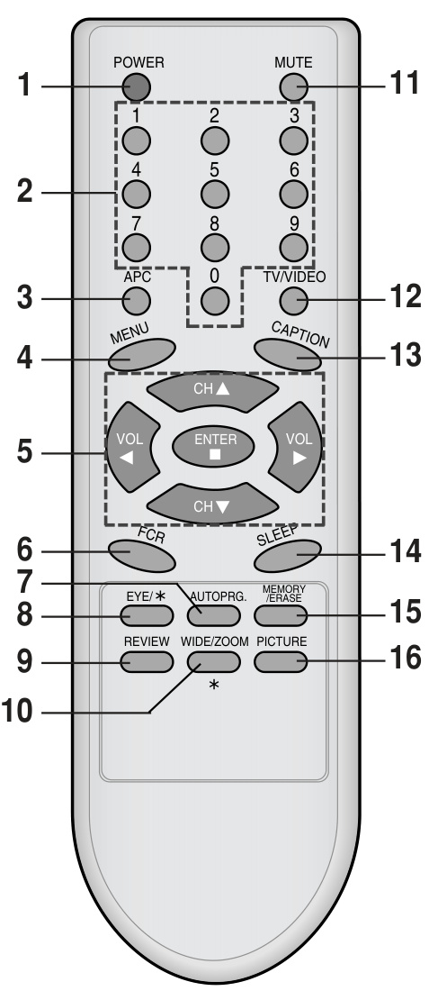
18. TURBO SOUND/TURBO-S BUTTON (some models): To switch on or off TURBO SOUND function.
    TURBO PICTURE/TURBO-P BUTTON (some models): To switch on or off TURBO PICTURE function.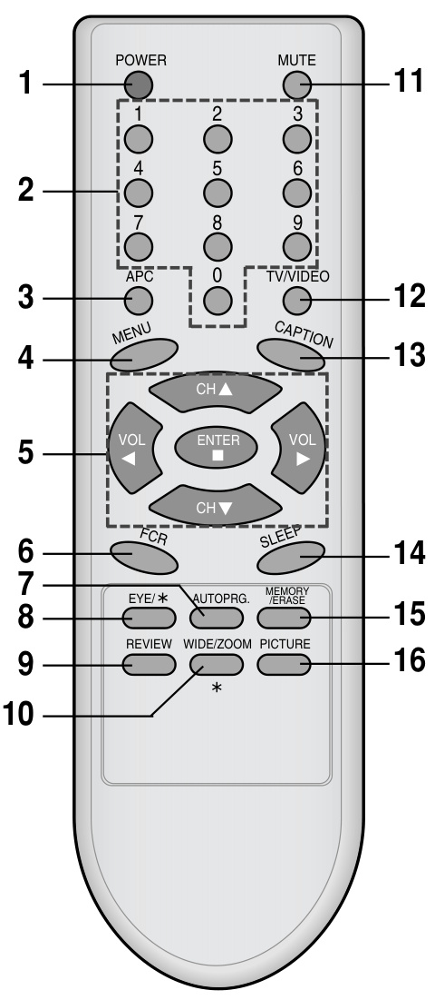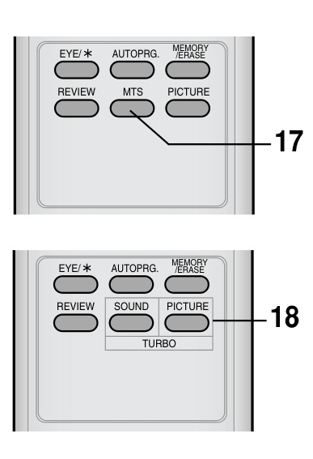

### Remote control battery installation note
Open the battery compartment cover on the back side and insert the batteries with correct polarity. Apply two 1.5 V batteries of AAA type. Don't mix the used batteries with new batteries.

## Front Panel

### Front panel indicators and sensors

This is a simplified representation of front panel.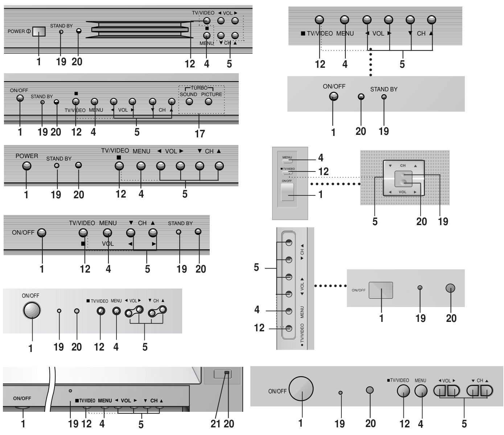

19. STANDBY INDICATOR (STANDBY): Illuminates red when the TV is in standby mode. Refer to "Turning on/off the TV".
20. REMOTE CONTROL SENSOR
21. EYE SENSOR (some models): Adjusts picture according to the surrounding conditions.

# TV Operation and Functions

## Operation Preparation

### Before operating the TV

Before operating your TV, make sure the following instructions have been completed:
· Your TV has been connected to an antenna or a cable system.
· Your TV has been plugged in a power outlet.
· In this manual, the OSD (On Screen Display) may be different from your TV's because it is just an example to help you with the TV operation.

## Turning on/off the TV

### Power button and standby operation

Press the POWER (or ON/OFF) button on the set. At this time, the set switches to standby mode and the standby indicator lights up in red. To switch the TV on from standby mode, press the TV/VIDEO, CH $\pmb{\triangle}/\pmb{\nabla}$ button on the set or POWER, TV/VIDEO, CH $\pmb{\triangle}/\pmb{\nabla}$ or number button on the remote control. A channel number will be displayed on the screen. The on-screen display will disappear after a few seconds. Press the POWER button on the remote control. It reverts to standby mode. To switch the TV off, press the POWER button on the set.

## Selecting the on screen language

### Language menu procedure

1.  Press the MENU button and then ▲/▼ button until the menu is displayed as shown right.
2.  Press the ► and then ▲/▼ button to select Language.
3.  Press the ► and then ▲/▼ button to select the desired language. From this point on, the on-screen display will be presented in the language of your choice.
4.  Repeatedly press the MENU button to exit.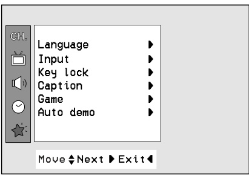

## Memorizing Channels

### Channel memorization overview

This is the function to memorize all the active channels in your area before you can use the TV. There are two ways of memorizing channels. You can use either. One is called AUTO PROGRAM and the other is called MANUAL PROGRAM. In AUTO PROGRAM the TV will memorize the channels in ascending order. If there are additional channels you want to add or delete, you can manually add or delete those channels.

### Memorizing the Channels by AUTO PROGRAM
AUTO PROGRAM searches and memorizes all the active channels in your area then you can select the desired channel with the $\pmb{\triangle}/\pmb{\nabla}$ buttons.

### Auto program using the AUTO PRG. button
You can conveniently perform AUTO PROGRAM using the AUTO PRG. button on the remote control.

1.  Press the AUTO PRG. button.
2.  Press the $\blacktriangleright$ or AUTO PRG. button. The AUTO PROGRAM starts now. If you want to stop auto programming, press the ENTER (O) button. Only the channels searched up to that time are memorized.

### Auto program notes and duplicated-channel handling

Notes:
· If the programmed signal has poor quality, memorize again in the Auto prog.
· AUTO PROGRAM stores all receivable channels regardless of receiving signal (RF, Cable).
· If channels of general wireless TV and cable TV are duplicated, press the number buttons $(0\sim9)$ to change as.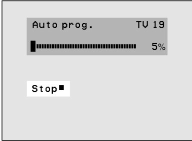

### Auto program using the MENU button

1.  Press the MENU button and then $\pmb{\triangle}/\pmb{\nabla}$ button until the menu is displayed as shown right.
2.  Press the $\blacktriangleright$ and then $▲/▼$ button to select Auto prog.
3.  Press the $\blacktriangleright$ button to enter the Auto prog. mode.
4.  The AUTO PROGRAM starts now.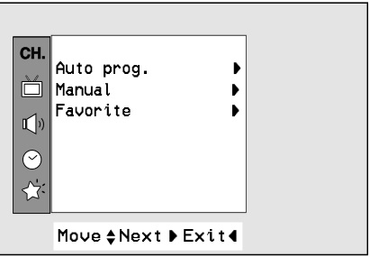

### Manual program methods: memorize or erase channels using the MEMORY/ERASE button or MENU button
You can conveniently perform MANUAL PROGRAM using the MEMORY/ERASE button on the remote control.

Using the MEMORY/ERASE button:

1.  Press the $\pmb{\triangle}/\pmb{\nabla}$ or NUMBER buttons to select the channel number you want to memorize or erase.
2.  Press the MEMORY/ERASE button to select Memory or Erase. The on screen display appears as shown right.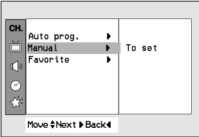

Using the MENU button:

1.  Press the MENU button and then $\pmb{\triangle}/\pmb{\nabla}$ button until the menu is displayed as shown right.
2.  Press the $\blacktriangleright$ and then use $\pmb{\triangle}/\pmb{\nabla}$ button to select Manual.
3.  Press the $\blacktriangleright$ button and then use $\pmb{\triangle}/\pmb{\nabla}$ button to select Channel.
4.  Press the $\blacktriangleright$ button and then use $\pmb{\triangle}/\pmb{\nabla}$ button to select the channel number you want to memorize or erase.
5.  Press the $\blacktriangleright$ button and then use $\pmb{\triangle}/\pmb{\nabla}$ button to select Memory.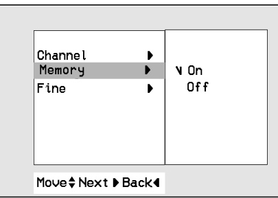
6.  Press the $\blacktriangleright$ button and then $\pmb{\triangle}/\pmb{\nabla}$ to select On or Off.
7.  Repeatedly press the MENU button to exit.

## Selecting the Channel and Adjusting Volume

### Channel selection methods

Press the $▲/▼$ button to conveniently select the upper or lower channel then the channel being viewed, or NUMBER buttons to directly select the desired channel.

### Volume adjustment and mute operation

Press the $\blacktriangleright$ button to increase the volume level or $\blacktriangleleft$ button to decrease the volume level. To mute the sound, Press the MUTE button. The word Mute is displayed. It's convenient when you get the telephone calls. To restore the muted sound, press the MUTE button again or VOL $\blacktriangleleft/\blacktriangleright$ button.

## Time and Timer Settings

### Setting the Clock
Before setting the on/off timer, first you should set the current time.

1.  Press the MENU button and then $\pmb{\triangle}/\pmb{\nabla}$ button until the menu is displayed as shown right.
2.  Press the $\blacktriangleright$ and then $▲/▼$ button to select Clock.
3.  Press the $\blacktriangleright$ button and then press the $◄/►$ button to adjust the hour.
4.  Press the $\blacktriangleright$ button and then press the $\pmb{\triangle}/\pmb{\nabla}$ button to adjust the minute.
5.  Repeatedly press the MENU button to exit.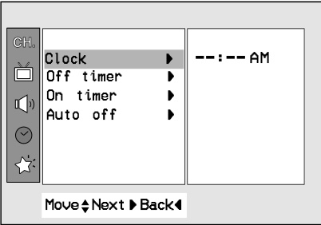

### Setting the Off Timer
This is the function to automatically switch the TV to standby mode at a preset time.

1.  Press the MENU button and then $\pmb{\triangle}/\pmb{\nabla}$ button until the menu is displayed as shown right.
2.  Press the $\blacktriangleright$ and then $\left(▲/▼\right)$ button to select Off timer.
3.  Press the $\blacktriangleright$ button and then press the $\pmb{\triangle}/\pmb{\nabla}$ button to adjust the hour.
4.  Press the $\blacktriangleright$ button and then press the $▲/▼$ button to adjust the minute.
5.  On/off is used to activate or deactivate preset on/off times. Press the $\blacktriangleright$ and then $\pmb{\triangle}/\pmb{\nabla}$ button to select Off or On.
6.  Repeatedly press the MENU button to exit.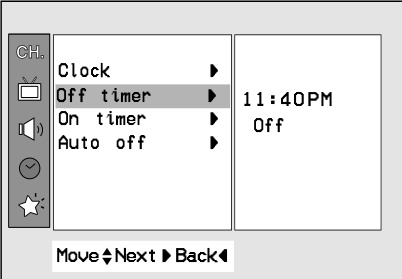
    Note: If the same time is set for the on time and off time, only the off time operates.

### Setting the On Timer
This is the function to automatically turn the TV on at a preset time and channel.

1.  Press the MENU button and then $\pmb{\triangle}/\pmb{\nabla}$ button until the menu is displayed as shown right.
2.  Press the $\blacktriangleright$ and then $▲/▼$ button to select On timer.
3.  Press the $\blacktriangleright$ and then use $\pmb{\triangle}/\pmb{\nabla}$ button to adjust the hour.
4.  Press the $\blacktriangleright$ and then use $\pmb{\triangle}/\pmb{\nabla}$ button to adjust the minute.
5.  Press the $\blacktriangleright$ and then use $\pmb{\triangle}/\pmb{\nabla}$ button to select the desired channel among the memorized channels in auto program.
6.  Press the $\blacktriangleright$ and then use $\pmb{\triangle}/\pmb{\nabla}$ button to adjust the desired volume level.
7.  On/off is used to activate or deactivate preset on/off times. Press the $\blacktriangleright$ button and then use $\pmb{\triangle}/\pmb{\nabla}$ button to select Off or On.
8.  Repeatedly press the MENU button to exit.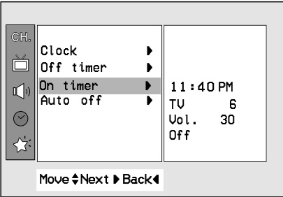

### On timer operating notes

Notes:
· If you don't press any button within 2 hours after turning on the TV set by ON TIMER function, the set will be automatically switched back to standby mode.
· TV must be in standby mode for the On timer to work.

### Setting the Sleep Time
You don't have to remember to switch the TV to standby mode before you go to sleep. The sleep timer automatically turns the TV off after the preset time elapses. Press the SLEEP button to select the desired sleep time. Each time you press this button, the sleep time is displayed one by one as shown below. The timer begins to count down from the number of minutes selected.
$$\begin{array}{r}{\longrightarrow\cdots\to10\to20\to30\to60\to90\to120\to180\to240}\end{array}$$

### Sleep timer notes and cancellation

Notes:
· After a few seconds, the desired sleep time will disappear and be operated automatically.
· To view the remaining sleep time, press the SLEEP button once and the remaining sleep time will be displayed.
· To cancel the sleep time, select the Sleep --- mode by using the SLEEP button.

### Auto Off
If there is no input signal, the TV is switched to standby mode automatically in 10 minutes.

1.  Press the MENU button and then $\pmb{\triangle}/\pmb{\nabla}$ button until the menu is displayed as shown right.
2.  Press the $\blacktriangleright$ and then $\left(▲/▼\right)$ button to select Auto off.
3.  Press the $\blacktriangleright$ and then $\pmb{\triangle}/\pmb{\nabla}$ button to select On or Off.
4.  Repeatedly press the MENU button to exit.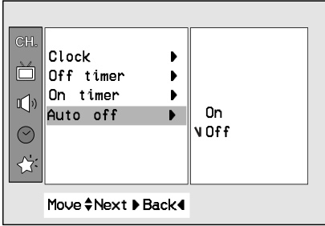

## Other Features

### Game (some models)
You can enjoy the TV game with this set.

1.  Press the MENU button and then $\pmb{\triangle}/\pmb{\nabla}$ button until the menu is displayed as shown right.
2.  Press the $\blacktriangleright$ and then $\left(▲/▼\right)$ button to select Game.
3.  Press the $\blacktriangleright$ button to enter the game mode.
4.  Press the $\pmb{\triangle}/\pmb{\bigtriangledown}$ button to select the desired game.
5.  Press the ENTER (O) button to repeatedly start a game.
6.  Repeatedly press the MENU button to exit game mode. If you want to return to the game list, press the $\pmb{\triangle}/\pmb{\nabla}$ button. For further information, refer to the game manual.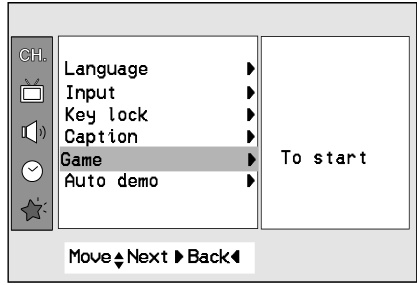

### Key Lock
The TV can be set so that the remote control is needed to control it. This feature can be used to prevent unauthorized viewing.

1.  Press the MENU button and then $\pmb{\triangle}/\pmb{\nabla}$ button until the menu is displayed as shown right.
2.  Press the $\blacktriangleright$ and then $▲/▼$ button to select Key lock.
3.  Press the $\blacktriangleright$ button and then $\pmb{\triangle}/\pmb{\nabla}$ button to select On or Off.
4.  Repeatedly press the MENU button to exit.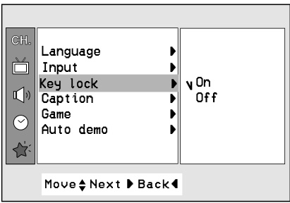

### Key lock notes

Notes:
· With the key lock on, the display Key lock appears on the screen if any button on the front panel is pressed while viewing the TV.
· This is programmed to remember which option it was last set to even if you switch the TV from standby mode.

### Auto Demonstration (some models)
Auto demonstration allows you to review all the menus programmed in the TV set.

1.  Press the MENU button and then $\pmb{\triangle}/\pmb{\nabla}$ button until the menu is displayed as shown right.
2.  Press the $\blacktriangleright$ and then $▲/▼$ button to select Auto demo.
3.  Press the $\blacktriangleright$ button, and the demonstration starts. When the demonstration reaches the last display, it starts again from the beginning.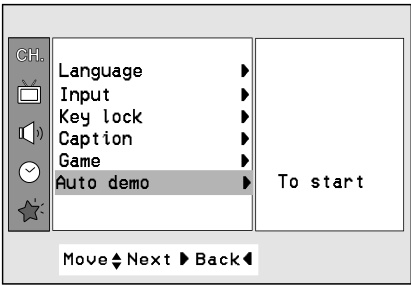
    ### Stopping auto demonstration

To stop auto demonstration, press any button.

### Favorite Channel Memory
Favorite channel memory is a convenient feature that lets you quickly scan up to five channels of your choice without having to wait for the TV to scan through all the in-between channels.

1.  Press the MENU button and then $\pmb{\triangle}/\pmb{\nabla}$ button until the menu is displayed as shown right.
2.  Press the $\blacktriangleright$ and then $▲/▼$ button to select Favorite.
3.  Press the $\blacktriangleright$ button and then use $\pmb{\triangle}/\pmb{\nabla}$ button to select a favorite channel position.
4.  Use the $\leftrightsquigarrow$ button to select the desired channel number.
5.  Repeat steps 3 to 4.
6.  Repeatedly press the MENU button to exit.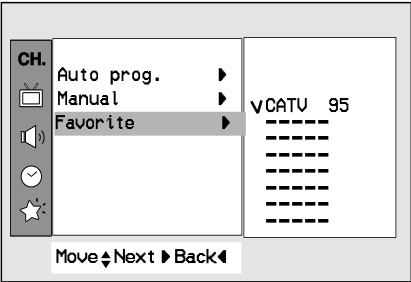
    ### Selecting favorite channels

To select the favorite channel, repeatedly press the FCR (Favorite Channel Review) button. Eight channels programmed appear on the screen one by one.

### Adjusting the Fine
This function is to adjust the picture to stable condition when it is poor, for example, a horizontal stripe, twisted picture or no color in broadcasting.

1.  Press the MENU button and then $\pmb{\triangle}/\pmb{\nabla}$ button until the menu is displayed as shown right.
2.  Press the $\blacktriangleright$ and then $▲/▼$ button to select Manual.
3.  Press the $\blacktriangleright$ and then $\pmb{\triangle}/\pmb{\nabla}$ button to select Fine.
4.  Press the $\blacktriangleright$ button to enter the Fine mode.
5.  Press the $\blacktriangleleft/\blacktriangleright$ button to tune the desired picture condition.
6.  Press the ENTER (O) button to memorize.
7.  Repeatedly press the MENU button to exit.

### Fine-tuning reset and memorized channel notes

Notes:
· To release the memorized fine tuning, program again the fine tuned channel by AUTO PROGRAM or MANUAL PROGRAM.
· If the finely tuned channel is memorized, the color of the channel number changes to yellow.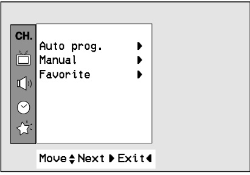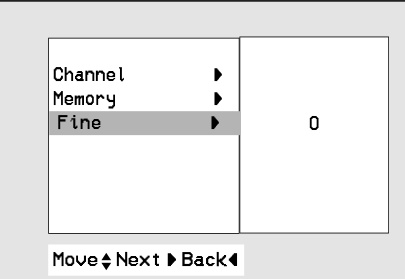

# Picture and Sound Control

## Picture Control

### Enjoying the Eye Function (some models)
The set will automatically adjust the picture according to the surrounding conditions with the display Magic eye.

1.  Press the EYE button on the remote control. The display Magic eye appears and the picture is adjusted.
2.  Press the EYE button again to switch the Eye function off.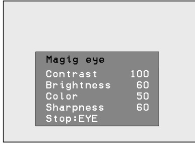

### Auto Picture Control
You can select picture modes programmed at factory as you prefer.
### Auto picture control using the APC button
1.  Press the APC button.
2.  Press the APC button to select Magic eye (some models), Clear, Optimum, Soft or User.
3.  Press the ENTER (O) button to exit.

### Auto picture control using the MENU button

1.  Press the MENU button and then $\pmb{\triangle}/\pmb{\nabla}$ button until the menu is displayed as shown right.
2.  Press the $\blacktriangleright$ and then $▲/▼$ button to select APC.
3.  Press the $\blacktriangleright$ button to enter the APC mode.
4.  Press the $▲/▼$ button to select Magic eye (some models), Clear, Optimum, Soft or User.
5.  Repeatedly press the MENU button to exit.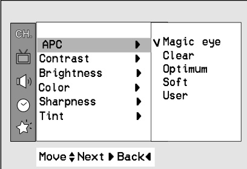

### Adjusting the Picture
This is the function to manually adjust the desired picture levels (Contrast, Brightness, Color, Sharpness, Tint) of the screen as you like. If the picture you set is not satisfactory, you can select a factory preset picture. In the broadcasting system PAL-M/N, the picture item Tint is not displayed.

1.  Press the MENU button and then $\pmb{\triangle}/\pmb{\nabla}$ button until the menu is displayed as shown right.
2.  Press the $\blacktriangleright$ and then $▲/▼$ button to select the desired picture mode.
3.  Press the $\blacktriangleright$ button.
4.  Press the $\looparrowleft$ button to adjust the level. The level of displayed is adjusted.
5.  Repeatedly press the MENU button to exit.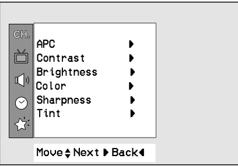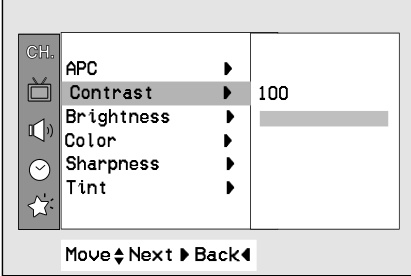

## Sound Control

### Enjoying the Stereo/SAP Broadcast (some models)
This TV set can receive MTS stereo programs and any SAP (Secondary Audio Program) that accompanies the stereo program, as the system to be transmitted one additional sound signal as well as the original one. MTS function doesn't operate in the video mode.
### Stereo/SAP selection using the MTS button
1.  Press the MTS button to select your desired MTS mode. Each time you press this button, the MONO, STEREO or SAP mode appears in turn.
2.  Press the ENTER (O) button to exit.

### Stereo and SAP reception notes

Notes:
· Stereo or SAP can only be received if the TV station transmits those signals, even though you have selected STEREO or SAP.
· Mono sound is automatically received if the broadcast is only in Mono; even though STEREO or SAP has been selected.
· Select MONO if you want to listen to mono sound in remote fringe areas during stereo/SAP broadcasting.

### Auto Sound Control
You can enjoy the best sound without any special adjustment because this TV set automatically adjusts the sound appropriate to viewing program character by self-intelligence.

1.  Press the MENU button and then $\pmb{\triangle}/\pmb{\nabla}$ button until the menu is displayed as shown right.
2.  Press the $\blacktriangleright$ and then the $\pmb{\triangle}/\pmb{\nabla}$ button to select DASP.
3.  Press the $\blacktriangleright$ and then the $▲/▼$ button to select Flat, Music, Movie, Sports or User.
4.  Repeatedly press the MENU button to exit.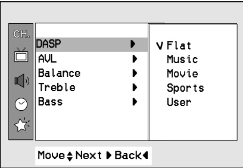

### AVL (Auto Volume Leveler)
AVL automatically keeps on an equal volume level even if you change channels.
### AVL setting using the MENU button

1.  Press the MENU button and then $\pmb{\triangle}/\pmb{\nabla}$ button until the menu is displayed as shown right.
2.  Press the $\blacktriangleright$ and then $\pmb{\triangle}/\pmb{\nabla}$ button to select AVL.
3.  Press the $\blacktriangleright$ and then $\pmb{\triangle}/\pmb{\nabla}$ button to select On or Off.
4.  Repeatedly press the MENU button to exit.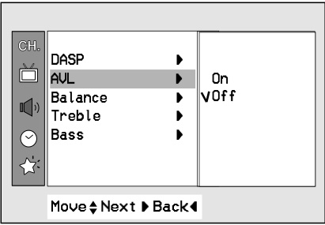

### Adjusting the balance (some models)
1.  Press the MENU button and then $\pmb{\triangle}/\pmb{\nabla}$ button until the menu is displayed as shown right.
2.  Press the $\blacktriangleright$ and then $\pmb{\triangle}/\pmb{\nabla}$ button to select Balance.
3.  Press the $\blacktriangleright$ and then $\blacktriangleleft/\blacktriangleright$ button to adjust the balance level.
4.  Repeatedly press the MENU button to exit.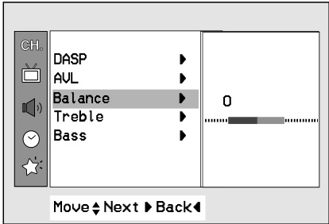

### Adjusting the treble (some models)
This function is to increase or decrease treble.

1.  Press the MENU button and then $\pmb{\triangle}/\pmb{\nabla}$ button until the menu is displayed as shown right.
2.  Press the $\blacktriangleright$ and then $\pmb{\triangle}/\pmb{\nabla}$ button to select Treble.
3.  Press the $\blacktriangleright$ button to enter the Treble mode.
4.  Press the $\blacktriangleleft$ button to adjust the treble level.
5.  Repeatedly press the MENU button to exit.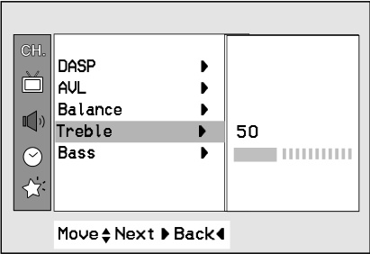

### Adjusting the bass (some models)
This function is to increase or decrease bass.

1.  Press the MENU button and then $\pmb{\triangle}/\pmb{\nabla}$ button until the menu is displayed as shown right.
2.  Press the $\blacktriangleright$ and then $\pmb{\triangle}/\pmb{\nabla}$ button to select Bass.
3.  Press the $\blacktriangleright$ button to enter the Bass mode.
4.  Press the $\blacktriangleleft/\blacktriangleright$ button to adjust the bass level.
5.  Repeatedly press the MENU button to exit.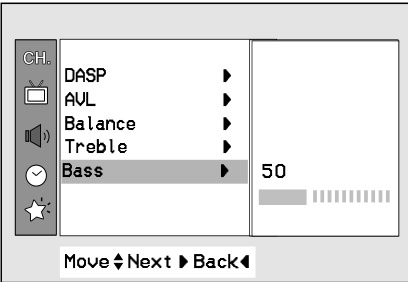

## Closed Caption Function (some models)

### Closed caption overview

Closed captioning is a process which converts the audio portion of a television program into written words, which then appear on the television screen in a form similar to subtitles. Closed captions allow viewers to read the dialogue and narration of television programs.

### Using Closed Captions
Captions are the subtitles of the dialogue and narration of television programs. For prerecorded programs, program dialogue can be arranged into captions in advance. It's possible to caption a live program by using a process called "real-time captioning", which creates captions instantly. Real-time captioning is normally done by professional reporters using a machine shorthand system and computer for translation into English. Captioning is an effective system for the hearing-impaired, and it can also aid in teaching language skills.
· The picture at left shows a typical caption.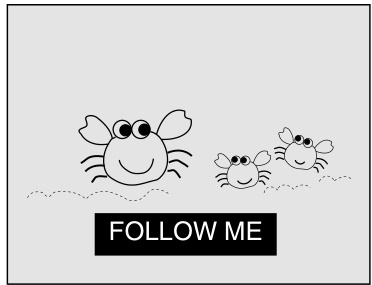

### Operating caption and text modes using the CAPTION button or MENU button
Not all TV broadcasts include closed caption signals. Sometimes TV stations broadcast two different caption signals on the same channel. By selecting MODE 1 or MODE 2, you can choose which signal you view. MODE 1 is usually the signal with the captions, while MODE 2 might show demonstration or programming information.

Text services give a wide variety of information on all kind of subjects (ex. captioned program lists, weather forecasts, stock exchange topics, news for hearing-impaired---) through the full TV screen. But not all stations offer text services, even though they might offer captioning.

Note: In the event you receive a poor signal, an empty black box may appear and disappear, even when the text mode is selected. This is normal function in such an event.

Using the CAPTION button:

1.  Press the CAPTION button.
2.  Press the CAPTION button to select OFF, Mode1, Mode2, Text1 Or Text2.
3.  Press the ENTER (O) button to exit.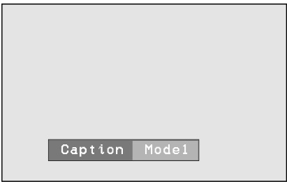

Using the MENU button:

1.  Press the MENU button and then use $▲/▼$ button to select the Special menu.
2.  Press the $\blacktriangleright$ and then $\pmb{\triangle}/\pmb{\nabla}$ button to select Caption.
3.  Press the $\blacktriangleright$ button and then use $\pmb{\triangle}/\pmb{\nabla}$ button to select Off, Mode1, Mode2, Text1 or Text2.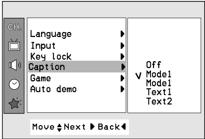
4.  Repeatedly press the MENU button to exit.

Note: This TV is programmed to remember which mode it was last set to, even if you turn the TV off.

### Caption reception problems and poor-signal cases

1.  Poor reception conditions are encountered:
    **IGNITION:** Picture may flutter, drift, suffer from black spots or horizontal streaking. Usually caused by interference from automobile ignition systems, neon lamps, electrical drills and other electrical appliances.
    **GHOSTS:** Ghosts are caused when the TV signal splits and follows two paths. One is the direct path and the other is reflected off tall buildings, hills or other objects. Changing the direction or position of the antenna may improve reception.
    **SNOW:** If your receiver is located at the weak, fringe area of a TV signal your picture may be marred by small dots. It may be necessary to install a special antenna to improve the picture.
2.  An old, bad or illegally recorded tape is played.
3.  Strong, random signals from a car or airplane interfere with the TV signal.
4.  The signal from the antenna is weak.
5.  The program wasn't captioned when it was produced, transmitted or taped.

# Connections

## Antenna Connections

### Connecting an Outdoor Antenna
For the best reception, we recommend you use an outdoor antenna. Severely weathered antennas and antenna cables can reduce the signal quality. Before connecting it, necessarily inspect them. Any service center can explain the various outdoor antennas available to you.

### Connecting an outdoor antenna with 300 Ohm flat wire
1.  Connect the 300 ohm flat wire to screws on the 300 ohm to 75 ohm adapter.
2.  Push the end of 300 ohm to 75 ohm adapter into 75 ohm antenna jack.

### Connecting an outdoor antenna with 75 Ohm coaxial cable
1.  Connect the 75 ohm coaxial cable directly to the 75 ohm antenna jack.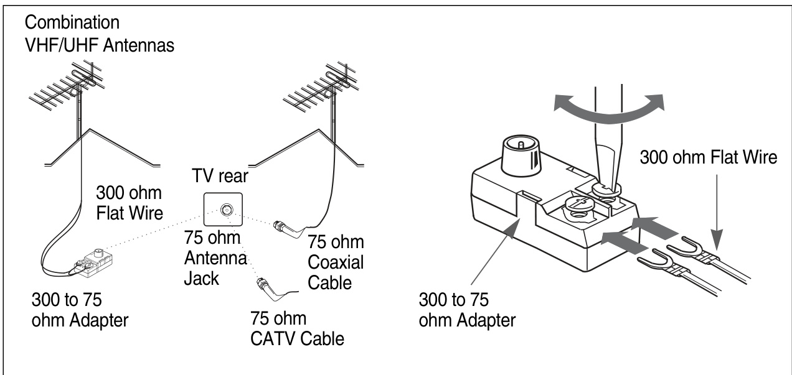

### Connecting a CATV Cable
If you subscribe to a CATV system, change the antenna connection as described below.

1.  Remove the 300 to 75 ohm adapter or the cable from the set if attached.
2.  Connect the CATV cable (75 ohm coaxial cable) to the 75 ohm antenna jack.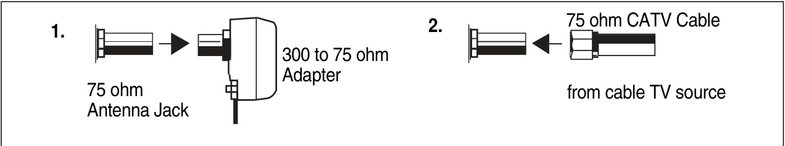

## Connection of External Equipment (some models)

### External equipment jack layout and mode selection

You can connect additional equipment, such as VCRs, camcorders etc. to your set. Here shown may be somewhat different from your set. These are an example drawing of typical jack layout.

1.  IN 1 JACKS: Connect external equipment outputs (VCR, LASER DISC, CAMCORDER) to these inputs. Press the TV/VIDEO button to select VIDEO 1.
2.  IN 2 JACKS: Connect external equipment outputs (VCR, LASER DISC, CAMCORDER) to these inputs. Press the TV/VIDEO button to select VIDEO 2 or S-VIDEO.
3.  OUT JACKS: Connect external equipment inputs (VCR, Audio amplifier) to these outputs for recording or monitering the selected program.
4.  Q/EARPHONE JACK (some models): In some models, this jack is located on the front or side of TV.
    Note: This TV is programmed to remember which mode it was last set to, even if you turn the TV off.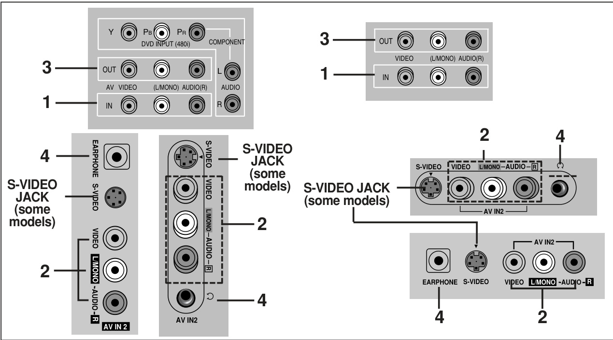

### Connecting AUDIO/VIDEO IN Jacks
1.  Connect the audio/video output jacks of the VCR to IN 1(A/V) jacks on the side or back of TV. If you connect the audio jack only, you can't hear the sound from the TV.
2.  Press the TV/VIDEO button to select VIDEO1.
    Note: In some stereo models, if you connect the audio/video output jacks of the VCR to the IN 2 (A/V) jacks on the front or side of TV, select VIDEO2.
3.  Press the PLAY button on the VCR. The video playback is on the TV screen.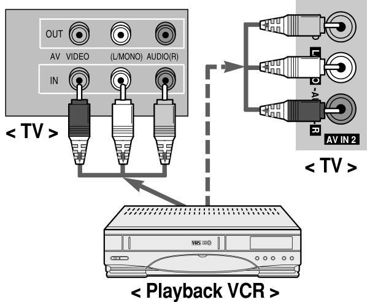

Note: In case of MONO VCR, connect the output jack of VCR to the AUDIO L/MONO IN jack of TV so that the sound can be heard from both speakers. If you connect it to the AUDIO R IN jack of TV the sound is heard only from right speaker.
Note: In some mono models, when the input jacks on the front panel and back panel are connected to external equipments at the same time, the input jacks on the front panel have priority over the input jacks on the back panel of the TV.

### Connecting the S-VHS VCR (some models)
1.  Connect the S-VHS output jack of the VCR to the S-VIDEO jack on the side or back of TV.
2.  Connect the audio/video output jacks of the VCR to the IN 2(A/V) jacks on the front or side of TV.
3.  Press the TV/VIDEO button to select S-VIDEO.
4.  Press the PLAY button on the VCR. The video playback is visible on the TV screen.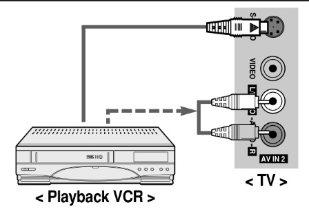

### VCR Recording (some models)
1.  Connect the audio/video input jacks of the recording VCR to the OUT(A/V) jacks on the back.
2.  Select the program number on the TV.
3.  Set the recording VCR to record.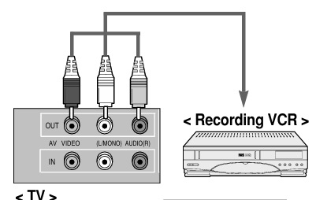

### Recording a program from connected other equipment (some models)
1.  Connect the output jacks of the playback VCR to the IN 1(A/V) jacks on the side or back of TV.
2.  Connect the input jacks of the recording VCR to the OUT (A/V) jacks on the back of TV.
3.  Press the TV/VIDEO button to select VIDEO 1. If you connect it to the IN 2 (A/V) jacks on the side of TV, you should select VIDEO 2.
4.  Press the PLAY button on the playback VCR and set the recording VCR to record.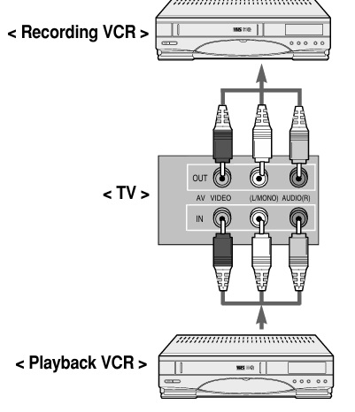

## Connecting DVD Player (some models)

### DVD component input overview

· Connect component DVD inputs to Y, PB, PR (480i) and audio IN to audio(L/R) ports.
· Note: This TV is programmed to remember which mode it was last set to, even if you turn the TV off.

**1. How to connect**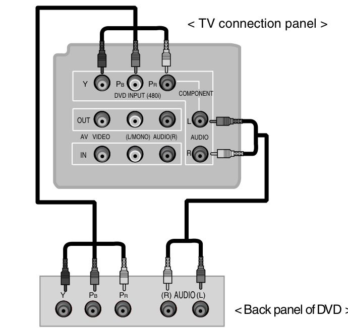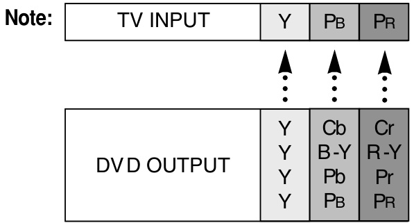

### DVD player input selection and playback
· Turn the set on and press the TV/VIDEO button on the remote control or TV/VIDEO button on the front panel to select COMPONENT.
· Try this after turning on the DVD set.

# Troubleshooting Check List

## SYMPTOMS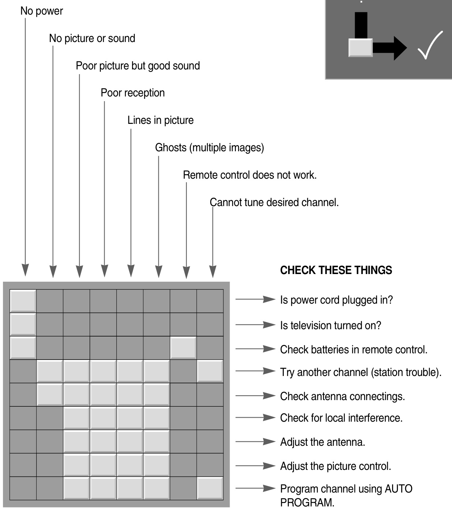