# Toothbrush

## Product Overview

### Product Image, Benefits, Intended Use, and Box Contents

Congratulations on your new toothbrush\! Superior plaque removal, whiter teeth, and healthier gums are at your fingertips. Using a combination of gentle sonic technology and clinically developed and proven features, you can be confident that you’re getting the very best clean, every time.

Toothbrushes are intended to remove adherent plaque and food debris from the teeth to reduce tooth decay and improve and maintain oral health. Prestige power toothbrushes are intended for consumer home use. Use by children should be supervised by an adult.

1 Hygienic travel cap
2 Premium All-in-One brush head (A3)
3 BrushSync symbol
4 Handle
5 Power on/off button
6 Intensity indicator and hidden button
7 SenseIQ indicator
8 Brush head replacement reminder indicator
9 Battery indicator
10 Brushing feedback light
11 Charging base
12 Charging stand
13 USB-A wall adapter
14 USB-C cord
15 Charging travel case
16 USB-C socket
Note: The content of the box may vary based on your purchase. The following symbols may appear on the product: Read Operator’s Manual.

# Important Safeguards

## Safety Overview and Dangers

### General Precautions and Electrocution Risk Prevention

READ ALL INSTRUCTIONS BEFORE USE. Read this user manual carefully before you use the appliance and save it for future reference. When using electrical products, especially when children are present, basic safety precautions should always be followed, including the following:

To reduce the risk of electrocution:

  - Keep the USB wall adapter and chargers away from water.
  - Do not place or store product where it can fall or be pulled into a tub or sink.
  - Do not place in or drop into water or other liquid.
  - Do not immerse the charger in water or any other liquid.
  - Do not reach for a product that has fallen into water. Unplug immediately.
  - Do not use while bathing.
  - After cleaning, make sure the USB wall adapter is completely dry before you connect it to a power outlet.

## Warnings and Medical Guidance

### Injury, Fire, Product Damage, and Medical Consultation Warnings

To reduce the risk of burns, electrocution, fire or physical injury:

  - Never use the USB wall adapter if it is damaged.
  - If the appliance is damaged in any way (brush head, toothbrush handle, USB wall adapter, charging travel case and/or charger), stop using it.
  - This appliance contains no user serviceable parts. If the appliance is damaged, contact the Consumer Care Center in your country.
  - The charging base's cord cannot be replaced. If the charging base cord is damaged, discard the charging base.
  - Always have the USB wall adapters and chargers replaced with one of the original type in order to avoid a hazard.
  - Keep cord away from heated surfaces.
  - Do not use the charger outdoors.
  - Do not use the charger if dropped into water.
  - This product is designed to clean your teeth, gums and tongue only. Use this product only for its intended use as described in this booklet. Discontinue use of this product and contact a physician/dentist if discomfort or pain is experienced.
  - This appliance may be used by children aged from 8 years and above and persons with reduced physical, sensory or mental capabilities, or lack of experience and knowledge, if they have been given supervision or instruction concerning the safe use of the appliance and understand the hazards involved. Cleaning and user maintenance shall not be performed by children without supervision.
  - Children shall not play with the appliance.
  - Do not use attachments.
  - To avoid damage to the product, do not place the brush head, handle, charger or charger covers in the dishwasher for cleaning.

  - Consult your dental professional before you use this product if you have had oral or gum surgery in the previous 2 months.
  - Contact your dental professional if excessive bleeding occurs after using this product or bleeding continues to occur after 1 week of use.
  - If you have a pacemaker or other implanted device contact your physician or the device manufacturer prior to use.
  - This toothbrush has been tested and is compliant with safety standards for electromagnetic devices.
  - Consult your physician prior to using the toothbrush if you have medical concerns.

## Battery Safety Instructions

### Battery Charging, Storage, and Handling Safety

- Only use this product for its intended purpose and follow the general and battery safety instructions as described in this user manual. Any misuse can cause electric shock, burns, fire and other hazards or injuries.
  - To charge the battery, only use the USB wall adapter, charging base and charging travel case.
  - Charge, use and store the product at a temperature between 0°C and 40°C.
  - Do not burn products and their batteries and do not expose them to direct sunlight or to high temperatures (e.g. in hot cars or near hot stoves). Batteries may explode if overheated.
  - If the product becomes abnormally hot, gives off an abnormal smell, changes color or if charging takes much longer than usual, stop using and charging the product and contact service center.
  - Do not place products and their batteries in microwave ovens or on induction cookers.
  - This product contains a rechargeable battery that is nonreplaceable. Do not open the product to replace the rechargeable battery during the usable life of your device.
  - When you handle batteries, make sure that your hands, the product and the batteries are dry.
  - To prevent batteries from heating up or releasing toxic or hazardous substances, do not modify, pierce or damage products and batteries and do not disassemble, short-circuit, overcharge or reverse charge batteries during the usable life of your device.
  - To avoid accidental short-circuiting of batteries after removal, do not let battery terminals come into contact with metal objects (e.g. coins, hairpins, rings). Do not wrap batteries in aluminum foil. Tape battery terminals or put batteries in a plastic bag before you discard them.
  - If batteries are damaged or leaking, avoid contact with the skin or eyes. If this occurs, immediately rinse well with water and seek medical care.

## EMF and FCC Compliance

### EMF, FCC, Interference, and License-Exempt Device Conditions

This appliance complies with all applicable standards and regulations regarding exposure to electromagnetic fields.

  - Radio Equipment in this product operates at 13.56 MHz
  - Maximum RF power transmitted by the Radio Equipment is 30.16dBm
  - The Bluetooth radio frequency interface in this product operates at 2.4 GHz. The maximum output power by the Bluetooth appliance is 3 dBm

Changes or modifications not expressly approved by Philips could void the user's FCC authorization to operate the toothbrush. This device complies with Rules. Operation is subject to the following two conditions: (1) this device may not cause harmful interference, and (2) this device must accept any interference received, including interference that may cause undesired operation.

This equipment has been tested and found to comply with the limits for a Class B digital device, pursuant to part 15 of the FCC Rules. These limits are designed to provide reasonable protection against harmful interference in a residential installation. This equipment generates, uses and can radiate radio frequency energy and, if not installed and used in accordance with the instructions, may cause harmful interference to radio communications. However, there is no guarantee that interference will not occur in a particular installation. If this equipment does cause harmful interference to radio or television reception, which can be determined by turning the equipment (handle) off and on, the user is encouraged to try to correct the interference by one or more of the following measures:

  - Reorient or relocate the receiving antenna (of the radio or television).
  - Increase the separation between the equipment (handle) and receiver.
  - Connect the equipment (charger) into an outlet on a circuit different from that to which the receiver is connected.
  - Consult the dealer or an experienced radio/TV technician for help.

This device contains license-exempt transmitter(s)/receiver(s) that comply with Innovation, Science and Economic Development. Operation is subject to the following two conditions: 1. This device may not cause interference. 2. This device must accept any interference, including interference that may cause undesired operation of the device.

SAVE THESE INSTRUCTIONS.

# App & Connectivity

## App Setup, Sync, and Features

### Connected Experience, Pairing, Sync, Privacy, and Settings

The app pairs with your toothbrush to provide you a connected experience. By connecting your toothbrush to your app account, you will be able to:

  - Customize your toothbrush settings according to your preferred modes, intensity and toothbrush feedback.
  - Track your brushing progress.
  - Receive personalized tips and actionable recommendations to improve your oral health.
  - Access the full range of benefits and receive ongoing upgrades to your Prestige experience.

The app is compatible with a wide range smartphones. To start using the app:
1 Download the app to your phone.
2 Ensure your phone's Bluetooth is turned on.
3 Pick up your toothbrush to ensure it is active (lights on).
4 Open the app and follow guided steps.
5 Pair your toothbrush with the app.
6 Create your account via the app. Complete firmware update, if prompted, to access the latest improvements and features.
7 Brush regularly. You are ready to start your connected experience. When you regularly sync the toothbrush with the app, you can receive updates to help improve your oral healthcare.
8 Sync regularly.

  - To sync manually: Pair/connect your toothbrush with the app every couple of weeks to benefit from the app features/capabilities.
  - To sync automatically: Allow location permission while setting up the app. By allowing location permissions, your phone knows when it is in the connection range of your toothbrush and can refresh your brushing data to the app to provide the latest insights and recommendations.

Note: Make sure your phone's Bluetooth is turned on when using the app so that your toothbrush can transfer and update your brushing data to the app. If you have questions about why your brushing data is collected, be sure to review the Privacy Statement, available throughout the app setup process.

The App provides customizable settings for your toothbrush according to your preference, including:

  - Intensity Settings
  - Mode Controls
  - Enable and disable Adaptive Intensity
  - Enable and disable Scrubbing feedback

# Using Your Toothbrush

## Brush Head and Brushing Instructions

### Brush Head Overview, Attachment, and Starting Position

Your toothbrush comes with the new "brush head". This brush head is specifically designed to provide exceptional plaque removal, whitening (stain removal), and gum health benefits. Premium All-in-One brush heads come with BrushSync Technology (see description below) as indicated by the symbol at the bottom of the brush head.

1 Push the brush head firmly onto the handle.
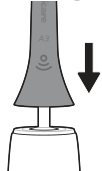
Note: It is normal to see a slight gap between the brush head and the handle. This allows the brush head to vibrate properly.
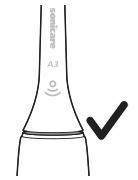
2 Wet the bristles and apply a small amount of toothpaste.
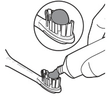

3 Place the toothbrush bristles against the teeth at a slight angle (45 degrees). Apply light pressure to make the bristles reach the gumline or slightly beneath the gumline.
Note: Keep the center of the brush head in contact with the teeth at all times.
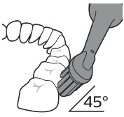
4 Press the power on/off button to turn on the Philips Sonicare.
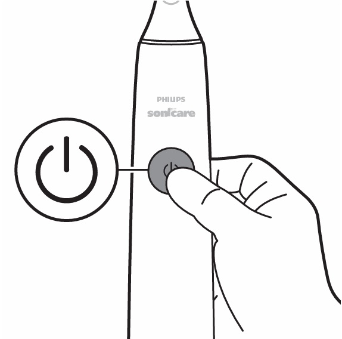

### Brushing Motion, Front Teeth, and BrushPacer Segments

5 Apply light pressure to maximize Philips Sonicare’s effectiveness and let the Philips Sonicare toothbrush do the brushing for you.
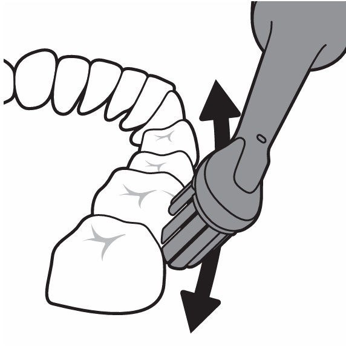
Note: The bristles should slightly flare. Do not scrub. A change in vibration from the handle and the brushing feedback light flashes purple to alert you when you apply too much pressure. Gently move the brush head slowly across the teeth in a small back and forth motion so the longer bristles reach between your teeth. Continue this motion throughout the brushing cycle.
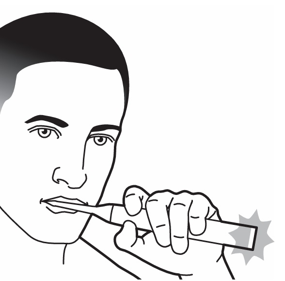

6 To clean the inside surfaces of the front teeth, tilt the brush handle semi-upright and make several vertical overlapping brushing strokes on each tooth.
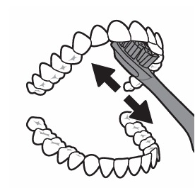
7 The BrushPacer divides the brushing time into six equal segments and indicates when you should move to the next area. Segments are indicated with a brief pause in vibration. The toothbrush automatically stops at the end of the brushing session.
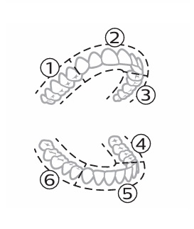
Note: Your toothbrush is safe to use on braces, dental modifications and dental restorations (fillings, crowns, veneers).

## Brushing Modes and Intensity

### Mode Selection and Manual/App-Based Intensity Adjustment

Your power toothbrush comes pre-set to the all-in-one clean mode that provides the dentist recommended 2 minute brushing routine, with a six segment brush pacer. To personalize your brushing mode you can customize your power toothbrush settings from the app.
Note: Although a mode is not displayed on the toothbrush handle, you can update the mode any time from the App and your selection will be stored.

Your power toothbrush comes with 3 different intensity settings:

  - High intensity (three lights)
  - Medium intensity (two lights)
  - Low intensity (one light)
    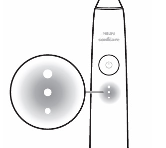
    To manually select your desired intensity, press the intensity indicator lights on the handle, to cycle through the options. The intensity setting can be changed before, during, or after brushing.
    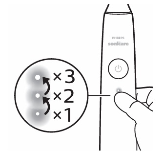
    Note: The intensity setting can also be customized from the app.

# Features & Settings

## Smart Features and Feedback

### BrushSync, SenseIQ, and Pressure Feedback

BrushSync technology enables your brush head to communicate with your handle using a microchip. The symbol at the bottom of the brush head indicates that the brush head is equipped with this technology. BrushSync technology enables:

  - Brush head replacement reminder
  - BrushSync mode pairing (for Tongue Care brush heads)
    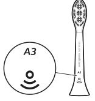

Your toothbrush is equipped with SenseIQ technology that is a combination of smart features that observe your brushing behaviors (e.g. motions, habits, brush head choice) and provide personalized feedback and recommendations. The SenseIQ features include:

  - Adaptive Intensity
  - Real time feedback:
      - Scrubbing Feedback
      - Pressure Sensor Feedback
  - Personalized recommendations in the app
  - Brushing behavior feedback in the app

The SenseIQ icon on the handle will illuminate when the smart features are active:

  - while brushing
  - to confirm enabling and disabling of settings
    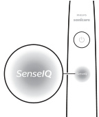

Your toothbrush measures the pressure you apply while brushing to protect your gums and teeth from damage. If you apply excess pressure, the handle will change its vibration and the brushing feedback light will flash (purple) at the bottom of the handle until you reduce the pressure.
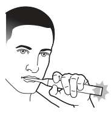
Note: The Pressure Sensor comes activated with your product. To deactivate this feature, see 'Activating or deactivating features'.

### Adaptive Intensity, Scrubbing Feedback, BrushPacer, and Replacement Reminder

Your toothbrush is designed with Adaptive Intensity to protect your gums. If you apply excess pressure for an extended period of time, your toothbrush will automatically lower the intensity setting 1 level. You will experience a brief pause in the pressure feedback and feel the intensity adjust to the next lower level.
Note: Adaptive Intensity comes activated with your product. To deactivate this feature, see 'Activating or deactivating features'.
Note: Every new brushing cycle the intensity will go back to your pre-selected setting.

Your toothbrush measures the motions while brushing to detect scrubbing behavior (see brushing instructions for optimal technique). If you regularly scrub while brushing, the app will recommend that you enable Scrubbing Feedback. When Scrubbing Feedback is activated the brushing feedback light at the bottom of the handle will illuminate amber and the handle will change its vibration as a reminder to stop scrubbing. The brushing feedback light will turn off when you stop scrubbing.
Note: Scrubbing Feedback comes deactivated. To activate this feature, see 'Activating or deactivating features'.
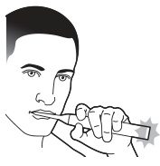

The BrushPacer divides the brushing time into six equal segments and indicates when you should move to the next area. Segments are indicated with a brief pause in vibration. The toothbrush automatically stops at the end of the brushing session.
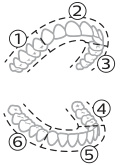
Note: Additional segments may be added when you use White or Gum Health Modes. See app for mode descriptions.

Your toothbrush will track the wear of your smart brush head, using the technology to measure:

  - The overall pressure you apply while brushing
  - The total time you have brushed with your brush head
    Once your brush head is no longer effective, the brush head replacement reminder indicator light will blink amber and the handle will make a series of beeps and tones to indicate it is time to replace your brush head.
    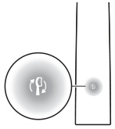
    Note: The brush head replacement reminder comes activated with your product. To deactivate this feature, see 'Activating or deactivating features'.

## Feature Activation and Deactivation

### Configurable Features, App Controls, Handle Controls, and Indicators

You can activate or deactivate the following features of your toothbrush:

  - Adaptive Intensity
  - Pressure Sensor Feedback
  - Scrubbing Feedback
  - Brush head replacement reminder
    Note: Adaptive Intensity will be deactivated when pressure sensor is deactivated.

The following features can be activated or deactivated from the app:

  - Adaptive Intensity
  - Scrubbing Feedback

Step 1: Place the handle on the charging stand.
Step 2: Press and hold power button for:
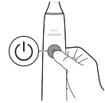

  - Adaptive intensity: up to 3 seconds. 1 beep. SenseIQ indicator lights up for 3 seconds.
  - Brush head replacement reminder: Up to 5 seconds. 1 beep and then 2 beeps. Brush head replacement reminder indicator lights up for 3 seconds.
  - Pressure Sensor Feedback: Up to 7 seconds. 1 beep, 2 beeps and then 3 beeps. SenseIQ indicator and light ring lights up purple for 3 seconds.
    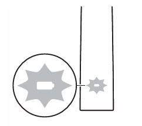

Together with:
If you see the battery indication blink white 3 times and hear 3 tones from low to high, then the feature has been activated.
OR
If you see battery indication blink amber 3 times and hear 3 tones high to low, then the feature has been deactivated.

# Charging & Battery Status

## Charging Methods and Battery Status

### Charging Base, Travel Case, and Battery Status Indicators

1 Plug the USB cord of the charging base into the USB wall adapter and plug the wall adapter into an electrical outlet.
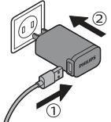
2 Place the charging stand (clear cover) on the charging base.
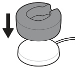
3 Place the toothbrush handle on the charger.
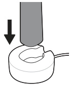
a To indicate charging has started successfully, the toothbrush will beep twice and the lights will illuminate in an upward motion.
b While charging the battery indicator blinks in white.
4 Leave the toothbrush on the charger until it is fully charged. The battery light will turn off (stop blinking) when the handle has finished charging.
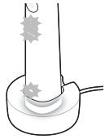
Note: It may take up to 16 hours to fully charge your toothbrush.

1 Plug the USB cord into the travel case and into the USB wall adapter.
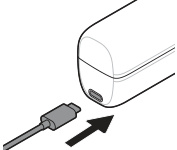
2 Plug the wall adapter into an electrical outlet.
3 Place toothbrush into travel case.
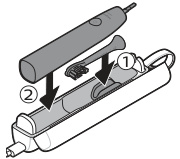
a To indicate charging has started successfully, the toothbrush will beep twice and the lights will illuminate in an upward motion.
b While charging the battery indicator blinks in white.
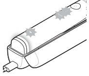
4 Leave travel case plugged in until toothbrush is fully charged. The battery light will turn off (stop blinking) when the handle has finished charging.
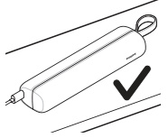
Note: Make sure the travel case is placed on its side for better stability.

When the handle is placed on the charger or in the travel case, the battery indication will communicate the battery level.
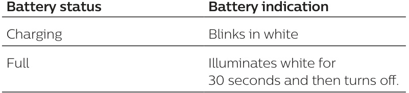

When the toothbrush is awake, the battery light at the bottom of the handle will indicate the status of the battery.
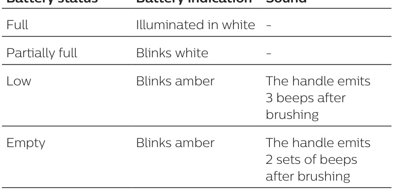

# Cleaning, Storage & Disposal

## Cleaning Instructions

### Brush Head, Handle, Travel Case, and Charger Cleaning

The brush heads and handle can be cleaned by rinsing it with warm water.
1 Remove the brush head from the handle and rinse it thoroughly.
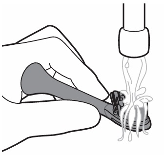
2 Rinse the entire handle, especially the brush head connection. Gently clean around the rubber seal. At least once a week.
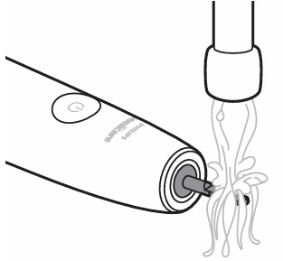
Note: Do not push on the rubber seal at the top of the handle.
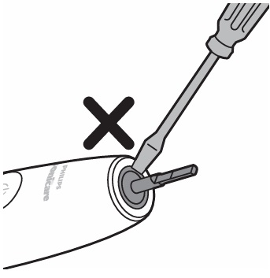

1 Unplug the charger and travel case before you clean them.
2 Use damp cloth to wipe the surface of the charger and travel case.
Danger: Unplug the USB wall adapter and chargers before cleaning them.

## Cautions, Storage, and Disposal

### Cleaning Restrictions, Long-Term Storage, and Recycling Disposal

- Do not clean the product or accessories in the dishwasher.
  - Do not use isopropyl alcohol, vinegar, bleach, or any other household cleaning products, to clean the product or accessories as this may cause discoloration.
  - Make sure brush head and toothbrush are dry before storing in travel case.
  - Do not use essential oils to clean the brush head, the product or accessories as this can cause damage.

If you are not going to use the product for an extended period of time, unplug it from the electrical outlet, clean it and store it in a cool and dry place away from direct sunlight.

  - This product contains a rechargeable lithium-ion battery which must be disposed of properly.
  - Contact your local town or city officials for battery disposal information.
  - Your product is designed and manufactured with high quality materials and components, which can be recycled and reused.
  - This symbol means that electrical products and batteries shall not be disposed of with normal household waste.
  - The built-in rechargeable battery must be removed by a qualified professional when the product is discarded.
