# Vacuum 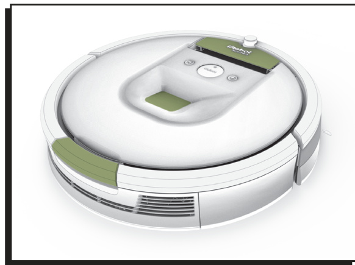

# Safety Instructions

## General Safety

### Electrical Safety, Service Limits, and Operating Environment

CAUTION\! Do not expose the electronics, its battery or the integrated dock charger. There are no user-serviceable parts inside. Refer servicing to qualified service personnel. Please ensure voltage rating for enclosed matches standard outlet voltage.

Heed all warnings on the vacuum, battery, Home Base and in the owner's guide.

Follow all operating and use instructions. Use vacuum only in dry environments. Do not spray or pour liquids on vacuum.

Do not operate vacuum in areas with exposed electrical outlets in the floor.

vacuum comes with a region-approved power supply cord. Do not use any other power supply cord. For replacement cords.

### Household Preparation, Drop-Off Risks, and Supervision

Before using vacuum, pick up objects like clothing, loose papers, pull cords for blinds or curtains, power cords and any fragile objects. If the vacuum passes over a power cord and drags it, there is a chance an object could be pulled off a table or shelf.

If the room to be cleaned contains a balcony, a physical barrier should be used to prevent access to the balcony and ensure safe operation.

Read all safety and operating instructions before operating this vacuum. This vacuum is not intended for use by persons (including children) with reduced physical, sensory or mental capabilities, or lack of experience and knowledge, unless they have been given supervision or instruction concerning use of Vacuum by a person responsible for their safety. Retain the safety and operating instructions for future reference.

Children should be supervised to ensure they do not play with vacuum. Cleaning and maintenance shall not be performed by children without supervision.

Do not place anything on top of vacuum. Be aware that Roomba moves on its own. Take care when walking in the area that vacuum is operating to avoid stepping on it.

## Use Restrictions

### Indoor Use, Storage Conditions, and Prohibited Materials

vacuum is for indoor use only. vacuum is not a toy. Do not sit or stand on this device. Small children and pets should be supervised when vacuum is operating.

Store and operate vacuum in room temperature environments only. Clean iAdapt localization camera with a cloth dampened with water only.

Do not use vacuum to pick up anything that is burning or smoking. Do not use vacuum to pick up spills of bleach, paint other chemicals or anything wet.

## Battery and Charging

### Approved Charging, Battery Pack, and Handling Requirements

Charge using a standard outlet only. vacuum may not be used with any type of power converter. Use of other power converters will immediately void the warranty.

Use only rechargeable battery packs with the correct specification. Do not use a vacuum with a damaged cord or plug.

Always charge and remove the battery from your vacuum and accessories before long-term storage or transportation.

Charge indoors only. vacuum's vacuum may be protected with a surge protector in the event of severe electrical storms.

Never handle the vacuum with wet hands. Always disconnect vacuum from the vacuum before cleaning or maintaining it.

Ensure voltage rating for enclosed vacuum matches standard outlet voltage. Used battery packs should be placed in a sealed plastic bag and disposed of safely according to local environmental regulations.

### Battery Damage Prevention, Disposal, Recycling, and Collection Rules

Before every use, check the battery pack for any sign of damage or leakage. Do not charge damaged or leaking battery packs. The battery pack must be removed before disposal. Do not heat or place the battery pack near any heat source. Do not incinerate the battery pack. Do not short-circuit the battery pack. Do not immerse the battery pack in any liquid.

Contact your local waste management authority for battery recycling and disposal regulations in your area. This symbol on the product or its packaging indicates: Do not dispose of electrical appliances as unsorted municipal waste, use separate collection facilities. Contact your local authority for information regarding the collection systems available. If electrical appliances are disposed of in landfills or dumps, hazardous substances can leak into the ground water and get into the food chain, damaging your health and well-being.

Please contact your local or regional waste authority for more information on collection, reuse and recycling programs.

# Product Overview

## Exterior Layout and Indicators

### Top View, Buttons, Indicators, and Bottom View Diagrams

The following diagrams show the vacuum top view, button and indicator layout, and bottom-side layout.

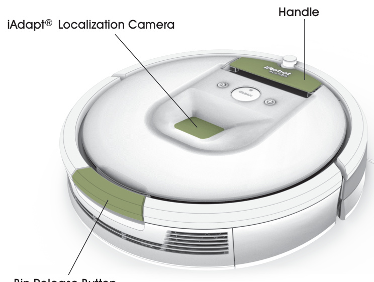

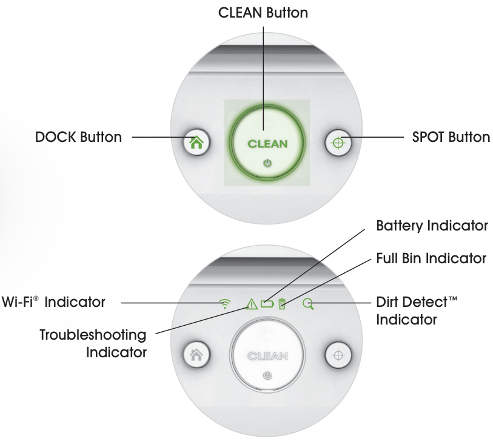

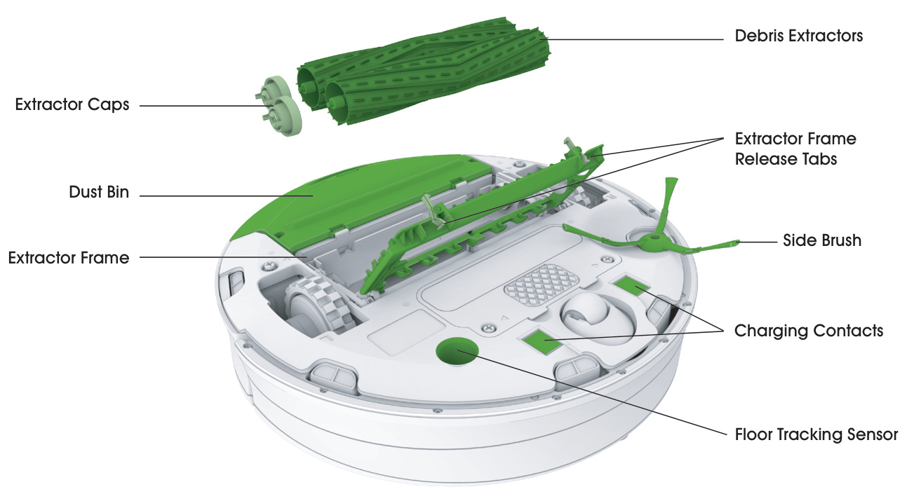

# Setup and Operation

## Initial Setup

### Placement, Activation, and First Cleaning Readiness

Place the vacuum in an open, uncluttered area, leaving the following distances around the unit: At least 1.5 feet on each side of the vacuum. At least 4 feet in front of the vacuum, and at least 4 feet away from stairs. At least 8 feet from virtual wall barriers. Always keep the vacuum plugged in and make sure it is in an area with consistent coverage to allow vacuum to receive information via the app.

Turn vacuum over and remove the yellow bin insert and battery pull tab. Then, place vacuum to activate the battery.

vacuum has a partial battery charge, so it's ready to start cleaning.

### App Setup, Scheduling, Updates, and Help

Watch an overview video with instructions on how to setup and use your vacuum. Set an automatic cleaning schedule (up to 7 times per week) and customize cleaning preferences. Enable automatic software updates. Access to tips, tricks and answers to commonly asked questions.

## Cleaning Operation

### Starting, Pausing, Resuming, and Ending a Cleaning Cycle

Manually wake vacuum up one of two ways - By pressing CLEAN once. vacuum will beep and the CLEAN button will illuminate. To start a cleaning cycle, press CLEAN again. By pressing CLEAN button on the app homescreen.

NOTE: Remove excess clutter from floors before cleaning (e.g. clothing, toys, etc.). Use vacuum frequently to maintain well-conditioned floors.

To pause vacuum during a cleaning cycle, press CLEAN. To resume the cleaning cycle, press CLEAN again. To end the cleaning cycle and put vacuum in standby mode, press and hold CLEAN until indicators turn off.

### Recharge, Dock Return, SPOT Cleaning, and Full Bin Behavior

If its battery gets low before finishing a cleaning cycle, vacuum returns to recharge. It will not play a tone when it docks and its CLEAN button will pulse with the battery indicator (). After its battery has been recharged, vacuum automatically returns to where it left off and completes the cleaning cycle.

You can check the app for a current status of your vacuum. If vacuum is returning to recharge after completing a cleaning cycle, it will play a series of tones to indicate successful completion of the cleaning cycle.

To send vacuum back to its Home Base during a cleaning cycle, press CLEAN and then (DOCK) on or press CLEAN on the app main screen. This will end the cleaning cycle. If vacuum encounters an area of high debris concentration, it will move in a forward/backward motion to clean the area more thoroughly. When vacuum does this, you will see the indicator illuminate.

To use SPOT Cleaning, place vacuum on top of the localized debris and press (SPOT) on the robot. vacuum will intensely clean the area by spiraling outward about 3 feet in diameter and then spiraling inward to where it started.

When vacuum senses that its dust bin is full it is programed to complete its cleaning cycle by default. You can adjust this setting under Cleaning Preferences in the app. vacuum won't leave for a cleaning cycle if its bin is full. In this case, remove and empty the bin, then reinsert it before starting or resuming a cleaning cycle.

NOTE: After each use, empty the bin and clean the filter. Always store vacuum so it's charged and ready to clean when you need it. If storing off of the Home Base, remove the battery first and then store Roomba and the battery in a cool, dry place.

## Virtual Wall Barrier

### Purpose, Storage Position, Halo Mode, and Virtual Wall Mode

The dual mode virtual wall barrier keeps vacuum in the places you want to be cleaned - and out of the ones you don't. In between cleaning cycles, you can leave the device operating in its position on the floor. You can set your device to one of two modes to fit your home's cleaning needs. (See Figure 1) NOTE: Under normal use, batteries will last 8-10 months.

If you are not planning on using your virtual wall device for an extended period of time and you would like to store it, be sure to switch it to the "Off" (middle) position. 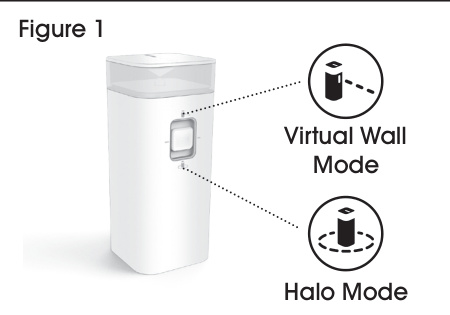

Halo Mode: When the switch is in the "down" position, the device creates a protective zone that Roomba will not enter. This prevents vacuum from bumping into items you want to protect (e.g. a dog bowl or vase) or crossing into undesired areas (e.g. a corner or under a desk). The halo is invisible and reaches approximately 24 inches from the center of the device. (See Figure 3) 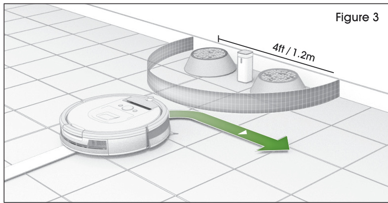

Virtual Wall Mode: When the switch is in the "up" position, the device functions as a virtual wall. This means that you can set it to block openings of up to 10 feet. It creates an invisible, cone-shaped barrier that only vacuum can see. (See Figure 2) 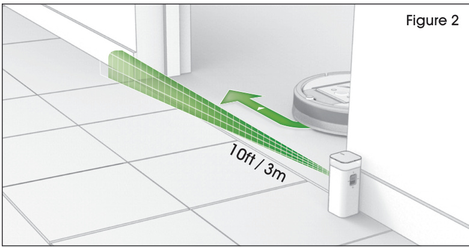 NOTE: This barrier gets wider as it gets further from the device. (See Figure 2)

# Care and Maintenance

## Routine Bin and Filter Maintenance

### Maintenance Frequency

To keep Roomba running at peak performance, perform the following care procedures. If you notice vacuum picking up less debris from your floor, then empty the bin, clean the filter and clean the extractors. 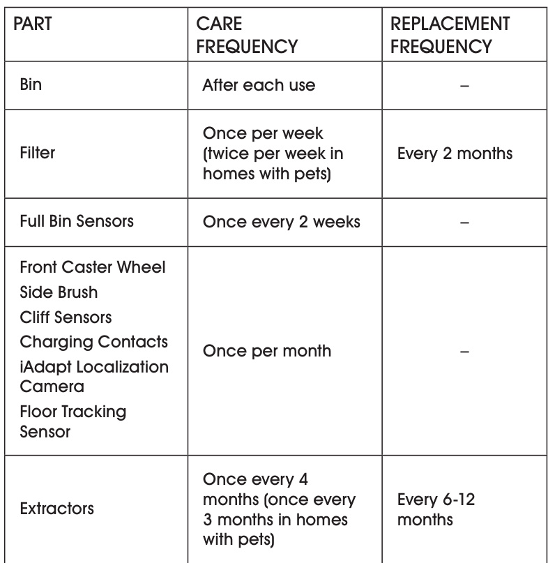

### Emptying the Bin

1.  Press bin release button to remove bin. (See Figure 4) 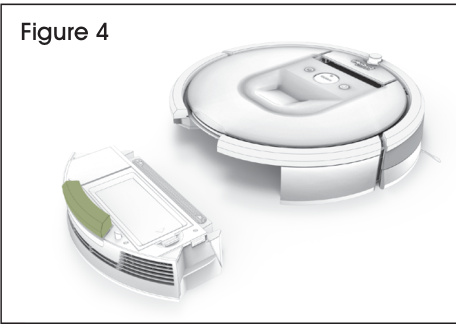
2.  Open bin door to empty bin. (See Figure 5) 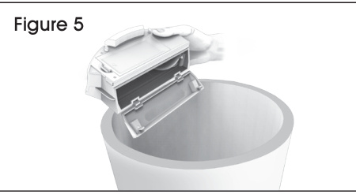

NOTE: If the full bin indicator comes on at any time during a cleaning job, you can always pause the cleaning job to empty the bin and then continue cleaning. If the full bin indicator is illuminated, but the bin does not appear to be full, refer to Cleaning the Full Bin Sensors.

### Cleaning the Filter

3.  Remove filter by grasping the yellow tab. (See Figure 6) 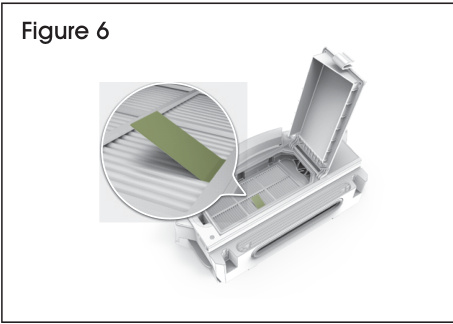
4.  Shake off debris by tapping the filter against your trash container. (See Figure 7) 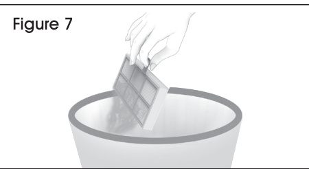

IMPORTANT\! The filter door won't close unless a filter is reinserted. Insert the filter with the yellow tab facing up.

### Cleaning the Full Bin Sensors

1.  Remove and empty the bin. (See Figure 8) 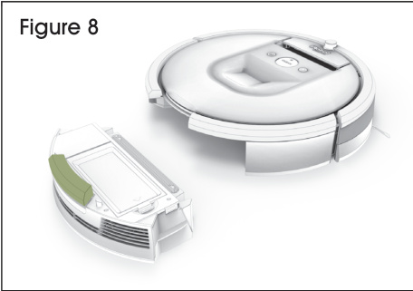
2.  Wipe the sensors with a clean, dry cloth. (See Figure 9) 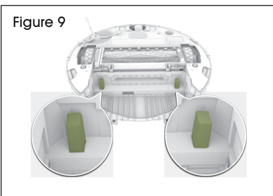
3.  Wipe the inner and outer sensor ports on the bin with a clean, dry cloth. (See Figure 10) 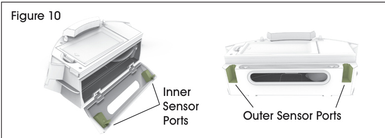

## Mechanical Parts and Contact Cleaning

### Cleaning the Front Wheel

1.  Pull firmly on the front wheel to remove it. (See Figure 11) 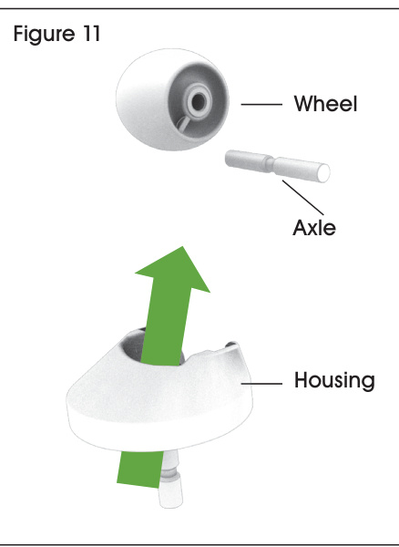
2.  Remove any debris from inside the wheel cavity.
3.  Spin the wheel by hand. If rotation is restricted, remove the wheel from its housing and push firmly to remove the axle and clear any debris or hair wrapped around it.
4.  Reinstall all parts when finished. Make sure the wheel clicks back into place.

### Cleaning the Side Brush

1.  Use a coin or small screwdriver to remove the screw. (See Figure 12) 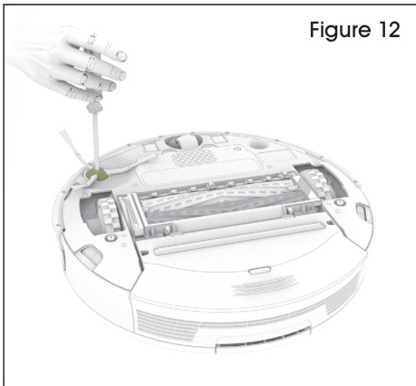
2.  Remove the brush clean the brush and the brush post, and reinstall the brush.

### Cleaning the Sensors and Charging Contacts

1.  Wipe the sensor with a clean, dry cloth. Do not spray cleaning solution directly on to the sensors or sensor openings. (See Figure 13) 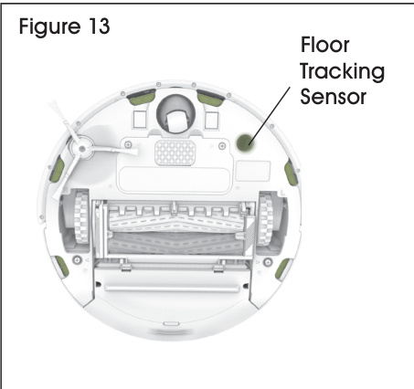
2.  Wipe the charging contacts on Roomba and the Home Base with a clean, dry cloth. (See Figure 14) 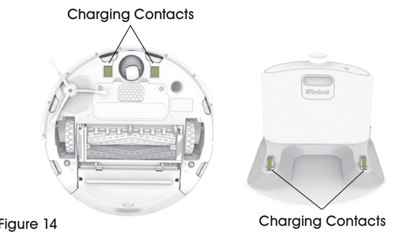

### Cleaning the Extractors

1.  Pinch the yellow extractor frame release tabs, lift up the extractor frame and remove any obstructions. (See Figure 15) 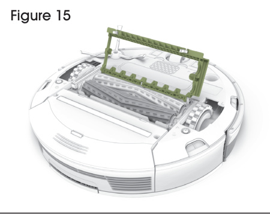
2.  Remove the extractors and remove the yellow extractor caps. Remove any hair or debris that has collected underneath the caps and around the metal axles. Reinstall the extractor caps. (See Figure 16) 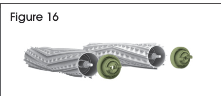
3.  Remove hair and debris from the square and hexagonal plastic pegs on the other side of the extractors. (See Figure 17) 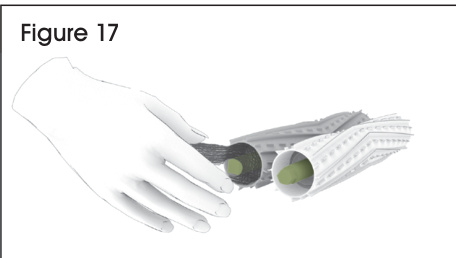
4.  Clear the vacuum path. (See Figure 18) 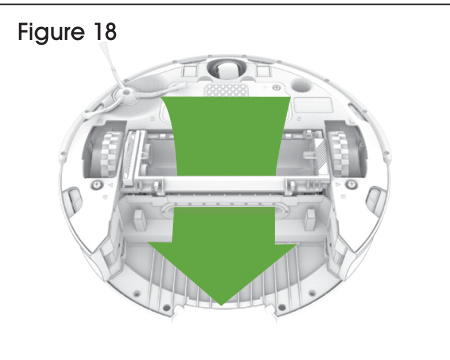
5.  Reinstall the extractors. Match the color and shape of the extractor pegs with the color and shape of the extractor icons on the cleaning head module.

# Troubleshooting and Support

## Error Handling and Power States

### Error Messages, Rebooting, and Reduced Power Standby

vacuum will tell you something is wrong with a two-tone distress sound followed by a spoken message. The troubleshooting indicator will also blink. More detailed support and videos are available through the app and online.

For some errors, rebooting vacuum may resolve the problem. To reboot vacuum, press and hold CLEAN for 10 seconds until all indicators illuminate, then release. When you release the CLEAN button, you will hear an audible tone signifying a successful reboot. NOTE: If you use vacuum's scheduling feature open the app after rebooting to confirm that schedule remains intact.

Vacuum consumes a small amount of power anytime to ensure that it is ready for its next cleaning job as well as to maintain Wi-Fi connectivity. It is possible to put vacuum in a further-reduced power state when not in use. For instructions and more details on this reduced power standby mode, refer to the app.

## Lithium Ion Battery

### Compatibility, Performance Limits, and Shipping Requirements

For best results, only use the lithium ion battery that comes with vacuum. While vacuum will operate with older-model batteries, its performance will be limited.

IMPORTANT\! Lithium ion batteries and products that contain lithium ion batteries are subject to stringent transportation regulations. If you need to ship this product (with the battery included) for service, travel or any other reason, you MUST comply with the following shipping instructions:

  - Remove the lithium ion battery from the product.
  - Place a piece of tape over the battery's metal charging contacts.
  - Reinstall the battery (with the tape on it) in the product and secure the battery door.
  - Package the product in its original packaging or in your own packaging that prevents any movement during transportation.
  - Ship via ground transportation only (no air shipping)
