# Washing Machine

Before operating the unit, please read this manual thoroughly, and retain for future reference. 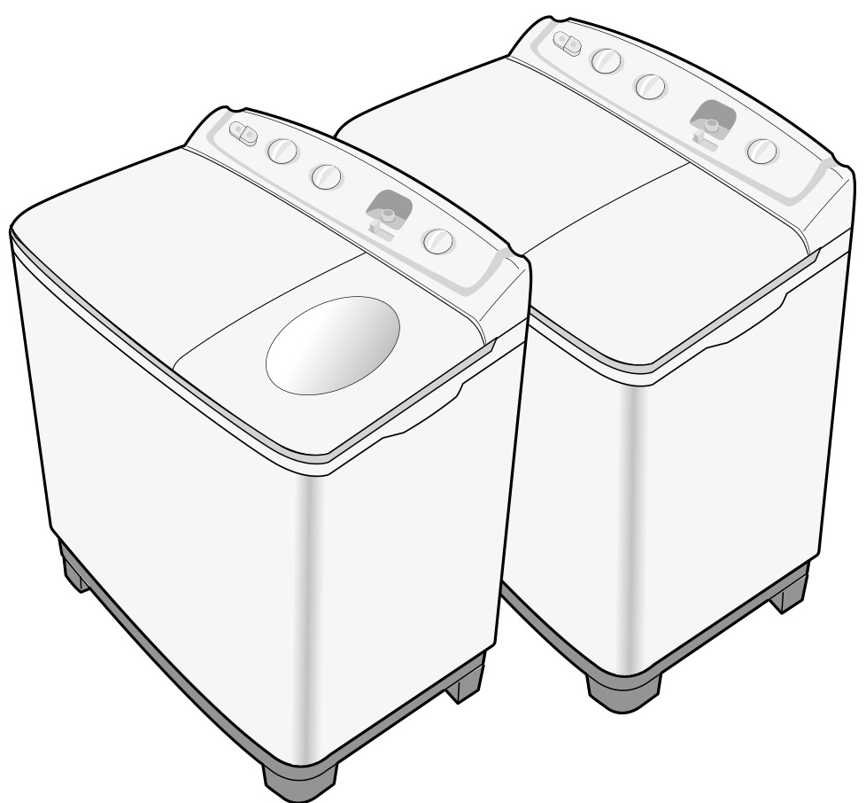

# Features and Safety

## Overview

### Product Features and Basic Safety Cautions

**POWERFUL WASHING BY LARGE PULSATOR**
This washing machine has a big pulsator so that it can wash evenly.

**THREE WAY LINT FILTER**
Three way lint filter strains off the lint efficiently during washing, so you can wash laundry cleanly.

**NORMAL OR SOFT SELECTOR**
You can wash laundry efficiently by two types, Normal or Soft.

Be sure that the washer is grounded. To avoid electrical shock, use a metal pipe for the ground connection. But, don't ground the washer with gas pipes or telephone lines to avoid the dangers of explosion or lighting strike. 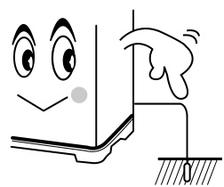

Do not put your hands into the spin dryer basket during spinning. Your fingers can be caught by spinning laundry and damaged. 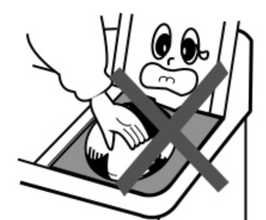

Never allow children to operate or play with the washer. Children playing with the washer may accidentally fall into the washing tub. 

Disconnect the power cord from the power supply after use.

Ventilation opening must not be obstructed by carpeting when the washing machine is installed on a carpeted floor.

If the supply cord of this appliance is damaged, it must only be replaced by authorized technician whom appointed by the manufacturer, because special purpose tools are required.

Warning to avoid over filling and damages this appliance must be filled with the operator present using a moderate water supply pressure only.

### Precautions When Operating

Don't use excessively hot water. (50°C or more) Plastic parts may be deformed or damaged. Also, clothing may be deformed or decolored.

Before washing, empty all pockets. If nails or pins remain in pockets, they may damage the washer or clothes.

Close the water tap a little if the water pressure is too high.

Be sure to cover with the inner cover on laundry before spinning. This prevents laundry from being tossed out and damaged.

To avoid water splashes, close the wash tub lid. Never splash water on the control panel.

# Parts and Controls

## Overview

### Description of Parts

* **WATER DRAIN Option Hose (with pump)**
  * **OVERFLOW - FILTER**
  * **LINT FILTER**
  * **WASH TUB**
  * **WASH TUB LID:** Be sure to keep the lid closed during washing and spinning.
  * **SPIN DRYER LID:** When you open this lid while the spin basket is spinning, the spinning will be stopped by brake system.
  * **SPIN DRYER BASKET**
  * **SPIN DRYER HATCH**
  * **POWER CORD:** The plug shape may not correspond with this drawing.
  * **DRAIN FILTER**
  * **EARTH WIRE**
  * **WATER DRAIN HOSE (WITHOUT PUMP)**
  * **PULSATOR**

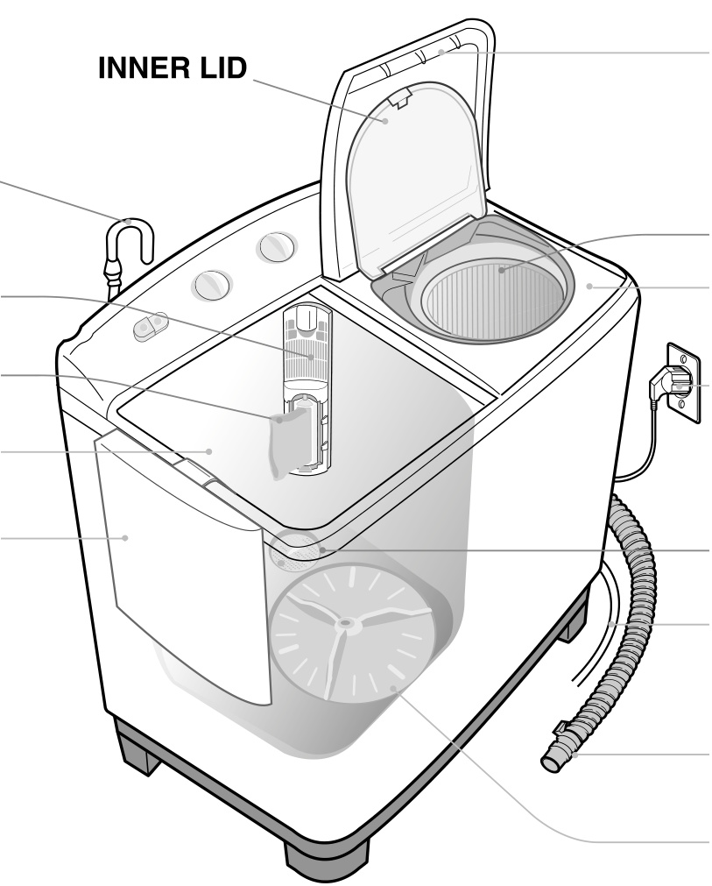

### Control Panel

1.  **WASH SELECTOR:** To select wash action.
2.  **WASH TIMER:** To set the wash time, 1-15 minutes.
3.  **CYCLE SELECTOR:** To set the Washing/Rinsing or Draining.
4.  **SPIN DRY TIMER:** To set the spin time, 1-5 minutes. (1-10 minutes)
5.  **WATER SELECTOR:** During washing, WATER GUIDE KNOB should be selected to wash. During spin rinsing, WATER GUIDE KNOB should be selected to spin.

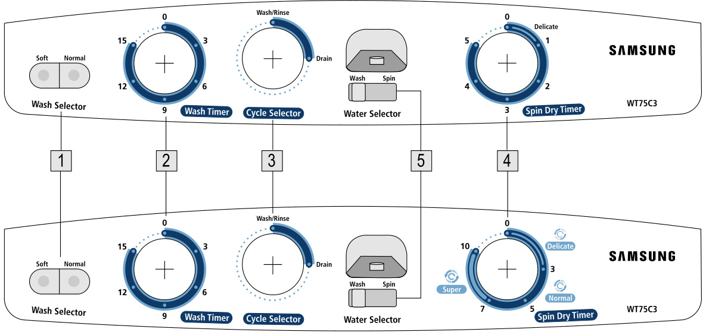

# Washing Procedure

## Standard Operating Procedure

### To Wash

1.  Before starting washing, check the following:
      * Connect the water supply hose and open the water tap.
      * Lay the drain hose down toward a sinkhole. (In case no drain pump)
      * Place the drain hose in sink or bath. (In case drain pump)
      * Connect the power cord to the power supply outlet.
2.  Set the WASH SELECTOR KNOB to the desired mode. 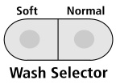
3.  Set the WATER SELECTOR KNOB to WASH. FOR B TYPE 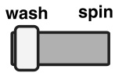
4.  Set the CYCLE SELECTOR KNOB to 'WASH - RINSE'. (in case drain pump "WASH") 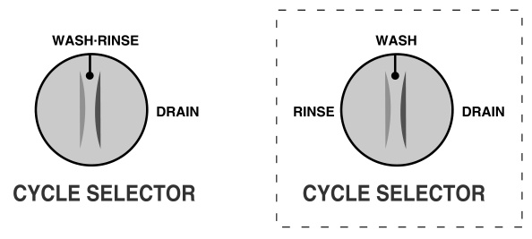
5.  Fill water in the washtub and add the detergent. 
6.  Load laundry in the wash tub and fill water to 'H' high water level. 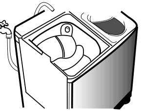
7.  Set the WASH TIMER 1-15 minutes. WASH TIMER 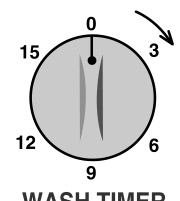
8.  After washing, set the CYCLE SELECTOR KNOB to 'DRAIN' for drain. 

### Spin Dry

1.  Transfer the clothes into the spin basket and arrange the clothes evenly. 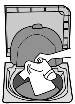
2.  Be sure to attach the safety cover and close the inner lid. 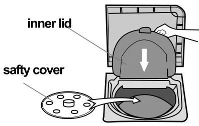
3.  Close the spin dryer lid. 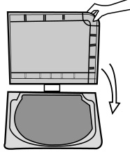
4.  Set the SPIN DRY TIMER 1-5 minutes. (1-10 minutes) 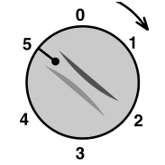 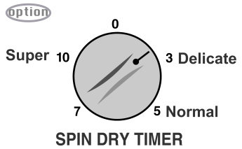

### Rinsing and Overflow Rinse

1.  Set the CYCLE SELECTOR KNOB to 'WASH RINSE' (In case drain pump "WASH"). 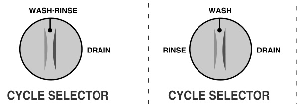
2.  Supply the proper amount of water as not to overflow the top of the washing tub.
3.  Set the WASH TIMER 2\~3 minutes. 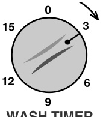
4.  Drain the water. Set the CYCLE SELECTOR KNOB to 'DRAIN'. 
5.  Repeat this cycle until drain water is clean. (2\~3 cycle)

### Additional Rinse

1.  Keep suppling water. Adjust water pressure to ensure that the amount of water supplied does not exceed that water drained. 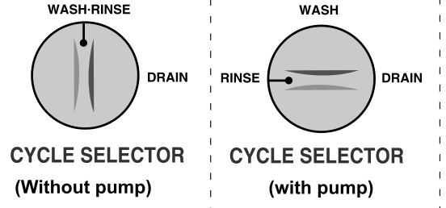
2.  Set the WASH TIMER 6\~8 minutes. 
3.  As soon as the WASH TIMER shuts off, turn off the water tap. 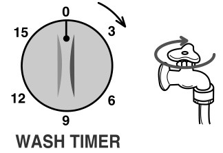
4.  Set the CYCLE SELECTOR KNOB to 'DRAIN'. 

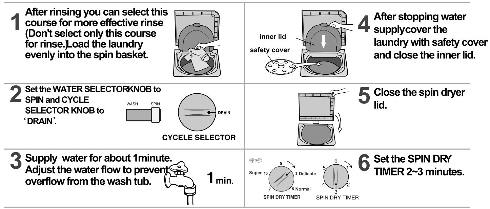

# Installation

## Installation Requirements and Assembly

### Environment and Drain Hose Height

* **Leave some space:** Space at least 15 cm between the washer and the wall.
  * **Place the washer on a sturdy flat surface:** If the washer is placed on an uneven or weak surface, noise or vibration may be occured. (Allowable is 2°)
  * **Never install the washer near water:** Do not place the washer in steamy rooms or where the washer is directly exposed to rain. Moisture may destroy the electrical insulation and cause an electrical shock hazard.
  * **Avoid direct sunlight or heating devices:** As plastic and electrical components are affected by direct heat, never place the washer near heaters, boilers, etc. Do not place under direct sunlight.

Install the drain hose about 70\~80cm above the ground for pump model. 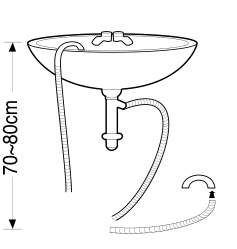

### Connecting the Drain Hose and Mounting the Legs

1.  Before connecting the drain hose, remove the cover (a) from the drain hole.
2.  After pressing the joint ring (b), insert the drain hose (c) to drain direction. 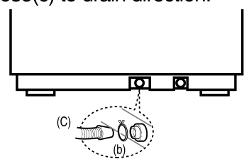

Lay down the washer with its back facing downward. Insert four legs into the leg mounting sections of the base corners of the main body. Insert the claw of the leg with the square hole of the leg mounting section, and push the leg in the arrow direction as shown in the figure until it clicks. 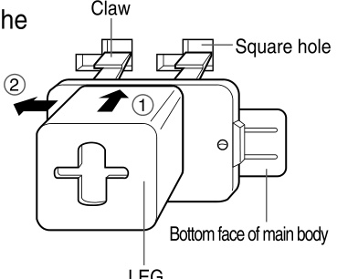

# Cleaning and Maintenance

## Cleaning and Maintenance Tasks

### Cleaning the Machine

**Cleaning the Lint Filter:** If the dregs are filled up in the lint filter after finishing the wash, push down and pull it out as shown in figure. Remove the collected lint and rinse the filter net. 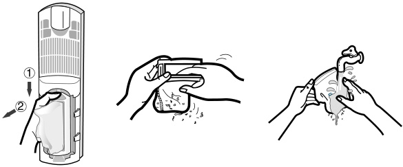

**Drain Filter:** In case of incompleted drain, disassemble the drain filter with screwdriver (+) and remove lints from the filter as shown in the figure. 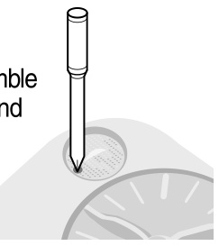

**Overflow Filter:** Pull the upper side of the overflow filter with two fingers into the hole in the direction of arrow as shown in the figure. 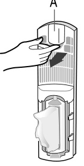

**Cleaning the Wash Tub:** First, fill water in the washtub to O level, then drain water from the washtub simultaneously with operating wash cycle for 1\~2 minutes. Close the washtub lid.

**Cleaning the Washer Body:** Wipe off strains on the cabinet and operation panel with soft cloth. Do not use benzene, thinners, cleanser, or wax, nor scrub the washer with a brush. Painted surfaces or plastic parts will be damaged.

### Maintenance

**When You Load the Laundry into the Spin Basket:** Press the laundry evenly and put the safety cover into the spin basket drum as shown in the figure. 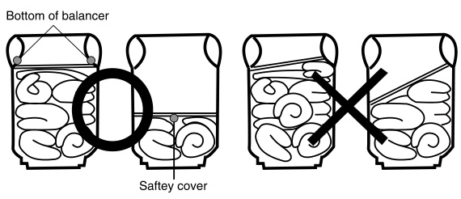

**To Pick Out the Clothing Which Has Fallen Between the Basket and Tub:** For safety, pull the power supply plug out of the socket.

1.  Disassemble a screw from the spin dryer hatch.
2.  The spin dryer hatch is fixed to the brim by the concave and convex parts at two places. Expand the concave and convex parts, and pull up the spin dryer hatch to remove it.
3.  Remove the clothing.
4.  Close the spin dryer hatch. Push in hatch firmly until the catch at the front is engaged securely. 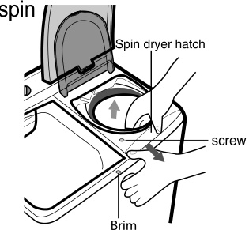

# Laundry Guide and Troubleshooting

## Reference Tables and Troubleshooting

### Laundry Guide and Troubleshooting Reference

**Washing Time:** 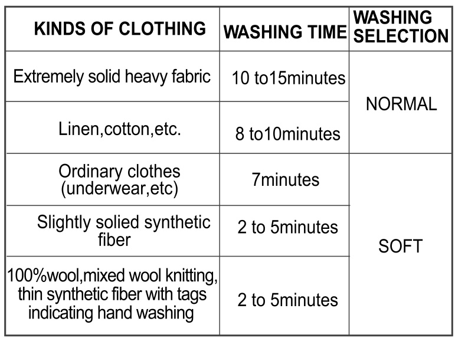
**Spin Dry Time:** 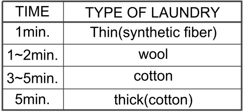

**Detergent:** The amount of detergent is average. Follow the instruction detergent printed on the package for amount of detergent. Choose the amount of detergent depending on the fabric type. 

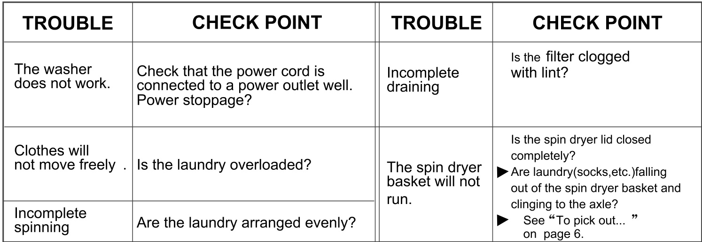
