# WaveRunner

## Manual Introduction

### Owner and Operator Notice

2005 WaveRunner. To the owner/operator: This Owner’s/Operator’s Manual contains information you will need for proper operation, maintenance, and care. A thorough understanding of these simple instructions will help you to obtain maximum enjoyment from your new jetski. If you have any questions about the operation or maintenance of your watercraft, please consult a jetski dealer.

Because jetski has a policy of continuing product improvement, this product may not be exactly as described in this Owner’s/ Operator’s Manual. Specifications are subject to change without notice. This manual should be considered a permanent part of this watercraft and should remain with it even if the watercraft is subsequently sold.

### Safety Symbols and Message Types

Important manual information: In this manual, information of particular importance is distinguished in the following ways: The Safety Alert Symbol means ATTENTION\! BECOME ALERT\! YOUR SAFETY IS INVOLVED\!

**WARNING**: Failure to follow WARNING instructions could result in severe injury or death to the machine operator, passenger, a bystander, or a person inspecting or repairing the watercraft.

**CAUTION**: A CAUTION indicates special precautions that must be taken to avoid damage to the watercraft.

**NOTE**: A NOTE provides key information to make procedures easier or clearer.

# General Information

## Identification Numbers

### Recording Identification Numbers

Record the Primary Identification (PRI-ID) number, Hull Identification Number (HIN) and engine serial number in the spaces provided for assistance when ordering spare parts from a jetski dealer. Also record and keep these ID numbers in a separate place in case your watercraft is stolen.

### Primary Identification (PRI-ID) Number

Primary Identification (PRI-ID) number: The PRI-ID number is stamped on a label 1 attached inside the engine compartment. 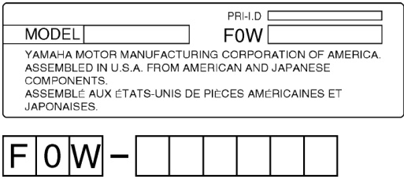 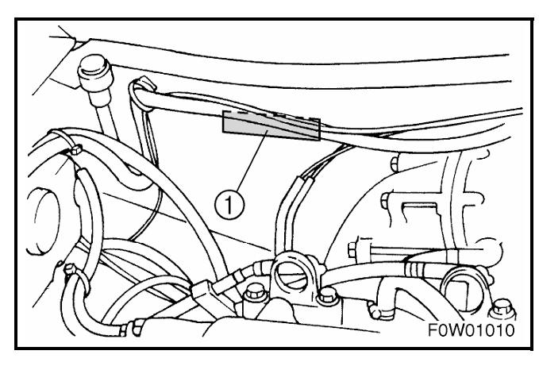

### Hull Identification Number (HIN)

Hull Identification Number (HIN): The HIN is stamped on a plate 1 attached to the hull on the aft, starboard (right) side.  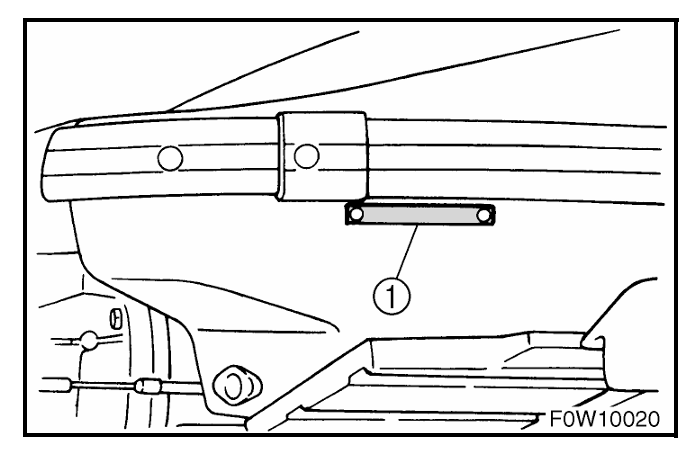

### Engine Serial Number

Engine serial number: The engine serial number is stamped on a label 1 attached to the engine unit.  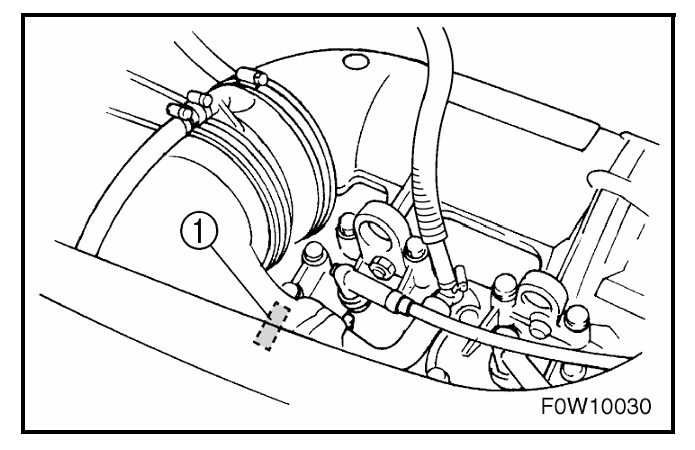

## Emission Control Information

### EPA Compliance Statement

This engine conforms to 2005 U.S. Environmental Protection Agency (EPA) regulations for marine SI engines. 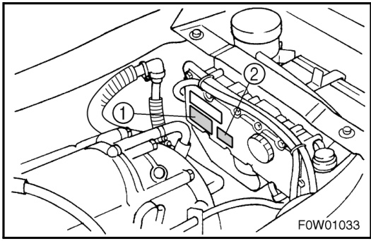

### Emission Control Certificate Label

Approval label of Emission control certificate: This label is attached to the electrical box and the exhaust side of the crankcase. 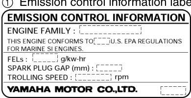 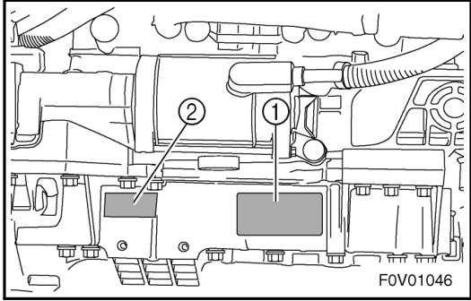

### Manufactured Date Label

Manufactured date label: This label is attached to the electrical box and the exhaust side of the crankcase. 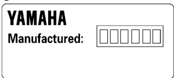

## Important Labels

### Label Location

Label location: 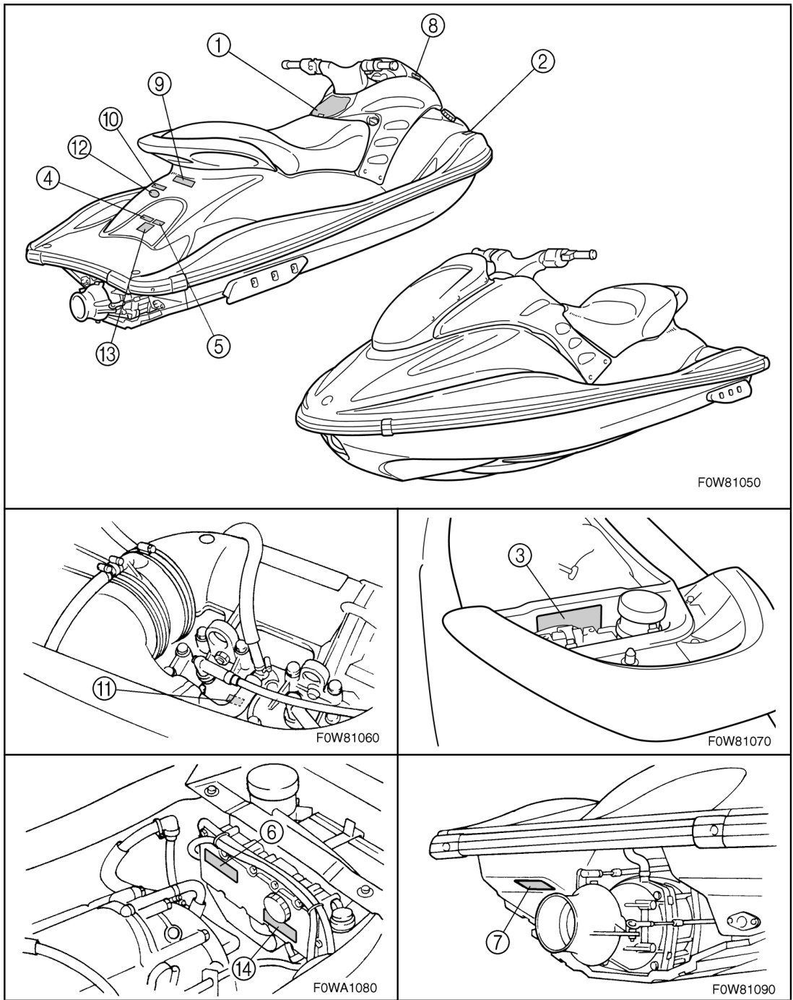

### Warning Labels

Warning labels: 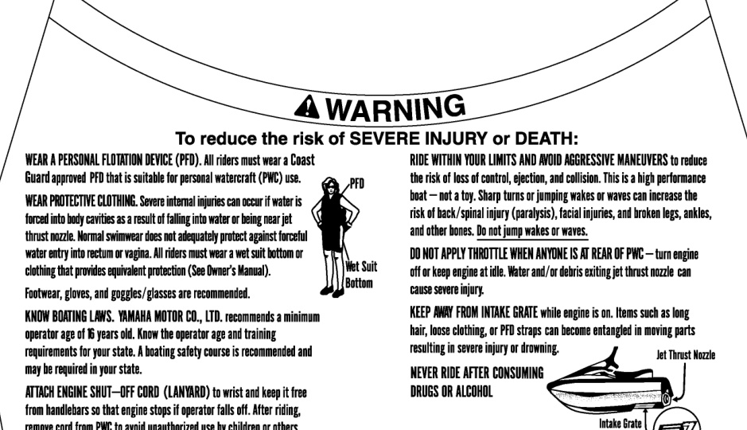 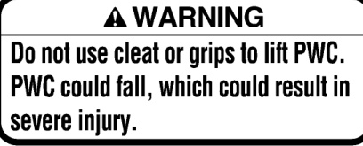 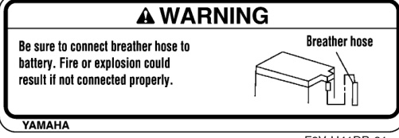

### Other Labels

Other labels: 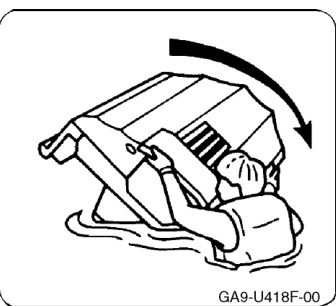 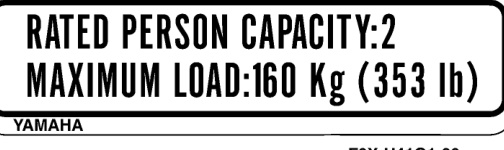 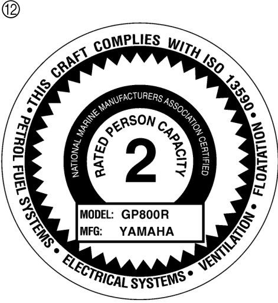 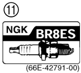

# Safety Information

## Safety Overview

### Safe Use Responsibilities

The safe use and operation of this watercraft is dependent upon the use of proper riding techniques, as well as upon the common sense, good judgment, and expertise of the operator. Every operator should know the following requirements before riding the watercraft.

### Required Reading and Orientation Materials

Before operating the watercraft, read the Owner’s/Operator’s Manual, the Riding Practice Guide, the Riding Instruction card and all warning and caution labels on the watercraft. Also, watch the Basic Orientation Video provided with your watercraft. These materials should give you an understanding of the watercraft and its operation. Never allow anyone to operate this watercraft until they too have read the Owner’s/ Operator’s Manual, the Riding Practice Guide, the Riding Instruction card and all warning and caution labels, and if possible watched the Basic Orientation Video. Showing them the video may help reinforce the information contained in these materials.

## Limitations on Who May Operate the Watercraft

### Minimum Operator Age and Training

jetski recommends a minimum operator age of 16 years old. Adults must supervise use by minors. Know the operator age and training requirements for your state. A boating safety course is recommended and may be required in your state. You can find local rules by contacting the United States Coast Guard (USCG), the National Association of State Boating Law Administrators, or your local Power Squadron. 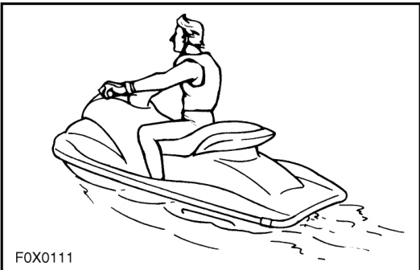

### Passenger Capacity and Load Limit

This watercraft is designed to carry the operator and one passenger. Never exceed the maximum load limit or allow more than 2 persons to ride the watercraft at one time. Maximum load: 160 kg (353 lb). Load is the total weight of cargo, operator and passenger.

### Experience Required Before Carrying a Passenger

Do not operate the watercraft with a passenger on board until you have considerable practice and experience riding alone. Operating the watercraft with a passenger requires more skill. Take the time to become accustomed to the handling characteristics of the watercraft before trying any difficult maneuvers.

## Cruising Limitations

### Scanning and Defensive Operation

Scan constantly for people, objects, and other watercraft. 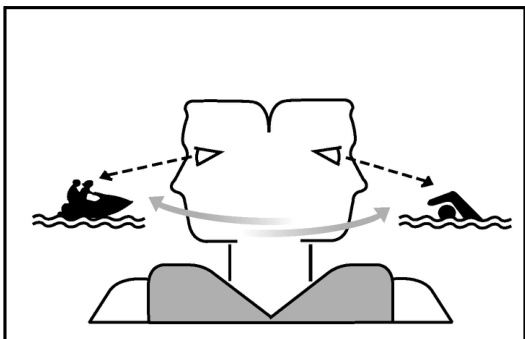 Be alert for conditions that limit your visibility or block your vision of others. Operate defensively at safe speeds and keep a safe distance away from people, objects, and other watercraft. Do not follow directly behind watercraft or other boats. Do not go near others to spray or splash them with water. Avoid sharp turns or other maneuvers that make it hard for others to avoid you or understand where you are going. Avoid areas with submerged objects or shallow water. Ride within your limits and avoid aggressive maneuvers to reduce the risk of loss of control, ejection, and collision.

### Weather, Visibility, and Distance from Shore

Do not operate the watercraft in rough water, bad weather or when visibility is poor; this may lead to an accident causing injury or death. Be alert to the possibility of adverse weather. Take note of weather forecasts and the prevailing weather conditions before setting out on your watercraft. As with any water sport, you should not ride your watercraft without someone else near by. If you ride further than swimming distance from shore, you should ride by another boat or watercraft, but make sure you stay a safe distance away. It’s good common sense\!

### Minimum Water Depth

Never operate in water that is less than 60 cm (2 ft) deep, otherwise you increase your chance of hitting a submerged object, which could result in injury. 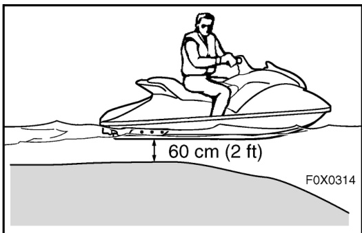

### High-Performance Riding and Wake Jumping

This is a high performance boat—not a toy. Sharp turns or jumping wakes or waves can increase the risk of back/spinal injury (paralysis), facial injuries, and broken legs, ankles and other bones. Do not jump wakes or waves.

### Night Operation Restriction

This watercraft is not equipped with lighting required for night operation. 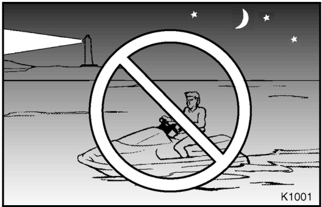 Do not operate the watercraft after sunset or before dawn, otherwise you increase the risk of colliding with another boat, which could result in severe injury or death.

## Operation Requirements

### Operation Requirements for Safe Riding

All riders must wear a Coast Guard approved personal flotation device (PFD) that is suitable for personal watercraft use. Wear protective clothing. Severe internal injuries can occur if water is forced into body cavities as a result of falling into water or being near the jet thrust nozzle. Normal swimwear does not adequately protect against forceful water entry into rectum or vagina. All riders must wear a wetsuit bottom or clothing that provides equivalent protection. Such clothing includes thick, tightly woven, sturdy and snug-fitting apparel such as denim, but does not include spandex or similar fabrics, like those used in bicycle shorts. 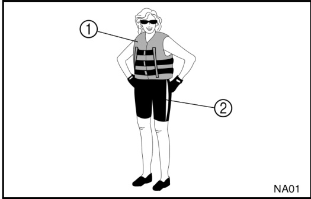 1 Coast Guard approved PFD, Wetsuit bottom.

Eye protection is recommended to keep wind, water, and glare from the sun out of your eyes while you operate your watercraft. Restraining straps for eyewear are made which are designed to float should your eyewear fall in the water. Footwear and gloves are recommended.

Helmets meeting Snell or DOT standards are required for IJSBA-sanctioned races. You must decide whether to wear a helmet while you ride for recreation. You should know that a helmet could help protect you in certain kinds of accidents and that it could injure you in others. A helmet is designed to provide some head protection. Although helmets cannot protect against all foreseeable impacts, a helmet might reduce your injuries in a collision with a boat or other obstacle. A helmet may have potential safety hazards, as well. Falling into the water could risk the chance of the helmet catching water, commonly known as “bucketing,” and the resulting strain on your neck could cause choking, severe and permanent neck injuries, or death. A helmet could also increase the risk of an accident if it reduces your vision or hearing, or if it distracts you or increases your fatigue. How should you decide if a helmet’s potential safety benefits outweigh its potential risks for you? Consider your particular riding conditions. Consider factors such as your riding environment and your riding style and ability. Also consider the likelihood of traffic congestion, and the water surface conditions. If you decide to wear a helmet based upon your riding circumstances, choose one carefully. Look for a helmet designed for personal watercraft use, if possible. Consider a helmet meeting Snell or DOT standards. If you will be engaging in closed-course competition, follow the helmet requirements of the sanctioning organization.

NEVER operate the watercraft after consuming alcohol or taking other drugs. 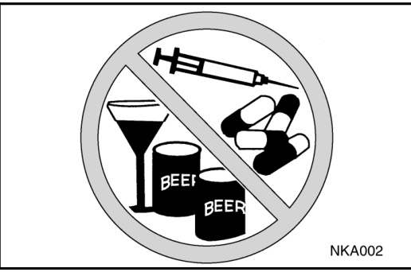

For reasons of safety and proper care of the watercraft, always perform the preoperation checks listed on page 3-5 before operating the watercraft.

The operator and passenger should always keep both feet in the footwell when the watercraft is in motion. Lifting your feet increases your chances of losing your balance, and your feet being hit by objects outside the watercraft. Do not give a ride to a child whose feet cannot reach the floor of the footwell. Passenger should firmly hold on to the operator. 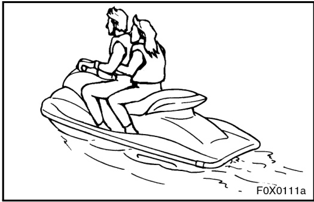

Always consult your doctor on whether it is safe for you to ride this watercraft if you are pregnant or in poor health.

Do not attempt to modify this watercraft\! Modifications to your watercraft may reduce safety and reliability, and render the watercraft unsafe or illegal for use.

Scan carefully for swimmers and stay away from swimming areas. Swimmers are hard to see and you could accidentally hit someone in the water. Avoid being hit by another boat\! You should always take the responsibility to watch for traffic; other boaters may not be watching for you. If they do not see you, or you maneuver more quickly than other boaters expect, you risk a collision. Maintain a safe distance from other boats or watercraft, and also watch for boats’ ski ropes or fishing lines. Obey the “Rules of the Road,” and be sure to check behind you before making a turn. (See Rules of the Road on pages 1-14 to 1-17.)

## Recommended Equipment

### Equipment to Carry On Board

The following items should be carried on board your watercraft:

### Sound-Signaling Device

Sound-signaling device: You should carry a whistle or other soundsignaling device that can be used to signal other boats. See Rules of the Road for more information.

### Visual Distress Signals

Visual distress signals: It is recommended that a USCG approved pyrotechnic device be stored in a waterproof container on your watercraft. A mirror can also be used as an emergency signal. Contact your jetski dealer or the Coast Guard for more information.

### Watch

Watch: A watch is helpful so you will know how long you have been operating.

### Towline

Towline: A towline can be used to tow a disabled watercraft in an emergency.

## Hazard Information

### Fuel Cock Position and Exhaust Fumes

When transporting or storing your watercraft, always place the fuel cock knob in the “OFF” position, otherwise gasoline may overflow from the carburetor. 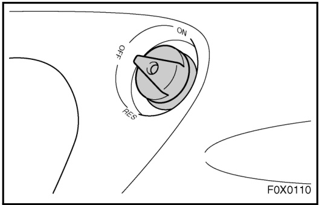 Never start the engine or let it run for any length of time in an enclosed area. Exhaust fumes contain carbon monoxide, a colorless, odorless gas that may cause loss of consciousness and death within a short time. Always operate the watercraft in an open area.

## Watercraft Characteristics

### Steering Depends on Jet Thrust

Jet thrust turns the watercraft. Releasing the throttle completely produces only minimum thrust. If you are traveling at speeds above trolling, you will have rapidly decreasing ability to steer without throttle. You may still have some turning ability immediately after releasing the throttle, but once the engine slows down, the watercraft will no longer respond to handlebar input until you open the throttle again or you reach a trolling speed. Practice turning in an open area without obstructions until you have a good feel for this maneuver.

### Removing Debris from the Jet Intake

Stop the engine and remove the clip 3 from the engine shut-off switch 4 before removing any debris or weeds, which may have collected around the jet intake. 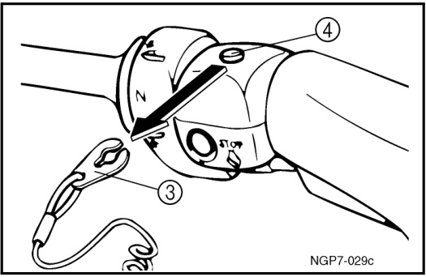

### Jet Pump Movement and Intake Hazards

This watercraft is water-jet propelled. The jet pump is directly connected to the engine. This means that jet thrust will produce some movement whenever the engine is running. There is no “neutral” position. Keep away from intake grate 1 while the engine is on. Items such as long hair, loose clothing, or PFD straps can become entangled in moving parts resulting in severe injury or drowning. Never insert any object into the jet thrust nozzle while the engine is running. Severe injury or death could result from coming in contact with the rotating parts of the jet pump. 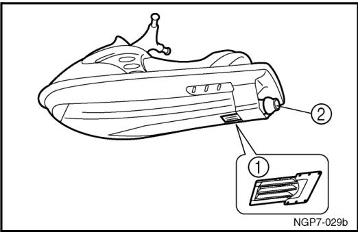

## Rules of the Road

### Legal Status and Applicable Waterway Rules

jetski watercraft is legally considered a powerboat. Operation of the watercraft must be in accordance with the rules and regulations governing the waterway on which it is used. Just as there are rules that apply when you are driving on streets and highways, there are waterway rules that apply when you are operating your watercraft. These rules are used internationally, and are also enforced by the United States Coast Guard and local agencies. You should be aware of these rules, and follow them whenever you encounter another vessel on the water. Several sets of rules prevail according to geographic location, but are all basically the same as the International Rules of the Road. The rules presented here in this Owner’s/Operator’s Manual are condensed, and have been provided for your convenience only. Consult your local U.S. Coast Guard Auxiliary or Department of Motor Vehicles for a complete set of rules governing the waters in which you will be operating your watercraft.

### Steering and Sailing Rules When Encountering Other Vessels

**Steering and sailing rules:** Whenever two vessels on the water meet one another, one vessel has the right-ofway; it is called the “stand-on” vessel. The vessel that does not have the right-of-way is called the “give-way” or “burdened” vessel. These rules determine which vessel has the right-of-way, and what each vessel should do.

**Stand-on vessel:** The vessel with the right-of-way has the duty to continue its course and speed, except to avoid an immediate collision. When you maintain your direction and speed, the other vessel will be able to determine how best to avoid you.

**Give-way vessel:** The vessel which does not have the rightof-way has the duty to take positive and timely action to stay out of the way of the stand-on vessel. Normally, you should not cross in front of the vessel with the right-ofway. You should slow down or change directions briefly and pass behind the other vessel. You should always move in such a way that the operator of the other vessel can see what you are doing. The General Prudential Rule regarding the right-of-way is that if a collision appears unavoidable, neither boat has the right-ofway. Both boats must avoid the collision. In other words, follow the standard rules except when a collision will occur unless both vessels try to avoid each other. If that is the case, both vessels become give-way vessels.

**Rules when encountering vessels:** There are three main situations that you may encounter with other vessels which could lead to a collision unless the Steering Rules are followed:

  - Meeting: you are approaching another vessel head-on
  - Crossing: you are traveling across another vessel’s path
  - Overtaking: you are passing or being passed by another vessel

In the following illustration, your watercraft is in the center. You should give the right-ofway to any vessels shown in the white area (you are the give-way vessel). Any vessels in the shaded area must yield to you (they are the give-way vessels). Both you and the meeting vessel must alter course to avoid each other. 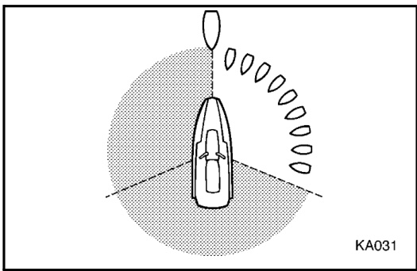

Meeting: If you are meeting another power vessel head on, and are close enough to run the risk of collision, neither of you has the rightof-way\! Both of you should alter course to avoid an accident. You should keep the other vessel on your port (left) side. This rule does not apply if both of you will clear one another if you continue on your set course and speed. 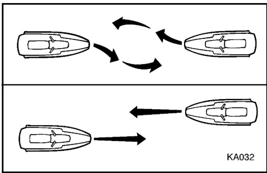

Crossing: When two power-driven vessels are crossing each other’s path close enough to run the risk of collision, the vessel which has the other on the starboard (right) side must keep out of the way of the other. If the other vessel is on your starboard (right) side, you must keep out of its way; you are the giveway vessel. If the other vessel is on your port (left) side, remember that you should maintain course and direction, provided the other vessel gives you the right-of-way as it should. 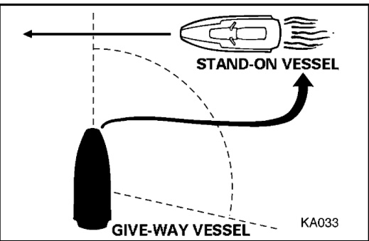

Overtaking: If you are passing another vessel, you are the give-way vessel. This means that the other vessel is expected to maintain its course and speed. You must stay out of its way until you are clear of it. Likewise, if another vessel is passing you, you should maintain your speed and direction so that the other vessel can steer itself around you.

### Other Special Situations

**Other special situations:** There are three other rules you should be aware of when riding your watercraft around other vessels.

### Narrow Channels and Bends

Narrow channels and bends: When navigating in narrow channels, you should keep to the right when it is safe and practical to do so. If the operator of a powerdriven vessel is preparing to go around a bend that may obstruct the view of other water vessels, the operator should sound a prolonged blast of four to six seconds on the whistle. If another vessel is around the bend, it too should sound the whistle. Even if no reply is heard, however, the vessel should still proceed around the bend with caution. If you navigate such waters with your watercraft, you will need to carry a portable air horn, available from local marine supply stores.

### Fishing Vessel Right-of-Way

Fishing vessel right-of-way: All vessels fishing with nets, lines or trawls are considered to be “fishing vessels” under the International Rules. Vessels with trolling lines are not considered fishing vessels. Fishing vessels have the right-of-way regardless of position. Fishing vessels cannot, however, impede the passage of other vessels in narrow channels.

### Sailing Vessel Right-of-Way

Sailing vessel right-of-way: Sailing vessels should normally be given the right-of-way. The exceptions to this are:

1.  When the sailing vessel is overtaking the power-driven vessel, the power-driven vessel has the right-of-way.
2.  Sailing vessels should keep clear of any fishing vessel.
3.  In a narrow channel, a sailing vessel should not hamper the safe passage of a power-driven vessel that can navigate only in such a channel.

### Reading Buoys and Other Markers

**Reading buoys and other markers:** The waters of the United States are marked for safe navigation by the lateral system of buoyage. Simply put, buoys and markers have an arrangement of shapes, colors, numbers and lights to show which side of the buoy a boater should pass on when navigating in a particular direction. The markings on these buoys are oriented from the perspective of being entered from seaward (the boater is going towards the harbor). Red buoys are passed on your starboard (right) side when proceeding from open water into the harbor, and black buoys are to your port (left) side. An easy way to remember the meaning of the colors is the phrase “red right returning.” When navigating out of the harbor, your position with respect to the buoys should be reversed; red buoys should be to port and black buoys to starboard.

### Uniform State Waterway Marking System

Many bodies of water used by boaters are entirely within the boundaries of a particular state. The Uniform State Waterway Marking System has been devised for these waters. This system uses buoys and signs with distinctive shapes and colors to show regulatory or advisory information. These markers are white with black letters and orange borders. They signify speed zones, restricted areas, danger areas, and general information. Remember, markings may vary by geographic location. Always consult local boating authorities before riding your watercraft in unfamiliar waters. 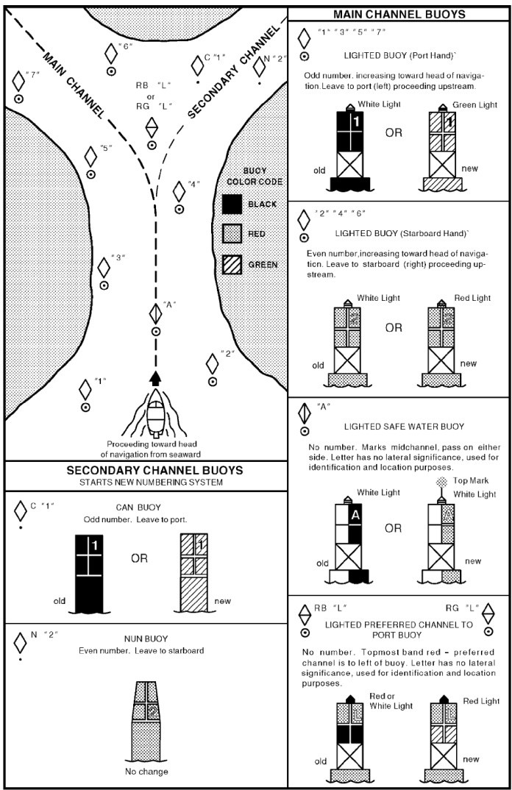

## Boating Safety Information

### Additional Boating Safety Publications

To get more boating safety information: Be informed about boating safety. Additional publications and information can be obtained from many organizations, including the following.

### United States Coast Guard Consumer Affairs

United States Coast Guard Consumer Affairs Staff (G-BC): jetski is the watercraft industry’s leading manufacturer to build awareness and support for boating education. In 1997, jetski launched its GET W.E.T. (Watercraft Education and Training) initiative and has since reached out to over one million Americans promoting the benefits of boating education.

### Other Local Rule Sources

Other sources: You can find local rules by contacting the National Association of State Boating Law Administrators, or your local Power Squadron.

### Online Boating Safety Course

Watercraft Education and Training: The Online Boating Safety Course, available through the watercraft section of the jetski-motor.com website, is a free, 50 question learning course available to the public. Upon successful completion of 80 percent or better, the user can request a certificate of completion by mail or can download one immediately. The Online Boating Safety Course, provided by the Boat/US Foundation, is approved by the National Association of State Boating Law Administrators (NASBLA) and recognized by the United States Coast Guard. This course meets the education requirement for those states that recognize non-proctored, NASBLA-approved courses.

### Responsible Watercraft Enjoyment

Enjoy your watercraft responsibly: You share the areas you enjoy when riding your watercraft with others and with nature. So your enjoyment includes a responsibility to treat these other people, and the lands, waters, and wildlife with respect and courtesy. Whenever and wherever you ride, think of yourself as the guest of those around you. Remember, for example, that the sound of your watercraft may be music to you, but it could be just noise to others. And the exciting splash of your wake can make waves others won’t enjoy. Avoid riding close to shoreline homes and waterfowl nesting areas or other wildlife areas, and keep a respectful distance from fishermen, other boats, swimmers, and populated beaches. When travel in areas like these is unavoidable, ride slowly and obey all laws. Remember that pollution can be harmful to the environment. Do not refuel or add oil where a spill could cause damage to nature. Remove your watercraft from the water and move it away from the shoreline before refueling. And keep your surroundings pleasant for the people and wildlife that share the waterways: don’t litter\! When you ride responsibly, with respect and courtesy for others, you help ensure that our waterways stay open for the enjoyment of a variety of recreational opportunities.

# Components and Operation

## Location of Main Components

### Deck and Exterior Components

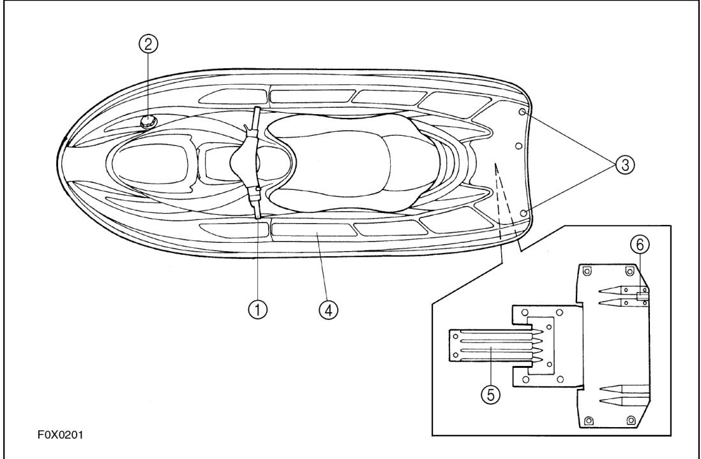
1 Handlebars: Use to control direction.
Fuel tank filler cap
3 Rope hole
4 Footwell: Use to place feet for balance.
Intake grate: Prevents debris from getting into the jet pump.
Speed sensor

### Bow, Storage, and Hull Components

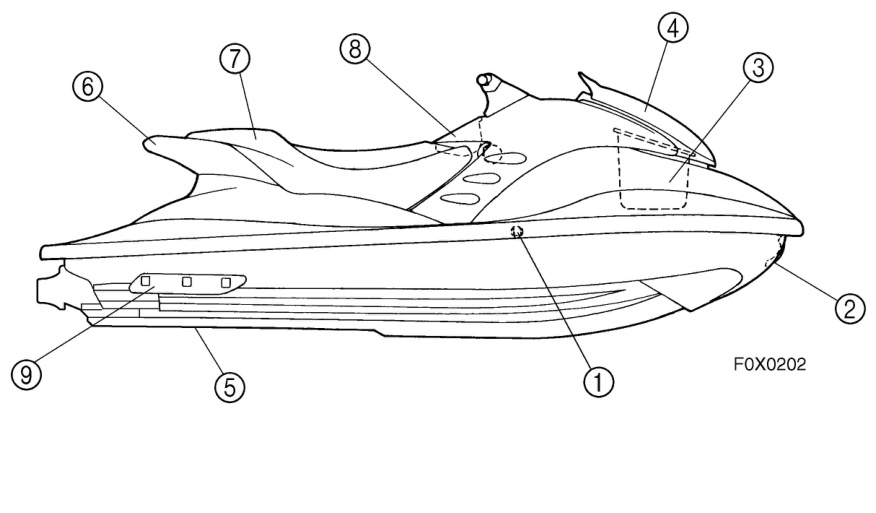
1 Cooling water pilot outlet: Use to verify cooling water flow.
Bow eye: Use to attach rope for transporting, mooring or towing the watercraft in an emergency.
3 Front storage compartment
4 Hood
Jet intake
Handgrip
Seat
Glove compartment
jetski Adjustable Sponson (YAS)

### Controls and Rear Components

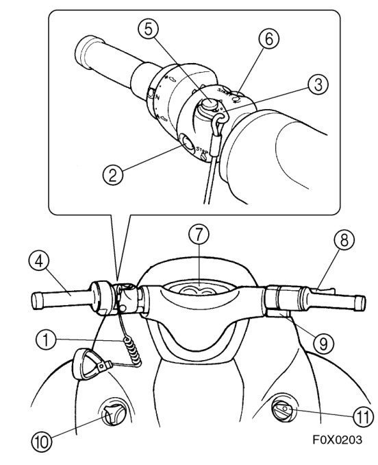 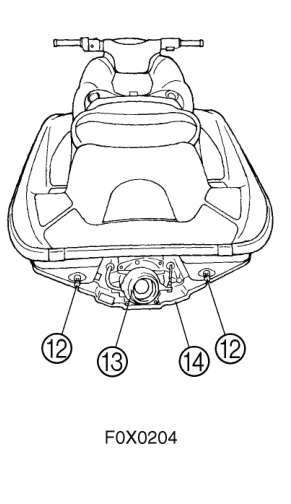
1 Engine shut-off cord (lanyard): Attach to wrist so that the engine stops if the operator falls off the watercraft.
Throttle lever: Use to accelerate and decelerate.
Choke lever
Oil tank filler cap
Fuel cock knob
Stern drain plugs: Use to drain water in the bilge when the watercraft is on dry land.
3 Jet thrust nozzle: Changes the direction of jet thrust according to handlebar position.
4 Ride plate
Engine stop switch: Push to stop the engine normally.
3 Clip: Insert into the engine shut-off switch to enable starting of the engine. Remove to stop the engine or prevent accidental starting of the engine or unauthorized use of the watercraft.
4 Quick Shift Trim System (QSTS) selector: Use to select the trim angle of the watercraft.
Engine shut-off switch: Remove the clip to stop the engine and disable it from starting.
Start switch: Push to start the engine.
Multifunction information center: Use to check watercraft operation.

### Engine Compartment Components

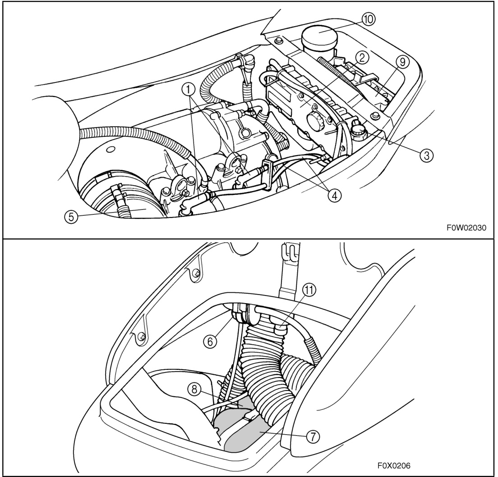
1 Spark plugs/Spark plug caps
Electrical box: Protects electrical components from water.
3 Flush hose connector: Use to flush the engine cooling water passages.
4 Spark plug lead
Muffler
Fuel filter
Fuel tank
Oil tank
Battery
Fire extinguisher container
Water separator

## Operation of Controls and Other Functions

### Seat Removal and Installation

**Seat:** There is a seat latch 1 at the rear of the seat to remove the seat. 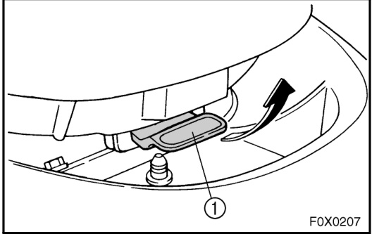 To remove the seat: Pull the seat latch up, and then pull the seat off. 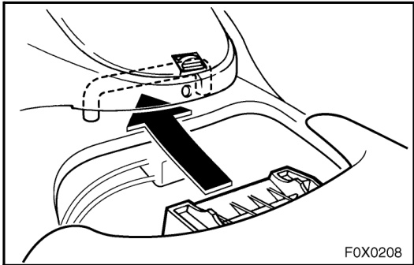 To install the seat: Insert the projection on the front of the seat into the stay on the deck, and then push the rear of the seat down to lock it in place securely. 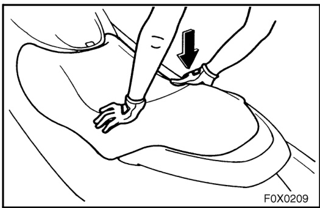
**NOTE:** Make sure that the seat is properly secured before operating the watercraft.

### Hood Opening and Closing

**Hood:** To open the hood, push the latch 1 down, and then lift the hood up. 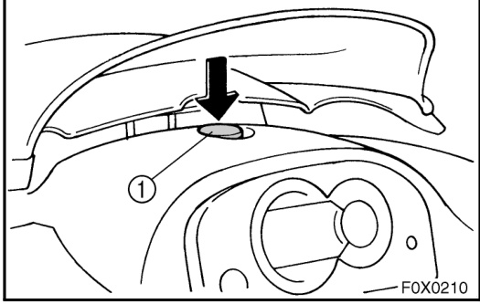 To close the hood, push the hood down to lock it in place. 
**NOTE:** Make sure that the hood is properly secured before operating the watercraft.

### Fuel Tank Filler Cap

**Fuel tank filler cap:** To remove the fuel tank filler cap 1, turn it counterclockwise.
**NOTE:** Make sure that the fuel tank filler cap is properly secured before operating the watercraft. 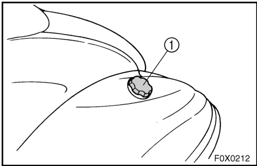

### Oil Tank Filler Cap

**Oil tank filler cap:** To remove the oil tank filler cap 1, turn it counterclockwise. Make sure that the oil tank filler cap is properly secured before operating the watercraft. 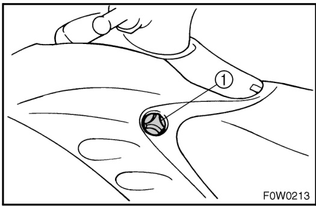

### Fuel Cock Knob Positions

**Fuel cock knob:** The fuel cock supplies fuel from the fuel tank to the carburetors. The fuel cock knob 1 positions are explained as follows and are shown in the illustration. 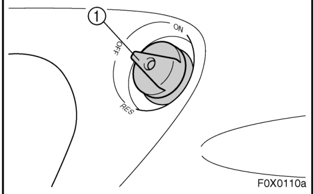
OFF: With the fuel cock knob in this position, fuel does not flow. Always turn the fuel cock knob to this position when the engine is not running.
ON: With the fuel cock knob in this position, fuel flows to the carburetors. Turn the fuel cock knob to this position when starting the engine and operating the watercraft.
RES: This indicates reserve. With the fuel cock knob in this position, the fuel reserve is made available. Turn the fuel cock knob to this position if you run out of fuel while operating the watercraft. When this occurs, refuel as soon as possible and be sure to turn the fuel cock knob back to “ON”\!

### Engine Stop Switch

**Engine stop switch:** Push this switch 1 (red button) to stop the engine normally. 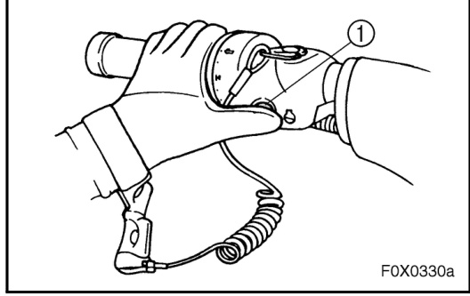

### Engine Shut-Off Switch and Lanyard

**Engine shut-off switch:** Insert the clip 1, on the end of the engine shut-off cord, under the engine shut-off switch 3 (black button). The engine will stop automatically when the clip is removed from the switch, such as if the operator falls off the watercraft. 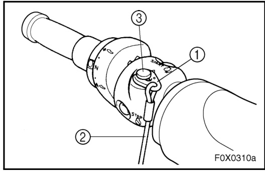
**WARNING:** Always attach the engine shut-off cord to your wrist and the clip to the engine shut-off switch BEFORE starting the engine. To prevent accidental starting of the engine or unauthorized use by children or others, always remove the clip from the shut-off switch when the engine is not running. 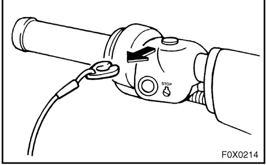

### Choke Lever

**Choke lever:** Starting a cold engine requires a richer air-fuel mixture, which is supplied by the choke. Move the lever 1 in direction to turn the choke on. Move the lever in direction to turn the choke off. 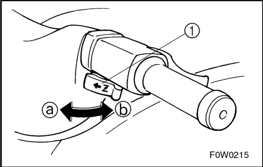

### Throttle Lever

**Throttle lever:** Squeeze the throttle lever 1 to increase engine speed. Release the throttle lever to decrease engine speed or to return it to the idle position. 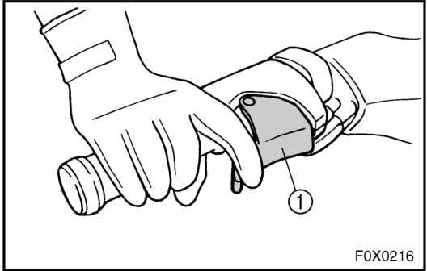

### Start Switch

**Start switch:** Push the start switch 1 (green button) to start the engine. 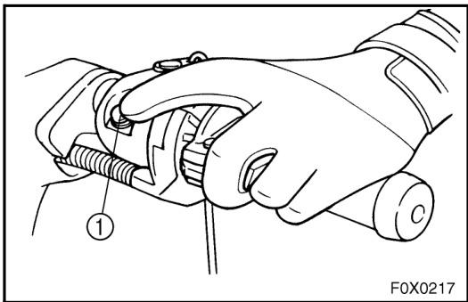
**NOTE:** The engine will not start when the clip is removed from the engine shut-off switch.

### Cooling Water Pilot Outlet

**Cooling water pilot outlet:** This watercraft is equipped with cooling water pilot outlets. When the engine is running, cooling water is circulated in the engine, and then it is discharged from the pilot outlets. To check for proper operation of the cooling system, check that water is being discharged from the pilot outlets. If water is not being discharged from the outlets, cooling water may not be circulating in the engine. When this occurs, stop the engine and check for the cause. (See pages 2-13 and 5-4 for further instructions.)
**NOTE:** If the cooling water passages are dry, it will take about 20 seconds for the water to reach the outlet after the engine is started. 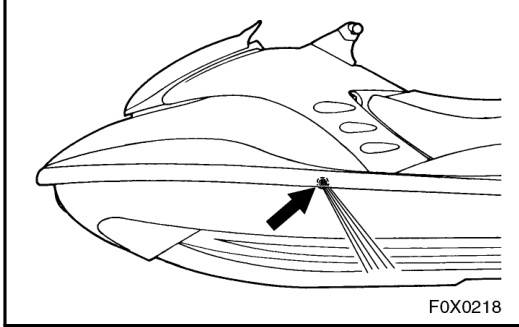

### Steering System

**Steering system:** Your watercraft can be steered by turning the handlebars 1 the same direction you wish to travel. When the handlebars are turned, the angle of the jet thrust nozzle is changed, and the direction of the watercraft is changed accordingly. Since the strength of the jet thrust determines the speed and direction of a turn, the throttle must always be open when attempting a turn, except at trolling speed. 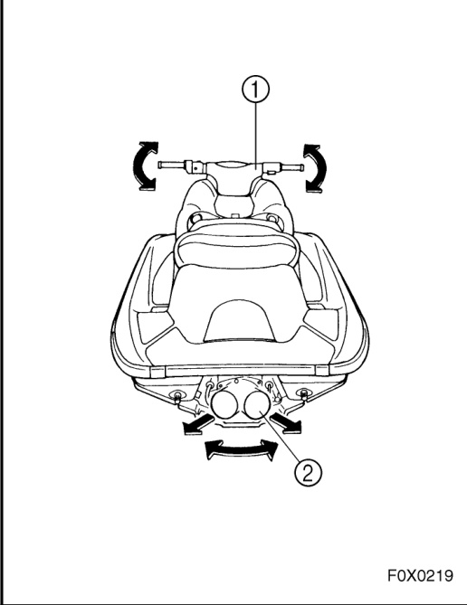

### Quick Shift Trim System Selector

**Quick Shift Trim System (QSTS) selector:** The QSTS selector 1 is located at the left handlebar grip and is used to adjust the trim angle of the watercraft. Operating the QSTS selector changes the angle of the jet thrust nozzle vertically. This changes the trim angle of the watercraft. There are 5 positions: 2 bow down positions, neutral 'N', and 2 bow up positions.
To change the trim angle:

1.  Reduce engine speed to 3,000 r/min or less.
2.  Squeeze the shift lock lever , and then turn the QSTS selector to the desired position.
3.  Release the shift lock lever to lock the QSTS selector. 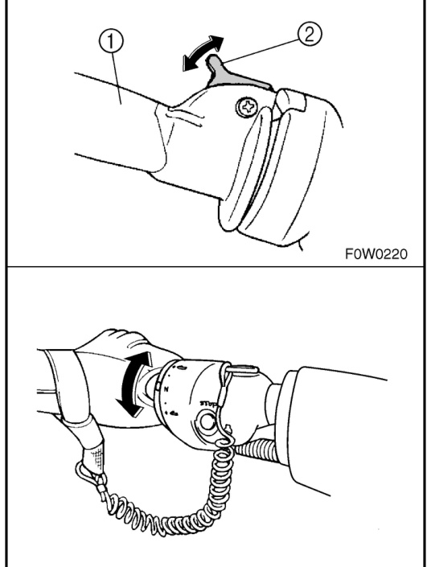
    **CAUTION:** Do not turn the QSTS selector while operating the watercraft at full throttle, otherwise damage could occur to the QSTS. The neutral “N” position will provide good performance for most operating conditions. To enhance particular types of performance, select bow down or bow up. 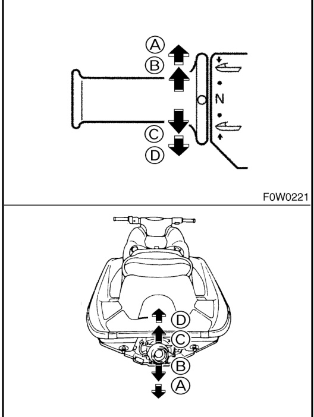

### Bow Down Trim Position

**Bow down:** Turn the grip to or and the bow will go down while the watercraft is on plane. Bow down puts more of the bow in the water. This gives the watercraft more “hook,” which enhances turning performance. This position will also help the watercraft get up on plane more quickly. At higher speeds, however, the watercraft will have greater tendency to “bow steer” and follow waves and wakes in the water. Fuel economy and maximum speed are also reduced.

### Bow Up Trim Position

**Bow up:** Turn the grip to or and the bow will go up while the watercraft is on plane. Bow up puts less of the bow in the water. There is less water resistance, so straightahead acceleration when on plane and top speed are enhanced. In some conditions, however, the watercraft may tend to “porpoise” (hop in the water). If the watercraft is porpoising, choose neutral or bow down. 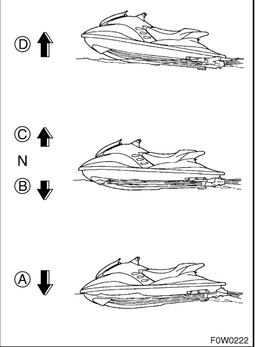

### Multifunction Information Center

**Multifunction information center:** This meter contains following functions for the help and convenience of operation.
1 Tachometer
Speedometer
3 Fuel meter
4 Hour meter
Warning light
Oil warning indicator
Engine overheat warning indicator
Fuel warning indicator
Reset button
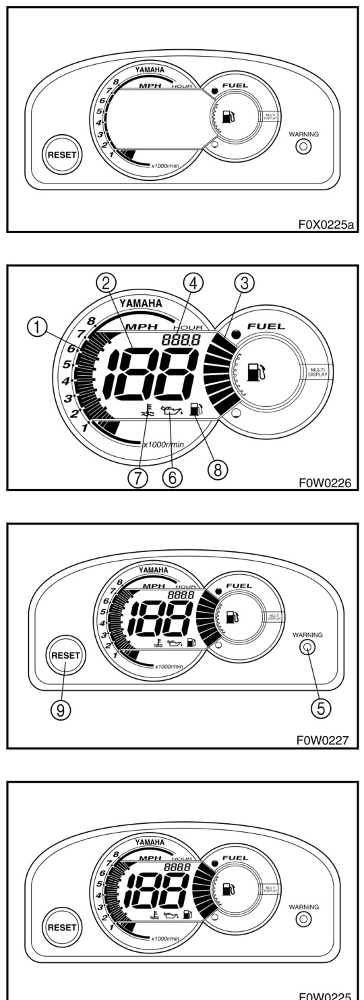
**CAUTION:** Do not run the engine at full throttle or more than 15 seconds to check the meter for operation on land. The engine could overheat. Use the specified resistor-type spark plug and cap, otherwise the meter may function erratically.
**NOTE:** All display light up and the buzzer sounds twice after the engine starts. Then, the meter will operate normally after few seconds. The current display will continue to operate for 30 seconds after the engine stops.

### Tachometer

**Tachometer:** The engine speed (r/min) is displayed by segments. Each segment indicates a 250 r/min increment. 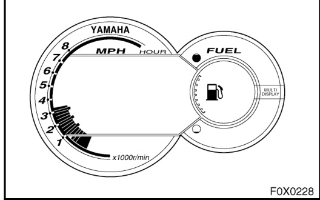

### Speedometer

**Speedometer:** The meter shows the watercraft speed against water. 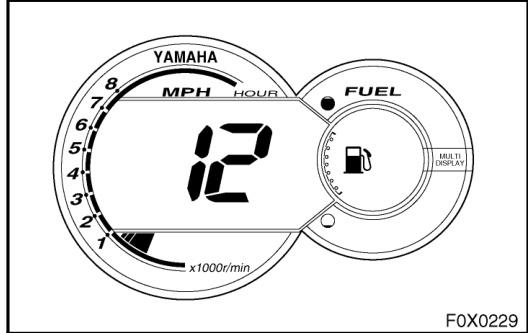
**NOTE:** If the speedometer malfunctions, “_ _” display will blink.

### Reset Button

**Reset button:** Pushing the reset button stops sounding the buzzer. 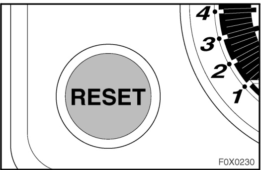

### Fuel Meter

**Fuel meter:** The fuel meter is provided for convenient fuel level checking while riding. The fuel meter has eight segments which show the amount of fuel remaining in the fuel tank. The indication of the segments differs on your operating condition. Use the meter as a reference. 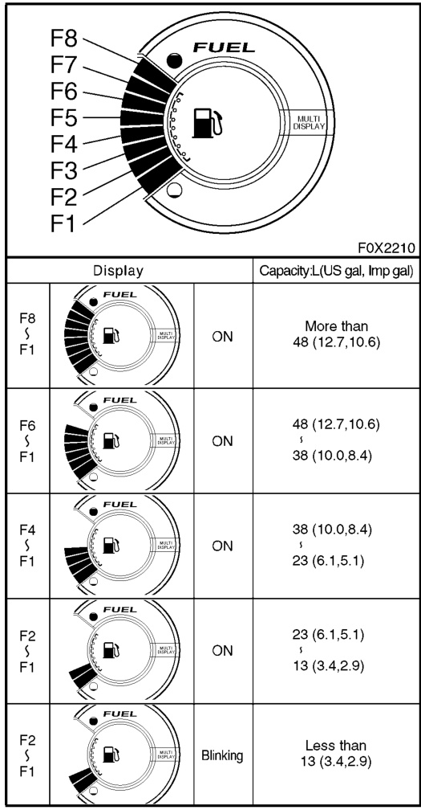

### Hour Meter

**Hour meter:** The hour meter is provided to make it easy to follow the maintenance schedule. The meter shows the hours of engine operation that have elapsed since the watercraft was new. 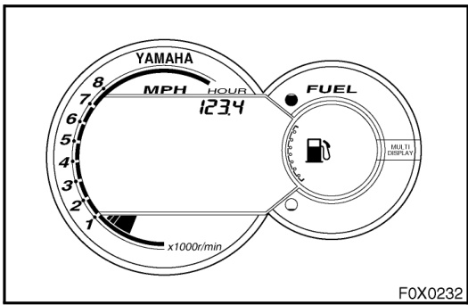
**NOTE:** The elapsed time will be kept even if the battery terminals have been disconnected. If the hour meter malfunctions, "_-_" display and the warning light will blink.

### Fuel Warning Indicator

**Fuel warning indicator:** If the fuel remaining in the tank drops to about 13 L (3.4 US gal, 2.9 Imp gal), the lowest two fuel level segments, the fuel warning indicator and the warning light begin to blink. The buzzer also starts sounding intermittently. The warning signals will be cleared when the engine restarts after refilling fuel. 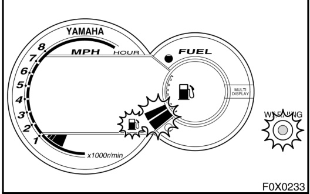

### Oil Warning Indicator

**Oil warning indicator:** If the oil remaining in the tank drops to about 1.7 L (0.45 US gal, 0.37 Imp gal) or the oil filter is clogged, the oil warning indicator and the warning light begin to blink. The buzzer also starts sounding intermittently. If the oil warning indicators begin to blink, refill with engine oil as soon as possible. The warning signals will be cleared when the engine restarts after refilling engine oil. 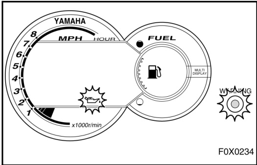
**NOTE:** If the warning indicators blink with adequate oil in the tank, have a Yamaha dealer check the oil filter for dirt and clogs.

### Engine Overheat Warning Indicator

**Engine overheat warning indicator:** If the engine starts to overheat, the warning light and the engine overheat warning indicator begin to blink, and the buzzer sounds intermittently. 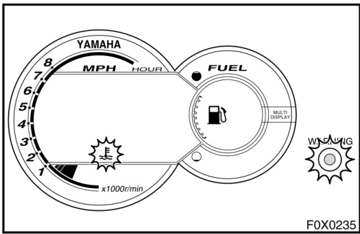

## Storage Compartments

### Storage Compartment Overview

A front storage compartment and a glove compartment are provided.
**NOTE:** Make sure that the storage compartments are properly secured before operating the watercraft. The storage compartments are not designed to be waterproof. If you carry objects that must be kept dry, such as the manuals, put them in a waterproof bag.

### Front Storage Compartment

**Front storage compartment:** The front storage compartment is located at the bow. 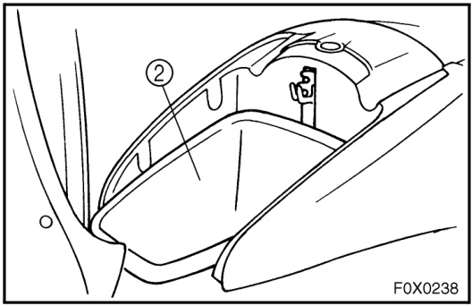 To open the front storage compartment, push the hood latch 1 down, 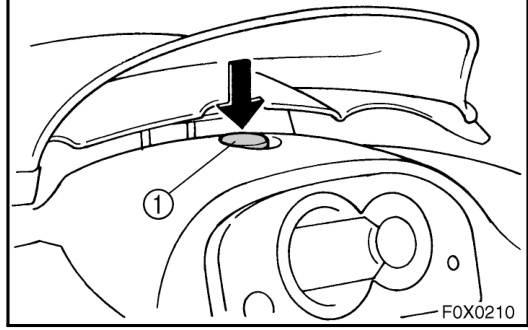 and then open the hood. 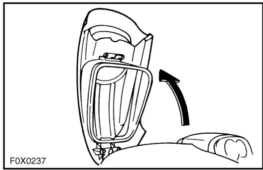
**NOTE:** The front storage compartment can be removed to access the engine compartment. Front storage compartment: Capacity: 16 L (4.2 US gal, 3.5 Imp gal) Load limit: 5 kg (11 lb). To close the front storage compartment, push down on the rear of the hood until it latches securely. 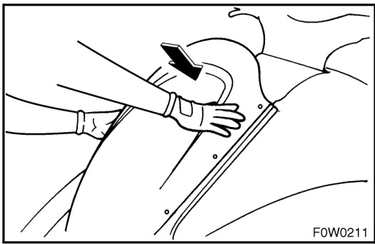

### Glove Compartment

**Glove compartment:** A glove compartment 2 is located in front of the seat. 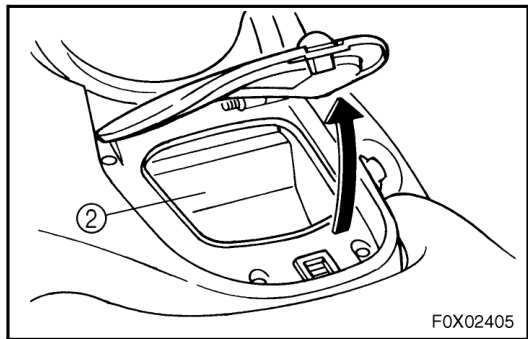 To open the glove compartment, slide the latch 1 toward you, and then lift up the lid. 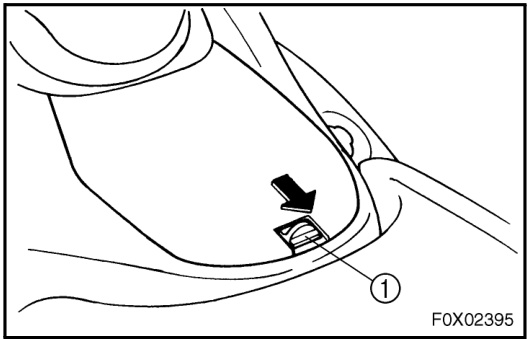 To close the glove compartment, push the lid down until it locks securely. Glove compartment: Capacity: 2 L (0.53 US gal, 0.44 Imp gal) Load limit: 1 kg (2.2 lb).

### Adjustable Sponson Positions

**Adjustable Sponson:** The sponsons 1 have adjustable positioning to allow the operator to enhance either straight-line performance or turning performance according to the preference and operating conditions. (See page 4-23 for adjustment procedures.) 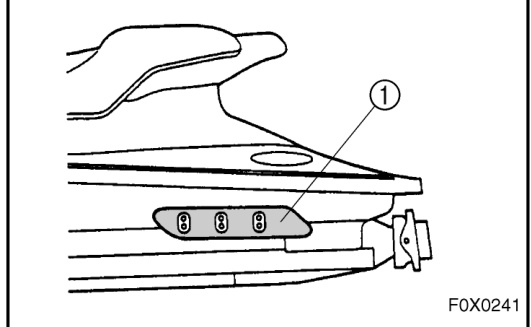
Up position: There will be less water resistance in this position, so straight-ahead acceleration when on plane and top speed will be enhanced.
Down position: This position will give the watercraft more “hook” which will enhance turning performance. 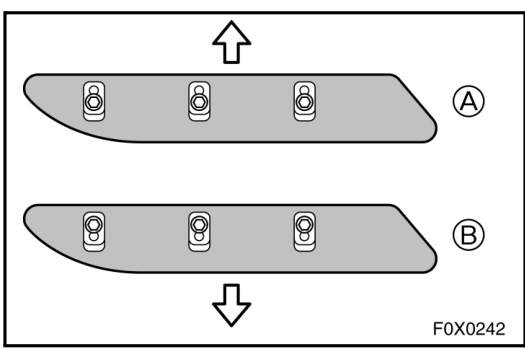

## Fire Extinguisher

### Fire Extinguisher Location and Specification

Check that there is a full fire extinguisher on board. 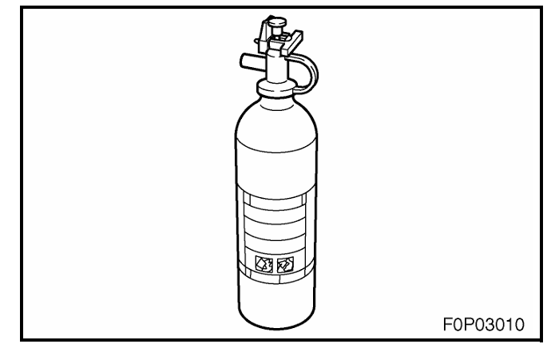 The fire extinguisher container 1 is located in the battery compartment. To open the fire extinguisher container cap remove the seat and turn it counterclockwise. 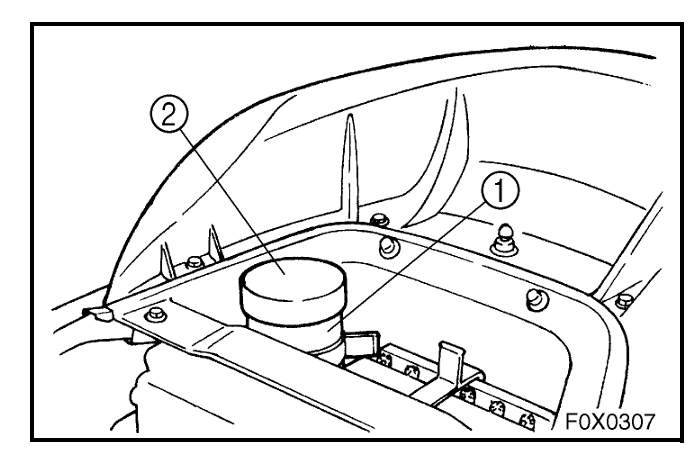 After inserting the fire extinguisher make sure that the container cap is tightened securely.
**NOTE:** See the instructions supplied by the fire extinguisher manufacturer for checking the fire extinguisher. Always keep the extinguisher in the fire extinguisher container. Always carry a fire extinguisher on board. A fire extinguisher is not standard equipment with this watercraft. If you do not have one, contact a Yamaha dealer or a fire extinguisher dealer to obtain one meeting the proper specifications.
Fire extinguisher: Classification: B-1, Capacity: 2 lb or more.

# Operations and Handling

## Boarding Alone

### Solo Boarding Procedure

1.  Swim to the rear of the watercraft and place both hands on the boarding platform, pull yourself up, and then grasp the handgrip with one hand. 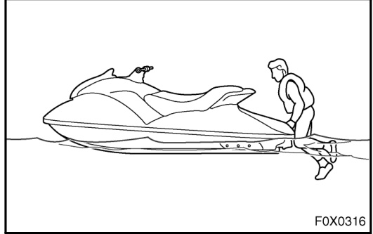
2.  Pull yourself up to a kneeling position on the platform, and then move to the seat and sit astride. 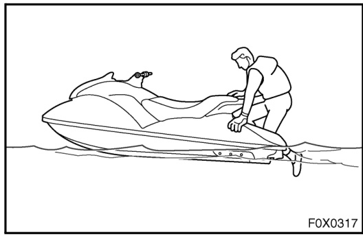
3.  Attach the engine shut-off cord to your left wrist, and then install the clip to the engine shut-off switch.
4.  Grip the handlebars firmly with both hands, place both feet on the floor of the footwell, start the engine, and then look in all directions before starting off. 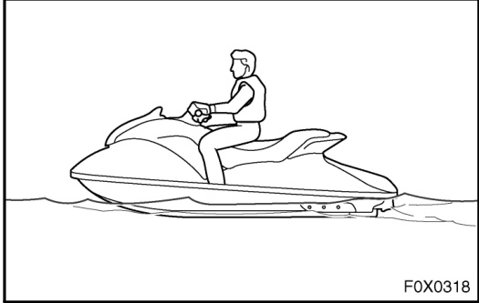
    **WARNING:** Before starting off, make sure that there are no boats, obstructions, or swimmers around you.

## Turning the Watercraft

### Steering Control and Throttle Relationship

Steering control depends on the combination of handlebar position and the amount of throttle. 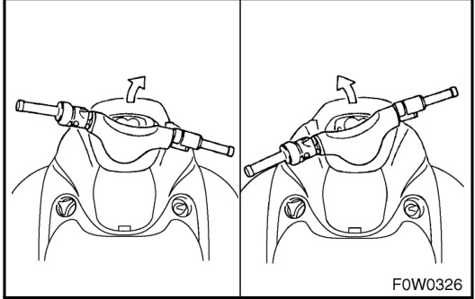 Water sucked in through the intake grate is pressurized by the impeller in the jet pump. As the pressurized water is expelled from the pump through the jet thrust nozzle, it creates thrust to move and steer the watercraft. The higher the engine speed, the more thrust is produced. The amount of jet thrust, in addition to the position of the handlebars, determines how sharply you turn.

A. More throttle produces higher thrust, so the watercraft will turn more sharply.
B. Less throttle produces lower thrust, so the watercraft will turn more gradually.
C. Releasing the throttle completely produces only minimum thrust. If you are traveling at speeds above trolling, you will have rapidly decreasing ability to steer without throttle. You may still have some turning ability immediately after releasing the throttle, but once the engine slows down, the watercraft will no longer respond to handlebar input until you apply throttle again or you reach trolling speed. At trolling speed, the watercraft can be turned gradually by handlebar position alone using just the amount of thrust available at idle.
D. If the engine is stopped while riding, there is no thrust. The watercraft will go straight even though the handlebars are turned. 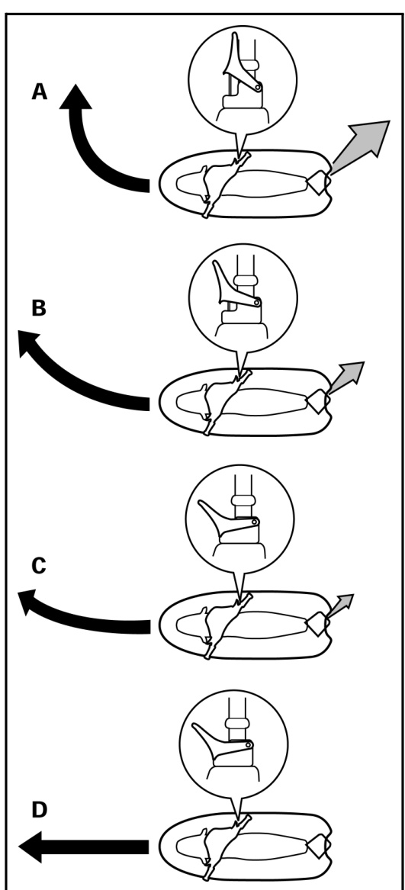

### Throttle Requirement for Steering

You need throttle to steer.
**WARNING:** Do not release the throttle when trying to steer away from objects—you need throttle to steer. A collision could result in severe injury or death. When operating at higher speeds, make gradual turns or slow down before turning. Sharp high-speed turns may cause the watercraft to slide sideways or spin, throwing the operator and passengers overboard which could cause an injury.

## Transporting

### Fuel Cock Setting During Transport

**WARNING:** Always place the fuel cock knob in the “OFF” position when transporting the watercraft, otherwise fuel could leak out into the engine or engine compartment, which would create a fire hazard. 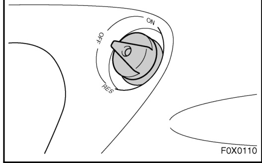

### Trailer Tie-Down and Surface Protection

When transporting the watercraft on a trailer, secure the tie downs to the trailer through the bow eye and stern rope holes. 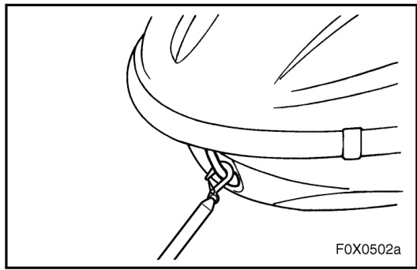
**CAUTION:** Do not route ropes or tie downs over the seat, as they may leave permanent marks on the seat’s surface. Also, wrap the ropes or tie downs with towels or rags where they touch the body of the watercraft to avoid scratching or damage. 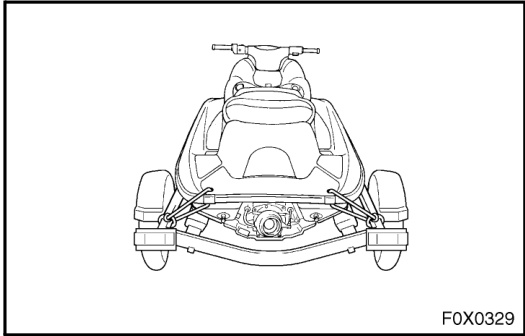

## Starting the Watercraft

### Starting the Watercraft

**WARNING:** Scan constantly for people, objects, and other watercraft. Be alert for conditions that limit your visibility or block your vision of others. 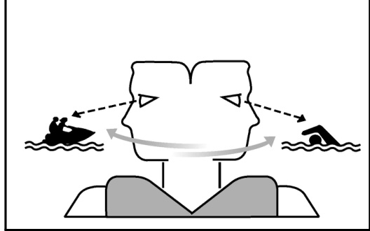 Operate defensively at safe speeds and keep a safe distance away from people, objects, and other watercraft. Do not follow directly behind watercraft or other boats. Do not go near others to spray or splash them with water. Avoid sharp turns or other maneuvers that make it hard for others to avoid you or understand where you are going. Avoid areas with submerged objects or shallow water. Take early action to avoid collisions. Remember watercraft and other boats do not have brakes. Do not release the throttle when trying to steer away from objects—you need throttle to steer. Practice reboarding in shallow water before riding in deep water.

**Starting and boarding in shallow water:**

1.  Do not start the engine in less than 60 cm (2 ft) of water. Put the watercraft in water that is deep enough, and then board the watercraft from the side or the rear. 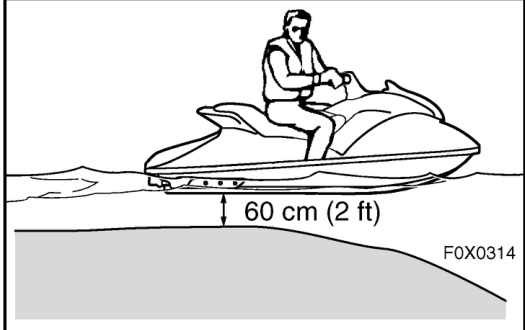
2.  Attach the engine shut-off cord to your left wrist, and then install the clip to the engine shut-off switch.
3.  Grip the handlebars with both hands, place both feet on the floor of the footwell, start the engine, and start off.

**Starting from a dock:**

1.  Board the watercraft from the side.
2.  Attach the engine shut-off cord to your left wrist, and then install the clip to the engine shut-off switch.
3.  Push the watercraft away from the dock, grip the handlebars with both hands, place both feet on the floor of the footwell, start the engine, and start off. 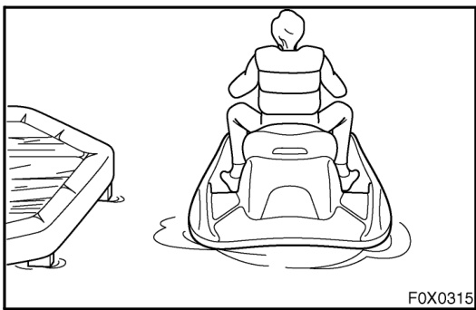

## Boarding with a Passenger

### Boarding with a Passenger

**WARNING:** Severe internal injuries can occur if water is forced into body cavities as a result of being near the jet thrust nozzle. Do not apply throttle until the passenger is seated with his or her feet on the floor of the footwell and is holding on to the operator.

1.  Climb on board as noted in the previous section, and sit astride the seat. Attach the engine shut-off cord to your wrist, and then install the clip to the engine shut-off switch.
2.  Have the passenger move to the rear of the watercraft.
3.  Have the passenger get on board and sit on the seat. 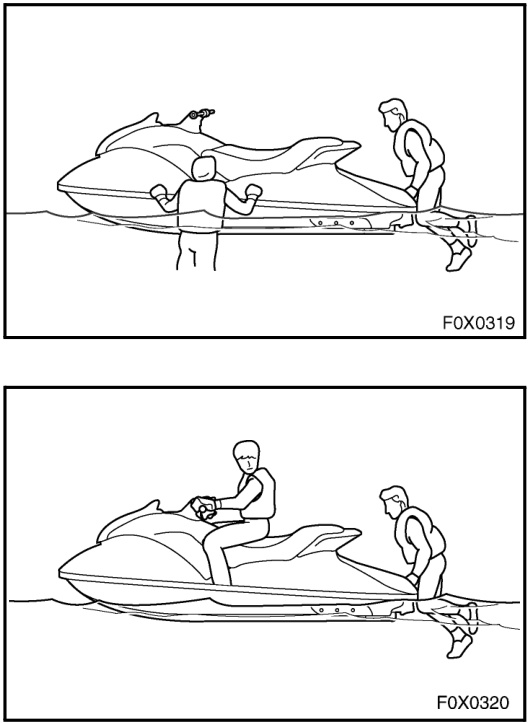
    **NOTE:** When a passenger is getting on board, both the passenger and the operator should try to balance the watercraft.
4.  The operator should check to see that the passenger has his or her feet on the floor of the footwell and that he or she is securely holding on to the operator.
5.  Start the engine, look in all directions, and then accelerate to planing speed. 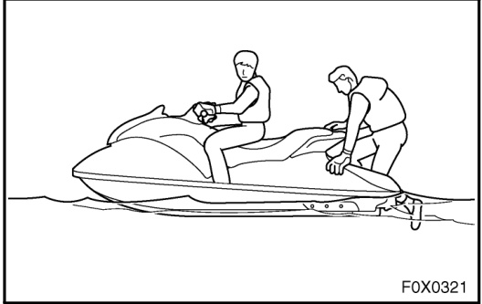
    **WARNING:** Before starting off, make sure that there are no boats, obstructions, or swimmers around you. 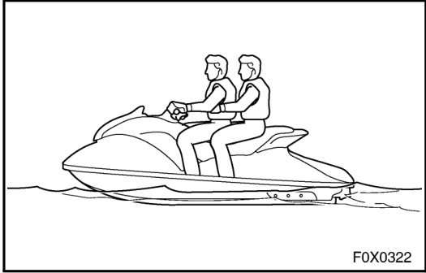
    **NOTE:** The heavier the total weight of the operator and passengers, the more difficult it will be to balance the watercraft. Do not operate the watercraft when the total weight exceeds 160 kg (353 lb) including any cargo.

### Passenger Boarding When Balance Is Difficult

If it is difficult to balance the watercraft at a standstill, proceed as follows:

1.  The passenger must steady the watercraft while the operator is boarding. The operator pulls himself up onto the platform into a seating position, then balances the watercraft. 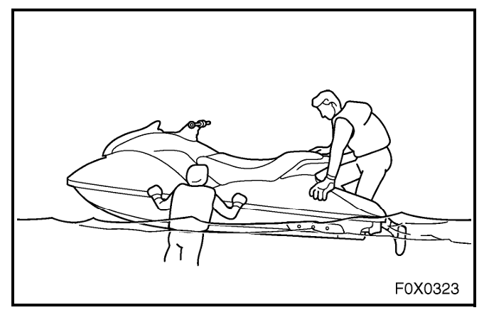
2.  Attach the lanyard to your left wrist, then install the clip on the lanyard to the engine shut-off switch. Start the engine and keep it at idle.
3.  The passenger pulls himself up on the platform, kneels down, then crawls onto the seat as the watercraft accelerates. 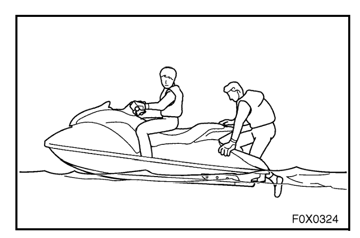
4.  The watercraft can now be accelerated to planing speed, then the operator can reduce the throttle to the desired running speed. 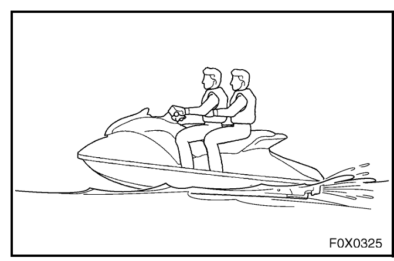

# Maintenance and Care

## Owner’s/Operator’s Manual and Tool Kit

### Carrying the Manual and Tool Kit

It is advisable always to carry the Owner’s/Operator’s Manual and tool kit 2 with you whenever you use the watercraft. 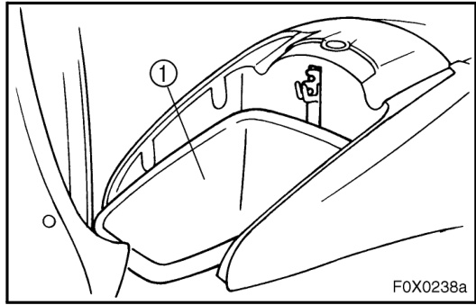 For your convenience, a storage compartment 1 is provided on the watercraft for the manual and tool kit. 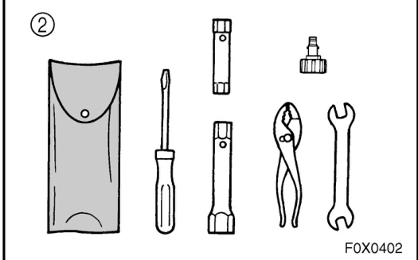
**NOTE:** To protect these materials from water damage, it would be a good idea to put them in a waterproof bag. If your Owner’s/Operator’s Manual is damaged, order a replacement from a Yamaha dealer. The service information included in this manual is intended to provide you with the necessary information for completing your own preventive maintenance and minor repairs. The tools provided in the tool kit are sufficient for this purpose.

## Fuel Filter and Fuel Tank

### Fuel Filter Replacement

**Fuel filter:** This watercraft is equipped with a onepiece, disposable fuel filter 1. The fuel filter should be replaced after the initial 10 hours or first month of operation and every 200 hours or 24 months thereafter, or if water is found in the filter. Have a Yamaha dealer replace the fuel filter if necessary. 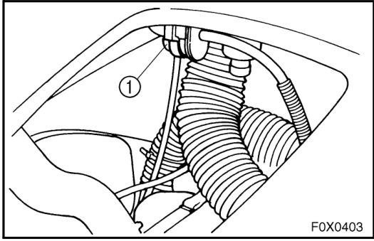
**WARNING:** Do not try to replace the fuel filter yourself. An incorrectly installed filter can leak gasoline, which could lead to fire or explosion. If necessary, have a Yamaha dealer replace the fuel filter.

### Fuel Tank Inspection

**Fuel tank:** Check the fuel tank 1 for leakage or water in the tank. If water is found in the fuel system or if the fuel tank needs to be cleaned, have a Yamaha dealer service the watercraft. 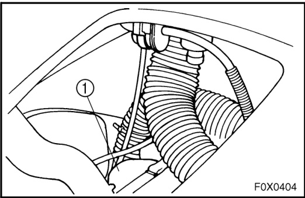

## Adjusting the Adjustable Sponson

### Adjustable Sponson Adjustment Procedure

The Adjustable Sponsons can be adjusted to enhance watercraft performance according to operator preference and operating conditions. (See page 2-19 for an explanation of various positions.)
To adjust:

1.  Remove the bolts 1 on both sponsons. 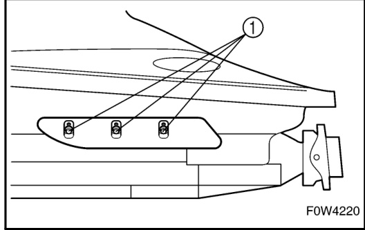
2.  Remove both sponsons, and then install them in the desired position.
    **NOTE:** Be sure to install both sponsons to the same level.
3.  Tighten the bolts on both sponsons to the correct torque. 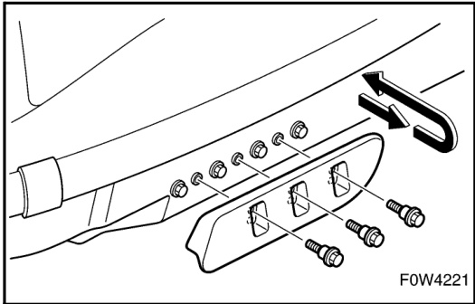
    Tightening torque: 18 N·m (1.8 kgf·m, 13 ft·lb)

## Cleaning the Jet Intake and Impeller

### Cleaning the Jet Intake and Impeller

If weeds or debris get caught in the intake or impeller, cavitation can occur, causing jet thrust to decrease even though engine speed rises. If this condition is allowed to continue, the engine will overheat and may seize. If there is any sign that the jet intake or impeller is clogged with weeds or debris, beach the watercraft and check the intake and impeller. Always stop the engine before beaching the watercraft. 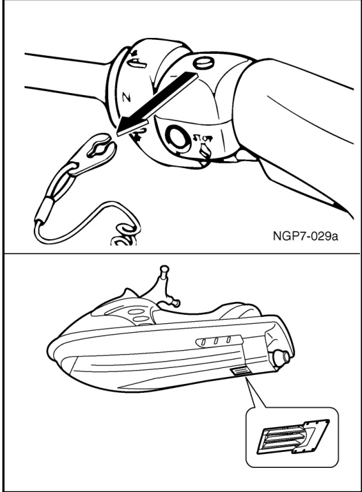
**WARNING:** Before attempting to remove weeds or debris from the jet intake or impeller areas, shut the engine off and remove the clip from the engine shut-off switch. Severe injury or death could result from contact with the rotating parts of the jet pump.

1.  Turn the watercraft on its side as shown.
    **CAUTION:** Place a suitable clean cloth or carpeting underneath the watercraft to protect it from abrasions and scratches. Always turn the watercraft over onto its port (left) side. When turning the watercraft on its side, support the bow so the handlebars cannot be bent or damaged. 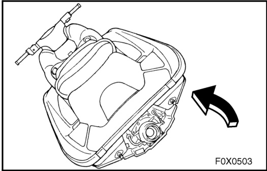
2.  Remove any weeds or debris from around the drive shaft, impeller, pump housing, and jet thrust nozzle. If debris is difficult to remove, consult your Yamaha dealer.
    **CAUTION:** Always avoid operating your watercraft in areas where weed growth is thick. If traveling in weeded areas is unavoidable, operate the engine alternately at partial throttle and full throttle. Weeds tend to accumulate more at a steady speed and at trolling speed. If weeds clog the intake or impeller area and cause cavitation, follow the cleaning procedure above.