# 人体工学椅手册

## 使用椅子前须知

请阅读本手册。在阅读并理解本手册中的说明前，请勿使用本产品。请妥善保管本手册以备日后查阅。请保留原包装箱，以备可能需要退换产品时使用。

# 组装说明

## 配件详情

检查各类配件。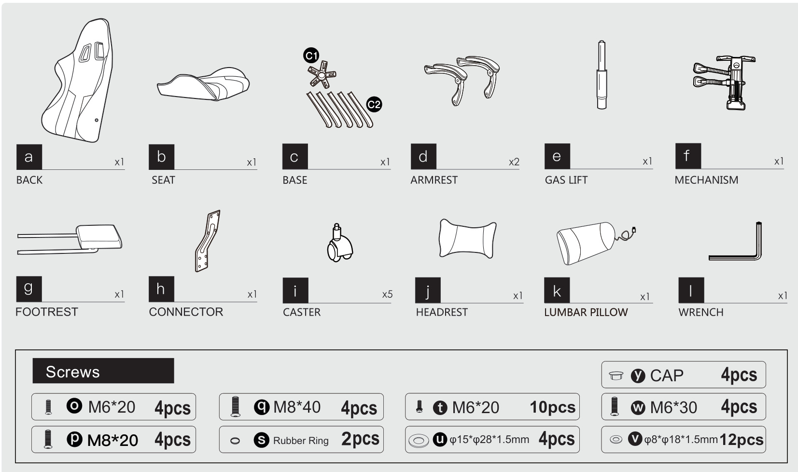

## 安装说明

  -用螺丝将 C1 与 C2 组装在一起。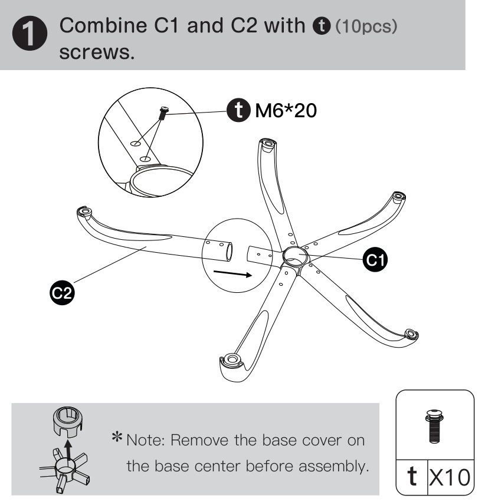
  -安装脚轮。用底座盖盖住底座中心，并安装气杆。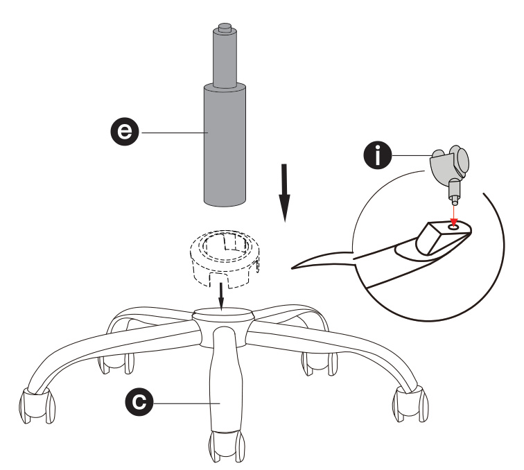
  -安装底盘。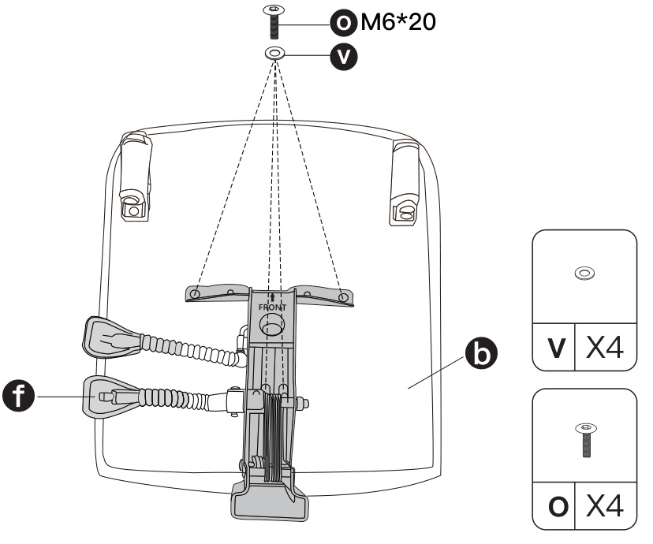
  -安装脚踏，然后套上橡胶圈。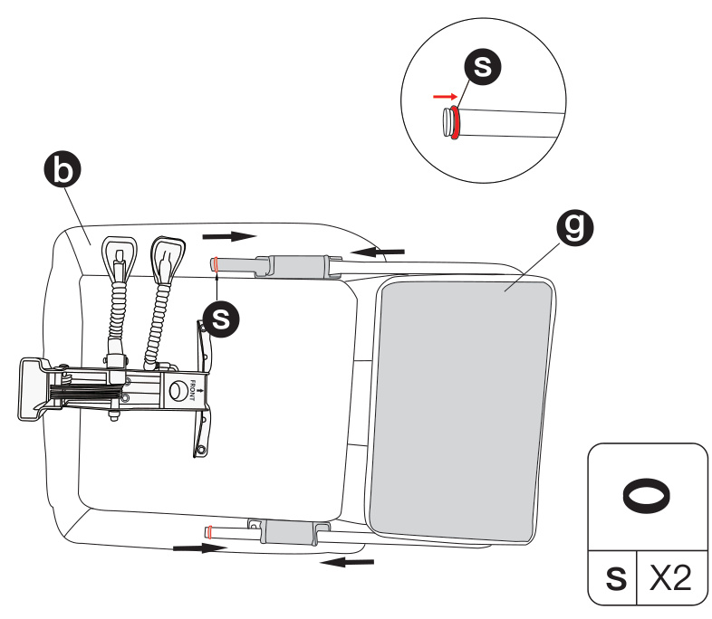
  -将座椅放置在气杆上。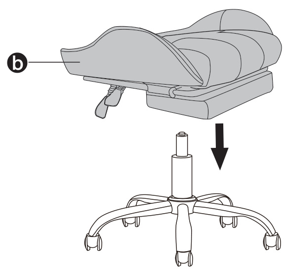
  -在椅背上安装连接件。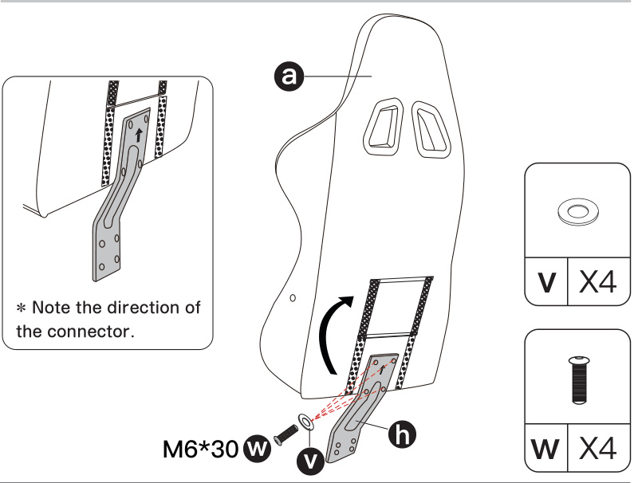
  -将连接件安装到底盘后端。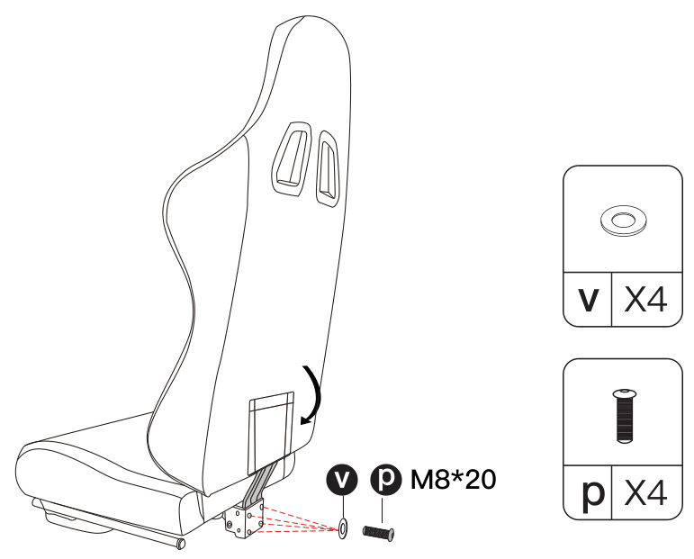
  -对准螺丝孔并安装扶手。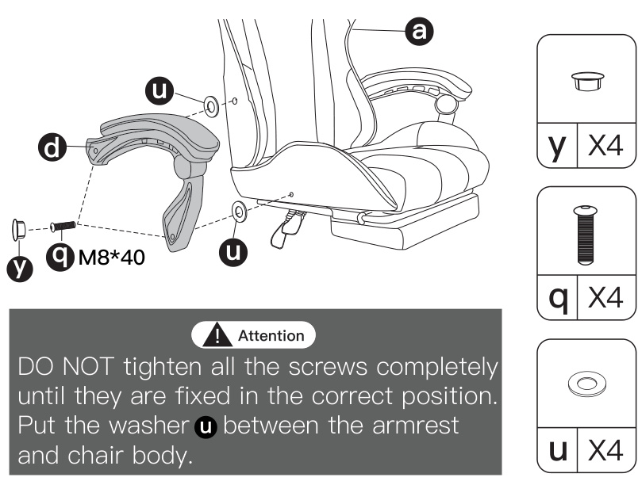
  -安装头枕与腰枕。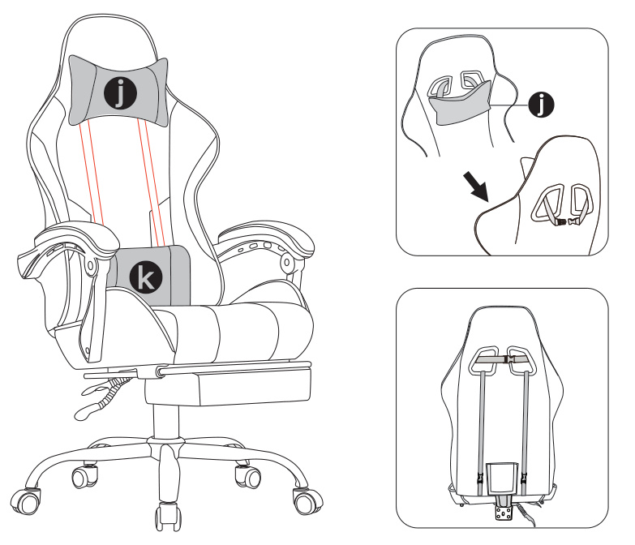
  -组装完成。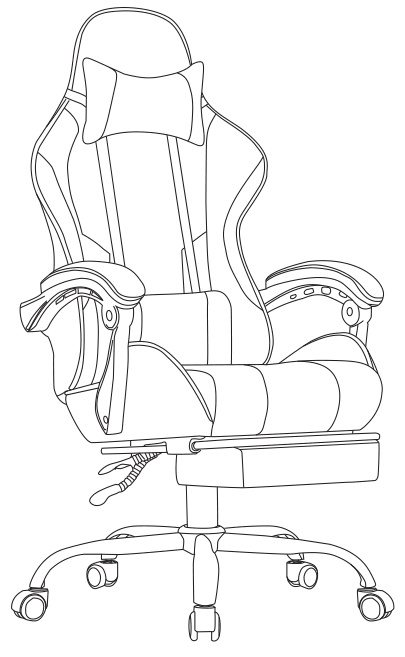

# 功能调节

## 功能调节（高度 / 后仰 / 按摩）

本椅子支持高度调节、椅背后仰锁定、腰枕按摩三项功能。

**高度调节**
向上拉起 “升降” 拉杆即可调节椅子高度，到达所需高度后松开 “升降” 拉杆。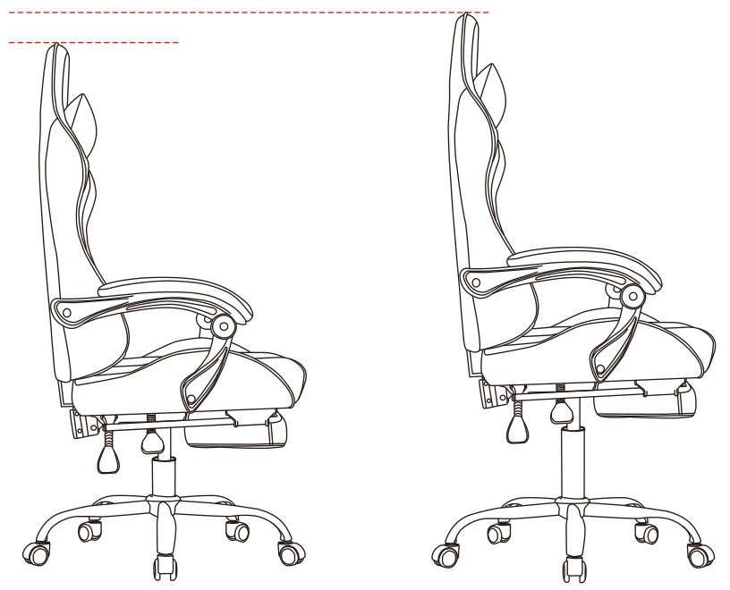
调节高度时请将身体微微抬离座椅。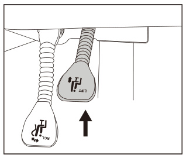

**椅背后仰功能**
向上拉起 “后仰” 拉杆，椅背角度可随人体动作独立倾斜。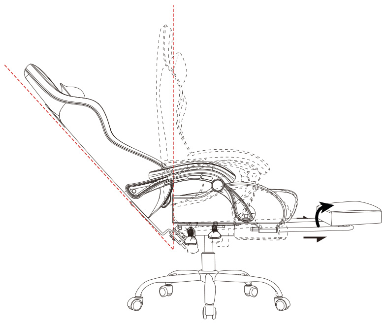
向下按下 “后仰” 拉杆，椅背角度即可锁定。将椅背复位至正常位置时请靠在椅背上，否则椅背可能会快速回弹。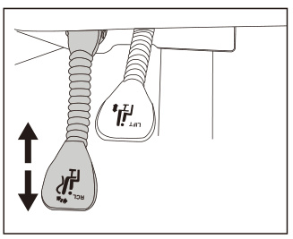

**按摩功能**
插入 USB 即可启用腰枕的按摩功能。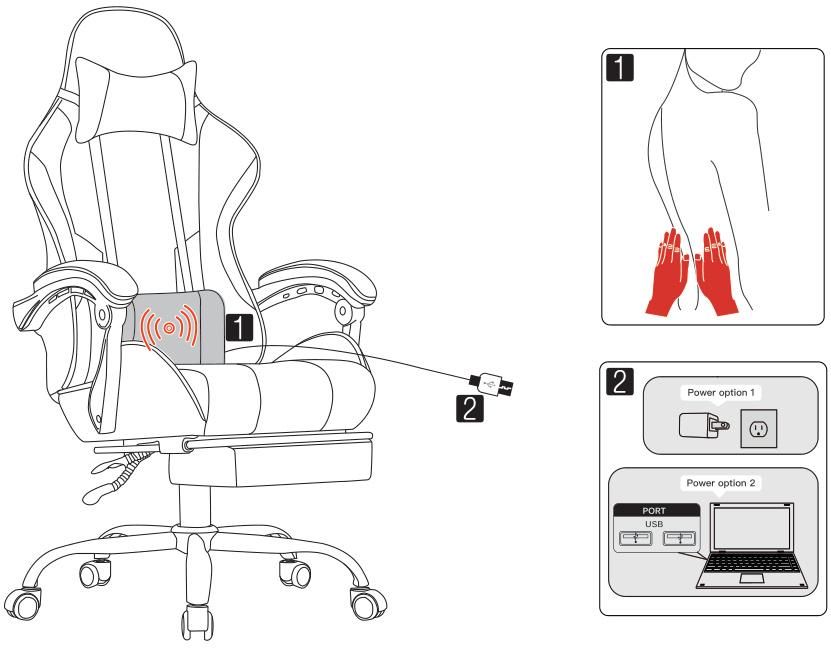

# 常见问题

Q：使用一段时间后扶手变松怎么办？
A：大多数情况下，扶手和椅背的螺丝会在使用一段时间后松动，重新拧紧螺丝即可解决问题。