# 儿童电动摩托车手册

## 一、产品规格与安全警告

### 1.1 使用前阅读、产品规格与充电基础

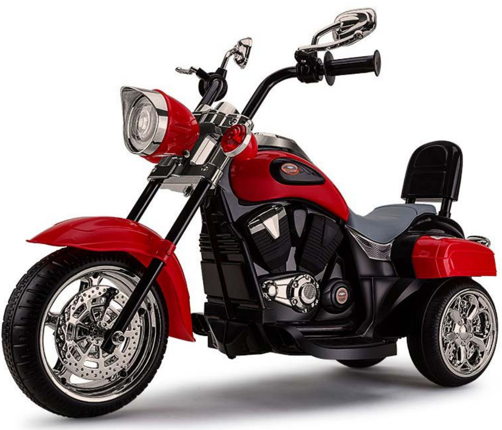

使用前请仔细阅读并理解本手册全部内容。请妥善保管本手册以备日后查阅，本手册包含重要信息。首次使用前，请为电池充电8至12小时，连续充电时间不得超过20小时。电池出厂时可能带有部分电量，但使用前仍需对电池进行充电。

阅读本指南时请注意以下事项：

  - 适用年龄：3岁及以上
  - 载重：30千克
  - 充电器：输出：直流7.8V 0.5A
  - 电池：直流6V 4.5AH
  - 保险丝：5A自恢复保险丝
  - 充电时间：8至12小时（最长不超过20小时）

### 1.2 安全警告与组装前确认

为了您孩子的安全，请务必阅读所有警告及组装/使用说明。请妥善保管本指南以备日后查阅。

本产品需由成人组装。本产品包含包装材料及小零件，未组装状态下的小零件、尖锐边缘及尖端可能会对儿童造成危险和伤害。拆箱及组装产品时请务必小心。组装时请让儿童远离，儿童不得接触零件或协助组装产品，并妥善处理包装材料。

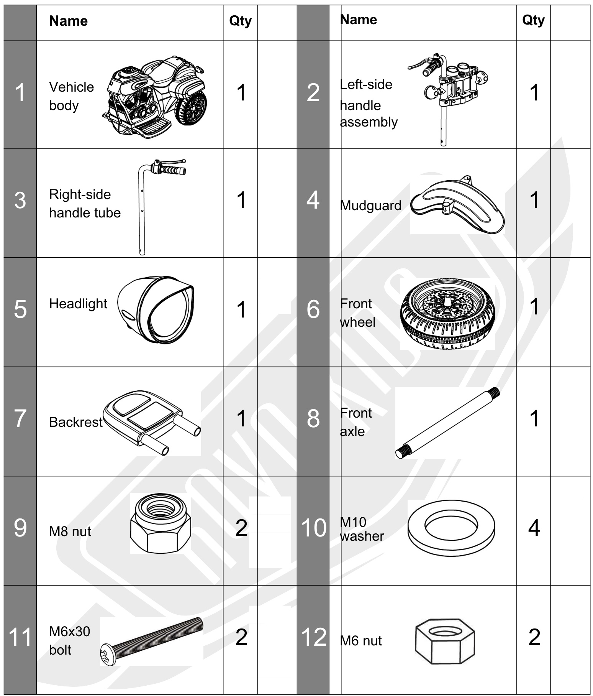
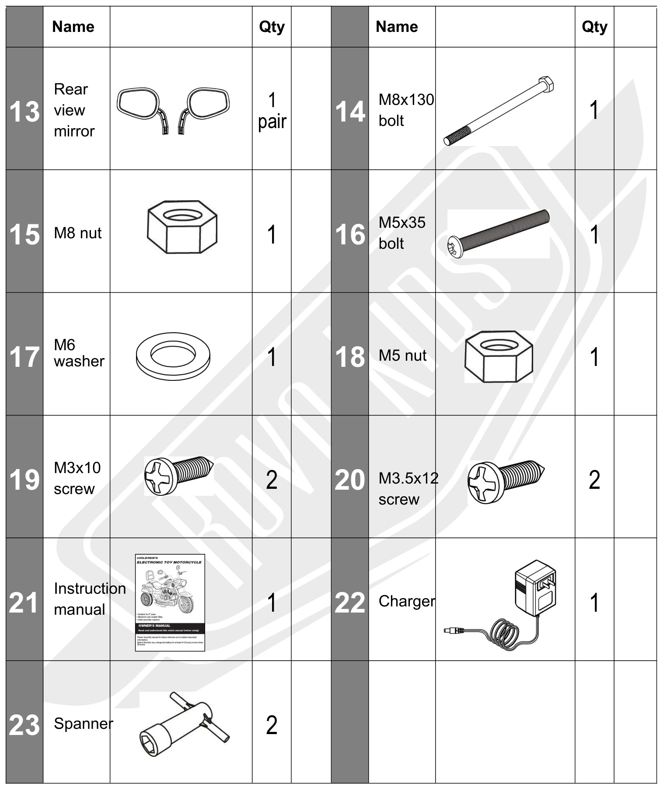
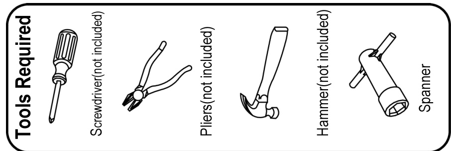
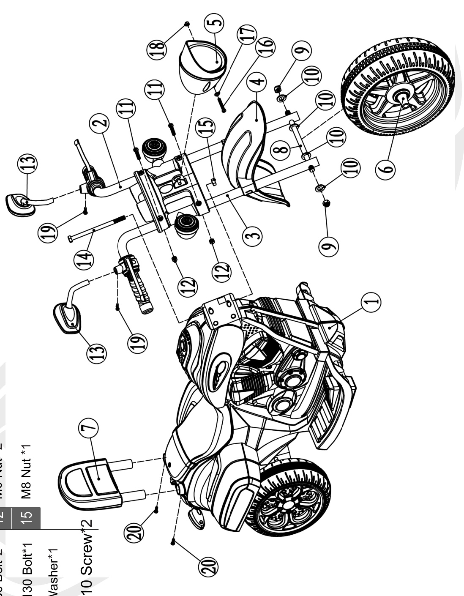

组装前请确认所有零件齐全，组装完成前请保留所有包装，确保无零件遗失。组装时可能需要部分工具（不随产品提供），例如十字螺丝刀和钳子。

## 二、组装说明

### 2.1 挡泥板、右侧把手管与前轮安装

**1. 安装挡泥板**

  - 按照步骤1所示，将挡泥板侧转，然后向上滑入左侧把手管。注意！请勿让“凸点”卡入1号孔。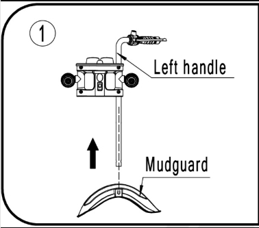
  - 按照步骤2所示，安装挡泥板，使“凸点”卡入2号孔。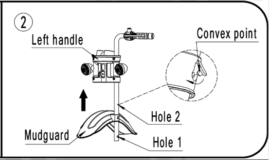

**2. 安装右侧把手管**

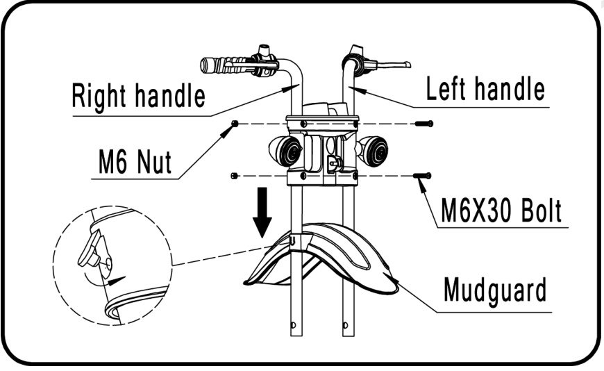
如图所示，拆下把手固定夹上的两颗螺栓和螺母。将右侧把手管穿过固定夹与挡泥板。轻轻转动把手，避免“凸点”卡入1号孔。将把手调整至正确位置后，转动把手使“凸点”卡入2号孔。使用两颗螺栓和螺母将把手管固定在固定夹上。

**3. 安装前轮**

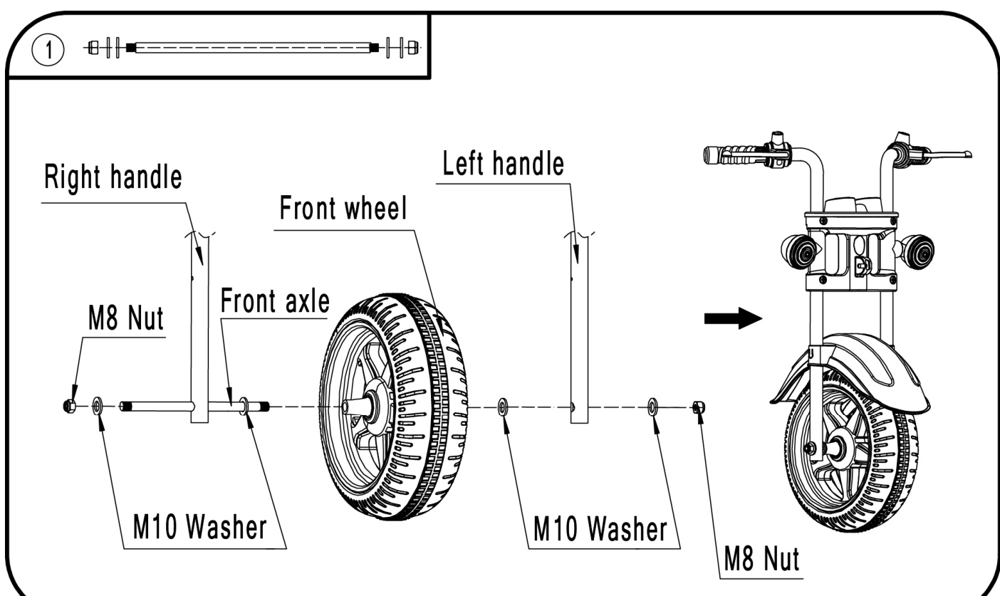

  - 按照步骤1所示，将前轴穿过两侧把手管及前轮，两侧把手管内外均需安装垫片。
  - 使用两个螺母将前轴及车轮固定在把手管上，使用随产品提供的扳手拧紧螺母直至螺纹尽头。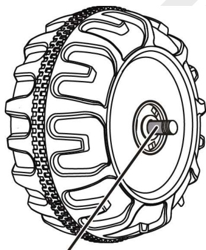

注意：前轮及前轴组装完成后，请检查车轮与把手管之间的间隙。若间隙过大、车轮定位不稳，建议在车轮与把手管之间加装额外垫片（不随产品提供）。加装垫片并重新安装前轴后，检查间隙是否最小化，同时确保车轮可自由转动。若车轮卡死，则减少一片垫片。

### 2.2 前灯、线路、电池连接与把手总成安装

**4. 安装前灯**

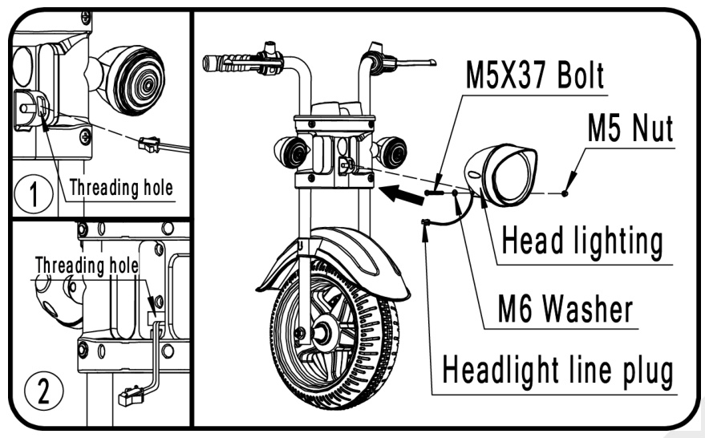
按照步骤1和2所示，将前灯线束插头穿过把手固定夹上的“穿线孔”。将前灯安装到把手固定夹前端的支架上，并用M5螺栓、螺母和垫片固定。

**5. 连接前灯线路**

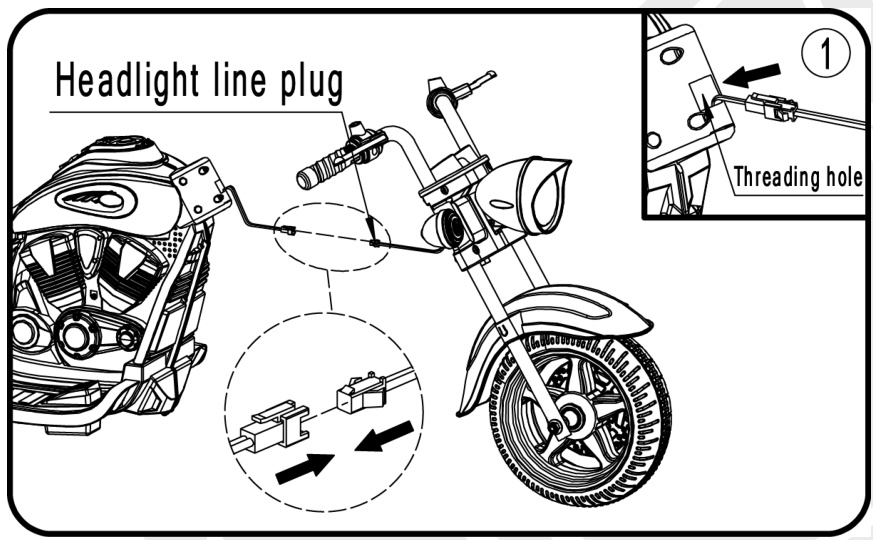
按照步骤1所示，将前灯线束插头与车身主线束连接。确保接头对接正确（通常接头仅能单向对接），线缆无外露，且不会被挤压在把手固定夹与车身之间。

**6. 将把手总成安装到车身上**

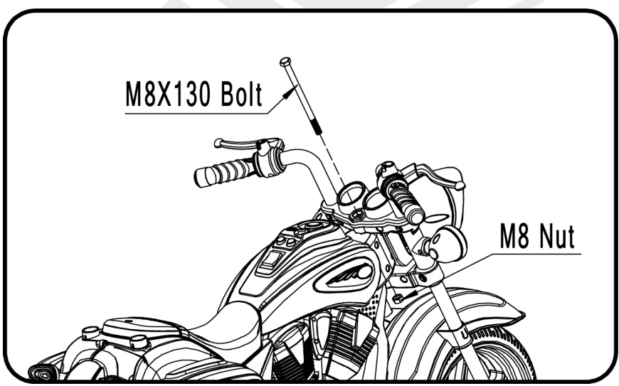
如图所示，小心将把手及前轮总成与车身对齐。将M8螺栓穿过把手固定夹与车身，并用螺母紧固。

**7. 连接电池**

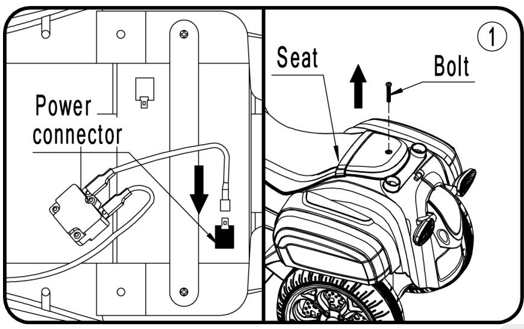
按照步骤1所示，拆下固定座椅的螺丝，掀开座椅。如图所示，将电源接头与电池端子对接。重新安装座椅并拧紧螺丝固定。

### 2.3 后视镜与靠背安装

**8. 安装后视镜**

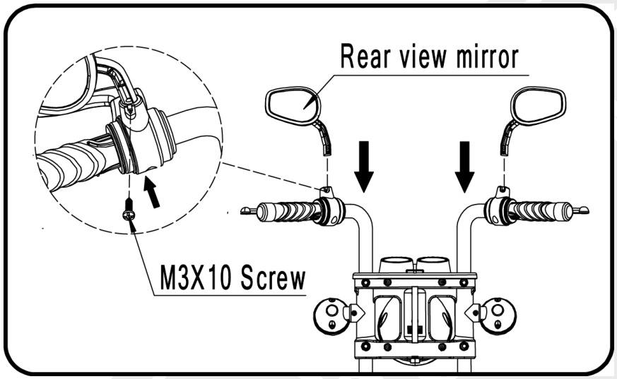
如图所示，将后视镜向下按压卡入把手对应孔位，从下方用螺丝紧固。

**9. 安装靠背**

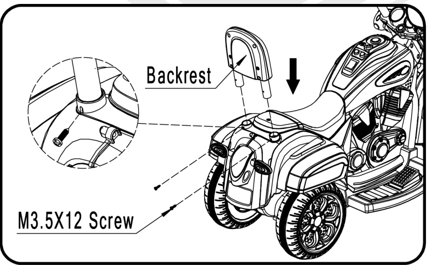
如图所示，将靠背向下按压卡入车身对应孔位，从后方用两颗螺丝紧固。

## 三、操作与骑行指南

### 3.1 安全骑行规则

确保所有使用者充分理解以下安全规则，预防伤害及意外发生：

  - 切勿让儿童独自使用。使用过程中必须有成人全程看护。车辆使用时请始终确保儿童在您的视线范围内。
  - 切勿在车道、汽车附近、草坪、陡坡或台阶上/附近、游泳池或其他水域上/附近使用。务必穿着鞋子。务必坐在座椅上。
  - 适用年龄3岁及以上，最大载重30千克。遵守车辆安全使用的载重及年龄限制。
  - 骑行时务必佩戴头盔及防护装备。
  - 仅可在平坦地面使用，例如室内、花园或游乐场。切勿在黑暗中使用。仅可在白天或光线充足的区域使用。不建议在湿滑地面或坡度大于15度的区域使用。雨雪天气请勿在室外使用本产品。
  - 前进切换至倒车前，请务必将车辆完全停稳。
  - 严禁改装车辆电路或其他部件。定期检查电线、接头，确保紧固件及部件牢固。每次使用前检查并确保车辆安全。
  - 车辆行驶时，切勿让儿童触碰车轮或靠近车轮。
  - 使用车辆时请小心，需具备一定操控技巧以避免摔倒或碰撞，防止对使用者、他人或物品造成伤害。

### 3.2 使用前检查、行驶控制与电路图

使用前检查清单：

  - 首次使用车辆前，电池需充电8至12小时，连续充电不得超过20小时。仅可由成人进行充电操作。
  - 按照说明书完整组装车辆。
  - 检查所有紧固件是否拧紧，所有部件是否牢固。

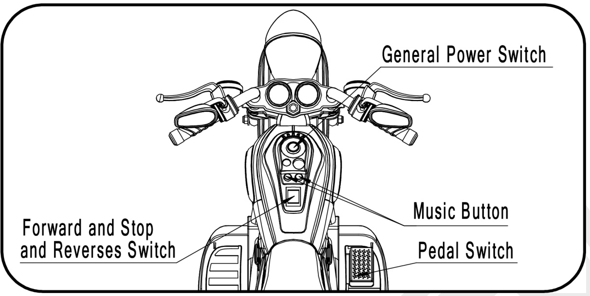
重要！切换速度或方向时请先停车，避免损坏变速箱及电机。
(1) 打开电源开关启动车辆。播放音效，车辆即可骑行。
(2) 前进：将“前进/停止/倒车”开关拨至“前进”位置。踩下脚踏板。车辆向前行驶。
(3) 停止：松开油门踏板使车辆停止。将“前进/停止/倒车”开关拨至“停止”位置。
(4) 倒车：将“前进/停止/倒车”开关拨至“倒车”位置。踩下脚踏板。车辆向后行驶。
(5) 车辆通电时，按下音乐按键可播放音效或音乐。

电路图：
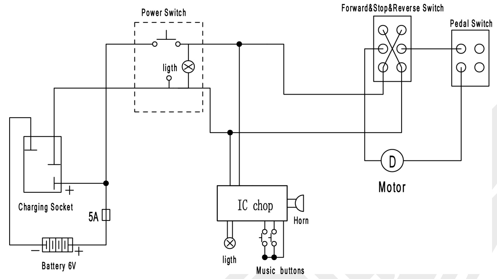

## 四、电池充电与保养维护

### 4.1 电池充电安全要求

仅可由成人进行充电操作！预防火灾及触电：

  - 仅使用本产品配套的电池及充电器。切勿使用其他型号的电池或充电器替代。使用非配套电池或充电器可能引发火灾或爆炸。
  - 请勿将本电池或充电器用于其他产品。否则可能导致过热、火灾或爆炸。
  - 切勿改装电路系统。擅自改动电路系统可能导致触电、火灾、爆炸或永久性损坏系统。
  - 切勿让电池电极直接接触。可能引发火灾或爆炸。切勿让任何液体溅到电池或相关部件上。
  - 充电过程中会产生易燃气体。请勿在热源或易燃物品附近充电。仅可在通风良好的区域充电。
  - 切勿通过电线或充电器提拉电池。可能损坏电池并引发火灾。仅可通过电池外壳提拉。
  - 仅可在干燥区域充电。
  - 电池电极、接线柱及相关配件含铅及铅化合物，该化学物质可能致癌或对人体有害。操作后请洗手。
  - 请勿拆解电池。电池内含铅酸及其他有毒腐蚀性物质。
  - 请勿拆解充电器。内部裸露线路及电路可能引发触电。
  - 仅可由成人操作或充电电池。切勿让儿童接触或充电电池。
  - 请勿跌落电池。可能造成永久性损坏或严重伤害。
  - 充电前检查电池、充电器、电线及接头是否磨损或损坏。若部件出现损坏，请勿充电。
  - 请勿让电池完全耗尽电量。每次使用后充电，长期不使用时每月至少充电一次。
  - 充电时请保持车辆直立。务必用支架固定电池，防止车辆倾倒时电池脱落造成伤害。

### 4.2 充电操作步骤与充电保护

充电操作步骤：
充电输入接口位于“发动机”位置。充电时电源开关必须置于关闭位置。首次使用前，电池需充电8至12小时。充电时间请勿超过20小时，避免充电器过热。车辆行驶速度变慢时，请及时充电。每次使用后，或至少每月一次，为电池充电。注意：本产品具备充电保护功能，充电期间所有功能不可用。

1.  打开充电座盖。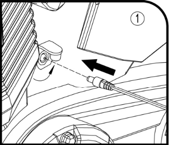
2.  将充电器线插入充电接口。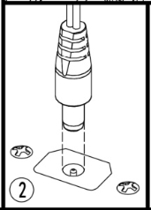
3.  将充电器插头插入电源插座。电池开始充电。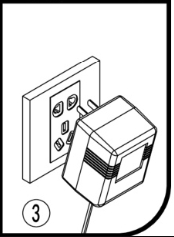

### 4.3 日常保养、清洁与存放

  - 每次使用前由家长检查玩具。定期检查潜在隐患，例如电池、充电器、线缆及电线状况，螺丝及部件是否牢固无损坏。若出现损坏，玩具需经授权服务中心或专业人员检查维修后方可使用。
  - 确保车辆各部件无裂纹或损坏。偶尔使用少量润滑油润滑车轮等活动部件。
  - 将车辆存放于室内干燥、避光处，并加盖遮盖物。使车辆远离热源，例如火炉、加热器。塑料部件可能受损。
  - 请勿用水管或水清洗车辆。请勿在雨雪天气使用车辆。水会损坏电机、电路系统及电池。使用柔软干布清洁车辆。如需恢复塑料部件光泽，可使用不含蜡的家具抛光剂。请勿使用车蜡。请勿使用研磨性清洁剂。
  - 请勿在松散泥土、沙子或细碎石子路面行驶，以免损坏活动部件、电机或电路系统。
  - 不使用时，关闭车辆电源。长期存放时，断开电池连接。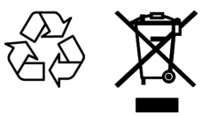

### 4.4 电池处理、文件查阅与适用性说明

  - 密封铅酸电池必须按照当地法规以环保方式回收或处理。请勿将铅酸电池丢弃于火中。电池可能爆炸或漏液。请勿将铅酸电池丢弃至普通生活垃圾中。请将废旧电池送至指定回收点，例如汽车电池销售点。有关铅酸电池的环保回收及处理信息，请联系当地垃圾管理部门。
  - 使用前请查阅所有文件、包装及产品标签。部分产品提供在线文档。建议打印并保存文档。
  - 每次使用前，检查产品是否有松动/破损/损坏/缺失零件、磨损或泄漏（如适用）。切勿使用存在松动/破损/损坏/缺失零件、磨损或泄漏的产品。
  - 按家庭平均使用情况，产品需每6个月由专业人员检查及维修（如适用）。超出上述使用条件可能需要增加检查/维修频率。
  - 确保产品所有使用者在使用前完成相关行业认可的培训课程。若您在阅读上述信息后发现购买错误，请直接联系零售商了解退换货政策。本产品由综合百货零售商供应，零售商可能不了解您的具体使用场景。无论零售商或其代表如何保证，使用前请务必获得专业人员的第三方使用认可。本产品不适用于需要故障安全操作的场景。与任何产品（例如汽车、电脑、烤面包机）相同，本产品可能出现技术问题，需要维修或更换零件或产品本身。若此类故障及修复所需时间可能对使用者、企业或员工造成任何不便、经济损失，本产品则不适合您的需求。因操作不当或任何故障（包括但不限于产品退回、更换、零件更换或专业维修）可能造成经济损失、员工时间损失或需要赔偿的不便，本产品均不适用。

## 五、故障排除

### 5.1 车辆无法行驶的排查

**问题：车辆无法行驶**

  - **可能原因：电池电量不足。** 每次使用后，或至少每月一次，为电池充电8至12小时。充电时间请勿超过20小时。
  - **可能原因：热保护器跳闸。** 本车辆配备自恢复保险丝。当车辆过载或操作不当，自恢复保险丝会暂停工作5至20秒，之后恢复正常。自恢复保险丝位于座椅下方（见图示）。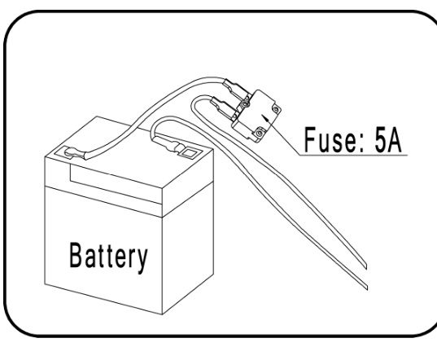 为避免保险丝跳闸，请遵守以下规则：请勿超载，最大载重30千克。请勿在车辆后方牵引任何物品。请勿在陡坡行驶。请勿撞击固定物体，以免车轮空转导致电机过热。请勿在高温天气行驶，部件可能过热。请勿擅自改动电路系统。否则可能造成短路，导致保险丝跳闸。
  - **可能原因：车轮螺母松动。** 若车轮螺母未拧紧，车轮无法与齿轮啮合。拧紧螺母。
  - **可能原因：电池接头或电线松动。** 确保电池接头对接牢固。
  - **可能原因：电池无法继续使用。** 是否按照说明正确保养电池？电池是否已老化？可能需要更换电池。
  - **可能原因：电路系统损坏。** 可能因进水腐蚀或灰尘等导致开关卡住。
  - **可能原因：电机损坏。** 电机需专业维修。

### 5.2 充电、续航、噪音与发热问题排查

**问题：电池无法充电**

  - **可能原因：电池接头或充电器接头松动。** 确保电池接头与充电器接头对接牢固。
  - **可能原因：充电器未通电。** 确保充电器插入电源插座且电源通电。
  - **可能原因：充电器故障。** 充电时充电器是否发热？若不发热，充电器可能损坏，需更换。

**问题：车辆行驶时间过短**

  - **可能原因：电池充电不足。** 充电时间不够。每次使用后，或至少每月一次，为电池充电8至12小时。充电时间请勿超过20小时。
  - **可能原因：电池老化。** 电池最终会失去储电能力。根据使用情况及环境，电池使用寿命为1至3年。请更换电池。

**问题：电池充电时有噪音**

此为正常现象，无需担心。充电时也可能无噪音，同样属于正常。

**问题：充电器充电时发热**

此为正常现象，无需担心。
