# 冰箱手册

# 重要安全说明

## 基本安全注意事项

### 安全警示符号与警示词说明

本手册包含多项重要安全提示。请始终阅读并遵守所有安全说明。这是安全警示符号。它用于提醒您注意安全提示，告知您可能导致您或他人伤亡、或造成产品损坏的危险。所有安全提示前均会标注安全警示符号及危险警示词：危险、警告或注意。这些词语含义如下：

危险：不遵守说明将导致死亡或重伤。
警告：不遵守说明可能导致死亡或重伤。
注意：表示存在潜在危险，如不避免，可能导致轻微或中度伤害，或仅造成产品损坏。

### 基本安全预防措施

所有安全提示均会说明危险、告知如何降低受伤风险以及不遵守说明可能产生的后果。为降低使用产品时发生火灾、触电或人身伤害的风险，应遵守基本安全预防措施，包括以下内容。使用本电器前请阅读所有说明。违反本说明可能导致受伤或房屋、物品损坏。请务必小心。

### 特殊人群与儿童使用限制

本电器不适合肢体、感官或精神障碍者，以及缺乏经验和知识的人员（包括儿童）使用，除非有负责其安全的人员对其进行使用监督或指导。应看管儿童，确保其不玩耍本电器。请勿让儿童触碰或玩耍电器正面控制面板。

## 连接电源时

### 专用插座与过载风险

应使用专用插座。一个插座同时使用多个设备可能引发火灾。若本机连接漏电保护器，保护器可能跳闸，导致食物变质。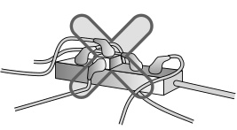

### 电源插头朝向与背部挤压风险

请勿让电源插头朝上或被挤压在冰箱冰柜背面。若电源线被挤压在冰箱后方，可能损坏线缆引发火灾。插头朝上可能因线缆自重松脱，导致电气故障、引发火灾或冰箱停机导致食物变质。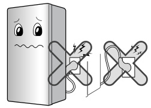

### 安装或移动时防止电源线被挤压、弯折或损坏

安装过程中拔下插头后推入冰箱时，防止电源线被挤压或弯折。线缆被挤压或弯折可能引发火灾或触电。将电器从墙面移开时，注意不要碾压或损坏电源线。请勿让重物挤压或弯折电源线。可能损坏电源线，引发火灾或触电。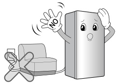

### 请勿延长或改装电源插头长度

请勿延长或改装电源插头长度。可能引发火灾或触电。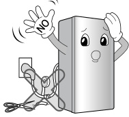

### 清洁、操作或更换内部灯泡前拔下电源插头

清洁、操作或更换冰箱冰柜内部灯泡时，请拔下电源插头。可能引发触电或伤害。更换冰箱冰柜内部灯泡时，确保灯座内的绝缘橡胶圈未被取下。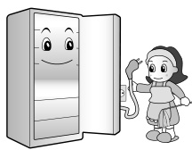
更换冰箱内部灯泡前请拔下电源插头，否则有触电风险。

### 请勿拉扯电源线或湿手触碰电源插头

请勿拉扯电源线或用湿手触碰电源插头。可能引发触电或伤害。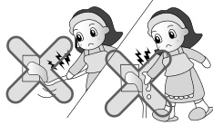
请勿湿手插拔电源插头，以免触电。

### 清除电源插头水渍灰尘并确保插脚牢固

清除电源插头上的水渍或灰尘，确保插脚完全牢固插入。灰尘、水渍或接触不良可能引发火灾或触电。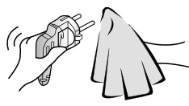
请勿用湿布清洁插头。清除电源插脚上的异物。否则有火灾风险。

### 正确拔出电源插头

请勿拉扯电源线断电。务必握住插头头部拔下。拉扯线缆可能损坏线缆，导致触电或火灾。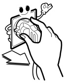切勿拉扯电源线拔下冰箱冰柜插头。务必握紧插头，直接从插座拔出。否则可能导致电线断开、短路，引发触电或火灾。切勿损坏、过度弯折、拉扯或扭曲电源线，电源线损坏可能引发火灾或触电。

### 接地可靠性要求

确保接地可靠。若不完全理解接地说明或对电器是否正确接地存在疑问，请咨询合格电工或维修人员。接地不当在发生故障时可能导致触电。务必按照当地法规为设备接地。接地不当可能引发火灾。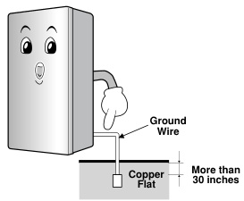发生短路时，接地保护通过为电流提供泄放线路降低触电风险。为防止触电，本电器必须接地。接地插头使用不当可能导致触电。

### 电源线、插头与插座损坏处理

若电源线或电源插头损坏、插座插孔松动，请勿使用。可能引发触电或火灾。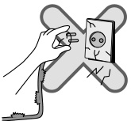若墙壁插座松动，请勿插入电源插头。可能引发触电或火灾。

### 重新插拔电源的等待时间

重新插拔插头时请等待5分钟或更长时间。可能导致冰箱运行故障。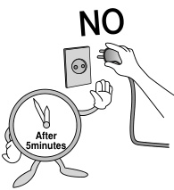拔下电器插头后，至少等待5分钟再重新插入插座。冷冻室异常运行可能导致物品损坏。

### 独立电源、电源可触及性与电源线更换

尽可能为冰箱冰柜配备独立电源插座，避免与其他电器或家用灯具共用导致过载。请勿改装或延长电源线长度。会导致触电或火灾。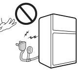

电源插头可触及性：冰箱冰柜的电源插头应放置在紧急情况下可快速断开的易触及位置。

电源线更换：若电源线损坏，必须由制造商、其售后服务人员或同等资质人员更换，以避免危险。

## 使用冰箱冰柜时

请勿在冰箱顶部放置重物或装液体的物品。开关门时重物可能坠落导致受伤；装液体的物品可能泄漏、掉落破损，导致受伤或触电。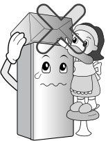

请勿倚靠或悬挂在冰箱门体及搁架上。可能损坏冰箱门体或搁架，或导致冰箱倾倒，造成受伤及损坏。儿童靠近冰箱时请务必有人看管。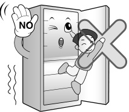

防止儿童进入产品内部。儿童进入冰箱可能危及生命。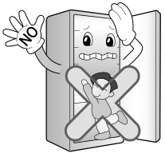

开关冰箱门时请小心。用力开关门可能导致内部物品倾倒，造成受伤或损坏。

请勿将冰箱安装在潮湿环境中。湿气可能渗入电气部件，引发火灾或触电。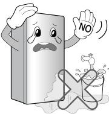

请勿在冰箱内或周围存放或使用易燃物品。可能引发爆炸或火灾。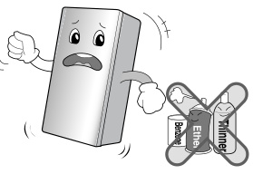

请勿在冰箱内使用或放置加热、明火类香氛产品（如香薰蜡烛、香炉）除臭。可能引发爆炸或火灾。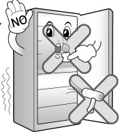

请勿在冰箱冰柜内存放药品或学术实验用品。存放有严格温度限制的物品（如药品）可能导致其变质或发生不良反应，带来危害或风险。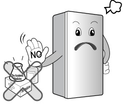

请勿在冰箱冰柜附近使用易燃喷雾。可能引发爆炸或火灾。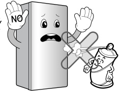

远离加热设备。安装位置远离明火，如壁炉、加热器，避免靠近燃气相关产品。可能引发爆炸或火灾。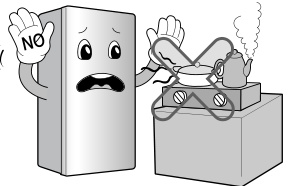

请勿在冰箱冰柜上放置花瓶、水杯、化妆品、药品或任何盛水容器。可能掉落、泄漏，导致触电或火灾。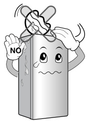

遇强雷雨天气或设备长期不使用时，可能出现电气损坏，导致触电或火灾。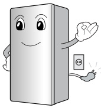

被水浸泡损坏的设备，在经持证电工或同等资质人员确认安全前，请勿使用。可能引发触电或火灾。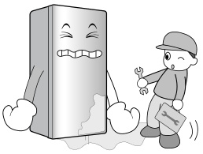

发生燃气泄漏时，请勿触碰冰箱冰柜或插座，立即开窗通风。火花引发的爆炸可能导致火灾或烧伤。本冰箱冰柜采用环保制冷剂天然气（异丁烷，R600a），即使少量（80~90克）也具有可燃性。运输、安装或使用过程中因严重损坏导致制冷剂泄漏时，任何火花都可能引发火灾或烧伤。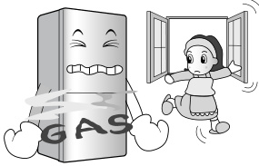

请勿向冰箱内外直接喷水。请勿在冰箱上使用酒精或矿物类清洁剂（如苯、稀释剂）。这些物质可能腐蚀或渗入绝缘层及电气部件，导致触电、火灾或冰箱损坏。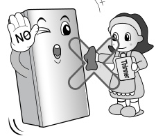

发现冰箱冰柜有异味或冒烟时，立即拔下电源插头并联系售后服务中心。继续使用可能导致损坏或火灾。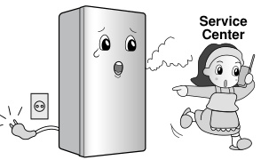

除专业工程师外，任何人不得拆卸、维修或改装冰箱冰柜。可能导致受伤、触电或火灾。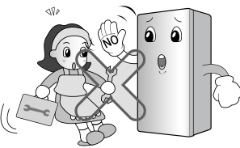

请勿将冰箱冰柜用于非家用用途（存放药品、实验材料或移动使用）。可能引发火灾、触电、存放物品变质或化学反应等意外风险。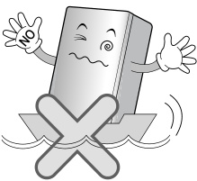

废弃处理冰箱冰柜时，请拆下冰箱门。否则可能导致儿童被困在内。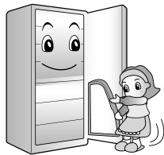

将冰箱冰柜安装在坚固平整的地面上。安装在不稳定位置，开关门时冰箱可能倾倒，导致伤亡。本冰箱冰柜使用前必须按照安装说明正确安装与放置；安装本冰箱冰柜前请参阅安装手册。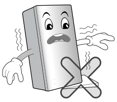

请勿将手或金属物品伸入冰箱冷气出口、盖板、底部及背部隔热格栅（排气孔）。可能引发触电或受伤。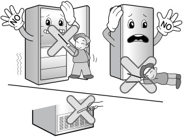

请勿用湿手触碰冷冻室内的食物或容器。可能导致冻伤。冰箱冰柜运行后，请勿触摸冷冻室低温表面，尤其是手部潮湿时，皮肤可能粘连在极冷表面。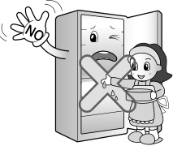

确保所有食物及容器稳定存放或堆叠。开关冰箱门时食物可能掉落伤人。请勿将装满液体的瓶子放入冷冻室，液体结冰可能导致瓶子破裂，造成受伤。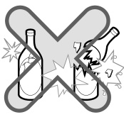

请勿将手伸入冰箱冰柜底部。底部铁板可能造成受伤。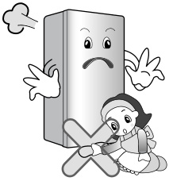

搬运冰箱冰柜时，请握住前底部及后顶部把手。否则可能手滑导致受伤或产品损坏。因产品较重，单独搬运可能伤人或发生意外。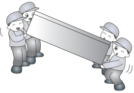

开关冰箱冰柜门可能伤及周围人员，请注意。同时打开两扇门可能导致手指或手部被门缝挤压。打开的门体边角可能碰伤儿童（尤其是冷冻室门下边缘易被忽视）。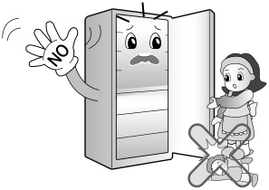

请勿将任何活物放入冰箱冰柜。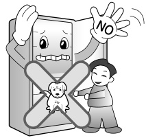

其他安全与处置提示：保持电器外壳或嵌入式结构内的通风口畅通无阻；除制造商推荐外，请勿使用机械设备或其他方式加速化霜过程，请勿损坏制冷剂回路。为避免制冷回路泄漏形成可燃气体混合物，电器安装房间面积需根据制冷剂量确定（每 8 克 R600a 制冷剂，房间面积至少 1 平方米）。若电器长期不使用，请拔下电源插头，绝缘层老化可能引发火灾。废弃处理时，本电器使用的制冷剂及绝缘发泡气体需要特殊处理，请咨询售后服务人员或同等资质人员。

保持电器外壳或嵌入式结构内的通风口畅通无阻。除制造商推荐外，请勿使用机械设备或其他方式加速化霜过程。请勿损坏制冷剂回路。除非为制造商推荐类型，否则请勿在电器食品储藏室内使用电器。

# 部件标识与温度控制

## 部件标识与控制面板

### 部件图示、控制面板与温度功能操作

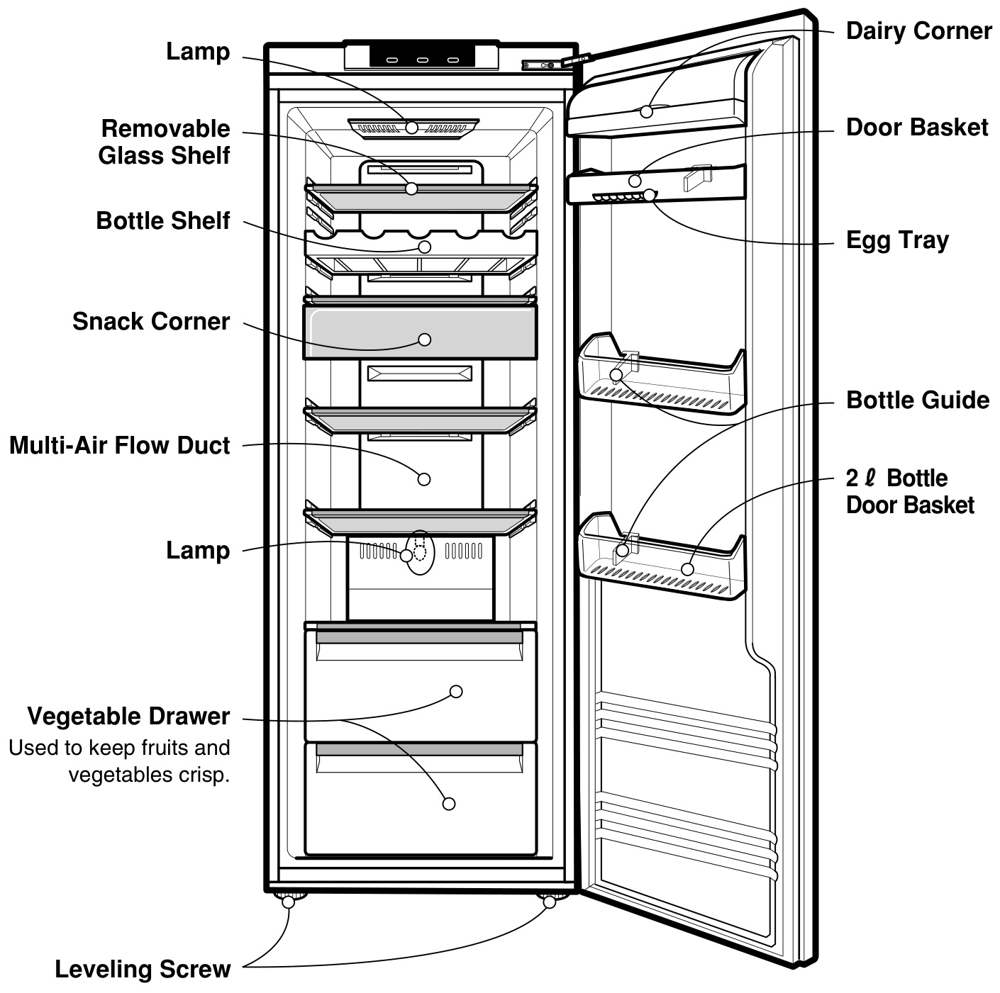

冰箱配有控制装置，可调节冷藏室温度。
温度及功能调节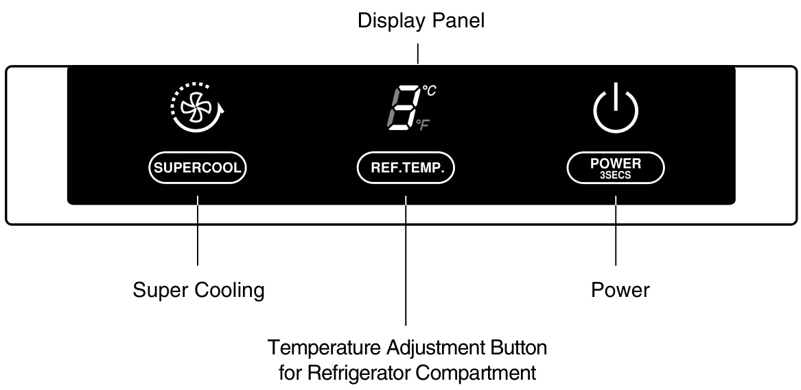

电源：长按按钮3秒以上可开启或关闭冰箱。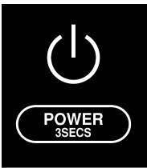

冷藏室温度调节方法：冷藏室初始温度分别为0℃和6℃。您可根据需要调节各间室温度。按下温度控制按钮，冷藏室温度每次调节1℃。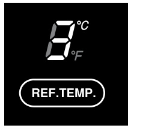实际内部温度随食物状态变化，设定温度为目标温度，非冰箱实际温度。初始运行时制冷效果较弱，请至少使用2~3天后再按上述方法调节温度。

超强制冷：需要快速制冷时请选择此功能。需快速冷却食物时使用。按下超强制冷按钮一次，快速制冷运行，指示灯点亮。超强制冷运行约2小时，运行结束后自动恢复原温度设定。如需提前停止快速制冷，再次按下超强制冷按钮，指示灯熄灭，超强制冷停止，冰箱恢复原温度设定。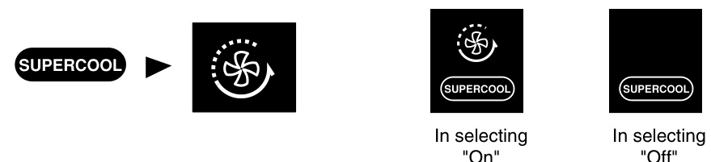

## 附加功能系统

### 自检、门体报警与除臭系统

自检功能：本功能可检查运行故障。若认为冰箱存在问题，按下温度控制按钮：

  - 若指示灯上下移动，说明冰箱无故障。
  - 若指示灯不移动，请保持通电并联系就近售后服务人员。

门体报警：冰箱门长时间打开时，报警器鸣响。

低温催化除臭系统（去除异味）功能特点：

1.  除臭装置在去除异味的同时不会损害存放的食物。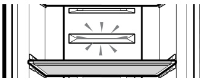
2.  建议异味较重的食物密封后再放入冰箱。尤其注意发酵食品等，异味可能扩散至其他食物。

# 食物正确存放方法

## 存放位置指南

### 冰箱搁架、瓶架及分类储物盒

冰箱搁架：餐具或食物间隔合理放置。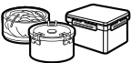
瓶架：存放高度275毫米及以下的饮料瓶或酒瓶。（玻璃容器易碎，请小心放置。）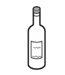

零食盒：存放饼干、面包等小食品。（请勿在此存放瓶子或罐子。）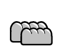
果蔬盒：存放蔬菜或水果。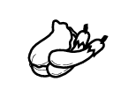

乳制品盒：存放黄油、奶酪等乳制品。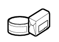
2升瓶架：存放2.0升瓶子或其他大型瓶子。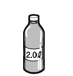

## 食物存放注意事项

### 食物类型与热食存放

  - 请勿存放低温下易变质的食物，如香蕉、甜瓜。
  - 热食需冷却后再存放。热食放入冰箱可能导致其他食物变质，并增加耗电量。

### 容器密封、通风与开门频率

  - 存放食物时请使用带盖容器，防止水分蒸发，保持食物口感与营养。
  - 请勿用食物堵塞通风口。冷空气顺畅循环可保持冰箱温度均匀。
  - 请勿频繁开门。开门会使热空气进入冰箱，导致温度升高。

### 门搁架、解冻食物与温敏物品

  - 切勿在门搁架上放置过多食物，以免门体无法完全关闭。
  - 解冻后的食物请勿再次冷冻，会导致口感与营养流失。
  - 请勿在冰箱内存放药品、科研材料或其他温度敏感物品。有严格温度控制要求的物品不得存放于本冰箱。

### 快速冷却与凝露处理

  - 如需快速冷却新放入的食物，将其放置在冷藏室中层抽屉，然后按下超强制冷按钮。
  - 若冰箱放置在高温潮湿环境、频繁开门或放入大量蔬菜，可能产生凝露，不影响性能。用无绒布擦拭即可。

# 维护与清洁

## 通用信息

### 停电、搬运与防凝露说明

停电处理：停电1~2小时对存放食物无影响。尽量避免频繁开关门。

搬运时：取出冰箱内食物，用胶带固定松动的搁架、抽屉及配件。请勿滑动搬运冰箱。

防凝露管：冰箱前部及冷藏室隔板周围装有防凝露管，防止凝露产生。尤其安装后或环境温度较高时，冰箱表面可能发热，属于正常现象。

### 门体换向说明

门体换向：本冰箱设计为可换向门体，可根据厨房布局选择左开或右开。注意：如需换向门体，必须联系售后服务人员。门体换向不在保修范围内。

## 各部件拆卸方法

### 拆卸前要求与内部灯更换

仅当门体打开90°或更大角度时方可拆卸。拆卸顺序与安装相反。

内部灯：拆卸前请拔下电源插头或关闭总电源。

  - 手指伸入顶盖内侧卡槽，向外拉出取下。
  - 按压中盖上方向外拉出取下。
  - 逆时针旋转内部灯即可拆卸。
    冰箱内部灯请使用240V 30W灯泡。内部灯为消耗品，不亮时请从本品牌电子服务中心购买后自行更换使用。务必检查橡胶材质的O型圈。灯泡长时间点亮后请勿触碰，温度极高。灯泡功率最大30W。门体长时间打开时，内部灯点亮7分钟后会自动熄灭以保障安全。（重新开门灯亮。）

### 搁架、瓶架与抽屉类部件拆卸

冷藏室/瓶架：轻轻向外拉出，再微微抬起，向前拉出即可取下搁架。

零食盒：向外拉出，再微微抬起拉出即可取下。

果蔬盒：向外拉出，再微微抬起，按图示取下果蔬盒。取下果蔬盒后，微微抬起向前拉出即可取下果蔬盒盖板。

乳制品盒：握住乳制品盒两侧，抬起拉出即可取下。

冰箱篮筐：握住冰箱篮筐两侧，抬起拉出即可取下。

### 除臭装置拆卸与重复使用

除臭装置：

  - 将一字螺丝刀插入除臭装置盖板顶部，拉出盖板取下。
  - 取下盖板后，拉出除臭装置即可。
  - 除臭装置可使用吹风机吹干或日晒去除吸附异味后重复使用。
    注意：请勿将螺丝刀伸入冷气出风口。

## 清洁

### 清洁前后检查与内外部清洁

清洁前：务必拔下电源插头或关闭家中总开关。用水清洗后务必用布擦干电器。请勿使用研磨剂、汽油、苯、稀释剂、盐酸、沸水、硬毛刷等，以免损坏冰箱部件。

外部清洁：用温热湿布擦拭冰箱外部，可使用或不使用清洁剂。若使用清洁剂，务必用干净湿布擦净。

内部清洁：清洁方法同上。

清洁后：检查电源线无损坏、电源插头无过热、插头牢固插入插座。

# 故障排查与废弃处理

## 故障排查

### 维修前检查与电源运行问题

联系维修前请查阅本清单，可节省时间与费用。本清单包含常见问题，非电器制造或材料缺陷导致。

冰箱不运行：

  - 电源插头可能未插紧。重新牢固插入。
  - 家中保险丝熔断或断路器跳闸。检查并/或更换保险丝，复位断路器。
  - 停电。检查家中其他电器是否运行。

### 冷藏室温度过高

冷藏室温度过高：

  - 温度控制未设置在合适位置。参阅温度控制章节。
  - 电器靠近热源。
  - 天气炎热—开门频繁。
  - 门体长时间打开。
  - 包装卡住门体或堵塞冷藏室风道。

### 震动、异响与冷冻结霜

震动或异响：

  - 冰箱安装地面不平或放置不稳。通过调节底脚调平冰箱。
  - 物品掉落或存放在冰箱后方。

冷冻食物结霜或冰晶：

  - 门体未关严或包装卡住门体。
  - 开门过于频繁或时间过长。
  - 包装内结霜属正常现象。

### 箱体湿气、内部积水与异味

箱体表面产生湿气：

  - 安装环境湿度大或潮湿时易出现此现象。用干毛巾擦拭即可。

冰箱内部积水、有异味：

  - 开门过于频繁或时间过长。
  - 潮湿天气下，开门时空气中湿气进入冰箱。
  - 异味较重的食物应密封存放。
  - 检查是否有变质食物。
  - 内部需要清洁。参阅清洁章节。

### 门体关闭异常与内部灯故障

门体无法正常关闭：

  - 食物包装卡住门体。移动阻碍门体关闭的包装。
  - 冰箱未调平。调节调平螺丝。
  - 冰箱安装地面不平或放置不稳。调节底脚，使冰箱略微向后倾斜。

内部灯不亮：

  - 插座无电。
  - 灯泡需要更换。参阅灯泡更换章节。

## 旧电器废弃处理

### 旧电器回收标识与分类处理

1.  产品带有带叉垃圾桶符号时，表示产品符合欧盟2002/96/EC指令。
2.  所有电气电子产品应与市政垃圾分开，通过政府或当地指定回收设施处理。本电器使用的制冷剂及绝缘发泡气体需要特殊处理。废弃处理时请咨询售后服务人员或同等资质人员。冰箱冰柜使用的制冷剂及绝缘材料气体需要特殊处理。废弃前确保电器背部管道无损坏。

### 环境健康影响与咨询渠道

3.  正确处理旧电器有助于避免对环境和人体健康造成潜在负面影响。
4.  如需了解旧电器废弃处理的详细信息，请联系当地市政部门、垃圾处理部门或购买产品的商店。
