# 发电机手册

# 简介与保修

## 识别码与标识

恭喜您选购全新发电机。本手册将帮助您充分了解本机的操作与维护方法。如对机器的操作或维护有任何疑问，请咨询发电机经销商。

产品识别码 AE00012
请在指定位置记录您的产品识别码和序列号，以便向发电机经销商订购零配件。同时请将这些识别码另行妥善保管，以防机器被盗。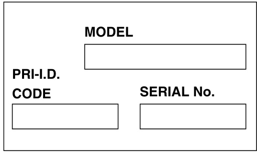 AE00011

机器序列号标注在图示位置。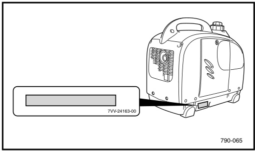
注意：这些编号的前三位为机型标识，其余数字为产品生产编号。请妥善记录，以便向发电机经销商订购配件时参考。

使用机器前请务必完整阅读并理解本手册。注意：发电机厂商持续致力于产品设计与品质的改进。因此，尽管本手册包含印刷时最新的产品信息，但您的发动机与手册内容可能存在细微差异。如对本手册有任何疑问，请咨询发电机经销商。本手册应视为发动机的永久组成部分，转售时应随机器一并移交。

本手册中特别重要的信息通过以下标识区分：

  - 安全警示符号意为：注意！提高警惕！事关您的人身安全！
  - 不遵守警告说明可能导致发动机操作人员、旁观者或检修人员重伤甚至死亡。
  - 注意标识提示必须采取特别预防措施，以免损坏发动机。
  - 注：注释提供关键信息，使操作步骤更简便清晰。

## 发电机EF系列及EDL系列有限保修条款

发电机公司保证，在美国本土授权经销商处购买的全新民用发电机，在规定期限内材料与工艺无缺陷，具体以本条款所列限制为准。

**保修期限：**
凡从美国本土授权经销商处购买、用于私人非商业用途的全新EF系列或EDL系列发电机，自购买之日起享受**2年**材料与工艺缺陷保修服务，具体以本条款除外责任为准。用于商业或租赁用途的非商用发电机，自购买之日起享受**180天**保修服务，具体以本条款除外责任为准。

**保修期内服务：**
任何授权发电机经销商将根据厂商判断，免费维修或更换因原厂材料或工艺缺陷而判定为故障的零部件，具体由发电机厂商决定。保修维修所用零部件在原产品剩余保修期内继续享受保修。所有保修更换的零部件归美国发电机汽车公司所有。

**一般除外责任：**
以下原因导致的故障不在保修范围内：
a. 安装与原厂发电机配件质量不相当的零部件或附件。
b. 异常负荷、疏忽或不当使用。
c. 未按规定进行保养维护。
d. 意外事故或碰撞损坏。

**特定除外责任：**
因正常磨损或日常保养更换的零部件不在保修范围内。

**用户责任：**
在本保修条款下，用户应：

1.  按照相应用户手册规定操作和保养发电机；
2.  发现任何明显缺陷后**10天内**通知授权发电机经销商，并及时将设备送至经销商处供检查和维修。

**保修转让：**
如需将保修从原购买者转让给后续购买者，必须由授权发电机经销商对设备进行检查并完成保修登记。为使保修继续有效，上述检查和登记必须在转让后**10天内**完成。此项服务将收取检查登记费。在任何情况下，保修期均不得超过原定期限。

美国发电机汽车公司不提供任何其他明示或暗示的保证。凡超出本保修条款规定义务与期限的、有关适销性及特定用途适用性的暗示保证，美国发电机汽车公司特此声明不承担责任并予以排除。部分州不允许对暗示保修的期限进行限制，因此上述限制可能不适用于您。本保修同样不包括任何附带或间接损失，包括使用损失。部分州不允许排除或限制附带或间接损失，因此上述排除条款可能不适用于您。本保修赋予您特定的法定权利，您可能还拥有因州而异的其他权利。

**保修问答**

  - 问：保修期内我需要承担哪些费用？
    答：用户需承担所有日常保养费用、非保修维修费用、事故损坏费用，以及机油、火花塞等耗材费用。
  - 问：“异常”负荷、疏忽或不当使用有哪些示例？
    答：这些术语含义广泛且存在交叉，具体示例包括：发动机缺油运行、未按规定保养、使用已损坏部件导致其他部件损坏等。如对操作或保养有具体疑问，请联系经销商咨询。
  - 问：保修是否涵盖因故障产生的运输等附带费用？
    答：不涵盖。保修仅限于机器本身的维修。
  - 问：我是否可以自行完成用户手册中推荐的全部或部分保养项目，而非交由经销商处理？
    答：可以，若您是合格的维修人员并严格按照用户手册及维修手册步骤操作。但我们建议，需要专用工具或设备的保养项目交由发电机经销商处理。
  - 问：如果未完全按照用户手册操作或保养新发电机，保修是否会失效或被取消？
    答：不会。新发电机的保修不会被“作废”或“取消”。但是，若因未按手册操作或保养导致特定故障，则该故障可能不在保修范围内。
  - 问：我的经销商在保修范围内承担哪些责任？
    答：每位发电机经销商应：1. 销售前检查发电机运行状况。2. 销售时向您详细讲解操作、保养及保修要求，后续您提出要求时也应提供说明。此外，每位发电机经销商对其安装、服务及保修维修工作负责。
  - 问：保修是否可以转让给二手买家？
    答：可以。可申请转让剩余保修期。设备必须经授权发电机经销商检查并重新登记，保修方可继续有效。

## 重要标签位置

AE00062 重要标签位置：使用机器前请仔细阅读以下标签。注：请根据需要维护或更换安全及说明标签。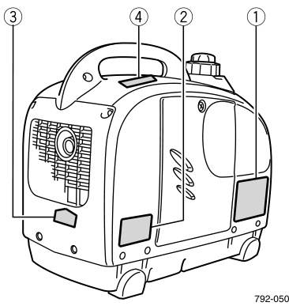 ① 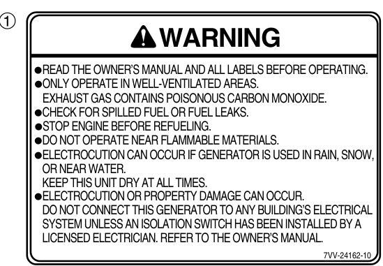 ② 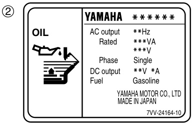 ③⑤ 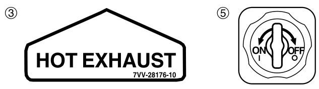 ④ 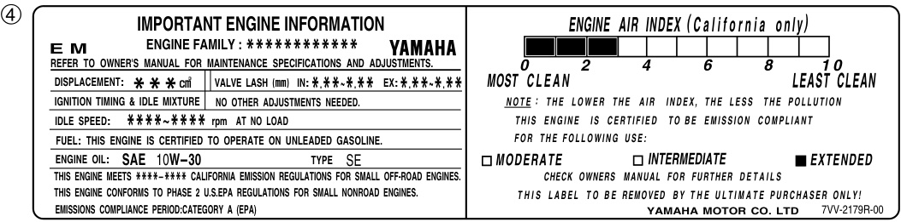 ⑤ 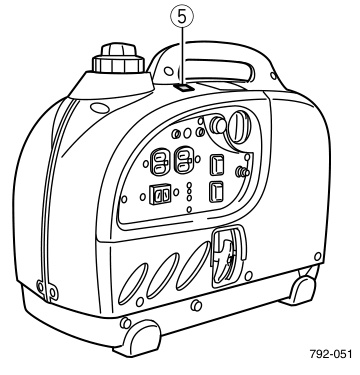 AE00071

# 安全信息

## 废气与燃油安全

### 废气有毒

切勿在密闭空间内启动发动机，否则可能在短时间内导致昏迷甚至死亡。请在通风良好的场所使用。 AE01018

### 燃油高度易燃且有毒

加油时务必关闭发动机。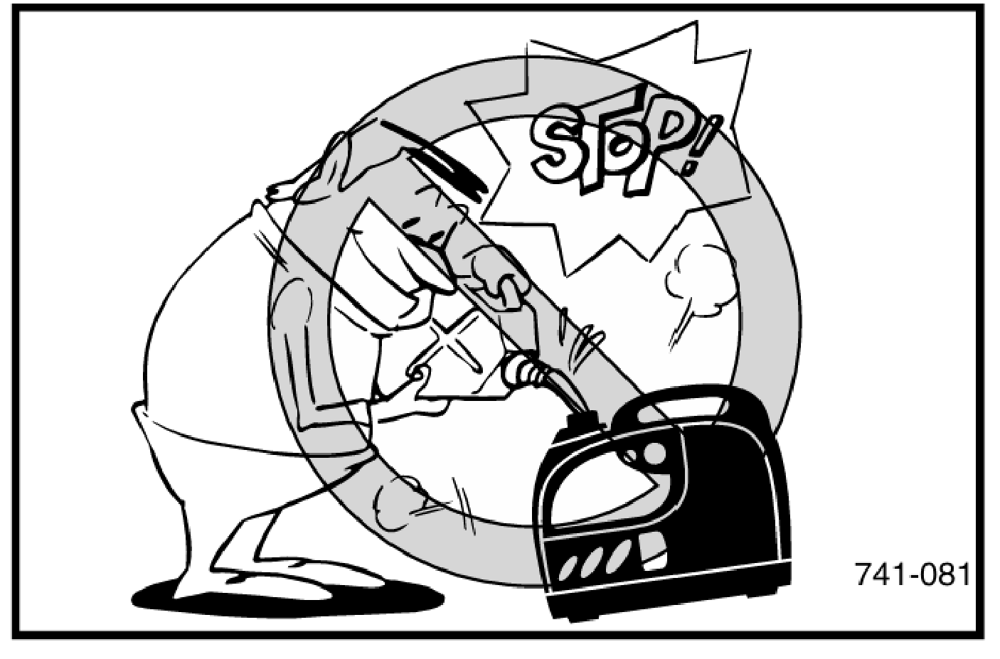
加油时严禁吸烟或靠近明火。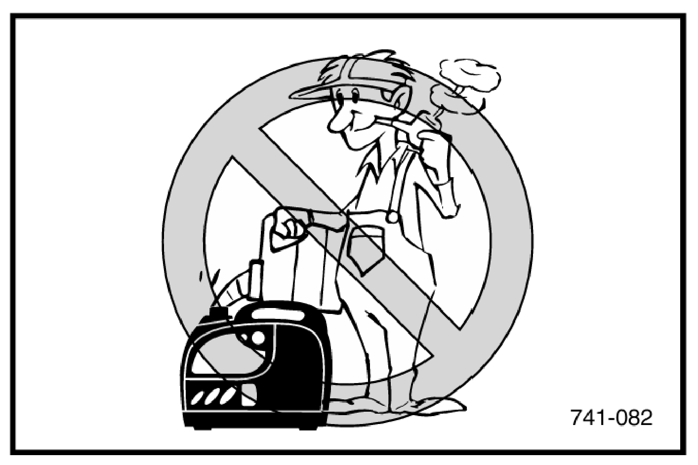
加油时注意不要将燃油洒在发动机或消音器上。如不慎吞入燃油、吸入燃油蒸汽或燃油入眼，请立即就医。如燃油溅到皮肤或衣物上，请立即用肥皂水清洗并更换衣物。
操作或运输发电机时，请务必保持机身直立。如发生倾斜，燃油可能从化油器或油箱泄漏。运输发电机时，请务必拧紧油箱盖通气旋钮。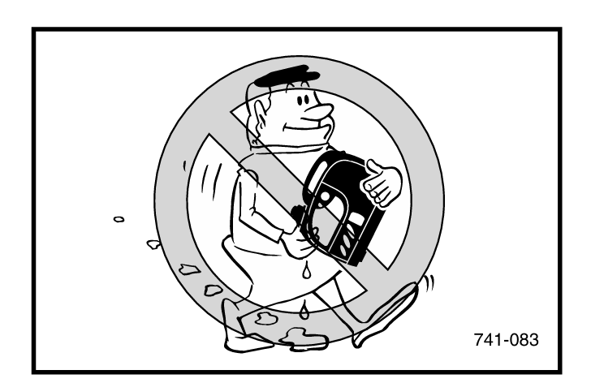 AE01019

## 防火与高温防范

**发动机及消音器可能高温发烫**
请将发电机放置在行人或儿童不易触碰的地方。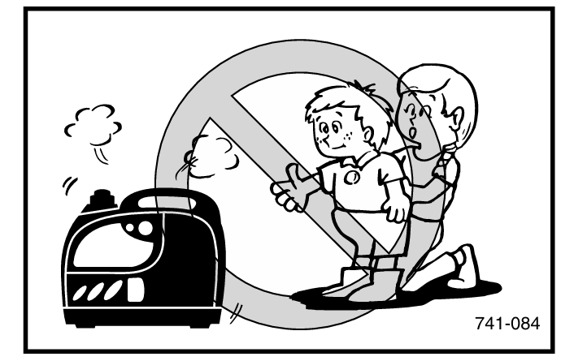
运行时避免在排气口附近放置任何易燃物品。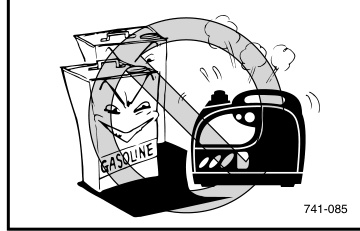
请将发电机与建筑物或其他设备保持至少1米（3英尺）距离，否则发动机可能过热。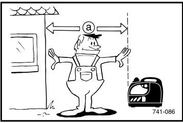
避免在防尘罩覆盖下运行发动机。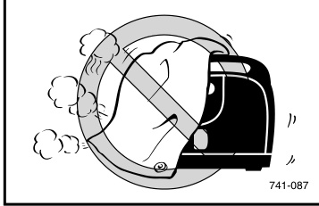
务必仅通过提手搬运发电机。① 提手 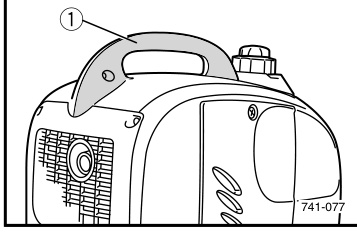 AE01020

## 用电与接线安全

**防止触电**
切勿在雨雪中运行发动机。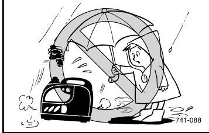
切勿湿手触碰发电机，否则会触电。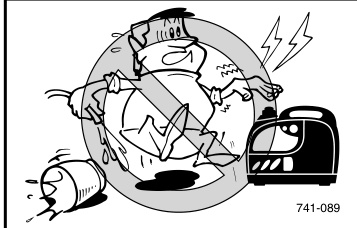
务必对发电机进行接地。注：使用足够载流量的接地导线。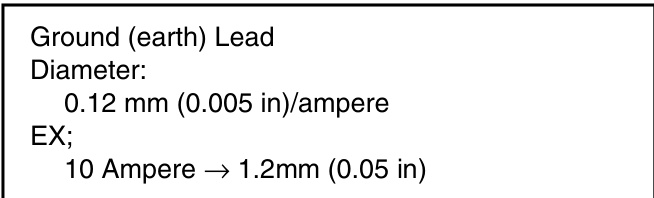 ① 导线直径 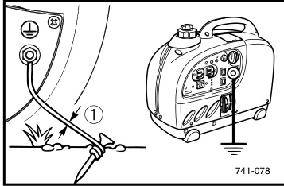 AE00088

**接线注意事项**
避免将发电机接入市电插座。避免将发电机与其他发电机并联使用。① 正确 ② 错误 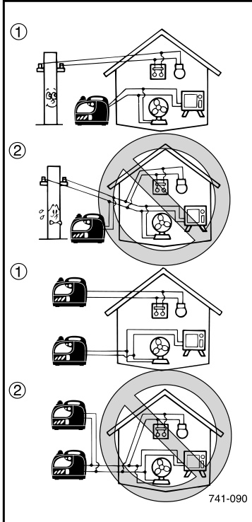

**AE00091 接线说明**
发电机接入建筑物电气系统前，必须由持证电工在建筑物主配电箱内安装隔离（转换）开关。该开关为发电机电源的接入点，可选择使用发电机电源或市电电源为建筑物供电。这可防止市电故障或断电检修时发电机向市电线路反送电。反送电可能导致线路维修人员触电或受伤。若未安装隔离开关，恢复正常供电时还可能损坏发电机及建筑物电气系统。

**AE00086 延长线使用说明**
使用延长线时，截面积1.5平方毫米的总长不得超过60米，截面积2.5平方毫米的总长不得超过100米。延长线应采用坚固柔韧的橡胶护套（符合IEC 245标准）或同等材质，以承受机械应力。

# 机器部件与控制面板

## 部件图解

部件说明：油箱、油箱盖、油箱盖通气旋钮、燃油开关旋钮、空气滤清器盖、火花塞、消音器、阻风门旋钮、接地端子、机油加注口盖、反冲启动器、提手。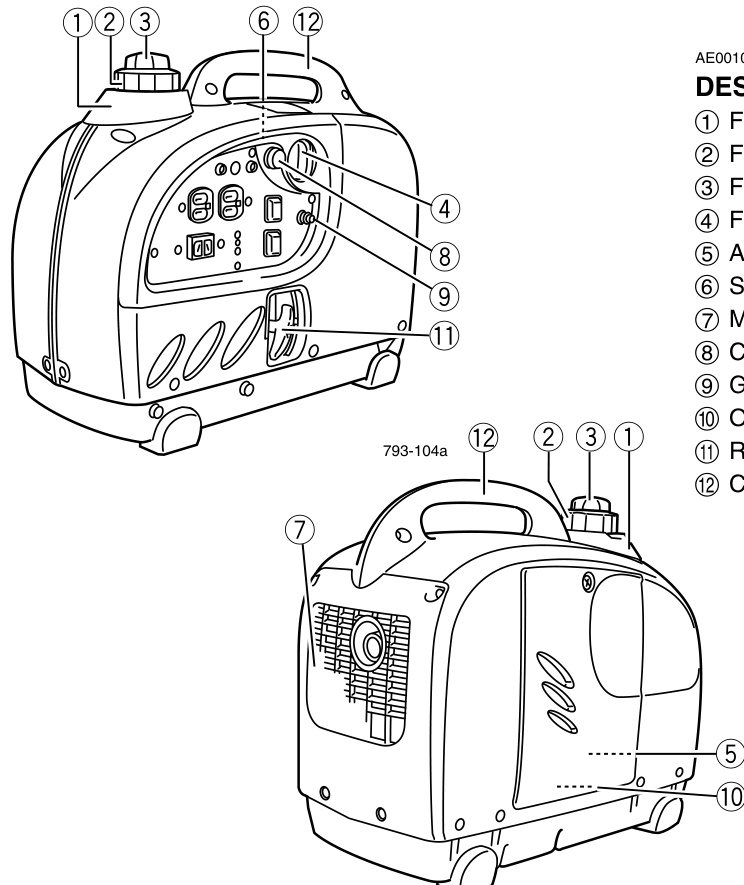 AE00103

控制面板：① 过载指示灯 ② 交流指示灯 ③ 机油警告灯 ④ 发动机开关 ⑤ 阻风门旋钮 ⑥ 燃油开关旋钮 ⑦ 接地端子 ⑧ 直流保护器 ⑨ 经济控制开关 ⑩ 交流插座 ⑪ 直流插座。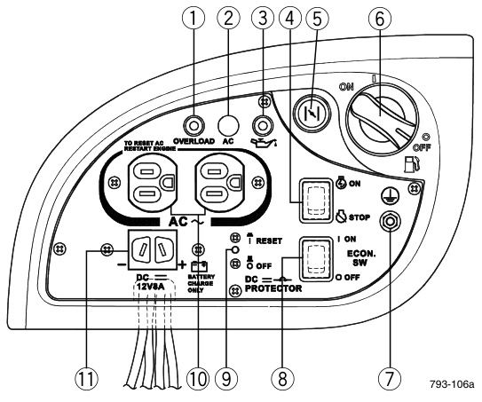 AE00111

## 开关与指示灯系统

**机油警告系统**
当机油液位低于下限，发动机将自动停机。不补充机油则无法再次启动。注：若发动机熄火或无法启动，将发动机开关置于“开启”位置，然后拉动反冲启动器。若机油警告灯闪烁数秒，表示发动机机油不足。添加机油后重新启动。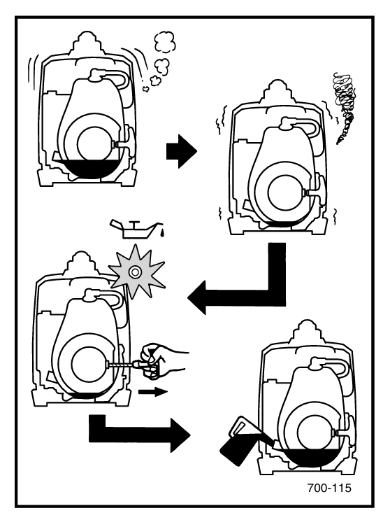 AE00939

**发动机开关**
发动机开关控制点火系统。① ON “开启”：点火电路接通，可启动发动机。— STOP “停止”：点火电路切断，发动机停机。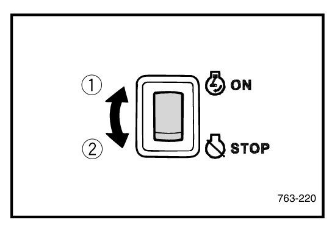 AE00988

**经济控制开关**
① Ⅰ “开启”：经济控制开关置于Ⅰ档时，经济控制单元根据外接负载调节发动机转速，可降低油耗、减少噪音。— ○ “关闭”：经济控制开关置于○档时，无论是否连接负载，发动机均以额定转速5000转/分钟运行。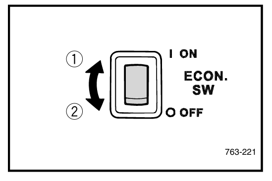
注：使用压缩机、潜水泵等启动电流较大的电气设备时，必须将经济控制开关置于○（关闭）位置。AE01099

**直流保护器**
当负载超过发电机额定输出时，直流保护器将自动断开。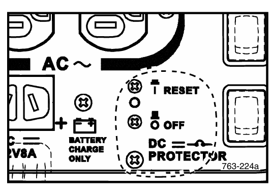
注意：若直流保护器断开，请将负载降至发电机额定输出范围内。若再次断开，请咨询发电机经销商。注：按下即可复位直流保护器。① “复位” — “断开” 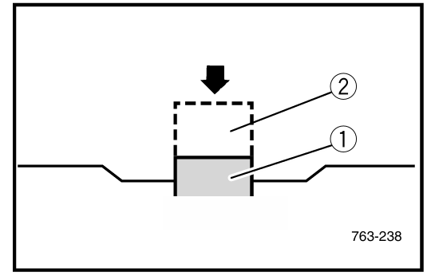 AE01021

**油箱盖通气旋钮**
油箱盖配备通气旋钮，用于切断燃油供给。通气旋钮需从拧紧位置逆时针旋转1圈，使燃油流向化油器，发动机方可运行。发动机不使用时，顺时针拧紧通气旋钮至手指拧紧状态，切断燃油供给。① 通气旋钮 — 油箱盖 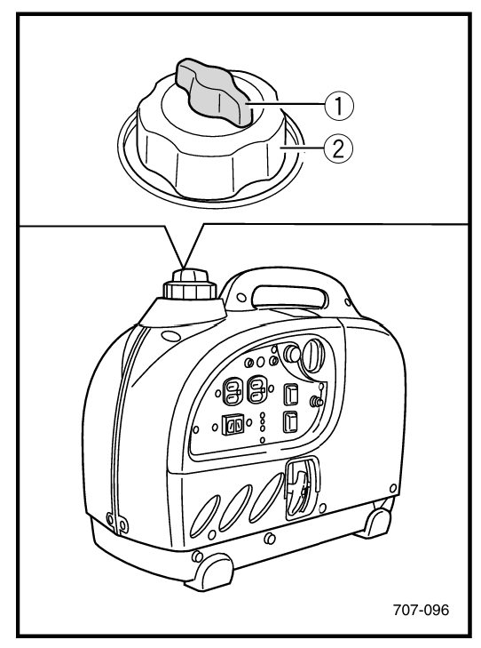 AE01034

**燃油开关旋钮**
燃油开关旋钮用于将燃油从油箱输送至化油器。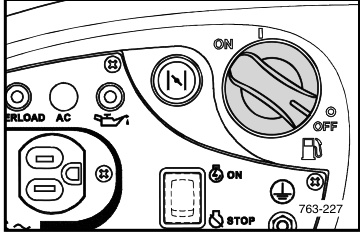 取下盖板①，内部可见燃油开关拨杆。若燃油开关旋钮无法转动，可使用该拨杆供油。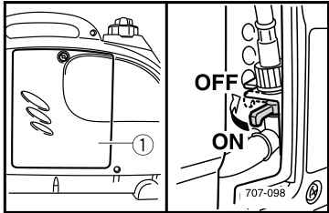

# 操作与使用

## 使用前检查

注：每次使用发电机前均应进行使用前检查。
警告：发动机运行后，发动机及消音器温度极高。检修或维修时，在其冷却前切勿用身体或衣物触碰。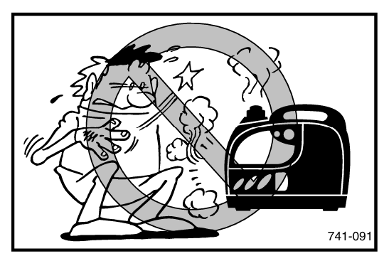

**燃油**
确认油箱内燃油充足。推荐燃油：无铅汽油 油箱容量：总计2.5升（0.55英制加仑，0.66美制加仑）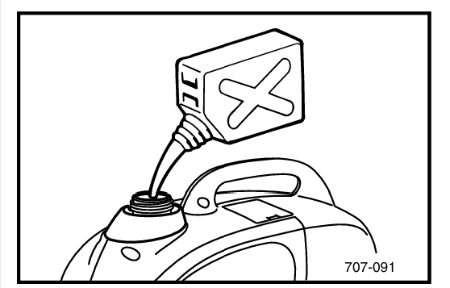
本发电机发动机设计使用泵法辛烷值((R+M)/2)86及以上或研究法辛烷值91及以上的普通无铅汽油。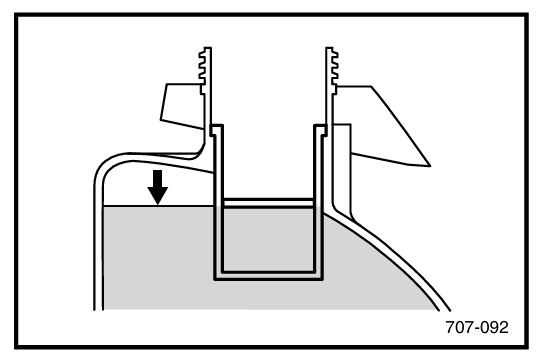
警告：燃油高度易燃且有毒。加油前请仔细阅读第4页“安全信息”。切勿加注至燃油滤清器顶部以上，否则燃油受热膨胀后可能溢出。立即擦拭溢出的燃油。加油后务必拧紧油箱盖。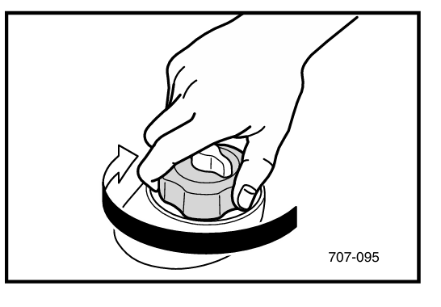 AE00222

**发动机机油**
确认发动机机油处于机油加注口上限位置，必要时添加。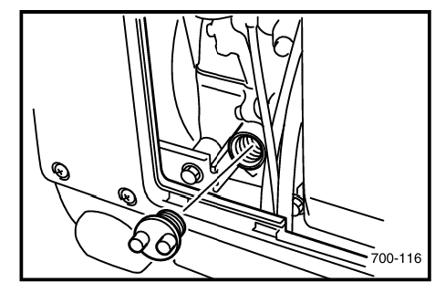 ① 上限 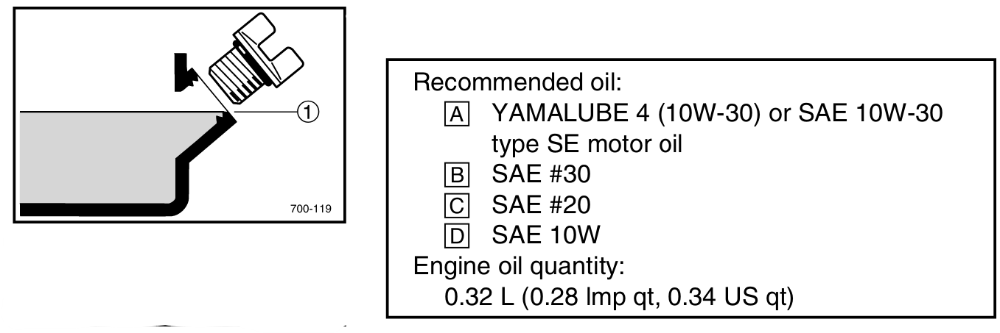
注：推荐发动机机油等级：API标准 SE级或SF级。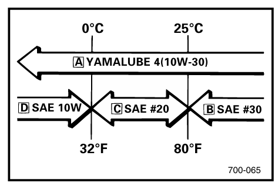
注意：发电机出厂时未加注发动机机油。必须加注机油，否则无法启动。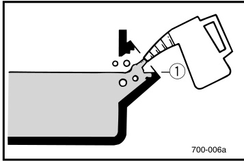 AE00241

**接地**
务必对发电机进行接地。详见第5页“安全信息”。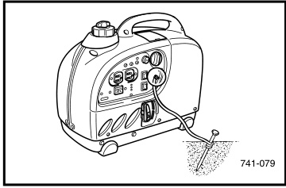 AE00955

## 启动发动机

注：发电机出厂时未加注发动机机油。必须加注机油，否则无法启动。① 上限 AE01022

启动发动机
注：启动发动机前，请勿连接任何电气设备。将经济控制开关置于○（关闭）位置。① ○ “关闭” 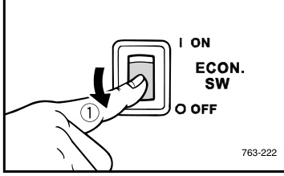

1.  按住油箱盖防止转动，将通气旋钮逆时针旋转1圈，打开油箱通气口。① 通气旋钮 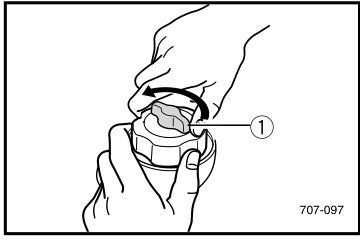
2.  将燃油开关旋钮置于“开启”位置。① “开启” 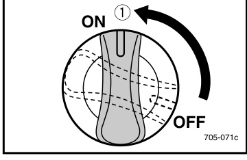
3.  将发动机开关置于“ON”（开启）位置。① ON “开启” 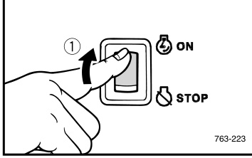
4.  将阻风门旋钮完全拉出。① 阻风门旋钮 注：热机启动无需使用阻风门，将阻风门旋钮推回原位即可。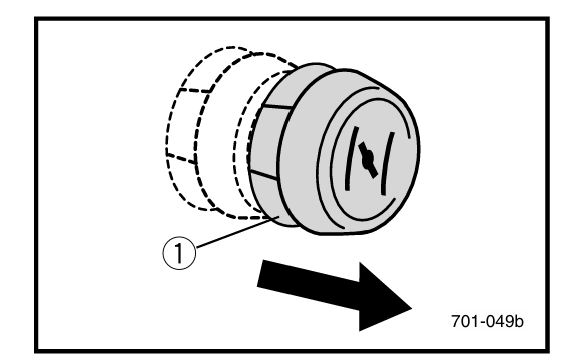
5.  缓慢拉动反冲启动器至啮合位置，然后快速拉动。注：拉动反冲启动器时，请牢牢握住提手，防止发电机倾倒。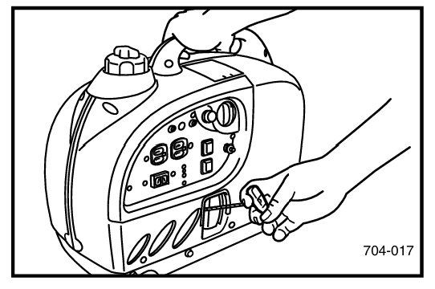
6.  发动机启动后，进行暖机，直至阻风门旋钮推回原位发动机也不会熄火。
7.  将阻风门旋钮推回原位。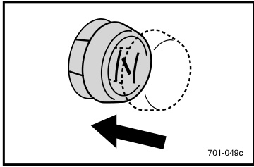
    注：在环境温度低于0℃（32℉）的地区启动发动机时，无论经济控制开关处于何种位置，发动机将自动以额定转速5000转/分钟运行3分钟进行暖机。暖机结束后，若将经济控制开关置于Ⅰ（开启）位置，经济控制单元将恢复正常工作。

## 交流电接线与使用

AE01000 适用范围 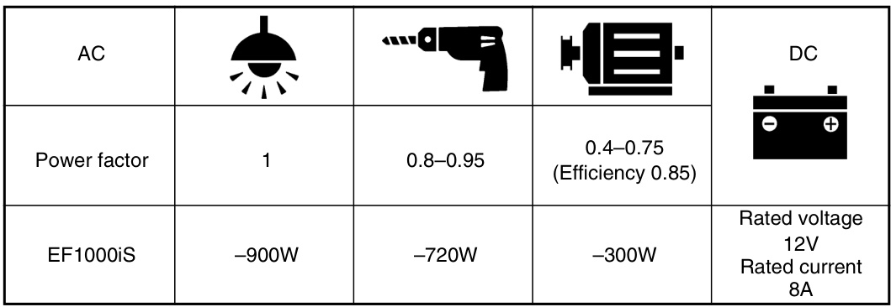
注：“—”表示低于。适用功率指各设备单独使用时的功率。可同时使用交流和直流电源，但总功率不得超过额定输出。
示例：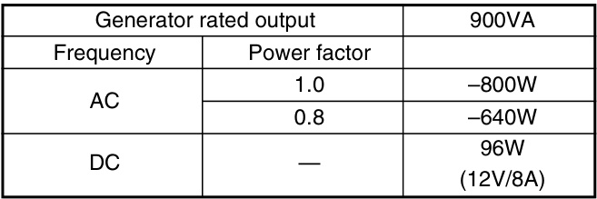
当总功率超出适用范围时，过载指示灯①亮起（详见第16页）。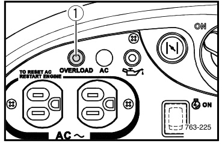

注意：务必确保总负载在发电机额定输出范围内，否则会损坏发电机。部分精密设备对电压敏感，可能需要比便携式发电机更稳定的电压供应，例如部分医疗设备、个人电脑及检测峰值电压和有效值电压的逆变器。使用便携式发电机为该类设备供电前，请咨询精密设备供应商。

AE01023 接线 交流电（AC）
注意：连接发电机前，务必确认所有电气设备（包括线路及插头连接）状态良好。插入插头前，务必关闭所有电气设备。务必确保总负载在发电机额定输出范围内。务必确保插座负载电流在插座额定电流范围内。

1.  将电源线在提手上缠绕2至3圈。
2.  启动发动机。
3.  插入交流插座。 
4.  确认交流指示灯亮起。① 交流指示灯 
5.  将经济控制开关置于“Ⅰ”（开启）位置，然后打开电气设备电源。① “Ⅰ”（开启） 
    注：使用压缩机、潜水泵等启动电流较大的电气设备时，必须将经济控制开关置于○（关闭）位置。

AE00953 过载指示灯
检测到外接电气设备过载、逆变器控制单元过热或交流输出电压升高时，过载指示灯①亮起，电子断路器启动，停止发电以保护发电机及外接电气设备。交流指示灯（绿色）熄灭，过载指示灯（红色）常亮，但发动机不会停机。
过载指示灯亮起且停止发电时，请按以下步骤操作：

1.  关闭所有外接电气设备并停机。
2.  将外接电气设备总功率降至适用范围内。
3.  检查冷却进气口及控制单元周围是否堵塞，如有堵塞请清除。
4.  检查完毕后重新启动发动机。
    注：停机后重新启动，发电机交流输出将自动复位。使用压缩机、潜水泵等启动电流较大的电气设备时，过载指示灯可能在启动初期亮起数秒，此非故障。

## 电池充电与停机

AE01100 电池充电
发电机直流额定电压为12V。

1.  将充电线在提手上缠绕2至3圈，插入直流插座。注：启动发动机后再连接电池。红线夹接电池正极(+)，黑线夹接电池负极(-)，切勿接反。① 红色 — 黑色
2.  启动发动机。
3.  按下直流保护器，安装电池。
    注意：充电时务必关闭经济控制开关。务必确保电池接线正确。务必确保通气软管连接正确，无损坏或堵塞。若直流保护器断开，请将负载降至发电机额定输出范围内。若再次断开，请咨询发电机经销商。注：按下即可复位直流保护器。① “复位” — “断开” 

注：电池充满电时，电解液比重在1.26至1.28之间。每小时检查一次比重。充电时严禁吸烟，严禁在电池处连接或断开线路，火花可能点燃电池产生的气体。电池电解液有毒且具有腐蚀性，会造成严重灼伤，内含硫酸。避免接触皮肤、眼睛或衣物。急救措施：皮肤接触——用水冲洗。误食——大量饮水或牛奶，随后服用氧化镁乳、蛋清或植物油，立即就医。眼睛接触——用水冲洗15分钟并立即就医。电池产生易爆气体，远离火花、明火、香烟等。在密闭空间充电或使用时请通风。操作电池时务必佩戴护目镜。请放置在儿童接触不到的地方。

AE01025 停机
注：关闭所有电气设备。将经济控制开关置于○（关闭）位置。 ① ○ “关闭”

1.  断开所有电气设备。
2.  将发动机开关置于“O”（停止）位置。① O “停止” 
3.  将燃油开关旋钮置于“关闭”位置。① “关闭” 
4.  顺时针拧紧油箱盖通气旋钮至手指拧紧状态。

# 保养与维护

## 定期保养表

AE00403 保养表
定期保养对确保最佳性能及安全运行至关重要。开始保养作业前请先停机。
*：建议由发电机经销商进行保养。**：与排放控制系统相关。
注意：更换时仅使用发电机指定原厂配件。详情请咨询授权发电机经销商。

## 火花塞检查与化油器调节

AE01026 火花塞检查
应定期拆卸并检查火花塞。

1.  取下盖板①。
2.  检查是否变色并清除积碳。
3.  检查火花塞型号及间隙。 ⊛ 间隙 
4.  安装火花塞。
5.  安装盖板。

AE00431 化油器调节
化油器是发动机的关键部件，建议由具备专业知识、专用数据及设备的发电机经销商进行正确调节。

## 发动机机油更换

AE01096 发动机机油更换

1.  将机器放置在水平面上，暖机数分钟，然后停机，将燃油开关旋钮置于“关闭”位置，顺时针拧紧油箱盖通气旋钮。
2.  取下盖板①。
3.  从发电机底部拆下放油接头①，打开机油加注口盖。
4.  将放油接头①安装到机油加注口。
5.  在发动机下方放置接油盘，倾斜发电机将机油完全排空。
6.  添加发动机机油至上限位置。① 上限 注：推荐发动机机油等级：API标准 SE级或SF级。 
7.  从机油加注口拆下放油接头。注意：确保无异物进入曲轴箱。
8.  安装机油加注口盖。
9.  将放油接头装回原位。
10. 安装盖板。

## 消音器与空气滤清器

AE01028 消音器滤网及火花熄灭器
警告：发动机运行后，发动机及消音器温度极高。检修或维修时，在其冷却前切勿用身体或衣物触碰。

1.  取下盖板①。
2.  拆下消音器滤网。② 消音器滤网 ③ 螺丝 
3.  用一字螺丝刀将火花熄灭器从消音器内撬出。
4.  取下火花熄灭器。④ 火花熄灭器 
5.  用钢丝刷清除消音器滤网及火花熄灭器上的积碳。注意：清洁时请轻柔使用钢丝刷，避免损坏或刮伤消音器滤网及火花熄灭器。
6.  检查消音器滤网及火花熄灭器，如有损坏请更换。
7.  安装火花熄灭器。注：将火花熄灭器凸起与消音器管孔对齐。① 凸起 — 孔 
8.  安装消音器滤网。
9.  安装盖板。

AE01029 空气滤清器

1.  取下盖板①。
2.  松开固定空气滤清器盖⊛的卡箍○。
3.  取下空气滤清器盖及滤芯④。
4.  用溶剂清洗滤芯并晾干。
5.  给滤芯上油并挤出多余机油，滤芯应湿润但不滴油。推荐机油：泡沫空气滤清器专用油或SAE 20号发动机油。注意：请勿拧绞滤芯，以免撕裂。
6.  将滤芯装入空气滤清器。注：确保滤芯密封面与空气滤清器贴合，无漏气。注意：发动机严禁无滤芯运行，否则会导致活塞及气缸过度磨损。警告：使用溶剂时严禁吸烟或靠近明火。
7.  将空气滤清器盖装回原位并安装卡箍。
8.  安装盖板。

AE00471 油箱滤网

1.  打开油箱盖，取出滤网。① 滤网 
2.  用溶剂清洁滤网，如有损坏请更换。
3.  擦拭干净后装回滤网。警告：务必拧紧油箱盖。

# 故障排除与规格参数

## 故障排除

AE01097 故障排除

**发动机无法启动**

1.  燃油系统：燃油未输送至燃烧室。
      - 油箱无油……添加燃油。
      - 油箱有油……油箱盖通气旋钮置于“开启”（逆时针旋转1圈）；燃油开关旋钮置于“开启”。
      - 燃油管路堵塞……清洁燃油管路。
      - 化油器堵塞……清洁化油器。
2.  发动机机油系统：机油不足
      - 机油液位低……添加发动机机油。

AE00785 **发电机不发电**

  - 安全装置（交流）处于“关闭”……停机后重新启动。
  - 安全装置（直流保护器）处于“关闭”……按下复位直流保护器。AE00515

## 存放

长期存放机器需采取预防措施，防止机器老化损坏。

AE01095 排空燃油

1.  打开油箱盖，使用市售手动虹吸管将油箱内燃油排入合格汽油容器，然后装回油箱盖。警告：燃油高度易燃且有毒。请仔细阅读第4页“安全信息”。立即擦拭溢出的燃油。
2.  取下盖板①，松开化油器浮子室放油螺丝—，排空化油器内燃油。
3.  将燃油开关旋钮置于“关闭”位置，启动发动机直至自行停机，燃烧完化油器内剩余燃油。

AE00621 发动机

1.  拆下火花塞，向火花塞孔内注入约一汤匙SAE 10W30或20W40发动机油，重新安装火花塞。关闭点火开关，拉动反冲启动器数次，使机油覆盖气缸壁。
2.  拉动反冲启动器至感觉有压缩力时停止，防止气缸及阀门生锈。
3.  清洁发电机外部并涂抹防锈剂。
4.  将发电机存放在干燥、通风良好的地方，并盖上防护罩。
5.  发电机存放、搬运及运行时必须保持直立。

## 技术参数与电路图

AE00789 废气排放控制系统及部件

  - 化油器总成、左、JT……………………CARB（化油器） 化油器
  - T.C.I.磁电机总成、火花塞…………EI（电子点火）
  - 曲轴箱1、气缸盖1……………………PCV（曲轴箱强制通风）
  - 空气滤清器总成…………………………ACL（空气滤清器）
  - 消音器、2、盖、网、钢丝2、火花熄灭器

上述项目及对应缩写符合美国环保署关于新型非道路火花点火非手持式发动机的法规，以及加利福尼亚州1995年及以后小型非道路发动机法规。缩写符合SAE推荐规程J1930《电气/电子系统诊断缩写、术语及定义》最新版本。建议由发电机经销商对这些项目进行保养。

AE00701 技术参数
AE00702 尺寸 
AE00704 发动机  *：额定运行状态下，在7米（23英尺）距离处测量。
AE00707 发电机 

AE00751 电路图

① 主线圈 ② 副线圈 ③ 直流线圈 ④ 直流整流器 ⑤ 控制单元 ⑥ 交流指示灯 ⑦ 交流插座 ⑧ 接地端子 ⑨ 经济控制开关 ⑩ 过载指示灯 ⑪ 直流保护器（断路器） ⑫ 直流插座 ⑬ 发动机开关 ⑭ 机油警告灯 ⑮ 限速器 ⑯ 油位表 ⑰ 点火线圈 ⑱ 火花塞 ⑲ TCI单元 ⑳ TCI磁电机 ㉑ 步进电机