# 水泵手册

用户手册
操作本机前请仔细阅读本手册。本产品发动机废气中含有加利福尼亚州已知可导致癌症、出生缺陷或其他生殖伤害的化学物质。本手册将为您提供本机操作与维护的基础说明。如对本机操作或维护有任何疑问，请咨询经销商。

## 重要手册信息

本手册中通过以下标识突出显示特别重要的信息。此为安全警示符号，用于提醒您存在潜在人身伤害危险。请遵守该符号后的所有安全提示，避免可能的伤害或死亡。
警告 表示若不避免，可能导致死亡或重伤的危险情况。
注意 表示必须采取的特殊预防措施，以免损坏本机或其他财产。
提示 提示提供关键信息，使操作步骤更简便清晰。
操作本机前请务必完整阅读并理解本手册。本手册应视为发动机的永久组成部分，转售时应随发动机一并移交。*产品及规格如有变更，恕不另行通知。

# 安全信息

## 废气与燃油警告

废气有毒：切勿在封闭区域内运行发动机，否则可能在短时间内导致昏迷甚至死亡。请在通风良好的区域操作。
燃油高度易燃且有毒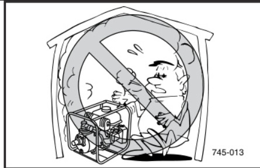：加油时务必关闭发动机。吸烟时或明火附近严禁加油。加油时注意不要将燃油洒在发动机或消音器上。如不慎吞入燃油、吸入燃油蒸气或溅入眼睛，请立即就医。如燃油溅到皮肤或衣物上，立即用肥皂水清洗并更换衣物。操作或运输机器时务必保持直立，倾斜可能导致燃油从化油器或油箱泄漏。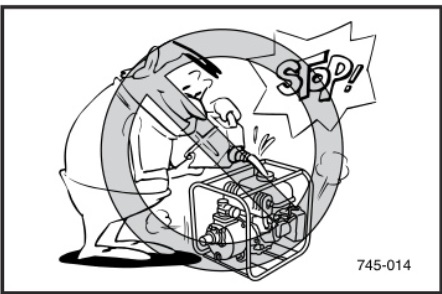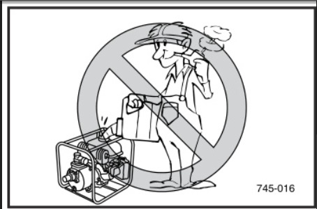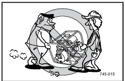

## 发动机及消音器警告

发动机及消音器可能发烫：请将机器放置在行人或儿童不易触碰的位置。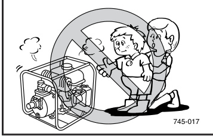运行期间请勿在排气口附近放置任何易燃物品。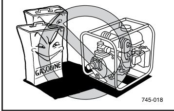机器与建筑物或其他设备至少保持1米（3英尺）距离，否则发动机可能过热。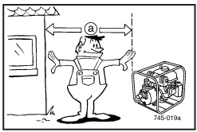请勿在装有防尘罩的状态下运行发动机。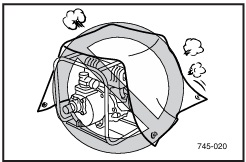

## 重要标签位置

操作本机前请仔细阅读以下标签。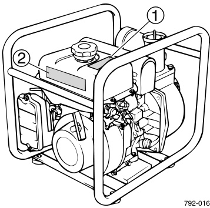
提示 请根据需要维护或更换安全及说明标签。

# 部件说明与控制功能

## 部件说明

油箱 油箱盖 燃油开关 空气滤清器盖 火花塞 消音器 阻风门手柄 发动机开关 机油加注口盖 放油螺塞 反冲启动器 机油警告灯 油门手柄 注水螺塞 放水螺塞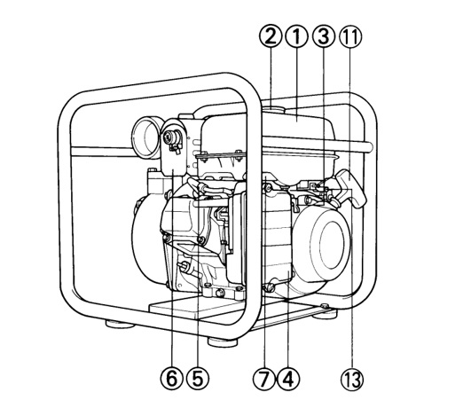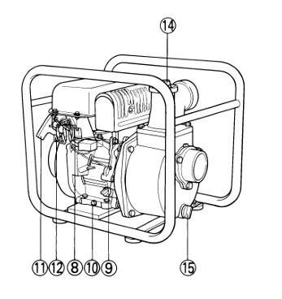

## 控制功能

水管安装：

1.  将接头安装在水泵上。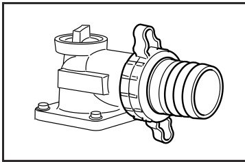
    注意 将接头安装到水泵时，务必确保垫片安装到位。
2.  用卡箍将软管连接到接头上。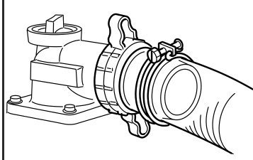
3.  在进水软管末端安装滤网。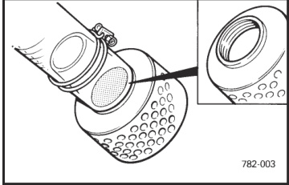
    注意 务必确保软管安装牢固，否则会进气导致无法抽水。务必安装滤网，否则会损坏水泵。请安装滤网：A）YP20G使用直径50毫米（2英寸）吸水口；B）YP30G使用直径80毫米（3英寸）吸水口，滤网孔径均不大于8毫米（0.31英寸）。

机油警告系统：当机油油位低于下限，发动机会自动停机。不补充机油则无法再次启动。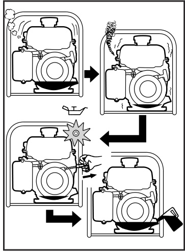
提示 若发动机熄火或无法启动，将发动机开关置于“ON”位置，然后拉动反冲启动器。若机油警告灯闪烁数秒，表示机油不足，添加机油后重新启动。

发动机开关：发动机开关控制点火系统。①“ON” 点火电路接通，可启动发动机。②“OFF” 点火电路切断，发动机停机。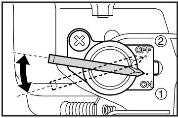

油门手柄：油门手柄控制发动机转速。向①方向移动降低转速，向②方向移动提高转速。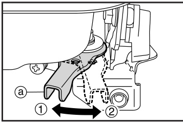
注意 启动发动机前务必检查油门操作是否正常。

# 操作前检查

提示 每次使用水泵前均应进行操作前检查。
警告 发动机运行后机体及消音器会非常烫。检修时请勿用身体或衣物触碰仍发烫的部位。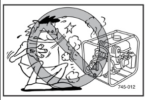

## 燃油与机油检查

燃油：确认油箱内燃油充足。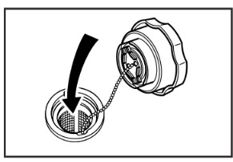推荐燃油：无铅汽油 油箱容量：总计4.5升（0.99英制加仑，1.19美制加仑）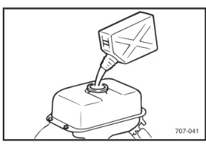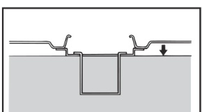
警告 燃油高度易燃且有毒，加油前请仔细阅读“安全信息”（见第1页）。加油请勿超过燃油滤网上沿，否则燃油受热膨胀后会溢出。立即擦拭溢出的燃油。加油后确保油箱盖拧紧。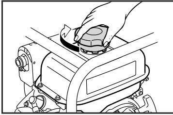

发动机机油：确认机油油位在上下限之间，必要时添加。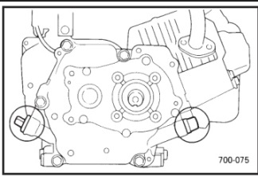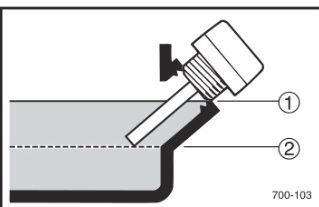将油位计插入加油口（无需旋入）。①上限 ②下限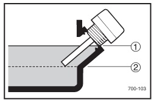推荐机油：A 雅马哈4冲程机油（10W-30）或SAE10W-30 SE级机油 B SAE#30 C SAE#20 机油量：0.6升（0.53英制夸脱，0.63美制夸脱）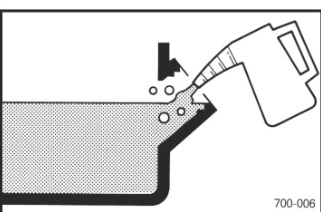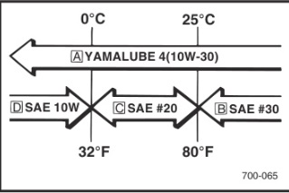
提示 推荐发动机机油等级：API服务等级“SE”或“SF”。
注意 水泵出厂时未加注发动机机油，必须加注机油方可启动。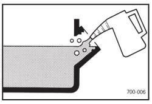

## 水泵注水

确认泵体内水位达到上限，必要时添加。①上限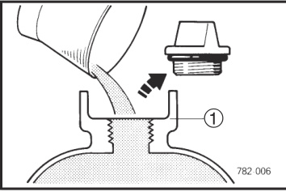
注意 启动发动机前务必向泵内注满水，否则会损坏机械密封。
提示 务必将水泵放置在稳固平面，并尽量靠近水源。吸程越高，注水时间越长，出水量越小。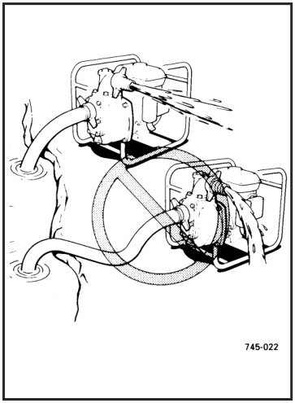

# 操作方法

提示 水泵出厂时未加注发动机机油，必须加注机油方可启动。①上限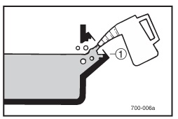

## 发动机启动

启动发动机前务必向泵内注满水。

1.  将燃油开关手柄置于“ON”位置。①“ON”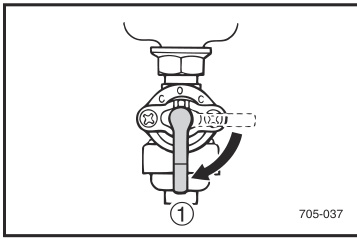
2.  将发动机开关置于“ON”位置。①“ON”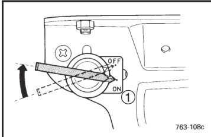
3.  将阻风门手柄置于关闭位置。①阻风门手柄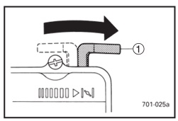
    提示 热机启动无需关闭阻风门，将阻风门手柄置于工作位置即可。
4.  将油门手柄稍向右推。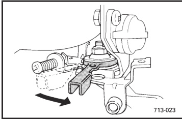
5.  缓慢拉动反冲启动器至感觉受力，然后快速拉动。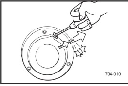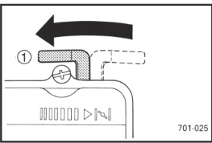
6.  发动机启动后预热，直至阻风门复位至工作位置也不会熄火。
7.  将阻风门手柄复位至工作位置。①工作位置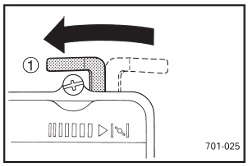
8.  将油门手柄调至所需位置。①降低发动机转速 ②提高发动机转速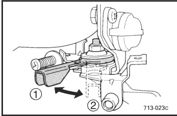

## 发动机停机与使用后处理

发动机停机：

1.  将油门手柄完全向左推。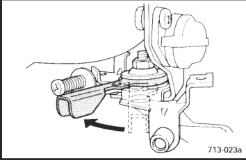
2.  将发动机开关置于“OFF”位置。①“OFF”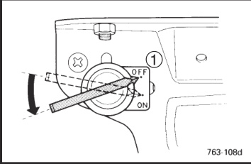
3.  将燃油开关手柄置于“OFF”位置。①“OFF”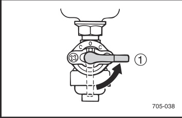

使用后排水：冬季气温低于0℃（32℉）时，泵体内积水会结冰，可能导致水泵损坏。使用后请从底部排水口排空积水再存放。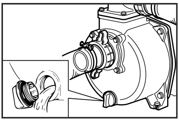

高海拔运行：海拔超过4000英尺（1219米）时，发动机可能需要安装高海拔化油器套件以保证正常运行。如长期在该海拔以上使用，请联系当地经销商进行化油器改装。海拔4000英尺（1219米）以下应使用原厂配置，否则可能损坏发动机。

# 定期保养

## 保养表与基础检查

保养表：定期保养对获得最佳性能和安全运行至关重要。
警告 开始保养前请先停止发动机。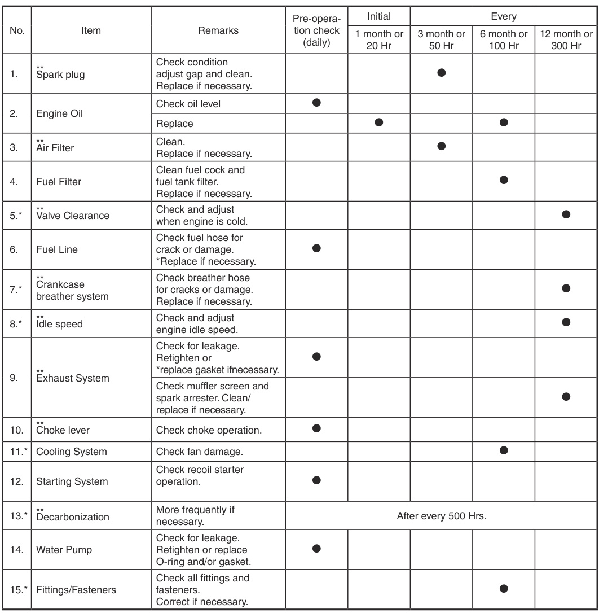
*：建议由经销商进行保养。**：与排放控制系统相关。
注意 仅使用指定正品配件更换，详情咨询授权经销商。

火花塞检查：应定期拆下并检查火花塞。

1.  检查是否变色并清除积碳。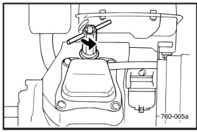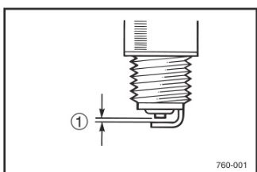
2.  检查火花塞型号及电极间隙。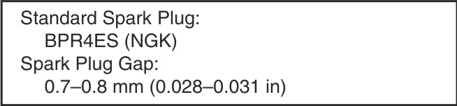①间隙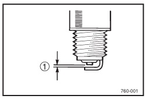
3.  安装火花塞。

化油器调整：化油器是发动机关键部件，调整工作应交由具备专业知识、数据和设备的经销商完成。
漏水检查：检查水泵是否漏水，重新拧紧螺栓、螺塞、卡箍及软管接头，必要时更换O形圈及/或垫片。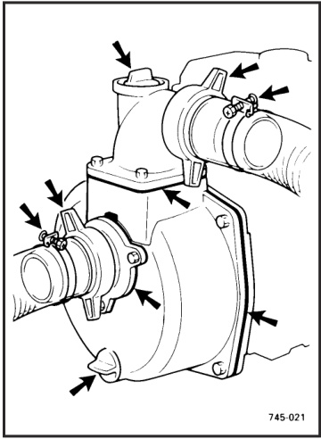

## 机油与滤清器保养

发动机机油更换：

1.  将机器放置在水平面上，预热发动机数分钟后停机。
2.  取下机油加注口盖。
3.  在发动机下方放置接油盘，拆下放油螺塞，将机油完全排空。
4.  检查放油螺塞、垫片、机油盖及O形圈，损坏则更换。①放油螺塞 ②垫片 ③O形圈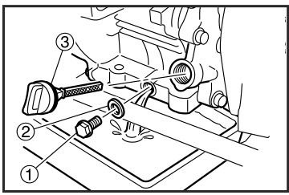
5.  重新安装放油螺塞。
6.  添加发动机机油至上限。①上限
    提示 推荐发动机机油等级：API服务等级“SE”或“SF”。
    注意 确保无异物进入曲轴箱。

空气滤清器：

1.  拆下空气滤清器盖及滤芯。
2.  用溶剂清洗滤芯并晾干。
3.  给滤芯上油并挤去多余油分，滤芯应湿润但不滴油。推荐机油：泡沫空气滤清器专用油或SAE#20发动机机油。
    注意 请勿拧绞滤芯，以免撕裂。
4.  将滤芯装入空气滤清器。
    提示 确保滤芯密封面与滤清器贴合，无进气间隙。
    注意 发动机不可无滤芯运行，否则会导致活塞及气缸过度磨损。
    警告 吸烟或明火附近严禁使用溶剂。

## 燃油与消音器系统保养

燃油开关：
警告 吸烟或明火附近严禁使用或靠近燃油及溶剂。

1.  停止发动机。
2.  将燃油开关手柄置于“OFF”。
3.  拆下燃油开关杯及垫片。
4.  用溶剂清洗开关杯并擦干。
5.  检查垫片，损坏则更换。
6.  重新安装垫片及燃油开关杯。
    警告 务必拧紧燃油开关杯。

油箱滤网：

1.  拆下油箱盖及滤网。①油箱盖 ②油箱滤网
2.  用溶剂清洗滤网，损坏则更换。
3.  擦干滤网后装回。
    警告 务必拧紧油箱盖。

消音器滤网与火花消除器：
警告 发动机运行后机体及消音器会非常烫，检修时请勿用身体或衣物触碰。

1.  拆下消音器滤网。①消音器滤网 ②螺钉
2.  用一字螺丝刀将火花消除器从消音器中撬出。
3.  取下火花消除器。①火花消除器
4.  用钢丝刷清除消音器滤网及火花消除器上的积碳。
    注意 清洁时轻刷，避免损坏或刮伤消音器滤网及火花消除器。
5.  检查消音器滤网及火花消除器，损坏则更换。
6.  安装火花消除器。
    提示 将火花消除器凸台与消音器管上的孔对齐。①凸台 ②孔
7.  安装消音器滤网。

# 故障排除与存放

## 故障排除

发动机无法启动：

1.  燃油系统：燃油未供给至燃烧室。油箱无油……添加燃油。燃油管路堵塞……清洗燃油管路。燃油开关有异物……清洗燃油开关。化油器堵塞……清洗化油器。
2.  机油系统：机油不足。油位过低……添加发动机机油。
3.  电气系统：发动机开关未置于“ON”。火花弱：火花塞积碳或受潮……清除积碳或擦干火花塞。点火系统故障……咨询经销商。
4.  压缩压力不足：活塞及气缸磨损……咨询经销商。气缸盖螺母松动……正确拧紧螺母。垫片损坏……更换垫片。

无法抽水：
注水螺塞或放水螺塞松动……拧紧。软管接头或卡箍松动……拧紧。O形圈或垫片损坏……更换。机械密封损坏……咨询经销商。

## 存放

机器长期存放需采取预防措施防止老化变质。
排放燃油：

1.  排空油箱、燃油开关及化油器浮子室。③化油器放油螺塞
2.  向油箱内倒入一杯SAE 10W30或20W40发动机机油。
3.  晃动油箱使内壁均匀附着机油。
4.  排出多余机油。

发动机：

1.  拆下火花塞，向火花塞孔倒入约一汤匙SAE 10W30或20W40发动机机油，重新安装火花塞。关闭点火，拉动反冲启动器数次，使气缸壁均匀附着机油。
2.  拉动反冲启动器至感觉有压缩力时停止（防止气缸及气门生锈）。
3.  清洁机器外部并涂抹防锈剂。
4.  将机器存放在干燥通风处，并加盖防护罩。
5.  存放、搬运及运行时机器必须保持直立。
6.  拆下放水螺塞排空积水。

# 技术规格与附加信息

## 规格与标识

技术规格：尺寸 发动机 水泵
用户信息：主识别码
识别号记录：请在指定位置记录主识别码及序列号，以便向经销商订购配件。请另行保存这些识别号，以防机器被盗。
机器标识：机器序列号刻印在图示位置。提示 编号前三位为型号标识，后续为生产序号。请记录编号，以便向经销商订购配件时参考。

## 废气排放控制系统及部件

项目 缩写
•化油器总成、左喉管及接头 CARB（化油器）
•TCI磁电机总成及电子元件（电子点火）
•火花塞
•曲轴箱及气缸盖 PCV（曲轴箱强制通风）
•空气滤清器总成 ACL（空气滤清器）
•消音器、盖、网、钢丝及火花消除器
以上项目及缩写符合美国EPA新非道路火花点火非手持式发动机法规及加利福尼亚州1995年及以后小型非道路发动机法规。缩写符合SAE推荐规范J1930最新版《电气/电子系统诊断缩写、术语及定义》。建议由经销商对这些项目进行保养。

## 电路图与安装

电路图：
①机油警告灯 ②发动机开关 ③TCI单元 ④火花塞 ⑤油位开关 ⑥机油警告单元
色标：R红色 Y黄色 B黑色 L蓝色 B/W黑/白
橡胶支架安装：