# 相机手册

用户指南/故障排除/安全注意事项 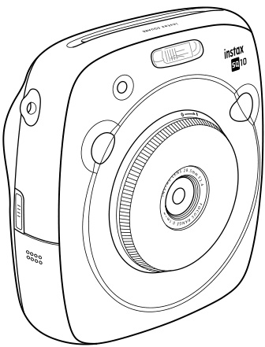

阅读本用户指南后，请妥善保管在安全、易取之处，以便需要时查阅。使用相机前，请检查以下内容。确保包装内包含随附配件。阅读“重要安全须知”（第68页）和“电池使用注意事项”（第72页）以确保安全使用。使用相机前请阅读本用户指南。

# 准备与初始设置

## 随附配件

• NP-50可充电电池（1块） 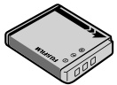
• 充电用USB线（1根） 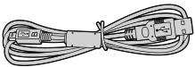
• 手带（1条） 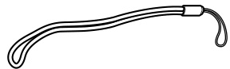
• 挂绳环（2个） 
• 卡扣安装工具（1个） 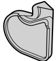
• 用户指南（1本）

## 部件名称与显示

部件名称 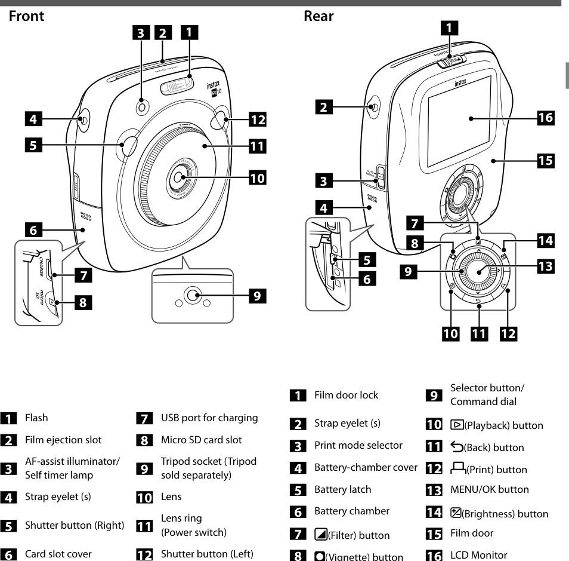
按下（返回）按钮将显示以下信息。
拍摄 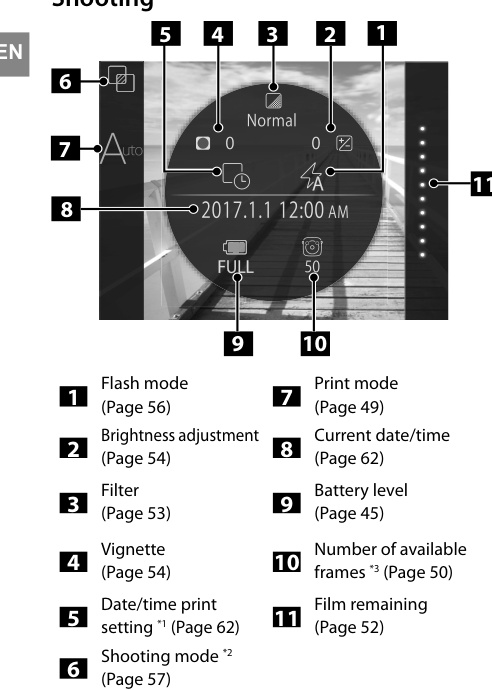
*1 日期/时间打印设置关闭时，图标以灰色显示。
*2 选择标准模式时不显示。
*3 插入存储卡时，数字上会出现[存储卡]图标。剩余可拍摄张数低于10张时，数字上的图标会变为红色。
回放 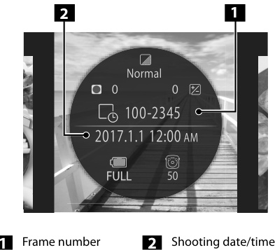

## 拨盘与按钮使用

选择按钮的使用 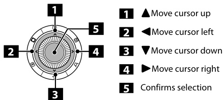
指令拨盘的使用 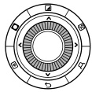
在以下情况下使用指令拨盘：
• 选择菜单或项目
• 更改回放显示（第51页）
• 调整图像效果参数（第53页和第54页）

## 安装背带

安装手带：按照下图所示安装腕带。携带或使用相机时，请将腕带套在手腕上，防止相机掉落。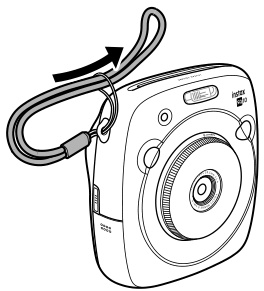
安装肩带（另售）：将肩带卡扣安装到相机上，然后安装肩带。打开肩带卡扣。使用卡扣安装工具按图示打开肩带卡扣。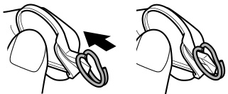 请妥善保管该工具。拆卸肩带时需要用它打开卡扣。
将肩带卡扣安装到每个挂绳环上。将挂绳环钩入卡扣开口。用另一只手按住卡扣，取出工具。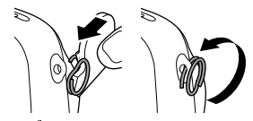
将卡扣穿过每个挂绳环。将卡扣完全旋转穿过挂绳环，直至咔哒闭合。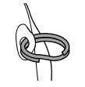
将肩带穿过每个卡扣。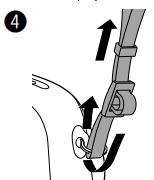
注意事项：
• 肩带仅作肩带使用。请勿将肩带套在脖子上。
• 注意肩带不要遮挡相纸出口。
• 安装肩带时，挂绳环可能会磨损或褪色。

### 装入电池

滑动电池盖将其打开。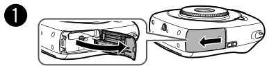 按照电池上的箭头指示装入电池。确保电池上的黄线与相机上的标记对齐。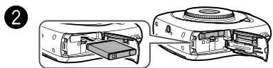 关闭电池盖。

### 取出电池

取出电池时，将电池锁扣推向一侧，然后将电池滑出相机。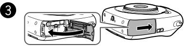

### 电池充电

注意安装方向。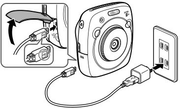 使用随附的USB线将相机与智能手机专用交流电源适配器连接，然后将交流电源适配器插入室内电源插座。
### 充电状态与注意事项

• 使用符合以下额定输出的交流电源适配器：直流5.0伏/1000毫安
• 充电过程中可以拍摄或打印图像。
• 充电时间约为三到四小时。
充电状态指示 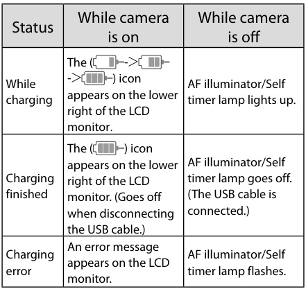
通过电脑充电：直接将相机与电脑连接。请勿通过键盘或USB集线器连接。如果充电过程中电脑进入睡眠模式，充电将停止。如需继续充电，请唤醒电脑并重新连接USB线。根据电脑规格、设置或状态，可能无法通过电脑为相机充电。
注意事项：出厂时电池未充满电。使用前务必充电。阅读”电池使用注意事项”中的警告。（第72页）

### 开关机与电量查看

开启/关闭相机：要开机，请顺时针转动镜头环（电源开关）。要关机，请逆时针转动开关。相机开机并显示拍摄画面 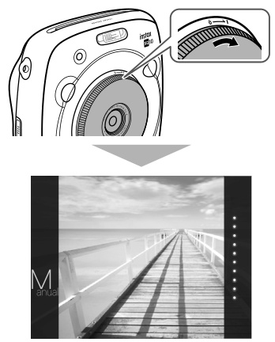 相机关闭。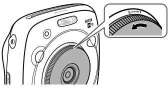
查看剩余电量：在拍摄/回放画面按下 $\leftrightarrow_{\mathsf{D(返回)}}$（返回）按钮，LCD显示屏上将显示剩余电量。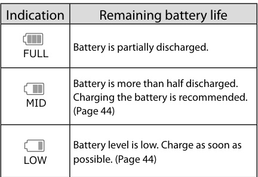
$\twoheadrightarrow$ 电量不足时，LCD显示屏右下角会出现[电量不足]图标。电量耗尽时，LCD显示屏上会放大显示[电量耗尽]图标，相机关闭。
• 若一段时间内无任何操作，相机会自动关机。您可以设置自动关机时间。（第62页）
• 按下（回放）按钮显示回放画面并切换到回放模式。
• 回放模式下完全按下快门按钮显示拍摄画面并切换到拍摄模式。
• 镜头上的指纹等污渍会影响拍摄效果。请保持镜头清洁。

## 进行初始设置

首次开机时，语言、日期和时间未设置。请按照以下步骤进行设置。您可随时进行这些设置。如需后续设置或更改，请参阅第62页。
开机后显示语言选择画面。选择语言，然后按下MENU/OK按钮或 $\blacktriangleright$。
语言设置完成，出现日期/时间画面。设置日期格式，然后按下MENU/OK按钮或 $\blacktriangleright$。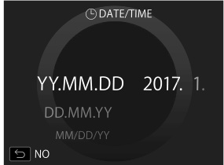 选择以下格式之一：年/月/日、月/日/年、日/月/年。
日期格式设置完成，出现年、月、日、时、分设置画面。设置年、月、日、时、分，然后按下MENU/OK按钮或 $\blacktriangleright$。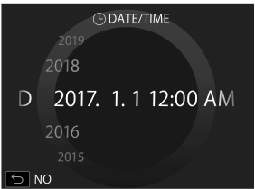 使用方向键选择要设置的项目（年、月、日、时、分），然后使用方向键设置数值。
设置快门按钮功能。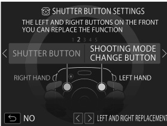 详情请参阅第47页。按下MENU/OK按钮。
快门按钮功能设置：在下表组合中为每个快门按钮分配功能。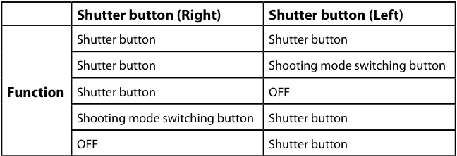 默认情况下，右快门按钮分配拍摄功能，左快门按钮分配拍摄模式切换功能。在快门按钮设置画面显示时，使用 $\blacktriangleleft$ 选择组合，然后按下MENU/OK按钮。
• 若跳过此步骤，每个画面出现时按下（返回）按钮即可进入拍摄画面。
• 长时间取出电池，设置值可能会清除。此时会出现语言选择画面，请重新设置。

## 装入与取出相纸盒

注意事项：相纸用完前请勿打开后盖，否则剩余相纸会曝光变白，无法使用。装入相纸盒时，切勿按压相纸盒背面的两个矩形孔。切勿使用已过保质期的相纸盒，否则可能损坏相机。仅使用instax SQUARE拍立得相纸。instax mini相纸或instax WIDE相纸无法使用。
相纸盒注意事项：每盒instax SQUARE拍立得相纸包含1张黑色相纸保护盖和10张相纸。装入相机前请勿将相纸盒从内袋中取出。关闭后盖时，相纸保护盖会自动弹出。详情请参阅instax SQUARE拍立得相纸上的说明和警告。

### 装入相纸盒

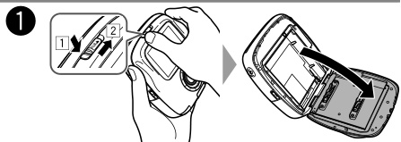 按住相仓锁按钮（1），然后将拨杆向右滑动（$\boxdot$），直至相仓略微打开。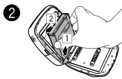 握住相纸盒两侧，将相纸盒底部对准相仓凹槽（$\boxdot$），然后平直插入（2）。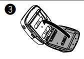 关闭后盖。确保后盖锁咔哒到位。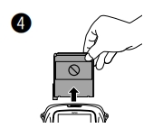 关闭后盖时，黑色相纸保护盖会自动弹出。从相纸出口取出相纸保护盖。

### 取出用完的相纸盒

相纸用完时，拍摄画面右侧的所有点会以灰色显示。（第52页）取出相纸盒。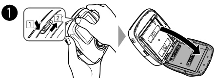 按住相仓锁按钮（1），然后将拨杆向右滑动（$\boxdot$），直至相仓略微打开。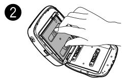 握住相纸盒上的矩形孔，然后平直拉出。

# 基础拍摄与打印

## 选择打印模式

有两种打印模式。自动打印模式、手动打印模式（默认设置）。选择自动打印模式时，图像保存后立即开始打印。选择手动打印模式时，图像保存到内存中，您可稍后选择并打印。

### 自动打印模式

将侧面的打印模式选择器切换到”AUTO”。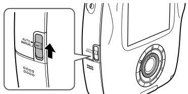 拍摄画面上会出现以下图标。 图像保存后立即开始打印。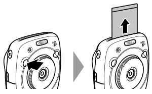

### 手动打印模式（默认设置）

将侧面的打印模式选择器切换到”MANUAL”。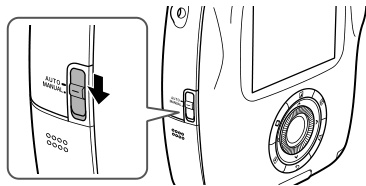 拍摄画面上会出现以下图标。 图像保存到内存中，您可稍后选择并打印，而非立即打印。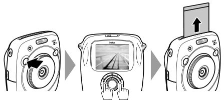

## 拍摄基本操作

本节介绍基本拍摄操作。顺时针转动镜头环（电源开关）开机。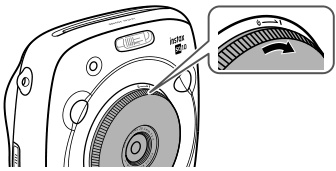 手持相机并确认最终图像的构图。
选择拍摄模式或进行图像效果设置。（第53至57页）半按快门对焦。
• 对焦成功：相机发出蜂鸣声，显示屏上出现绿色对焦框。
• 对焦失败：显示屏上出现红色对焦框。
更改构图或使用对焦锁定。（第55页）完全按下快门拍摄照片。照片拍摄完成并保存到相机内存。
• 若打印模式设为自动打印模式，图像将被打印。（第49页）
• 拍摄时，请双手持机，肘部抵住身体。按下快门时，注意不要触碰镜头表面。完全按下快门时，请轻按。
• 注意手指或肩带不要遮挡闪光灯、镜头或相纸出口。
• 光线不足时，拍摄可能会触发闪光灯。您可更改闪光灯设置关闭闪光。（第56页）
相机内存注意事项：
• 内存已满时，快门无法释放，无法拍摄。删除内存中的图像或更换存储卡。
• 内存最多可保存约50张图像。使用存储卡时，每1GB可保存约1000张图像。
• 相机出现故障时，内存中的图像可能损坏或丢失。建议将重要图像备份到其他存储介质（如硬盘、CD-R、CD-RW或DVD-R等）。
• 送修时，我们不保证内存中图像的安全。维修相机时，我们可能会检查内存中的图像内容。

## 查看与回放图像

可在显示屏上查看图像。打印前请试拍并确认效果。
按下（回放）按钮。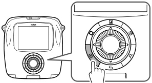 将显示最新拍摄的图像。按下 $\blacktriangleleft$ 键或 $\blacktriangleright$ 选择要查看的图像。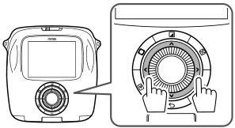 按下 $\blacktriangleleft$ 显示上一张图像。按下 $\blacktriangleright$ 显示下一张图像。完全按下快门按钮返回拍摄画面。
更改回放显示：您可放大显示屏上的图像或更改单次显示的图像数量。
图像放大：顺时针转动指令拨盘可放大显示屏上的图像。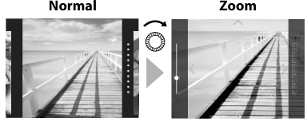 使用方向键移动查看区域。按下MENU/OK按钮或 $\leftrightarrow_{\mathsf{D(返回)}}$（返回）按钮取消放大。可在放大状态下打印图像。（第52页）
更改显示屏显示图像数量：您可更改显示屏上单次显示的图像数量。逆时针转动指令拨盘可更改显示数量（单张、四张或九张）。单张图像 / 四张图像 / 九张图像 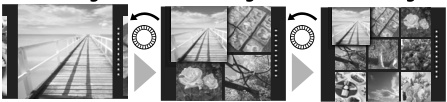 顺时针转动指令拨盘可更改显示数量（四张或单张）。按下MENU/OK按钮或（返回）按钮取消多张显示。可在显示四张或九张图像时打印。（第52页）

## 打印图像

按照以下步骤打印图像。选择自动打印模式时，拍摄后立即打印图像。（第49页）
按下（回放）按钮。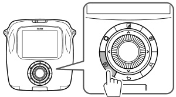 将显示最新拍摄的图像。按下 $\blacktriangleleft$ 键或 $\blacktriangleright$ 选择要查看的图像。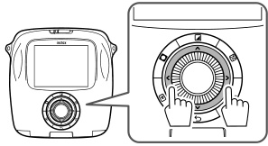 按下 $\blacktriangleleft$ 显示上一张图像。按下 $\blacktriangleright$ 显示下一张图像。
根据需要调整图像效果。（第53页和第54页）按下（打印）按钮。出现以下画面。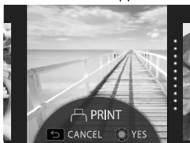 按下MENU/OK按钮。开始打印。按下（返回）按钮可取消打印。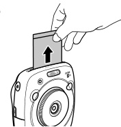
相纸弹出后（相机停止发声），捏住相纸边缘取出。
剩余相纸指示：显示屏右侧的点表示剩余相纸数量。每打印一张，一个点变为灰色。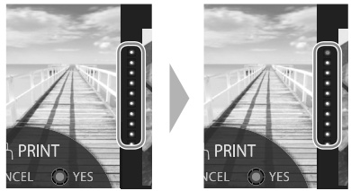 仅剩两张相纸时，点变为红色。
您可打印放大的图像或在一张相纸上打印四张或九张图像。步骤2显示要打印的图像时，使用指令拨盘切换到多张显示模式。（第51页）
• 取出相纸的详情请参阅instax SQUARE拍立得相纸包装上的说明和警告。显影时间约为90秒。（时间随环境温度变化）

# 进阶拍摄与图像效果

## 图像效果（滤镜、亮度、暗角）

在拍摄/回放画面时，可直接按下背面的按钮选择效果菜单调整图像效果。
滤镜：在拍摄/回放画面按下（滤镜）按钮。出现以下画面。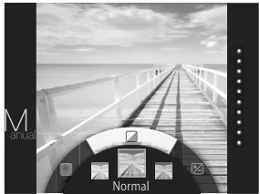 使用指令拨盘选择滤镜。再次按下（滤镜）按钮。滤镜效果应用到图像并返回上一画面。也可按下MENU/OK按钮或（返回）按钮返回上一画面。长按（滤镜）按钮可取消滤镜效果。可用滤镜效果 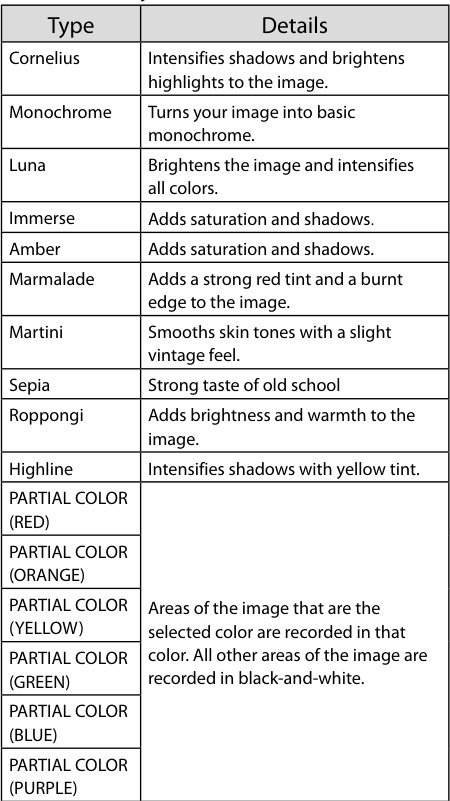
亮度调节：在拍摄/回放画面按下（亮度）按钮。出现以下画面。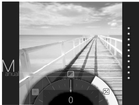 使用指令拨盘调节亮度。顺时针转动指令拨盘使图像变亮，逆时针转动使图像变暗。再次按下（亮度）按钮。调整后的亮度应用到图像并返回上一画面。也可按下MENU/OK按钮或（返回）按钮返回上一画面。长按（亮度）按钮可取消亮度调整。
暗角：调节图像四角亮度。按照以下步骤调整。在拍摄/回放画面按下（暗角）按钮。出现以下画面。 使用指令拨盘调节四角亮度。顺时针转动指令拨盘使四角变暗，逆时针转动使四角变亮。再次按下（暗角）按钮。调整后的亮度应用到图像并返回上一画面。也可按下MENU/OK按钮或（返回）按钮返回上一画面。长按（暗角）按钮可取消暗角调整。
图像效果注意事项：
• 调整后的参数或效果在拍摄后仍保留，但在其他设备（如电脑）上查看图像时无效。
• 可对一张图像应用多种效果。长按 $\tt SO(返回)$（返回）按钮可取消所有调整参数或效果。
• 根据拍摄对象或相机设置，图像可能会出现颗粒感或亮度、色调变化。

## 对焦与曝光锁定

使用自动对焦/自动曝光锁定：半按快门按钮锁定对焦/曝光。自动对焦/自动曝光锁定适用于拍摄主体不在画面中心的情况。将拍摄主体置于画面中心，然后半按快门按钮。保持半按快门状态调整构图。完全按下快门拍摄照片。
以下拍摄主体可能无法对焦，建议使用自动对焦/自动曝光锁定：
• 镜面或车身等非常光滑的物体
• 快速移动的物体
• 透过窗户或其他反射物体拍摄的主体
• 深色及吸光物体，如头发或皮毛
• 烟雾或火焰等不清晰主体
• 与背景对比度低的主体（如与背景颜色相同的主体）
• 对焦框内同时存在高对比度前景或背景物体（如背景有高对比度元素的主体）

## 闪光灯与自拍

使用自拍：使用自拍功能可拍摄合影或减少按下快门时的抖动。在拍摄画面按下MENU/OK按钮。 出现拍摄菜单。选择自拍，然后按下MENU/OK按钮。选择10秒或2秒，然后按下MENU/OK按钮。完全按下快门按钮。
• 选择10秒：按下快门后，自动对焦辅助灯/自拍指示灯亮起，拍摄前3秒开始闪烁。
• 选择2秒：按下快门后，自动对焦辅助灯/自拍指示灯闪烁。
• 按下（返回）按钮可取消自拍。
使用闪光灯：在夜间或室内光线不足时使用闪光灯。在拍摄画面按下MENU/OK按钮。 出现拍摄菜单。选择闪光灯，然后按下MENU/OK按钮。选择闪光灯设置，然后按下MENU/OK按钮。按下快门拍摄。
闪光灯设置：
• 自动闪光灯：相机检测到光线不足时自动闪光。适用于大多数场景。
• 强制闪光：无论拍摄主体亮度如何，始终闪光。适用于逆光主体。
• 禁止闪光：即使拍摄主体光线不足也不闪光。适用于禁止闪光的场所。光线较暗时建议使用三脚架。
• 慢速同步：在暗处闪光灯与慢速快门同步（慢速同步），可清晰拍摄前景主体和背景。明亮环境下使用可能导致曝光过度。
• 红眼减轻&慢速同步：该设置可减少暗处使用闪光灯时因闪光灯反射视网膜造成的“红眼”现象。选择该设置时，闪光灯会预闪数次减轻红眼。

## 拍摄模式

根据拍摄主体或用途选择拍摄模式。在拍摄画面按下MENU/OK按钮。 出现拍摄菜单画面。选择拍摄模式，然后按下MENU/OK按钮或 $\blacktriangleright$。选择拍摄模式，然后按下MENU/OK按钮。设置生效。按下（返回）按钮。LCD显示屏返回拍摄画面。
拍摄模式：
• 标准模式：用于普通拍摄。相机检测到光线不足时自动闪光。可选择关闭闪光。（第56页）
• 长时间曝光模式：按住快门按钮时快门保持打开。用于拍摄夜景。需要使用桌面或三脚架。根据亮度调整按下快门的时间。
• 双重曝光：按两次快门在一张照片中拍摄两个主体。拍摄第一个主体后，再拍摄第二个主体。请按照显示屏上的说明操作。
$\twoheadrightarrow$ 使用分配了拍摄模式切换功能的快门按钮选择模式时，每次按下按钮都会切换模式。

## 历史记录重印

从打印历史记录打印（重印）：使用之前打印时的相同设置（如图像效果）打印图像。按照以下步骤操作。
按下（回放）按钮。 将显示最新拍摄的图像。按下MENU/OK按钮。出现回放菜单。选择打印历史记录，然后按下MENU/OK按钮。出现图像选择画面。
• 内存中最多存储最近50条打印记录。超过50条时，新记录会覆盖最早的记录。
选择要打印的图像。 按下 $\blacktriangleleft$ 显示上一张图像。按下 $\blacktriangleright$ 显示下一张图像。可选择四张或九张显示模式。
按下（打印）按钮。按下MENU/OK按钮。开始打印。按下（返回）按钮可取消打印。相纸弹出后（相机停止发声），捏住相纸边缘取出。
• 无法将打印历史记录保存到存储卡。
• 初始化内存时，所有打印历史记录将被删除。（第62页）
• 无法编辑或处理打印历史记录中的图像。

# 存储系统与菜单

## 存储卡使用

本相机内存可保存约50张图像。使用存储卡可保存更多图像。
存储卡注意事项：
• 本相机支持micro SD/micro SDHC卡。使用其他卡可能损坏相机。
• 存储卡体积小，可能被误食，请放在儿童接触不到的地方。若儿童误食，请立即就医。
• 格式化存储卡或记录、删除数据时，请勿关闭相机或取出存储卡。否则可能损坏存储卡。
• 避免在强静电或电磁噪音环境中使用或存放存储卡。插入带静电的存储卡可能导致相机故障。此时请关闭再重新开机。
• 请勿将存储卡放入口袋，以免受压损坏。长时间使用相机后取出存储卡，卡可能发热，属于正常现象。
• 请勿在存储卡上粘贴标签。标签脱落可能导致相机故障。
在电脑上使用存储卡注意事项：首次使用前请格式化存储卡，在电脑或其他设备使用后务必重新格式化。使用相机格式化的存储卡会自动创建文件夹。请勿使用电脑更改文件夹/文件名或删除文件夹，否则无法使用存储卡。请使用相机删除图像文件。编辑图像文件前请先复制或移动到硬盘，避免编辑原始文件。
插入存储卡：滑动卡槽盖打开。 如下图所示，将存储卡平直插入卡槽底部直至咔哒到位。 关闭卡槽盖。
注意事项：取出存储卡时，用手指按压后轻轻松开，否则存储卡可能快速弹出。
打印其他相机拍摄的图像：插入包含图像的存储卡可打印其他相机拍摄的图像。但需满足以下条件：将要打印的图像复制到根目录，而非文件夹中。文件名由四个大写字母（A-Z）加四个数字组成。

## 拍摄菜单

按照以下步骤设置/更改拍摄菜单。在拍摄画面按下MENU/OK按钮。 出现菜单画面。选择要更改的设置项目并修改设置。按下MENU/OK按钮。设置生效。按下（返回）按钮。LCD显示屏返回拍摄画面。
拍摄菜单项目：
• 拍摄模式：根据用途或场景选择拍摄模式。（第57页）也可使用在快门按钮设置中分配了拍摄模式切换功能的快门按钮。反复按下按钮选择拍摄模式。
• 闪光灯：选择闪光灯拍摄设置。（第56页）
• 自拍：选择自拍设置。（第55页）
• 自动对焦辅助灯：选择开启时，暗处对焦时自动对焦辅助灯会亮起辅助自动对焦。选项：开启/关闭。某些情况下，使用自动对焦辅助灯可能无法对焦。拍摄主体距离较近时，自动对焦辅助灯效果可能不佳。避免将自动对焦辅助灯直射拍摄对象眼睛。

## 回放菜单

按照以下步骤设置/更改回放菜单。在回放画面按下MENU/OK按钮。 出现菜单画面。选择要更改的设置项目并修改设置。按下MENU/OK按钮。设置生效。按下（返回）按钮。LCD显示屏返回回放画面。
回放菜单项目 
• 删除：单张或全部删除图像。选项：单张/全部 
• 复制：在相机内存和存储卡之间相互复制图像。按照以下步骤操作：
1. 按下MENU/OK按钮或 $\blacktriangleright$。
2. 选择目标位置，然后按下MENU/OK按钮或 $\blacktriangleright$。
3. 选择单张或全部，然后按下MENU/OK按钮或 $\blacktriangleright$。选择全部将立即开始复制。选择单张请继续步骤 4。
4. 选择要复制的图像，然后按下MENU/OK按钮或 $\blacktriangleright$。

## 设置菜单

按照以下步骤设置/更改设置菜单。在拍摄/回放画面按下MENU/OK按钮。 出现菜单画面。选择要更改的设置项目并修改设置。按下MENU/OK按钮。设置生效。按下（返回）按钮。LCD显示屏返回拍摄画面。
设置菜单项目 
• 操作音量：调节操作音、快门音或开机音音量。选项：关闭/1/2/3 选择关闭可禁用声音。
• 自动关机：选择无操作时相机自动关机的时间。选项：5分钟/2分钟/关闭 
• 格式化：初始化相机内存或插入卡槽的存储卡。所有保存的图像将被删除。

# 规格参数与故障排除

## 规格参数

相机：
• 图像传感器：1/4英寸CMOS原色滤镜
• 有效像素：1920×1920
• 存储介质：内置内存、microSD/microSDHC存储卡
• 存储容量：内置内存：约50张；microSD/microSDHC存储卡：每1GB约1000张
• 文件系统：符合相机文件系统设计规则（DCF）、Exif 2.3标准、支持JPEG和PIM
• 焦距：固定28.5毫米（35毫米格式等效）
• 光圈：F2.4
• 自动对焦系统：单次自动对焦（TTL对比检测，配备自动对焦辅助灯）
• 对焦范围：10厘米至无穷远
• 快门速度：1/29500秒至1/2秒（自动），长时间曝光模式最长10秒
• 感光度：ISO 100至1600（自动）
• 曝光控制：程序自动曝光
• 测光：256区TTL多点测光
• 白平衡：自动
• 闪光灯：自动/强制闪光/禁止闪光/慢速同步/减轻红眼；有效范围：约50厘米至8米
• 拍摄模式：标准、双重曝光、长时间曝光
• 自拍：约10秒/约2秒
• 图像效果：16种滤镜、亮度调节、暗角
• 回放功能：裁剪、多张图像回放

打印机：
• 相纸：instax SQUARE拍立得相纸（另售）
• 每盒打印数量：10张/盒
• 相纸尺寸：86毫米×72毫米
• 图像尺寸：62毫米×62毫米
• 支持图像尺寸：800×800点
• 打印分辨率：12.5点/毫米（318dpi，80微米点距）
• 打印等级：每色256级（RGB）
• 支持图像格式：JPEG（部分经图像编辑/处理软件保存的图像可能无法显示或打印）
• 打印时间：约12秒
• 打印时机：拍摄后立即打印/选择图像后打印
• 打印功能：内置内存/micro SD卡图像
• 重印：最多可重印最近50张（打印历史记录最多存储50张图像）
• 数码变焦：打印时最高2.4倍变焦（输出像素：800×800）
• 相纸检测：支持（插入相纸自动弹出）

其他：
• LCD显示屏：3.0英寸（7.6厘米）TFT彩色LCD显示屏；像素：约46万点
• 输入/输出端子：Micro USB（仅用于充电）
• 电池：NP-50
• 充电功能：内置
• 打印数量：约160张（充满电后） *随使用条件变化
• 充电时间：约3至4小时（使用0.5A USB接口） *随气温变化
• 尺寸：119毫米×47毫米×127毫米（宽×深×高）
• 重量：450克（含相纸盒和电池）
*以上规格如有改进，恕不另行通知。

## 故障排除

若认为相机出现故障，请查阅以下内容。如无法解决，请联系授权经销商。
操作过程中 
故障排除 
故障排除 
打印照片 

# 安全与保养须知

## 重要安全须知

本产品设计安全，按照用户指南和说明正确操作时可安全使用。正确操作本产品和instax相纸，并仅按照本用户指南和instax mini相纸说明打印照片非常重要。为方便和安全起见，请遵守本用户指南中的说明。建议将本用户指南妥善保管在安全、易取之处，以便需要时查阅。
警告：本符号表示危险，可能导致受伤或死亡。请遵守以下说明。
如果相机（或电池）发热、冒烟、有烧焦味或出现异常，请立即取出电池。此类故障可能引发火灾并造成烫伤。（取出电池或拔下USB线时请注意避免烫伤。）如果相机掉入水中或有水、金属或其他异物进入相机内部，请立即取出电池，断开交流电源适配器并从插座拔下插头。此类故障可能导致相机过热或起火。
请勿在有易燃气体、开放汽油、苯、油漆稀释剂或其他可能释放危险蒸汽的不稳定物质附近使用本相机。此类故障可能导致相机爆炸或起火并造成烫伤。
切勿拆解电池。请勿加热、投入明火、尝试充电、短路、掉落或撞击电池。否则可能导致电池爆炸。仅使用相机用户指南中指定的电池类型。此类故障可能导致相机过热或起火。
请将电池存放在安全、牢固的地方，远离婴儿、幼儿和宠物。电池可能被幼儿或宠物误食。如发生此类情况，请立即就医。
仅使用相机指定的电池。此外，请勿使用非指定电压的电源。使用其他电池可能导致相机过热或起火。
切勿拆解本产品。否则可能受伤。相机出现故障时，切勿自行维修。否则可能受伤。
本产品掉落或损坏导致内部外露时，请勿触摸。请联系经销商。
请勿触摸后盖内的任何部件或突出部分。否则可能受伤。
切勿让本产品受潮或湿手操作。否则可能导致触电。
请勿混用新旧电池或不同类型电池。同时确保电池正负极安装正确。电池损坏或漏液可能导致火灾、受伤并污染环境。
如果相机长时间不使用（如外出旅行），请取出电池，断开交流电源适配器并拔下USB线。否则可能引发火灾。
连接USB线时请勿移动相机。否则可能损坏USB线，引发火灾或触电。
请放在儿童接触不到的地方。儿童使用本产品可能导致受伤。
请勿用布或毯子覆盖或包裹相机或交流电源适配器。否则可能导致热量积聚，变形或引发火灾。
使用相机时，请确保电池盖已安装，否则可能受伤。
“CE”标志证明本产品符合欧盟关于安全、公共卫生、环境和消费者保护的要求。

## FCC与CE声明

美国用户：
FCC声明：本设备符合FCC规则第15部分。操作需符合以下两个条件：(1) 本设备不会产生有害干扰；(2) 本设备必须接受任何收到的干扰，包括可能导致异常操作的干扰。
警告：本设备经测试符合FCC规则第15部分中B类数字设备的限制。这些限制旨在为住宅安装提供合理的抗干扰保护。本设备会产生、使用并辐射射频能量，如果未按照说明安装和使用，可能会对无线电通信造成有害干扰。但是，不保证在特定安装中不会产生干扰。如果本设备对无线电或电视接收造成有害干扰（可通过开关设备判断），建议用户采取以下措施纠正干扰：
• 调整接收天线方向或位置
• 增加设备与接收器之间的距离
• 将设备连接到与接收器不同电路的插座
• 咨询经销商或有经验的无线电/电视技术人员
未经责任方明确批准的更改或修改，可能使用户无权操作本设备。

加拿大用户：
警告：本B类数字设备符合加拿大ICES-003标准。
家用电子电气设备废弃处理（适用于欧盟及其他有单独收集系统的欧洲国家）：本产品、手册、保修卡及/或包装上的符号表示本产品不应作为生活垃圾处理。而应送至指定的电子电气设备回收点。正确处理本产品有助于防止对环境和人类健康造成潜在负面影响。如果设备含有易拆卸电池或蓄电池，请根据当地规定单独处理。材料回收有助于节约自然资源。有关本产品回收的更多详细信息，请联系当地市政部门、生活垃圾处理部门或购买商店。欧盟以外国家：如欲废弃本产品，请联系当地部门咨询正确处理方式。

## 相机与相纸保养

相机保养：
1. 本相机为精密仪器。请勿受潮、掉落或暴露在沙尘中。
2. 请勿使用手机或其他类似电子产品的挂绳。此类挂绳通常强度不足，无法牢固固定相机。为安全起见，仅使用相机专用挂绳，并严格按照说明使用。
3. 使用三脚架时，请检查三脚架强度，然后转动三脚架安装相机，而非转动相机机身。将相机安装到三脚架上时，请勿过度转动三脚架螺丝或施加过大压力。请勿携带安装在三脚架上的相机。否则可能导致人身伤害或相机损坏。
4. 长时间不使用相机时，请取出电池，存放在隔热、防尘、防潮的地方。
5. 请勿使用稀释剂、酒精等溶剂清洁污渍。
6. 保持相仓和相机内部清洁，避免损坏相纸。
7. 炎热天气下，请勿将相机留在车内或海滩等高温处。请勿长时间存放在潮湿环境中。
8. 樟脑丸等驱虫剂气体可能影响相机和照片。存放相机或照片时请注意。
9. 由于本相机由软件控制，极少数情况下可能出现故障。如出现操作异常，请取出电池，等待片刻后重新装入复位。
10. 相机使用温度范围为+5℃至+40℃（+41℉至+104℉）。
11. 务必确保打印内容不侵犯版权、肖像权、隐私或其他个人权利，不违反公共道德。侵犯他人权利、违反公共道德或造成滋扰的行为可能会受到法律制裁或追究法律责任。
打印注意事项 
instax SQUARE相纸与照片保养：请参阅instax SQUARE相纸使用说明。遵守所有安全正确使用的说明。
1. 请将相纸存放在阴凉干燥处。请勿长时间留在温度极高的地方（如密闭车内）。
2. 装入相纸盒后，请尽快使用。
3. 相纸存放在极高温或低温环境后，使用前请恢复至室温。
4. 请在保质期或"使用期限"前使用相纸。
5. 避免机场托运行李检查等强X光照射。未使用的相纸可能出现雾化等影响。建议将相机和/或相纸随身携带上飞机。（详情请咨询各机场）
6. 避免强光照射，显影后的照片请存放在阴凉干燥处。
7. 请勿刺穿、撕裂或裁剪instax SQUARE相纸。相纸损坏请勿使用。
相纸与照片处理注意事项：详情请参阅instax SQUARE拍立得相纸上的说明和警告。

## 电池使用注意事项

• 请确保正确使用相机。使用前请仔细阅读这些安全注意事项和用户指南。阅读这些安全注意事项后，请妥善保管。 
以下说明电池的正确使用方法和延长寿命的技巧。使用不当可能缩短电池寿命或导致漏液、过热、火灾或爆炸。出厂时电池未充电。使用前请充满电。
电池注意事项：电池不使用时电量会逐渐流失。使用前1至2天充电。不使用时关闭相机可延长电池寿命。低温下电池容量下降；电量耗尽的电池在低温下可能无法工作。请将充满电的备用电池放在温暖处，必要时更换；或将电池放在温暖处，拍摄时再装入相机。请勿将电池直接与暖手宝或其他加热设备接触。
电池充电：使用随附的USB线充电。环境温度低于+10℃（+50℉）或高于+35℃（+95℉）时，充电时间会延长。请勿在温度高于40℃（+104℉）时充电；温度低于+5℃（+41℉）时，电池无法充电。请勿为充满电的电池再次充电。但电池无需完全放电后再充电。充电或使用后电池可能发热，属于正常现象。
电池寿命：正常温度下，电池可重复充电约300次。电池续航时间明显缩短时，说明已达到使用寿命，应更换。
存放：充满电长时间存放可能影响性能。存放前请将电量完全耗尽。相机长时间不使用时，请取出电池，存放在干燥、温度+15℃至+25℃（+59℉至+77℉）的环境中。请勿存放在温度极端的地方。
注意事项 - 电池处理：
• 请勿在电池上粘贴标签或其他物品。
• 请勿撕裂或剥离外部标签。
• 保持电极清洁。
• 长时间使用后，电池和相机机身可能发热，属于正常现象。
废弃处理：按照当地规定处理废旧电池。
相机认证标志位于相仓内部。
您购买的产品由可回收锂离子电池供电。请拨打1-800-8-BATTERY咨询电池回收信息。
电池或蓄电池上的符号表示这些电池不应作为生活垃圾处理。欧盟、挪威、冰岛和列支敦士登以外国家：如欲废弃含电池或蓄电池的本产品，请联系当地部门咨询正确处理方式。如有任何关于本产品的疑问，请联系授权经销商或访问以下网站。