# 空调手册

## 使用与存档概览

### 节能使用建议与存档信息

使用本机前，请仔细阅读本手册并妥善保存，以备日后查阅。类型：变频式。

以下小贴士有助于你使用空调时最大限度降低耗电量，遵循以下说明，可让空调运行更高效：
・室内切勿过度制冷，这不仅有害健康，还会增加耗电量。
・开启空调时，用百叶窗或窗帘遮挡阳光。
・开启空调时，将门窗紧闭。
・上下或左右调节出风方向，实现室内空气循环。
・短时间内想要快速制冷或制热，可调高风扇转速。
・长时间使用空调会导致室内空气质量下降，需定期开窗通风。
・每两周清洁一次空气滤网，滤网积攒的灰尘和杂质会堵塞风道，削弱制冷 / 除湿效果。

请将购物小票装订在此页，如需证明购买日期或享受保修服务时可作凭证。在此填写型号和序列号：
型号：
序列号：
可在每台设备侧面的标签上找到上述信息。
经销商名称：
购买日期：

# 重要安全说明

## 安装与维修安全

### 安装前的电气、接地与专业服务要求

使用本设备前，请阅读所有说明。请始终遵守以下注意事项，避免发生危险情况，确保产品发挥最佳性能。若无视以下指示，可能导致严重伤亡、轻微受伤或产品损坏。

警告：若无视以下指示，可能导致严重伤亡。
注意：若无视以下指示，可能导致轻微受伤或产品损坏。

・非专业人员进行安装或维修，可能会对本人及他人造成危险。
・安装必须符合当地建筑规范，若无当地规范，则需符合《国家电气规范》NFPA 70/ANSI C1-1003 现行版本及《加拿大电气规范》第一部分 CSA C.22.1。
・本手册所载信息仅供熟悉安全操作流程、配备适当工具和测试仪器的专业维修技术人员使用。
・若未仔细阅读并遵守本手册中的所有说明，可能导致设备故障、财产损失、人身伤害甚至死亡。
・使用符合空调额定参数的标准断路器和保险丝，否则可能导致触电或产品故障。
・安装或移机时，请联系授权服务中心，否则可能导致严重受伤或产品故障。
・务必使用带接地端子的电源插头和插座，否则可能导致触电或产品故障。
・妥善安装控制箱的面板和盖板，否则可能导致爆炸或火灾。
・使用空调前，需安装专用电源插座和断路器，否则可能导致触电或产品故障。
・切勿改装或延长电源线，若电源线出现刮擦、脱皮或老化现象，必须及时更换，否则可能引发火灾或触电。

### 安装位置、排水检查、水平放置与搬运要求

・拆包或安装空调时需小心操作，否则可能导致严重受伤或产品故障。
・切勿将空调安装在不稳固的表面或有坠落风险的位置，否则可能导致死亡、严重受伤或产品故障。
・空调安装或维修后，务必检查是否存在制冷剂泄漏，否则可能导致产品故障。
・正确安装排水管，确保冷凝水顺利排出，否则可能导致产品故障。
・安装产品时，务必保持水平。
・将空调安装在室外机噪音和废气不会影响邻居的位置，否则可能引发邻里纠纷。
・搬运设备时，至少需要两人操作或使用叉车，否则可能导致严重受伤。
・切勿将空调安装在直接受海风（盐雾）侵袭的位置，否则可能导致产品故障。

## 操作与日常安全

### 日常用电、异常现象、进水与易燃环境处理

・空气湿度极高或门窗敞开时，切勿让空调长时间运行，否则可能导致产品故障。
・空调运行时，确保电源线未被拉扯或损坏，否则可能引发火灾、触电或产品故障。
・切勿在电源线上放置任何物品，否则可能导致触电或产品故障。
・切勿通过插拔电源插头的方式开关空调，否则可能引发火灾或触电。
・切勿用湿手触摸、操作或维修空调，否则可能导致触电或产品故障。
・切勿在电源线附近放置加热器或其他取暖设备，否则可能引发火灾、触电或产品故障。
・切勿让水渗入空调内部，否则可能导致爆炸或火灾。
・切勿将汽油、苯、稀释剂等易燃物品放在空调附近，否则可能导致爆炸或火灾。
・切勿在狭小且不通风的空间内长时间使用空调，需定期通风，否则可能导致爆炸或火灾。
・发生燃气泄漏时，需充分通风后再使用空调，否则可能导致爆炸或火灾。
・若空调发出异响、异味或冒烟，立即拔下电源插头，否则可能导致爆炸或火灾。
・遭遇暴雨或飓风时，停止运行空调并关闭窗户，若可能，在飓风来临前将产品从窗户拆下。
・打开前格栅后，切勿触摸静电滤网，否则可能导致触电或产品故障。
・若因洪水导致空调被水浸泡，立即联系授权服务中心，否则可能导致爆炸或火灾。
・注意防止水渗入产品内部。
・若同时使用本空调和加热器等取暖设备，务必充分通风，否则可能引发火灾、严重受伤或产品故障。

### 清洁维修、特殊用途限制、风口安全与遥控器电池安全

**警告：** 若无视以下指示，可能导致严重伤亡或产品故障。

・清洁或维修空调时，关闭总电源并拔下电源插头，否则可能导致死亡、严重受伤或产品故障。
・长时间不使用空调时，拔下电源插头，否则可能导致产品故障。
・内部清洁请联系授权服务中心或经销商，切勿使用腐蚀性强的清洁剂，此类清洁剂会损坏设备，还可能导致产品故障、火灾或触电。
・切勿让空调的冷风吹或热风吹向人、动物或植物，否则可能导致严重受伤。
・切勿将本产品用于特殊用途，如食品保鲜、艺术品保存等，本产品为家用空调，非精密制冷设备，违规使用可能导致死亡、火灾或触电。
・切勿堵塞进风口或出风口，否则可能导致爆炸或产品故障。
・清洁空调时，切勿使用强力清洁剂、溶剂或直接喷水，需使用软布擦拭，否则可能导致严重受伤或产品故障。
・拆卸空气滤网时，切勿触摸空调的金属部件，否则可能导致严重受伤或产品故障。
・切勿在空调上放置任何物品，否则可能导致产品故障。
・滤网清洁后，务必牢固安装，每两周清洁一次滤网，必要时可增加清洁频率。
・空调运行时，切勿将手或其他物品伸入进风口或出风口，否则可能导致触电。
・切勿饮用空调排出的水，否则可能导致严重的健康问题。
・在高处清洁、保养或维修空调时，使用稳固的凳子或梯子，否则可能导致严重受伤或产品故障。
・给遥控器装电池时，切勿将不同型号电池混用，也切勿将新电池与旧电池混用，否则可能导致产品故障。
・切勿对电池充电或拆解电池，否则可能导致爆炸、火灾或严重受伤。
・若遥控器电池漏液，立即停止使用，若衣物或皮肤接触到漏液，用清水冲洗，否则可能导致严重受伤。
・若不慎误食电池漏液，彻底漱口并立即就医，否则可能导致严重的健康问题。

# 使用前准备

## 设备组成与遥控器准备

### 室内机与室外机部件说明

室内机：功能会根据机型有所调整。注：操作指示灯的数量及其位置可能因空调型号而异。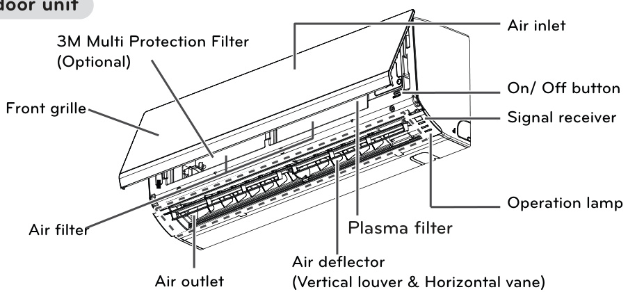
室外机：功能会根据机型有所调整。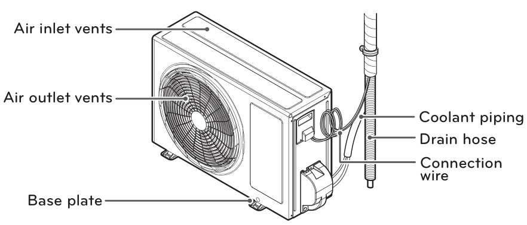

### 无线遥控器按键与控制面板说明

使用遥控器可更便捷地操作空调，附加功能的按键位于遥控器盖板下方。部分功能可能因机型不同而不支持。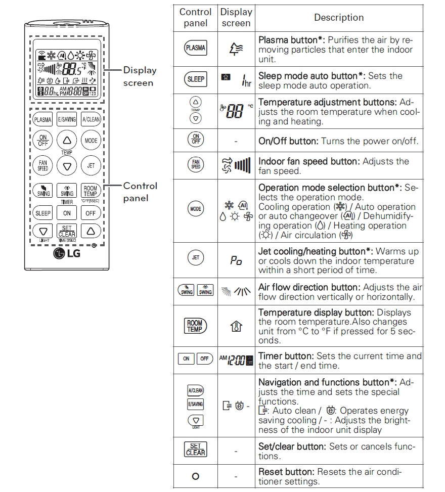

### 遥控器对准信号接收器操作

操作方法：将遥控器对准空调底部的信号接收器进行操作。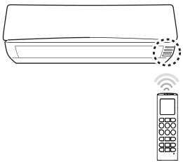
注：
・若将遥控器对准其他电子设备，可能会对其进行操控，请务必将遥控器对准空调的信号接收器。
・为保证正常操作，用软布擦拭信号发射器和接收器。

### 遥控器电池安装、更换提示与支架固定

使用遥控器前，请先安装电池，适用电池型号为 7 号。

1.  取下电池盖。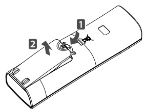
2.  装入新电池，确保电池正、负极安装正确。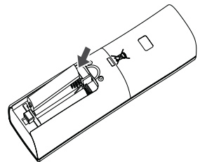
3.  重新装上电池盖。
    注：若遥控器显示屏开始变暗，请更换电池。

将支架安装在无阳光直射的位置，以保护遥控器。

1.  选择安全且便于取用的位置。
2.  用螺丝刀将两颗螺丝拧紧，固定支架。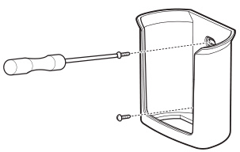
3.  将遥控器滑入支架中。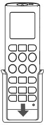

# 基本功能

## 运行模式

### 制冷、制热、除湿与循环运行模式

**室内制冷（制冷模式）**

1.  按下开 / 关键开启电源。
2.  反复按下模式键，选择制冷模式，显示屏上会显示雪花图标。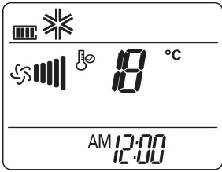
3.  按下温度上升 / 下降键，设置所需温度，温度调节范围为 18-30 摄氏度。

**室内制热（制热模式）**

1.  按下开 / 关键开启电源。
2.  反复按下模式键，选择制热模式，显示屏上会显示太阳图标。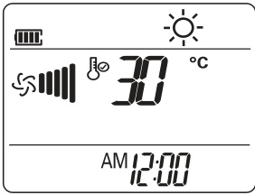
3.  按下温度上升 / 下降键，设置所需温度，温度调节范围为 16-30 摄氏度。
    注：单冷型机型不支持此功能。

**除湿（除湿模式）**
该模式可在高湿度环境或雨季去除多余湿气，防止霉菌滋生，此模式会自动调节室内温度和风扇转速，保持最佳湿度水平。

1.  按下开 / 关键开启电源。
2.  反复按下模式键，选择除湿模式，显示屏上会显示水滴图标。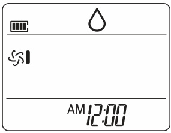
    注：此模式下温度由系统自动调节，无法手动设置，且显示屏不会显示设定温度。

**室内换气（循环模式）**
该模式仅实现室内空气循环，不改变室内温度，循环模式下制冷指示灯亮起。

1.  按下开 / 关键开启电源。
2.  反复按下模式键，选择循环模式，显示屏上会显示风扇图标。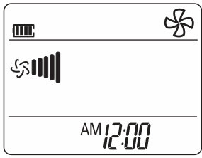
3.  按下风速键调节风扇转速。

## 风速风向与定时睡眠

### 风扇转速与上下左右出风方向调节

**调节风扇转速**
反复按下风速键调节风扇转速，选择风向箭头图标可开启自然风模式，风扇转速自动调节。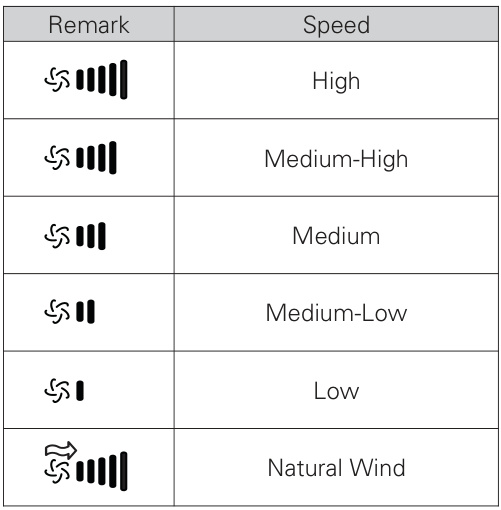

**调节出风方向**

1.  左右调节出风方向时，按下对应按键选择所需方向，选择自动摆风图标可实现出风方向自动调节。
2.  上下调节出风方向时，反复按下对应按键选择所需方向，选择自动摆风图标可实现出风方向自动调节。
    注：
    ・部分机型不支持上下调节出风方向。
    ・随意调节导风板可能导致产品故障。
    ・空调重启后，将按照之前设置的出风方向运行，导风板状态可能与遥控器显示图标不一致，此时可再次按下出风方向调节键进行调整。

### 当前时间、定时开关机、取消定时与睡眠模式

使用定时功能可节约能源，让空调更高效地运行。

**设置当前时间**

1.  按住设定 / 清除键 3 秒以上，显示屏底部的上午 / 下午图标开始闪烁。
2.  按下上升 / 下降键调整分钟数。
3.  按下设定 / 清除键完成设置。

**定时开机**

1.  按下定时开键，显示屏底部对应的图标开始闪烁。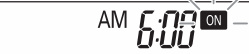
2.  按下上升 / 下降键调整分钟数。
3.  按下设定 / 清除键完成设置。
4.  定时设置完成后，显示屏会显示当前时间和定时开图标。

**定时关机**

1.  按下定时关键，显示屏底部对应的图标开始闪烁。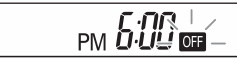
2.  按下上升 / 下降键调整分钟数。
3.  按下设定 / 清除键完成设置。
4.  定时设置完成后，显示屏会显示当前时间和定时关图标。

**取消定时设置**
按下设定 / 清除键，若要取消所有定时设置，直接按下设定 / 清除键即可。

**睡眠模式设置**
开启睡眠模式，可在入睡后让空调自动关机。

1.  按下开 / 关键开启电源。
2.  按下睡眠键。
3.  按下上升 / 下降键选择定时时长（最长 7 小时）。
4.  按下设定 / 清除键完成设置，睡眠模式下显示屏会显示对应图标。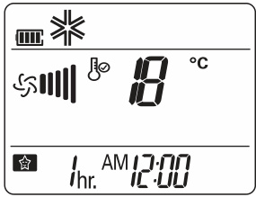
    注：制冷和除湿模式下，为提升睡眠舒适度，空调运行 30 分钟后温度升高 1 摄氏度，再运行 30 分钟后温度再升高 1 摄氏度，最高较设定温度升高 2 摄氏度。

# 高级功能

## 高级模式与空气净化

### 极速、自动、自动转换与节能制冷模式

本空调配备多种实用的高级功能。

**快速调节室内温度（极速制冷 / 制热模式）**
该模式可在夏季快速冷却室内空气，或在冬季快速提升室内温度。

1.  按下开 / 关键开启电源。
2.  按下极速键。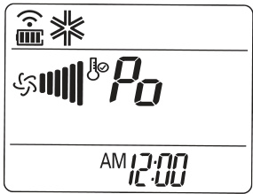

  - 极速制冷模式下，空调将以 18 摄氏度的温度强风出风 30 分钟。
  - 极速制热模式下，空调将以 30 摄氏度的温度强风出风 30 分钟。
    注：循环、自动或自动转换模式下，无法使用此功能。部分机型不支持此功能。

**自动运行（人工智能模式）- 单冷型机型**
此模式下，风扇转速和温度会根据室内温度自动调节。

1.  按下开 / 关键开启电源。
2.  反复按下模式键，选择自动运行模式。
3.  若当前温度高于或低于所需温度，按下上升 / 下降键选择所需的运行代码。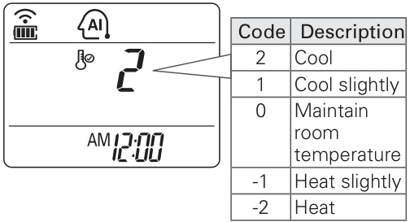
    注：此模式下无法调节风扇转速，但可设置导风板自动摆风。部分机型不支持此功能。

**自动转换运行**
该模式会自动切换运行模式，将设定温度的波动控制在 2 摄氏度以内。

1.  按下开 / 关键开启电源。
2.  反复按下模式键，选择自动转换运行模式，显示屏上会显示对应标识。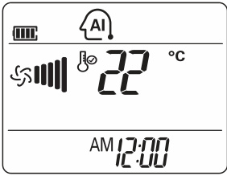
3.  按下上升 / 下降键设置所需温度，温度调节范围为 18 摄氏度（64 华氏度）-30 摄氏度（86 华氏度）。
4.  反复按下风速键选择风扇转速。
    注：部分机型不支持此功能。

**节能制冷模式**
该模式可最大限度降低制冷时的耗电量，并将设定温度调节至最适宜的水平，打造更舒适的环境。

1.  按下开 / 关键开启电源。
2.  反复按下模式键，选择制冷模式。
3.  按下节能键，显示屏上会显示节能标识。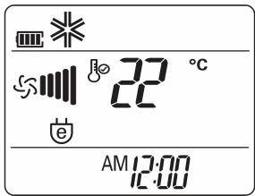
    注：部分机型不支持此功能。

### 自清洁运行与等离子净化运行

**自清洁运行**
制冷和除湿运行时，室内机内部会产生水汽，可使用自清洁功能去除水汽。

1.  按下自清洁键，显示屏上会显示自清洁标识。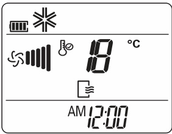

  - 若关闭电源，风扇将继续运行 30 分钟，对室内机内部进行清洁。
    注：自清洁功能运行时，部分按键无法使用。

**等离子净化运行**
本产品搭载的等离子滤网可彻底去除吸入空气中的微小污染物，输送洁净清新的空气。

1.  按下开 / 关键开启电源。
2.  按下等离子键，显示屏上会显示等离子标识。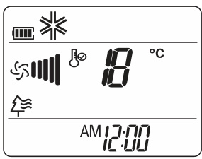
    注：
    ・无需开启空调，直接按下等离子键即可使用该功能。
    ・等离子净化功能运行时，等离子灯和制冷灯将同时亮起。
    ・部分机型不支持此功能。

## 设备与显示控制

### 显示屏亮度、无遥控器操作与自动重启设置

**显示屏亮度调节**
可调节室内机显示屏的亮度，按下亮度键，即可开启 / 关闭显示屏。注：部分机型不支持此功能。

**无遥控器操作空调**
遥控器无法使用时，可通过室内机的开 / 关键操作空调，此时风扇转速默认设为高速。

1.  打开前盖板，轻轻掀起盖板两侧即可。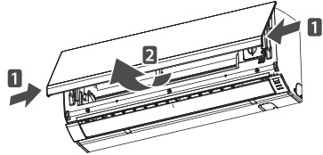 功能会根据机型有所调整。
2.  按下开 / 关键。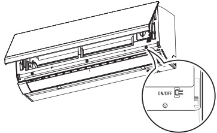 功能会根据机型有所调整。

  - 冷暖型机型的运行模式会根据室内温度自动切换。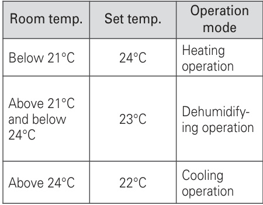
  - 单冷型机型的温度将默认设为 22 摄氏度（71.6 华氏度）。

**空调自动重启**
停电后再次开启空调时，该功能可恢复之前的运行设置，此功能为工厂默认设置。关闭自动重启功能：

1.  打开前盖板，轻轻掀起盖板两侧即可。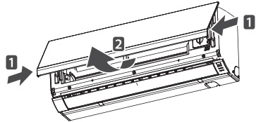 功能会根据机型有所调整。
2.  按住开 / 关键 6 秒钟，设备会发出两声蜂鸣，指示灯闪烁 6 次。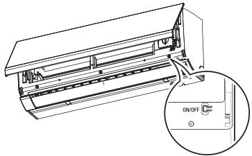 功能会根据机型有所调整。

  - 如需重新开启该功能，再次按住开 / 关键 6 秒钟即可，设备会发出两声蜂鸣，蓝色指示灯闪烁 4 次。
    注：若按住开 / 关键 3-5 秒而非 6 秒，空调将进入测试运行模式，该模式下空调会以强风制冷 18 分钟，之后恢复为工厂默认设置。

# 维护保养

## 滤网清洁与保养要求

### 维护前注意事项与空气滤网清洁

定期清洁产品，以保持最佳运行性能，防止设备出现故障。部分配件可能因机型不同而未配备。

进行任何维护操作前，请关闭电源并拔下电源线，否则可能导致触电。清洁滤网时，切勿使用 40 摄氏度以上的热水，以免造成滤网变形或变色。清洁滤网时，切勿使用挥发性物质，以免损坏产品表面。
注：请定期清洁室外机的热交换器盘管，盘管积垢可能会降低运行效率，增加能耗。

建议每两周清洁一次空气滤网，必要时可增加清洁频率。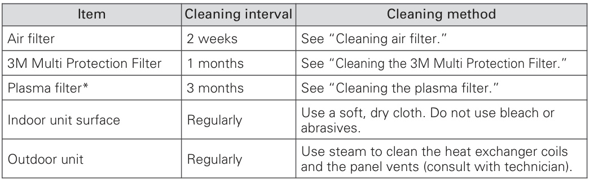

1.  关闭电源并拔下电源线。
2.  打开前盖板，轻轻掀起盖板两侧即可。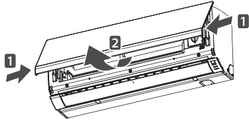 功能会根据机型有所调整。
3.  握住空气滤网的把手，轻轻向上提起，将其从机身中取出。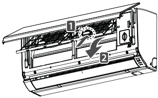 功能会根据机型有所调整。
4.  用吸尘器清理滤网，或用温水冲洗，若滤网污垢较难清理，可在温水中加入洗涤剂清洗。
5.  将滤网置于阴凉处晾干。

### 3M 多重防护滤网与等离子滤网清洁

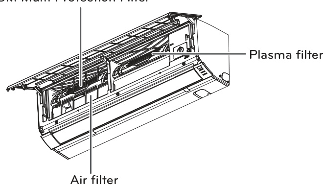 功能会根据机型有所调整。

**清洁 3M 多重防护滤网**

1.  关闭电源并拔下电源线。
2.  打开前盖板，取出空气滤网（详见 “清洁空气滤网”）。
3.  抽出 3M 多重防护滤网。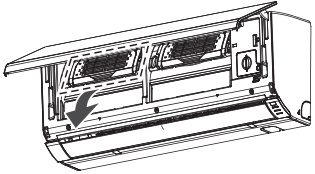 功能会根据机型有所调整。
4.  用吸尘器清理滤网污垢，切勿用水清洗 3M 多重防护滤网，以免造成滤网损坏。
    注：滤网的位置和形状可能因机型不同而有所差异。

**清洁等离子滤网**

1.  关闭电源并拔下电源线。
2.  打开前盖板，取出空气滤网（详见 “清洁空气滤网”）。
3.  在 10 秒内取下等离子滤网。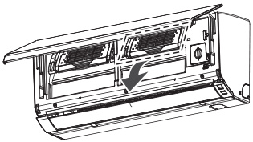 功能会根据机型有所调整。
4.  用吸尘器清理滤网污垢，若污垢较难清理，可用温水冲洗。
5.  将滤网置于阴凉处晾干。
    注：滤网的位置可能因机型不同而有所差异。部分机型可能未配备等离子滤网。

# 故障排除

## 自诊断与报修检查

### 自诊断提示与报修前检查

本产品内置自诊断功能，若发生故障，室内机指示灯会以 2 秒为间隔闪烁，出现此情况请联系当地经销商或服务中心。

报修前，请先检查以下事项，若问题仍未解决，再联系当地服务中心。
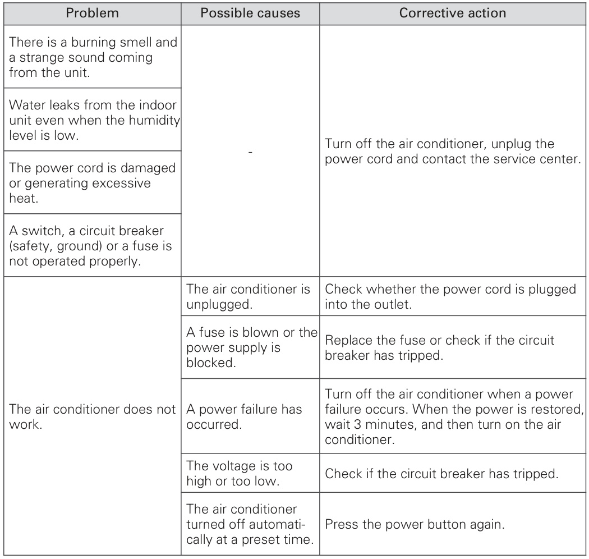
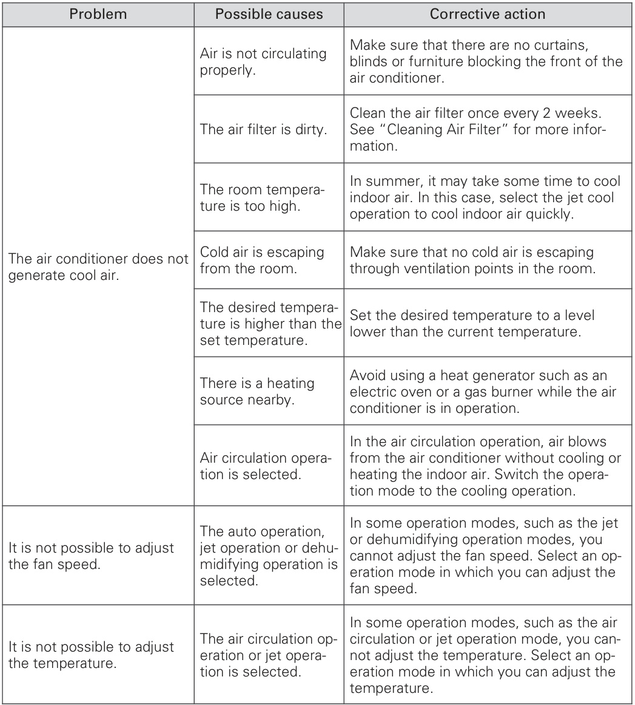
